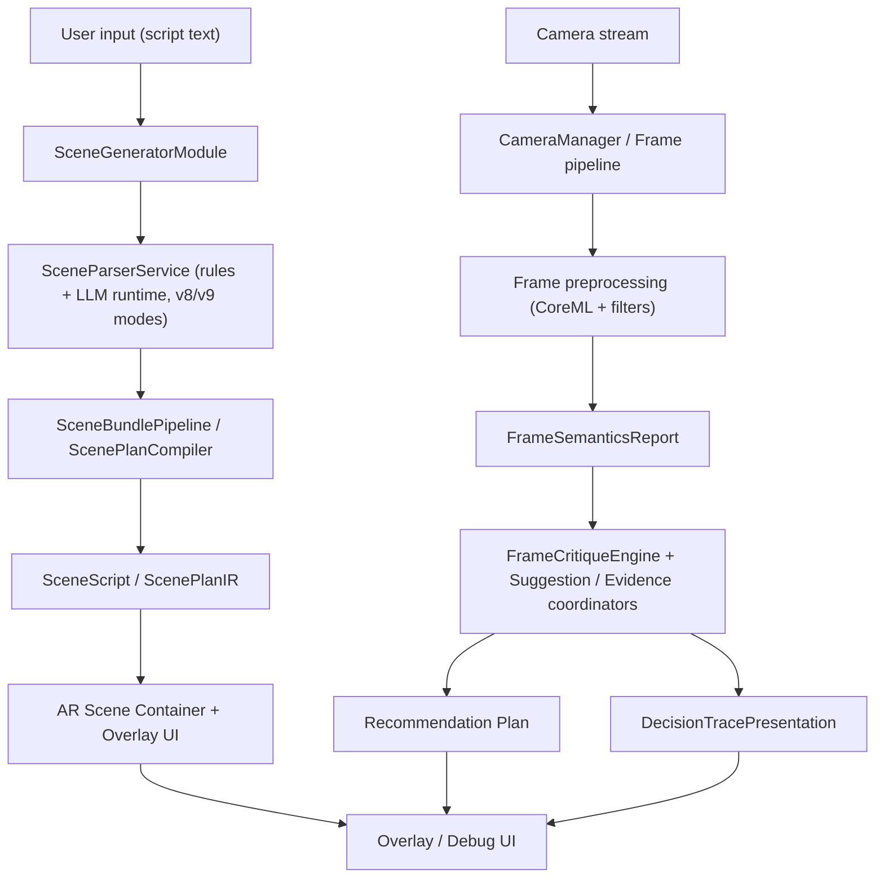

# Shafin Multitool

<div align="center">
  <strong>🌐 Language / Язык:</strong>
  <a href="#-overview">🇬🇧 English (default)</a> ·
  <a href="README.ru.md">🇷🇺 Русский</a>
</div>

<br />

> iOS app + research platform for pre-production workflows:
> screenplay text → structured `SceneScript` → scene visualization model + on-device camera analysis.


---

<a id="-overview"></a>

## 📌 Overview

Shafin Multitool combines two major domains:

1. **Scene Generator** — parsing and compiling script text into intermediate/target structures (`SceneScript`, `ScenePlanIR`, scene chunks).
2. **Camera Analysis Multitool** — video analysis mode with explainable critique (fast path + semantic hints + recommendation decomposition).

It also includes a **research track** for dataset generation and model comparison across generations (`SGv7 / SGv8 / SGv9` + camera-eval).

<details>
<summary><strong>What this README covers</strong></summary>

- How to run the project in Xcode.
- Repository map and module entry points.
- A practical command list for tests and experiments.
- Links to key docs (`docs/`, `experiments/`, `tests`).
- Concrete integration and debugging tips.

</details>

---

## 🔭 Contents

- [🚀 Stack & Capabilities](#-stack--capabilities)
- [🧭 Architecture](#-architecture)
- [🛠 Setup & Run](#-setup--run)
- [🧪 Testing](#-testing)
- [📁 Repository Structure](#-repository-structure)
- [📚 Research Track](#-research-track)
- [📈 Useful Commands](#-useful-commands)
- [🧩 Development Scenarios](#-development-scenarios)
- [🩺 Troubleshooting](#-troubleshooting)
- [🤝 Contributing](#-contributing)

---

## 🚀 Stack & Capabilities

### Core stack

- **Language / platform:** Swift 5.0, iOS (ARKit, Vision, CoreML)
- **LLM inference:** bundled `llama.cpp` via `llama.xcframework` + GBNF sampling
- **UI architecture:** modular composition using UIKit and SwiftUI pieces
- **Architecture:** feature-module decomposition, coordinator/interactor/presenter/builder patterns, dedicated service and model layers
- **AR overlays:** contextual hints rendered over camera feed (`shafinMultitool/Multitool2Module/UI/Overlay/*`)
- **Dependencies:** CocoaPods (`ARVideoKit`, `SnapKit`)

### What you can run from this codebase

| Block | What it gives |
|---|---|
| **Script generator** | Text → scene structure conversion, chunking, beat planning (`SceneGeneratorModule`) |
| **AR preview** | Camera scene visualization with overlays, runtime anchors and scene persistence |
| **Camera module** | Live frame stream, scheduler/governor, filtering and frame pre-processing |
| **Frame critique** | Deterministic critique core + evidence layer + recommendation plan (`Multitool2Module`) |
| **Research / benchmarking** | Full dataset + benchmark loop for SG/ORPO/plan variants |

---

## 🧭 Architecture



<details>
<summary><strong>Design intent:</strong> explainable-by-construction</summary>

For camera-pipeline, traceability is required for the chain
`observation → interpretation → recommendation` and all steps should remain inspectable in debug output.
For the script pipeline, the focus is end-to-end coherence between
`input text ↔ runtime trace ↔ SceneScript`, including v8/v9 modes and generated plans.

</details>

---

## 🛠 Setup & Run

### Prerequisites

- macOS with Xcode and iOS SDK
- Ruby + CocoaPods
- Git
- (Optional) Python 3 for research scripts

### Run the app

```bash
git clone <repo-url>
cd shafinMultitool
pod install
open shafinMultitool.xcworkspace
```

In Xcode:
1. Select the `shafinMultitool` target.
2. Choose an iOS simulator or a physical device (AR workflows are more stable on device).
3. Press `Cmd + R`.

### Before first launch

- `Info.plist` contains camera / microphone / photo library permissions.
- Some analysis flows may require a physical device and a full camera stack.
- If install/build fails after dependency changes:
  ```bash
  pod deintegrate && pod install
  ```

---

## 🧪 Testing

Tests are in `shafinMultitoolTests/` and focus on critical runtime blocks.

### Quick full test run

```bash
xcodebuild test \
  -workspace shafinMultitool.xcworkspace \
  -scheme shafinMultitool \
  -destination 'platform=iOS Simulator,name=iPhone 15'
```

### Target introspection

```bash
xcodebuild -list -workspace shafinMultitool.xcworkspace -json
```

### What to inspect first

- `xcodebuild` logs for test failures and dependency problems.
- `shafinMultitoolTests/README_TESTS.md` for structured test coverage mapping.
- For detailed camera-pipeline cases:
  - `shafinMultitoolTests/AnalysisPipelinePresentationTests.swift`
  - `shafinMultitoolTests/FrameCritiqueEngineTests.swift`
  - `shafinMultitoolTests/SemanticTipPlannerTests.swift`

<details>
<summary><strong>Minimal smoke checklist before push</strong></summary>

1. Open app and create/open a scene.
2. Run basic script parsing.
3. Verify live overlay (camera + suggestions) without crash.
4. Execute at least 1–2 key unit checks: `ScriptParsingTests`, `ConverterTests`.

</details>

---

## 📁 Repository Structure

<details>
<summary>🧱 <code>shafinMultitool/</code> — app + business logic</summary>

- `SceneGeneratorModule/` — parsing, compilation, scene validation.
- `Multitool2Module/` — frame analysis, critique, recommendations, inference pipeline.
- `SceneModules/` and `ScenesOverviewModule/` — screens and routing.
- `Services/` — system services (camera, storage, performance, speech recognition, etc.).
- `Entity/` — business domain models.

</details>

<details>
<summary>🧪 <code>shafinMultitoolTests/</code> — test suite</summary>

- Unit/API/Performance pipeline tests and supplemental checks.
- Reference index: [`shafinMultitoolTests/README_TESTS.md`](shafinMultitoolTests/README_TESTS.md)

</details>

<details>
<summary>📚 <code>docs/</code> — documentation + thesis workspace</summary>

- `docs/SGv7pipeline`, `docs/SGv8pipeline`, `docs/SGv9pipeline` — scene-generator generations and run artifacts.
- `docs/cameraanalysis/` — roadmap and explainability docs for camera pipeline.
- `docs/thesis/` — evidence map and claim registry (for thesis linkage).
- `docs/uml/` — diagram generators and UML exports.

</details>

<details>
<summary>🧪 <code>experiments/</code> — model benchmarking</summary>

- `sc_benchmark/` — benchmark orchestration and CLI.
- `generate_predictions_from_endpoint.py`, `run_scientific_benchmark.py`, `prepare_experiment_assets.py`.

</details>

<details>
<summary>🧾 Repository root artifacts</summary>

- `generate_dataset_v7.py` — canonical SceneScript entrypoint for SGv7.
- `generate_dataset_v2.py`, `generate_dataset_v6.py` — legacy/reference pipelines.
- `LLAMA_CPP_INTEGRATION.md` — llama integration notes.
- `Podfile`, `Podfile.lock`, `Frameworks/` (`llama.xcframework`).

</details>

---

## 📚 Research Track

Index for quickly jumping into DS/benchmark flow:

- SG pipelines:
  - [`docs/SGv7pipeline/README.md`](docs/SGv7pipeline/README.md)
  - [`docs/SGv8pipeline/README.md`](docs/SGv8pipeline/README.md)
  - [`docs/SGv9pipeline/README.md`](docs/SGv9pipeline/README.md)
- Camera analysis:
  - [`docs/cameraanalysis/README.md`](docs/cameraanalysis/README.md)
- Benchmark orchestration:
  - [`experiments/sc_benchmark/README.md`](experiments/sc_benchmark/README.md)
- Historical decisions:
  - [`diploma.md`](diploma.md)

<details>
<summary><strong>Which artifact to open when</strong></summary>

- **Quick status of experiments** → `docs/SGv9pipeline/runs/*`
- **Need to edit dataset pipeline** → `docs/SGv8pipeline` / `docs/SGv7pipeline`
- **Need metric pipeline validation** → `experiments/sc_benchmark`
- **Need thesis linkage** → `docs/thesis/03_evidence_map.md` and `docs/thesis/04_claim_registry.md` (if available in your branch)

</details>

---

## 📈 Useful Commands

### Dataset generation / validation (SGv7)

```bash
python3 generate_dataset_v7.py \
  --cir /path/to/cir.json \
  --original-description "Actor enters, sits down, and waves" \
  --output /tmp/scene_script.json
```

### Benchmarks

```bash
python3 experiments/sc_benchmark/prepare_experiment_assets.py
python3 experiments/sc_benchmark/run_scientific_benchmark.py \
  --config experiments/sc_benchmark/benchmark_config.example.json \
  --output-dir /tmp/sc_benchmark_run \
  --mode full
```

### Swift model visualization

```bash
python3 docs/uml/generate_swift_uml.py \
  shafinMultitool/SceneGeneratorModule/Models/SceneScript.swift \
  -o docs/uml/scene-script-models.mmd
```

---

## 🧩 Development Scenarios

### 1) Add a new camera recommendation source

1. Add model in `Multitool2Module/Models`.
2. Implement service contract in pipeline layer.
3. Add `Evidence` and `DecisionTrace` to `CameraAnalysisDomainContracts`.
4. Add coverage:
   - unit for the model,
   - integration in `AnalysisPipelinePresentationTests`.

### 2) Improve scene parsing

1. Update rules in `SceneParserService`/`Lemmatizer`/`SceneParseCoordinator`.
2. Review `diagnostics` and `SceneQualityGate`.
3. Run parsing tests and related scene smoke tests.

### 3) Prepare a new research run

1. Document contract changes in `docs/`.
2. Collect artifacts in `experiments/sc_benchmark/workspace` or `docs/SG*/runs/...`.
3. Run `run_scientific_benchmark.py` or local comparisons.
4. Update evidence notes if claims/metrics are affected.

---

## 🩺 Troubleshooting

<details>
<summary><strong>Build fails after Podfile changes</strong></summary>

- Run `pod install` and reopen `.xcworkspace`.
- Open `shafinMultitool.xcworkspace` (not `.xcodeproj`).
- Ensure Xcode/CocoaPods and `swiftlang` versions are compatible.

</details>

<details>
<summary><strong>LLM pipeline does not start</strong></summary>

- Verify GGUF path and runtime model path in config.
- Confirm `Frameworks/llama.xcframework` matches simulator/device architecture.
- Search logs for `LlamaContext` / `model load`.

</details>

<details>
<summary><strong>Camera does not start in simulator</strong></summary>

- Verify `Info.plist` permissions and usage descriptions.
- Simulators may limit ARKit features; prefer real device for full validation.
- Ensure the camera target is selected correctly for the active scheme/device.

</details>

---

## 🤝 Contributing

- Suggested cycle:
  1. Define a hypothesis in `docs/` (scope + acceptance criteria + DoD),
  2. Implement with tests,
  3. Run relevant test set,
  4. Update docs when claims/benchmarks change.

---

