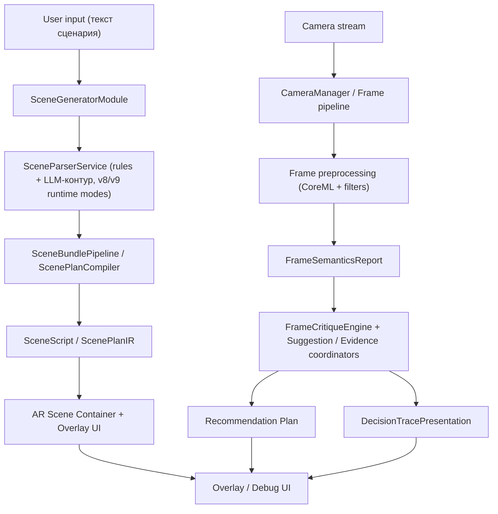

# Shafin Multitool

<div align="center">
  <strong>🌐 Язык / Language:</strong>
  <a href="README.md#-overview">🇬🇧 English (по умолчанию)</a> ·
  <a href="#russian-start">🇷🇺 Русский</a>
</div>

<br />
<a id="russian-start"></a>

> iOS-приложение и исследовательская платформа для препродакшн-процессов:  
> текст сценария → структурированный `SceneScript` → визуальная модель сцены + on-device анализ камеры.


**Shafin Multitool — проект для начинающих киноделов:** помогает быстро делать раскадровки на основе сценария и разбираться с камерой через объяснимый анализ кадров.

---

## 📌 Быстрый взгляд

Shafin Multitool объединяет две большие области:

1. **Scene Generator** — разбор и компиляция текстового сценария в промежуточные/целевые структуры (`SceneScript`, `ScenePlanIR`, чанки сцены).
2. **Camera Analysis Multitool** — режим видеоаналитики с explainable-критикой (fast path + semantic hints + пауза-декомпозиция рекомендаций).

Проект также содержит **исследовательский контур** для генерации датасетов и сравнения разных моделей/версий (SG v7/v8/v9 + camera-eval).

<details>
<summary><strong>Что делает этот README</strong> (показать быстрое содержание)</summary>

- Объясняет, как запустить проект в Xcode.
- Даёт карты по структуре репозитория и входящим модулям.
- Даёт набор рабочих команд для тестов и экспериментов.
- Содержит ссылки на все ключевые документы (`docs/`, `experiments/`, `tests`).
- Даёт практические подсказки по интеграции и отладке.

</details>

---

## 🔭 Содержание

- [🚀 Стек и возможности](#-стек-и-возможности)
- [🧭 Архитектура](#-архитектура)
- [🛠 Установка и запуск](#-установка-и-запуск)
- [🧪 Тестирование](#-тестирование)
- [📁 Структура репозитория](#-структура-репозитория)
- [📚 Исследовательский контур](#-исследовательский-контур)
- [📈 Полезные команды и скрипты](#-полезные-команды-и-скрипты)
- [🧩 Типовые сценарии разработки](#-типовые-сценарии-разработки)
- [🩺 Диагностика проблем](#-диагностика-проблем)

---

## 🚀 Стек и возможности

### Ключевые технологии

- **Язык/платформа:** Swift 5.0, iOS (ARKit, Vision, CoreML)
- **LLM-инференс:** встроенный `llama.cpp` через `llama.xcframework` + GBNF-сэмплинг
- **Дизайн UI:** UIKit + SwiftUI-компоненты в модульной композиции
- **Архитектурный подход:** модульная декомпозиция feature-модулей, coordinator/interactor/presenter/ builder-паттерны, отдельный слой сервисов и моделей
- **UI оверлеи:** наложение подсказок поверх камеры (`shafinMultitool/Multitool2Module/UI/Overlay/*`)
- **Зависимости через CocoaPods:** `ARVideoKit`, `SnapKit`

### Что можно запустить из проекта

| Блок | Что это даёт |
|---|---|
| **Сценарный генератор** | Конвертация текста в структуру сцены, разбиение на чанки, планирование beat-структуры (`SceneGeneratorModule`) |
| **AR-предпросмотр** | Визуализация с наложениями, работа с камерами AR, сохранение сцен и якорей |
| **Камера-модуль** | Реальный поток видеоданных, thermal/governor, scheduler и кадрирование/фильтрация |
| **Критика кадра** | Deterministic-ядро критики + evidence-слой + план рекомендаций (`Multitool2Module`) |
| **Эксперименты и оценки** | Полный датасетный/benchmark контур для SG/ORPO/plan-подходов |

---

## 🧭 Архитектура



<details>
<summary><strong>Ключевая идея:</strong> explainable-by-construction</summary>

Проект строится не как "чёрный ящик". Для camera-pipeline важны цепочки
`observation → interpretation → recommendation`, которые сохраняются в trace и могут быть показаны пользователю/разработчику. Для сценарного пайплайна важна связность `input text ↔ runtime trace ↔ SceneScript`, в том числе режимов v8/v9 и планов.

</details>

---

## 🛠 Установка и запуск

### Предварительно

- macOS с Xcode и iOS SDK
- Ruby + CocoaPods
- Git
- (Опционально) Python 3 для research-скриптов

### Запуск приложения

```bash
git clone <repo-url>
cd shafinMultitool
pod install
open shafinMultitool.xcworkspace
```

Затем в Xcode:
1. Выберите `shafinMultitool` workspace/target.
2. Device: iOS Simulator или физическое устройство (AR-инструменты лучше проверять на устройстве).
3. Запустите `Cmd + R`.

### Что важно учесть перед запуском

- В `Info.plist` заданы права камеры/микрофона/photo library.
- Для некоторых потоков анализа может потребоваться физическое устройство с полноценной камерной подсистемой.
- Если проект долго не собирается после обновления зависимостей:
  ```bash
  pod deintegrate && pod install
  ```

---

## 🧪 Тестирование

Тестовый набор находится в `shafinMultitoolTests/` и активно используется для валидации критичных блоков.

### Быстрый запуск всех тестов

```bash
xcodebuild test \
  -workspace shafinMultitool.xcworkspace \
  -scheme shafinMultitool \
  -destination 'platform=iOS Simulator,name=iPhone 15'
```

### CLI для диагностики таргета

```bash
xcodebuild -list -workspace shafinMultitool.xcworkspace -json
```

### Что смотреть в первую очередь

- Логи `xcodebuild` по падениям тестов и зависимостям.
- В `shafinMultitoolTests/README_TESTS.md` — структурированный перечень тестов и ожидаемое покрытие.
- Для детальных кейсов по camera pipeline используйте:
  - `shafinMultitoolTests/AnalysisPipelinePresentationTests.swift`
  - `shafinMultitoolTests/FrameCritiqueEngineTests.swift`
  - `shafinMultitoolTests/SemanticTipPlannerTests.swift`

<details>
<summary><strong>Минимальный набор smoke-проверок перед пушем</strong></summary>

1. Открыть приложение и создать/открыть сцену.
2. Прогнать базовый парсинг сценария.
3. Проверить live overlay (камера + подсказки) без краша.
4. Запустить 1–2 ключевых unit-кейса: `ScriptParsingTests`, `ConverterTests`.

</details>

---

## 📁 Структура репозитория

<details>
<summary>🧱 <code>shafinMultitool/</code> — клиент и бизнес-логика</summary>

**Секции:**

- `SceneGeneratorModule/` — парсинг, компиляция, валидация сцен.
- `Multitool2Module/` — анализ видеопотока, critique, рекомендации, пайплайн инференса.
- `SceneModules/` и `ScenesOverviewModule/` — экраны/роутинг.
- `Services/` — системные сервисы (камера, база, производительность, speech recognition и пр.).
- `Entity/` — модели бизнес-доменов.

</details>

<details>
<summary>🧪 <code>shafinMultitoolTests/</code> — автотесты</summary>

- Unit/API/Performance/добавочные pipeline тесты.
- Подробный индекс: [`shafinMultitoolTests/README_TESTS.md`](shafinMultitoolTests/README_TESTS.md)

</details>

<details>
<summary>📚 <code>docs/</code> — документация и научный журнал</summary>

- `docs/SGv7pipeline`, `docs/SGv8pipeline`, `docs/SGv9pipeline` — версии генератора сцен и артефакты запусков.
- `docs/cameraanalysis/` — roadmap и документы по explainable camera pipeline.
- `docs/thesis/` — evidence map и claim registry (для thesis-связки).
- `docs/uml/` — генераторы схем и UML-диаграммы.

</details>

<details>
<summary>🧪 <code>experiments/</code> — benchmark/оценка моделей</summary>

- `sc_benchmark/` — оркестратор научных прогонаов и CLI-скрипты.
- `generate_predictions_from_endpoint.py`, `run_scientific_benchmark.py`, `prepare_experiment_assets.py`.

</details>

<details>
<summary>🧾 Выбранные артефакты репозитория</summary>

- `generate_dataset_v7.py` — canonical SG v7 entrypoint для SceneScript-проекции.
- `generate_dataset_v2.py`, `generate_dataset_v6.py` — более старые пайплайны/референсы.
- [`docs/integrations/llama-cpp-integration.md`](docs/integrations/llama-cpp-integration.md) — базовые шаги интеграции.
- [`data/legacy/dataset_finetune.jsonl`](data/legacy/dataset_finetune.jsonl), [`data/legacy/dataset_finetune_v2.jsonl`](data/legacy/dataset_finetune_v2.jsonl) — старые обучающие корпуса.
- `Podfile`, `Podfile.lock`, `Frameworks/` (`llama.xcframework`).

</details>

---

## 📚 Исследовательский контур

Ниже — быстрый index для работы с DS/benchmarks без погружения в весь проект:

- SG pipeline:
  - [`docs/SGv7pipeline/README.md`](docs/SGv7pipeline/README.md)
  - [`docs/SGv8pipeline/README.md`](docs/SGv8pipeline/README.md)
  - [`docs/SGv9pipeline/README.md`](docs/SGv9pipeline/README.md)
- Camera analysis:
  - [`docs/cameraanalysis/README.md`](docs/cameraanalysis/README.md)
- Benchmark orchestration:
  - [`experiments/sc_benchmark/README.md`](experiments/sc_benchmark/README.md)
- Архивные и логические решения:
  - [`diploma.md`](diploma.md)

<details>
<summary><strong>Когда смотреть какие артефакты</strong></summary>

- **Нужно быстро понять состояние экспериментов** → `docs/SGv9pipeline/runs/*`
- **Нужно изменить dataset-контур** → `docs/SGv8pipeline`/`docs/SGv7pipeline`
- **Нужно проверить корректность metric pipeline** → `experiments/sc_benchmark`
- **Нужно связать с диссертацией** → `docs/thesis/03_evidence_map.md` и `docs/thesis/04_claim_registry.md` (при существующем доступе)

</details>

---

## 📈 Полезные команды и скрипты

### Генерация/валидация датасета (SGv7)

```bash
python3 generate_dataset_v7.py \
  --cir /path/to/cir.json \
  --original-description "Актёр входит, садится и машет рукой" \
  --output /tmp/scene_script.json
```

### Benchmarks

```bash
python3 experiments/sc_benchmark/prepare_experiment_assets.py
python3 experiments/sc_benchmark/run_scientific_benchmark.py \
  --config experiments/sc_benchmark/benchmark_config.example.json \
  --output-dir /tmp/sc_benchmark_run \
  --mode full
```

### Визуальная схема Swift-моделей

```bash
python3 docs/uml/generate_swift_uml.py \
  shafinMultitool/SceneGeneratorModule/Models/SceneScript.swift \
  -o docs/uml/scene-script-models.mmd
```

---

## 🧩 Типовые сценарии разработки

### 1) Добавить новый источник рекомендаций камеры

1. Начни с модели in `Multitool2Module/Models`.
2. Реализуй контракт в соответствующем сервисе пайплайна.
3. Добавь `Evidence`/`DecisionTrace` в `CameraAnalysisDomainContracts`.
4. Покрой тестами:
   - unit для модели;
   - integration на уровне `AnalysisPipelinePresentationTests`.

### 2) Улучшить парсинг сценария

1. Измени правила в `SceneParserService`/`Lemmatizer`/`SceneParseCoordinator`.
2. Проверь `diagnostics`-метрики и `SceneQualityGate`.
3. Прогоните тесты парсинга и соответствующие сценарные smoke.

### 3) Подготовить новый research run

1. Зафиксируй контракт в `docs/`.
2. Собери артефакты в `experiments/sc_benchmark/workspace` или в новой папке `docs/SGv*/runs/...`.
3. Прогони `run_scientific_benchmark.py` или локальные сравнения.
4. Обнови evidence-ноты, если изменения затрагивают релевантный этап.

---

## 🩺 Диагностика проблем

<details>
<summary><strong>Сборка падает после изменения Podfile</strong></summary>

- Выполни `pod install` и перезагрузи `.xcworkspace`.
- Убедись, что открываешь не `.xcodeproj`, а `shafinMultitool.xcworkspace`.
- Проверь версию Xcode для `swiftlang`/CocoaPods совместимости.

</details>

<details>
<summary><strong>LLM-контур не стартует</strong></summary>

- Проверить наличие файла GGUF и корректные пути в runtime-конфигурациях.
- Убедиться, что `Frameworks/llama.xcframework` соответствует архитектуре симулятора/девайса.
- В логах искать `LlamaContext` / `model load` метки.

</details>

<details>
<summary><strong>Камера не стартует в симуляторе</strong></summary>

- Проверь `Info.plist` usage descriptions и доступы.
- На симуляторе возможны ограничения ARKit; для стабильной проверки используйте устройство.
- Проверь, что pipeline действительно использует тестовый target device (iPhone).

</details>

---

## 🤝 Как вносить вклад

- Предпочтительный цикл:
  1. Описать гипотезу в `docs/` (scope + acceptance criteria + DoD),
  2. Закрыть реализацией + тестами,
  3. Прогнать релевантный набор тестов,
  4. Обновить ссылки/заметки в docs при изменении claims/benchmarks.

---

## ✅ Лицензия и авторские права

В корне репозитория нет отдельного файла лицензии; если проект готовится как публичный open-source, добавьте `LICENSE` перед публикацией.

---

## 👋 Если хочешь, я дам следующий шаг

Если эта версия тебе нравится, следующим сообщением могу собрать:

- `readme` с **языковой альтернативой (EN)**,
- **тематические badges** для статуса CI/Tests после настройки пайплайна,
- версию с большим акцентом на **презентацию для GitHub Pages / CV**.
