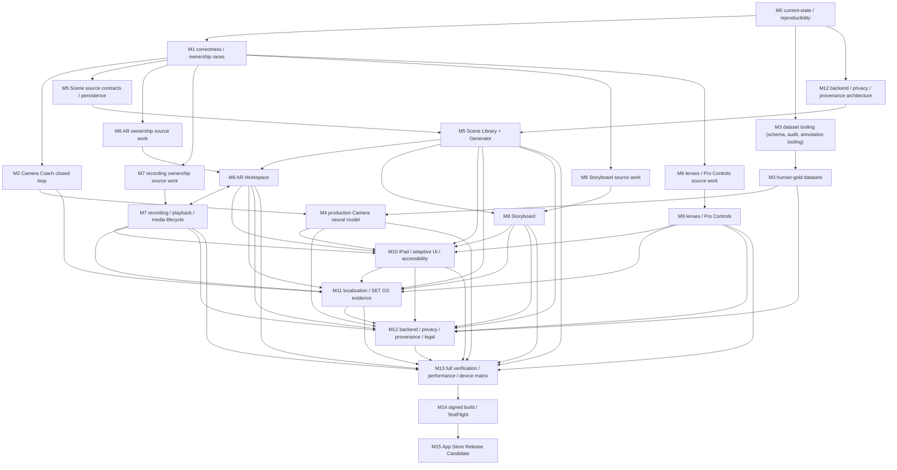

# SET OS / Shafin Multitool — App Store 1.0 Codex Master Plan v2

**Document status:** active full-scope execution authority.  
**Replaces:** `SET_OS_APP_STORE_1_0_CODEX_MASTER_PLAN.md`.  
**Snapshot basis:** uploaded handoff dated 2026-09-03 plus current official Apple release requirements checked on 2026-09-03.  
**Required output:** one verified signed App Store build containing the full owner-approved 1.0 scope.  
**Visual authority:** `docs/implementation/ux/set-os-visual-policy.md` — SET OS v2.6.

**Актуальное продолжение от 2026-09-11:** [§24 — подробный план доведения сервера, клиента, ML и выпуска](#24-план-доведения-до-app-store--2026-09-11). Читать его первым при продолжении работ. Числа readiness, READY_NOW и FIRST_EXECUTION_PACKET в исходных §1–23 относятся к исходному снимку, не являются текущим процентом готовности и не требуют повторить уже закрытый M0. Новое расширение Camera Coach описано как предложение релизного охвата с явными approval gates; оно не отменяет исходные ограничения молча.

## Operating constraints

- Start every execution wave by inspecting the actual current diff and protecting user changes.
- Do not use `git reset`, `git clean`, `git stash`, force checkout, or worktree creation.
- Do not commit or push without separate owner authorization.
- Do not edit `docs/thesis/litreview*`.
- Do not use or require iPhone 17 Pro.
- Preserve CommercialShell route semantics, awaited asynchronous teardown, and existing accessibility identifiers unless a tested migration is required.
- Do not report source, test, simulator, physical-device, or signed-distribution evidence as a stronger class than it is.
- Do not restart moodboarding or create a second design system.
- A test file is a contract until freshly executed. A mock/fixture is not production evidence. A simulator does not prove camera, ARKit, microphone, Photos, recording, A/V sync, thermal behavior, or hardware timing.
- A fixed-scope feature that misses its gate remains a release **NO-GO** with remediation; it is not silently deleted to make the plan easier.

---

# 1. EXECUTIVE_VERDICT

## Readiness: **21 / 100**

This score reflects readiness for the newly fixed **full-scope** App Store 1.0, not the amount of code already present.

| Area | Score | Basis |
|---|---:|---|
| Product and visual direction | 12/15 | The core pain, Camera-first positioning, full Scene workflow, and SET OS v2.6 are established |
| Existing source breadth | 16/25 | Camera analysis, Library, Generator, AR, Storyboard, recording, shell, persistence, and tests have substantial source-backed foundations |
| Correctness and product closure | 4/20 | Core before→after coaching, stable subject identity, several ownership races, and multiple fixed states remain unproven or incomplete |
| Neural/data quality | 2/15 | Existing 207-case quality is below release safety; human-gold splits and the required production neural replacement do not exist |
| Release/privacy/legal | 5/15 | Validators and a privacy manifest exist, but component dispositions, backend/privacy contract, signed archive, and ASC validation are not closed |
| iPhone/iPad physical evidence and beta | 0/10 | No complete device matrix or exact-binary external beta evidence is available |

## Brutal conclusion

The product is not a “nearly finished app needing polish.” It is a broad integrated system with several real foundations, but it still lacks one proven production chain across:

1. **Camera value:** stable subject → neural evidence → safe advice → observed movement → truthful verification.
2. **Scene value:** real persistence → production Generator → validated SceneScript → AR → Storyboard → recording/media recovery.
3. **Release truth:** human-gold evaluation → real-device qualification → exact signed binary → TestFlight → App Store evidence.

The owner-approved scope is feasible, but it is not an MVP. For one developer with Codex it is a multi-milestone production program. Calendar promises made before M0 throughput and external-resource confirmation are not trustworthy; the likely order of magnitude is many months rather than a short “final sprint.”

## Three principal blockers

1. **The current checkout and evidence are not a reproducible candidate.** The handoff reports a large dirty state, stale/conflicting documents, partial historical test evidence, and no signed exact-binary chain.
2. **The mandatory neural Camera product is not release-quality.** The broader 207-case run reported pass `0.671498`, expected-action hit `0.748792`, forbidden-action violation `0.188406`, and good-frame preservation `0.875`. The perfect 107-case run is development evidence, not an unseen holdout.
3. **The full Scene/AR/recording/iPad product is not physically and legally qualified.** Simulator/source/tests cannot prove world tracking, real lenses, microphone, A/V sync, low-disk recovery, thermal behavior, iPad adaptation, model/data rights, or Apple distribution.

## DO NOT BUILD

Until the critical path reaches the relevant gates, stop:

- new moodboards, visual resets, and parallel design systems;
- new product sections outside the fixed scope;
- Deep Review, paid tiers, credits, subscriptions, account sync, or media cloud sync;
- a second Scene backend, multi-provider runtime abstraction, or microservices;
- additional DETR/NIMA threshold tuning on known records;
- arbitrary free-text neural advice;
- fake thumbnails, fake lens choices, simulated progress, or fixture-only production states;
- decorative UI polishing that does not close a correctness, accessibility, or evidence defect;
- wholesale refactors that combine unrelated owners;
- removal of the current neural/Scene capability before a replacement passes the defined gates.

## Release strategy

The full scope remains fixed, but implementation is gate-driven:

1. establish current truth;
2. close ownership races;
3. close the Camera loop;
4. build human-gold data;
5. deliver the production Camera neural model;
6. productionize Library/Generator;
7. close AR, recording, Storyboard, lenses/Pro, and iPad;
8. close SET OS/localization/accessibility;
9. close backend/privacy/provenance/legal;
10. execute complete device/performance verification;
11. qualify one exact signed TestFlight binary;
12. create the App Store RC.

No later stage may be used to hide a failed earlier gate.

---

# 2. SUPERSEDED_DECISIONS

The following decisions from the previous master plan are superseded and must not guide implementation:

| Superseded decision | Replacement in this document |
|---|---|
| Camera-only public build | Full Camera + Scene Library + Generator + AR + Storyboard + recording product |
| Remove Scene Library | Scene Library is mandatory and persistence-backed |
| Remove Scene Generator | Generator is mandatory with a production model/backend path and local fallback |
| Remove AR Workspace | AR Workspace is mandatory on iPhone and iPad with physical evidence |
| Remove Storyboard | Storyboard is mandatory and linked to generated scenes, AR, and media |
| Remove recording/playback/export | Full recording/media lifecycle is mandatory |
| Remove lens switching | Real discovered physical lenses are mandatory |
| Rear-wide-only | Every user-visible lens option must map to real available hardware |
| Remove Pro Controls | A defined minimal Pro Controls set is mandatory |
| iPhone-only | iPhone and iPad are first-class release platforms |
| Vision/rules-only production Camera | A measurable trainable neural component is mandatory |
| Remove DETR/NIMA immediately | They remain until a verified replacement passes; final status is `REMOVE_AFTER_VERIFIED_REPLACEMENT` |
| No backend at all | Live Camera remains local; Scene Generator requires one minimal production backend |
| Scene/recording legal blockers become irrelevant | Every shipped or replaced model/media/framework still needs a machine disposition and legal evidence |

The previous plan remains useful only as historical audit material. This document is self-contained and authoritative for execution.

---

# 3. FIXED_APP_STORE_1_0_SCOPE

## 3.1 Camera Coach

Public 1.0 includes:

- complete entry, permission, denied/restricted/unavailable/recovery flow;
- real live camera preview;
- automatic person/object/group resolution;
- tap-to-select when intent is ambiguous;
- stable selected-subject tracking;
- composition and technical issue recognition;
- a mandatory trainable on-device neural component;
- Apple Vision and deterministic geometry/safety/verifier;
- one safe recommendation at a time;
- target-linked SET OS marker geometry;
- `KEEP`, `CORRECT`, `SELECT_SUBJECT`, `WAIT`, `ABSTAIN`;
- short deterministic “Почему?” explanation;
- `detect → advise → observe movement → verify`;
- `improved`, `unchanged`, `worse`, `incomparable`;
- portrait and landscape;
- RU and EN;
- Dynamic Type, VoiceOver, Reduce Motion and Reduce Transparency;
- real interruption, unavailable, thermal, and failure states.

## 3.2 Scene Library

Public 1.0 includes:

- empty, loaded, and selected states;
- create and rename;
- duplicate-name handling;
- delete confirmation;
- persistence failure and retry;
- real preview derived from owned media/storyboard, or an explicit metadata placeholder;
- stable links to Generator, AR, Storyboard, and recording artifacts;
- iPhone and iPad layouts.

## 3.3 Scene Generator

Public 1.0 includes:

- screenplay input and keyboard states;
- detected/manually marked objects;
- clarification;
- accepted, leader, queued/progress;
- cancel, background/recovery;
- validation, parse, network, quota, model, malformed-response, and persistence failures;
- retry and idempotency;
- structured validated success;
- production model delivery;
- handoff to AR and Storyboard;
- a useful local deterministic parser/fallback when network is unavailable.

## 3.4 AR Workspace

Public 1.0 includes:

- preparing, ready, and surface search;
- placement and marking;
- live hints and hint pause;
- playback and recording;
- interruption, relocalization, reset, and errors;
- awaited asynchronous teardown;
- world-map/anchor lifecycle and recovery;
- iPhone and iPad portrait/landscape/adaptive layouts;
- physical-device evidence.

## 3.5 Storyboard

Public 1.0 includes:

- tray collapsed and expanded;
- selection and reflow;
- result and inspector;
- medium and large editor;
- transactional save;
- field-linked validation failure;
- delete confirmation and reorder;
- marker-name sheet;
- Decision Trace / “Почему?”;
- real Scene/AR/recording relationships;
- persistence and legacy-project migration.

## 3.6 Video recording and media lifecycle

Public 1.0 includes:

- camera and microphone capture;
- start/stop/finalize with one owner;
- orientation and metadata;
- interruption/background recovery;
- race-safe stop/finalize;
- measured A/V sync;
- dropped-frame policy;
- playback;
- Photos export and share;
- retention;
- Pending journal/promotion;
- cold-launch and OS-kill recovery;
- low-disk behavior;
- project deletion and orphan cleanup;
- privacy disclosure and physical-device qualification.

## 3.7 Lenses and Pro Controls

Public 1.0 includes:

- only real discovered physical lenses;
- user-facing `0.5×`, `1×`, `2×` only where hardware semantics are true;
- serialized switching and session continuity;
- minimal Pro Controls:
  - resolution/FPS format,
  - Auto exposure and EV,
  - manual shutter angle and ISO,
  - Auto/tap-lock/manual focus,
  - Auto/preset/lock/temperature white balance,
  - truthful audio level meter,
  - torch when supported;
- Coach/recording compatibility;
- iPhone/iPad portrait/landscape and accessibility.

Histogram, zebra, focus peaking, LUTs, waveform, and manual audio gain are post-1.0 unless already required by a proven dependency. They are not part of this fixed scope.

## 3.8 iPad

iPad is a first-class platform:

- Camera, Library, Generator, AR, Storyboard, recording/playback, lenses/Pro;
- intentional compact/regular layouts;
- portrait and landscape;
- resizable Library/Generator/Storyboard;
- minimum-window recovery for camera/AR/recording when the active window is too small;
- software and hardware keyboard;
- Dynamic Type, VoiceOver, Reduce Motion/Transparency;
- physical iPad matrix and App Store media.

## 3.9 Scope not added

The following are not approved 1.0 requirements and must not expand the critical path:

- public History section unless backed by a separately accepted persisted-history contract;
- Deep Review;
- subscription, credits, StoreKit, accounts;
- cloud media/project sync;
- collaborative editing;
- social/community features;
- arbitrary generative Camera advice;
- remote live Camera inference.

A legacy History enum/stub may remain internally only if it is unreachable and does not appear in public navigation or metadata.

---

# 4. VERIFIED_SYSTEM_MAP

“Test-backed” means a test contract or historical focused result exists. It does not mean the current checkout passes.

| Subsystem | Source-backed implementation | Test-backed contract | Fixture/doc-only or historical | Missing/uncertain | Release impact |
|---|---|---|---|---|---|
| Launch/CommercialShell | Camera-first shell, lazy routes, single active child, awaited deactivation | CommercialShell launch/routing/mode-control tests | Older navigation decisions and screenshots | Current exact checkout run | Preserve route semantics; full routes remain |
| Camera entry | Intro, permission context, blocked states, Settings recovery | Entry model/presentation/UI tests | Simulator permission states | Device first-run matrix | P0 device gate |
| Camera capture | AVCapture manager, scheduler, lifecycle, lens discovery | Lifecycle/scheduler/lens tests | Benchmark fixtures | Hardware timing/interruption | P0 device gate |
| Subject detection | Vision face/person/saliency and DETR path | Pipeline and DETR tests | Mock observations | Stable identity and intent | P0 |
| Subject tracking | File named `VisionTracking` performs repeated detection | Some unit seams | Documentation expects tracking | True temporal tracking | P0 |
| Horizon/light/technical | Horizon, lighting, technical heuristics | Pipeline/critique tests | Synthetic fixtures | Orientation calibration, masked background, focus truth | P0/P1 |
| DETR | Core ML wrapper and Release history | DETR tests | Confidence partly derived from component area | Provenance, calibrated utility | Transitional only |
| NIMA | Core ML aesthetic wrapper | Fusion/pipeline tests | Fixed threshold assumptions | Operational calibration/provenance | Transitional only |
| Compact neural evidence | Rich contracts, inference/fusion scaffolding | Mock/provider/fusion tests | Mock snapshots | Production artifact absent | Must be replaced |
| Deterministic critique/planner | Critique, semantic planner, recommendation contract | Extensive domain/planner tests | Python proxy approximates behavior | Safe calibrated final policy | Keep as safety/planner |
| Camera UI | Seeking/corrective/keep/why/pause/markers | Presentation/UI tests | Some fixture screenshots | select/track/verify/outcomes, occlusion fix | P0 |
| Camera verification | Product/state docs describe before/after | No complete production-owner evidence | Contract/analytics claims | Movement observer, episode, verifier | P0 |
| Scene Library | Real persistence provider/model and SET production view | Library unit/UI tests | Fixture provider and problematic screenshot | Rename, previews, selected-row fix, full links | P0/P1 |
| Generator local parser | Rule parser, lemmatizer, matching, compiler | Large parser/pipeline suites | Historical benchmark claims | Production quality and clarified ownership | P0 |
| Generator neural path | llama/GGUF integration and environment paths exist | Model/parser benchmark infrastructure | GGUF excluded from Release; historical runs | Production provider/model/legal path | P0 |
| Generator UI | Input/progress/result and substantial state source | Generator UI tests | Fixture launch modes | Reachable clarification, network/model production errors | P0 |
| AR Workspace | AR container, placement, anchors, maps, hints, teardown | Teardown/coordinator/source tests | Simulator unavailable states | Physical world tracking/restore | P0 |
| Storyboard | Tray/selection/inspector/editor/trace views in workspace shell | Scene/presentation tests | Fixture state captures | Persistence transaction and real media linkage proof | P0/P1 |
| Recording | CameraService, serialized recorder, adapters, controller | Extensive recorder/controller tests | Simulator artifacts | A/V sync, races, low-disk, OS-kill device proof | P0 |
| Artifact storage | Application Support/Pending/project paths and safe path checks | Save/load/artifact tests | Host temp fixtures | Full transaction/recovery evidence | P0 |
| Playback/Photos/share | Source paths exist | Adapter/controller tests | Simulator/fake adapters | Physical permission/media proof | P0 |
| Lenses | Discovery/switch transaction/zoom UI | Lens transaction/view-model tests | Fixture lens options | Truthful device mapping | P0 |
| Pro Controls | Legacy settings/camera setters exist | Settings tests | Some values are generic lists | One canonical device-derived owner and UI | P0/P1 |
| iPad | Target historically includes iPhone+iPad; Scene landscape path | Layout/UI source has adaptive fragments | No complete iPad evidence | Full first-class adaptation/device matrix | P0 |
| SET OS v2.6 | Tokens, typography, components, motion/event ledger | Design token/gallery/glyph tests | Approved concept and fixture captures | Final complete screen evidence | Preserve; no redesign |
| Localization/accessibility | RU/EN catalogs, IDs, Dynamic Type and Reduce Motion seams | Catalog/glyph/UI tests | Mechanical translations | Native editorial/manual device pass | P1 |
| Backend/offload | VLM/offload contracts and mock/environment transport | Coordinator/mock tests | No production service | Scene backend, auth, quota, retention | P0 |
| Privacy | App privacy manifest and usage strings exist | Validators/self-tests | Older docs say manifest missing | Final data-flow/ASC/policy alignment | P0 |
| Release tooling | Bundle/privacy/provenance gates and negative fixtures | Shell/Python tests | Summary hard-codes six while script has eleven | Machine dispositions and current clean run | P0 |
| Test topology | App, unit, UI targets and broad suites exist | Roughly 850 method inventory reported | Saved focused results | Fresh complete green suite | P0 |
| Signed distribution | No source-backed current signed RC evidence | None | Historical unsigned builds | Archive, codesign, Validate, ASC, TestFlight | P0 |

## Evidence hierarchy

From weakest to strongest:

1. documentation claim;
2. mock/fixture;
3. source-backed implementation;
4. test contract;
5. fresh simulator unit/UI result;
6. actual Swift runtime locked evaluation;
7. physical-device result;
8. signed archive inspection;
9. Apple Validate/processed ASC build;
10. exact-binary TestFlight evidence.

A higher-level claim must never be closed by a lower-level artifact.

---

# 5. P0_P1_P2_BLOCKER_REGISTER

## P0

| ID | Evidence/root cause | User/release risk | Closure |
|---|---|---|---|
| BL-P0-01 | Dirty, unclassified checkout at handoff | Evidence cannot be tied to binary | M0 current-state receipt and reproducible candidate |
| BL-P0-02 | Camera advice direction names camera motion while markers/subject geometry can imply the opposite | User moves the wrong way | Canonical subject-displacement contract and exhaustive transforms |
| BL-P0-03 | Mixed-age pause evidence | Explanation can describe another moment | Immutable AcceptedFrameEnvelope |
| BL-P0-04 | No stable subject identity or complete tap intent | Advice jumps between people/objects | Resolver, user selection, temporal track, invalidation |
| BL-P0-05 | No production before→after owner | Product ends at advice | Episode coordinator, movement observer, verifier |
| BL-P0-06 | 207-case Camera quality far below safe thresholds | Harmful/untrusted advice | Human-gold data, production neural replacement, sealed gates |
| BL-P0-07 | Perfect 107-case run is not unseen evidence | False quality confidence | Mark as development regression; locked shoot-level holdout |
| BL-P0-08 | Required trainable neural artifact is absent | Fixed product requirement unmet | SETCompositionNet-v1 delivery and measurable contribution |
| BL-P0-09 | DETR/NIMA provenance and operational semantics unresolved | Legal/quality risk | Verified replacement, then remove from Release |
| BL-P0-10 | Scene Generator Release model story is broken: GGUF excluded, llama remains, fallback quality unclear | Generator may fail or ship illegal/heavy artifacts | Backend model + local parser + locked Scene eval |
| BL-P0-11 | Generator clarification/retry/background ownership incomplete | Lost/duplicated requests or unusable ambiguity | Typed state machine and idempotent backend |
| BL-P0-12 | Scene persistence/artifact links are not fully versioned | Project corruption/loss | Schema/migrations/transactional owners |
| BL-P0-13 | AR world tracking/restore only source/simulator-backed | Required AR flow may fail | iPhone+iPad physical AR qualification |
| BL-P0-14 | Recording owners and stale start/failure races | Lost/duplicate/corrupt media | Canonical recorder state and owner tokens |
| BL-P0-15 | A/V sync/orientation not physically proven | Unusable recordings | ≤80 ms sync and upright metadata device gate |
| BL-P0-16 | Pending promotion/OS-kill/low-disk recovery incomplete | User media loss/orphans | Durable journal, atomic promotion, kill tests |
| BL-P0-17 | Lens UI may assume unavailable options | False hardware function | Capability-derived lens list and physical validation |
| BL-P0-18 | Pro Controls can diverge from actual AVCapture configuration | Misleading capture settings | Serialized configuration owner and read-back |
| BL-P0-19 | iPad is not yet a first-class adaptive product | App Store scope false | Full adaptive/source/device/evidence gates |
| BL-P0-20 | Known model/framework/USDZ/font/AppIcon/branding rights not closed | Rejection/legal exposure | Machine component dispositions and legal packet |
| BL-P0-21 | Scene backend privacy/auth/retention/cost absent | Data/privacy/operational failure | One minimal service and M12 contract |
| BL-P0-22 | No fresh full green production suite | Unknown regressions | M13 complete test lanes |
| BL-P0-23 | No current signed archive/codesign/Apple Validate/ASC processing | Not a distributable RC | M14 exact-binary chain |
| BL-P0-24 | No external TestFlight of exact binary | Usability/reliability unknown | 15–20 users and ≥200 meaningful sessions |
| BL-P0-25 | Fixed full-scope dependencies cross Camera/AR/recording owners | Deadlock/double-session risk | M1 ownership and M6/M7 integration gates |

## P1

| ID | Evidence/root cause | User risk | Closure |
|---|---|---|---|
| BL-P1-01 | Camera root xmark likely dismisses nothing | Dead control | Real destination or remove only that control |
| BL-P1-02 | Camera lower-third can obscure subject | Advice blocks the frame | Subject-aware bounded placement |
| BL-P1-03 | Selected Library row has nested overlapping buttons | Wrong action/VoiceOver ambiguity | Independent hit regions |
| BL-P1-04 | Mechanical RU/EN and raw mixed-language errors | Unprofessional/confusing flow | Native editorial and raw-string validator |
| BL-P1-05 | ECO is fixture-only | False system state | Connect to real thermal signal or do not show |
| BL-P1-06 | Deployment targets disagree | Unsupported configurations | Single target matrix |
| BL-P1-07 | Release summary says six fixtures while script defines eleven | False gate report | Derive fixture count |
| BL-P1-08 | Evidence filenames/dimensions include rotated “landscape” captures | False visual acceptance | Evidence validator and recapture |
| BL-P1-09 | Accessibility is partial and mostly automated | Critical controls may be inaccessible | Full source + device matrix |
| BL-P1-10 | iPad keyboard/window behavior undefined | Lost drafts/unreachable controls | Adaptive window/keyboard contract |
| BL-P1-11 | Storyboard editor ownership/persistence needs isolation | Partial/accidental changes | Draft + validated transactional save |
| BL-P1-12 | Preview may be fixture/fake | Misleading project representation | Real artifact preview or honest metadata placeholder |
| BL-P1-13 | Progress can become presentation-driven | Misleading wait state | Job/chunk-owned monotonic progress |
| BL-P1-14 | No minimal CI | Regressions reintroduced | Reproducible required lanes |
| BL-P1-15 | No production operations runbook | Review/runtime outage | Backend SLO/alerts/kill switch/runbook |

## P2

| ID | Bounded defect | Required disposition |
|---|---|---|
| BL-P2-01 | Pointer/hover refinement | May defer if touch/keyboard/a11y are complete |
| BL-P2-02 | Noncritical secondary transition timing | May defer with no state ambiguity |
| BL-P2-03 | Minor typography wrap outside critical action | May defer only with readable accessible recovery |
| BL-P2-04 | Nonessential preview embellishment | Use metadata placeholder; no fake image |
| BL-P2-05 | Additional Pro monitoring tools | Explicit post-1.0; not silently shown disabled |
| BL-P2-06 | Deep Review | Explicit post-1.0; not a disabled public promise |
| BL-P2-07 | Public History | Keep unreachable until a real contract exists |

Zero open P0 and zero open P1 are required for RC.

---

# 6. TARGET_PRODUCTION_ARCHITECTURE

## 6.1 Application composition

```text
SceneDelegate
└── CommercialShellViewController
    ├── CameraCoachRoute (default)
    │   ├── CameraSessionOwner
    │   ├── CameraAnalysisOwner
    │   ├── CameraNeuralRuntimeOwner
    │   ├── CoachingEpisodeOwner
    │   └── optional RecordingOwner only when recording in Camera route is explicitly active
    └── SceneLibraryRoute
        └── SceneWorkspaceRoute
            ├── SceneGenerationOwner
            ├── ARSessionOwner
            ├── StoryboardOwner
            ├── RecordingOwner
            └── PlaybackOwner
```

The shell retains its existing single-active-route and awaited-deactivation semantics. Camera and AR camera owners must never run concurrently.

## 6.2 Persistence

```text
UnifiedSceneProject (versioned)
├── source draft
├── marked objects
├── generated SceneScript + generation receipt
├── PlannedScene / compiled targets
├── AR map + anchor metadata
├── Storyboard state/edits
└── RecordingReferences
    └── RecordingArtifactStore
        ├── Pending journal
        ├── finalized project media
        └── recovery/retention metadata
```

All project mutations are serialized and transactional from the user’s point of view. Large media/map files are stored outside the encoded project record and referenced by safe relative paths and hashes.

## 6.3 Backend boundary

Only Scene Generator requires a 1.0 backend. The app calls one first-party endpoint; provider keys and model APIs remain server-side. Camera frames, recordings, AR maps, and storyboards are not uploaded.

## 6.4 Failure philosophy

- unavailable evidence stays unavailable;
- an owner mismatch drops the callback;
- an invalid neural/model result fails closed;
- an ambiguous subject asks for selection;
- a low-confidence Camera case abstains;
- an invalid Scene result asks for clarification/retry and never mutates the project;
- a failed recording finalization enters recoverable Pending state;
- a route remains visible if teardown cannot safely release;
- a fixed feature failure blocks RC rather than disappearing from scope.

---

# 7. CAMERA_COACH_NEURAL_ARCHITECTURE

## 7.1 Component dispositions

| Component | Lifecycle status | Scope status | 1.0 role |
|---|---|---|---|
| Apple Vision face/person/saliency | `KEEP` | `CAMERA_ONLY` | Feature extraction, candidate grounding, group support |
| Deterministic geometry/light/motion/horizon | `KEEP` | `CAMERA_ONLY` | Interpretable features, safety, fallback, verifier |
| DETR ResNet-50 segmentation | `REMOVE_AFTER_VERIFIED_REPLACEMENT` | `CAMERA_ONLY` | Transitional baseline only until SETCompositionNet grounding parity passes |
| NIMA MobileNet aesthetic model | `REMOVE_AFTER_VERIFIED_REPLACEMENT` | `CAMERA_ONLY` | Transitional baseline only until good-frame/action utility replacement passes |
| Missing `compact_neural_evidence_net` contract/artifact | `REPLACE` | `CAMERA_ONLY` | Contract is replaced by SETCompositionNet-v1 and a real versioned artifact |
| SETCompositionNet-v1 | `RETRAIN` | `CAMERA_ONLY` | Mandatory trainable semantic/action evidence; “RETRAIN” denotes the reproducible production training program, not reuse of a missing artifact |
| Current `HybridFusionService` boundary | `KEEP` | `CAMERA_ONLY` | Retain the boundary; replace its uncalibrated policy through task-level changes inside the same owner |
| Remote VLM Camera transport | `REPLACE` | `CAMERA_ONLY` | No reachable 1.0 path; any future Deep Review must use a separately approved production contract |
| llama/GGUF Camera dependency | `REMOVE_AFTER_VERIFIED_REPLACEMENT` | `SCENE_ONLY` | Remove any Camera coupling; Scene replacement is governed by the Scene model gate |

## 7.2 End-to-end flow

```text
AVCaptureVideoDataOutput / AR-compatible capture
→ AcceptedFrameEnvelope
→ orientation/mirroring/display transform
→ Vision candidate detection + saliency
→ subject resolver or tap-selected ROI
→ temporal tracker
→ deterministic feature extraction
→ SETCompositionNet-v1
→ action/class calibration
→ deterministic safety and abstention gate
→ bounded action planner
→ temporal advice stabilizer
→ SET OS marker/text
→ action-relevant movement observer
→ stable after-frame collection
→ deterministic action verifier
→ improved / unchanged / worse / incomparable
```

## 7.3 SETCompositionNet-v1

### Inputs

- full frame: RGB `320×320`;
- selected/auto subject crop: RGB `192×192`;
- normalized ROI mask/geometry;
- 32–48 versioned scalar features:
  - subject box/area/edge pressure;
  - person/face/group counts and confidence;
  - saliency balances;
  - horizon angle/confidence;
  - subject/background masked luma;
  - clipping/hotspot metrics;
  - motion/stability;
  - focus readability when available;
  - orientation/lens/format category;
- missing-feature mask.

### Architecture

- full-frame branch: ImageNet-pretrained **MobileNetV3-Large 0.75**;
- subject branch: **MobileNetV3-Small 0.5**;
- scalar branch: two-layer MLP;
- concatenated 256-dimensional fusion;
- 128-dimensional internal visual-semantic embedding;
- multi-task heads:
  - seven scene classes plus unknown/out-of-domain;
  - subjectness/ROI agreement and ambiguity;
  - multi-label operational issue logits;
  - bounded action utility logits;
  - good-frame probability;
  - abstention/harm risk;
  - continuous target delta/scale/light/horizon evidence;
  - paired ranking representation used during training.

No head generates user text or an arbitrary object label.

### Runtime

- Vision/geometry runs at higher cadence;
- neural inference normally runs approximately 2–4 Hz while stable, lower under thermal pressure;
- model output is tagged with frame, ROI, lens/orientation generation, model/preprocessing/calibration versions;
- stale or malformed output is discarded;
- FP16 is the reference artifact; 8-bit weight quantization is accepted only after non-regression;
- model is bundled in 1.0; no downloaded executable model update.

## 7.4 Safety/fusion

The neural model proposes evidence and relative action utility. It does not own the final action.

Deterministic vetoes cover:

- moving camera;
- subject ambiguity/loss;
- orientation/lens/session generation change;
- unsupported action;
- insufficient calibrated precision;
- intentional style exception;
- already-good protection;
- technical contradiction;
- missing action-specific verifier predicate.

The final planner emits one state/action. The verifier remains deterministic and action-specific.

## 7.5 Supported action catalog

```text
place_subject_left
place_subject_right
place_subject_up
place_subject_down
move_closer
move_farther
level_clockwise
level_counterclockwise
increase_exposure
reduce_exposure
add_front_light
reduce_backlight
hold_steady
refocus_subject        # only after the focus-evidence gate
select_subject
keep_frame
abstain
```

`place_subject_*` describes desired subject movement in preview coordinates. It never encodes the physical direction of camera translation.

## 7.6 Forbidden actions/claims

- arbitrary “change angle”;
- “make cinematic”;
- object naming without grounded approved label;
- “simplify/remove object” without a local target and safe physical action;
- random one-face selection in a group;
- horizon correction for intentional Dutch angle;
- exposure correction for intentional silhouette/low-key;
- focus/lens-clean/noise claims without validated evidence;
- any correction on a protected good frame;
- any success after subject/lens/orientation/scene identity changed;
- action from raw uncalibrated logits;
- final user copy generated by the model.

## 7.7 Performance budgets

On the oldest supported hardware tier:

| Budget | Gate |
|---|---:|
| Vision/geometry p95 | ≤150 ms |
| SETCompositionNet p95 | ≤100 ms |
| planner/safety p95 | ≤10 ms |
| total accepted analysis sample p95 | ≤250 ms |
| main-thread update | ≤8 ms |
| preview p50 / p5 | ≥28 / ≥24 FPS |
| model incremental RSS | ≤80 MB |
| full app RSS p95 during Camera | ≤350 MB |
| model package | target ≤18 MB; hard maximum 25 MB unless evidence approves |
| 30-minute thermal | no critical; serious ≤5% |
| first useful/abstain state | p50≤3 s, p95≤8 s |

## 7.8 Removal order

1. build and integrate SETCompositionNet;
2. pass validation, locked test, human review, runtime, and device gates;
3. prove every DETR/NIMA production consumer has a replacement;
4. remove DETR/NIMA from target membership;
5. rerun full Camera, bundle, legal, and performance gates;
6. only then mark the old components retired.

---

# 8. SCENE_GENERATOR_MODEL_ARCHITECTURE

## 8.1 Decision

Use a **hybrid local + one-backend architecture**:

```text
screenplay + marked objects
→ local input validator / deterministic parser
→ if complete and confidence sufficient: local SceneScript candidate
→ otherwise explicit consent + authenticated backend job
→ one pinned structured-output text model
→ server schema/entity/chronology validation
→ client schema validation
→ deterministic SceneBundlePipeline / compiler
→ project transaction
→ AR + Storyboard
```

The backend is required for the full production Generator quality target, but simple supported scripts remain usable through the local parser when offline. The UI must state when the richer neural generation is unavailable.

## 8.2 Component dispositions

| Component | Lifecycle status | Scope status | Role |
|---|---|---|---|
| `SceneParserService` / Lemmatizer / `MarkedObjectMatcher` | `KEEP` | `SCENE_ONLY` | Offline baseline, preprocessing, fallback |
| `SceneBundlePipeline` / `SceneQualityGate` / compiler | `KEEP` | `SCENE_ONLY` | Validation and deterministic compilation |
| Existing llama XCFramework | `REMOVE_AFTER_VERIFIED_REPLACEMENT` | `SCENE_ONLY` | Transitional local/research path until the typed backend and local fallback pass |
| Existing ~1.1 GB GGUF | `REMOVE_AFTER_VERIFIED_REPLACEMENT` | `SCENE_ONLY` | Transitional evaluation artifact; never included in the final Release |
| Current `LLMParserService` model-specific internals | `REPLACE` | `SCENE_ONLY` | Replace with typed `SceneGenerationClient` and backend job ownership |
| One selected server model | `RETRAIN` | `SCENE_ONLY` | Versioned structured neural generation; prompt-only is preferred, with provider fine-tuning only if benchmark evidence requires it |
| Existing/proposed multi-provider runtime abstraction | `REPLACE` | `SCENE_ONLY` | Replace with one selected provider adapter and a versioned rollback configuration, not runtime routing |

## 8.3 Server model contract

The model returns only one of:

```json
{
  "status": "clarification_required",
  "questions": [
    {
      "id": "q1",
      "field": "target_entity",
      "prompt_key": "scene.clarify.target",
      "candidate_entity_ids": ["actor-a", "marker-2"],
      "allows_free_text": true
    }
  ]
}
```

or:

```json
{
  "status": "complete",
  "scene_script": { "...": "versioned SceneScript JSON" },
  "model_version": "...",
  "prompt_version": "...",
  "schema_version": "...",
  "warnings": []
}
```

The app never trusts this result until local validation and compilation pass.

## 8.4 Offline behavior

Offline:

- Library, saved projects, Storyboard editing, AR for existing valid projects, recording, and local simple parser remain usable;
- new complex neural generation shows an honest network-required state;
- no fake success or random rule output replaces a failed neural job;
- retry resumes by job/request identity when network returns.

## 8.5 Quality gates

| Metric | Gate |
|---|---:|
| JSON valid | 1.00 |
| schema valid | 1.00 |
| scene-boundary F1 | ≥0.98 |
| actor attribution | ≥0.97 |
| marked-object/entity binding | ≥0.95 |
| target resolution | ≥0.98 |
| chronology/phase | ≥0.98 |
| action recall | ≥0.95 |
| hallucinated object rate | ≤0.01 |
| clarification recall on ambiguous set | ≥0.90 |
| critical meaning corruption | 0 |
| small prompt p95 | ≤20 s |
| long prompt p95 | ≤60 s |
| average completed cost | ≤$0.05 |
| p95 completed cost | ≤$0.10 |

The existing production-acceptance document used action recall `≥0.98`; this plan initially permits `≥0.95` only for the wider full-scope contract. Before opening the final holdout, the owner and ML release owner must freeze one value based on validation distributions. It may not be lowered after holdout inspection.

---

# 9. DATASET_TRAINING_EVALUATION_PROGRAM

## 9.1 Camera product labels

Seven primary classes:

1. single person;
2. two people;
3. object/food;
4. interior;
5. street/landscape;
6. difficult light;
7. already-good frame.

Every record also carries multiple content/style/technical tags. The class is not a shortcut for the action.

Operational issues include edge pressure by side, subject too small/large, horizon direction, under/overexposure, subject underlit, backlight hotspot, instability, focus unreadability, ambiguity, already-good, and insufficient signal.

Each record stores:

- acceptable primary actions, including multiple valid alternatives;
- forbidden actions;
- selected subject/region;
- intentional-style exception;
- abstention allowance/reason;
- action-specific verification predicate;
- provenance/rights/split/annotation status.

## 9.2 Camera minimum data

| Artifact | Minimum |
|---|---:|
| training still candidates | 8,400: 1,200/class |
| calibration/validation stills | 1,400: 200/class |
| locked human-gold test stills | 1,400: 200/class |
| independent live sequences | 1,400: 200/class |
| before→after episodes | 700: 100/class |
| protected hard negatives | 350: 50/class |
| locked physical guided sequences | 210: 30/class across devices |
| blind human-review cases | 350 × 3 reviewers |

Per production action:

- at least 400 training positives;
- at least 100 calibration positives;
- at least 100 locked-test positives;
- at least 120 locked opportunities where the action is forbidden;
- at least 30 near-threshold cases;
- at least 20 intentional-style exceptions where applicable.

If an action does not meet these counts, the fixed scope remains NO-GO for that action until the data is remediated. It is not quietly removed from the product contract.

## 9.3 Camera annotation QA

- two independent annotators;
- one adjudicator;
- model/candidate identity hidden;
- append-only votes;
- 5% hidden QC;
- 10% adjudicated re-review.

Gates:

- KEEP/CORRECT/ABSTAIN Cohen κ ≥0.80;
- primary action family κ ≥0.75;
- forbidden-action agreement ≥0.90;
- median person/object subject-region IoU ≥0.80;
- hidden QC ≥95%.

## 9.4 Camera leakage protection

Split by the union of:

- source shoot;
- scene/take;
- person identity;
- location;
- time family;
- derivation family;
- exact/near-duplicate cluster.

Dedup:

- SHA-256 exact;
- perceptual hash, initial Hamming≤6;
- local image embedding cosine≥0.985;
- suspicious pairs SSIM≥0.92 and manual review.

All crops, mirrors, color variants, synthetic defects, and before/after relatives remain in one split family. `cross_split_leak_count` must equal zero.

## 9.5 Camera training

Training stages:

1. freeze schemas and data split;
2. initialize ImageNet backbones;
3. train heads with frozen lower layers;
4. joint fine-tune at low learning rate;
5. hard-negative curriculum;
6. paired ranking on before/after;
7. calibrate on calibration split;
8. run validation ablations;
9. select one candidate;
10. convert FP16 Core ML;
11. test optional 8-bit weights;
12. integrate and export actual Swift outputs;
13. open locked test once;
14. conduct human blind evaluation;
15. qualify devices.

Losses:

- focal BCE for issue/action multi-label;
- cross-entropy for scene/out-of-domain and risk class;
- Smooth L1 for target deltas/scale/light/horizon;
- pairwise ranking/contrastive loss for better/worse;
- masks for unavailable labels;
- source-family-balanced sampling.

At least three fixed random seeds are required. Seed, environment, dataset, code, config, checkpoint, calibration, conversion, and model hashes are retained.

## 9.6 Camera evaluation

Mandatory final metrics:

| Metric | Gate |
|---|---:|
| record count | ≥1,400 locked stills |
| pass rate | ≥0.90 |
| expected-action hit | ≥0.90 |
| forbidden-action violation | ≤0.02 |
| good-frame preservation | ≥0.95 |
| technical failure gate | 1.00 |
| confidence-band accuracy | ≥0.90 |
| each class | ≥0.85 |
| each material organic source family | ≥0.80 |
| synthetic/adversarial bucket | ≥0.65 |
| critical forbidden violations | 0 |
| direction/horizon precision | point≥0.95; Wilson lower 95%≥0.90 |
| light/exposure precision | point≥0.92; Wilson lower 95%≥0.87 |
| abstention correctness | ≥0.90 |
| verification accuracy | ≥0.90 |
| false `improved` | ≤0.02 |
| wrong-direction false success | 0 |
| accepted coverage overall | ≥0.65 |
| accepted coverage ordinary class | ≥0.55 |
| accepted coverage difficult-light | ≥0.35 |
| advice material changes | ≤1/3 seconds absent safety event |

Human blind gates:

- safe/executable ≥0.90;
- helpful ≥0.80;
- selected neural candidate preferred in ≥60% of non-ties;
- materially harmful ≤0.01;
- critical harm =0.

A model candidate is accepted only if it contributes a statistically meaningful neural improvement: at least five percentage points on overall pass or expected-action hit, or a separately predeclared protected semantic subset, with paired source-shoot bootstrap lower 95% confidence bound above zero and no safety regression.

## 9.7 Scene Generator data

Minimum frozen structure:

| Artifact | Minimum |
|---|---:|
| core training prompts | 6,000 |
| validation/calibration | 800 |
| locked core test | 1,200 |
| ambiguity/clarification train/test | 800 / 200 |
| long-form train/test | 600 / 200 |
| entity-binding train/test | 800 / 250 |
| adversarial train/test | 500 / 250 |
| owner-independent natural qualitative set | ≥100, including ≥30 independently authored prompts |

At least 35% RU and 35% EN. Sources must be owner-authored, licensed, public-domain, or synthetic with lineage. Unlicensed screenplay excerpts are excluded.

## 9.8 Scene annotation and leakage

Annotators label:

- scene boundaries;
- actors/entities;
- coreference;
- objects/marked-object bindings;
- beats/actions;
- chronology;
- spatial targets;
- acceptable structured variants;
- clarification need/questions;
- forbidden hallucinations/meaning changes.

Split by source author/document/project, scene family, entity/name template, derivation/prompt-template family, and near-duplicate text cluster. Generated variants from one source remain in one split. Model-generated suggestions may be silver, never locked gold.

## 9.9 Scene model selection

Candidates:

1. deterministic local parser baseline;
2. prompt-only structured-output server model A;
3. prompt-only structured-output server model B;
4. a provider-supported fine-tuned/adapter candidate only if prompt-only candidates miss quality and the data/operations cost is justified.

One provider/model is selected. No runtime multi-provider fallback. Any fine-tune requires its own training-data/version/provenance receipt and a fresh benchmark. The client does not embed provider credentials.

## 9.10 Retest policy

- final holdouts are hashed before final tuning;
- no record ID/source bucket tuning;
- first sealed failure creates a new candidate, not a new threshold;
- label correction or leakage produces a new dataset version and invalidates old results;
- stored outputs can be rescored only when evaluator changes do not use hidden labels to alter the candidate;
- all candidate, model, dataset, evaluator, app, and backend hashes are joined in the release evidence.

---

# 10. BACKEND_DECISION

## 10.1 Per-use-case decisions

| Use case | Decision | 1.0 contract |
|---|---|---|
| Live Camera Coach | `LOCAL_ONLY` | Vision + SETCompositionNet + deterministic safety/verifier; useful without network |
| Camera Deep Review | `POST_1_0` | No public button or hidden production dependency |
| Scene Generator | `BACKEND_REQUIRED` | One first-party service and one pinned provider/model; local deterministic fallback |
| Camera model delivery/update | `LOCAL_ONLY` | Approved model bundled; updates through App Store binary |
| Scene model update | `BACKEND_REQUIRED` | Server pins provider/model/prompt/schema; compatibility and kill switch |
| Camera quality telemetry | `POST_1_0` for frame/content; local diagnostics in 1.0 | No frame/crop/embedding upload |
| Scene operational telemetry | `BACKEND_REQUIRED` | Redacted job/version/latency/error/cost metrics |
| Accountless usage | `BACKEND_REQUIRED` for Generator | App Attest/DeviceCheck-backed short-lived installation token |
| Media/project sync | `POST_1_0` | Local persistence, Photos, share only |

## 10.2 Minimal service

One deployable service owns:

- request validation;
- App Attest verification/token issuance;
- quota;
- idempotent jobs;
- selected model call;
- output validation;
- short-lived storage;
- deletion;
- metrics/cost;
- kill switch.

No microservices, user accounts, media upload, vector database, long-term script archive, or provider-neutral runtime router.

## 10.3 API

### `POST /v1/scene-jobs`

Headers:

```text
Authorization: Bearer <short-lived installation token>
Idempotency-Key: <UUID>
Content-Type: application/json
```

Request:

```json
{
  "request_id": "UUID",
  "client_build": "1.0.0+123",
  "schema_version": "scene-script-v1",
  "locale": "ru",
  "script_text": "... <= 64 KB UTF-8 ...",
  "marked_objects": [
    {"id": "marker-1", "name": "стол", "aliases": []}
  ],
  "constraints": {
    "maximum_scenes": 20,
    "allow_clarification": true
  },
  "previous_job_id": null,
  "consent_version": "scene-processing-v1"
}
```

Response `202`:

```json
{
  "job_id": "UUID",
  "status": "queued",
  "request_hash": "sha256",
  "model_version": "pending",
  "schema_version": "scene-script-v1",
  "poll_after_ms": 750,
  "expires_at": "ISO-8601"
}
```

### `GET /v1/scene-jobs/{job_id}`

Returns queued/running/clarification_required/succeeded/failed/cancelled/expired.

### `POST /v1/scene-jobs/{job_id}/clarifications`

Requires question IDs and versioned answer payload; idempotent.

### `DELETE /v1/scene-jobs/{job_id}`

Requests cancellation and content deletion; terminal response is observable.

## 10.4 Auth, quota, timeouts, cost

- App Attest/DeviceCheck-backed app-scoped installation identity;
- short-lived token, replay protection;
- 10 accepted generation jobs/hour;
- 20/day/installation;
- global daily spend cap;
- retries and polls do not consume a second unit;
- provider timeout ≤45 s;
- at most one retry for retryable transport failure;
- small-case p95≤20 s, long-case p95≤60 s;
- average completed provider cost≤$0.05, p95≤$0.10.

These quota figures are safety/operations defaults, not monetization.

## 10.5 Privacy/security

- TLS 1.2+;
- managed encrypted storage;
- EU/EEA processing where available, otherwise disclose actual transfer;
- explicit first-use consent before script transmission;
- no camera/media/AR upload;
- raw script/marked-object content deleted within 15 minutes of terminal state and never later than 24 hours;
- operational metadata retained ≤30 days;
- deletion endpoint and user-facing deletion action;
- logs exclude script/object content;
- provider/model/prompt/schema version recorded;
- remote kill switch leaves local product usable.

## 10.6 Failure/fallback

- offline: local parser and existing-project functions remain;
- timeout/network: retain draft and request identity, offer retry;
- malformed model output: fail validation, never mutate project;
- quota: clear retry time, no fake local neural result;
- kill switch: remote Generator unavailable with honest message; Camera remains local;
- backend outage during App Review is a release blocker because the feature is included.

---

# 11. AR_RECORDING_MEDIA_CORRECTNESS_PLAN

## AR correctness

The AR owner must prove:

- one ARSession per active workspace;
- supported configuration discovery;
- preparing/ready based on actual session state;
- surface search without fake placement;
- stable entity/anchor IDs;
- world→screen transforms in every required layout;
- explicit limited/relocalizing/error states;
- background/interruption policy;
- world-map save/restore without duplicate anchors;
- awaited release of AR, hints, playback, recorder, and persistence;
- Camera Coach and AR camera owners never active together.

Physical qualification requires at least three environments per platform tier: textured indoor, sparse/low-feature, and mixed-light/reflective.

## Recording correctness

The recorder is a serialized state machine:

```text
idle
→ preparing
→ ready
→ starting
→ recording
→ stopping
→ finalizing
→ promoting
→ completed
or failed/cancelled
```

A single owner token governs:

- video source;
- audio source;
- writer;
- timebase;
- pending journal;
- project reference.

Required invariants:

- no sample before start or after stop;
- repeated stop joins one operation;
- late start/failure cannot mutate a new/released owner;
- one monotonic A/V timebase;
- correct orientation metadata;
- backpressure never blocks capture indefinitely;
- every finalized artifact is promoted/referenced once;
- kill/relaunch converges to a valid artifact or an explicit recoverable error;
- deletion cannot escape owned roots or follow symlinks;
- existing user media is never deleted to clean an uncertain orphan.

## Physical media gates

- A/V sync absolute error ≤80 ms at start and end;
- upright playback/Photos/share in every supported orientation;
- no duplicate/lost/orphan media in start/stop/interruption/low-disk/kill scenarios;
- real microphone permission and audible playback;
- dropped-frame rate and policy within selected format budgets;
- 30-minute thermal/recording soak;
- project deletion removes only owned artifacts;
- iPhone and iPad pass independently.

Simulator tests cover state/metadata/adapters only and do not close these gates.

---

# 12. IPAD_STRATEGY_AND_DEVICE_MATRIX

## Platform decision

- deployment target recommendation: **iOS/iPadOS 17.0**, aligned across app/tests/Pods, unless current API compilation proves a higher minimum;
- build/upload toolchain is independent of deployment target and must meet current Apple requirements;
- iPad is native/adaptive, not an enlarged iPhone compatibility presentation;
- one active application scene owns hardware resources;
- Library/Generator/Storyboard support resizable windows;
- Camera/AR/recording require a documented minimum active window size; smaller windows show an explicit “expand window/full screen” recovery state.

## Layout contract

| Surface | Compact width | Regular width | Portrait/landscape |
|---|---|---|---|
| Camera | fullscreen preview, compact controls | preview plus bounded control rails | both |
| Library | stacked list/detail actions | denser list and preview metadata | both |
| Generator | single-column editor/state | editor plus object/status column | both |
| AR | preview-first overlay | preview plus optional side inspector | both |
| Storyboard | tray + modal inspector/editor | tray and inspector/editor can coexist | both |
| Recording/playback | compact overlay | bounded transport/metadata region | both |
| Pro Controls | collapsible groups | persistent bounded control rail | both |

No screen relies on a fixed model name or device dimensions. Safe areas, size classes, active window size, keyboard, and orientation drive layout.

## Device qualification matrix

No iPhone 17 Pro.

| Tier | iPhone | iPad | Purpose |
|---|---|---|---|
| oldest eligible | A12-class device allowed by target, where available | A12-class iPad | worst supported neural/performance/memory |
| mid/compact | A15-class non-Pro iPhone | iPad mini 6-class | compact screens and representative performance |
| current/large | current available non-Pro iPhone | M-series iPad Air/Pro-class | current OS, regular width, large UI |
| capability variants | single/dual/triple-camera devices as available | iPads with differing camera/AR capabilities | truthful lenses/AR |

If exact old hardware cannot be obtained, the release cannot claim the associated support tier solely from simulator evidence. The owner must either procure access or make a documented deployment-target/device-support decision before M13.

---

# 13. SET_OS_SCREEN_AND_EVIDENCE_MATRIX

Every reachable state must be tied to a state ID, build hash, owner, language, traits, and evidence type.

| Surface | Mandatory states | Automated evidence | Physical/manual evidence |
|---|---|---|---|
| Camera entry | resolving, intro, permission context/requesting, ready leader, denied, restricted, unavailable, unknown | RU/EN, iPhone/iPad layout, Dynamic Type, Reduce Motion | first-run/system permission/Settings return |
| Camera live | seeking, select, wait, every action, why, keep, abstain, four verifier outcomes, interruption, thermal, failure | deterministic fixtures, marker geometry, accessibility tree | real preview, subject tracking, movement verification |
| Library | empty, loaded, selected, create, duplicate, rename, delete, persistence failure, preview missing | real-store fixtures and UI tests | iPad reading order, real project/media |
| Generator | input, keyboard, objects, clarification, accepted, leader, progress, cancel, background, every error, retry, success | network/local fakes, RU/EN, keyboard/window matrix | production backend, real latency/recovery |
| AR | preparing, ready, search, placement, marking, hints, pause, interruption, relocalization, error, teardown | state/geometry fakes | ARKit/world tracking/anchors/maps |
| Storyboard | collapsed/expanded, selection/reflow, result, inspector, editors, validation, delete, marker name, trace | project fixtures and UI tests | iPad usability, real media links |
| Recording | mic context, ready/start/record/stop/finalize/pending/recovery/error/playback/Photos/share/low disk | state/adapters/metadata tests | actual audio/video/sync/Photos/storage |
| Lenses/Pro | discovered options, switch/failure, every control, unsupported state | capability fakes and UI tests | real hardware/read-back/metadata |
| iPad | full/large/small supported window, portrait/landscape, keyboards, too-small camera/AR recovery | simulator size-class matrix | physical screen, performance, VO, screenshots |

For every surface:

- RU and EN;
- iPhone and iPad where required;
- portrait and landscape;
- default and accessibility Dynamic Type;
- VoiceOver labels/order/actions;
- Reduce Motion;
- Reduce Transparency;
- software/hardware keyboard where relevant;
- upright screenshot with dimensions and build hash;
- short motion video where correctness depends on motion;
- real-device footage for hardware behavior.

The known images whose filenames say landscape while dimensions/content are portrait must be retained only as defect evidence, never as acceptance evidence.

---

# 14. PRIVACY_PROVENANCE_APP_STORE_PLAN

## Current official Apple release constraints

Checked against official Apple documentation on 2026-09-03:

- [Upcoming Requirements](https://developer.apple.com/news/upcoming-requirements/): since 2026-04-28, App Store Connect uploads must use Xcode 26 or later with the iOS/iPadOS 26 SDK.
- [App Review Guidelines](https://developer.apple.com/app-store/review/guidelines/): submit a complete, tested app; metadata must be accurate; backend services must be live for review; the developer remains responsible for third-party SDKs.
- [App Privacy management](https://developer.apple.com/help/app-store-connect/manage-app-information/manage-app-privacy/): disclosures must include the app and third-party partner behavior.
- [TestFlight](https://developer.apple.com/testflight/): use the processed build for internal/external testing and complete beta review information.

These requirements must be rechecked immediately before M14 because Apple rules can change.

## Provenance inventory

Every material contributor receives:

- path/component ID;
- version;
- source/author;
- license/terms;
- permitted use/redistribution;
- hash;
- build configurations;
- behavior consumer;
- replacement dependency;
- legal status;
- final disposition.

Required families:

- SETCompositionNet and its training/eval datasets;
- selected Scene provider/model/prompt/schema;
- DETR;
- NIMA;
- compact neural placeholder;
- llama XCFramework;
- GGUF;
- SnapKit;
- fonts;
- AppIcon;
- SET OS/Shafin branding;
- Circle.usdz, Person.usdz, and all AR media;
- preview/sample images/audio/video;
- privacy manifests and notices.

## Privacy

Final binary/data-flow audit must establish:

- Camera frames, crops, embeddings, recordings, AR maps, and storyboards remain local;
- Scene text and marked-object names are sent only after explicit consent;
- exact processing region/provider/retention/deletion;
- local and server identifiers;
- no tracking/fingerprinting;
- no undisclosed analytics;
- permission use matches system descriptions;
- Privacy Policy and Support URL are public;
- App Privacy answers match the binary and backend.

## Distribution

The exact-binary chain is:

```text
current source receipt
→ full tests/evals/device evidence
→ unsigned Release bundle manifest
→ signed xcarchive
→ codesign/entitlements/SBOM/privacy audit
→ exported IPA
→ Apple Validate
→ processed ASC build
→ internal TestFlight
→ external TestFlight
→ final RC manifest
→ owner go/no-go
```

Any source, model, prompt, backend contract, entitlement, privacy, or binary change invalidates every downstream gate it affects.

---

# 15. FULL_TASK_TRACKER

This tracker contains **424 tasks**. Each row is intended to be one bounded worker packet or one explicit external/release gate. `can_start_now=YES` means the task can enter the autonomous queue without a new product decision, legal approval, Apple account, or physical device; its internal task dependencies still apply.

## M0

| ID | milestone | priority | subsystem | objective | exact repo areas/files | behavior owner | dependencies | can_start_now | blocked_by | autonomous_or_external | implementation notes | acceptance criteria | narrow verification | required evidence | device matrix | rollback/kill condition | stop gate |
|---|---|---|---|---|---|---|---|---|---|---|---|---|---|---|---|---|---|
| M0-001 | M0 | P0 | checkout | Capture an immutable read-only receipt of the current checkout before any source edit. | repository root; output under build/release-evidence/current-state/ or /private/tmp when build/ is user-owned | ReleaseEvidenceOwner | none | YES | none | AUTONOMOUS | Read-only or evidence-only packet. Do not normalize, clean, regenerate, or overwrite the checkout while establishing the baseline. | Receipt contains branch, HEAD, porcelain-v2 status, staged/unstaged name-status, untracked inventory, submodule state, active Git operation state, tool versions, and UTC timestamp. | Run read-only Git/status/version commands twice and compare normalized outputs except timestamps. | current-state-receipt.json; commands.log; sha256 manifest. | none | No source mutation is allowed; delete only task-owned evidence output if corrupt and rerun. | Stop before any source edit if the current checkout, path ownership, active Git operation, or tool/project topology is ambiguous. |
| M0-002 | M0 | P0 | handoff integrity | Verify the uploaded handoff file hashes against 04-CHECKSUMS.md and record any drift without treating it as repository drift. | 00-README-FIRST.md; 01-CURRENT-STATE-REPORT.md; 04-CHECKSUMS.md; 10-camera-coach-source.txt; 11-scene-mode-source.txt; 12-tests-and-release-source.txt; 13-authority-and-evidence-docs.txt; 14-ml-eval-and-dataset-snapshot.txt | ReleaseEvidenceOwner | none | YES | none | AUTONOMOUS | Read-only or evidence-only packet. Do not normalize, clean, regenerate, or overwrite the checkout while establishing the baseline. | Every available handoff file is classified as hash-match, mismatch, or missing; no mismatch is silently corrected. | Compute SHA-256 and compare to the declared manifest. | handoff-integrity-report.json. | none | No source mutation is allowed; delete only task-owned evidence output if corrupt and rerun. | Stop only the handoff-comparison claim if a file is missing; continue current-checkout audit independently. |
| M0-003 | M0 | P0 | diff ownership | Classify every changed and untracked path by product owner and release relevance. | all paths returned by M0-001 | CheckoutAuditOwner | M0-001 | YES | none | AUTONOMOUS | Read-only or evidence-only packet. Do not normalize, clean, regenerate, or overwrite the checkout while establishing the baseline. | Every path has exactly one classification: owner-intended, generated, test/evidence, research-only, release-required, obsolete-candidate, or unknown; classified count equals inventory count. | Schema validation plus count reconciliation against the receipt. | diff-classification.jsonl; unknown-paths.md. | none | No source mutation is allowed; delete only task-owned evidence output if corrupt and rerun. | Do not edit or delete any path classified unknown. |
| M0-004 | M0 | P0 | source drift | Map handoff source snapshots to current repository files and identify same/changed/missing/new components. | files named in *.index.json and current repository tree | CheckoutAuditOwner | M0-001,M0-002 | YES | none | AUTONOMOUS | Read-only or evidence-only packet. Do not normalize, clean, regenerate, or overwrite the checkout while establishing the baseline. | Every indexed handoff source path has a drift status and current hash when present. | Mechanical path/hash comparison; sample-check at least ten high-risk paths. | handoff-to-checkout-drift.jsonl. | none | No source mutation is allowed; delete only task-owned evidence output if corrupt and rerun. | Stop before any source edit if the current checkout, path ownership, active Git operation, or tool/project topology is ambiguous. |
| M0-005 | M0 | P0 | build topology | Inventory current workspaces, projects, schemes, targets, configurations, test plans, build phases, and target memberships. | shafinMultitool.xcworkspace; shafinMultitool.xcodeproj/project.pbxproj; xcshareddata/xcschemes; Podfile; Podfile.lock | BuildConfigurationOwner | M0-001 | YES | none | AUTONOMOUS | Read-only or evidence-only packet. Do not normalize, clean, regenerate, or overwrite the checkout while establishing the baseline. | All app/unit/UI/benchmark targets and configurations are enumerated with exact product names and scheme membership. | xcodebuild -list -json and static project-file parser agree on target names. | build-topology.json; xcodebuild-list.log. | none | No source mutation is allowed; delete only task-owned evidence output if corrupt and rerun. | Stop before build if workspace/scheme resolution differs from the project inventory. |
| M0-006 | M0 | P0 | build settings | Inventory deployment targets, SDKs, device families, supported orientations, signing settings, Swift version, concurrency flags, optimization, and resource paths for every target/configuration. | shafinMultitool.xcodeproj/project.pbxproj; Podfile; Info.plist; build settings | BuildConfigurationOwner | M0-005 | YES | none | AUTONOMOUS | Read-only or evidence-only packet. Do not normalize, clean, regenerate, or overwrite the checkout while establishing the baseline. | A matrix exists for Debug/Release and app/unit/UI targets, explicitly showing every mismatch. | xcodebuild -showBuildSettings for each scheme/configuration; compare against static project values. | build-settings-matrix.csv; commands.log. | none | No source mutation is allowed; delete only task-owned evidence output if corrupt and rerun. | Stop before any source edit if the current checkout, path ownership, active Git operation, or tool/project topology is ambiguous. |
| M0-007 | M0 | P0 | bundle inventory | Create a source-side inventory of every framework, model, font, asset catalog, USDZ, GGUF, privacy manifest, localization catalog, and benchmark resource with target membership. | project.pbxproj; Frameworks/**; shafinMultitool/Resources/**; model packages; asset catalogs; fonts | BundleInventoryOwner | M0-005 | YES | none | AUTONOMOUS | Read-only or evidence-only packet. Do not normalize, clean, regenerate, or overwrite the checkout while establishing the baseline. | Every material artifact has path, size, hash, configuration membership, consumer, and provisional disposition. | Project parser plus filesystem inventory; totals reconcile by file count and bytes. | source-bundle-inventory.jsonl; size-summary.md. | none | No source mutation is allowed; delete only task-owned evidence output if corrupt and rerun. | Unknown material artifacts become blockers; do not infer legality from target membership. |
| M0-008 | M0 | P0 | route reachability | Map every production, debug, benchmark, fixture, and legacy route from launch to reachable screens. | Resources/SceneDelegate.swift; CommercialShell/**; ContentView.swift; ScenesOverviewModule/**; SceneGeneratorModule/Views/**; launch arguments | NavigationOwner | M0-004,M0-005 | YES | none | AUTONOMOUS | Read-only or evidence-only packet. Do not normalize, clean, regenerate, or overwrite the checkout while establishing the baseline. | Each route has entry condition, build configuration, owner, reachable states, teardown boundary, and public/internal status. | Static call graph plus focused route-construction tests without changing route semantics. | route-reachability.md; route-graph.mmd. | none | No source mutation is allowed; delete only task-owned evidence output if corrupt and rerun. | Stop before any source edit if the current checkout, path ownership, active Git operation, or tool/project topology is ambiguous. |
| M0-009 | M0 | P0 | persistence inventory | Inventory all persisted keys, file locations, scene schemas, recording references, pending artifacts, migration paths, and deletion behavior. | Services/DBService.swift; Entity/SceneData.swift; RecordingArtifactStore.swift; UserDefaults stores; Application Support/Caches paths | PersistenceOwner | M0-004 | YES | none | AUTONOMOUS | Read-only or evidence-only packet. Do not normalize, clean, regenerate, or overwrite the checkout while establishing the baseline. | Every persistent record has schema/version, owner, storage location, backup policy, migration status, and deletion path. | Static inventory plus decode/encode fixture enumeration. | persistence-contract-inventory.json. | none | No source mutation is allowed; delete only task-owned evidence output if corrupt and rerun. | No migration or cleanup is performed in this task. |
| M0-010 | M0 | P0 | test evidence | Separate test inventory from fresh results and classify all saved evidence by scope and age. | shafinMultitoolTests/**; shafinMultitoolUITests/**; scripts/tests/**; docs/aegis/**/90-evidence.md; build references | TestTopologyOwner | M0-004,M0-005 | YES | none | AUTONOMOUS | Read-only or evidence-only packet. Do not normalize, clean, regenerate, or overwrite the checkout while establishing the baseline. | Each suite is tagged unit/integration/UI/simulator/device/research/release; every historical result is marked available, missing, partial, or stale. | Enumerate test methods and referenced xcresult/log paths; do not claim passage. | test-topology.json; historical-evidence-register.jsonl. | none | No source mutation is allowed; delete only task-owned evidence output if corrupt and rerun. | Stop before any source edit if the current checkout, path ownership, active Git operation, or tool/project topology is ambiguous. |
| M0-011 | M0 | P1 | evidence schema | Define the durable evidence manifest that ties commands, source state, toolchain, devices, artifacts, and hashes to each gate. | new docs/implementation/release-evidence-schema.json; scripts/evidence/** | ReleaseEvidenceOwner | M0-001,M0-010 | YES | none | AUTONOMOUS | Read-only or evidence-only packet. Do not normalize, clean, regenerate, or overwrite the checkout while establishing the baseline. | Schema requires commit/tree state, dirty receipt hash, command, exit code, Xcode/SDK, destination, artifact paths, artifact hashes, and claim scope. | Positive and negative JSON-schema fixtures. | release-evidence-schema.json; fixture test log. | none | No source mutation is allowed; delete only task-owned evidence output if corrupt and rerun. | Stop before any source edit if the current checkout, path ownership, active Git operation, or tool/project topology is ambiguous. |
| M0-012 | M0 | P1 | toolchain baseline | Record the current macOS, Xcode, Swift, Python, CocoaPods, and command-line toolchain without installing or upgrading anything. | host environment; Gemfile/Podfile if present | BuildConfigurationOwner | M0-001 | YES | none | AUTONOMOUS | Read-only or evidence-only packet. Do not normalize, clean, regenerate, or overwrite the checkout while establishing the baseline. | Toolchain receipt identifies whether the host can satisfy current build requirements; missing tools are explicit blockers. | Read-only version commands. | toolchain-receipt.json. | none | No source mutation is allowed; delete only task-owned evidence output if corrupt and rerun. | Stop before any source edit if the current checkout, path ownership, active Git operation, or tool/project topology is ambiguous. |
| M0-013 | M0 | P1 | secret/config audit | Inventory configuration inputs and secret-like environment reads before backend work. | repository-wide references to API keys, endpoints, plist config, xcconfig, environment variables | SecurityOwner | M0-004 | YES | none | AUTONOMOUS | Read-only or evidence-only packet. Do not normalize, clean, regenerate, or overwrite the checkout while establishing the baseline. | Every secret/config input is classified public, local-development, build secret, runtime secret, or forbidden-in-client; no credential value is copied into evidence. | Static pattern scan with allowlist and manual review of matches. | configuration-input-register.json; redacted scan log. | none | No source mutation is allowed; delete only task-owned evidence output if corrupt and rerun. | Stop before any source edit if the current checkout, path ownership, active Git operation, or tool/project topology is ambiguous. |
| M0-014 | M0 | P0 | baseline synthesis | Produce a current-state baseline report that replaces stale HEAD/file-count assumptions while preserving historical claims as historical. | outputs of M0-001 through M0-013; 01-CURRENT-STATE-REPORT.md | ProgramOwner | M0-003,M0-004,M0-006,M0-007,M0-008,M0-009,M0-010,M0-012,M0-013 | YES | none | AUTONOMOUS | Read-only or evidence-only packet. Do not normalize, clean, regenerate, or overwrite the checkout while establishing the baseline. | Report states what is implemented, test-contract-only, fixture/mock, historical, simulator-only, device-only, signed-distribution-only, and unknown. | Cross-reference every P0 fact to a current receipt or explicitly mark it unverified. | current-baseline-report.md; evidence index. | none | No source mutation is allowed; delete only task-owned evidence output if corrupt and rerun. | Stop before any source edit if the current checkout, path ownership, active Git operation, or tool/project topology is ambiguous. |
| M0-GATE | M0 | P0 | milestone gate | Close M0 only when the current checkout and evidence boundary are reproducible. | M0 evidence outputs | ProgramOwner | M0-011,M0-014 | YES | none | AUTONOMOUS REVIEW | Gate only: inspect every listed dependency and evidence artifact; do not mark partial completion as PASS or infer missing device/legal/account evidence. | All M0 tasks pass; unknown paths are isolated; no current build/test/release claim relies solely on the handoff. | Independent dependency/evidence audit against the M0 checklist. | M0-gate.json with pass/fail and linked hashes. | none | Gate failure leaves the milestone open and invalidates every dependent completion claim; reopen the earliest failed dependency. | No broad production edit may start if M0-GATE fails. |

## M1

| ID | milestone | priority | subsystem | objective | exact repo areas/files | behavior owner | dependencies | can_start_now | blocked_by | autonomous_or_external | implementation notes | acceptance criteria | narrow verification | required evidence | device matrix | rollback/kill condition | stop gate |
|---|---|---|---|---|---|---|---|---|---|---|---|---|---|---|---|---|---|
| M1-001 | M1 | P0 | ownership architecture | Create one explicit ownership map for camera capture, ARSession, analysis, recording, media promotion, route teardown, and persistence. | CameraManager.swift; CameraService.swift; ARSceneContainer.swift; SceneRecordingController.swift; SerializedMediaRecorder.swift; RecordingArtifactStore.swift; CommercialShellRouteComposition.swift | RuntimeOwnershipOwner | M0-GATE | YES | none | AUTONOMOUS | Keep `RuntimeOwnershipOwner` as the explicit behavior boundary. Prefer generation/owner-token fencing and deterministic race seams over a broad concurrency rewrite. | For every asynchronous resource there is exactly one owning type, one lifecycle state machine, and one cancellation/release path. | Static ownership table reviewed against init/deinit/start/stop call sites. | runtime-ownership-map.md. | none | Revert only this task-owned ownership/race diff; preserve the previous owner path behind an internal gate and keep the affected integration blocked. | Stop integration if the behavior owner is duplicated, teardown is not awaitable, or a stale callback can mutate a newer generation. |
| M1-002 | M1 | P0 | concurrency | Audit all Task, DispatchQueue, continuation, delegate, callback, and actor boundaries for stale callbacks and cross-owner mutation. | CameraManager.swift; CameraViewModel.swift; AnalysisPipeline.swift; SceneGeneratorViewModel.swift; SceneRecordingController.swift; CameraService.swift; SerializedMediaRecorder.swift | ConcurrencyOwner | M1-001 | YES | none | AUTONOMOUS | Keep `ConcurrencyOwner` as the explicit behavior boundary. Prefer generation/owner-token fencing and deterministic race seams over a broad concurrency rewrite. | Every asynchronous callback has an owner token/generation check or is proven owner-local; all unstructured Tasks are catalogued. | Static audit with call-site list; add no behavior change yet. | async-boundary-audit.jsonl. | none | Revert only this task-owned ownership/race diff; preserve the previous owner path behind an internal gate and keep the affected integration blocked. | Stop integration if the behavior owner is duplicated, teardown is not awaitable, or a stale callback can mutate a newer generation. |
| M1-003 | M1 | P0 | camera lifecycle | Make CameraManager start/stop/restart operations generation-fenced and idempotent. | Multitool2Module/Services/Camera/CameraManager.swift; CameraManagerLifecycleTests.swift | CameraSessionOwner | M1-002 | YES | none | AUTONOMOUS | Keep `CameraSessionOwner` as the explicit behavior boundary. Prefer generation/owner-token fencing and deterministic race seams over a broad concurrency rewrite. | A stale start or session callback cannot revive capture after stop/route deactivation; repeated start/stop returns deterministic state. | Deterministic delayed-start, double-stop, stop-during-start unit tests. | focused test log; lifecycle transition trace. | none | Revert only this task-owned ownership/race diff; preserve the previous owner path behind an internal gate and keep the affected integration blocked. | Stop integration if the behavior owner is duplicated, teardown is not awaitable, or a stale callback can mutate a newer generation. |
| M1-004 | M1 | P0 | camera lifecycle | Define one app/scene lifecycle adapter that forwards foreground, background, interruption, and termination events to active owners exactly once. | Resources/SceneDelegate.swift; CommercialShellViewController.swift; CameraViewModel.swift; SceneGeneratorViewModel.swift | LifecycleCoordinatorOwner | M1-001,M1-003 | YES | none | AUTONOMOUS | Keep `LifecycleCoordinatorOwner` as the explicit behavior boundary. Prefer generation/owner-token fencing and deterministic race seams over a broad concurrency rewrite. | Each lifecycle event reaches only the active route owner; no duplicated foreground recheck or teardown occurs. | Fake lifecycle sequence integration tests with call counters. | lifecycle-event-matrix.json; focused tests. | none | Revert only this task-owned ownership/race diff; preserve the previous owner path behind an internal gate and keep the affected integration blocked. | Stop integration if the behavior owner is duplicated, teardown is not awaitable, or a stale callback can mutate a newer generation. |
| M1-005 | M1 | P0 | permissions | Deduplicate concurrent camera, microphone, Photos, and speech permission snapshots/requests under an explicit permission coordinator. | Services/Permissions/**; CameraCoachEntryFlowModel.swift; CameraService.swift; SpeechRecognitionService.swift | PermissionOwner | M1-002 | YES | none | AUTONOMOUS | Keep `PermissionOwner` as the explicit behavior boundary. Prefer generation/owner-token fencing and deterministic race seams over a broad concurrency rewrite. | Concurrent requests coalesce; completion is delivered once; owner cancellation cannot publish stale permission state. | Delayed fake-permission tests for each authorization state. | permission concurrency test log. | none | Revert only this task-owned ownership/race diff; preserve the previous owner path behind an internal gate and keep the affected integration blocked. | Stop integration if the behavior owner is duplicated, teardown is not awaitable, or a stale callback can mutate a newer generation. |
| M1-006 | M1 | P0 | lens transaction | Fence lens replacement transactions against route teardown, repeated selection, and stale AVCapture callbacks. | CameraInputReplacementTransaction.swift; CameraManager.swift; CameraViewModel.swift; lens switch tests | CameraSessionOwner | M1-003 | YES | none | AUTONOMOUS | Keep `CameraSessionOwner` as the explicit behavior boundary. Prefer generation/owner-token fencing and deterministic race seams over a broad concurrency rewrite. | At most one lens transaction mutates the session; stale completion cannot alter selected lens or resume a released session. | Overlapping switch, failure rollback, and teardown-during-switch tests. | lens transaction trace and test log. | none | Revert only this task-owned ownership/race diff; preserve the previous owner path behind an internal gate and keep the affected integration blocked. | Stop integration if the behavior owner is duplicated, teardown is not awaitable, or a stale callback can mutate a newer generation. |
| M1-007 | M1 | P0 | analysis lifecycle | Give AnalysisPipeline an explicit session generation and cancellation boundary independent of UI recomposition. | AnalysisPipeline.swift; CameraViewModel.swift; AnalysisPipelinePresentationTests.swift | AnalysisPipelineOwner | M1-002,M1-003 | YES | none | AUTONOMOUS | Keep `AnalysisPipelineOwner` as the explicit behavior boundary. Prefer generation/owner-token fencing and deterministic race seams over a broad concurrency rewrite. | Outputs from an older camera/lens/orientation generation are dropped before reaching presentation. | Injected delayed analyzer test across generation rollover. | generation-fence test log. | none | Revert only this task-owned ownership/race diff; preserve the previous owner path behind an internal gate and keep the affected integration blocked. | Stop integration if the behavior owner is duplicated, teardown is not awaitable, or a stale callback can mutate a newer generation. |
| M1-008 | M1 | P0 | scene tasks | Fence SceneGenerator parse/generation tasks with request IDs and owner generation. | SceneGeneratorViewModel.swift; SceneParseCoordinator.swift; LLMParserService.swift; SceneParserService.swift | SceneGenerationOwner | M1-002 | YES | none | AUTONOMOUS | Keep `SceneGenerationOwner` as the explicit behavior boundary. Prefer generation/owner-token fencing and deterministic race seams over a broad concurrency rewrite. | Cancel/retry/background/new-request events cannot publish an older result, progress update, or error. | Out-of-order completion and cancellation tests using delayed fakes. | request-generation transition trace. | none | Revert only this task-owned ownership/race diff; preserve the previous owner path behind an internal gate and keep the affected integration blocked. | Stop integration if the behavior owner is duplicated, teardown is not awaitable, or a stale callback can mutate a newer generation. |
| M1-009 | M1 | P0 | scene teardown | Preserve and complete awaited Scene workspace teardown ownership across route switches and app backgrounding. | SceneWorkspaceTeardown.swift; CommercialShellRouteComposition.swift; LegacySceneGeneratorCameraShell.swift; SceneGeneratorViewModel.swift | SceneWorkspaceOwner | M1-001,M1-004,M1-008 | YES | none | AUTONOMOUS | Keep `SceneWorkspaceOwner` as the explicit behavior boundary. Prefer generation/owner-token fencing and deterministic race seams over a broad concurrency rewrite. | A route is released only after AR, generation, playback, and recording owners report released; blocked state keeps the old route visible. | Focused teardown tests for released/blocked/concurrent calls. | teardown state trace; test log. | none | Revert only this task-owned ownership/race diff; preserve the previous owner path behind an internal gate and keep the affected integration blocked. | Do not alter CommercialShell route semantics or existing accessibility IDs. |
| M1-010 | M1 | P0 | recording state | Define a single serialized recording state machine and eliminate parallel truth between CameraService, SceneRecordingController, and recorder adapters. | CameraService.swift; SceneRecordingController.swift; RecorderContracts.swift; SerializedMediaRecorder.swift | RecordingOwner | M1-001,M1-002 | YES | none | AUTONOMOUS | Keep `RecordingOwner` as the explicit behavior boundary. Prefer generation/owner-token fencing and deterministic race seams over a broad concurrency rewrite. | One canonical state enum covers idle, preparing, ready, starting, recording, stopping, finalizing, promoting, completed, failed, cancelled. | Compile-time/state transition tests reject invalid transitions. | recording-state-contract.md; transition test log. | none | Revert only this task-owned ownership/race diff; preserve the previous owner path behind an internal gate and keep the affected integration blocked. | Stop integration if the behavior owner is duplicated, teardown is not awaitable, or a stale callback can mutate a newer generation. |
| M1-011 | M1 | P0 | recording race | Prevent recording start from completing after teardown, owner replacement, permission revocation, or route release begins. | SceneRecordingController.swift; CameraService.swift; SerializedMediaRecorder.swift | RecordingOwner | M1-009,M1-010 | YES | none | AUTONOMOUS | Keep `RecordingOwner` as the explicit behavior boundary. Prefer generation/owner-token fencing and deterministic race seams over a broad concurrency rewrite. | Late start completion is cancelled and resources are closed; UI never reports recording for a released owner. | Barrier-controlled start-vs-teardown race tests. | race trace with owner tokens. | none | Revert only this task-owned ownership/race diff; preserve the previous owner path behind an internal gate and keep the affected integration blocked. | Stop integration if the behavior owner is duplicated, teardown is not awaitable, or a stale callback can mutate a newer generation. |
| M1-012 | M1 | P0 | recording race | Make stop/finalize idempotent and shared by all concurrent callers. | SceneRecordingController.swift; SerializedMediaRecorder.swift; CameraService.swift | RecordingOwner | M1-010 | YES | none | AUTONOMOUS | Keep `RecordingOwner` as the explicit behavior boundary. Prefer generation/owner-token fencing and deterministic race seams over a broad concurrency rewrite. | Repeated stop, interruption stop, route stop, and user stop await one finalize operation and produce at most one terminal artifact. | Concurrent stop callers and duplicate delegate completion tests. | finalize invocation-count test log. | none | Revert only this task-owned ownership/race diff; preserve the previous owner path behind an internal gate and keep the affected integration blocked. | Stop integration if the behavior owner is duplicated, teardown is not awaitable, or a stale callback can mutate a newer generation. |
| M1-013 | M1 | P0 | recording race | Fence stale AR/capture failures so an old coordinator cannot revoke or overwrite a newer recording ownership claim. | SceneRecordingController.swift; LegacySceneGeneratorCameraShell.swift; CameraService.swift | RecordingOwner | M1-010,M1-011 | YES | none | AUTONOMOUS | Keep `RecordingOwner` as the explicit behavior boundary. Prefer generation/owner-token fencing and deterministic race seams over a broad concurrency rewrite. | Errors publish only when owner token and recording generation match the active claim. | Old-owner failure after new-owner claim deterministic test. | owner-token race test log. | none | Revert only this task-owned ownership/race diff; preserve the previous owner path behind an internal gate and keep the affected integration blocked. | Stop integration if the behavior owner is duplicated, teardown is not awaitable, or a stale callback can mutate a newer generation. |
| M1-014 | M1 | P0 | media promotion | Assign Pending artifact promotion to one durable transaction owner with an idempotency key. | RecordingArtifactStore.swift; SerializedMediaRecorder.swift; SceneData.swift; DBService.swift | MediaLifecycleOwner | M1-010,M0-009 | YES | none | AUTONOMOUS | Keep `MediaLifecycleOwner` as the explicit behavior boundary. Prefer generation/owner-token fencing and deterministic race seams over a broad concurrency rewrite. | A finalized file is promoted and referenced once; retries cannot duplicate files or project references. | Repeated promotion and crash-point simulation tests on temporary directories. | promotion transaction journal fixtures. | none | Revert only this task-owned ownership/race diff; preserve the previous owner path behind an internal gate and keep the affected integration blocked. | Stop integration if the behavior owner is duplicated, teardown is not awaitable, or a stale callback can mutate a newer generation. |
| M1-015 | M1 | P0 | persistence concurrency | Serialize scene/project mutation and define optimistic conflict behavior for simultaneous save, rename, delete, and recording attach. | DBService.swift; SceneData.swift; SETLibraryProductionView.swift; SceneGeneratorViewModel.swift | PersistenceOwner | M1-002,M0-009 | YES | none | AUTONOMOUS | Keep `PersistenceOwner` as the explicit behavior boundary. Prefer generation/owner-token fencing and deterministic race seams over a broad concurrency rewrite. | No lost update or partially written project occurs under overlapping operations; conflict produces a recoverable error. | Concurrent fake/file-store tests with deterministic scheduling. | persistence concurrency test log. | none | Revert only this task-owned ownership/race diff; preserve the previous owner path behind an internal gate and keep the affected integration blocked. | Stop integration if the behavior owner is duplicated, teardown is not awaitable, or a stale callback can mutate a newer generation. |
| M1-016 | M1 | P0 | project deletion | Coordinate project deletion with active workspace, generation job, recorder, playback, and artifact cleanup owners. | DBService.swift; RecordingArtifactStore.swift; SETLibraryProductionView.swift; SceneGeneratorViewModel.swift; CommercialShellRouteComposition.swift | ProjectLifecycleOwner | M1-009,M1-014,M1-015 | YES | none | AUTONOMOUS | Keep `ProjectLifecycleOwner` as the explicit behavior boundary. Prefer generation/owner-token fencing and deterministic race seams over a broad concurrency rewrite. | Deletion is rejected while ownership cannot be safely released; successful deletion removes database state and associated artifacts atomically from user perspective. | Delete-while-active, delete-after-teardown, and cleanup-failure tests. | project deletion transaction trace. | none | Revert only this task-owned ownership/race diff; preserve the previous owner path behind an internal gate and keep the affected integration blocked. | Stop integration if the behavior owner is duplicated, teardown is not awaitable, or a stale callback can mutate a newer generation. |
| M1-017 | M1 | P1 | playback ownership | Define one playback owner and cancellation boundary for route changes, artifact deletion, and new recordings. | LegacySceneGeneratorCameraShell.swift; AVPlayer integration; RecordingArtifactStore.swift | PlaybackOwner | M1-001,M1-016 | YES | none | AUTONOMOUS | Keep `PlaybackOwner` as the explicit behavior boundary. Prefer generation/owner-token fencing and deterministic race seams over a broad concurrency rewrite. | Only one player/session is active; playback stops before referenced media is deleted or route is released. | Fake player lifecycle tests and reference invalidation cases. | playback ownership test log. | none | Revert only this task-owned ownership/race diff; preserve the previous owner path behind an internal gate and keep the affected integration blocked. | Stop integration if the behavior owner is duplicated, teardown is not awaitable, or a stale callback can mutate a newer generation. |
| M1-018 | M1 | P1 | error ownership | Create typed subsystem errors with request/generation context and suppress raw/stale errors from production UI. | CameraViewModel.swift; SceneGeneratorViewModel.swift; library model; recording/persistence services; Localizable.xcstrings | ErrorPresentationOwner | M1-004,M1-008,M1-010,M1-015 | YES | none | AUTONOMOUS | Keep `ErrorPresentationOwner` as the explicit behavior boundary. Prefer generation/owner-token fencing and deterministic race seams over a broad concurrency rewrite. | Every reachable failure maps to a localized recoverable state; stale errors fail generation checks; no raw English framework string is shown. | Table-driven error mapping tests. | error taxonomy and mapping test log. | none | Revert only this task-owned ownership/race diff; preserve the previous owner path behind an internal gate and keep the affected integration blocked. | Stop integration if the behavior owner is duplicated, teardown is not awaitable, or a stale callback can mutate a newer generation. |
| M1-019 | M1 | P1 | route/modal ownership | Audit presented sheets/controllers so shell route transitions block or await only when the active modal owns unsaved or hardware state. | CommercialShellViewController.swift; CommercialShellRouteComposition.swift; SceneInputSheet.swift; LegacySceneGeneratorCameraShell.swift | NavigationOwner | M1-009,M1-017 | YES | none | AUTONOMOUS | Keep `NavigationOwner` as the explicit behavior boundary. Prefer generation/owner-token fencing and deterministic race seams over a broad concurrency rewrite. | Route switching has deterministic behavior for input sheet, storyboard editor, playback, recording, and delete confirmation. | Focused route tests with fake presented controllers and teardown providers. | modal-transition matrix. | none | Revert only this task-owned ownership/race diff; preserve the previous owner path behind an internal gate and keep the affected integration blocked. | Stop integration if the behavior owner is duplicated, teardown is not awaitable, or a stale callback can mutate a newer generation. |
| M1-020 | M1 | P1 | memory ownership | Audit delegate, Combine subscription, closure, Task, CVPixelBuffer, ARAnchor, and AVAssetWriter retention cycles. | CameraManager.swift; CameraViewModel.swift; AnalysisPipeline.swift; SceneGeneratorViewModel.swift; ARSceneContainer.swift; recording services | MemorySafetyOwner | M1-002 | YES | none | AUTONOMOUS | Keep `MemorySafetyOwner` as the explicit behavior boundary. Prefer generation/owner-token fencing and deterministic race seams over a broad concurrency rewrite. | All long-lived cycles have explicit weak/unowned/cancellation ownership; retained pixel buffers are bounded. | Deinit sentinel tests and bounded-buffer unit tests. | retention audit and deinit test log. | none | Revert only this task-owned ownership/race diff; preserve the previous owner path behind an internal gate and keep the affected integration blocked. | Stop integration if the behavior owner is duplicated, teardown is not awaitable, or a stale callback can mutate a newer generation. |
| M1-021 | M1 | P0 | race regression suite | Create a deterministic race/ownership test lane covering camera, analysis, generator, teardown, recording, promotion, and deletion. | shafinMultitoolTests/**; new RaceRegressionTests.swift as appropriate | TestTopologyOwner | M1-003,M1-006,M1-007,M1-008,M1-009,M1-011,M1-012,M1-013,M1-014,M1-015,M1-016,M1-017,M1-020 | YES | none | AUTONOMOUS | Keep `TestTopologyOwner` as the explicit behavior boundary. Prefer generation/owner-token fencing and deterministic race seams over a broad concurrency rewrite. | Every identified P0 ownership race has a deterministic pre-fix failure or invariant test and a passing post-fix result. | Run only the race lane in isolated DerivedData on an available non-prohibited simulator. | durable xcresult; parsed test summary; command log. | none | Revert only this task-owned ownership/race diff; preserve the previous owner path behind an internal gate and keep the affected integration blocked. | Stop integration if the behavior owner is duplicated, teardown is not awaitable, or a stale callback can mutate a newer generation. |
| M1-GATE | M1 | P0 | milestone gate | Close M1 when asynchronous ownership is singular, cancellable, and race-tested. | M1 evidence outputs | ProgramOwner | M1-018,M1-019,M1-021 | YES | none | AUTONOMOUS | Gate only: inspect every listed dependency and evidence artifact; do not mark partial completion as PASS or infer missing device/legal/account evidence. | Zero open P0 ownership ambiguity; all race invariants pass; awaited shell teardown semantics remain intact. | Independent owner/dependency audit plus focused test rerun. | M1-gate.json. | none | Gate failure leaves the milestone open and invalidates every dependent completion claim; reopen the earliest failed dependency. | M2/M5/M6/M7 integration changes must not proceed through an unresolved ownership race. |

## M2

| ID | milestone | priority | subsystem | objective | exact repo areas/files | behavior owner | dependencies | can_start_now | blocked_by | autonomous_or_external | implementation notes | acceptance criteria | narrow verification | required evidence | device matrix | rollback/kill condition | stop gate |
|---|---|---|---|---|---|---|---|---|---|---|---|---|---|---|---|---|---|
| M2-001 | M2 | P0 | camera product contract | Replace ambiguous legacy advice semantics with the fixed production Camera Coach state and action contract. | CameraAnalysisDomainContracts.swift; camera-coach-state-spec.md; SETLocalization.swift | CameraCoachDomainOwner | M1-GATE | YES | none | AUTONOMOUS | Change only the Camera behavior named here; preserve SET OS IDs/route ownership. Fail closed to WAIT/SELECT_SUBJECT/ABSTAIN rather than inventing advice. | Contracts include KEEP, CORRECT, SELECT_SUBJECT, WAIT, ABSTAIN and the approved action IDs; legacy vague actions are deprecated with explicit migration mapping. | Codable round-trip, exhaustive enum, and legacy mapping tests. | camera-coach-contract-v2.json; focused tests. | none | Revert only the task-owned Camera change; fall back to WAIT/SELECT_SUBJECT/ABSTAIN and keep the affected action/state non-releasable until remediation. | Stop the affected Camera action/state if coordinates, subject identity, evidence age, calibration, stabilization, or verification cannot fail closed. |
| M2-002 | M2 | P0 | coordinate semantics | Define canonical normalized coordinate spaces for sensor, Vision, model input, preview, subject target, and SwiftUI canvas. | CameraAnalysisDomainContracts.swift; CameraManager.swift; DirectionArrows.swift; SETCameraCoachProductionView.swift | CameraGeometryOwner | M2-001 | YES | none | AUTONOMOUS | Change only the Camera behavior named here; preserve SET OS IDs/route ownership. Fail closed to WAIT/SELECT_SUBJECT/ABSTAIN rather than inventing advice. | Each coordinate type is distinct or tagged; conversions document origin, axis direction, crop, rotation, mirroring, and aspect-fill clipping. | Property tests for unit-square bounds and inverse conversion where defined. | coordinate-space-contract.md; property test log. | none | Revert only the task-owned Camera change; fall back to WAIT/SELECT_SUBJECT/ABSTAIN and keep the affected action/state non-releasable until remediation. | Stop the affected Camera action/state if coordinates, subject identity, evidence age, calibration, stabilization, or verification cannot fail closed. |
| M2-003 | M2 | P0 | orientation transform | Implement one orientation/mirroring/display-transform adapter used by detection, tracking, tap selection, markers, and verification. | new CameraDisplayTransform.swift; CameraManager.swift; DirectionArrows.swift; overlay geometry | CameraGeometryOwner | M2-002 | YES | none | AUTONOMOUS | Change only the Camera behavior named here; preserve SET OS IDs/route ownership. Fail closed to WAIT/SELECT_SUBJECT/ABSTAIN rather than inventing advice. | Portrait/landscape left/right rotations and front/back mirroring produce consistent subject and target positions; no duplicate transform logic remains on production path. | Golden transform matrix for all supported orientations, mirroring states, and aspect ratios. | transform-matrix.json; focused test log. | none | Revert only the task-owned Camera change; fall back to WAIT/SELECT_SUBJECT/ABSTAIN and keep the affected action/state non-releasable until remediation. | Stop the affected Camera action/state if coordinates, subject identity, evidence age, calibration, stabilization, or verification cannot fail closed. |
| M2-004 | M2 | P0 | direction behavior | Change directional actions to describe desired subject displacement rather than physical camera direction. | ActionTypeV1 migration; SemanticTipPlanner.swift; DirectionArrows.swift; Localizable.xcstrings | AdvicePlannerOwner | M2-001,M2-003 | YES | none | AUTONOMOUS | Change only the Camera behavior named here; preserve SET OS IDs/route ownership. Fail closed to WAIT/SELECT_SUBJECT/ABSTAIN rather than inventing advice. | For every edge-pressure case, text and marker point the subject toward the computed target; the behavior is invariant to device orientation/mirroring. | Four-direction × orientation × mirroring behavioral tests and inspected rendered fixtures. | direction contract cases and screenshots. | none | Revert only the task-owned Camera change; fall back to WAIT/SELECT_SUBJECT/ABSTAIN and keep the affected action/state non-releasable until remediation. | Do not retain duplicate user-facing 'move camera left/right' semantics. |
| M2-005 | M2 | P0 | frame ownership | Introduce immutable AcceptedFrameEnvelope for frame ID, capture time, orientation, lens generation, pixel buffer, and all feature source timestamps. | AnalysisPipeline.swift; LatestFrameEvidenceStore.swift; CameraAnalysisDomainContracts.swift | AnalysisPipelineOwner | M1-007,M2-003 | YES | none | AUTONOMOUS | Change only the Camera behavior named here; preserve SET OS IDs/route ownership. Fail closed to WAIT/SELECT_SUBJECT/ABSTAIN rather than inventing advice. | Every analysis result references one envelope; feature sources outside declared freshness windows are unavailable, not silently mixed. | Mixed-age synthetic inputs and frame-ID mismatch tests. | envelope schema; source freshness trace. | none | Revert only the task-owned Camera change; fall back to WAIT/SELECT_SUBJECT/ABSTAIN and keep the affected action/state non-releasable until remediation. | Stop the affected Camera action/state if coordinates, subject identity, evidence age, calibration, stabilization, or verification cannot fail closed. |
| M2-006 | M2 | P0 | pause consistency | Rework pause analysis to produce a same-frame or explicitly declared temporal-aggregate evidence package. | PauseReasoningCoordinator.swift; AnalysisPipeline.swift; LatestFrameEvidenceStore.swift | PauseAnalysisOwner | M2-005 | YES | none | AUTONOMOUS | Change only the Camera behavior named here; preserve SET OS IDs/route ownership. Fail closed to WAIT/SELECT_SUBJECT/ABSTAIN rather than inventing advice. | Pause output cannot combine current DETR/neural inference with stale unmarked Vision/horizon/light values; every source age is exposed to validation. | Barrier-controlled stale-source tests and validation failure fixtures. | pause evidence envelope JSON and tests. | none | Revert only the task-owned Camera change; fall back to WAIT/SELECT_SUBJECT/ABSTAIN and keep the affected action/state non-releasable until remediation. | Stop the affected Camera action/state if coordinates, subject identity, evidence age, calibration, stabilization, or verification cannot fail closed. |
| M2-007 | M2 | P0 | subject contract | Define subject candidates, group union, user selection, ambiguity reasons, track identity, and selected-subject provenance. | CameraAnalysisDomainContracts.swift; new SubjectResolutionContracts.swift | SubjectResolutionOwner | M2-001,M2-002 | YES | none | AUTONOMOUS | Change only the Camera behavior named here; preserve SET OS IDs/route ownership. Fail closed to WAIT/SELECT_SUBJECT/ABSTAIN rather than inventing advice. | A primary subject is auto, user-selected, group, or unknown; confidence and ambiguity are separate; IDs persist across temporal tracking. | Codable/validation tests for person, group, object, unknown, and conflicting candidates. | subject contract fixtures. | none | Revert only the task-owned Camera change; fall back to WAIT/SELECT_SUBJECT/ABSTAIN and keep the affected action/state non-releasable until remediation. | Stop the affected Camera action/state if coordinates, subject identity, evidence age, calibration, stabilization, or verification cannot fail closed. |
| M2-008 | M2 | P0 | subject resolution | Implement automatic face/person/group subject resolution using Apple Vision and attention saliency. | VisionTracking.swift; AnalysisPipeline.swift; new SubjectResolver.swift | SubjectResolutionOwner | M2-005,M2-007 | YES | none | AUTONOMOUS | Change only the Camera behavior named here; preserve SET OS IDs/route ownership. Fail closed to WAIT/SELECT_SUBJECT/ABSTAIN rather than inventing advice. | One person resolves to person/face; two similarly salient people resolve to group union; low-confidence conflicts return ambiguity rather than random selection. | Synthetic Vision observation fixtures covering 0/1/2/3 subjects and ties. | resolver decision table and tests. | none | Revert only the task-owned Camera change; fall back to WAIT/SELECT_SUBJECT/ABSTAIN and keep the affected action/state non-releasable until remediation. | Stop the affected Camera action/state if coordinates, subject identity, evidence age, calibration, stabilization, or verification cannot fail closed. |
| M2-009 | M2 | P0 | manual subject selection | Implement tap-to-select for ambiguous people, groups, objects, and scene regions without conflicting with focus/exposure behavior. | OverlayView.swift; SETCameraCoachProductionView.swift; CameraViewModel.swift; SubjectResolver.swift | SubjectSelectionOwner | M2-003,M2-007,M2-008 | YES | none | AUTONOMOUS | Change only the Camera behavior named here; preserve SET OS IDs/route ownership. Fail closed to WAIT/SELECT_SUBJECT/ABSTAIN rather than inventing advice. | Tap resolves through display transform to a candidate/ROI; selected source is visible; empty taps produce recoverable feedback; focus action is explicitly coordinated. | Geometry tests plus UI interaction tests with injected candidates. | tap selection traces and rendered fixtures. | none | Revert only the task-owned Camera change; fall back to WAIT/SELECT_SUBJECT/ABSTAIN and keep the affected action/state non-releasable until remediation. | Stop the affected Camera action/state if coordinates, subject identity, evidence age, calibration, stabilization, or verification cannot fail closed. |
| M2-010 | M2 | P0 | subject tracking | Implement temporal tracking for selected/auto subject with periodic redetection and explicit loss. | VisionTracking.swift or new SubjectTracker.swift; AnalysisPipeline.swift | SubjectTrackingOwner | M2-008,M2-009 | YES | none | AUTONOMOUS | Change only the Camera behavior named here; preserve SET OS IDs/route ownership. Fail closed to WAIT/SELECT_SUBJECT/ABSTAIN rather than inventing advice. | Track ID remains stable through moderate motion/partial occlusion; redetection reconciles without silent identity swap; loss invalidates advice. | Scripted bounding-box sequences and Vision tracking adapter tests. | track state traces. | none | Revert only the task-owned Camera change; fall back to WAIT/SELECT_SUBJECT/ABSTAIN and keep the affected action/state non-releasable until remediation. | Stop the affected Camera action/state if coordinates, subject identity, evidence age, calibration, stabilization, or verification cannot fail closed. |
| M2-011 | M2 | P0 | track lifecycle | Invalidate subject tracks and coaching episodes on lens, orientation, route, camera generation, or materially changed scene. | SubjectTracker.swift; CameraViewModel.swift; CoachingEpisodeCoordinator.swift when introduced | SubjectTrackingOwner | M1-006,M2-003,M2-010 | YES | none | AUTONOMOUS | Change only the Camera behavior named here; preserve SET OS IDs/route ownership. Fail closed to WAIT/SELECT_SUBJECT/ABSTAIN rather than inventing advice. | No advice or verifier result survives an invalidating generation change. | Sequence tests for rotation, lens switch, stop/restart, background, and scene cut. | track invalidation test log. | none | Revert only the task-owned Camera change; fall back to WAIT/SELECT_SUBJECT/ABSTAIN and keep the affected action/state non-releasable until remediation. | Stop the affected Camera action/state if coordinates, subject identity, evidence age, calibration, stabilization, or verification cannot fail closed. |
| M2-012 | M2 | P1 | lighting features | Correct subject/background lighting metrics by excluding the subject mask and accounting for clipping/hotspots. | LightingEstimator.swift; AnalysisPipeline.swift | TechnicalFeatureOwner | M2-005,M2-008 | YES | none | AUTONOMOUS | Change only the Camera behavior named here; preserve SET OS IDs/route ownership. Fail closed to WAIT/SELECT_SUBJECT/ABSTAIN rather than inventing advice. | Background mean excludes subject pixels; all outputs are finite; no subject-underlit and subject-overexposed contradiction is emitted from the same metric set. | Deterministic pixel-buffer fixtures for front light, backlight, low-key, clipping, and uniform frames. | numeric golden metrics. | none | Revert only the task-owned Camera change; fall back to WAIT/SELECT_SUBJECT/ABSTAIN and keep the affected action/state non-releasable until remediation. | Stop the affected Camera action/state if coordinates, subject identity, evidence age, calibration, stabilization, or verification cannot fail closed. |
| M2-013 | M2 | P1 | horizon features | Normalize horizon angle/confidence through capture orientation and reject intentional/weak horizon evidence. | HorizonEstimator.swift; AnalysisPipeline.swift; CameraDisplayTransform.swift | TechnicalFeatureOwner | M2-003,M2-005 | YES | none | AUTONOMOUS | Change only the Camera behavior named here; preserve SET OS IDs/route ownership. Fail closed to WAIT/SELECT_SUBJECT/ABSTAIN rather than inventing advice. | Angle sign is stable across rotation; low-confidence/absent horizon remains unavailable; intentional-style override can suppress correction. | Rotated synthetic-line fixtures and no-horizon frames. | horizon calibration report. | none | Revert only the task-owned Camera change; fall back to WAIT/SELECT_SUBJECT/ABSTAIN and keep the affected action/state non-releasable until remediation. | Stop the affected Camera action/state if coordinates, subject identity, evidence age, calibration, stabilization, or verification cannot fail closed. |
| M2-014 | M2 | P1 | exposure features | Define measurable underexposure, overexposure, clipping, and subject readability signals suitable for safe advice. | TechnicalQualityAnalyzer in AnalysisPipeline.swift; LightingEstimator.swift | TechnicalFeatureOwner | M2-012 | YES | none | AUTONOMOUS | Change only the Camera behavior named here; preserve SET OS IDs/route ownership. Fail closed to WAIT/SELECT_SUBJECT/ABSTAIN rather than inventing advice. | Exposure issues have explicit predicates and cannot be inferred solely from global mean or aesthetic score. | Technical fixture matrix with expected/forbidden flags. | technical exposure fixture results. | none | Revert only the task-owned Camera change; fall back to WAIT/SELECT_SUBJECT/ABSTAIN and keep the affected action/state non-releasable until remediation. | Stop the affected Camera action/state if coordinates, subject identity, evidence age, calibration, stabilization, or verification cannot fail closed. |
| M2-015 | M2 | P1 | motion features | Calibrate motion/stability state used by WAIT, stabilization advice, and before/after capture. | MotionGate.swift; CameraManager.swift; AnalysisPipeline.swift | TechnicalFeatureOwner | M2-005 | YES | none | AUTONOMOUS | Change only the Camera behavior named here; preserve SET OS IDs/route ownership. Fail closed to WAIT/SELECT_SUBJECT/ABSTAIN rather than inventing advice. | still/moving/panning transitions have hysteresis; brief sensor noise does not flicker state; movement timestamps are retained. | Recorded/synthetic motion traces under deterministic clock. | motion state metrics and tests. | none | Revert only the task-owned Camera change; fall back to WAIT/SELECT_SUBJECT/ABSTAIN and keep the affected action/state non-releasable until remediation. | Stop the affected Camera action/state if coordinates, subject identity, evidence age, calibration, stabilization, or verification cannot fail closed. |
| M2-016 | M2 | P1 | focus evidence | Define a conservative focus/readability signal and camera focus-state contract before exposing refocus advice. | TechnicalQualityAnalyzer; CameraManager focus APIs; CameraAnalysisDomainContracts.swift | TechnicalFeatureOwner | M2-005 | YES | none | AUTONOMOUS | Change only the Camera behavior named here; preserve SET OS IDs/route ownership. Fail closed to WAIT/SELECT_SUBJECT/ABSTAIN rather than inventing advice. | Refocus advice is disabled unless measured sharpness and focus state jointly satisfy a validated predicate; unsupported devices fail closed. | Sharp/blur fixtures plus fake focus-state tests. | focus advice admission report. | none | Revert only the task-owned Camera change; fall back to WAIT/SELECT_SUBJECT/ABSTAIN and keep the affected action/state non-releasable until remediation. | Stop the affected Camera action/state if coordinates, subject identity, evidence age, calibration, stabilization, or verification cannot fail closed. |
| M2-017 | M2 | P0 | neural inference contract | Define the typed input/output boundary for the mandatory production neural Camera component. | CameraAnalysisDomainContracts.swift; NeuralEvidenceInferenceService.swift; CoreMLNeuralEvidenceProvider.swift | CameraNeuralRuntimeOwner | M2-005,M2-007 | YES | none | AUTONOMOUS | Change only the Camera behavior named here; preserve SET OS IDs/route ownership. Fail closed to WAIT/SELECT_SUBJECT/ABSTAIN rather than inventing advice. | Contract includes model/version/preprocessing, subject ROI provenance, issue/action logits, risk/abstention, good-frame score, continuous targets, and explicit unavailable/failure states. | Codable/validation tests reject NaN, missing heads, wrong frame/generation, and mismatched ROI. | SETCompositionNet runtime schema. | none | Revert only the task-owned Camera change; fall back to WAIT/SELECT_SUBJECT/ABSTAIN and keep the affected action/state non-releasable until remediation. | Stop the affected Camera action/state if coordinates, subject identity, evidence age, calibration, stabilization, or verification cannot fail closed. |
| M2-018 | M2 | P0 | confidence calibration | Create a calibration layer that converts neural and deterministic evidence into action-specific calibrated probabilities and selective-risk decisions. | new CameraConfidenceCalibrator.swift; HybridFusionService.swift; model metadata | CalibrationOwner | M2-017 | YES | none | AUTONOMOUS | Change only the Camera behavior named here; preserve SET OS IDs/route ownership. Fail closed to WAIT/SELECT_SUBJECT/ABSTAIN rather than inventing advice. | Calibration is versioned per action/class; out-of-domain and unavailable inputs yield abstention; raw logits never reach UI. | Calibration table fixtures, monotonicity tests, and expected calibration error calculations. | calibration schema and unit results. | none | Revert only the task-owned Camera change; fall back to WAIT/SELECT_SUBJECT/ABSTAIN and keep the affected action/state non-releasable until remediation. | Stop the affected Camera action/state if coordinates, subject identity, evidence age, calibration, stabilization, or verification cannot fail closed. |
| M2-019 | M2 | P0 | safety gate | Implement deterministic forbidden-action and abstention gates after neural inference. | HybridFusionService.swift; FrameCritiqueEngine.swift; new CameraAdviceSafetyGate.swift | SafetyPolicyOwner | M2-012,M2-013,M2-014,M2-015,M2-016,M2-018 | YES | none | AUTONOMOUS | Change only the Camera behavior named here; preserve SET OS IDs/route ownership. Fail closed to WAIT/SELECT_SUBJECT/ABSTAIN rather than inventing advice. | Critical forbidden cases override neural action utility; low confidence/identity loss/motion/missing evidence cannot produce correction. | Table-driven protected-case tests for each forbidden action family. | safety policy matrix and tests. | none | Revert only the task-owned Camera change; fall back to WAIT/SELECT_SUBJECT/ABSTAIN and keep the affected action/state non-releasable until remediation. | Stop the affected Camera action/state if coordinates, subject identity, evidence age, calibration, stabilization, or verification cannot fail closed. |
| M2-020 | M2 | P0 | action planner | Implement one bounded planner that selects at most one actionable recommendation from calibrated safe candidates. | SemanticTipPlanner.swift; RecommendationPlanner in AnalysisPipeline.swift; PrioritySelector.swift | AdvicePlannerOwner | M2-004,M2-019 | YES | none | AUTONOMOUS | Change only the Camera behavior named here; preserve SET OS IDs/route ownership. Fail closed to WAIT/SELECT_SUBJECT/ABSTAIN rather than inventing advice. | Planner emits exactly one of KEEP/CORRECT/SELECT_SUBJECT/WAIT/ABSTAIN with linked evidence and target predicate; no secondary live advice. | Exhaustive state/action table and conflict tests. | planner decision matrix. | none | Revert only the task-owned Camera change; fall back to WAIT/SELECT_SUBJECT/ABSTAIN and keep the affected action/state non-releasable until remediation. | Stop the affected Camera action/state if coordinates, subject identity, evidence age, calibration, stabilization, or verification cannot fail closed. |
| M2-021 | M2 | P0 | good-frame preservation | Implement explicit already-good detection and protection against overcorrection. | FrameCritiqueEngine.swift; CameraAdviceSafetyGate.swift; neural good-frame head contract | SafetyPolicyOwner | M2-018,M2-020 | YES | none | AUTONOMOUS | Change only the Camera behavior named here; preserve SET OS IDs/route ownership. Fail closed to WAIT/SELECT_SUBJECT/ABSTAIN rather than inventing advice. | KEEP requires stable high confidence and no dominant technical failure; uncertain strong-looking frames abstain rather than invent a fix. | Curated good-frame and intentional-style fixtures with forbidden correction assertions. | good-frame preservation unit report. | none | Revert only the task-owned Camera change; fall back to WAIT/SELECT_SUBJECT/ABSTAIN and keep the affected action/state non-releasable until remediation. | Stop the affected Camera action/state if coordinates, subject identity, evidence age, calibration, stabilization, or verification cannot fail closed. |
| M2-022 | M2 | P0 | advice stabilization | Create one temporal advice stabilizer with dwell, hysteresis, cooldown, and material-change semantics. | EMA.swift; HysteresisGate.swift; CameraViewModel.swift; new AdviceStabilizer.swift | AdviceTemporalOwner | M2-015,M2-020 | YES | none | AUTONOMOUS | Change only the Camera behavior named here; preserve SET OS IDs/route ownership. Fail closed to WAIT/SELECT_SUBJECT/ABSTAIN rather than inventing advice. | Advice changes no more than once per three seconds absent material safety change; old advice is removed immediately on invalidation. | Clock-controlled jitter and scene-change sequences. | advice stability metrics. | none | Revert only the task-owned Camera change; fall back to WAIT/SELECT_SUBJECT/ABSTAIN and keep the affected action/state non-releasable until remediation. | Stop the affected Camera action/state if coordinates, subject identity, evidence age, calibration, stabilization, or verification cannot fail closed. |
| M2-023 | M2 | P0 | movement observation | Observe action-relevant user movement instead of inferring action completion from elapsed time. | new UserMovementObserver.swift; CameraManager motion/feature stream | VerificationOwner | M2-003,M2-015,M2-020 | YES | none | AUTONOMOUS | Change only the Camera behavior named here; preserve SET OS IDs/route ownership. Fail closed to WAIT/SELECT_SUBJECT/ABSTAIN rather than inventing advice. | Observer detects relevant displacement/scale/rotation/light/stability change and distinguishes no-op or opposite movement. | Synthetic feature trajectories for every supported action. | movement-observer trajectory tests. | none | Revert only the task-owned Camera change; fall back to WAIT/SELECT_SUBJECT/ABSTAIN and keep the affected action/state non-releasable until remediation. | Stop the affected Camera action/state if coordinates, subject identity, evidence age, calibration, stabilization, or verification cannot fail closed. |
| M2-024 | M2 | P0 | coaching episode | Implement CoachingEpisodeCoordinator that freezes baseline, tracks subject/action identity, waits for movement, and collects stable after frames. | new CoachingEpisodeCoordinator.swift; CameraViewModel.swift | VerificationOwner | M2-011,M2-022,M2-023 | YES | none | AUTONOMOUS | Change only the Camera behavior named here; preserve SET OS IDs/route ownership. Fail closed to WAIT/SELECT_SUBJECT/ABSTAIN rather than inventing advice. | Episode has one baseline/action/track, expires safely, cancels on generation change, and enters verification only after relevant stable evidence. | Deterministic state-machine tests covering accept/cancel/expire/retry. | episode traces and focused tests. | none | Revert only the task-owned Camera change; fall back to WAIT/SELECT_SUBJECT/ABSTAIN and keep the affected action/state non-releasable until remediation. | Stop the affected Camera action/state if coordinates, subject identity, evidence age, calibration, stabilization, or verification cannot fail closed. |
| M2-025 | M2 | P0 | before-after verifier | Implement action-specific before/after verification for placement, scale, horizon, exposure/light, focus, and stability. | new ActionVerifier.swift; CameraAnalysisDomainContracts.swift | VerificationOwner | M2-012,M2-013,M2-014,M2-015,M2-016,M2-024 | YES | none | AUTONOMOUS | Change only the Camera behavior named here; preserve SET OS IDs/route ownership. Fail closed to WAIT/SELECT_SUBJECT/ABSTAIN rather than inventing advice. | Verifier returns improved, unchanged, worse, or incomparable with metric deltas; success requires subject continuity and no safety regression. | Paired fixture matrix including correct, no-op, opposite, track loss, and unrelated scene. | verifier metrics and case traces. | none | Revert only the task-owned Camera change; fall back to WAIT/SELECT_SUBJECT/ABSTAIN and keep the affected action/state non-releasable until remediation. | Stop the affected Camera action/state if coordinates, subject identity, evidence age, calibration, stabilization, or verification cannot fail closed. |
| M2-026 | M2 | P0 | false-success protection | Add hard guards against false improvement from crop changes, new subject, lens switch, exposure auto-settle, or unrelated scene transition. | ActionVerifier.swift; CoachingEpisodeCoordinator.swift; CameraDisplayTransform.swift | VerificationOwner | M2-025 | YES | none | AUTONOMOUS | Change only the Camera behavior named here; preserve SET OS IDs/route ownership. Fail closed to WAIT/SELECT_SUBJECT/ABSTAIN rather than inventing advice. | Every listed confounder yields incomparable or worse, never improved. | Dedicated adversarial before/after fixtures. | false-success regression suite. | none | Revert only the task-owned Camera change; fall back to WAIT/SELECT_SUBJECT/ABSTAIN and keep the affected action/state non-releasable until remediation. | Stop the affected Camera action/state if coordinates, subject identity, evidence age, calibration, stabilization, or verification cannot fail closed. |
| M2-027 | M2 | P0 | presentation state | Map domain states and verifier outcomes into one production Camera presentation state machine. | CameraOverlayUXPresentation.swift; CameraViewModel.swift; SETCameraCoachProductionView.swift | CameraPresentationOwner | M2-020,M2-024,M2-025 | YES | none | AUTONOMOUS | Change only the Camera behavior named here; preserve SET OS IDs/route ownership. Fail closed to WAIT/SELECT_SUBJECT/ABSTAIN rather than inventing advice. | All states have clear entry, primary action, recovery, and exit; no raw confidence/debug state is user-visible. | Exhaustive state transition tests. | presentation-state graph and tests. | none | Revert only the task-owned Camera change; fall back to WAIT/SELECT_SUBJECT/ABSTAIN and keep the affected action/state non-releasable until remediation. | Stop the affected Camera action/state if coordinates, subject identity, evidence age, calibration, stabilization, or verification cannot fail closed. |
| M2-028 | M2 | P0 | marker geometry | Render marker-on-glass annotations from subject and target geometry rather than fixed decorative arrows. | DirectionArrows.swift; BBoxOverlay.swift; SETCameraCoachProductionView.swift; SETComponents.swift | CameraPresentationOwner | M2-003,M2-004,M2-027 | YES | none | AUTONOMOUS | Change only the Camera behavior named here; preserve SET OS IDs/route ownership. Fail closed to WAIT/SELECT_SUBJECT/ABSTAIN rather than inventing advice. | Marker begins at relevant region, points to target, clips safely, and shares the domain event ID; text and geometry cannot disagree. | Snapshot geometry tests across aspect ratios/orientations. | rendered upright fixtures and geometry dump. | none | Revert only the task-owned Camera change; fall back to WAIT/SELECT_SUBJECT/ABSTAIN and keep the affected action/state non-releasable until remediation. | Stop the affected Camera action/state if coordinates, subject identity, evidence age, calibration, stabilization, or verification cannot fail closed. |
| M2-029 | M2 | P1 | overlay occlusion | Place advice and explanations to avoid covering the selected subject and target region. | SETCameraCoachProductionView.swift; SuggestionChip.swift; CameraOverlayUXPresentation.swift | CameraPresentationOwner | M2-009,M2-028 | YES | none | AUTONOMOUS | Change only the Camera behavior named here; preserve SET OS IDs/route ownership. Fail closed to WAIT/SELECT_SUBJECT/ABSTAIN rather than inventing advice. | Layout chooses a non-conflicting anchor when available and collapses to a bounded safe panel otherwise; preview remains hero content. | Occlusion solver tests plus portrait/landscape noisy-frame screenshots. | occlusion ratios and screenshots. | none | Revert only the task-owned Camera change; fall back to WAIT/SELECT_SUBJECT/ABSTAIN and keep the affected action/state non-releasable until remediation. | Stop the affected Camera action/state if coordinates, subject identity, evidence age, calibration, stabilization, or verification cannot fail closed. |
| M2-030 | M2 | P1 | why explanation | Generate short localized explanations only from linked observed evidence and planned action. | DeterministicCritiqueSummaryBuilder.swift; DecisionTracePresentation.swift; Localizable.xcstrings | ExplainabilityOwner | M2-020,M2-027 | YES | none | AUTONOMOUS | Change only the Camera behavior named here; preserve SET OS IDs/route ownership. Fail closed to WAIT/SELECT_SUBJECT/ABSTAIN rather than inventing advice. | Every explanation can be traced to evidence; unavailable/model-only speculation is omitted; no free-form neural text reaches UI. | Faithfulness tests for every action and abstention reason. | explanation fixture matrix. | none | Revert only the task-owned Camera change; fall back to WAIT/SELECT_SUBJECT/ABSTAIN and keep the affected action/state non-releasable until remediation. | Stop the affected Camera action/state if coordinates, subject identity, evidence age, calibration, stabilization, or verification cannot fail closed. |
| M2-031 | M2 | P1 | pause/resume | Integrate pause analysis and explanation with immutable frame evidence and uninterrupted resume. | PauseReasoningCoordinator.swift; CameraViewModel.swift; SETCameraCoachProductionView.swift | PauseAnalysisOwner | M2-006,M2-027,M2-030 | YES | none | AUTONOMOUS | Change only the Camera behavior named here; preserve SET OS IDs/route ownership. Fail closed to WAIT/SELECT_SUBJECT/ABSTAIN rather than inventing advice. | Pause freezes the displayed frame/evidence, explanation matches it, resume keeps camera/session/settings and clears stale pause work. | Pause-during-analysis, rotation, background, and resume tests. | pause/resume transition traces. | none | Revert only the task-owned Camera change; fall back to WAIT/SELECT_SUBJECT/ABSTAIN and keep the affected action/state non-releasable until remediation. | Stop the affected Camera action/state if coordinates, subject identity, evidence age, calibration, stabilization, or verification cannot fail closed. |
| M2-032 | M2 | P1 | thermal/error states | Connect real thermal and analysis failure signals to honest Camera Coach states. | ThermalGovernor.swift; RealtimeScheduler.swift; CameraViewModel.swift; SETCameraCoachProductionView.swift | CameraPresentationOwner | M2-007,M2-022,M2-027 | YES | none | AUTONOMOUS | Change only the Camera behavior named here; preserve SET OS IDs/route ownership. Fail closed to WAIT/SELECT_SUBJECT/ABSTAIN rather than inventing advice. | Thermal degradation lowers cadence and marks WAIT/limited analysis; ECO is never shown from fixture-only state; failure cannot leave stale advice. | Injected thermal-state and analyzer-failure tests. | thermal presentation trace. | none | Revert only the task-owned Camera change; fall back to WAIT/SELECT_SUBJECT/ABSTAIN and keep the affected action/state non-releasable until remediation. | Stop the affected Camera action/state if coordinates, subject identity, evidence age, calibration, stabilization, or verification cannot fail closed. |
| M2-033 | M2 | P1 | camera close control | Resolve the root xmark behavior without changing shell route semantics. | OverlayView.swift; CommercialShellRouteComposition.swift; CameraCoachProductionUITests.swift | NavigationOwner | M0-008,M2-027 | YES | none | AUTONOMOUS | Change only the Camera behavior named here; preserve SET OS IDs/route ownership. Fail closed to WAIT/SELECT_SUBJECT/ABSTAIN rather than inventing advice. | Every visible close/back control has a real destination; if Camera is root, the nonfunctional xmark is absent while accessibility IDs of retained controls remain stable. | True-process root UI test and source composition test. | UI test xcresult and accessibility tree. | none | Revert only the task-owned Camera change; fall back to WAIT/SELECT_SUBJECT/ABSTAIN and keep the affected action/state non-releasable until remediation. | Stop the affected Camera action/state if coordinates, subject identity, evidence age, calibration, stabilization, or verification cannot fail closed. |
| M2-034 | M2 | P1 | camera permissions UI | Close entry, request, denied, restricted, unavailable, settings return, and foreground recheck behavior for Camera Coach. | CameraCoachEntryFlowModel.swift; CameraCoachEntryView.swift; PermissionClient | PermissionOwner | M1-005,M2-027 | YES | none | AUTONOMOUS | Change only the Camera behavior named here; preserve SET OS IDs/route ownership. Fail closed to WAIT/SELECT_SUBJECT/ABSTAIN rather than inventing advice. | Each authorization state has localized recovery; repeated callbacks do not skip intro or double-request; ready starts exactly once. | Entry model unit suite and UI launch-state tests. | permission state matrix and xcresult. | none | Revert only the task-owned Camera change; fall back to WAIT/SELECT_SUBJECT/ABSTAIN and keep the affected action/state non-releasable until remediation. | Stop the affected Camera action/state if coordinates, subject identity, evidence age, calibration, stabilization, or verification cannot fail closed. |
| M2-035 | M2 | P0 | Camera integration tests | Add a production-owner integration lane for subject selection, neural evidence, safety, planner, stabilization, movement observation, and verification. | shafinMultitoolTests/AnalysisPipelinePresentationTests.swift; CameraAnalysisDomainContractsTests.swift; new CameraCoachClosedLoopTests.swift | TestTopologyOwner | M2-008,M2-009,M2-010,M2-019,M2-020,M2-022,M2-024,M2-025,M2-026,M2-027 | YES | none | AUTONOMOUS | Change only the Camera behavior named here; preserve SET OS IDs/route ownership. Fail closed to WAIT/SELECT_SUBJECT/ABSTAIN rather than inventing advice. | Representative cases execute through production owners, not mocks of the final planner/verifier; protected cases assert no harmful action. | Focused isolated test run on allowed simulator. | durable xcresult; parsed summary; case traces. | none | Revert only the task-owned Camera change; fall back to WAIT/SELECT_SUBJECT/ABSTAIN and keep the affected action/state non-releasable until remediation. | Stop the affected Camera action/state if coordinates, subject identity, evidence age, calibration, stabilization, or verification cannot fail closed. |
| M2-036 | M2 | P0 | Camera UI tests | Add true-process UI coverage for entry, select subject, correction, why, movement/verification fixtures, KEEP, WAIT, ABSTAIN, interruption, and recovery. | shafinMultitoolUITests/CameraCoachEntryFlowUITests.swift; CameraCoachProductionUITests.swift; debug-only deterministic fixture injection | UITestOwner | M2-027,M2-028,M2-029,M2-031,M2-032,M2-034 | YES | none | AUTONOMOUS | Change only the Camera behavior named here; preserve SET OS IDs/route ownership. Fail closed to WAIT/SELECT_SUBJECT/ABSTAIN rather than inventing advice. | Every fixed Camera Coach state is reachable under debug fixture configuration; public runtime switches remain absent in Release. | Run focused UI suite in portrait and landscape on an allowed simulator. | xcresults; screenshots; launch-argument allowlist. | none | Revert only the task-owned Camera change; fall back to WAIT/SELECT_SUBJECT/ABSTAIN and keep the affected action/state non-releasable until remediation. | Stop the affected Camera action/state if coordinates, subject identity, evidence age, calibration, stabilization, or verification cannot fail closed. |
| M2-GATE | M2 | P0 | milestone gate | Close M2 when the entire local coaching loop exists through production owners. | Camera Coach implementation and evidence | ProgramOwner | M2-021,M2-026,M2-035,M2-036 | YES | none | AUTONOMOUS | Gate only: inspect every listed dependency and evidence artifact; do not mark partial completion as PASS or infer missing device/legal/account evidence. | Production path supports detect/select/track/neural evidence/safe one-action advice/movement observation/honest four-way verification; unit/UI gates pass; device and model-quality claims remain explicitly pending. | Independent closed-loop trace review and focused suite rerun. | M2-gate.json; end-to-end state trace. | none | Gate failure leaves the milestone open and invalidates every dependent completion claim; reopen the earliest failed dependency. | Do not claim Camera Coach quality or RC readiness from M2 alone. |

## M3

| ID | milestone | priority | subsystem | objective | exact repo areas/files | behavior owner | dependencies | can_start_now | blocked_by | autonomous_or_external | implementation notes | acceptance criteria | narrow verification | required evidence | device matrix | rollback/kill condition | stop gate |
|---|---|---|---|---|---|---|---|---|---|---|---|---|---|---|---|---|---|
| M3-001 | M3 | P0 | data governance | Define shared dataset versioning, content-addressed storage, access control, retention, and immutable release-manifest rules. | new datasets/README.md; datasets/schemas/**; tools/dataset/** | DataGovernanceOwner | M0-GATE | YES | none | AUTONOMOUS | Version every schema/manifest; keep raw rights-uncleared data outside Git; never expose locked labels to candidate tuning or split derivatives across families. | Dataset versions independently identify data, label schema, split, rights manifest, feature schema, evaluator, and model candidate. | Schema fixtures and manifest hash round-trip. | dataset-governance.md; schemas; test log. | none | Quarantine ambiguous/rights-uncleared/leaking records; create a new versioned manifest rather than rewriting a frozen dataset. | Stop dataset admission on missing rights, unresolved annotator disagreement, cross-split family leakage, or quota satisfied by non-independent derivatives. |
| M3-002 | M3 | P0 | camera data schema | Implement the Camera Coach record schema for stills, temporal sequences, before/after episodes, actions, forbidden actions, and rights. | datasets/camera-coach/v1/label-schema.json; temporal-schema.json; episode-schema.json | CameraDatasetOwner | M2-001,M2-025,M3-001 | YES | none | AUTONOMOUS | Version every schema/manifest; keep raw rights-uncleared data outside Git; never expose locked labels to candidate tuning or split derivatives across families. | Schema represents all seven classes, multi-valid actions, selected subject, intentional style, abstention, action-specific verification, provenance, and review status. | Positive/negative JSON-schema fixture suite. | versioned schemas and validation log. | none | Quarantine ambiguous/rights-uncleared/leaking records; create a new versioned manifest rather than rewriting a frozen dataset. | Stop dataset admission on missing rights, unresolved annotator disagreement, cross-split family leakage, or quota satisfied by non-independent derivatives. |
| M3-003 | M3 | P0 | camera provenance | Create source-shoot, person/location/time-family, derivation-family, consent, and rights manifests for Camera data. | datasets/camera-coach/v1/source-shoots.jsonl; rights-manifest.jsonl; derivation-manifest.jsonl | CameraDatasetOwner | M3-001,M3-002 | YES | none | AUTONOMOUS | Version every schema/manifest; keep raw rights-uncleared data outside Git; never expose locked labels to candidate tuning or split derivatives across families. | Every record resolves to a source shoot and explicit rights disposition; unresolved rights automatically exclude the record from train/calibration/holdout. | Referential-integrity validator with missing/denied fixtures. | provenance coverage report. | none | Quarantine ambiguous/rights-uncleared/leaking records; create a new versioned manifest rather than rewriting a frozen dataset. | Stop dataset admission on missing rights, unresolved annotator disagreement, cross-split family leakage, or quota satisfied by non-independent derivatives. |
| M3-004 | M3 | P0 | camera capture protocol | Specify how independent Camera stills, live sequences, and before/after episodes are captured across devices, people, locations, orientations, lenses, and light. | datasets/camera-coach/v1/capture-protocol.md; capture manifest template | CameraDatasetOwner | M3-002,M3-003 | YES | none | AUTONOMOUS | Version every schema/manifest; keep raw rights-uncleared data outside Git; never expose locked labels to candidate tuning or split derivatives across families. | Protocol prevents burst-frame inflation, records scene/take/time family, and mandates correct/no-op/opposite changes for action episodes. | Pilot manifest audit against protocol. | capture protocol and pilot checklist. | none | Quarantine ambiguous/rights-uncleared/leaking records; create a new versioned manifest rather than rewriting a frozen dataset. | Stop dataset admission on missing rights, unresolved annotator disagreement, cross-split family leakage, or quota satisfied by non-independent derivatives. |
| M3-005 | M3 | P0 | camera annotation guide | Write the operational Camera annotation guide aligned to visible UI actions and verifier predicates. | datasets/camera-coach/v1/annotation-guide.md | CameraAnnotationOwner | M2-019,M2-020,M2-025,M3-002 | YES (draft now) | human annotators for calibration exercise | AUTONOMOUS drafting + HUMAN calibration | Version every schema/manifest; keep raw rights-uncleared data outside Git; never expose locked labels to candidate tuning or split derivatives across families. | Guide defines subject, issue, acceptable multiple actions, forbidden actions, KEEP, abstention, intentional style, and before/after outcomes with examples. | Two annotators independently label a 35-case calibration packet; ambiguities are logged. | guide v1; calibration disagreement report. | none | Quarantine ambiguous/rights-uncleared/leaking records; create a new versioned manifest rather than rewriting a frozen dataset. | Stop dataset admission on missing rights, unresolved annotator disagreement, cross-split family leakage, or quota satisfied by non-independent derivatives. |
| M3-006 | M3 | P1 | annotation tooling | Build a local annotation/review tool that hides model outputs and supports independent votes, region marking, adjudication, and hidden QC. | new tools/camera_annotation/** or lightweight local web/Swift tool; schemas from M3-002 | DataToolingOwner | M3-002,M3-005 | YES | none | AUTONOMOUS | Version every schema/manifest; keep raw rights-uncleared data outside Git; never expose locked labels to candidate tuning or split derivatives across families. | Tool writes schema-valid append-only votes; annotators cannot see candidate identity/output; adjudicator can resolve without overwriting votes. | Round-trip fixture, concurrent annotator IDs, and hidden-QC tests. | tool test log; sample export. | none | Quarantine ambiguous/rights-uncleared/leaking records; create a new versioned manifest rather than rewriting a frozen dataset. | Stop dataset admission on missing rights, unresolved annotator disagreement, cross-split family leakage, or quota satisfied by non-independent derivatives. |
| M3-007 | M3 | P0 | deduplication | Implement exact and near-duplicate clustering for Camera images and sequences. | new tools/camera_dataset_audit.py; tests/** | DataToolingOwner | M3-003 | YES | none | AUTONOMOUS | Version every schema/manifest; keep raw rights-uncleared data outside Git; never expose locked labels to candidate tuning or split derivatives across families. | SHA-256, perceptual hash, local embedding similarity, and optional SSIM review produce stable derivation clusters; sequence frames inherit one family. | Synthetic exact/crop/color/near/far duplicate fixture set. | dedup test report and cluster schema. | none | Quarantine ambiguous/rights-uncleared/leaking records; create a new versioned manifest rather than rewriting a frozen dataset. | Stop dataset admission on missing rights, unresolved annotator disagreement, cross-split family leakage, or quota satisfied by non-independent derivatives. |
| M3-008 | M3 | P0 | split protection | Implement group-aware train/calibration/locked-test splitting by shoot, scene, person, location, time, and derivation family. | tools/camera_dataset_audit.py; split-manifest schema | DataToolingOwner | M3-003,M3-007 | YES | none | AUTONOMOUS | Version every schema/manifest; keep raw rights-uncleared data outside Git; never expose locked labels to candidate tuning or split derivatives across families. | No protected family crosses splits; cross_split_leak_count is computed and must be zero; synthetic and organic buckets remain distinct. | Intentional leakage fixtures and deterministic seed repeat. | split audit report. | none | Quarantine ambiguous/rights-uncleared/leaking records; create a new versioned manifest rather than rewriting a frozen dataset. | Stop dataset admission on missing rights, unresolved annotator disagreement, cross-split family leakage, or quota satisfied by non-independent derivatives. |
| M3-009 | M3 | P0 | camera pilot | Run a 70-record Camera annotation pilot, ten per mandatory class, before scaling collection. | camera dataset staging area; annotation tool | CameraAnnotationOwner | M3-004,M3-005,M3-006,M3-008 | NO | human annotators and source data | HUMAN + AUTONOMOUS tooling | Version every schema/manifest; keep raw rights-uncleared data outside Git; never expose locked labels to candidate tuning or split derivatives across families. | Pilot contains ten independent source decisions per class; agreement is measured; guide changes are versioned before main annotation. | Agreement report and adjudication review. | pilot manifest/hash; QA metrics. | mixed source devices; not release device evidence | Quarantine ambiguous/rights-uncleared/leaking records; create a new versioned manifest rather than rewriting a frozen dataset. | Stop dataset admission on missing rights, unresolved annotator disagreement, cross-split family leakage, or quota satisfied by non-independent derivatives. |
| M3-010 | M3 | P0 | camera data collection | Collect the minimum single-person Camera corpus with talking-head, portrait, actor, seated/standing, skin tones, wardrobe, headroom, look-space, scale, light, and already-good variants. | external raw data store; datasets/camera-coach/v1 manifests; matrix_class=single_person | CameraDatasetOwner | M3-009 | NO | rights-cleared source shoots and human capture | HUMAN DATA COLLECTION | Version every schema/manifest; keep raw rights-uncleared data outside Git; never expose locked labels to candidate tuning or split derivatives across families. | At least 1,200 train candidates, 200 calibration candidates, and 200 locked-test candidates for single_person, from at least 80/25/25 disjoint source-shoot families respectively; class-specific hard negatives are represented. | Dataset validator checks counts, family diversity, rights, exact/near dedup, and split isolation. | single_person collection report and manifest hashes. | varied iPhone/iPad/camera sources; not a release device pass | Quarantine ambiguous/rights-uncleared/leaking records; create a new versioned manifest rather than rewriting a frozen dataset. | Do not satisfy quotas with burst-adjacent or synthetic-only records. |
| M3-011 | M3 | P0 | camera data collection | Collect the minimum two-person corpus with dialogue, balanced group, depth differences, partial occlusion, similar saliency, crossing, and no-random-face-selection negatives. | external raw data store; datasets/camera-coach/v1 manifests; matrix_class=two_people | CameraDatasetOwner | M3-009 | NO | rights-cleared source shoots and human capture | HUMAN DATA COLLECTION | Version every schema/manifest; keep raw rights-uncleared data outside Git; never expose locked labels to candidate tuning or split derivatives across families. | At least 1,200 train candidates, 200 calibration candidates, and 200 locked-test candidates for two_people, from at least 80/25/25 disjoint source-shoot families respectively; class-specific hard negatives are represented. | Dataset validator checks counts, family diversity, rights, exact/near dedup, and split isolation. | two_people collection report and manifest hashes. | varied iPhone/iPad/camera sources; not a release device pass | Quarantine ambiguous/rights-uncleared/leaking records; create a new versioned manifest rather than rewriting a frozen dataset. | Do not satisfy quotas with burst-adjacent or synthetic-only records. |
| M3-012 | M3 | P0 | camera data collection | Collect the minimum object/food corpus with user-selected ROI, plates/products/props, reflective surfaces, clutter, varied scale, and honest no-clear-subject cases. | external raw data store; datasets/camera-coach/v1 manifests; matrix_class=object_or_food | CameraDatasetOwner | M3-009 | NO | rights-cleared source shoots and human capture | HUMAN DATA COLLECTION | Version every schema/manifest; keep raw rights-uncleared data outside Git; never expose locked labels to candidate tuning or split derivatives across families. | At least 1,200 train candidates, 200 calibration candidates, and 200 locked-test candidates for object_or_food, from at least 80/25/25 disjoint source-shoot families respectively; class-specific hard negatives are represented. | Dataset validator checks counts, family diversity, rights, exact/near dedup, and split isolation. | object_or_food collection report and manifest hashes. | varied iPhone/iPad/camera sources; not a release device pass | Quarantine ambiguous/rights-uncleared/leaking records; create a new versioned manifest rather than rewriting a frozen dataset. | Do not satisfy quotas with burst-adjacent or synthetic-only records. |
| M3-013 | M3 | P0 | camera data collection | Collect the minimum interior corpus with rooms/workspaces, architecture, no-person scenes, distributed interest, verticals, window light, and deliberate asymmetry. | external raw data store; datasets/camera-coach/v1 manifests; matrix_class=interior | CameraDatasetOwner | M3-009 | NO | rights-cleared source shoots and human capture | HUMAN DATA COLLECTION | Version every schema/manifest; keep raw rights-uncleared data outside Git; never expose locked labels to candidate tuning or split derivatives across families. | At least 1,200 train candidates, 200 calibration candidates, and 200 locked-test candidates for interior, from at least 80/25/25 disjoint source-shoot families respectively; class-specific hard negatives are represented. | Dataset validator checks counts, family diversity, rights, exact/near dedup, and split isolation. | interior collection report and manifest hashes. | varied iPhone/iPad/camera sources; not a release device pass | Quarantine ambiguous/rights-uncleared/leaking records; create a new versioned manifest rather than rewriting a frozen dataset. | Do not satisfy quotas with burst-adjacent or synthetic-only records. |
| M3-014 | M3 | P0 | camera data collection | Collect the minimum street/landscape corpus with horizons, architecture, moving people, wide scenes, foreground layers, intentional tilt, and no-single-subject cases. | external raw data store; datasets/camera-coach/v1 manifests; matrix_class=street_or_landscape | CameraDatasetOwner | M3-009 | NO | rights-cleared source shoots and human capture | HUMAN DATA COLLECTION | Version every schema/manifest; keep raw rights-uncleared data outside Git; never expose locked labels to candidate tuning or split derivatives across families. | At least 1,200 train candidates, 200 calibration candidates, and 200 locked-test candidates for street_or_landscape, from at least 80/25/25 disjoint source-shoot families respectively; class-specific hard negatives are represented. | Dataset validator checks counts, family diversity, rights, exact/near dedup, and split isolation. | street_or_landscape collection report and manifest hashes. | varied iPhone/iPad/camera sources; not a release device pass | Quarantine ambiguous/rights-uncleared/leaking records; create a new versioned manifest rather than rewriting a frozen dataset. | Do not satisfy quotas with burst-adjacent or synthetic-only records. |
| M3-015 | M3 | P0 | camera data collection | Collect the minimum difficult-light corpus with low-key, mixed color temperature, clipping, backlight, window hotspot, practicals, flicker, and intentional silhouette. | external raw data store; datasets/camera-coach/v1 manifests; matrix_class=difficult_light | CameraDatasetOwner | M3-009 | NO | rights-cleared source shoots and human capture | HUMAN DATA COLLECTION | Version every schema/manifest; keep raw rights-uncleared data outside Git; never expose locked labels to candidate tuning or split derivatives across families. | At least 1,200 train candidates, 200 calibration candidates, and 200 locked-test candidates for difficult_light, from at least 80/25/25 disjoint source-shoot families respectively; class-specific hard negatives are represented. | Dataset validator checks counts, family diversity, rights, exact/near dedup, and split isolation. | difficult_light collection report and manifest hashes. | varied iPhone/iPad/camera sources; not a release device pass | Quarantine ambiguous/rights-uncleared/leaking records; create a new versioned manifest rather than rewriting a frozen dataset. | Do not satisfy quotas with burst-adjacent or synthetic-only records. |
| M3-016 | M3 | P0 | camera data collection | Collect the minimum already-good corpus including centered/off-center compositions, film-like frames, balanced groups, deliberate negative space, low-key, and unconventional but strong framing. | external raw data store; datasets/camera-coach/v1 manifests; matrix_class=already_good_frame | CameraDatasetOwner | M3-009 | NO | rights-cleared source shoots and human capture | HUMAN DATA COLLECTION | Version every schema/manifest; keep raw rights-uncleared data outside Git; never expose locked labels to candidate tuning or split derivatives across families. | At least 1,200 train candidates, 200 calibration candidates, and 200 locked-test candidates for already_good_frame, from at least 80/25/25 disjoint source-shoot families respectively; class-specific hard negatives are represented. | Dataset validator checks counts, family diversity, rights, exact/near dedup, and split isolation. | already_good_frame collection report and manifest hashes. | varied iPhone/iPad/camera sources; not a release device pass | Quarantine ambiguous/rights-uncleared/leaking records; create a new versioned manifest rather than rewriting a frozen dataset. | Do not satisfy quotas with burst-adjacent or synthetic-only records. |
| M3-017 | M3 | P0 | camera temporal data | Collect live temporal sequences for subject acquisition, tracking, motion, advice stability, rotation, lens changes, lighting transitions, and scene cuts. | external sequence store; temporal records manifest | CameraDatasetOwner | M3-009,M3-010,M3-011,M3-012,M3-013,M3-014,M3-015,M3-016 | NO | rights-cleared live capture | HUMAN DATA COLLECTION | Version every schema/manifest; keep raw rights-uncleared data outside Git; never expose locked labels to candidate tuning or split derivatives across families. | At least 1,400 sequences, 200 per class, with frame timestamps, camera metadata, subject identity, and expected stable-state timeline. | Temporal schema validator and source-family leakage audit. | temporal corpus manifest/hash. | diverse capture devices; separate from qualification matrix | Quarantine ambiguous/rights-uncleared/leaking records; create a new versioned manifest rather than rewriting a frozen dataset. | No sequence may be split frame-by-frame across data partitions. |
| M3-018 | M3 | P0 | before-after data | Collect before→after episodes for every supported action, including correct, no-op, opposite, overshoot, track-loss, and incomparable outcomes. | external episode store; before-after-episodes.jsonl | CameraDatasetOwner | M3-004,M3-009 | NO | rights-cleared staged captures and human review | HUMAN DATA COLLECTION | Version every schema/manifest; keep raw rights-uncleared data outside Git; never expose locked labels to candidate tuning or split derivatives across families. | At least 700 adjudicated episodes, 100 per class; each production action has at least 80 improved, 40 unchanged/worse, and 20 incomparable examples across disjoint shoots. | Episode validator checks subject continuity, metric availability, outcome balance, and family isolation. | episode manifest/hash and action coverage table. | diverse capture devices; not qualification evidence | Quarantine ambiguous/rights-uncleared/leaking records; create a new versioned manifest rather than rewriting a frozen dataset. | Stop dataset admission on missing rights, unresolved annotator disagreement, cross-split family leakage, or quota satisfied by non-independent derivatives. |
| M3-019 | M3 | P0 | camera hard negatives | Build the protected hard-negative and critical forbidden-action set. | datasets/camera-coach/v1/safety/** | CameraSafetyDatasetOwner | M3-009 | NO | human curation/adjudication | HUMAN + AUTONOMOUS | Version every schema/manifest; keep raw rights-uncleared data outside Git; never expose locked labels to candidate tuning or split derivatives across families. | At least 350 records, 50 per class, including intentional Dutch angle, silhouette, unusual framing, multiple equal subjects, screen/film frames, reflections, lens flare, and misleading exposure. | Independent adjudication and forbidden-action coverage report. | safety-set manifest/hash. | none | Quarantine ambiguous/rights-uncleared/leaking records; create a new versioned manifest rather than rewriting a frozen dataset. | Stop dataset admission on missing rights, unresolved annotator disagreement, cross-split family leakage, or quota satisfied by non-independent derivatives. |
| M3-020 | M3 | P0 | camera annotation | Independently annotate the full Camera train/calibration/test candidates. | camera annotation votes store | CameraAnnotationOwner | M3-006,M3-010,M3-011,M3-012,M3-013,M3-014,M3-015,M3-016,M3-017,M3-018,M3-019 | NO | two annotators | HUMAN | Version every schema/manifest; keep raw rights-uncleared data outside Git; never expose locked labels to candidate tuning or split derivatives across families. | Every locked candidate has two blind votes; model outputs are hidden; acceptable/forbidden actions and subject regions are complete. | Vote completeness and annotator independence audit. | append-only annotation vote manifests. | none | Quarantine ambiguous/rights-uncleared/leaking records; create a new versioned manifest rather than rewriting a frozen dataset. | Stop dataset admission on missing rights, unresolved annotator disagreement, cross-split family leakage, or quota satisfied by non-independent derivatives. |
| M3-021 | M3 | P0 | camera adjudication | Adjudicate Camera disagreements and enforce annotation QA thresholds. | camera adjudication store; QA reports | CameraAnnotationOwner | M3-020 | NO | independent adjudicator | HUMAN | Version every schema/manifest; keep raw rights-uncleared data outside Git; never expose locked labels to candidate tuning or split derivatives across families. | KEEP/CORRECT/ABSTAIN κ≥0.80; primary action κ≥0.75; forbidden agreement≥0.90; median subject IoU≥0.80; failures trigger guide revision and affected-batch relabel. | Recompute agreement by class/action/source family; hidden QC ≥95%. | QA report; adjudication manifest. | none | Quarantine ambiguous/rights-uncleared/leaking records; create a new versioned manifest rather than rewriting a frozen dataset. | Stop dataset admission on missing rights, unresolved annotator disagreement, cross-split family leakage, or quota satisfied by non-independent derivatives. |
| M3-022 | M3 | P0 | camera holdout freeze | Freeze the Camera train/calibration/locked-test splits before final candidate tuning. | datasets/camera-coach/v1/releases/** | CameraDatasetOwner | M3-008,M3-021 | NO | completed human gold and rights review | AUTONOMOUS after HUMAN | Version every schema/manifest; keep raw rights-uncleared data outside Git; never expose locked labels to candidate tuning or split derivatives across families. | Locked test has exactly or at least 1,400 human-gold stills, ≥200/class, zero cross-split leakage, immutable ordered manifest, and SHA-256 receipt. | Independent split/dedup/right-status rerun. | cc-v1.0.0 manifests, hashes, audit report. | none | Quarantine ambiguous/rights-uncleared/leaking records; create a new versioned manifest rather than rewriting a frozen dataset. | Stop dataset admission on missing rights, unresolved annotator disagreement, cross-split family leakage, or quota satisfied by non-independent derivatives. |
| M3-023 | M3 | P0 | scene data schema | Define the Scene Generator input/output/clarification annotation schema around SceneScript, marked objects, beats, actions, relations, and validation. | datasets/scene-generator/v1/schema/**; SceneScript.swift; SceneBundleContracts.swift | SceneDatasetOwner | M3-001,M0-009 | YES | none | AUTONOMOUS | Version every schema/manifest; keep raw rights-uncleared data outside Git; never expose locked labels to candidate tuning or split derivatives across families. | Schema represents RU/EN source text, scene boundaries, actors, objects, actions, ordering, spatial targets, ambiguity, clarification, acceptable variants, and forbidden hallucinations. | Schema fixtures including valid alternatives and invalid target references. | scene dataset schemas and tests. | none | Quarantine ambiguous/rights-uncleared/leaking records; create a new versioned manifest rather than rewriting a frozen dataset. | Stop dataset admission on missing rights, unresolved annotator disagreement, cross-split family leakage, or quota satisfied by non-independent derivatives. |
| M3-024 | M3 | P0 | scene provenance | Create source, license, author consent, derivation, and copyright-risk manifests for Scene text data. | datasets/scene-generator/v1/source-manifest.jsonl; rights-manifest.jsonl | SceneDatasetOwner | M3-001,M3-023 | YES | none | AUTONOMOUS | Version every schema/manifest; keep raw rights-uncleared data outside Git; never expose locked labels to candidate tuning or split derivatives across families. | Every script is owner-authored, licensed, public-domain, or synthetic with source lineage; copyrighted screenplay excerpts without rights are excluded. | Rights coverage validator. | scene rights report. | none | Quarantine ambiguous/rights-uncleared/leaking records; create a new versioned manifest rather than rewriting a frozen dataset. | Stop dataset admission on missing rights, unresolved annotator disagreement, cross-split family leakage, or quota satisfied by non-independent derivatives. |
| M3-025 | M3 | P0 | scene annotation guide | Write the Scene Generator annotation/adjudication guide for structured outputs and clarification decisions. | datasets/scene-generator/v1/annotation-guide.md | SceneAnnotationOwner | M3-023 | YES (draft now) | human pilot for finalization | AUTONOMOUS drafting + HUMAN pilot | Version every schema/manifest; keep raw rights-uncleared data outside Git; never expose locked labels to candidate tuning or split derivatives across families. | Guide defines scene boundaries, entity identity, coreference, action chronology, spatial references, acceptable alternatives, clarification, and hallucination. | Two annotators label a 50-prompt pilot; disagreements are categorized. | guide and pilot disagreement template. | none | Quarantine ambiguous/rights-uncleared/leaking records; create a new versioned manifest rather than rewriting a frozen dataset. | Stop dataset admission on missing rights, unresolved annotator disagreement, cross-split family leakage, or quota satisfied by non-independent derivatives. |
| M3-026 | M3 | P1 | scene annotation tooling | Extend the annotation tool for structured SceneScript comparison, field-level voting, clarification, and adjudication. | tools/scene_annotation/**; scene schemas | DataToolingOwner | M3-023,M3-025 | YES | none | AUTONOMOUS | Version every schema/manifest; keep raw rights-uncleared data outside Git; never expose locked labels to candidate tuning or split derivatives across families. | Tool preserves all candidate alternatives and produces schema-valid gold without exposing model identity. | Round-trip, alternative-output, and invalid-reference fixtures. | scene annotation tool tests. | none | Quarantine ambiguous/rights-uncleared/leaking records; create a new versioned manifest rather than rewriting a frozen dataset. | Stop dataset admission on missing rights, unresolved annotator disagreement, cross-split family leakage, or quota satisfied by non-independent derivatives. |
| M3-027 | M3 | P0 | scene core corpus | Collect the core RU/EN Scene Generator corpus spanning 1–3 scenes, ordinary dialogue/action, actors, props, marked objects, and simple spatial references. | external text dataset store; datasets/scene-generator/v1 manifests | SceneDatasetOwner | M3-024,M3-025,M3-026 | NO | rights-cleared text sources and human annotation | HUMAN DATA COLLECTION | Version every schema/manifest; keep raw rights-uncleared data outside Git; never expose locked labels to candidate tuning or split derivatives across families. | At least 6,000 train, 800 validation/calibration, and 1,200 locked-test prompts from disjoint source families; at least 35% RU and 35% EN. | Schema, rights, source-family, language, and split validators. | M3-027 collection manifest/hash. | none; text/model dataset | Quarantine ambiguous/rights-uncleared/leaking records; create a new versioned manifest rather than rewriting a frozen dataset. | Do not use copyrighted scripts without a documented right. |
| M3-028 | M3 | P0 | scene ambiguity corpus | Collect ambiguity/clarification prompts with missing identity, conflicting marked objects, pronouns, ordinal references, underspecified placement, and mutually inconsistent instructions. | external text dataset store; datasets/scene-generator/v1 manifests | SceneDatasetOwner | M3-024,M3-025,M3-026 | NO | rights-cleared text sources and human annotation | HUMAN DATA COLLECTION | Version every schema/manifest; keep raw rights-uncleared data outside Git; never expose locked labels to candidate tuning or split derivatives across families. | At least 800 train and 200 locked-test ambiguity cases; every case has expected clarification or safe resolution. | Schema, rights, source-family, language, and split validators. | M3-028 collection manifest/hash. | none; text/model dataset | Quarantine ambiguous/rights-uncleared/leaking records; create a new versioned manifest rather than rewriting a frozen dataset. | Do not use copyrighted scripts without a documented right. |
| M3-029 | M3 | P0 | scene long-form corpus | Collect long and multi-scene scripts for chunking, cancellation, continuity, checkpoint, and recovery. | external text dataset store; datasets/scene-generator/v1 manifests | SceneDatasetOwner | M3-024,M3-025,M3-026 | NO | rights-cleared text sources and human annotation | HUMAN DATA COLLECTION | Version every schema/manifest; keep raw rights-uncleared data outside Git; never expose locked labels to candidate tuning or split derivatives across families. | At least 600 train and 200 locked-test long-form cases, including 5–20 scene units and interruption checkpoints. | Schema, rights, source-family, language, and split validators. | M3-029 collection manifest/hash. | none; text/model dataset | Quarantine ambiguous/rights-uncleared/leaking records; create a new versioned manifest rather than rewriting a frozen dataset. | Do not use copyrighted scripts without a documented right. |
| M3-030 | M3 | P0 | scene binding corpus | Collect entity-binding and marker-matching cases with same-name actors, repeated object types, numbered markers, and cross-scene continuity. | external text dataset store; datasets/scene-generator/v1 manifests | SceneDatasetOwner | M3-024,M3-025,M3-026 | NO | rights-cleared text sources and human annotation | HUMAN DATA COLLECTION | Version every schema/manifest; keep raw rights-uncleared data outside Git; never expose locked labels to candidate tuning or split derivatives across families. | At least 800 train and 250 locked-test binding cases with field-level target gold. | Schema, rights, source-family, language, and split validators. | M3-030 collection manifest/hash. | none; text/model dataset | Quarantine ambiguous/rights-uncleared/leaking records; create a new versioned manifest rather than rewriting a frozen dataset. | Do not use copyrighted scripts without a documented right. |
| M3-031 | M3 | P0 | scene adversarial corpus | Collect malformed, unsupported, contradictory, prompt-injection-like, and hallucination-risk inputs. | external text dataset store; datasets/scene-generator/v1 manifests | SceneDatasetOwner | M3-024,M3-025,M3-026 | NO | rights-cleared text sources and human annotation | HUMAN DATA COLLECTION | Version every schema/manifest; keep raw rights-uncleared data outside Git; never expose locked labels to candidate tuning or split derivatives across families. | At least 500 train and 250 locked-test adversarial cases with allowed failure/clarification behavior. | Schema, rights, source-family, language, and split validators. | M3-031 collection manifest/hash. | none; text/model dataset | Quarantine ambiguous/rights-uncleared/leaking records; create a new versioned manifest rather than rewriting a frozen dataset. | Do not use copyrighted scripts without a documented right. |
| M3-032 | M3 | P0 | scene annotation | Independently annotate and adjudicate the full Scene Generator corpus. | scene annotation/adjudication stores | SceneAnnotationOwner | M3-027,M3-028,M3-029,M3-030,M3-031 | NO | two annotators and adjudicator | HUMAN | Version every schema/manifest; keep raw rights-uncleared data outside Git; never expose locked labels to candidate tuning or split derivatives across families. | All locked cases have two votes and adjudication; scene boundary/entity/action/target agreement meets predefined QA; hidden QC≥95%. | Field-level agreement report by language/difficulty/source. | scene human-gold QA report. | none | Quarantine ambiguous/rights-uncleared/leaking records; create a new versioned manifest rather than rewriting a frozen dataset. | Stop dataset admission on missing rights, unresolved annotator disagreement, cross-split family leakage, or quota satisfied by non-independent derivatives. |
| M3-033 | M3 | P0 | scene holdout freeze | Freeze disjoint Scene train/validation/locked-test manifests before provider/model selection. | datasets/scene-generator/v1/releases/** | SceneDatasetOwner | M3-032 | NO | human-gold completion and rights review | AUTONOMOUS after HUMAN | Version every schema/manifest; keep raw rights-uncleared data outside Git; never expose locked labels to candidate tuning or split derivatives across families. | Locked test contains ≥1,200 core plus required special subsets, zero family leakage, immutable hashes, and no model-generated labels accepted as gold. | Independent provenance/dedup/split audit. | sg-v1.0.0 manifests and SHA-256 receipt. | none | Quarantine ambiguous/rights-uncleared/leaking records; create a new versioned manifest rather than rewriting a frozen dataset. | Stop dataset admission on missing rights, unresolved annotator disagreement, cross-split family leakage, or quota satisfied by non-independent derivatives. |
| M3-034 | M3 | P1 | retest policy | Define pre-registered retest and dataset versioning policy for both Camera and Scene locked holdouts. | datasets/retest-policy.md; evaluator configs | DataGovernanceOwner | M3-022,M3-033 | NO | frozen datasets | AUTONOMOUS | Version every schema/manifest; keep raw rights-uncleared data outside Git; never expose locked labels to candidate tuning or split derivatives across families. | Policy limits holdout views, invalidates tuned candidates, and requires new version/hash after leakage or label correction. | Scenario review for first test, failed test, relabel, and new model generation. | signed-off retest policy. | none | Quarantine ambiguous/rights-uncleared/leaking records; create a new versioned manifest rather than rewriting a frozen dataset. | Stop dataset admission on missing rights, unresolved annotator disagreement, cross-split family leakage, or quota satisfied by non-independent derivatives. |
| M3-GATE | M3 | P0 | milestone gate | Close M3 only with rights-cleared human-gold Camera and Scene evaluation infrastructure. | all M3 artifacts | ProgramOwner | M3-022,M3-033,M3-034 | NO | human data collection, annotation, rights dispositions | PROGRAM REVIEW | Gate only: inspect every listed dependency and evidence artifact; do not mark partial completion as PASS or infer missing device/legal/account evidence. | Camera and Scene schemas/tools/rights/splits/QA pass; locked test hashes exist; zero cross-split leakage; current 107/207 datasets remain labeled development regression. | Independent dataset audit from manifests. | M3-gate.json and linked hashes. | none | Gate failure leaves the milestone open and invalidates every dependent completion claim; reopen the earliest failed dependency. | M4 final candidate selection and M5 provider selection cannot use an unfrozen holdout. |

## M4

| ID | milestone | priority | subsystem | objective | exact repo areas/files | behavior owner | dependencies | can_start_now | blocked_by | autonomous_or_external | implementation notes | acceptance criteria | narrow verification | required evidence | device matrix | rollback/kill condition | stop gate |
|---|---|---|---|---|---|---|---|---|---|---|---|---|---|---|---|---|---|
| M4-001 | M4 | P0 | neural baseline | Export the current Camera fullRuntime outputs and model/source provenance as a development baseline without treating it as release quality. | AnalysisPipeline semantic replay; docs/cameraanalysis/eval/**; DETR/NIMA wrappers | MLEvaluationOwner | M0-GATE,M2-017 | YES | none | AUTONOMOUS | Use frozen manifests and recorded seeds/configs. Export actual Swift runtime outputs; do not select or calibrate against the locked holdout after inspection. | Baseline identifies exact source state, DETR/NIMA artifacts/hashes, runtime claim, evaluator version, and 107/207 dataset status as development regression. | Reproduce scoring from stored candidate outputs; no oracle/proxy substituted. | camera-baseline-v0 manifest and metrics. | none | Keep the candidate disabled and retain the last controlled baseline only for comparison; do not remove DETR/NIMA until verified replacement and do not ship either path without provenance. | Do not claim holdout performance. |
| M4-002 | M4 | P0 | model input contract | Freeze SETCompositionNet-v1 input tensors, preprocessing, ROI semantics, scalar feature vector, and missing-feature masks. | new ml/camera_coach/contracts/**; CameraAnalysisDomainContracts.swift; MetalPreprocessor.swift | CameraModelOwner | M2-005,M2-007,M2-017 | YES | none | AUTONOMOUS | Use frozen manifests and recorded seeds/configs. Export actual Swift runtime outputs; do not select or calibrate against the locked holdout after inspection. | Contract uses full frame 320×320 RGB, subject crop 192×192 RGB, normalized ROI/mask, and versioned 32–48 scalar features with missing masks. | Python/Swift preprocessing parity fixtures with pixel and scalar tolerances. | input contract, fixture hashes, parity report. | none | Keep the candidate disabled and retain the last controlled baseline only for comparison; do not remove DETR/NIMA until verified replacement and do not ship either path without provenance. | Stop candidate promotion on non-reproducible training, locked-holdout contamination, missing provenance, safety regression, or unmet runtime budget. |
| M4-003 | M4 | P0 | model output contract | Freeze the multi-task output heads and their connection to the bounded planner. | ml/camera_coach/contracts/**; CameraAnalysisDomainContracts.swift | CameraModelOwner | M2-017,M4-002 | YES | none | AUTONOMOUS | Use frozen manifests and recorded seeds/configs. Export actual Swift runtime outputs; do not select or calibrate against the locked holdout after inspection. | Outputs include scene class, subjectness/ROI agreement, multi-label issues, action utility, good-frame probability, abstention/risk, continuous target deltas, and a 128D internal embedding; no generated text/object name. | Schema validation and output-shape tests. | output contract and model metadata schema. | none | Keep the candidate disabled and retain the last controlled baseline only for comparison; do not remove DETR/NIMA until verified replacement and do not ship either path without provenance. | Stop candidate promotion on non-reproducible training, locked-holdout contamination, missing provenance, safety regression, or unmet runtime budget. |
| M4-004 | M4 | P1 | candidate architecture A | Implement the primary dual-branch SETCompositionNet-v1 training architecture. | new ml/camera_coach/models/set_composition_net.py | CameraModelOwner | M4-002,M4-003 | YES | none | AUTONOMOUS | Use frozen manifests and recorded seeds/configs. Export actual Swift runtime outputs; do not select or calibrate against the locked holdout after inspection. | Architecture contains MobileNetV3-Large 0.75 full-frame branch, MobileNetV3-Small 0.5 subject-crop branch, scalar MLP, 256D fusion, 128D embedding, and all versioned heads. | Shape, parameter-count, deterministic forward, and missing-ROI tests. | architecture summary and unit tests. | none | Keep the candidate disabled and retain the last controlled baseline only for comparison; do not remove DETR/NIMA until verified replacement and do not ship either path without provenance. | Stop candidate promotion on non-reproducible training, locked-holdout contamination, missing provenance, safety regression, or unmet runtime budget. |
| M4-005 | M4 | P1 | candidate architecture B | Implement a lower-complexity single-backbone ROI-conditioned ablation candidate. | ml/camera_coach/models/set_composition_net_lite.py | CameraModelOwner | M4-002,M4-003 | YES | none | AUTONOMOUS | Use frozen manifests and recorded seeds/configs. Export actual Swift runtime outputs; do not select or calibrate against the locked holdout after inspection. | Candidate consumes full frame plus ROI mask/scalars, implements identical outputs, and has at least 30% fewer MACs than architecture A. | Shape/parameter/MAC report and deterministic forward tests. | candidate B architecture report. | none | Keep the candidate disabled and retain the last controlled baseline only for comparison; do not remove DETR/NIMA until verified replacement and do not ship either path without provenance. | Stop candidate promotion on non-reproducible training, locked-holdout contamination, missing provenance, safety regression, or unmet runtime budget. |
| M4-006 | M4 | P1 | training environment | Create a reproducible Camera model training environment and immutable configuration system. | ml/camera_coach/pyproject.toml or requirements.lock; train.py; configs/** | MLOpsOwner | M4-004,M4-005 | YES | none | AUTONOMOUS | Use frozen manifests and recorded seeds/configs. Export actual Swift runtime outputs; do not select or calibrate against the locked holdout after inspection. | Pinned dependencies, seeds, deterministic flags, dataset/model config hashes, command receipt, and environment export are produced for every run. | Two dry runs with same seed yield identical sample order and first-step losses within tolerance. | lockfile; environment receipt; reproducibility test. | none | Keep the candidate disabled and retain the last controlled baseline only for comparison; do not remove DETR/NIMA until verified replacement and do not ship either path without provenance. | Stop candidate promotion on non-reproducible training, locked-holdout contamination, missing provenance, safety regression, or unmet runtime budget. |
| M4-007 | M4 | P1 | preprocessing pipeline | Implement training preprocessing identical to Swift/Core ML runtime. | ml/camera_coach/data/**; MetalPreprocessor.swift fixtures | CameraModelOwner | M4-002,M4-006 | YES | none | AUTONOMOUS | Use frozen manifests and recorded seeds/configs. Export actual Swift runtime outputs; do not select or calibrate against the locked holdout after inspection. | Color space, crop, resize, normalization, orientation, mirroring, ROI and scalar features match the frozen contract. | Cross-language parity on at least 50 fixed images. | preprocessing parity report. | none | Keep the candidate disabled and retain the last controlled baseline only for comparison; do not remove DETR/NIMA until verified replacement and do not ship either path without provenance. | Stop candidate promotion on non-reproducible training, locked-holdout contamination, missing provenance, safety regression, or unmet runtime budget. |
| M4-008 | M4 | P1 | augmentation policy | Implement group-aware augmentations that preserve action semantics and isolate derivation families. | ml/camera_coach/data/augmentations.py; dataset derivation manifest | CameraModelOwner | M3-008,M4-007 | YES | none | AUTONOMOUS | Use frozen manifests and recorded seeds/configs. Export actual Swift runtime outputs; do not select or calibrate against the locked holdout after inspection. | Photometric augmentations update lighting labels when required; flips remap left/right actions; crops cannot create untracked label changes. | Property tests for label remapping and augmentation lineage. | augmentation test report. | none | Keep the candidate disabled and retain the last controlled baseline only for comparison; do not remove DETR/NIMA until verified replacement and do not ship either path without provenance. | Stop candidate promotion on non-reproducible training, locked-holdout contamination, missing provenance, safety regression, or unmet runtime budget. |
| M4-009 | M4 | P0 | losses | Implement multi-task losses with explicit weights and missing-label masks. | ml/camera_coach/losses.py; training configs | CameraModelOwner | M4-003,M4-006 | YES | none | AUTONOMOUS | Use frozen manifests and recorded seeds/configs. Export actual Swift runtime outputs; do not select or calibrate against the locked holdout after inspection. | Losses include focal BCE for issues/actions, cross-entropy for scene/risk, Smooth L1 for target deltas, ranking/contrastive loss for good-vs-harmful and before/after pairs, and no contribution from unavailable labels. | Synthetic perfect/wrong/missing-label loss tests and gradient checks. | loss contract and tests. | none | Keep the candidate disabled and retain the last controlled baseline only for comparison; do not remove DETR/NIMA until verified replacement and do not ship either path without provenance. | Stop candidate promotion on non-reproducible training, locked-holdout contamination, missing provenance, safety regression, or unmet runtime budget. |
| M4-010 | M4 | P1 | sampling | Implement source-family-balanced sampling and action/class hard-negative weighting. | ml/camera_coach/data/sampler.py; configs | CameraModelOwner | M3-022,M4-006 | NO | frozen Camera train/calibration manifests | AUTONOMOUS after DATA | Use frozen manifests and recorded seeds/configs. Export actual Swift runtime outputs; do not select or calibrate against the locked holdout after inspection. | No shoot dominates a batch; all classes/actions/forbidden cases meet configured exposure; weights are logged. | Epoch sampling audit by source family/class/action. | sampler distribution report. | none | Keep the candidate disabled and retain the last controlled baseline only for comparison; do not remove DETR/NIMA until verified replacement and do not ship either path without provenance. | Stop candidate promotion on non-reproducible training, locked-holdout contamination, missing provenance, safety regression, or unmet runtime budget. |
| M4-011 | M4 | P1 | teacher/silver policy | Define how optional VLM/teacher labels may seed training without contaminating human gold. | ml/camera_coach/teacher_policy.md; dataset status fields | CameraModelOwner | M3-002,M3-021 | NO | human-gold schema finalized | AUTONOMOUS after DATA | Use frozen manifests and recorded seeds/configs. Export actual Swift runtime outputs; do not select or calibrate against the locked holdout after inspection. | Teacher labels are silver-only, never overwrite human votes, never enter locked-test gold, and carry provider/model/prompt/version provenance. | Dataset validator rejects silver-as-gold and cross-split teacher leakage. | teacher policy and validator tests. | none | Keep the candidate disabled and retain the last controlled baseline only for comparison; do not remove DETR/NIMA until verified replacement and do not ship either path without provenance. | Stop candidate promotion on non-reproducible training, locked-holdout contamination, missing provenance, safety regression, or unmet runtime budget. |
| M4-012 | M4 | P0 | train architecture A | Train SETCompositionNet-v1 architecture A on the frozen train split and select checkpoints only on validation/calibration. | ml/camera_coach/train.py; configs/model_a.yaml; external artifact store | CameraModelOwner | M3-GATE,M4-008,M4-009,M4-010,M4-011 | NO | M3-GATE and compute | AUTONOMOUS COMPUTE | Use frozen manifests and recorded seeds/configs. Export actual Swift runtime outputs; do not select or calibrate against the locked holdout after inspection. | At least three fixed seeds complete; no locked-test access; checkpoints, logs, configs, data hashes, and metrics are immutable. | Training receipt audit and seed variance report. | run manifests/checkpoint hashes. | none | Keep the candidate disabled and retain the last controlled baseline only for comparison; do not remove DETR/NIMA until verified replacement and do not ship either path without provenance. | Stop candidate promotion on non-reproducible training, locked-holdout contamination, missing provenance, safety regression, or unmet runtime budget. |
| M4-013 | M4 | P1 | train architecture B | Train the lite ablation under the same frozen data and optimization budget. | ml/camera_coach/train.py; configs/model_b.yaml | CameraModelOwner | M3-GATE,M4-008,M4-009,M4-010 | NO | M3-GATE and compute | AUTONOMOUS COMPUTE | Use frozen manifests and recorded seeds/configs. Export actual Swift runtime outputs; do not select or calibrate against the locked holdout after inspection. | Same seed/split/evaluator policy as architecture A; compute/size/quality are directly comparable. | Run-manifest parity audit. | candidate B run manifests. | none | Keep the candidate disabled and retain the last controlled baseline only for comparison; do not remove DETR/NIMA until verified replacement and do not ship either path without provenance. | Stop candidate promotion on non-reproducible training, locked-holdout contamination, missing provenance, safety regression, or unmet runtime budget. |
| M4-014 | M4 | P0 | calibration | Fit action/class calibration and selective abstention thresholds using calibration split only. | ml/camera_coach/calibrate.py; calibration manifests | CalibrationOwner | M4-012,M4-013 | NO | trained candidates | AUTONOMOUS | Use frozen manifests and recorded seeds/configs. Export actual Swift runtime outputs; do not select or calibrate against the locked holdout after inspection. | Temperature/isotonic method is selected by validation ECE/Brier/selective risk; thresholds are versioned per action/class; locked test remains unopened. | Reliability diagrams, ECE, Brier, risk-coverage curves. | calibration artifact/hash and report. | none | Keep the candidate disabled and retain the last controlled baseline only for comparison; do not remove DETR/NIMA until verified replacement and do not ship either path without provenance. | Stop candidate promotion on non-reproducible training, locked-holdout contamination, missing provenance, safety regression, or unmet runtime budget. |
| M4-015 | M4 | P1 | ablation evaluation | Run mandatory feature/model ablations before opening the locked test. | ml/camera_coach/eval_ablation.py; candidate checkpoints | MLEvaluationOwner | M4-014 | NO | trained/calibrated candidates | AUTONOMOUS | Use frozen manifests and recorded seeds/configs. Export actual Swift runtime outputs; do not select or calibrate against the locked holdout after inspection. | Ablations cover no saliency, no Vision person/face, no ROI crop, no scalars, no tracking inputs, no light, no horizon, no embedding, no calibration, and neural-vs-deterministic planner influence. | Validation-only ablation report with class/action metrics and compute. | ablation report/hash. | none | Keep the candidate disabled and retain the last controlled baseline only for comparison; do not remove DETR/NIMA until verified replacement and do not ship either path without provenance. | Stop candidate promotion on non-reproducible training, locked-holdout contamination, missing provenance, safety regression, or unmet runtime budget. |
| M4-016 | M4 | P0 | Core ML conversion | Convert the selected validation candidate to a Core ML package with explicit compute-unit policy and metadata. | ml/camera_coach/convert_coreml.py; model package output | CoreMLDeliveryOwner | M4-014,M4-015 | NO | candidate selected on validation | AUTONOMOUS | Use frozen manifests and recorded seeds/configs. Export actual Swift runtime outputs; do not select or calibrate against the locked holdout after inspection. | FP16 package loads on supported OS, matches PyTorch outputs within declared tolerance, embeds schema/model/preprocessing/calibration versions, and has no custom op. | Python conversion parity plus Swift model-load/inference fixtures. | mlpackage hash; conversion command; parity report. | none | Keep the candidate disabled and retain the last controlled baseline only for comparison; do not remove DETR/NIMA until verified replacement and do not ship either path without provenance. | Stop candidate promotion on non-reproducible training, locked-holdout contamination, missing provenance, safety regression, or unmet runtime budget. |
| M4-017 | M4 | P1 | quantization | Evaluate 8-bit weight quantization/palettization against FP16 without weakening safety. | ml/camera_coach/quantize.py; converted packages | CoreMLDeliveryOwner | M4-016 | NO | FP16 package | AUTONOMOUS | Use frozen manifests and recorded seeds/configs. Export actual Swift runtime outputs; do not select or calibrate against the locked holdout after inspection. | Quantized candidate reduces package or latency materially; overall/action metrics regress ≤0.5 pp; critical forbidden/good-frame/calibration gates do not regress. | Same validation set plus runtime parity and size/latency report. | quantization decision record. | none | Keep the candidate disabled and retain the last controlled baseline only for comparison; do not remove DETR/NIMA until verified replacement and do not ship either path without provenance. | Stop candidate promotion on non-reproducible training, locked-holdout contamination, missing provenance, safety regression, or unmet runtime budget. |
| M4-018 | M4 | P0 | Core ML runtime provider | Implement production SETCompositionNet provider with bounded memory, cancellation, model warmup, and explicit failure states. | CoreMLNeuralEvidenceProvider.swift; NeuralEvidenceInferenceService.swift; new generated model wrapper integration | CameraNeuralRuntimeOwner | M2-017,M4-016 | NO | converted model artifact | AUTONOMOUS | Use frozen manifests and recorded seeds/configs. Export actual Swift runtime outputs; do not select or calibrate against the locked holdout after inspection. | Provider validates model metadata, frame/ROI generation, output finiteness, cancellation, and timeout; unavailable remains unavailable. | Swift unit tests with real small model package and failure fixtures. | runtime provider xcresult and signpost trace. | none | Keep the candidate disabled and retain the last controlled baseline only for comparison; do not remove DETR/NIMA until verified replacement and do not ship either path without provenance. | Stop candidate promotion on non-reproducible training, locked-holdout contamination, missing provenance, safety regression, or unmet runtime budget. |
| M4-019 | M4 | P0 | neural-deterministic fusion | Replace permissive hybrid fusion with calibrated neural evidence plus deterministic safety/fallback ownership. | HybridFusionService.swift; FrameCritiqueEngine.swift; CameraAdviceSafetyGate.swift | SafetyPolicyOwner | M2-018,M2-019,M4-018 | NO | runtime model provider | AUTONOMOUS | Use frozen manifests and recorded seeds/configs. Export actual Swift runtime outputs; do not select or calibrate against the locked holdout after inspection. | Neural component materially affects accepted issue/action ranking when calibrated, but cannot bypass forbidden gates, identity, motion, or verifier constraints. | Counterfactual tests proving measurable neural contribution and deterministic veto. | fusion decision traces and tests. | none | Keep the candidate disabled and retain the last controlled baseline only for comparison; do not remove DETR/NIMA until verified replacement and do not ship either path without provenance. | Stop candidate promotion on non-reproducible training, locked-holdout contamination, missing provenance, safety regression, or unmet runtime budget. |
| M4-020 | M4 | P1 | neural explainability | Map neural heads and fused embedding diagnostics to bounded explainability evidence without exposing unsupported object labels. | NeuralEvidence contracts; DecisionTracePresentation.swift; debug-only traces | ExplainabilityOwner | M4-003,M4-019 | YES | none | AUTONOMOUS | Use frozen manifests and recorded seeds/configs. Export actual Swift runtime outputs; do not select or calibrate against the locked holdout after inspection. | Every neural contribution includes head, calibrated confidence, model version, ROI, and linked action; user text remains deterministic/localized. | Trace completeness and unsupported-claim tests. | neural trace fixtures. | none | Keep the candidate disabled and retain the last controlled baseline only for comparison; do not remove DETR/NIMA until verified replacement and do not ship either path without provenance. | Stop candidate promotion on non-reproducible training, locked-holdout contamination, missing provenance, safety regression, or unmet runtime budget. |
| M4-021 | M4 | P0 | model version/rollback | Implement bundled model registry, compatibility checks, fallback, and emergency kill configuration that does not download code/models in 1.0. | new CameraModelRegistry.swift; app configuration; model metadata | CoreMLDeliveryOwner | M4-018 | YES | none | AUTONOMOUS | Use frozen manifests and recorded seeds/configs. Export actual Swift runtime outputs; do not select or calibrate against the locked holdout after inspection. | Exactly one approved bundled model is active; metadata mismatch disables neural advice and exposes honest unavailable state; prior compatible model can be restored by app update. | Missing/corrupt/wrong-version model tests. | model registry tests and release manifest. | none | Keep the candidate disabled and retain the last controlled baseline only for comparison; do not remove DETR/NIMA until verified replacement and do not ship either path without provenance. | Stop candidate promotion on non-reproducible training, locked-holdout contamination, missing provenance, safety regression, or unmet runtime budget. |
| M4-022 | M4 | P0 | actual Swift eval export | Export actual production Swift fullRuntime outputs for frozen stills and sequences with model/feature/calibration hashes. | AnalysisPipeline.swift eval replay; DeviceBenchmark harness; docs/cameraanalysis/eval adapter | MLEvaluationOwner | M3-GATE,M4-019,M4-021 | NO | frozen data and integrated model | AUTONOMOUS + DEVICE for live subset | Use frozen manifests and recorded seeds/configs. Export actual Swift runtime outputs; do not select or calibrate against the locked holdout after inspection. | Each candidate row is generated by production Swift owners; proxy/oracle/lightweight outputs are rejected by schema. | Known fixture parity and runtime-claim validator. | candidate_outputs.jsonl; binary/source/model hashes. | none | Keep the candidate disabled and retain the last controlled baseline only for comparison; do not remove DETR/NIMA until verified replacement and do not ship either path without provenance. | Stop candidate promotion on non-reproducible training, locked-holdout contamination, missing provenance, safety regression, or unmet runtime budget. |
| M4-023 | M4 | P0 | locked Camera evaluation | Run the first sealed locked-test evaluation for the integrated production candidate. | frozen Camera holdout; evaluator; Swift outputs | MLEvaluationOwner | M3-034,M4-022 | NO | locked-test authorization and candidate freeze | AUTONOMOUS CONTROLLED | Use frozen manifests and recorded seeds/configs. Export actual Swift runtime outputs; do not select or calibrate against the locked holdout after inspection. | All Camera offline thresholds in the plan are computed overall/per-class/per-action/source-family with confidence intervals; no post-hoc threshold change. | Independent rerun from immutable outputs and evaluator hash. | sealed metrics, bucket reports, CI, failure register. | none | Keep the candidate disabled and retain the last controlled baseline only for comparison; do not remove DETR/NIMA until verified replacement and do not ship either path without provenance. | Stop candidate promotion on non-reproducible training, locked-holdout contamination, missing provenance, safety regression, or unmet runtime budget. |
| M4-024 | M4 | P0 | human blind evaluation | Compare deterministic baseline, current legacy stack, and selected neural candidate in a blinded human study. | 350 locked review cases; review tool | HumanEvaluationOwner | M3-GATE,M4-023 | NO | three independent reviewers and sealed outputs | HUMAN | Use frozen manifests and recorded seeds/configs. Export actual Swift runtime outputs; do not select or calibrate against the locked holdout after inspection. | Three reviewers/case; safe+executable≥0.90, helpful≥0.80, candidate preference among non-ties≥0.60, harmful≤0.01, critical harm=0. | Reviewer independence, inter-rater, and stratified result audit. | blind evaluation report and anonymized vote hashes. | none | Keep the candidate disabled and retain the last controlled baseline only for comparison; do not remove DETR/NIMA until verified replacement and do not ship either path without provenance. | Stop candidate promotion on non-reproducible training, locked-holdout contamination, missing provenance, safety regression, or unmet runtime budget. |
| M4-025 | M4 | P0 | candidate selection | Select the production Camera model only from frozen quality, calibration, human, size, and runtime evidence. | M4 reports; model disposition records | MLReleaseOwner | M4-017,M4-023,M4-024 | NO | sealed ML/human results | PROGRAM REVIEW | Use frozen manifests and recorded seeds/configs. Export actual Swift runtime outputs; do not select or calibrate against the locked holdout after inspection. | Selected candidate meets every offline/human threshold and provides ≥5 pp meaningful uplift or documented unique safe neural contribution over deterministic baseline without >0.005 forbidden regression. | Paired bootstrap by source shoot, 10,000 resamples, lower 95% CI for required uplift >0. | camera-model-selection.md. | none | Keep the candidate disabled and retain the last controlled baseline only for comparison; do not remove DETR/NIMA until verified replacement and do not ship either path without provenance. | Stop candidate promotion on non-reproducible training, locked-holdout contamination, missing provenance, safety regression, or unmet runtime budget. |
| M4-026 | M4 | P0 | DETR disposition | Replace DETR subject/object contribution only after the selected neural/Vision subject path proves equivalent or better. | DETRDetector.swift; AnalysisPipeline.swift; project model membership; DETR tests | CameraModelOwner | M4-025 | NO | verified replacement | AUTONOMOUS | Use frozen manifests and recorded seeds/configs. Export actual Swift runtime outputs; do not select or calibrate against the locked holdout after inspection. | All DETR-dependent production behaviors have replacement coverage; DETR status becomes REMOVE_AFTER_VERIFIED_REPLACEMENT and package is absent from Release. | Dependency scan, replacement regression, Release bundle scan. | DETR replacement/disposition record. | none | Keep the candidate disabled and retain the last controlled baseline only for comparison; do not remove DETR/NIMA until verified replacement and do not ship either path without provenance. | Stop candidate promotion on non-reproducible training, locked-holdout contamination, missing provenance, safety regression, or unmet runtime budget. |
| M4-027 | M4 | P0 | NIMA disposition | Replace NIMA aesthetic contribution with operational good-frame/risk heads and human-gold calibration before removal. | AestheticScorer.swift; AnalysisPipeline.swift; NIMA package membership | CameraModelOwner | M4-025 | NO | verified replacement | AUTONOMOUS | Use frozen manifests and recorded seeds/configs. Export actual Swift runtime outputs; do not select or calibrate against the locked holdout after inspection. | Good-frame preservation and intentional-style gates pass without NIMA; NIMA is absent from Release and no fixed aesthetic threshold remains. | Ablation/non-regression report and bundle scan. | NIMA replacement/disposition record. | none | Keep the candidate disabled and retain the last controlled baseline only for comparison; do not remove DETR/NIMA until verified replacement and do not ship either path without provenance. | Stop candidate promotion on non-reproducible training, locked-holdout contamination, missing provenance, safety regression, or unmet runtime budget. |
| M4-028 | M4 | P0 | compact placeholder disposition | Replace the absent `compact_neural_evidence_net` expectation with the approved SETCompositionNet model registry and remove dead placeholder paths. | CoreMLNeuralEvidenceProvider.swift; model loading contracts; project resources | CoreMLDeliveryOwner | M4-021,M4-025 | NO | selected production model | AUTONOMOUS | Use frozen manifests and recorded seeds/configs. Export actual Swift runtime outputs; do not select or calibrate against the locked holdout after inspection. | No production path expects a missing artifact; test/mock providers remain test-only; release registry resolves exactly one model. | Source scan, model registry tests, release bundle validation. | placeholder retirement report. | none | Keep the candidate disabled and retain the last controlled baseline only for comparison; do not remove DETR/NIMA until verified replacement and do not ship either path without provenance. | Stop candidate promotion on non-reproducible training, locked-holdout contamination, missing provenance, safety regression, or unmet runtime budget. |
| M4-029 | M4 | P0 | model provenance packet | Produce complete training/conversion/model-card provenance for the selected Camera model. | ml/camera_coach/**; model artifact; legal manifests | MLProvenanceOwner | M4-025 | NO | selected model and data rights | AUTONOMOUS + LEGAL REVIEW | Use frozen manifests and recorded seeds/configs. Export actual Swift runtime outputs; do not select or calibrate against the locked holdout after inspection. | Packet includes dataset/split/rights hashes, code revision, environment, seeds, losses, checkpoints, conversion, quantization, metrics, limitations, license, and mlpackage hash. | Machine coverage validator; independent legal review. | Camera model card and provenance bundle. | none | Keep the candidate disabled and retain the last controlled baseline only for comparison; do not remove DETR/NIMA until verified replacement and do not ship either path without provenance. | Stop candidate promotion on non-reproducible training, locked-holdout contamination, missing provenance, safety regression, or unmet runtime budget. |
| M4-030 | M4 | P0 | bundle integration | Integrate only the selected Camera model into Debug/Release with explicit target membership and allowlist. | project.pbxproj; Resources/Models; validate_release_bundle.sh | BuildConfigurationOwner | M4-025,M4-029 | NO | model selection/provenance approval | AUTONOMOUS | Use frozen manifests and recorded seeds/configs. Export actual Swift runtime outputs; do not select or calibrate against the locked holdout after inspection. | Release contains exactly the approved model hash; debug fixtures stay excluded; unknown model roots fail the gate. | Fresh Release bundle inventory and negative fixtures. | bundle manifest and validator log. | none | Keep the candidate disabled and retain the last controlled baseline only for comparison; do not remove DETR/NIMA until verified replacement and do not ship either path without provenance. | Stop candidate promotion on non-reproducible training, locked-holdout contamination, missing provenance, safety regression, or unmet runtime budget. |
| M4-GATE | M4 | P0 | milestone gate | Close M4 only when mandatory production neural inference is selected, integrated, safe, and provenance-complete. | all M4 evidence | ProgramOwner | M4-026,M4-027,M4-028,M4-029,M4-030 | NO | human-gold data, model training, human review, provenance approval | PROGRAM REVIEW | Gate only: inspect every listed dependency and evidence artifact; do not mark partial completion as PASS or infer missing device/legal/account evidence. | SETCompositionNet production candidate passes sealed Camera offline/human gates; measurable neural contribution is proven; DETR/NIMA/missing compact paths have verified dispositions; Release model inventory is exact. | Independent model/evidence/dependency audit. | M4-gate.json. | none | Gate failure leaves the milestone open and invalidates every dependent completion claim; reopen the earliest failed dependency. | Do not remove legacy model capability until replacement tasks pass; do not claim physical viability until M13. |

## M5

| ID | milestone | priority | subsystem | objective | exact repo areas/files | behavior owner | dependencies | can_start_now | blocked_by | autonomous_or_external | implementation notes | acceptance criteria | narrow verification | required evidence | device matrix | rollback/kill condition | stop gate |
|---|---|---|---|---|---|---|---|---|---|---|---|---|---|---|---|---|---|
| M5-001 | M5 | P0 | Scene product contract | Freeze the production Scene Library→Generator→AR→Storyboard→recording journey and typed state transitions. | SceneBundleContracts.swift; SceneScript.swift; SceneGeneratorViewModel.swift; SETLibraryProductionView.swift | SceneProductOwner | M1-GATE,M0-008,M0-009 | YES | none | AUTONOMOUS | Preserve existing project compatibility and use validated real Scene data. No fixture result, fake preview, or non-transactional partial write may enter production. | Every fixed 1.0 Scene state has entry, primary action, recovery, exit, persistence effect, and downstream artifact relation. | State-machine schema and route trace review. | scene-journey-contract.md. | none | Roll back only the task-owned transaction/schema/UI change; preserve existing project data and restore the previous readable project version. | Stop the Scene transaction/route if validation, migration, idempotency, real-data linkage, or persistence atomicity is not proven. |
| M5-002 | M5 | P0 | Scene persistence schema | Version UnifiedSceneProject and related SceneScript/planning/recording references for the full 1.0 scope. | Entity/SceneData.swift; SceneScript.swift; ScenePlanning.swift; DBService.swift | PersistenceOwner | M1-015,M5-001 | YES | none | AUTONOMOUS | Preserve existing project compatibility and use validated real Scene data. No fixture result, fake preview, or non-transactional partial write may enter production. | Schema version and migrations preserve existing scenes, storyboard state, marked objects, and recording references; unknown future fields fail safely. | Golden legacy/current/future fixture decode-migrate-encode tests. | scene schema/migration matrix and tests. | none | Roll back only the task-owned transaction/schema/UI change; preserve existing project data and restore the previous readable project version. | Stop the Scene transaction/route if validation, migration, idempotency, real-data linkage, or persistence atomicity is not proven. |
| M5-003 | M5 | P0 | library provider contract | Extend the library provider/model contract for create, rename, duplicate detection, delete, preview metadata, failures, and artifact status. | SETLibraryProductionView.swift; SOInteractor.swift; SOPresenter.swift; DBService.swift | SceneLibraryOwner | M5-001,M5-002 | YES | none | AUTONOMOUS | Preserve existing project compatibility and use validated real Scene data. No fixture result, fake preview, or non-transactional partial write may enter production. | Library model has typed outcomes for all fixed states and never relies on nested button side effects or fake fixture data in production. | Contract/model unit tests. | library contract fixtures. | none | Roll back only the task-owned transaction/schema/UI change; preserve existing project data and restore the previous readable project version. | Stop the Scene transaction/route if validation, migration, idempotency, real-data linkage, or persistence atomicity is not proven. |
| M5-004 | M5 | P1 | library empty state | Bind the empty library state to the real persistence store and one create action. | SETLibraryProductionView.swift; SOViewController.swift; DBService.swift | SceneLibraryOwner | M5-003 | YES | none | AUTONOMOUS | Preserve existing project compatibility and use validated real Scene data. No fixture result, fake preview, or non-transactional partial write may enter production. | Empty state appears only when real project count is zero; create action is accessible and no fake thumbnail/project is shown. | Empty-store integration test and UI fixture. | empty-state test log and screenshot. | none | Roll back only the task-owned transaction/schema/UI change; preserve existing project data and restore the previous readable project version. | Stop the Scene transaction/route if validation, migration, idempotency, real-data linkage, or persistence atomicity is not proven. |
| M5-005 | M5 | P1 | library loaded state | Render loaded projects from stable IDs and persisted metadata with deterministic ordering. | SETLibraryProductionView.swift; SETLibraryModel; DBService.swift | SceneLibraryOwner | M5-003 | YES | none | AUTONOMOUS | Preserve existing project compatibility and use validated real Scene data. No fixture result, fake preview, or non-transactional partial write may enter production. | Rows use project UUID, name, updated date, preview status, and artifact health; ordering is stable under reload. | Model tests with duplicate names, equal timestamps, and missing preview. | loaded-state fixture results. | none | Roll back only the task-owned transaction/schema/UI change; preserve existing project data and restore the previous readable project version. | Stop the Scene transaction/route if validation, migration, idempotency, real-data linkage, or persistence atomicity is not proven. |
| M5-006 | M5 | P0 | library selected row | Replace the current nested outer/inner Button selected-row structure with independent accessible actions. | SETLibraryProductionView.swift; SETLibraryProductionUITests.swift | SceneLibraryOwner | M5-005 | YES | none | AUTONOMOUS | Preserve existing project compatibility and use validated real Scene data. No fixture result, fake preview, or non-transactional partial write may enter production. | Select, open, rename, and delete have non-overlapping hit regions; VoiceOver order is deterministic; the documented overlap is absent. | Hit-testing/unit layout tests plus portrait/landscape screenshots. | selected-row UI test xcresult and screenshots. | none | Roll back only the task-owned transaction/schema/UI change; preserve existing project data and restore the previous readable project version. | Stop the Scene transaction/route if validation, migration, idempotency, real-data linkage, or persistence atomicity is not proven. |
| M5-007 | M5 | P1 | scene creation | Implement scene creation with normalized naming and transactional persistence. | SETLibraryModel; DBService.swift; Localizable.xcstrings | SceneLibraryOwner | M5-003,M5-015 | YES | none | AUTONOMOUS | Preserve existing project compatibility and use validated real Scene data. No fixture result, fake preview, or non-transactional partial write may enter production. | Valid name creates one project and selects it; whitespace/empty names are rejected; persistence failure leaves no partial row. | Create success/empty/failure unit and UI tests. | creation test log. | none | Roll back only the task-owned transaction/schema/UI change; preserve existing project data and restore the previous readable project version. | Stop the Scene transaction/route if validation, migration, idempotency, real-data linkage, or persistence atomicity is not proven. |
| M5-008 | M5 | P1 | duplicate names | Implement explicit duplicate-name handling without silently overwriting or conflating projects. | SETLibraryModel; DBService.swift; library sheets | SceneLibraryOwner | M5-007 | YES | none | AUTONOMOUS | Preserve existing project compatibility and use validated real Scene data. No fixture result, fake preview, or non-transactional partial write may enter production. | Duplicate exact/case/normalized name produces localized conflict state with rename/cancel choices; project IDs remain distinct. | Unicode/case/whitespace duplicate test matrix. | duplicate-name tests. | none | Roll back only the task-owned transaction/schema/UI change; preserve existing project data and restore the previous readable project version. | Stop the Scene transaction/route if validation, migration, idempotency, real-data linkage, or persistence atomicity is not proven. |
| M5-009 | M5 | P1 | scene rename | Implement project rename with conflict, persistence failure, cancellation, and current-selection retention. | SETLibraryProductionView.swift; DBService.swift; SceneData.swift | SceneLibraryOwner | M5-007,M5-008 | YES | none | AUTONOMOUS | Preserve existing project compatibility and use validated real Scene data. No fixture result, fake preview, or non-transactional partial write may enter production. | Rename is transactional; existing project content/artifacts remain attached; failure restores old visible name. | Rename success/conflict/failure/reload tests. | rename transition tests. | none | Roll back only the task-owned transaction/schema/UI change; preserve existing project data and restore the previous readable project version. | Stop the Scene transaction/route if validation, migration, idempotency, real-data linkage, or persistence atomicity is not proven. |
| M5-010 | M5 | P0 | scene deletion | Implement delete confirmation and coordinated project/artifact deletion. | SETLibraryProductionView.swift; DBService.swift; RecordingArtifactStore.swift | ProjectLifecycleOwner | M1-016,M5-005 | YES | none | AUTONOMOUS | Preserve existing project compatibility and use validated real Scene data. No fixture result, fake preview, or non-transactional partial write may enter production. | Confirmation names the scene; cancel is no-op; successful deletion removes project and owned artifacts; failure presents recovery without pretending success. | Delete cancel/success/store-failure/artifact-failure tests. | deletion transaction report. | none | Roll back only the task-owned transaction/schema/UI change; preserve existing project data and restore the previous readable project version. | Stop the Scene transaction/route if validation, migration, idempotency, real-data linkage, or persistence atomicity is not proven. |
| M5-011 | M5 | P1 | library failure/retry | Expose typed load/create/rename/delete persistence failures with bounded retry. | SETLibraryModel; SETLibraryProductionView.swift; ErrorPresentation mapping | SceneLibraryOwner | M1-018,M5-003 | YES | none | AUTONOMOUS | Preserve existing project compatibility and use validated real Scene data. No fixture result, fake preview, or non-transactional partial write may enter production. | Each operation failure retains recoverable state and preserves user input/selection; retry invokes only the failed operation. | Failure injection tests. | failure-state matrix. | none | Roll back only the task-owned transaction/schema/UI change; preserve existing project data and restore the previous readable project version. | Stop the Scene transaction/route if validation, migration, idempotency, real-data linkage, or persistence atomicity is not proven. |
| M5-012 | M5 | P1 | scene previews | Implement real scene preview derivation or an honest metadata placeholder, never a fake thumbnail. | SETLibraryProductionView.swift; SceneData.swift; RecordingArtifactStore.swift; storyboard/recording references | ScenePreviewOwner | M5-002,M5-005 | YES | none | AUTONOMOUS | Preserve existing project compatibility and use validated real Scene data. No fixture result, fake preview, or non-transactional partial write may enter production. | Preview is generated from owned recording/storyboard media when valid; otherwise displays deterministic metadata placeholder labeled as such. | Valid/missing/corrupt/deleted media fixtures. | preview provenance test log and screenshots. | none | Roll back only the task-owned transaction/schema/UI change; preserve existing project data and restore the previous readable project version. | Stop the Scene transaction/route if validation, migration, idempotency, real-data linkage, or persistence atomicity is not proven. |
| M5-013 | M5 | P0 | library downstream links | Validate project links to Generator, AR, Storyboard, and recording artifacts before opening a scene. | SORouter.swift; SOModuleBuilder.swift; SceneGeneratorViewModel.swift; SceneData.swift | SceneLibraryOwner | M5-002,M5-005,M5-012 | YES | none | AUTONOMOUS | Preserve existing project compatibility and use validated real Scene data. No fixture result, fake preview, or non-transactional partial write may enter production. | Open uses stable project ID, reports recoverable broken links, and never substitutes fixture content. | Open healthy/legacy/missing-artifact/corrupt-project integration tests. | project-open traces. | none | Roll back only the task-owned transaction/schema/UI change; preserve existing project data and restore the previous readable project version. | Stop the Scene transaction/route if validation, migration, idempotency, real-data linkage, or persistence atomicity is not proven. |
| M5-014 | M5 | P0 | generator state machine | Replace implicit Generator flow flags with one typed request state machine. | SceneGeneratorViewModel.swift; SceneExecutionRuntimeContracts.swift; SceneChunkState.swift | SceneGenerationOwner | M1-008,M5-001 | YES | none | AUTONOMOUS | Preserve existing project compatibility and use validated real Scene data. No fixture result, fake preview, or non-transactional partial write may enter production. | States cover idle, input, validating, clarification, accepted, leader, queued, generating, cancelling, paused/backgrounded, retryable failure, terminal failure, success. | Exhaustive transition tests and invalid-transition assertions. | generator state graph and test log. | none | Roll back only the task-owned transaction/schema/UI change; preserve existing project data and restore the previous readable project version. | Stop the Scene transaction/route if validation, migration, idempotency, real-data linkage, or persistence atomicity is not proven. |
| M5-015 | M5 | P1 | screenplay input | Implement screenplay input editing, validation, unsaved draft ownership, and keyboard-safe layout. | SceneInputSheet.swift; SceneGeneratorView.swift; SceneGeneratorViewModel.swift | SceneInputOwner | M5-014 | YES | none | AUTONOMOUS | Preserve existing project compatibility and use validated real Scene data. No fixture result, fake preview, or non-transactional partial write may enter production. | Draft survives keyboard/orientation/background within the project; empty/oversized/invalid encoding states are explicit; submit is single-shot. | Unit/UI tests for text changes, cancel, restore, keyboard, and size limits. | input state tests and screenshots. | none | Roll back only the task-owned transaction/schema/UI change; preserve existing project data and restore the previous readable project version. | Stop the Scene transaction/route if validation, migration, idempotency, real-data linkage, or persistence atomicity is not proven. |
| M5-016 | M5 | P1 | detected/marked objects | Unify detected objects, manually marked objects, aliases, and marker IDs into the Generator request contract. | MarkedObjectMatcher.swift; ObjectDetectionBridge.swift; SceneAnchorExtractor.swift; SceneGeneratorViewModel.swift | SceneBindingOwner | M5-014,M5-015 | YES | none | AUTONOMOUS | Preserve existing project compatibility and use validated real Scene data. No fixture result, fake preview, or non-transactional partial write may enter production. | Every object has stable ID/source/confidence/name; duplicates and same-type markers are represented explicitly; no label becomes a hidden positional assumption. | Binding fixtures for repeated labels, numbered markers, and missing objects. | marked-object contract tests. | none | Roll back only the task-owned transaction/schema/UI change; preserve existing project data and restore the previous readable project version. | Stop the Scene transaction/route if validation, migration, idempotency, real-data linkage, or persistence atomicity is not proven. |
| M5-017 | M5 | P0 | clarification | Implement reachable clarification generation, presentation, answer submission, cancellation, and retry. | SceneParseCoordinator.swift; SceneParserService.swift; SceneGeneratorViewModel.swift; SceneInputSheet.swift | SceneGenerationOwner | M5-014,M5-016 | YES | none | AUTONOMOUS | Preserve existing project compatibility and use validated real Scene data. No fixture result, fake preview, or non-transactional partial write may enter production. | Ambiguous inputs produce structured questions with bounded answer options/free text; answer resumes the same idempotent request; cancel returns to editable draft. | Clarification-required, answer, cancel, stale-answer, and repeated-answer tests. | clarification flow trace. | none | Roll back only the task-owned transaction/schema/UI change; preserve existing project data and restore the previous readable project version. | Stop the Scene transaction/route if validation, migration, idempotency, real-data linkage, or persistence atomicity is not proven. |
| M5-018 | M5 | P1 | accepted/leader | Connect accepted and leader presentation stages to request-owned events rather than view recomposition. | SceneGeneratorViewModel.swift; SETMotion owners; Generator production view | ScenePresentationOwner | M5-014 | YES | none | AUTONOMOUS | Preserve existing project compatibility and use validated real Scene data. No fixture result, fake preview, or non-transactional partial write may enter production. | Accepted/leader event plays once per accepted request, respects Reduce Motion, and cannot replay on rotation/re-render. | Event-ledger unit tests and motion fixture video. | event ID trace. | none | Roll back only the task-owned transaction/schema/UI change; preserve existing project data and restore the previous readable project version. | Stop the Scene transaction/route if validation, migration, idempotency, real-data linkage, or persistence atomicity is not proven. |
| M5-019 | M5 | P1 | progress | Expose truthful progress based on backend/local generation phases and chunk completion. | SceneGeneratorViewModel.swift; SceneChunkState.swift; SceneBundlePipeline.swift | SceneGenerationOwner | M5-014,M5-028 | YES | none | AUTONOMOUS | Preserve existing project compatibility and use validated real Scene data. No fixture result, fake preview, or non-transactional partial write may enter production. | Progress is monotonic within a request, labels actual phase, supports indeterminate state, and resets on retry/new request. | Out-of-order progress and reconnect tests. | progress transition tests. | none | Roll back only the task-owned transaction/schema/UI change; preserve existing project data and restore the previous readable project version. | Stop the Scene transaction/route if validation, migration, idempotency, real-data linkage, or persistence atomicity is not proven. |
| M5-020 | M5 | P0 | cancel | Implement cancellation across local parser, network job, validation, compilation, and UI. | SceneParseCoordinator.swift; SceneGeneratorViewModel.swift; backend client introduced later | SceneGenerationOwner | M1-008,M5-014 | YES | none | AUTONOMOUS | Preserve existing project compatibility and use validated real Scene data. No fixture result, fake preview, or non-transactional partial write may enter production. | Cancel is idempotent, stops local work, requests backend cancellation when applicable, ignores late callbacks, and preserves editable input. | Barrier-controlled cancellation at each phase. | cancel test matrix. | none | Roll back only the task-owned transaction/schema/UI change; preserve existing project data and restore the previous readable project version. | Stop the Scene transaction/route if validation, migration, idempotency, real-data linkage, or persistence atomicity is not proven. |
| M5-021 | M5 | P0 | background recovery | Define Generator background/foreground policy and recover in-flight requests without duplicate jobs. | SceneGeneratorViewModel.swift; SceneDelegate.swift; SceneExecutionRuntimeContracts.swift | SceneGenerationOwner | M1-004,M5-014,M5-020 | YES | none | AUTONOMOUS | Preserve existing project compatibility and use validated real Scene data. No fixture result, fake preview, or non-transactional partial write may enter production. | Background checkpoints request ID/job ID/draft; foreground resumes polling or exposes recoverable state; no new job is created automatically. | Lifecycle sequence tests with fake clock/backend. | recovery trace. | none | Roll back only the task-owned transaction/schema/UI change; preserve existing project data and restore the previous readable project version. | Stop the Scene transaction/route if validation, migration, idempotency, real-data linkage, or persistence atomicity is not proven. |
| M5-022 | M5 | P1 | generator errors | Map validation, parse, network, timeout, quota, model, malformed response, compilation, and persistence failures to distinct localized states. | SceneGeneratorViewModel.swift; ErrorPresentation; Localizable.xcstrings | ScenePresentationOwner | M1-018,M5-014 | YES | none | AUTONOMOUS | Preserve existing project compatibility and use validated real Scene data. No fixture result, fake preview, or non-transactional partial write may enter production. | Every failure has an allowed retry/edit/cancel action; raw transport/model text is never shown. | Error mapping table tests. | generator error matrix. | none | Roll back only the task-owned transaction/schema/UI change; preserve existing project data and restore the previous readable project version. | Stop the Scene transaction/route if validation, migration, idempotency, real-data linkage, or persistence atomicity is not proven. |
| M5-023 | M5 | P0 | retry/idempotency | Implement retry semantics that reuse request/idempotency keys only when safe and never duplicate a server job or project result. | SceneGeneratorViewModel.swift; SceneParseCoordinator.swift; backend client | SceneGenerationOwner | M5-020,M5-021,M5-022 | YES | none | AUTONOMOUS | Preserve existing project compatibility and use validated real Scene data. No fixture result, fake preview, or non-transactional partial write may enter production. | Retry policy distinguishes transport retry, job polling, clarification continuation, and new edited request; duplicate success is coalesced. | Timeout-after-accept, duplicate response, edited-draft retry, and cancel/retry tests. | idempotency trace. | none | Roll back only the task-owned transaction/schema/UI change; preserve existing project data and restore the previous readable project version. | Stop the Scene transaction/route if validation, migration, idempotency, real-data linkage, or persistence atomicity is not proven. |
| M5-024 | M5 | P0 | local parser baseline | Harden the deterministic local parser as offline baseline and structural fallback. | SceneParserService.swift; Lemmatizer.swift; MarkedObjectMatcher.swift; SceneMetadataExtractor.swift | LocalSceneParserOwner | M5-016,M3-023 | YES | none | AUTONOMOUS | Preserve existing project compatibility and use validated real Scene data. No fixture result, fake preview, or non-transactional partial write may enter production. | Simple supported RU/EN scripts produce schema-valid SceneScript or explicit clarification/failure; no silent semantic repair. | Existing parser suites plus new bilingual/ambiguity cases. | local parser baseline metrics. | none | Roll back only the task-owned transaction/schema/UI change; preserve existing project data and restore the previous readable project version. | Stop the Scene transaction/route if validation, migration, idempotency, real-data linkage, or persistence atomicity is not proven. |
| M5-025 | M5 | P0 | production generation client | Implement one typed client for the selected first-party Scene Generation backend, without direct provider credentials in the app. | new Services/SceneGenerationClient.swift; request/response contracts; app composition | SceneBackendClientOwner | M5-014,M12-003 | NO | backend API contract M12-003 | AUTONOMOUS | Preserve existing project compatibility and use validated real Scene data. No fixture result, fake preview, or non-transactional partial write may enter production. | Client supports create/poll/clarify/cancel, App Attest auth, idempotency, timeout, validated JSON, model/schema version, and kill-switch response. | URLProtocol contract tests; malformed/timeout/cancel fixtures. | client contract xcresult. | none | Roll back only the task-owned transaction/schema/UI change; preserve existing project data and restore the previous readable project version. | Stop the Scene transaction/route if validation, migration, idempotency, real-data linkage, or persistence atomicity is not proven. |
| M5-026 | M5 | P0 | response validation | Validate backend/local generator outputs before they reach project state. | SceneQualityGate.swift; SceneBundleContracts.swift; SceneScript.swift; SceneBundlePipeline.swift | SceneValidationOwner | M5-024,M5-025 | NO | production client available | AUTONOMOUS | Preserve existing project compatibility and use validated real Scene data. No fixture result, fake preview, or non-transactional partial write may enter production. | JSON/schema/entity references/chronology/action targets/marked-object bindings all pass; invalid output is rejected, never silently accepted. | Adversarial invalid-output fixtures. | validation gate tests. | none | Roll back only the task-owned transaction/schema/UI change; preserve existing project data and restore the previous readable project version. | Stop the Scene transaction/route if validation, migration, idempotency, real-data linkage, or persistence atomicity is not proven. |
| M5-027 | M5 | P0 | semantic repair boundary | Restrict deterministic repair to syntax-safe transformations and require clarification/regeneration for semantic changes. | SceneBundlePipeline.swift; ScenePlanCompiler.swift; SceneQualityGate.swift | SceneValidationOwner | M5-026 | NO | response validator | AUTONOMOUS | Preserve existing project compatibility and use validated real Scene data. No fixture result, fake preview, or non-transactional partial write may enter production. | Repairs may normalize IDs/order/format only when meaning is invariant; actor/action/target changes are surfaced as failure or clarification. | Safe vs forbidden repair fixtures. | repair policy test report. | none | Roll back only the task-owned transaction/schema/UI change; preserve existing project data and restore the previous readable project version. | Stop the Scene transaction/route if validation, migration, idempotency, real-data linkage, or persistence atomicity is not proven. |
| M5-028 | M5 | P0 | chunking/stitching | Implement request-owned chunking, checkpointing, stitching, and continuity validation for long scripts. | SceneBundlePipeline.swift; SceneChunkState.swift; SceneEventTableV9Service.swift; ScenePlanCompiler.swift | ScenePipelineOwner | M5-014,M5-026,M5-027 | NO | validated production output contract | AUTONOMOUS | Preserve existing project compatibility and use validated real Scene data. No fixture result, fake preview, or non-transactional partial write may enter production. | Chunks preserve entity IDs, chronology, scene order, references, and clarification context; resume is idempotent. | Long-form locked fixtures and injected interruption at each checkpoint. | chunk/stitch trace and metrics. | none | Roll back only the task-owned transaction/schema/UI change; preserve existing project data and restore the previous readable project version. | Stop the Scene transaction/route if validation, migration, idempotency, real-data linkage, or persistence atomicity is not proven. |
| M5-029 | M5 | P0 | scene compilation | Compile validated SceneScript into PlannedScene/spatial data used by AR and Storyboard with explicit diagnostics. | ScenePlanCompiler.swift; SpatialPlannerService.swift; ScenePlanning.swift | SceneCompilerOwner | M5-016,M5-026,M5-028 | YES | none | AUTONOMOUS | Preserve existing project compatibility and use validated real Scene data. No fixture result, fake preview, or non-transactional partial write may enter production. | Every compiled actor/object/action reference resolves or yields typed failure; no implicit placeholder entity enters production. | Compiler fixtures for multi-actor/object/scene continuity. | compiler validation report. | none | Roll back only the task-owned transaction/schema/UI change; preserve existing project data and restore the previous readable project version. | Stop the Scene transaction/route if validation, migration, idempotency, real-data linkage, or persistence atomicity is not proven. |
| M5-030 | M5 | P0 | generator success integration | Persist one validated generation result and hand it to AR/Storyboard without duplicating scene/project state. | SceneGeneratorViewModel.swift; DBService.swift; SceneData.swift; ARSceneContainer.swift; storyboard presentation | SceneGenerationOwner | M5-002,M5-013,M5-029 | YES | none | AUTONOMOUS | Preserve existing project compatibility and use validated real Scene data. No fixture result, fake preview, or non-transactional partial write may enter production. | Success atomically updates the active project, records generator/model/schema version, and opens a recoverable result state linked to AR/Storyboard. | Success/save/reload/open integration test. | generation-to-project trace. | none | Roll back only the task-owned transaction/schema/UI change; preserve existing project data and restore the previous readable project version. | Stop the Scene transaction/route if validation, migration, idempotency, real-data linkage, or persistence atomicity is not proven. |
| M5-031 | M5 | P0 | Scene eval runtime | Export actual local/backend production Scene outputs with provider/model/prompt/schema/build hashes. | run_open_domain_scene_benchmark.py; SceneGenerationClient; SceneBundlePipeline | SceneMLEvaluationOwner | M3-GATE,M5-026,M5-028,M5-030,M12-010 | NO | frozen Scene holdout and production backend candidate | AUTONOMOUS CONTROLLED | Preserve existing project compatibility and use validated real Scene data. No fixture result, fake preview, or non-transactional partial write may enter production. | Predictions are regenerated for the candidate; historical/contaminated outputs and rule-only fixtures are not labeled as neural production evidence. | Runtime-claim/schema validator and request receipt audit. | scene candidate outputs and run manifest. | none | Roll back only the task-owned transaction/schema/UI change; preserve existing project data and restore the previous readable project version. | Stop the Scene transaction/route if validation, migration, idempotency, real-data linkage, or persistence atomicity is not proven. |
| M5-032 | M5 | P0 | Scene locked evaluation | Evaluate the production Scene Generator on the frozen human-gold contract. | frozen Scene holdout; eval scripts; candidate outputs | SceneMLEvaluationOwner | M3-034,M5-031 | NO | frozen holdout and candidate output | AUTONOMOUS CONTROLLED | Preserve existing project compatibility and use validated real Scene data. No fixture result, fake preview, or non-transactional partial write may enter production. | JSON/schema=1.00; scene-boundary F1≥0.98; actor attribution≥0.97; binding≥0.95; target resolution≥0.98; chronology≥0.98; action recall≥0.95; hallucinated object≤0.01; clarification recall≥0.90. | Independent scorer rerun and manual sample audit. | sealed Scene metrics/buckets/failures. | none | Roll back only the task-owned transaction/schema/UI change; preserve existing project data and restore the previous readable project version. | Stop the Scene transaction/route if validation, migration, idempotency, real-data linkage, or persistence atomicity is not proven. |
| M5-033 | M5 | P0 | Scene qualitative review | Run owner-independent blind review of natural-language Scene prompts and generated structured results. | at least 100 locked prompts, including 30 owner-independent natural prompts | HumanEvaluationOwner | M5-032 | NO | independent reviewers | HUMAN | Preserve existing project compatibility and use validated real Scene data. No fixture result, fake preview, or non-transactional partial write may enter production. | ≥95% results are judged semantically faithful and usable after allowed clarification; zero critical actor/action meaning corruption. | Blind review with disagreement adjudication. | Scene qualitative review report. | none | Roll back only the task-owned transaction/schema/UI change; preserve existing project data and restore the previous readable project version. | Stop the Scene transaction/route if validation, migration, idempotency, real-data linkage, or persistence atomicity is not proven. |
| M5-034 | M5 | P0 | llama/GGUF replacement | Remove llama framework and GGUF from Release only after backend plus local deterministic fallback pass all Scene gates. | LlamaContext.swift; LLMParserService.swift; Frameworks/llama.xcframework; Resources/Models/*.gguf; project.pbxproj | SceneModelDeliveryOwner | M5-024,M5-032,M5-033 | NO | verified production replacement | AUTONOMOUS + LEGAL | Preserve existing project compatibility and use validated real Scene data. No fixture result, fake preview, or non-transactional partial write may enter production. | No reachable production behavior depends on local llama/GGUF; Release bundle contains neither; local simple-script fallback remains. | Dependency scan, full Scene suite, Release bundle/otool scan. | llama/GGUF disposition record. | none | Roll back only the task-owned transaction/schema/UI change; preserve existing project data and restore the previous readable project version. | Stop the Scene transaction/route if validation, migration, idempotency, real-data linkage, or persistence atomicity is not proven. |
| M5-035 | M5 | P1 | Library/Generator UI tests | Cover real Library and Generator state flows through production model owners. | SETLibraryProductionUITests.swift; SETGeneratorProductionUITests.swift; unit tests | UITestOwner | M5-006,M5-009,M5-010,M5-011,M5-012,M5-017,M5-018,M5-019,M5-020,M5-021,M5-022,M5-030 | YES | none | AUTONOMOUS | Preserve existing project compatibility and use validated real Scene data. No fixture result, fake preview, or non-transactional partial write may enter production. | Empty/loaded/selected/create/rename/duplicate/delete/failure and input/clarification/progress/cancel/retry/success are reachable with deterministic test seams; fixtures never enter Release. | Focused UI suite on allowed iPhone and iPad simulators. | xcresults and state screenshots. | none | Roll back only the task-owned transaction/schema/UI change; preserve existing project data and restore the previous readable project version. | Stop the Scene transaction/route if validation, migration, idempotency, real-data linkage, or persistence atomicity is not proven. |
| M5-GATE | M5 | P0 | milestone gate | Close M5 when Scene Library and Generator are production-connected and quality-gated. | all M5 evidence | ProgramOwner | M5-030,M5-032,M5-033,M5-034,M5-035 | NO | M3 human gold, backend, human review, legal disposition | PROGRAM REVIEW | Gate only: inspect every listed dependency and evidence artifact; do not mark partial completion as PASS or infer missing device/legal/account evidence. | Library fixed states use real persistence; Generator supports all fixed states; validated results reach project/AR/Storyboard; Scene metrics pass; llama/GGUF disposition is closed. | Independent end-to-end project journey and evidence audit. | M5-gate.json. | none | Gate failure leaves the milestone open and invalidates every dependent completion claim; reopen the earliest failed dependency. | AR/Storyboard final qualification cannot rely on fixture-only generated scenes. |

## M6

| ID | milestone | priority | subsystem | objective | exact repo areas/files | behavior owner | dependencies | can_start_now | blocked_by | autonomous_or_external | implementation notes | acceptance criteria | narrow verification | required evidence | device matrix | rollback/kill condition | stop gate |
|---|---|---|---|---|---|---|---|---|---|---|---|---|---|---|---|---|---|
| M6-001 | M6 | P0 | AR product contract | Freeze AR Workspace states, ownership, inputs, outputs, and supported iPhone/iPad orientations. | ARSceneContainer.swift; LegacySceneGeneratorCameraShell.swift; SceneGeneratorViewModel.swift; SceneWorkspaceTeardown.swift | ARWorkspaceOwner | M1-GATE,M5-001 | YES | none | AUTONOMOUS | Maintain one ARSession owner and stable generation/anchor identities. Simulator work is contract evidence only; physical acceptance remains external. | Contract covers preparing, ready, surface-search, placement, marking, live hints, hint pause, playback, recording, interruption, error, recovery, teardown, and persistence. | State graph and transition invariant tests. | AR workspace contract. | none | Disable the task-owned AR transition/feature behind the internal gate, pause/release the session safely, and retain the prior workspace path until reverified. | Stop the AR state/route if a second session owner, invalid anchor generation, non-awaited teardown, or simulated success can occur. |
| M6-002 | M6 | P0 | ARSession owner | Make one object the sole ARSession configuration/run/pause/delegate owner for a workspace. | ARSceneContainer.swift; LegacySceneGeneratorCameraShell.swift; SceneGeneratorViewModel.swift | ARSessionOwner | M1-001,M6-001 | YES | none | AUTONOMOUS | Maintain one ARSession owner and stable generation/anchor identities. Simulator work is contract evidence only; physical acceptance remains external. | Only the active workspace owner calls run/pause; delegate callbacks are generation-fenced; deinit/release is observable. | Fake AR session owner tests and call-count assertions. | AR ownership trace. | none | Disable the task-owned AR transition/feature behind the internal gate, pause/release the session safely, and retain the prior workspace path until reverified. | Stop the AR state/route if a second session owner, invalid anchor generation, non-awaited teardown, or simulated success can occur. |
| M6-003 | M6 | P0 | AR configuration | Define supported ARWorldTrackingConfiguration features and fail-safe capability checks. | ARSceneContainer.swift; device capability adapter | ARSessionOwner | M6-002 | YES | none | AUTONOMOUS | Maintain one ARSession owner and stable generation/anchor identities. Simulator work is contract evidence only; physical acceptance remains external. | Plane detection, world alignment, scene reconstruction/environment options are enabled only when supported; unsupported configuration maps to localized recovery. | Capability matrix unit tests with fake devices. | AR configuration matrix. | none | Disable the task-owned AR transition/feature behind the internal gate, pause/release the session safely, and retain the prior workspace path until reverified. | Stop the AR state/route if a second session owner, invalid anchor generation, non-awaited teardown, or simulated success can occur. |
| M6-004 | M6 | P0 | camera/AR interop | Define the transition boundary between Camera Coach AVCaptureSession and Scene ARSession so two camera owners never run concurrently. | CommercialShellRouteComposition.swift; CameraManager.swift; ARSceneContainer.swift; SceneWorkspaceTeardown.swift | RuntimeOwnershipOwner | M1-003,M1-009,M6-002 | YES | none | AUTONOMOUS | Maintain one ARSession owner and stable generation/anchor identities. Simulator work is contract evidence only; physical acceptance remains external. | Entering AR awaits Camera Coach release; returning to Camera awaits AR release; blocked release preserves current route. | Fake session mutual-exclusion integration tests. | camera/AR ownership timeline. | none | Disable the task-owned AR transition/feature behind the internal gate, pause/release the session safely, and retain the prior workspace path until reverified. | Stop the AR state/route if a second session owner, invalid anchor generation, non-awaited teardown, or simulated success can occur. |
| M6-005 | M6 | P1 | preparing/ready | Implement honest preparing and ready transitions based on actual AR session state, not elapsed animation time. | SceneGeneratorViewModel.swift; LegacySceneGeneratorCameraShell.swift; ARSceneContainer.swift | ARPresentationOwner | M6-002,M6-003 | YES | none | AUTONOMOUS | Maintain one ARSession owner and stable generation/anchor identities. Simulator work is contract evidence only; physical acceptance remains external. | Ready requires running supported configuration and initial valid frame; failure/interruption cannot leave ready visible. | Injected session status sequence tests. | preparing/ready trace. | none | Disable the task-owned AR transition/feature behind the internal gate, pause/release the session safely, and retain the prior workspace path until reverified. | Stop the AR state/route if a second session owner, invalid anchor generation, non-awaited teardown, or simulated success can occur. |
| M6-006 | M6 | P0 | surface search | Implement surface-search state from plane/tracking evidence with clear progress and timeout recovery. | ARSceneContainer.swift; SceneGeneratorViewModel.swift; AR UI | ARPlacementOwner | M6-003,M6-005 | YES | none | AUTONOMOUS | Maintain one ARSession owner and stable generation/anchor identities. Simulator work is contract evidence only; physical acceptance remains external. | Search begins only after ready, reports tracking limitations, selects no fake surface, and offers retry/reposition guidance after bounded timeout. | Synthetic anchor/frame event tests. | surface-search state tests. | none | Disable the task-owned AR transition/feature behind the internal gate, pause/release the session safely, and retain the prior workspace path until reverified. | Stop the AR state/route if a second session owner, invalid anchor generation, non-awaited teardown, or simulated success can occur. |
| M6-007 | M6 | P0 | placement | Implement deterministic placement of planned actors/objects onto user-confirmed surfaces. | ARSceneContainer.swift; SpatialPlannerService.swift; ScenePlanning.swift | ARPlacementOwner | M5-029,M6-006 | YES | none | AUTONOMOUS | Maintain one ARSession owner and stable generation/anchor identities. Simulator work is contract evidence only; physical acceptance remains external. | Placement uses stable entity IDs, scale/orientation constraints, anchor ownership, and undo/retry; invalid targets are rejected. | Transform math/unit tests and fake raycast/anchor fixtures. | placement transform report. | none | Disable the task-owned AR transition/feature behind the internal gate, pause/release the session safely, and retain the prior workspace path until reverified. | Stop the AR state/route if a second session owner, invalid anchor generation, non-awaited teardown, or simulated success can occur. |
| M6-008 | M6 | P0 | marking | Implement user marking with stable marker IDs, hit testing, naming, cancellation, and persistence. | LegacySceneGeneratorCameraShell.swift; ARSceneContainer.swift; MarkedObjectMatcher.swift; marker-name sheet | ARMarkingOwner | M6-007 | YES | none | AUTONOMOUS | Maintain one ARSession owner and stable generation/anchor identities. Simulator work is contract evidence only; physical acceptance remains external. | Tap creates at most one selected marker; name/rename/cancel/save are transactional; marker IDs reconcile with SceneScript bindings. | Hit-test/name/persistence/reload fixtures. | marker lifecycle tests. | none | Disable the task-owned AR transition/feature behind the internal gate, pause/release the session safely, and retain the prior workspace path until reverified. | Stop the AR state/route if a second session owner, invalid anchor generation, non-awaited teardown, or simulated success can occur. |
| M6-009 | M6 | P1 | AR coordinate transforms | Centralize AR world→camera→screen transforms for labels, selection, storyboard links, and orientation changes. | ARSceneContainer.swift; overlay geometry; new ARDisplayTransform.swift | ARGeometryOwner | M6-007,M2-003 | YES | none | AUTONOMOUS | Maintain one ARSession owner and stable generation/anchor identities. Simulator work is contract evidence only; physical acceptance remains external. | Labels and controls remain attached to the intended anchor in portrait/landscape and iPhone/iPad aspect ratios. | Synthetic camera transform/projectPoint fixtures. | AR transform matrix. | none | Disable the task-owned AR transition/feature behind the internal gate, pause/release the session safely, and retain the prior workspace path until reverified. | Stop the AR state/route if a second session owner, invalid anchor generation, non-awaited teardown, or simulated success can occur. |
| M6-010 | M6 | P1 | AR live hints | Bind Scene live hints to real planned actions/entities and AR tracking state. | LegacySceneGeneratorCameraShell.swift; SceneGeneratorViewModel.swift; DecisionTracePresentation.swift | ARHintOwner | M5-030,M6-007,M6-009 | YES | none | AUTONOMOUS | Maintain one ARSession owner and stable generation/anchor identities. Simulator work is contract evidence only; physical acceptance remains external. | Hint references existing entity/action IDs, is suppressed under poor tracking or missing anchor, and never uses fixture-only content. | Entity/anchor missing and tracking-state tests. | AR hint trace. | none | Disable the task-owned AR transition/feature behind the internal gate, pause/release the session safely, and retain the prior workspace path until reverified. | Stop the AR state/route if a second session owner, invalid anchor generation, non-awaited teardown, or simulated success can occur. |
| M6-011 | M6 | P1 | hint pause | Implement hint pause/resume without pausing AR tracking or corrupting active recording. | LegacySceneGeneratorCameraShell.swift; SceneGeneratorViewModel.swift | ARHintOwner | M6-010 | YES | none | AUTONOMOUS | Maintain one ARSession owner and stable generation/anchor identities. Simulator work is contract evidence only; physical acceptance remains external. | Pause freezes hint advancement only; resume continues from owned action; route/background changes cancel safely. | State-machine tests with recording and interruption combinations. | hint pause tests. | none | Disable the task-owned AR transition/feature behind the internal gate, pause/release the session safely, and retain the prior workspace path until reverified. | Stop the AR state/route if a second session owner, invalid anchor generation, non-awaited teardown, or simulated success can occur. |
| M6-012 | M6 | P1 | AR playback integration | Overlay playback controls and recording review in AR workspace without retaining stale anchors/media. | LegacySceneGeneratorCameraShell.swift; PlaybackOwner; RecordingArtifactStore.swift | PlaybackOwner | M1-017,M6-004,M6-010 | YES | none | AUTONOMOUS | Maintain one ARSession owner and stable generation/anchor identities. Simulator work is contract evidence only; physical acceptance remains external. | Playback enters a distinct state, pauses incompatible live controls, validates media reference, and exits back to the same scene context. | Fake player success/missing/cancel/route-change tests. | playback state trace. | none | Disable the task-owned AR transition/feature behind the internal gate, pause/release the session safely, and retain the prior workspace path until reverified. | Stop the AR state/route if a second session owner, invalid anchor generation, non-awaited teardown, or simulated success can occur. |
| M6-013 | M6 | P0 | AR recording integration | Connect AR camera frames, audio, workspace ownership, and recording state through the canonical recorder contract. | ARSceneContainer.swift; SceneRecordingController.swift; CameraService.swift; SerializedMediaRecorder.swift | RecordingOwner | M1-010,M6-002,M6-004,M7-001 | NO | M7 recorder contract | AUTONOMOUS after internal dependency | Maintain one ARSession owner and stable generation/anchor identities. Simulator work is contract evidence only; physical acceptance remains external. | AR workspace has one recording source owner; start/stop state is reflected once; AR session teardown awaits recorder release. | Fake AR frame/audio source integration and owner-token tests. | AR recording ownership tests. | none | Disable the task-owned AR transition/feature behind the internal gate, pause/release the session safely, and retain the prior workspace path until reverified. | Stop the AR state/route if a second session owner, invalid anchor generation, non-awaited teardown, or simulated success can occur. |
| M6-014 | M6 | P0 | AR interruption | Handle AR session interruption, failure, relocalization, and camera unavailability with explicit recovery. | ARSceneContainer.swift; SceneGeneratorViewModel.swift; ErrorPresentation | ARSessionOwner | M1-004,M6-002,M6-005 | YES | none | AUTONOMOUS | Maintain one ARSession owner and stable generation/anchor identities. Simulator work is contract evidence only; physical acceptance remains external. | Interruption stops placement/hints/recording starts, preserves recoverable project state, and offers resume/reset based on ARSession evidence. | Injected interruption/failure/relocalization event sequences. | AR interruption matrix. | none | Disable the task-owned AR transition/feature behind the internal gate, pause/release the session safely, and retain the prior workspace path until reverified. | Stop the AR state/route if a second session owner, invalid anchor generation, non-awaited teardown, or simulated success can occur. |
| M6-015 | M6 | P0 | background/foreground | Define AR background/foreground policy including recording, world map, and pending teardown. | SceneDelegate.swift; CommercialShellRouteComposition.swift; ARSceneContainer.swift; SceneGeneratorViewModel.swift | LifecycleCoordinatorOwner | M1-004,M1-009,M6-014 | YES | none | AUTONOMOUS | Maintain one ARSession owner and stable generation/anchor identities. Simulator work is contract evidence only; physical acceptance remains external. | Background triggers the declared save/stop/pause sequence exactly once; foreground either relocalizes or presents honest reset recovery. | Lifecycle integration tests with fake AR/recording owners. | AR lifecycle trace. | none | Disable the task-owned AR transition/feature behind the internal gate, pause/release the session safely, and retain the prior workspace path until reverified. | Stop the AR state/route if a second session owner, invalid anchor generation, non-awaited teardown, or simulated success can occur. |
| M6-016 | M6 | P0 | world map save | Persist AR world maps and anchor metadata atomically with project schema/version. | ARSceneContainer.swift; DBService.swift; SceneData.swift; Application Support paths | ARPersistenceOwner | M5-002,M6-007,M6-008 | YES | none | AUTONOMOUS | Maintain one ARSession owner and stable generation/anchor identities. Simulator work is contract evidence only; physical acceptance remains external. | Map and metadata share project/generation/hash; partial writes are rejected; saved map is excluded from backup if policy requires. | Temporary-store save/failure/corrupt tests. | world-map persistence tests. | none | Disable the task-owned AR transition/feature behind the internal gate, pause/release the session safely, and retain the prior workspace path until reverified. | Stop the AR state/route if a second session owner, invalid anchor generation, non-awaited teardown, or simulated success can occur. |
| M6-017 | M6 | P0 | world map restore | Restore and validate saved world maps, anchors, and entity bindings with fallback to reset. | ARSceneContainer.swift; SceneGeneratorViewModel.swift; DBService.swift | ARPersistenceOwner | M6-016 | YES | none | AUTONOMOUS | Maintain one ARSession owner and stable generation/anchor identities. Simulator work is contract evidence only; physical acceptance remains external. | Compatible map restores entity IDs once; incompatible/corrupt map does not duplicate anchors and offers reset without losing project text/storyboard. | Golden compatible/legacy/corrupt map metadata fixtures; physical validation later. | restore contract tests. | none | Disable the task-owned AR transition/feature behind the internal gate, pause/release the session safely, and retain the prior workspace path until reverified. | Stop the AR state/route if a second session owner, invalid anchor generation, non-awaited teardown, or simulated success can occur. |
| M6-018 | M6 | P1 | tracking quality | Expose limited/excessive-motion/insufficient-features/relocalizing tracking states with actionable localized UI. | ARSceneContainer.swift; AR presentation; Localizable.xcstrings | ARPresentationOwner | M6-014 | YES | none | AUTONOMOUS | Maintain one ARSession owner and stable generation/anchor identities. Simulator work is contract evidence only; physical acceptance remains external. | Tracking reason maps to one bounded action; controls that require stable tracking are disabled semantically and accessibly. | Reason mapping and UI state tests. | tracking-quality matrix. | none | Disable the task-owned AR transition/feature behind the internal gate, pause/release the session safely, and retain the prior workspace path until reverified. | Stop the AR state/route if a second session owner, invalid anchor generation, non-awaited teardown, or simulated success can occur. |
| M6-019 | M6 | P0 | AR teardown | Complete awaitable AR workspace teardown across session, anchors, generation, hints, playback, recorder, and pending persistence. | SceneWorkspaceTeardown.swift; LegacySceneGeneratorCameraShell.swift; SceneGeneratorViewModel.swift; CommercialShellRouteComposition.swift | SceneWorkspaceOwner | M1-009,M6-012,M6-015,M6-016 | YES | none | AUTONOMOUS | Maintain one ARSession owner and stable generation/anchor identities. Simulator work is contract evidence only; physical acceptance remains external. | Concurrent teardown callers await one operation; release occurs only after all owners are terminal; blocked result names the owner. | Deterministic multi-owner teardown tests. | teardown dependency trace. | none | Disable the task-owned AR transition/feature behind the internal gate, pause/release the session safely, and retain the prior workspace path until reverified. | Stop the AR state/route if a second session owner, invalid anchor generation, non-awaited teardown, or simulated success can occur. |
| M6-020 | M6 | P1 | AR test seams | Create protocol-based ARSession/raycast/anchor/world-map test seams without replacing production ownership. | ARSceneContainer.swift; new ARSessionClient protocol/adapters; tests | ARTestOwner | M6-002,M6-007,M6-016 | YES | none | AUTONOMOUS | Maintain one ARSession owner and stable generation/anchor identities. Simulator work is contract evidence only; physical acceptance remains external. | Unit tests can drive session/frame/raycast/anchor/failure events; production adapter remains ARKit-backed. | Adapter conformance and fake event tests. | AR test seam xcresult. | none | Disable the task-owned AR transition/feature behind the internal gate, pause/release the session safely, and retain the prior workspace path until reverified. | Stop the AR state/route if a second session owner, invalid anchor generation, non-awaited teardown, or simulated success can occur. |
| M6-021 | M6 | P0 | AR physical script | Define the locked physical-device AR qualification script for iPhone and iPad. | docs/implementation/device-tests/ar-workspace-v1.md; benchmark support | DeviceQualificationOwner | M6-001,M6-018,M6-019 | YES | none | AUTONOMOUS | Maintain one ARSession owner and stable generation/anchor identities. Simulator work is contract evidence only; physical acceptance remains external. | Script covers preparing, surface search, placement, marking, interruption, background, restore, rotation, recording interaction, teardown, and thermal soak with pass/fail evidence fields. | Dry-run the checklist against fake evidence schema; no simulator pass claim. | versioned AR device script. | physical ARKit-capable iPhone and iPad required for execution | Disable the task-owned AR transition/feature behind the internal gate, pause/release the session safely, and retain the prior workspace path until reverified. | Stop the AR state/route if a second session owner, invalid anchor generation, non-awaited teardown, or simulated success can occur. |
| M6-GATE | M6 | P0 | milestone gate | Close M6 source gate when AR states and ownership are complete; final release gate remains device-dependent. | all M6 source/test evidence | ProgramOwner | M6-013,M6-017,M6-019,M6-020,M6-021 | NO | M7 recorder contract for AR recording integration; physical evidence deferred to M13 | PROGRAM REVIEW | Gate only: inspect every listed dependency and evidence artifact; do not mark partial completion as PASS or infer missing device/legal/account evidence. | AR implementation supports every fixed state through real owners, has deterministic tests and a physical script; no claim of world-tracking correctness is made until M13. | Source/test dependency audit. | M6-source-gate.json. | none | Gate failure leaves the milestone open and invalidates every dependent completion claim; reopen the earliest failed dependency. | Do not call AR release-qualified before physical iPhone+iPad evidence. |

## M7

| ID | milestone | priority | subsystem | objective | exact repo areas/files | behavior owner | dependencies | can_start_now | blocked_by | autonomous_or_external | implementation notes | acceptance criteria | narrow verification | required evidence | device matrix | rollback/kill condition | stop gate |
|---|---|---|---|---|---|---|---|---|---|---|---|---|---|---|---|---|---|
| M7-001 | M7 | P0 | recording contract | Freeze the canonical recording source/state/artifact contract for Camera and AR workspaces. | RecorderContracts.swift; SceneRecordingController.swift; CameraService.swift; SerializedMediaRecorder.swift | RecordingOwner | M1-010 | YES | none | AUTONOMOUS | Maintain one serialized recording/media owner and monotonic state transition. Every terminal path must leave a recoverable journal or a cleaned task-owned artifact. | Contract defines source ownership, audio policy, format, orientation, timebase, state transitions, terminal artifact, errors, cancellation, and promotion. | Contract validation and invalid-transition tests. | recording contract v1. | none | Return the recorder/media state to a defined terminal state, remove only task-owned temporary artifacts, preserve finalized user media, and retain the previous recorder path internally. | Stop recording/media promotion if owner token, timestamps, finalized integrity, journal recovery, storage safety, or cleanup is ambiguous. |
| M7-002 | M7 | P0 | capture source ownership | Select one canonical video-frame source per active route and prohibit simultaneous AV/AR frame producers. | CameraManager.swift; ARSceneContainer.swift; CameraService.swift; SerializedMediaRecorder.swift | RecordingOwner | M1-001,M6-004,M7-001 | YES | none | AUTONOMOUS | Maintain one serialized recording/media owner and monotonic state transition. Every terminal path must leave a recoverable journal or a cleaned task-owned artifact. | Recorder accepts frames from exactly one generation-tagged source; source replacement requires terminal stop. | Dual-source rejection and stale-generation tests. | recording source trace. | none | Return the recorder/media state to a defined terminal state, remove only task-owned temporary artifacts, preserve finalized user media, and retain the previous recorder path internally. | Stop recording/media promotion if owner token, timestamps, finalized integrity, journal recovery, storage safety, or cleanup is ambiguous. |
| M7-003 | M7 | P0 | audio session | Implement one AVAudioSession policy for recording, playback, interruption, route changes, and Bluetooth behavior. | new AudioSessionCoordinator.swift; CameraService.swift; playback integration | AudioSessionOwner | M1-001,M7-001 | YES | none | AUTONOMOUS | Maintain one serialized recording/media owner and monotonic state transition. Every terminal path must leave a recoverable journal or a cleaned task-owned artifact. | Category/mode/options are explicit; activation/deactivation is serialized; interruption and route-change outcomes are typed. | Fake audio-session adapter tests plus physical evidence later. | audio session state matrix. | none | Return the recorder/media state to a defined terminal state, remove only task-owned temporary artifacts, preserve finalized user media, and retain the previous recorder path internally. | Stop recording/media promotion if owner token, timestamps, finalized integrity, journal recovery, storage safety, or cleanup is ambiguous. |
| M7-004 | M7 | P0 | microphone permission | Integrate contextual microphone permission and an explicit video-only fallback policy. | PermissionClient; Scene recording UI; InfoPlist.xcstrings | PermissionOwner | M1-005,M7-001 | YES | none | AUTONOMOUS | Maintain one serialized recording/media owner and monotonic state transition. Every terminal path must leave a recoverable journal or a cleaned task-owned artifact. | Recording UI requests microphone only when sound is enabled; denied/restricted state either records silent by explicit choice or blocks with recovery according to product copy. | Permission state tests and UI fixtures. | microphone permission matrix. | none | Return the recorder/media state to a defined terminal state, remove only task-owned temporary artifacts, preserve finalized user media, and retain the previous recorder path internally. | Stop recording/media promotion if owner token, timestamps, finalized integrity, journal recovery, storage safety, or cleanup is ambiguous. |
| M7-005 | M7 | P0 | writer configuration | Build AVAssetWriter inputs from the active capture format, pixel format, codec support, dimensions, and audio format. | CameraService.swift; AppleRecordingAdapters.swift; SerializedMediaRecorder.swift | MediaEncodingOwner | M7-001,M7-002,M7-003 | YES | none | AUTONOMOUS | Maintain one serialized recording/media owner and monotonic state transition. Every terminal path must leave a recoverable journal or a cleaned task-owned artifact. | Writer settings are device-supported and reflect selected resolution/FPS/orientation; invalid combinations fail before recording. | Adapter tests with supported/unsupported format fixtures. | writer configuration tests. | none | Return the recorder/media state to a defined terminal state, remove only task-owned temporary artifacts, preserve finalized user media, and retain the previous recorder path internally. | Stop recording/media promotion if owner token, timestamps, finalized integrity, journal recovery, storage safety, or cleanup is ambiguous. |
| M7-006 | M7 | P0 | master timebase | Use one monotonic media timebase for video and audio and document timestamp conversion. | SerializedMediaRecorder.swift; CameraService.swift; AppleRecordingAdapters.swift | MediaTimingOwner | M7-001,M7-005 | YES | none | AUTONOMOUS | Maintain one serialized recording/media owner and monotonic state transition. Every terminal path must leave a recoverable journal or a cleaned task-owned artifact. | First accepted sample establishes session time; audio/video timestamps are monotonic; discontinuities are detected and handled. | Synthetic sample-buffer timelines including offset, jitter, and discontinuity. | timebase unit report. | none | Return the recorder/media state to a defined terminal state, remove only task-owned temporary artifacts, preserve finalized user media, and retain the previous recorder path internally. | Stop recording/media promotion if owner token, timestamps, finalized integrity, journal recovery, storage safety, or cleanup is ambiguous. |
| M7-007 | M7 | P0 | orientation metadata | Write correct orientation/transform metadata without rotating each frame unnecessarily. | CameraService.swift; SerializedMediaRecorder.swift; capture orientation adapter | MediaEncodingOwner | M2-003,M7-005 | YES | none | AUTONOMOUS | Maintain one serialized recording/media owner and monotonic state transition. Every terminal path must leave a recoverable journal or a cleaned task-owned artifact. | Recorded media displays upright for every supported iPhone/iPad orientation and camera/lens configuration; dimensions/transform are consistent. | Metadata parser tests with synthetic transforms; physical playback matrix later. | orientation metadata fixtures. | none | Return the recorder/media state to a defined terminal state, remove only task-owned temporary artifacts, preserve finalized user media, and retain the previous recorder path internally. | Stop recording/media promotion if owner token, timestamps, finalized integrity, journal recovery, storage safety, or cleanup is ambiguous. |
| M7-008 | M7 | P0 | recording preflight | Validate permissions, disk budget, format, writer readiness, source ownership, audio session, and active project before start. | SceneRecordingController.swift; RecordingArtifactStore.swift; AudioSessionCoordinator.swift | RecordingOwner | M7-004,M7-005,M7-006 | YES | none | AUTONOMOUS | Maintain one serialized recording/media owner and monotonic state transition. Every terminal path must leave a recoverable journal or a cleaned task-owned artifact. | Start is rejected before UI enters recording if any mandatory precondition fails; reason is localized and recoverable. | One failure fixture per precondition. | recording preflight matrix. | none | Return the recorder/media state to a defined terminal state, remove only task-owned temporary artifacts, preserve finalized user media, and retain the previous recorder path internally. | Stop recording/media promotion if owner token, timestamps, finalized integrity, journal recovery, storage safety, or cleanup is ambiguous. |
| M7-009 | M7 | P0 | start transition | Implement serialized prepare→startWriting→startSession→recording transition with owner token. | SceneRecordingController.swift; SerializedMediaRecorder.swift; CameraService.swift | RecordingOwner | M1-011,M7-008 | YES | none | AUTONOMOUS | Maintain one serialized recording/media owner and monotonic state transition. Every terminal path must leave a recoverable journal or a cleaned task-owned artifact. | Recording becomes active only after writer/session acceptance; late completion cannot revive cancelled/tearing-down owner. | Barrier-controlled start success/failure/cancel/teardown tests. | start transition trace. | none | Return the recorder/media state to a defined terminal state, remove only task-owned temporary artifacts, preserve finalized user media, and retain the previous recorder path internally. | Stop recording/media promotion if owner token, timestamps, finalized integrity, journal recovery, storage safety, or cleanup is ambiguous. |
| M7-010 | M7 | P0 | sample admission | Gate video/audio samples by active owner, writer state, generation, monotonic time, and readiness. | SerializedMediaRecorder.swift; CameraService.swift | RecordingOwner | M7-006,M7-009 | YES | none | AUTONOMOUS | Maintain one serialized recording/media owner and monotonic state transition. Every terminal path must leave a recoverable journal or a cleaned task-owned artifact. | Samples before session start, after stop, from stale source, or with invalid timestamps are rejected and counted, never appended. | Synthetic sample admission matrix. | sample-admission metrics/tests. | none | Return the recorder/media state to a defined terminal state, remove only task-owned temporary artifacts, preserve finalized user media, and retain the previous recorder path internally. | Stop recording/media promotion if owner token, timestamps, finalized integrity, journal recovery, storage safety, or cleanup is ambiguous. |
| M7-011 | M7 | P1 | backpressure/dropped frames | Handle writer backpressure and report dropped video/audio frames without blocking capture queues. | SerializedMediaRecorder.swift; PerformanceMonitor.swift; recording diagnostics | MediaTimingOwner | M7-010 | YES | none | AUTONOMOUS | Maintain one serialized recording/media owner and monotonic state transition. Every terminal path must leave a recoverable journal or a cleaned task-owned artifact. | Not-ready inputs cause bounded drop accounting; capture queues do not wait indefinitely; excessive drops trigger explicit warning/failure policy. | Injected not-ready adapter and stress sequence tests. | drop policy report. | none | Return the recorder/media state to a defined terminal state, remove only task-owned temporary artifacts, preserve finalized user media, and retain the previous recorder path internally. | Stop recording/media promotion if owner token, timestamps, finalized integrity, journal recovery, storage safety, or cleanup is ambiguous. |
| M7-012 | M7 | P0 | stop transition | Implement idempotent recording→stopping transition that stops sample admission exactly once. | SceneRecordingController.swift; SerializedMediaRecorder.swift | RecordingOwner | M1-012,M7-009,M7-010 | YES | none | AUTONOMOUS | Maintain one serialized recording/media owner and monotonic state transition. Every terminal path must leave a recoverable journal or a cleaned task-owned artifact. | User, interruption, background, route, and error stops join one operation; no samples are accepted after stop boundary. | Concurrent stop-source tests. | stop transition trace. | none | Return the recorder/media state to a defined terminal state, remove only task-owned temporary artifacts, preserve finalized user media, and retain the previous recorder path internally. | Stop recording/media promotion if owner token, timestamps, finalized integrity, journal recovery, storage safety, or cleanup is ambiguous. |
| M7-013 | M7 | P0 | finalization | Finalize audio/video writer inputs and asset exactly once with timeout and typed failure. | SerializedMediaRecorder.swift; AppleRecordingAdapters.swift; CameraService.swift | RecordingOwner | M7-012 | YES | none | AUTONOMOUS | Maintain one serialized recording/media owner and monotonic state transition. Every terminal path must leave a recoverable journal or a cleaned task-owned artifact. | Inputs mark finished once; writer terminal status is validated; timeout/cancel/failure close resources and preserve recoverable pending state. | Writer success/failure/timeout/duplicate callback fixtures. | finalization test report. | none | Return the recorder/media state to a defined terminal state, remove only task-owned temporary artifacts, preserve finalized user media, and retain the previous recorder path internally. | Stop recording/media promotion if owner token, timestamps, finalized integrity, journal recovery, storage safety, or cleanup is ambiguous. |
| M7-014 | M7 | P0 | interruption recovery | Define recording behavior for phone/system/audio/AR/camera interruptions and media-services reset. | AudioSessionCoordinator.swift; SceneRecordingController.swift; lifecycle adapters | RecordingOwner | M1-004,M6-014,M7-003,M7-012 | YES | none | AUTONOMOUS | Maintain one serialized recording/media owner and monotonic state transition. Every terminal path must leave a recoverable journal or a cleaned task-owned artifact. | Each interruption either finalizes a valid partial clip or fails with explicit cleanup; automatic resume never creates a hidden second clip. | Injected interruption sequence tests; physical verification later. | interruption policy matrix. | none | Return the recorder/media state to a defined terminal state, remove only task-owned temporary artifacts, preserve finalized user media, and retain the previous recorder path internally. | Stop recording/media promotion if owner token, timestamps, finalized integrity, journal recovery, storage safety, or cleanup is ambiguous. |
| M7-015 | M7 | P0 | background policy | Define background behavior for active recording and pending finalization. | SceneDelegate.swift; SceneRecordingController.swift; SerializedMediaRecorder.swift | LifecycleCoordinatorOwner | M1-004,M7-012,M7-013 | YES | none | AUTONOMOUS | Maintain one serialized recording/media owner and monotonic state transition. Every terminal path must leave a recoverable journal or a cleaned task-owned artifact. | Background stop/finalize starts once; task expiration is handled; project/pending state is sufficient for cold recovery. | Fake background task adapter and expiration tests. | background recording trace. | none | Return the recorder/media state to a defined terminal state, remove only task-owned temporary artifacts, preserve finalized user media, and retain the previous recorder path internally. | Stop recording/media promotion if owner token, timestamps, finalized integrity, journal recovery, storage safety, or cleanup is ambiguous. |
| M7-016 | M7 | P0 | A/V sync measurement | Instrument and validate audio-video synchronization using first/last PTS and sampled content markers. | SerializedMediaRecorder.swift diagnostics; device benchmark scripts | MediaTimingOwner | M7-006,M7-013 | YES | none | AUTONOMOUS | Maintain one serialized recording/media owner and monotonic state transition. Every terminal path must leave a recoverable journal or a cleaned task-owned artifact. | Recorder emits sync diagnostics; release criterion is absolute sync error ≤80 ms at start and end, with no monotonicity fault. | Synthetic timeline tests; physical clap/flash tests later. | A/V sync report schema. | none | Return the recorder/media state to a defined terminal state, remove only task-owned temporary artifacts, preserve finalized user media, and retain the previous recorder path internally. | Stop recording/media promotion if owner token, timestamps, finalized integrity, journal recovery, storage safety, or cleanup is ambiguous. |
| M7-017 | M7 | P0 | disk preflight | Calculate conservative free-space requirement from selected bitrate/duration and reserve safety margin before recording. | RecordingArtifactStore.swift; recording preflight; FileManager volume capacity | MediaLifecycleOwner | M7-008 | YES | none | AUTONOMOUS | Maintain one serialized recording/media owner and monotonic state transition. Every terminal path must leave a recoverable journal or a cleaned task-owned artifact. | Start blocks below required space with localized recovery; estimate includes pending/temp/final duplication margin. | Fake capacity tests for boundary values. | disk budget tests. | none | Return the recorder/media state to a defined terminal state, remove only task-owned temporary artifacts, preserve finalized user media, and retain the previous recorder path internally. | Stop recording/media promotion if owner token, timestamps, finalized integrity, journal recovery, storage safety, or cleanup is ambiguous. |
| M7-018 | M7 | P0 | disk exhaustion | Handle disk exhaustion or write failure during recording/finalization without losing existing project media. | SerializedMediaRecorder.swift; RecordingArtifactStore.swift | MediaLifecycleOwner | M7-013,M7-017 | YES | none | AUTONOMOUS | Maintain one serialized recording/media owner and monotonic state transition. Every terminal path must leave a recoverable journal or a cleaned task-owned artifact. | Failure terminates safely, keeps or deletes partial file according to validity, updates project once, and leaves no unbounded temp data. | Injected write/finalize ENOSPC fixtures on temp filesystem. | low-disk recovery tests. | none | Return the recorder/media state to a defined terminal state, remove only task-owned temporary artifacts, preserve finalized user media, and retain the previous recorder path internally. | Stop recording/media promotion if owner token, timestamps, finalized integrity, journal recovery, storage safety, or cleanup is ambiguous. |
| M7-019 | M7 | P0 | Pending artifact schema | Define durable pending artifact journal with project/recording IDs, source temp path, expected hash/size, state, and retry count. | RecordingArtifactStore.swift; new PendingRecordingJournal.swift | MediaLifecycleOwner | M1-014,M7-013 | YES | none | AUTONOMOUS | Maintain one serialized recording/media owner and monotonic state transition. Every terminal path must leave a recoverable journal or a cleaned task-owned artifact. | Journal writes atomically before promotion; every pending file has one record; corrupt/missing journal is detectable. | Journal encode/decode/atomic-replace/corruption tests. | pending journal contract. | none | Return the recorder/media state to a defined terminal state, remove only task-owned temporary artifacts, preserve finalized user media, and retain the previous recorder path internally. | Stop recording/media promotion if owner token, timestamps, finalized integrity, journal recovery, storage safety, or cleanup is ambiguous. |
| M7-020 | M7 | P0 | atomic promotion | Promote finalized media from Pending to project storage atomically and attach one SceneRecordingReference. | RecordingArtifactStore.swift; DBService.swift; SceneData.swift | MediaLifecycleOwner | M1-014,M5-002,M7-019 | YES | none | AUTONOMOUS | Maintain one serialized recording/media owner and monotonic state transition. Every terminal path must leave a recoverable journal or a cleaned task-owned artifact. | File move/copy/hash/reference update is idempotent; crash points cannot produce both duplicate reference and orphan file. | Fault injection before/after every transaction step. | promotion fault matrix. | none | Return the recorder/media state to a defined terminal state, remove only task-owned temporary artifacts, preserve finalized user media, and retain the previous recorder path internally. | Stop recording/media promotion if owner token, timestamps, finalized integrity, journal recovery, storage safety, or cleanup is ambiguous. |
| M7-021 | M7 | P0 | cold-launch recovery | Recover pending/finalizing/promoting recordings on cold launch. | RecordingArtifactStore.swift; SceneDelegate.swift; DBService.swift | MediaLifecycleOwner | M7-019,M7-020 | YES | none | AUTONOMOUS | Maintain one serialized recording/media owner and monotonic state transition. Every terminal path must leave a recoverable journal or a cleaned task-owned artifact. | Recovery classifies complete-valid, resumable-promotion, corrupt, missing, and orphan states; user-visible result is honest and existing media is preserved. | Cold-start fixture directories for every state. | recovery test report. | none | Return the recorder/media state to a defined terminal state, remove only task-owned temporary artifacts, preserve finalized user media, and retain the previous recorder path internally. | Stop recording/media promotion if owner token, timestamps, finalized integrity, journal recovery, storage safety, or cleanup is ambiguous. |
| M7-022 | M7 | P0 | OS-kill recovery | Create deterministic kill-point test cases for OS/process termination during finalization and promotion. | recording recovery tests; device test script | MediaLifecycleOwner | M7-020,M7-021 | YES | none | AUTONOMOUS | Maintain one serialized recording/media owner and monotonic state transition. Every terminal path must leave a recoverable journal or a cleaned task-owned artifact. | Every declared kill point converges after relaunch to one valid reference or one recoverable failure with no duplicate/orphan. | Host fault fixtures plus physical kill tests in M13. | kill-point matrix. | physical iPhone/iPad required for final proof | Return the recorder/media state to a defined terminal state, remove only task-owned temporary artifacts, preserve finalized user media, and retain the previous recorder path internally. | Stop recording/media promotion if owner token, timestamps, finalized integrity, journal recovery, storage safety, or cleanup is ambiguous. |
| M7-023 | M7 | P1 | retention policy | Implement explicit retention for pending, completed, failed, shared, Photos-exported, and deleted-project media. | RecordingArtifactStore.swift; app settings/help copy | MediaLifecycleOwner | M7-021 | YES | none | AUTONOMOUS | Maintain one serialized recording/media owner and monotonic state transition. Every terminal path must leave a recoverable journal or a cleaned task-owned artifact. | Pending expiry, completed ownership, failed cleanup, and user deletion are deterministic; no background deletion of referenced user media. | Clock-controlled retention tests. | retention policy and tests. | none | Return the recorder/media state to a defined terminal state, remove only task-owned temporary artifacts, preserve finalized user media, and retain the previous recorder path internally. | Stop recording/media promotion if owner token, timestamps, finalized integrity, journal recovery, storage safety, or cleanup is ambiguous. |
| M7-024 | M7 | P0 | orphan cleanup | Implement safe orphan detection and cleanup without path traversal, symlink following, or deletion outside owned roots. | RecordingArtifactStore.swift; cleanup script/tests | MediaLifecycleOwner | M7-020,M7-023 | YES | none | AUTONOMOUS | Maintain one serialized recording/media owner and monotonic state transition. Every terminal path must leave a recoverable journal or a cleaned task-owned artifact. | Only regular files under owned recording roots with no project/journal reference are eligible; dry-run inventory precedes delete. | Symlink/path traversal/foreign file/orphan fixtures. | cleanup security test log. | none | Return the recorder/media state to a defined terminal state, remove only task-owned temporary artifacts, preserve finalized user media, and retain the previous recorder path internally. | Stop recording/media promotion if owner token, timestamps, finalized integrity, journal recovery, storage safety, or cleanup is ambiguous. |
| M7-025 | M7 | P0 | project media deletion | Remove project-owned recordings and journals after successful project deletion, with recoverable partial failure. | RecordingArtifactStore.swift; DBService.swift; SETLibraryModel | ProjectLifecycleOwner | M1-016,M5-010,M7-024 | YES | none | AUTONOMOUS | Maintain one serialized recording/media owner and monotonic state transition. Every terminal path must leave a recoverable journal or a cleaned task-owned artifact. | Deletion cannot escape project directory; shared/foreign files are preserved; partial failure is surfaced and retryable. | Project deletion media fixture matrix. | media deletion tests. | none | Return the recorder/media state to a defined terminal state, remove only task-owned temporary artifacts, preserve finalized user media, and retain the previous recorder path internally. | Stop recording/media promotion if owner token, timestamps, finalized integrity, journal recovery, storage safety, or cleanup is ambiguous. |
| M7-026 | M7 | P0 | playback | Implement playback of finalized local recordings with orientation, audio, duration, failure, and route lifecycle correctness. | LegacySceneGeneratorCameraShell.swift; PlaybackOwner; AVPlayer adapter; RecordingArtifactStore.swift | PlaybackOwner | M1-017,M7-020 | YES | none | AUTONOMOUS | Maintain one serialized recording/media owner and monotonic state transition. Every terminal path must leave a recoverable journal or a cleaned task-owned artifact. | Valid media plays upright with audio when present; missing/corrupt media yields localized recovery; leaving state releases player/audio session. | Player adapter tests plus physical playback later. | playback tests. | none | Return the recorder/media state to a defined terminal state, remove only task-owned temporary artifacts, preserve finalized user media, and retain the previous recorder path internally. | Stop recording/media promotion if owner token, timestamps, finalized integrity, journal recovery, storage safety, or cleanup is ambiguous. |
| M7-027 | M7 | P1 | share | Implement share sheet from validated project-owned recording URL with temporary-access lifecycle. | LegacySceneGeneratorCameraShell.swift; share coordinator | MediaExportOwner | M7-026 | YES | none | AUTONOMOUS | Maintain one serialized recording/media owner and monotonic state transition. Every terminal path must leave a recoverable journal or a cleaned task-owned artifact. | Only resolved regular project media is shared; cancellation is no-op; route teardown dismisses safely; no stale URL survives deletion. | Share coordinator unit/UI tests with fake activity controller. | share flow tests. | none | Return the recorder/media state to a defined terminal state, remove only task-owned temporary artifacts, preserve finalized user media, and retain the previous recorder path internally. | Stop recording/media promotion if owner token, timestamps, finalized integrity, journal recovery, storage safety, or cleanup is ambiguous. |
| M7-028 | M7 | P0 | Photos export | Implement contextual Photos add permission and transactional export with duplicate/error handling. | PermissionClient; Photos adapter; RecordingArtifactStore.swift; InfoPlist.xcstrings | MediaExportOwner | M1-005,M7-020 | YES | none | AUTONOMOUS | Maintain one serialized recording/media owner and monotonic state transition. Every terminal path must leave a recoverable journal or a cleaned task-owned artifact. | Permission is requested only on export; limited/denied/restricted/failure states are localized; success is emitted only after Photos completion. | Fake PHPhotoLibrary adapter tests and UI states. | Photos export matrix. | none | Return the recorder/media state to a defined terminal state, remove only task-owned temporary artifacts, preserve finalized user media, and retain the previous recorder path internally. | Stop recording/media promotion if owner token, timestamps, finalized integrity, journal recovery, storage safety, or cleanup is ambiguous. |
| M7-029 | M7 | P1 | file protection/backup | Apply appropriate file protection and backup exclusion to temporary/pending media and document completed media policy. | RecordingArtifactStore.swift; file attributes | MediaLifecycleOwner | M7-019,M7-020 | YES | none | AUTONOMOUS | Maintain one serialized recording/media owner and monotonic state transition. Every terminal path must leave a recoverable journal or a cleaned task-owned artifact. | Pending/temp files use declared protection and are excluded from backup; final user media policy is consistent and testable. | File attribute tests on temporary container. | file policy report. | none | Return the recorder/media state to a defined terminal state, remove only task-owned temporary artifacts, preserve finalized user media, and retain the previous recorder path internally. | Stop recording/media promotion if owner token, timestamps, finalized integrity, journal recovery, storage safety, or cleanup is ambiguous. |
| M7-030 | M7 | P1 | recording diagnostics | Emit bounded local recording diagnostics for state, dropped frames, writer status, disk, sync, and thermal without storing media content. | DiagnosticsLogger.swift; PerformanceMonitor.swift; recording owners | DiagnosticsOwner | M7-011,M7-013,M7-016,M7-018 | YES | none | AUTONOMOUS | Maintain one serialized recording/media owner and monotonic state transition. Every terminal path must leave a recoverable journal or a cleaned task-owned artifact. | Diagnostics are versioned, redacted, bounded, and exportable by user/test harness; no script/audio/frame content is logged. | Schema/redaction/size-cap tests. | diagnostics schema and tests. | none | Return the recorder/media state to a defined terminal state, remove only task-owned temporary artifacts, preserve finalized user media, and retain the previous recorder path internally. | Stop recording/media promotion if owner token, timestamps, finalized integrity, journal recovery, storage safety, or cleanup is ambiguous. |
| M7-031 | M7 | P0 | recording test lane | Consolidate deterministic recorder/media lifecycle regression tests around the canonical owners. | SerializedMediaRecorderTests.swift; AppleRecordingAdaptersTests.swift; SceneRecordingControllerTests.swift; SceneSaveLoadTests.swift | TestTopologyOwner | M7-009,M7-012,M7-013,M7-014,M7-018,M7-020,M7-021,M7-024,M7-025,M7-026,M7-028 | YES | none | AUTONOMOUS | Maintain one serialized recording/media owner and monotonic state transition. Every terminal path must leave a recoverable journal or a cleaned task-owned artifact. | All state/race/failure/promotion/recovery/export invariants are covered without physical-device claims. | Focused isolated unit/integration run. | durable xcresult and parsed report. | none | Return the recorder/media state to a defined terminal state, remove only task-owned temporary artifacts, preserve finalized user media, and retain the previous recorder path internally. | Stop recording/media promotion if owner token, timestamps, finalized integrity, journal recovery, storage safety, or cleanup is ambiguous. |
| M7-032 | M7 | P0 | recording physical script | Define locked physical recording/playback/media qualification for iPhone and iPad. | docs/implementation/device-tests/recording-v1.md; device benchmark harness | DeviceQualificationOwner | M7-016,M7-022,M7-026,M7-028,M7-030 | YES | none | AUTONOMOUS | Maintain one serialized recording/media owner and monotonic state transition. Every terminal path must leave a recoverable journal or a cleaned task-owned artifact. | Script covers mic permission, start/stop, portrait/landscape, lens change policy, interruption, background, A/V sync, drops, low disk, OS kill, playback, Photos, share, deletion, and soak. | Evidence schema dry-run; simulator explicitly marked insufficient. | versioned physical script. | physical iPhone and iPad required for execution | Return the recorder/media state to a defined terminal state, remove only task-owned temporary artifacts, preserve finalized user media, and retain the previous recorder path internally. | Stop recording/media promotion if owner token, timestamps, finalized integrity, journal recovery, storage safety, or cleanup is ambiguous. |
| M7-GATE | M7 | P0 | milestone gate | Close M7 source gate when recording and media lifecycle are deterministic; physical qualification remains M13. | all M7 source/test evidence | ProgramOwner | M7-022,M7-029,M7-031,M7-032,M6-013 | NO | M6 AR integration and physical execution later | PROGRAM REVIEW | Gate only: inspect every listed dependency and evidence artifact; do not mark partial completion as PASS or infer missing device/legal/account evidence. | Canonical recording owner, A/V timebase, races, promotion, recovery, playback, Photos/share, deletion and tests are closed; no physical claim is made yet. | Independent media state/persistence dependency audit. | M7-source-gate.json. | none | Gate failure leaves the milestone open and invalidates every dependent completion claim; reopen the earliest failed dependency. | Do not call recording release-qualified before M13 device runs. |

## M8

| ID | milestone | priority | subsystem | objective | exact repo areas/files | behavior owner | dependencies | can_start_now | blocked_by | autonomous_or_external | implementation notes | acceptance criteria | narrow verification | required evidence | device matrix | rollback/kill condition | stop gate |
|---|---|---|---|---|---|---|---|---|---|---|---|---|---|---|---|---|---|
| M8-001 | M8 | P0 | Storyboard contract | Freeze Storyboard domain/state/persistence contract and relationship to SceneScript, PlannedScene, AR markers, Decision Trace, and recordings. | LegacySceneGeneratorCameraShell.swift; SceneScript.swift; ScenePlanning.swift; SceneData.swift | StoryboardOwner | M5-001,M5-002,M5-030 | YES | none | AUTONOMOUS | Use stable Scene/beat/action/media identities and transactional persistence. Never render a fake relationship to AR, SceneScript, or a recording. | Contract covers tray collapsed/expanded, selection, reflow, result, inspector, editor medium/large, save, validation failure, delete, marker naming, trace, and media links. | State/domain schema tests. | storyboard contract v1. | none | Abort the task-owned storyboard transaction and restore the previous valid project snapshot; never leave orphan selection/entity/media references. | Stop save/render if any storyboard identity, Scene/AR/media reference, validation error, or transaction boundary is unresolved. |
| M8-002 | M8 | P0 | Storyboard projection | Create deterministic Storyboard beat/action presentation IDs from validated SceneScript and PlannedScene. | SceneBundlePipeline.swift; ScenePlanCompiler.swift; storyboard presentation types in LegacySceneGeneratorCameraShell.swift | StoryboardProjectionOwner | M5-029,M8-001 | YES | none | AUTONOMOUS | Use stable Scene/beat/action/media identities and transactional persistence. Never render a fake relationship to AR, SceneScript, or a recording. | Stable IDs survive reload/reflow; every beat/action resolves to source scene/entity/action; missing reference fails validation. | Projection fixtures for insert/delete/reorder/reload. | projection tests and ID mapping. | none | Abort the task-owned storyboard transaction and restore the previous valid project snapshot; never leave orphan selection/entity/media references. | Stop save/render if any storyboard identity, Scene/AR/media reference, validation error, or transaction boundary is unresolved. |
| M8-003 | M8 | P1 | tray collapsed | Implement collapsed tray with truthful scene/take/beat status and one expand action. | LegacySceneGeneratorCameraShell.swift; SET components | StoryboardPresentationOwner | M8-001,M8-002 | YES | none | AUTONOMOUS | Use stable Scene/beat/action/media identities and transactional persistence. Never render a fake relationship to AR, SceneScript, or a recording. | Collapsed tray does not obscure critical camera/AR controls, reflects real selected beat, and has accessible label/value. | Layout and state snapshot tests. | collapsed tray screenshots. | none | Abort the task-owned storyboard transaction and restore the previous valid project snapshot; never leave orphan selection/entity/media references. | Stop save/render if any storyboard identity, Scene/AR/media reference, validation error, or transaction boundary is unresolved. |
| M8-004 | M8 | P1 | tray expanded | Implement expanded tray with bounded scroll, stable selection, recording status, and no fake media previews. | LegacySceneGeneratorCameraShell.swift; storyboard tray views | StoryboardPresentationOwner | M8-002,M8-003 | YES | none | AUTONOMOUS | Use stable Scene/beat/action/media identities and transactional persistence. Never render a fake relationship to AR, SceneScript, or a recording. | All beats are reachable; selected/active states are distinct; thumbnails are real or metadata placeholders; tray collapses without losing selection. | Large data set UI tests in portrait/landscape. | expanded tray screenshots and tests. | none | Abort the task-owned storyboard transaction and restore the previous valid project snapshot; never leave orphan selection/entity/media references. | Stop save/render if any storyboard identity, Scene/AR/media reference, validation error, or transaction boundary is unresolved. |
| M8-005 | M8 | P0 | selection | Centralize selected Storyboard beat ownership and reconcile it with active AR action and playback. | SceneGeneratorViewModel.swift; LegacySceneGeneratorCameraShell.swift | StoryboardOwner | M8-002,M8-004 | YES | none | AUTONOMOUS | Use stable Scene/beat/action/media identities and transactional persistence. Never render a fake relationship to AR, SceneScript, or a recording. | Exactly one selected beat ID; selection of deleted/reordered beat resolves deterministically; active AR state is not silently changed. | Selection/reorder/delete/playback sequence tests. | selection state trace. | none | Abort the task-owned storyboard transaction and restore the previous valid project snapshot; never leave orphan selection/entity/media references. | Stop save/render if any storyboard identity, Scene/AR/media reference, validation error, or transaction boundary is unresolved. |
| M8-006 | M8 | P1 | reflow | Implement orientation/size-class reflow without recreating editor or losing draft/selection. | LegacySceneGeneratorCameraShell.swift; storyboard layout helpers | StoryboardPresentationOwner | M8-004,M8-005 | YES | none | AUTONOMOUS | Use stable Scene/beat/action/media identities and transactional persistence. Never render a fake relationship to AR, SceneScript, or a recording. | Collapsed/expanded tray and inspector/editor reflow intentionally on iPhone/iPad; no mechanical rotation artifact or hidden action. | Geometry tests and simulator screenshots; device later. | reflow layout report. | none | Abort the task-owned storyboard transaction and restore the previous valid project snapshot; never leave orphan selection/entity/media references. | Stop save/render if any storyboard identity, Scene/AR/media reference, validation error, or transaction boundary is unresolved. |
| M8-007 | M8 | P1 | result state | Bind Storyboard result summary to the actual generated/edited scene and recording artifact health. | SceneGeneratorViewModel.swift; LegacySceneGeneratorCameraShell.swift; SceneData.swift | StoryboardOwner | M8-002,M7-020 | YES | none | AUTONOMOUS | Use stable Scene/beat/action/media identities and transactional persistence. Never render a fake relationship to AR, SceneScript, or a recording. | Result shows real beat count, validation status, recording links, and unresolved warnings; no fixture metrics appear. | Healthy/missing-media/invalid-scene fixtures. | result state tests. | none | Abort the task-owned storyboard transaction and restore the previous valid project snapshot; never leave orphan selection/entity/media references. | Stop save/render if any storyboard identity, Scene/AR/media reference, validation error, or transaction boundary is unresolved. |
| M8-008 | M8 | P1 | inspector | Implement read-only inspector with actor/object/target/action/time provenance and Decision Trace link. | LegacySceneGeneratorCameraShell.swift; DecisionTracePresentation.swift | StoryboardPresentationOwner | M8-002,M8-005 | YES | none | AUTONOMOUS | Use stable Scene/beat/action/media identities and transactional persistence. Never render a fake relationship to AR, SceneScript, or a recording. | Inspector renders only resolved IDs and localized values; missing links show recoverable warning; reading order is stable. | Inspector field mapping tests and accessibility snapshot. | inspector fixtures. | none | Abort the task-owned storyboard transaction and restore the previous valid project snapshot; never leave orphan selection/entity/media references. | Stop save/render if any storyboard identity, Scene/AR/media reference, validation error, or transaction boundary is unresolved. |
| M8-009 | M8 | P0 | editor draft | Create an isolated StoryboardBeatEditDraft so editing cannot mutate persisted scene until save. | LegacySceneGeneratorCameraShell.swift; SceneGeneratorViewModel.swift; new editor draft type | StoryboardEditorOwner | M8-001,M8-005 | YES | none | AUTONOMOUS | Use stable Scene/beat/action/media identities and transactional persistence. Never render a fake relationship to AR, SceneScript, or a recording. | Draft captures beat/action/actor/target/order changes; cancel discards; original remains untouched until validated save. | Draft copy/cancel/reload tests. | draft isolation tests. | none | Abort the task-owned storyboard transaction and restore the previous valid project snapshot; never leave orphan selection/entity/media references. | Stop save/render if any storyboard identity, Scene/AR/media reference, validation error, or transaction boundary is unresolved. |
| M8-010 | M8 | P1 | editor medium | Implement medium editor layout for compact height/phone and resizable iPad windows. | storyboard editor views in LegacySceneGeneratorCameraShell.swift | StoryboardPresentationOwner | M8-009 | YES | none | AUTONOMOUS | Use stable Scene/beat/action/media identities and transactional persistence. Never render a fake relationship to AR, SceneScript, or a recording. | All fields/actions remain reachable with keyboard and Dynamic Type; no overlapped controls or accidental dismissal. | Medium-detent UI tests across sizes. | medium editor screenshots. | none | Abort the task-owned storyboard transaction and restore the previous valid project snapshot; never leave orphan selection/entity/media references. | Stop save/render if any storyboard identity, Scene/AR/media reference, validation error, or transaction boundary is unresolved. |
| M8-011 | M8 | P1 | editor large | Implement large editor layout with full action/entity controls and stable focus. | storyboard editor views | StoryboardPresentationOwner | M8-009 | YES | none | AUTONOMOUS | Use stable Scene/beat/action/media identities and transactional persistence. Never render a fake relationship to AR, SceneScript, or a recording. | Large layout uses available iPad/landscape width, preserves logical order, and does not duplicate medium owner state. | Large-layout geometry/keyboard tests. | large editor screenshots. | none | Abort the task-owned storyboard transaction and restore the previous valid project snapshot; never leave orphan selection/entity/media references. | Stop save/render if any storyboard identity, Scene/AR/media reference, validation error, or transaction boundary is unresolved. |
| M8-012 | M8 | P0 | editor validation | Validate Storyboard drafts against actor/object/target/action/chronology constraints before save. | SceneQualityGate.swift; storyboard editor validation types | StoryboardEditorOwner | M8-009,M5-026 | YES | none | AUTONOMOUS | Use stable Scene/beat/action/media identities and transactional persistence. Never render a fake relationship to AR, SceneScript, or a recording. | Invalid references/order/empty required fields produce field-linked localized errors; no partial mutation occurs. | Field-by-field invalid draft tests. | validation matrix. | none | Abort the task-owned storyboard transaction and restore the previous valid project snapshot; never leave orphan selection/entity/media references. | Stop save/render if any storyboard identity, Scene/AR/media reference, validation error, or transaction boundary is unresolved. |
| M8-013 | M8 | P0 | editor save | Apply a valid draft transactionally to SceneScript/PlannedScene/project persistence. | SceneGeneratorViewModel.swift; SceneBundlePipeline.swift; DBService.swift | StoryboardEditorOwner | M8-012,M5-002 | YES | none | AUTONOMOUS | Use stable Scene/beat/action/media identities and transactional persistence. Never render a fake relationship to AR, SceneScript, or a recording. | Save updates one project version, reprojects storyboard, preserves selection when possible, and rolls back on persistence failure. | Save success/conflict/failure/reload tests. | storyboard save transaction trace. | none | Abort the task-owned storyboard transaction and restore the previous valid project snapshot; never leave orphan selection/entity/media references. | Stop save/render if any storyboard identity, Scene/AR/media reference, validation error, or transaction boundary is unresolved. |
| M8-014 | M8 | P1 | beat delete | Implement beat delete confirmation with downstream reference validation. | storyboard editor/view model; SceneBundlePipeline.swift | StoryboardEditorOwner | M8-005,M8-013 | YES | none | AUTONOMOUS | Use stable Scene/beat/action/media identities and transactional persistence. Never render a fake relationship to AR, SceneScript, or a recording. | Confirmation names the beat; cancel is no-op; delete either updates dependent references safely or blocks with explicit reason. | Delete leaf/dependent/last-beat/cancel tests. | beat deletion tests. | none | Abort the task-owned storyboard transaction and restore the previous valid project snapshot; never leave orphan selection/entity/media references. | Stop save/render if any storyboard identity, Scene/AR/media reference, validation error, or transaction boundary is unresolved. |
| M8-015 | M8 | P1 | beat reorder | Implement deterministic beat reorder and chronology recompilation. | storyboard editor/view model; ScenePlanCompiler.swift | StoryboardEditorOwner | M8-013 | YES | none | AUTONOMOUS | Use stable Scene/beat/action/media identities and transactional persistence. Never render a fake relationship to AR, SceneScript, or a recording. | Move operations preserve IDs, update order once, rerun chronology validation, and maintain selected beat. | Boundary/repeated/reload reorder tests. | reorder tests. | none | Abort the task-owned storyboard transaction and restore the previous valid project snapshot; never leave orphan selection/entity/media references. | Stop save/render if any storyboard identity, Scene/AR/media reference, validation error, or transaction boundary is unresolved. |
| M8-016 | M8 | P1 | marker-name sheet | Connect marker-name sheet to stable AR marker/entity IDs and transactional rename. | LegacySceneGeneratorCameraShell.swift; MarkedObjectMatcher.swift; SceneData.swift | ARMarkingOwner | M6-008,M8-013 | YES | none | AUTONOMOUS | Use stable Scene/beat/action/media identities and transactional persistence. Never render a fake relationship to AR, SceneScript, or a recording. | Sheet identifies selected marker, enforces naming rules/duplicates, updates bindings atomically, and cancels without mutation. | Rename/conflict/missing-marker/reload tests. | marker-name flow tests. | none | Abort the task-owned storyboard transaction and restore the previous valid project snapshot; never leave orphan selection/entity/media references. | Stop save/render if any storyboard identity, Scene/AR/media reference, validation error, or transaction boundary is unresolved. |
| M8-017 | M8 | P1 | Decision Trace | Present bounded 'Почему?' evidence for selected beat/action from real generator/compiler/AR links. | DecisionTracePresentation.swift; DecisionTraceView.swift; SceneBundlePipeline diagnostics | ExplainabilityOwner | M5-026,M5-029,M8-008 | YES | none | AUTONOMOUS | Use stable Scene/beat/action/media identities and transactional persistence. Never render a fake relationship to AR, SceneScript, or a recording. | Trace reconstructs source text→parsed entity/action→compiled target→current presentation; missing evidence is explicit; no raw internal IDs dominate UI. | Trace linkage and localization tests. | Decision Trace fixtures. | none | Abort the task-owned storyboard transaction and restore the previous valid project snapshot; never leave orphan selection/entity/media references. | Stop save/render if any storyboard identity, Scene/AR/media reference, validation error, or transaction boundary is unresolved. |
| M8-018 | M8 | P0 | recording links | Attach and display recording artifacts against scene/take/beat without dangling or duplicated references. | SceneData.swift; RecordingArtifactStore.swift; Storyboard views | StoryboardOwner | M7-020,M7-025,M8-007 | YES | none | AUTONOMOUS | Use stable Scene/beat/action/media identities and transactional persistence. Never render a fake relationship to AR, SceneScript, or a recording. | Each visible recording resolves to one owned regular file and project/scene/take metadata; deletion/recovery refreshes state. | Attach/reload/missing/delete/recovery fixtures. | recording-link integrity report. | none | Abort the task-owned storyboard transaction and restore the previous valid project snapshot; never leave orphan selection/entity/media references. | Stop save/render if any storyboard identity, Scene/AR/media reference, validation error, or transaction boundary is unresolved. |
| M8-019 | M8 | P0 | Storyboard migration | Migrate existing saved projects into the versioned Storyboard contract without losing scenes or recordings. | DBService.swift; SceneData.swift; migration fixtures | PersistenceOwner | M5-002,M8-001,M8-018 | YES | none | AUTONOMOUS | Use stable Scene/beat/action/media identities and transactional persistence. Never render a fake relationship to AR, SceneScript, or a recording. | Legacy projects decode/migrate idempotently; unknown/corrupt fields yield recoverable copy/backup behavior; no destructive silent overwrite. | Golden legacy fixture migration twice and byte/hash checks of media. | migration xcresult and fixture hashes. | none | Abort the task-owned storyboard transaction and restore the previous valid project snapshot; never leave orphan selection/entity/media references. | Stop save/render if any storyboard identity, Scene/AR/media reference, validation error, or transaction boundary is unresolved. |
| M8-020 | M8 | P1 | Storyboard tests | Create production-owner unit/UI coverage for all fixed Storyboard states. | SceneSaveLoadTests.swift; SceneBundlePipelineTests.swift; SETGeneratorProductionUITests.swift; new StoryboardProductionUITests.swift | TestTopologyOwner | M8-003,M8-004,M8-005,M8-006,M8-007,M8-008,M8-010,M8-011,M8-012,M8-013,M8-014,M8-015,M8-016,M8-017,M8-018,M8-019 | YES | none | AUTONOMOUS | Use stable Scene/beat/action/media identities and transactional persistence. Never render a fake relationship to AR, SceneScript, or a recording. | Collapsed/expanded/select/reflow/result/inspector/editor/save/validation/delete/reorder/marker/trace/media states all pass via real project models; fixtures are Debug-only. | Focused iPhone+iPad simulator UI suite and unit tests. | xcresults and screenshot set. | none | Abort the task-owned storyboard transaction and restore the previous valid project snapshot; never leave orphan selection/entity/media references. | Stop save/render if any storyboard identity, Scene/AR/media reference, validation error, or transaction boundary is unresolved. |
| M8-GATE | M8 | P0 | milestone gate | Close M8 when Storyboard is real-data, persistent, editable, explainable, and recording-linked. | all M8 evidence | ProgramOwner | M8-020 | NO | M5/M6/M7 integrations | PROGRAM REVIEW | Gate only: inspect every listed dependency and evidence artifact; do not mark partial completion as PASS or infer missing device/legal/account evidence. | All fixed Storyboard states pass; no fake thumbnail/result/trace; saved changes and media survive reload; iPad physical qualification remains M13. | End-to-end scene→storyboard→edit→recording-link→reload audit. | M8-gate.json. | none | Gate failure leaves the milestone open and invalidates every dependent completion claim; reopen the earliest failed dependency. | Do not call Storyboard release-qualified until iPhone/iPad accessibility/device gates pass. |

## M9

| ID | milestone | priority | subsystem | objective | exact repo areas/files | behavior owner | dependencies | can_start_now | blocked_by | autonomous_or_external | implementation notes | acceptance criteria | narrow verification | required evidence | device matrix | rollback/kill condition | stop gate |
|---|---|---|---|---|---|---|---|---|---|---|---|---|---|---|---|---|---|
| M9-001 | M9 | P0 | lens contract | Define truthful physical-lens discovery, stable identity, availability, display labels, selected state, and fallback. | CameraManager.swift; CameraInputReplacementTransaction.swift; ZoomControlView.swift; camera domain contracts | LensControlOwner | M1-006,M2-003 | YES | none | AUTONOMOUS | Read capabilities and active values from AVCapture at runtime. Never infer a physical lens/control state from a requested label alone. | Only discovered built-in physical camera devices are exposed; 0.5×/1×/2× labels map to real device/field-of-view capability; no synthetic option. | Fake discovery matrices for single/dual/triple cameras and unavailable devices. | lens capability contract and tests. | none | Read back and restore actual AVCapture state; hide/disable only unsupported task-owned control internally while the fixed-scope release remains NO-GO. | Stop exposing the lens/control if runtime capability, requested value, active read-back value, continuity, or accessibility is not exact. |
| M9-002 | M9 | P0 | lens labels | Compute user-facing lens labels from active device capabilities without assuming every device has 0.5× or optical 2×. | ZoomControlView.swift; CameraViewModel.swift; Localizable.xcstrings | LensControlOwner | M9-001 | YES | none | AUTONOMOUS | Read capabilities and active values from AVCapture at runtime. Never infer a physical lens/control state from a requested label alone. | Labels/options exactly match discovered devices; fallback names are localized and do not misrepresent digital crop as physical lens. | Capability-to-label table tests. | lens label matrix. | none | Read back and restore actual AVCapture state; hide/disable only unsupported task-owned control internally while the fixed-scope release remains NO-GO. | Stop exposing the lens/control if runtime capability, requested value, active read-back value, continuity, or accessibility is not exact. |
| M9-003 | M9 | P0 | lens switch continuity | Integrate lens switching with capture, analysis, subject tracking, coaching episode, Pro Controls, and recording policy. | CameraManager.swift; CameraViewModel.swift; AnalysisPipeline.swift; SubjectTracker.swift; recording coordinator | CameraSessionOwner | M1-006,M2-011,M7-002,M9-001 | YES | none | AUTONOMOUS | Read capabilities and active values from AVCapture at runtime. Never infer a physical lens/control state from a requested label alone. | Switch is serialized; preview resumes; stale analysis/track/episode is invalidated; controls reflect new ranges; active recording behavior follows explicit allow/block policy. | Cross-owner integration tests for success/failure/teardown/recording. | lens switch timeline and tests. | none | Read back and restore actual AVCapture state; hide/disable only unsupported task-owned control internally while the fixed-scope release remains NO-GO. | Stop exposing the lens/control if runtime capability, requested value, active read-back value, continuity, or accessibility is not exact. |
| M9-004 | M9 | P1 | lens UI | Implement compact and expanded lens selector for iPhone/iPad portrait/landscape. | ZoomControlView.swift; SETCameraCoachProductionView.swift; AR workspace controls | LensPresentationOwner | M9-002,M9-003 | YES | none | AUTONOMOUS | Read capabilities and active values from AVCapture at runtime. Never infer a physical lens/control state from a requested label alone. | Only available options are visible; selected/switching/failure states are clear; hit targets and VoiceOver values are correct. | UI snapshots for discovery matrices and orientations. | lens selector screenshot set. | none | Read back and restore actual AVCapture state; hide/disable only unsupported task-owned control internally while the fixed-scope release remains NO-GO. | Stop exposing the lens/control if runtime capability, requested value, active read-back value, continuity, or accessibility is not exact. |
| M9-005 | M9 | P1 | torch | Expose torch only when the active device supports it and recording/session configuration permits it. | CameraManager.swift or CameraService.swift; camera controls UI | CameraControlOwner | M9-001 | YES | none | AUTONOMOUS | Read capabilities and active values from AVCapture at runtime. Never infer a physical lens/control state from a requested label alone. | Unsupported lens hides/disables torch truthfully; state survives allowed configuration changes and resets on owner release. | Fake device support and failure tests. | torch control tests. | none | Read back and restore actual AVCapture state; hide/disable only unsupported task-owned control internally while the fixed-scope release remains NO-GO. | Stop exposing the lens/control if runtime capability, requested value, active read-back value, continuity, or accessibility is not exact. |
| M9-006 | M9 | P0 | Pro Controls contract | Freeze the minimal beginner-relevant Pro Controls set and one capture-configuration owner. | Entity/SettingsValues.swift; CameraManager.swift; CameraService.swift; new ProCameraControlContracts.swift | ProControlsOwner | M1-001,M9-001 | YES | none | AUTONOMOUS | Read capabilities and active values from AVCapture at runtime. Never infer a physical lens/control state from a requested label alone. | 1.0 controls are: format/resolution+FPS, exposure Auto/EV/manual shutter-angle+ISO, focus Auto/tap-lock/manual, white balance Auto/preset/lock/temperature, truthful audio meter, and torch where supported; histogram/zebra/peaking are explicitly post-1.0. | Contract/state validation and unsupported capability fixtures. | Pro Controls contract/decision record. | none | Read back and restore actual AVCapture state; hide/disable only unsupported task-owned control internally while the fixed-scope release remains NO-GO. | Stop exposing the lens/control if runtime capability, requested value, active read-back value, continuity, or accessibility is not exact. |
| M9-007 | M9 | P0 | capture configuration serialization | Serialize all Pro Control mutations on the active capture device and reconcile actual applied values. | CameraManager.swift; CameraService.swift; new CaptureConfigurationCoordinator.swift | ProControlsOwner | M9-006 | YES | none | AUTONOMOUS | Read capabilities and active values from AVCapture at runtime. Never infer a physical lens/control state from a requested label alone. | beginConfiguration/lockForConfiguration ownership is singular; UI state is read back from device; failed/clamped values are surfaced. | Fake capture-device transaction tests. | configuration transaction log. | none | Read back and restore actual AVCapture state; hide/disable only unsupported task-owned control internally while the fixed-scope release remains NO-GO. | Stop exposing the lens/control if runtime capability, requested value, active read-back value, continuity, or accessibility is not exact. |
| M9-008 | M9 | P0 | format/FPS | Discover and apply only supported resolution/FPS combinations while preserving recording and analysis constraints. | CameraService.swift; CameraManager.swift; SettingsValues.swift; Pro UI | ProControlsOwner | M7-005,M9-007 | YES | none | AUTONOMOUS | Read capabilities and active values from AVCapture at runtime. Never infer a physical lens/control state from a requested label alone. | Format list is device-derived; selection applies atomically; unsupported/thermal-conflicting choice is rejected; recorder dimensions/FPS match active format. | Fake format matrices and writer configuration integration tests. | format/FPS capability report. | none | Read back and restore actual AVCapture state; hide/disable only unsupported task-owned control internally while the fixed-scope release remains NO-GO. | Stop exposing the lens/control if runtime capability, requested value, active read-back value, continuity, or accessibility is not exact. |
| M9-009 | M9 | P1 | auto exposure/EV | Implement Auto exposure with bounded EV compensation and actual device range. | CameraManager.swift; CameraService.swift; Pro UI | ProControlsOwner | M9-007 | YES | none | AUTONOMOUS | Read capabilities and active values from AVCapture at runtime. Never infer a physical lens/control state from a requested label alone. | EV slider range/step comes from device; applied value is read back; auto mode survives orientation and allowed lens switch. | Range/clamp/failure/lens-change tests. | auto exposure tests. | none | Read back and restore actual AVCapture state; hide/disable only unsupported task-owned control internally while the fixed-scope release remains NO-GO. | Stop exposing the lens/control if runtime capability, requested value, active read-back value, continuity, or accessibility is not exact. |
| M9-010 | M9 | P0 | manual exposure | Implement manual shutter-angle and ISO with exposure-duration conversion based on active FPS. | CameraManager.swift; CameraService.swift; Pro UI; SettingsValues.swift | ProControlsOwner | M9-008,M9-009 | YES | none | AUTONOMOUS | Read capabilities and active values from AVCapture at runtime. Never infer a physical lens/control state from a requested label alone. | 180° preset and manual angle convert to supported duration; ISO/duration clamp visibly; values written to recording metadata/diagnostics. | FPS/angle/duration conversion property tests and fake device apply tests. | manual exposure test report. | none | Read back and restore actual AVCapture state; hide/disable only unsupported task-owned control internally while the fixed-scope release remains NO-GO. | Stop exposing the lens/control if runtime capability, requested value, active read-back value, continuity, or accessibility is not exact. |
| M9-011 | M9 | P0 | focus controls | Implement Auto, tap-to-focus/lock, and manual lens-position control with conflict resolution for subject selection taps. | CameraManager.swift; CameraService.swift; OverlayView.swift; Pro UI | ProControlsOwner | M2-009,M9-007 | YES | none | AUTONOMOUS | Read capabilities and active values from AVCapture at runtime. Never infer a physical lens/control state from a requested label alone. | Gesture mode is explicit; subject-select tap never silently changes focus unless policy says so; unsupported manual focus is absent; applied state is read back. | Gesture arbitration and fake focus capability tests. | focus control matrix. | none | Read back and restore actual AVCapture state; hide/disable only unsupported task-owned control internally while the fixed-scope release remains NO-GO. | Stop exposing the lens/control if runtime capability, requested value, active read-back value, continuity, or accessibility is not exact. |
| M9-012 | M9 | P0 | white balance | Implement Auto, lock, presets, and temperature/tint within real device gains. | CameraManager.swift; CameraService.swift; SettingsValues.swift; Pro UI | ProControlsOwner | M9-007 | YES | none | AUTONOMOUS | Read capabilities and active values from AVCapture at runtime. Never infer a physical lens/control state from a requested label alone. | Temperature/tint maps to normalized supported gains; applied values are read back; invalid gains are rejected; lens switch reconciliation is explicit. | Conversion/range/device failure tests. | white balance tests. | none | Read back and restore actual AVCapture state; hide/disable only unsupported task-owned control internally while the fixed-scope release remains NO-GO. | Stop exposing the lens/control if runtime capability, requested value, active read-back value, continuity, or accessibility is not exact. |
| M9-013 | M9 | P1 | audio meter | Display a truthful recording-input level meter without pretending to control unavailable hardware gain. | AudioSessionCoordinator.swift; CameraService audio delegate; Pro UI | AudioSessionOwner | M7-003,M7-004,M9-006 | YES | none | AUTONOMOUS | Read capabilities and active values from AVCapture at runtime. Never infer a physical lens/control state from a requested label alone. | Meter is derived from actual audio buffers when authorized/active; absent mic/permission shows unavailable; no fake animated fixture in Release. | Synthetic audio buffer RMS/peak tests and UI state tests. | audio meter tests. | none | Read back and restore actual AVCapture state; hide/disable only unsupported task-owned control internally while the fixed-scope release remains NO-GO. | Stop exposing the lens/control if runtime capability, requested value, active read-back value, continuity, or accessibility is not exact. |
| M9-014 | M9 | P1 | control persistence | Persist safe user preferences while reconciling them against current device/lens capabilities. | UserDefaults/settings store; SettingsValues.swift; CaptureConfigurationCoordinator.swift | ProControlsOwner | M9-008,M9-010,M9-011,M9-012 | YES | none | AUTONOMOUS | Read capabilities and active values from AVCapture at runtime. Never infer a physical lens/control state from a requested label alone. | Preferences restore only when supported; unsupported old values fall back explicitly; no setting starts camera before permission. | Save/reload/device-change/lens-change tests. | settings persistence tests. | none | Read back and restore actual AVCapture state; hide/disable only unsupported task-owned control internally while the fixed-scope release remains NO-GO. | Stop exposing the lens/control if runtime capability, requested value, active read-back value, continuity, or accessibility is not exact. |
| M9-015 | M9 | P0 | Coach compatibility | Ensure Camera Coach features, neural preprocessing, verifier, and advice remain semantically valid under Pro Control changes. | AnalysisPipeline.swift; CameraConfidenceCalibrator.swift; CameraViewModel.swift; Pro controls | CameraCoachDomainOwner | M4-GATE,M9-008,M9-010,M9-011,M9-012 | NO | production model and Pro controls | AUTONOMOUS | Read capabilities and active values from AVCapture at runtime. Never infer a physical lens/control state from a requested label alone. | Format/exposure/focus/WB/lens changes invalidate/recalibrate affected evidence; no stale advice; user control intent suppresses contradictory automatic advice. | Control-change sequence integration tests. | Coach/Pro compatibility trace. | none | Read back and restore actual AVCapture state; hide/disable only unsupported task-owned control internally while the fixed-scope release remains NO-GO. | Stop exposing the lens/control if runtime capability, requested value, active read-back value, continuity, or accessibility is not exact. |
| M9-016 | M9 | P1 | Pro Controls presentation | Implement one SET OS-compliant Pro Controls layer without creating a second camera screen/session. | SETCameraCoachProductionView.swift; new ProControlsView.swift; SET components | ProControlsPresentationOwner | M9-006,M9-014,M9-015 | NO | control owners integrated | AUTONOMOUS | Read capabilities and active values from AVCapture at runtime. Never infer a physical lens/control state from a requested label alone. | Coach↔Pro transition preserves session/subject/settings; controls show actual values and capability; layouts work in required orientations. | State/layout UI tests on iPhone/iPad simulators. | Pro Controls screenshots and transition tests. | none | Read back and restore actual AVCapture state; hide/disable only unsupported task-owned control internally while the fixed-scope release remains NO-GO. | Stop exposing the lens/control if runtime capability, requested value, active read-back value, continuity, or accessibility is not exact. |
| M9-017 | M9 | P1 | Pro accessibility | Close VoiceOver, Dynamic Type, keyboard, Reduce Motion/Transparency, and touch-target behavior for lenses and Pro Controls. | ZoomControlView.swift; ProControlsView.swift; localization/accessibility tests | AccessibilityOwner | M9-004,M9-016 | YES | none | AUTONOMOUS | Read capabilities and active values from AVCapture at runtime. Never infer a physical lens/control state from a requested label alone. | Every control has label/value/hint/adjustable behavior; focus order follows capture workflow; no value is conveyed by color alone. | Accessibility tree and XXL layout tests; device manual later. | Pro accessibility report. | none | Read back and restore actual AVCapture state; hide/disable only unsupported task-owned control internally while the fixed-scope release remains NO-GO. | Stop exposing the lens/control if runtime capability, requested value, active read-back value, continuity, or accessibility is not exact. |
| M9-018 | M9 | P0 | lens/Pro physical script | Define physical qualification for real lenses and every Pro Control on iPhone/iPad device tiers. | docs/implementation/device-tests/lenses-pro-v1.md; benchmark harness | DeviceQualificationOwner | M9-003,M9-008,M9-010,M9-011,M9-012,M9-013,M9-017 | YES | none | AUTONOMOUS | Read capabilities and active values from AVCapture at runtime. Never infer a physical lens/control state from a requested label alone. | Script verifies options against hardware, actual format/metadata, session continuity, controls during coaching/recording, orientations, and unsupported states. | Checklist/evidence schema dry-run; no simulator hardware claim. | versioned lens/Pro device script. | physical iPhone/iPad with varied camera capabilities | Read back and restore actual AVCapture state; hide/disable only unsupported task-owned control internally while the fixed-scope release remains NO-GO. | Stop exposing the lens/control if runtime capability, requested value, active read-back value, continuity, or accessibility is not exact. |
| M9-GATE | M9 | P0 | milestone gate | Close M9 source gate when lenses and minimal Pro Controls are truthful and integrated. | all M9 source/test evidence | ProgramOwner | M9-015,M9-017,M9-018 | NO | M4 model, M7 recording, physical qualification later | PROGRAM REVIEW | Gate only: inspect every listed dependency and evidence artifact; do not mark partial completion as PASS or infer missing device/legal/account evidence. | No fake lens options; all controls reflect actual capture state and preserve Coach/recording ownership; deterministic tests pass. | Dependency and UI state audit. | M9-source-gate.json. | none | Gate failure leaves the milestone open and invalidates every dependent completion claim; reopen the earliest failed dependency. | Do not call lens/Pro release-qualified before M13 physical evidence. |

## M10

| ID | milestone | priority | subsystem | objective | exact repo areas/files | behavior owner | dependencies | can_start_now | blocked_by | autonomous_or_external | implementation notes | acceptance criteria | narrow verification | required evidence | device matrix | rollback/kill condition | stop gate |
|---|---|---|---|---|---|---|---|---|---|---|---|---|---|---|---|---|---|
| M10-001 | M10 | P0 | iPad platform contract | Define iPad as a first-class platform with supported devices, window sizes, orientations, and feature parity. | project settings; Info.plist; CommercialShell; all production screen contracts | iPadPlatformOwner | M0-006,M5-001,M6-001,M8-001,M9-006 | YES | none | AUTONOMOUS | Implement adaptive iPad behavior at the owning screen/layout boundary; do not satisfy this task by globally scaling an iPhone layout. | Contract lists minimum iPadOS, full-screen/resizable behavior, feature parity, minimum camera/AR window size, and supported orientations without calling iPad compatibility mode. | Architecture review against every fixed scope flow. | iPad platform contract. | none | Revert only the task-owned adaptive-layout/config change; preserve reachable prior UI and keep iPad milestone open rather than claiming scaled compatibility. | Stop iPad acceptance if the task relies on scaled iPhone geometry, unsupported window state, broken focus order, or unverified camera/AR transforms. |
| M10-002 | M10 | P0 | deployment target | Align application, unit/UI tests, Pods, and packages on a single iOS/iPadOS 17.0 deployment target unless current API inspection proves a higher minimum. | project.pbxproj; Podfile; package settings; Info.plist | BuildConfigurationOwner | M0-006,M10-001 | YES | none | AUTONOMOUS | Implement adaptive iPad behavior at the owning screen/layout boundary; do not satisfy this task by globally scaling an iPhone layout. | All targets/dependencies agree; availability guards cover newer APIs; chosen minimum is documented with supported hardware implications. | showBuildSettings matrix and compile against minimum SDK destination where available. | deployment target decision/report. | none | Revert only the task-owned adaptive-layout/config change; preserve reachable prior UI and keep iPad milestone open rather than claiming scaled compatibility. | Stop iPad acceptance if the task relies on scaled iPhone geometry, unsupported window state, broken focus order, or unverified camera/AR transforms. |
| M10-003 | M10 | P0 | device family | Set and validate iPhone+iPad target membership and orientation declarations across app and tests. | project.pbxproj; Info.plist; asset catalogs | BuildConfigurationOwner | M10-001,M10-002 | YES | none | AUTONOMOUS | Implement adaptive iPad behavior at the owning screen/layout boundary; do not satisfy this task by globally scaling an iPhone layout. | TARGETED_DEVICE_FAMILY includes 1,2; supported interface orientations are route-aware and complete for iPhone/iPad. | Built Info.plist inspection for Debug/Release. | device-family build report. | none | Revert only the task-owned adaptive-layout/config change; preserve reachable prior UI and keep iPad milestone open rather than claiming scaled compatibility. | Stop iPad acceptance if the task relies on scaled iPhone geometry, unsupported window state, broken focus order, or unverified camera/AR transforms. |
| M10-004 | M10 | P0 | windowing policy | Define one-scene iPad windowing and multitasking policy for Library/Generator/Storyboard versus camera/AR/recording. | SceneDelegate.swift; Info.plist scene manifest; CommercialShellViewController.swift | iPadPlatformOwner | M10-001,M10-003 | YES | none | AUTONOMOUS | Implement adaptive iPad behavior at the owning screen/layout boundary; do not satisfy this task by globally scaling an iPhone layout. | Library/Generator/Storyboard support resizable windows; Camera/AR/recording require a declared minimum active size and show a localized expand-window/full-screen recovery state when smaller; no second concurrent workspace scene is created. | Scene/window size state tests with injected geometry. | iPad windowing policy. | none | Revert only the task-owned adaptive-layout/config change; preserve reachable prior UI and keep iPad milestone open rather than claiming scaled compatibility. | Stop iPad acceptance if the task relies on scaled iPhone geometry, unsupported window state, broken focus order, or unverified camera/AR transforms. |
| M10-005 | M10 | P0 | safe areas/display geometry | Centralize iPad safe-area, camera cutout, stage-manager/sidebar, keyboard, and external-display geometry inputs. | new AdaptiveLayoutEnvironment.swift; SETMetrics.swift; production views | AdaptiveLayoutOwner | M10-004 | YES | none | AUTONOMOUS | Implement adaptive iPad behavior at the owning screen/layout boundary; do not satisfy this task by globally scaling an iPhone layout. | Layouts derive from safe area and size class/window size rather than fixed device dimensions; no production screen reads a hard-coded iPhone size. | Geometry matrix tests across compact/regular widths and heights. | adaptive geometry matrix. | none | Revert only the task-owned adaptive-layout/config change; preserve reachable prior UI and keep iPad milestone open rather than claiming scaled compatibility. | Stop iPad acceptance if the task relies on scaled iPhone geometry, unsupported window state, broken focus order, or unverified camera/AR transforms. |
| M10-006 | M10 | P0 | Camera preview iPad | Implement aspect-fill camera preview and overlay coordinate fidelity for iPad full-screen and supported resizable windows. | SETCameraCoachProductionView.swift; OverlayView.swift; CameraDisplayTransform.swift | CameraPresentationOwner | M2-003,M2-029,M10-005 | YES | none | AUTONOMOUS | Implement adaptive iPad behavior at the owning screen/layout boundary; do not satisfy this task by globally scaling an iPhone layout. | Subject boxes, tap selection, target markers, and occlusion solver align under all tested iPad aspect ratios/orientations. | Rendered transform fixtures and tap round-trip tests. | iPad Camera geometry report. | none | Revert only the task-owned adaptive-layout/config change; preserve reachable prior UI and keep iPad milestone open rather than claiming scaled compatibility. | Stop iPad acceptance if the task relies on scaled iPhone geometry, unsupported window state, broken focus order, or unverified camera/AR transforms. |
| M10-007 | M10 | P1 | Camera controls iPad | Adapt Camera Coach, lens selector, pause, WHY, record, and Pro Controls placement for iPad. | SETCameraCoachProductionView.swift; ZoomControlView.swift; ProControlsView.swift | AdaptiveLayoutOwner | M9-016,M10-005,M10-006 | YES | none | AUTONOMOUS | Implement adaptive iPad behavior at the owning screen/layout boundary; do not satisfy this task by globally scaling an iPhone layout. | Controls form a deliberate hierarchy, preserve frame dominance, remain reachable one-handed/with pointer, and avoid subject/target. | Portrait/landscape/full/split supported-size screenshots. | iPad Camera screen matrix. | none | Revert only the task-owned adaptive-layout/config change; preserve reachable prior UI and keep iPad milestone open rather than claiming scaled compatibility. | Stop iPad acceptance if the task relies on scaled iPhone geometry, unsupported window state, broken focus order, or unverified camera/AR transforms. |
| M10-008 | M10 | P1 | Library iPad | Adapt Scene Library density, selection, create/rename/delete sheets, and preview layout for iPad. | SETLibraryProductionView.swift; SOViewController.swift | SceneLibraryOwner | M5-035,M10-005 | YES | none | AUTONOMOUS | Implement adaptive iPad behavior at the owning screen/layout boundary; do not satisfy this task by globally scaling an iPhone layout. | Regular width uses additional information density without stretching phone rows; compact resizable width degrades intentionally; actions and reading order remain clear. | Size-class UI tests with 0/1/20 projects. | iPad Library screenshots. | none | Revert only the task-owned adaptive-layout/config change; preserve reachable prior UI and keep iPad milestone open rather than claiming scaled compatibility. | Stop iPad acceptance if the task relies on scaled iPhone geometry, unsupported window state, broken focus order, or unverified camera/AR transforms. |
| M10-009 | M10 | P1 | Generator iPad | Adapt screenplay input, marked objects, clarification, progress, errors, and success for iPad and keyboard use. | SceneInputSheet.swift; SceneGeneratorView.swift; Generator production UI | ScenePresentationOwner | M5-035,M10-005 | YES | none | AUTONOMOUS | Implement adaptive iPad behavior at the owning screen/layout boundary; do not satisfy this task by globally scaling an iPhone layout. | Text editor and state panels use regular width effectively; software/external keyboard do not cover primary actions; state survives resize. | Keyboard/resize/orientation UI tests. | iPad Generator screenshots. | none | Revert only the task-owned adaptive-layout/config change; preserve reachable prior UI and keep iPad milestone open rather than claiming scaled compatibility. | Stop iPad acceptance if the task relies on scaled iPhone geometry, unsupported window state, broken focus order, or unverified camera/AR transforms. |
| M10-010 | M10 | P0 | AR iPad | Implement iPad AR workspace layouts for portrait, landscape, full-screen, and allowed large-window modes. | ARSceneContainer.swift; LegacySceneGeneratorCameraShell.swift; ARDisplayTransform.swift | ARPresentationOwner | M6-GATE,M10-005 | NO | M6 source gate | AUTONOMOUS | Implement adaptive iPad behavior at the owning screen/layout boundary; do not satisfy this task by globally scaling an iPhone layout. | Preview, surface guidance, placement, marker naming, hints, record/playback, tray, and errors remain reachable and correctly projected; too-small window enters honest recovery. | Simulator layout fixtures plus physical geometry in M13. | iPad AR layout matrix. | none | Revert only the task-owned adaptive-layout/config change; preserve reachable prior UI and keep iPad milestone open rather than claiming scaled compatibility. | Stop iPad acceptance if the task relies on scaled iPhone geometry, unsupported window state, broken focus order, or unverified camera/AR transforms. |
| M10-011 | M10 | P1 | Storyboard iPad | Use iPad regular width for tray, inspector, and editor without creating duplicate state owners. | LegacySceneGeneratorCameraShell.swift; storyboard views | StoryboardPresentationOwner | M8-GATE,M10-005 | NO | M8 source gate | AUTONOMOUS | Implement adaptive iPad behavior at the owning screen/layout boundary; do not satisfy this task by globally scaling an iPhone layout. | Collapsed/expanded tray, inspector, medium/large editor, validation, and media links remain visible and logically ordered across sizes. | Size-class/orientation/keyboard UI tests. | iPad Storyboard matrix. | none | Revert only the task-owned adaptive-layout/config change; preserve reachable prior UI and keep iPad milestone open rather than claiming scaled compatibility. | Stop iPad acceptance if the task relies on scaled iPhone geometry, unsupported window state, broken focus order, or unverified camera/AR transforms. |
| M10-012 | M10 | P1 | playback/recording iPad | Adapt record status, stop/finalize, playback, Photos/share, and recovery surfaces for iPad. | LegacySceneGeneratorCameraShell.swift; recording/playback presentation | AdaptiveLayoutOwner | M7-GATE,M10-005 | NO | M7 source gate | AUTONOMOUS | Implement adaptive iPad behavior at the owning screen/layout boundary; do not satisfy this task by globally scaling an iPhone layout. | Recording controls remain unambiguous in all supported AR/camera window sizes; finalization/recovery cannot be hidden by resize. | State UI tests with injected recorder states. | iPad recording screen matrix. | none | Revert only the task-owned adaptive-layout/config change; preserve reachable prior UI and keep iPad milestone open rather than claiming scaled compatibility. | Stop iPad acceptance if the task relies on scaled iPhone geometry, unsupported window state, broken focus order, or unverified camera/AR transforms. |
| M10-013 | M10 | P1 | software keyboard | Standardize software keyboard avoidance, focus ownership, submit/cancel, and draft preservation on iPhone/iPad. | SceneInputSheet.swift; storyboard editor; marker-name sheet; rename/create sheets | KeyboardInteractionOwner | M5-015,M8-009,M10-005 | YES | none | AUTONOMOUS | Implement adaptive iPad behavior at the owning screen/layout boundary; do not satisfy this task by globally scaling an iPhone layout. | Keyboard never obscures focused field or sole primary action; dismissal is explicit; resize/orientation preserves draft and focus when valid. | Keyboard notification/focus UI tests. | keyboard interaction report. | none | Revert only the task-owned adaptive-layout/config change; preserve reachable prior UI and keep iPad milestone open rather than claiming scaled compatibility. | Stop iPad acceptance if the task relies on scaled iPhone geometry, unsupported window state, broken focus order, or unverified camera/AR transforms. |
| M10-014 | M10 | P1 | hardware keyboard | Add scoped hardware keyboard commands for text editing, save/cancel, tray toggle, and non-destructive navigation. | SwiftUI commands/keyCommands in Generator/Storyboard/Library | KeyboardInteractionOwner | M10-013 | YES | none | AUTONOMOUS | Implement adaptive iPad behavior at the owning screen/layout boundary; do not satisfy this task by globally scaling an iPhone layout. | Commands are discoverable, localized, active only in relevant state, and cannot trigger delete/record without confirmation. | Command routing unit/UI tests. | hardware keyboard command matrix. | none | Revert only the task-owned adaptive-layout/config change; preserve reachable prior UI and keep iPad milestone open rather than claiming scaled compatibility. | Stop iPad acceptance if the task relies on scaled iPhone geometry, unsupported window state, broken focus order, or unverified camera/AR transforms. |
| M10-015 | M10 | P2 | pointer/hover | Add restrained pointer/hover feedback to actionable iPad controls using existing SET OS affordances. | Library/Generator/Storyboard/Pro control views | AdaptiveLayoutOwner | M10-007,M10-008,M10-009,M10-011 | NO | adaptive layouts | AUTONOMOUS | Implement adaptive iPad behavior at the owning screen/layout boundary; do not satisfy this task by globally scaling an iPhone layout. | Pointer feedback does not introduce new visual motifs, shadows, or hover-only information; touch behavior remains identical. | Pointer interaction review and snapshot. | pointer behavior checklist. | none | Revert only the task-owned adaptive-layout/config change; preserve reachable prior UI and keep iPad milestone open rather than claiming scaled compatibility. | Stop iPad acceptance if the task relies on scaled iPhone geometry, unsupported window state, broken focus order, or unverified camera/AR transforms. |
| M10-016 | M10 | P0 | Dynamic Type iPad | Define and verify Dynamic Type reflow for every iPad production screen, including accessibility sizes. | SETTypography.swift; all reachable production views | AccessibilityOwner | M10-007,M10-008,M10-009,M10-010,M10-011,M10-012 | NO | adaptive screens implemented | AUTONOMOUS | Implement adaptive iPad behavior at the owning screen/layout boundary; do not satisfy this task by globally scaling an iPhone layout. | No clipped critical text/action at XXL and accessibility sizes; scroll/reflow is intentional; camera/AR overlay remains bounded. | Automated rendering matrix at default, XXL, AX3, AX5. | Dynamic Type screenshot matrix. | none | Revert only the task-owned adaptive-layout/config change; preserve reachable prior UI and keep iPad milestone open rather than claiming scaled compatibility. | Stop iPad acceptance if the task relies on scaled iPhone geometry, unsupported window state, broken focus order, or unverified camera/AR transforms. |
| M10-017 | M10 | P0 | VoiceOver iPad | Define logical VoiceOver grouping/order/actions for Camera, Library, Generator, AR, Storyboard, recording, and Pro Controls on iPad. | all production views and accessibility labels | AccessibilityOwner | M10-007,M10-008,M10-009,M10-010,M10-011,M10-012 | NO | adaptive screens implemented | AUTONOMOUS + DEVICE MANUAL | Implement adaptive iPad behavior at the owning screen/layout boundary; do not satisfy this task by globally scaling an iPhone layout. | Order follows task flow; selected/active/recording states have values; canvas content has bounded summaries; no nested-button ambiguity. | Accessibility tree tests; manual VoiceOver on physical iPad in M13. | VoiceOver order map. | physical iPad required for final manual pass | Revert only the task-owned adaptive-layout/config change; preserve reachable prior UI and keep iPad milestone open rather than claiming scaled compatibility. | Stop iPad acceptance if the task relies on scaled iPhone geometry, unsupported window state, broken focus order, or unverified camera/AR transforms. |
| M10-018 | M10 | P1 | Reduce Motion | Apply shared motion event ownership and Reduce Motion behavior to iPad transitions, markers, leader, tray, sheets, and result states. | SETMotion.swift; motion ledgers; all adaptive views | MotionAccessibilityOwner | M10-007,M10-008,M10-009,M10-010,M10-011 | NO | adaptive screens implemented | AUTONOMOUS | Implement adaptive iPad behavior at the owning screen/layout boundary; do not satisfy this task by globally scaling an iPhone layout. | One-shot events remain one-shot; reduced mode replaces movement with bounded crossfade/instant state; no auto-playing decorative animation. | Event-ID and Reduce Motion snapshot/video tests. | motion accessibility matrix. | none | Revert only the task-owned adaptive-layout/config change; preserve reachable prior UI and keep iPad milestone open rather than claiming scaled compatibility. | Stop iPad acceptance if the task relies on scaled iPhone geometry, unsupported window state, broken focus order, or unverified camera/AR transforms. |
| M10-019 | M10 | P1 | Reduce Transparency | Ensure all production iPad surfaces remain legible under Reduce Transparency without introducing forbidden material blur. | SETColor.swift; SETComponents.swift; production views | AccessibilityOwner | M10-007,M10-008,M10-009,M10-010,M10-011 | NO | adaptive screens implemented | AUTONOMOUS | Implement adaptive iPad behavior at the owning screen/layout boundary; do not satisfy this task by globally scaling an iPhone layout. | Opaque SET surfaces and text contrast remain compliant; no content depends on translucency. | Trait-injected snapshots and contrast calculations. | transparency/contrast report. | none | Revert only the task-owned adaptive-layout/config change; preserve reachable prior UI and keep iPad milestone open rather than claiming scaled compatibility. | Stop iPad acceptance if the task relies on scaled iPhone geometry, unsupported window state, broken focus order, or unverified camera/AR transforms. |
| M10-020 | M10 | P0 | state restoration/resizing | Preserve route, project, draft, selected beat, subject, and safe recording state across iPad resize/orientation/background without duplicating owners. | SceneDelegate.swift; CommercialShell; view models; persistence | iPadPlatformOwner | M1-004,M5-021,M8-005,M10-004 | YES | none | AUTONOMOUS | Implement adaptive iPad behavior at the owning screen/layout boundary; do not satisfy this task by globally scaling an iPhone layout. | Resizing is presentation-only; invalid camera/AR size pauses safely; state restoration never starts a second session/job/recorder. | Resize/orientation/background sequence tests. | iPad state continuity trace. | none | Revert only the task-owned adaptive-layout/config change; preserve reachable prior UI and keep iPad milestone open rather than claiming scaled compatibility. | Stop iPad acceptance if the task relies on scaled iPhone geometry, unsupported window state, broken focus order, or unverified camera/AR transforms. |
| M10-021 | M10 | P0 | iPad performance tiers | Define supported iPad hardware tiers and per-feature performance budgets. | device benchmark configuration; production acceptance docs | PerformanceOwner | M10-001,M10-002 | YES | none | AUTONOMOUS | Implement adaptive iPad behavior at the owning screen/layout boundary; do not satisfy this task by globally scaling an iPhone layout. | Matrix includes A12-class oldest supported iPad, compact iPad mini A15-class, and M-series regular-width iPad; budgets cover Camera neural, AR, recording, Generator UI, and Storyboard. | Budget/schema review; actual runs in M13. | iPad performance matrix. | physical devices required later | Revert only the task-owned adaptive-layout/config change; preserve reachable prior UI and keep iPad milestone open rather than claiming scaled compatibility. | Stop iPad acceptance if the task relies on scaled iPhone geometry, unsupported window state, broken focus order, or unverified camera/AR transforms. |
| M10-022 | M10 | P0 | iPad physical script | Define the complete iPad device qualification script across platform scope. | docs/implementation/device-tests/ipad-v1.md | DeviceQualificationOwner | M10-016,M10-017,M10-018,M10-019,M10-020,M10-021 | NO | adaptive implementation | AUTONOMOUS | Implement adaptive iPad behavior at the owning screen/layout boundary; do not satisfy this task by globally scaling an iPhone layout. | Script covers full/resizable windows, portrait/landscape, keyboards, Camera, Library, Generator, AR, Storyboard, recording/playback, Pro Controls, accessibility, thermal, and screenshots. | Evidence schema dry-run. | versioned iPad device script. | physical iPads required for execution | Revert only the task-owned adaptive-layout/config change; preserve reachable prior UI and keep iPad milestone open rather than claiming scaled compatibility. | Stop iPad acceptance if the task relies on scaled iPhone geometry, unsupported window state, broken focus order, or unverified camera/AR transforms. |
| M10-023 | M10 | P1 | iPad App Store media plan | Define required iPad screenshot states and capture geometry using real final app data. | docs/implementation/app-store-media/ipad-shot-list.md | AppStoreMediaOwner | M10-008,M10-009,M10-010,M10-011,M10-012 | NO | final adaptive screens | AUTONOMOUS planning + DEVICE capture | Implement adaptive iPad behavior at the owning screen/layout boundary; do not satisfy this task by globally scaling an iPhone layout. | Shot list covers core Camera and Scene value without fake thumbnails, debug state, or unsupported claim; required sizes are verified at capture time. | Metadata/shot mapping review. | iPad shot list. | physical or Apple-accepted final simulator capture as appropriate; hardware behavior screenshots should use physical evidence | Revert only the task-owned adaptive-layout/config change; preserve reachable prior UI and keep iPad milestone open rather than claiming scaled compatibility. | Stop iPad acceptance if the task relies on scaled iPhone geometry, unsupported window state, broken focus order, or unverified camera/AR transforms. |
| M10-024 | M10 | P1 | iPad UI test lane | Create dedicated iPad UI test destinations and state matrix without treating simulator as hardware proof. | UI test plan/schemes; production UI tests | UITestOwner | M10-007,M10-008,M10-009,M10-010,M10-011,M10-012,M10-013,M10-014,M10-016,M10-018,M10-019 | NO | adaptive screens implemented | AUTONOMOUS | Implement adaptive iPad behavior at the owning screen/layout boundary; do not satisfy this task by globally scaling an iPhone layout. | Critical states run on compact and large iPad simulator destinations in portrait/landscape and allowed window sizes; tests label device-only gaps. | Focused iPad UI test run. | xcresults and matrix summary. | none | Revert only the task-owned adaptive-layout/config change; preserve reachable prior UI and keep iPad milestone open rather than claiming scaled compatibility. | Stop iPad acceptance if the task relies on scaled iPhone geometry, unsupported window state, broken focus order, or unverified camera/AR transforms. |
| M10-GATE | M10 | P0 | milestone gate | Close M10 source gate when iPad is genuinely adaptive and accessible, not stretched iPhone UI. | all M10 source/test evidence | ProgramOwner | M10-020,M10-022,M10-024 | NO | M5–M9 source gates; physical evidence later | PROGRAM REVIEW | Gate only: inspect every listed dependency and evidence artifact; do not mark partial completion as PASS or infer missing device/legal/account evidence. | Every fixed subsystem has deliberate iPad layouts/orientations/window behavior, keyboard and accessibility contracts, and simulator test coverage; device evidence remains M13. | Cross-screen adaptive layout and owner-state audit. | M10-source-gate.json. | none | Gate failure leaves the milestone open and invalidates every dependent completion claim; reopen the earliest failed dependency. | Do not call iPad supported from TARGETED_DEVICE_FAMILY alone. |

## M11

| ID | milestone | priority | subsystem | objective | exact repo areas/files | behavior owner | dependencies | can_start_now | blocked_by | autonomous_or_external | implementation notes | acceptance criteria | narrow verification | required evidence | device matrix | rollback/kill condition | stop gate |
|---|---|---|---|---|---|---|---|---|---|---|---|---|---|---|---|---|---|
| M11-001 | M11 | P0 | visual authority | Create a machine-checkable SET OS v2.6 compliance checklist without inventing a new design authority. | docs/implementation/ux/set-os-visual-policy.md; SETColor.swift; SETTypography.swift; SETMetrics.swift; SETMotion.swift; SETComponents.swift | SETOSOwner | M0-GATE | YES | none | AUTONOMOUS | Reuse SET OS v2.6 tokens/components and preserve accessibility identifiers. No new visual authority, fake thumbnail, decorative card system, or unsupported evidence. | Checklist covers palette, typography, spacing, marker budget, film mechanics, no blur/shadow/gradient/generic cards/fake thumbnails, and one-shot event ownership. | Token/source lint fixtures and manual mapping. | SET-OS-compliance-schema.json. | none | Reject only the noncompliant task-owned UI/copy/evidence diff; retain SET OS v2.6 and existing accessibility IDs. | Stop visual/evidence acceptance on SET OS v2.6 violation, missing locale/accessibility state, rotated capture, fake data, or replayed one-shot motion. |
| M11-002 | M11 | P0 | reachable screen inventory | Enumerate every reachable production screen/state for evidence and localization coverage. | route map M0-008; Camera/Library/Generator/AR/Storyboard/recording/Pro views | UIEvidenceOwner | M5-001,M6-001,M8-001,M9-006,M10-001 | YES | none | AUTONOMOUS | Reuse SET OS v2.6 tokens/components and preserve accessibility identifiers. No new visual authority, fake thumbnail, decorative card system, or unsupported evidence. | Inventory includes state ID, route, owner, orientation, device class, language, accessibility variants, keyboard/motion needs, and evidence type. | Reachability matrix cross-check against UI tests and route factories. | screen-state-inventory.jsonl. | none | Reject only the noncompliant task-owned UI/copy/evidence diff; retain SET OS v2.6 and existing accessibility IDs. | Stop visual/evidence acceptance on SET OS v2.6 violation, missing locale/accessibility state, rotated capture, fake data, or replayed one-shot motion. |
| M11-003 | M11 | P1 | copy key inventory | Map every production-visible string/error/accessibility label to String Catalog keys and eliminate raw literals from reachable UI. | Resources/Localizable.xcstrings; InfoPlist.xcstrings; production views/view models | LocalizationOwner | M1-018,M11-002 | YES | none | AUTONOMOUS | Reuse SET OS v2.6 tokens/components and preserve accessibility identifiers. No new visual authority, fake thumbnail, decorative card system, or unsupported evidence. | Every reachable visible string has a stable key and source-language value; fixture/debug strings are tagged and excluded from Release claims. | Static literal scan with reviewed allowlist. | localization-key-coverage report. | none | Reject only the noncompliant task-owned UI/copy/evidence diff; retain SET OS v2.6 and existing accessibility IDs. | Stop visual/evidence acceptance on SET OS v2.6 violation, missing locale/accessibility state, rotated capture, fake data, or replayed one-shot motion. |
| M11-004 | M11 | P0 | Russian editorial | Perform native Russian editorial review for all production strings, permissions, errors, actions, and explanations. | Localizable.xcstrings; InfoPlist.xcstrings | LocalizationOwner | M11-003 | NO | native Russian editorial review | HUMAN EDITOR + AUTONOMOUS integration | Reuse SET OS v2.6 tokens/components and preserve accessibility identifiers. No new visual authority, fake thumbnail, decorative card system, or unsupported evidence. | Terminology is consistent and physically actionable; no mixed-language raw error; strings fit tested layouts. | Key-by-key sign-off and screenshot review. | RU editorial checklist. | none | Reject only the noncompliant task-owned UI/copy/evidence diff; retain SET OS v2.6 and existing accessibility IDs. | Stop visual/evidence acceptance on SET OS v2.6 violation, missing locale/accessibility state, rotated capture, fake data, or replayed one-shot motion. |
| M11-005 | M11 | P0 | English editorial | Perform native English editorial review for all production strings, permissions, errors, actions, and explanations. | Localizable.xcstrings; InfoPlist.xcstrings | LocalizationOwner | M11-003 | NO | native English editorial review | HUMAN EDITOR + AUTONOMOUS integration | Reuse SET OS v2.6 tokens/components and preserve accessibility identifiers. No new visual authority, fake thumbnail, decorative card system, or unsupported evidence. | English is idiomatic, concise, and action-semantic; no literal Russian translation or misleading camera terminology. | Key-by-key sign-off and screenshot review. | EN editorial checklist. | none | Reject only the noncompliant task-owned UI/copy/evidence diff; retain SET OS v2.6 and existing accessibility IDs. | Stop visual/evidence acceptance on SET OS v2.6 violation, missing locale/accessibility state, rotated capture, fake data, or replayed one-shot motion. |
| M11-006 | M11 | P1 | localization validation | Add catalog completeness, placeholder, plural, glyph, and forbidden raw-string validation for RU/EN. | SETLocalization.swift; Localizable.xcstrings; SETFontGlyphCoverageTests.swift; new scripts | LocalizationOwner | M11-003 | YES | none | AUTONOMOUS | Reuse SET OS v2.6 tokens/components and preserve accessibility identifiers. No new visual authority, fake thumbnail, decorative card system, or unsupported evidence. | Missing locale/placeholder mismatch/unsupported glyph/raw technical error fails CI; all production keys pass. | Positive/negative catalog fixtures. | localization validator log. | none | Reject only the noncompliant task-owned UI/copy/evidence diff; retain SET OS v2.6 and existing accessibility IDs. | Stop visual/evidence acceptance on SET OS v2.6 violation, missing locale/accessibility state, rotated capture, fake data, or replayed one-shot motion. |
| M11-007 | M11 | P1 | permission copy | Align camera, microphone, Photos, and speech usage descriptions with the actual full-scope binary and contextual permission screens. | InfoPlist.xcstrings; permission presentation | PrivacyUXOwner | M5-015,M7-004,M7-028,M11-004,M11-005 | NO | editorial completion | AUTONOMOUS + PRIVACY REVIEW | Reuse SET OS v2.6 tokens/components and preserve accessibility identifiers. No new visual authority, fake thumbnail, decorative card system, or unsupported evidence. | Each description names the exact user action and data use; no permission is requested before context; unused permission strings are not used to imply hidden behavior. | Built Info.plist localization inspection and permission UI tests. | permission copy matrix. | none | Reject only the noncompliant task-owned UI/copy/evidence diff; retain SET OS v2.6 and existing accessibility IDs. | Stop visual/evidence acceptance on SET OS v2.6 violation, missing locale/accessibility state, rotated capture, fake data, or replayed one-shot motion. |
| M11-008 | M11 | P1 | iconography | Audit all production icons/SF Symbols/custom glyphs for semantic consistency, licensing, mirroring, and accessibility. | asset catalogs; production views; SET components | SETOSOwner | M11-002 | YES | none | AUTONOMOUS | Reuse SET OS v2.6 tokens/components and preserve accessibility identifiers. No new visual authority, fake thumbnail, decorative card system, or unsupported evidence. | Icons are not decorative novelty, support RTL/mirroring where relevant, have accessible labels when interactive, and have provenance records. | Asset/source scan and screen review. | icon inventory/disposition. | none | Reject only the noncompliant task-owned UI/copy/evidence diff; retain SET OS v2.6 and existing accessibility IDs. | Stop visual/evidence acceptance on SET OS v2.6 violation, missing locale/accessibility state, rotated capture, fake data, or replayed one-shot motion. |
| M11-009 | M11 | P0 | motif budget | Enforce SET OS motif budget per stable screen and remove overlapping decorative film/marker elements that compete with task content. | SETComponents.swift; all production screens | SETOSOwner | M11-001,M11-002 | YES | none | AUTONOMOUS | Reuse SET OS v2.6 tokens/components and preserve accessibility identifiers. No new visual authority, fake thumbnail, decorative card system, or unsupported evidence. | Each stable state uses at most one annotation motif and one cinematic accent; literal film details remain ≤8% viewport; camera/AR content remains hero. | Viewport-area measurements on screen evidence matrix. | motif-budget report. | none | Reject only the noncompliant task-owned UI/copy/evidence diff; retain SET OS v2.6 and existing accessibility IDs. | Stop visual/evidence acceptance on SET OS v2.6 violation, missing locale/accessibility state, rotated capture, fake data, or replayed one-shot motion. |
| M11-010 | M11 | P0 | motion event ownership | Audit marker, leader, transition, tray, recording, and result animations for stable domain event IDs and one-shot ownership. | SETMotion.swift; SETMotionEventLedger owners; production views/view models | MotionAccessibilityOwner | M1-002,M11-002 | YES | none | AUTONOMOUS | Reuse SET OS v2.6 tokens/components and preserve accessibility identifiers. No new visual authority, fake thumbnail, decorative card system, or unsupported evidence. | Recomposition/rotation/resizing cannot replay one-shot motion; cancellation and owner release are explicit. | Event-ledger tests for every motion family. | motion ownership matrix. | none | Reject only the noncompliant task-owned UI/copy/evidence diff; retain SET OS v2.6 and existing accessibility IDs. | Stop visual/evidence acceptance on SET OS v2.6 violation, missing locale/accessibility state, rotated capture, fake data, or replayed one-shot motion. |
| M11-011 | M11 | P1 | Reduce Motion global | Close Reduce Motion behavior for every reachable screen/state. | SETMotion.swift; all production views | MotionAccessibilityOwner | M11-010 | YES | none | AUTONOMOUS | Reuse SET OS v2.6 tokens/components and preserve accessibility identifiers. No new visual authority, fake thumbnail, decorative card system, or unsupported evidence. | Essential state change remains clear; movement is replaced by instant/crossfade behavior; no required action waits on decorative timing. | Trait-injected UI tests and motion-duration assertions. | Reduce Motion matrix. | none | Reject only the noncompliant task-owned UI/copy/evidence diff; retain SET OS v2.6 and existing accessibility IDs. | Stop visual/evidence acceptance on SET OS v2.6 violation, missing locale/accessibility state, rotated capture, fake data, or replayed one-shot motion. |
| M11-012 | M11 | P1 | Reduce Transparency global | Close Reduce Transparency and contrast behavior for every reachable screen/state without adding blur/material. | SETColor.swift; SETComponents.swift; all production views | AccessibilityOwner | M11-001,M11-002 | YES | none | AUTONOMOUS | Reuse SET OS v2.6 tokens/components and preserve accessibility identifiers. No new visual authority, fake thumbnail, decorative card system, or unsupported evidence. | All text/controls remain legible over light/dark/noisy camera content and solid surfaces; state is not color-only. | Contrast computation and trait screenshots. | contrast/transparency report. | none | Reject only the noncompliant task-owned UI/copy/evidence diff; retain SET OS v2.6 and existing accessibility IDs. | Stop visual/evidence acceptance on SET OS v2.6 violation, missing locale/accessibility state, rotated capture, fake data, or replayed one-shot motion. |
| M11-013 | M11 | P1 | screen evidence | Create the complete SET OS acceptance matrix for Camera entry/blocked: resolving, intro, permission context, requesting, ready leader, denied, restricted, unavailable, unknown. | CameraCoachEntryView.swift; ContentView.swift | UIEvidenceOwner | M11-002,M11-004,M11-005,M11-009,M11-011,M11-012 | NO | finalized screens and editorial review | AUTONOMOUS capture + HUMAN visual review | Reuse SET OS v2.6 tokens/components and preserve accessibility identifiers. No new visual authority, fake thumbnail, decorative card system, or unsupported evidence. | Every listed state has RU/EN, required iPhone/iPad orientations, default/XXL, VoiceOver semantics, Reduce Motion/Transparency, upright screenshot, and motion video where behavior depends on animation. | Automated capture manifest plus manual visual-policy review. | M11-013 screenshot/video manifest with dimensions, locale, traits, build hash. | simulator for deterministic state coverage; physical device for camera/AR/recording truth | Reject only the noncompliant task-owned UI/copy/evidence diff; retain SET OS v2.6 and existing accessibility IDs. | Missing or rotated evidence keeps the state unaccepted. |
| M11-014 | M11 | P1 | screen evidence | Create the complete SET OS acceptance matrix for Camera live/coaching: seeking, select subject, wait, correct each action family, why open/closed, keep, abstain, improved, unchanged, worse, incomparable, interruption, thermal, failure. | SETCameraCoachProductionView.swift; OverlayView.swift | UIEvidenceOwner | M11-002,M11-004,M11-005,M11-009,M11-011,M11-012 | NO | finalized screens and editorial review | AUTONOMOUS capture + HUMAN visual review | Reuse SET OS v2.6 tokens/components and preserve accessibility identifiers. No new visual authority, fake thumbnail, decorative card system, or unsupported evidence. | Every listed state has RU/EN, required iPhone/iPad orientations, default/XXL, VoiceOver semantics, Reduce Motion/Transparency, upright screenshot, and motion video where behavior depends on animation. | Automated capture manifest plus manual visual-policy review. | M11-014 screenshot/video manifest with dimensions, locale, traits, build hash. | simulator for deterministic state coverage; physical device for camera/AR/recording truth | Reject only the noncompliant task-owned UI/copy/evidence diff; retain SET OS v2.6 and existing accessibility IDs. | Missing or rotated evidence keeps the state unaccepted. |
| M11-015 | M11 | P1 | screen evidence | Create the complete SET OS acceptance matrix for Scene Library: empty, loaded, selected, create, duplicate, rename, delete confirmation, persistence failure, preview missing. | SETLibraryProductionView.swift | UIEvidenceOwner | M11-002,M11-004,M11-005,M11-009,M11-011,M11-012 | NO | finalized screens and editorial review | AUTONOMOUS capture + HUMAN visual review | Reuse SET OS v2.6 tokens/components and preserve accessibility identifiers. No new visual authority, fake thumbnail, decorative card system, or unsupported evidence. | Every listed state has RU/EN, required iPhone/iPad orientations, default/XXL, VoiceOver semantics, Reduce Motion/Transparency, upright screenshot, and motion video where behavior depends on animation. | Automated capture manifest plus manual visual-policy review. | M11-015 screenshot/video manifest with dimensions, locale, traits, build hash. | simulator for deterministic state coverage; physical device for camera/AR/recording truth | Reject only the noncompliant task-owned UI/copy/evidence diff; retain SET OS v2.6 and existing accessibility IDs. | Missing or rotated evidence keeps the state unaccepted. |
| M11-016 | M11 | P1 | screen evidence | Create the complete SET OS acceptance matrix for Scene Generator: input, keyboard, objects, clarification, accepted, leader, progress, cancel, background recovery, validation/network/model failure, retry, success. | SceneInputSheet.swift; SceneGeneratorView.swift; generator production UI | UIEvidenceOwner | M11-002,M11-004,M11-005,M11-009,M11-011,M11-012 | NO | finalized screens and editorial review | AUTONOMOUS capture + HUMAN visual review | Reuse SET OS v2.6 tokens/components and preserve accessibility identifiers. No new visual authority, fake thumbnail, decorative card system, or unsupported evidence. | Every listed state has RU/EN, required iPhone/iPad orientations, default/XXL, VoiceOver semantics, Reduce Motion/Transparency, upright screenshot, and motion video where behavior depends on animation. | Automated capture manifest plus manual visual-policy review. | M11-016 screenshot/video manifest with dimensions, locale, traits, build hash. | simulator for deterministic state coverage; physical device for camera/AR/recording truth | Reject only the noncompliant task-owned UI/copy/evidence diff; retain SET OS v2.6 and existing accessibility IDs. | Missing or rotated evidence keeps the state unaccepted. |
| M11-017 | M11 | P1 | screen evidence | Create the complete SET OS acceptance matrix for AR Workspace: preparing, ready, surface search, placement, marking, live hint, hint pause, interruption, relocalization, error, teardown. | ARSceneContainer.swift; LegacySceneGeneratorCameraShell.swift | UIEvidenceOwner | M11-002,M11-004,M11-005,M11-009,M11-011,M11-012 | NO | finalized screens and editorial review | AUTONOMOUS capture + HUMAN visual review | Reuse SET OS v2.6 tokens/components and preserve accessibility identifiers. No new visual authority, fake thumbnail, decorative card system, or unsupported evidence. | Every listed state has RU/EN, required iPhone/iPad orientations, default/XXL, VoiceOver semantics, Reduce Motion/Transparency, upright screenshot, and motion video where behavior depends on animation. | Automated capture manifest plus manual visual-policy review. | M11-017 screenshot/video manifest with dimensions, locale, traits, build hash. | simulator for deterministic state coverage; physical device for camera/AR/recording truth | Reject only the noncompliant task-owned UI/copy/evidence diff; retain SET OS v2.6 and existing accessibility IDs. | Missing or rotated evidence keeps the state unaccepted. |
| M11-018 | M11 | P1 | screen evidence | Create the complete SET OS acceptance matrix for Storyboard: tray collapsed/expanded, selection, result, inspector, editor medium/large, validation, delete confirmation, marker name, Decision Trace. | storyboard views in LegacySceneGeneratorCameraShell.swift | UIEvidenceOwner | M11-002,M11-004,M11-005,M11-009,M11-011,M11-012 | NO | finalized screens and editorial review | AUTONOMOUS capture + HUMAN visual review | Reuse SET OS v2.6 tokens/components and preserve accessibility identifiers. No new visual authority, fake thumbnail, decorative card system, or unsupported evidence. | Every listed state has RU/EN, required iPhone/iPad orientations, default/XXL, VoiceOver semantics, Reduce Motion/Transparency, upright screenshot, and motion video where behavior depends on animation. | Automated capture manifest plus manual visual-policy review. | M11-018 screenshot/video manifest with dimensions, locale, traits, build hash. | simulator for deterministic state coverage; physical device for camera/AR/recording truth | Reject only the noncompliant task-owned UI/copy/evidence diff; retain SET OS v2.6 and existing accessibility IDs. | Missing or rotated evidence keeps the state unaccepted. |
| M11-019 | M11 | P1 | screen evidence | Create the complete SET OS acceptance matrix for Recording/media: mic context, ready, starting, recording, stopping, finalizing, pending recovery, error, playback, Photos, share, low disk. | recording/playback views | UIEvidenceOwner | M11-002,M11-004,M11-005,M11-009,M11-011,M11-012 | NO | finalized screens and editorial review | AUTONOMOUS capture + HUMAN visual review | Reuse SET OS v2.6 tokens/components and preserve accessibility identifiers. No new visual authority, fake thumbnail, decorative card system, or unsupported evidence. | Every listed state has RU/EN, required iPhone/iPad orientations, default/XXL, VoiceOver semantics, Reduce Motion/Transparency, upright screenshot, and motion video where behavior depends on animation. | Automated capture manifest plus manual visual-policy review. | M11-019 screenshot/video manifest with dimensions, locale, traits, build hash. | simulator for deterministic state coverage; physical device for camera/AR/recording truth | Reject only the noncompliant task-owned UI/copy/evidence diff; retain SET OS v2.6 and existing accessibility IDs. | Missing or rotated evidence keeps the state unaccepted. |
| M11-020 | M11 | P1 | screen evidence | Create the complete SET OS acceptance matrix for Lenses/Pro Controls: single/multi lens, switching/failure, format, exposure, focus, WB, audio meter, unsupported controls. | ZoomControlView.swift; ProControlsView.swift | UIEvidenceOwner | M11-002,M11-004,M11-005,M11-009,M11-011,M11-012 | NO | finalized screens and editorial review | AUTONOMOUS capture + HUMAN visual review | Reuse SET OS v2.6 tokens/components and preserve accessibility identifiers. No new visual authority, fake thumbnail, decorative card system, or unsupported evidence. | Every listed state has RU/EN, required iPhone/iPad orientations, default/XXL, VoiceOver semantics, Reduce Motion/Transparency, upright screenshot, and motion video where behavior depends on animation. | Automated capture manifest plus manual visual-policy review. | M11-020 screenshot/video manifest with dimensions, locale, traits, build hash. | simulator for deterministic state coverage; physical device for camera/AR/recording truth | Reject only the noncompliant task-owned UI/copy/evidence diff; retain SET OS v2.6 and existing accessibility IDs. | Missing or rotated evidence keeps the state unaccepted. |
| M11-021 | M11 | P1 | screen evidence | Create the complete SET OS acceptance matrix for iPad adaptive: full/large/small supported window, portrait/landscape, software/external keyboard, too-small camera/AR recovery. | all production views | UIEvidenceOwner | M11-002,M11-004,M11-005,M11-009,M11-011,M11-012 | NO | finalized screens and editorial review | AUTONOMOUS capture + HUMAN visual review | Reuse SET OS v2.6 tokens/components and preserve accessibility identifiers. No new visual authority, fake thumbnail, decorative card system, or unsupported evidence. | Every listed state has RU/EN, required iPhone/iPad orientations, default/XXL, VoiceOver semantics, Reduce Motion/Transparency, upright screenshot, and motion video where behavior depends on animation. | Automated capture manifest plus manual visual-policy review. | M11-021 screenshot/video manifest with dimensions, locale, traits, build hash. | simulator for deterministic state coverage; physical device for camera/AR/recording truth | Reject only the noncompliant task-owned UI/copy/evidence diff; retain SET OS v2.6 and existing accessibility IDs. | Missing or rotated evidence keeps the state unaccepted. |
| M11-022 | M11 | P0 | screenshot orientation validator | Automate evidence dimension/orientation/metadata checks to prevent mislabeled rotated screenshots. | new scripts/validate_ui_evidence.py; evidence manifests | UIEvidenceOwner | M11-002 | YES | none | AUTONOMOUS | Reuse SET OS v2.6 tokens/components and preserve accessibility identifiers. No new visual authority, fake thumbnail, decorative card system, or unsupported evidence. | Validator checks pixel dimensions, declared orientation, locale, device class, state ID, build hash, duplicates, and required matrix coverage. | Fixtures include the known portrait files mislabeled landscape and must fail. | validator tests and report. | none | Reject only the noncompliant task-owned UI/copy/evidence diff; retain SET OS v2.6 and existing accessibility IDs. | Stop visual/evidence acceptance on SET OS v2.6 violation, missing locale/accessibility state, rotated capture, fake data, or replayed one-shot motion. |
| M11-023 | M11 | P1 | motion evidence | Standardize short motion evidence for marker draw, leader, advice transition, tray, recording, and Reduce Motion alternatives. | evidence capture scripts; SETMotion owners | UIEvidenceOwner | M11-010,M11-011 | YES | none | AUTONOMOUS | Reuse SET OS v2.6 tokens/components and preserve accessibility identifiers. No new visual authority, fake thumbnail, decorative card system, or unsupported evidence. | Videos identify event ID/build/device/traits, show one complete transition, and do not substitute animation evidence for functional device evidence. | Manifest validator and manual playback review. | motion evidence index. | none | Reject only the noncompliant task-owned UI/copy/evidence diff; retain SET OS v2.6 and existing accessibility IDs. | Stop visual/evidence acceptance on SET OS v2.6 violation, missing locale/accessibility state, rotated capture, fake data, or replayed one-shot motion. |
| M11-024 | M11 | P0 | anti-vibe audit | Perform one final cross-screen visual audit against SET OS v2.6 and banned patterns after correctness is closed. | all M11 evidence | SETOSOwner | M11-013,M11-014,M11-015,M11-016,M11-017,M11-018,M11-019,M11-020,M11-021,M11-022,M11-023 | NO | complete screen evidence and human review | HUMAN VISUAL REVIEW | Reuse SET OS v2.6 tokens/components and preserve accessibility identifiers. No new visual authority, fake thumbnail, decorative card system, or unsupported evidence. | No generic cards, fake thumbnails, material/blur/shadow/gradient, system-blue branding, repeated motifs, debug telemetry, or decorative blocker masking remains. | Signed checklist with screen-state references and exact defects. | SET OS final visual acceptance report. | none | Reject only the noncompliant task-owned UI/copy/evidence diff; retain SET OS v2.6 and existing accessibility IDs. | Stop visual/evidence acceptance on SET OS v2.6 violation, missing locale/accessibility state, rotated capture, fake data, or replayed one-shot motion. |
| M11-GATE | M11 | P0 | milestone gate | Close M11 when every reachable state is localized, accessible in source, SET OS-compliant, and supported by valid evidence. | all M11 outputs | ProgramOwner | M11-006,M11-007,M11-008,M11-024 | NO | editorial and visual reviewers; final screens | PROGRAM REVIEW | Gate only: inspect every listed dependency and evidence artifact; do not mark partial completion as PASS or infer missing device/legal/account evidence. | RU/EN catalogs pass; visual/a11y state matrices are complete; evidence is upright and tied to build; no new visual authority exists. | Independent coverage check against M11-002 inventory. | M11-gate.json. | none | Gate failure leaves the milestone open and invalidates every dependent completion claim; reopen the earliest failed dependency. | App Store screenshots cannot be captured from an unaccepted screen. |

## M12

| ID | milestone | priority | subsystem | objective | exact repo areas/files | behavior owner | dependencies | can_start_now | blocked_by | autonomous_or_external | implementation notes | acceptance criteria | narrow verification | required evidence | device matrix | rollback/kill condition | stop gate |
|---|---|---|---|---|---|---|---|---|---|---|---|---|---|---|---|---|---|
| M12-001 | M12 | P0 | backend decision | Record per-use-case backend decisions and prevent scope creep. | new docs/implementation/backend-decision-v1.md; app composition | BackendArchitectureOwner | M0-GATE,M5-001 | YES | none | AUTONOMOUS | Keep the 1.0 service boundary to one Scene service and one selected provider path; no provider secret or arbitrary provider abstraction in the client. | Live Camera=LOCAL_ONLY; Deep Review=POST_1_0; Scene Generator=BACKEND_REQUIRED with local structural fallback; Camera model delivery=LOCAL_ONLY bundled; telemetry quality feedback=OPTIONAL_REMOTE only under approved policy; accountless auth=BACKEND_REQUIRED for Generator; media sync=POST_1_0. | Architecture review against route/network call inventory. | backend decision ADR. | none | Keep the component/service/disclosure blocked or disabled; roll back the task-owned config/deployment and never default an unknown legal/privacy/security status to allowed. | Stop release/backend enablement on missing disposition, unresolved right, embedded secret, inaccurate disclosure, unvalidated payload, or uncontrolled cost/retention. |
| M12-002 | M12 | P0 | backend service boundary | Define one deployable Scene Generation service, not microservices, with one database/queue path only if asynchronous jobs require it. | new backend/ or external service repository decision; deployment manifest | BackendArchitectureOwner | M12-001 | YES | none | AUTONOMOUS | Keep the 1.0 service boundary to one Scene service and one selected provider path; no provider secret or arbitrary provider abstraction in the client. | Single service owns auth, validation, provider call, job state, quota, retention, and observability; no provider credentials are in the app. | Component/dependency diagram and threat review. | backend architecture ADR and inventory. | none | Keep the component/service/disclosure blocked or disabled; roll back the task-owned config/deployment and never default an unknown legal/privacy/security status to allowed. | Stop release/backend enablement on missing disposition, unresolved right, embedded secret, inaccurate disclosure, unvalidated payload, or uncontrolled cost/retention. |
| M12-003 | M12 | P0 | Scene API schema | Freeze versioned request/response/job/clarification/cancel schemas for Scene Generation. | backend/openapi.yaml; shared JSON schemas; SceneGenerationClient contracts | BackendAPIContractOwner | M3-023,M12-002 | YES | none | AUTONOMOUS | Keep the 1.0 service boundary to one Scene service and one selected provider path; no provider secret or arbitrary provider abstraction in the client. | API covers create job, poll, clarification answer, cancel, structured success/failure, schema/model/provider versions, request hash, idempotency key, and server time. | OpenAPI/schema positive/negative fixtures and generated client contract check. | OpenAPI v1 hash and compatibility report. | none | Keep the component/service/disclosure blocked or disabled; roll back the task-owned config/deployment and never default an unknown legal/privacy/security status to allowed. | Stop release/backend enablement on missing disposition, unresolved right, embedded secret, inaccurate disclosure, unvalidated payload, or uncontrolled cost/retention. |
| M12-004 | M12 | P0 | request limits/redaction | Enforce minimal Scene payload and reject media/unsupported personal data fields. | backend request validator; client request builder | PrivacyBackendOwner | M12-003 | YES | none | AUTONOMOUS | Tie the result to the exact intended Release binary/backend configuration; preserve machine-readable status and fail closed on missing evidence. | Payload is limited to ≤64 KB UTF-8 screenplay text, locale, marked-object identifiers/names, constraints, client/build/schema metadata; no camera frames, audio, contacts, device advertising ID, or arbitrary file upload. | Oversize/unknown field/media payload fixtures. | request validation tests. | none | Keep the component/service/disclosure blocked or disabled; roll back the task-owned config/deployment and never default an unknown legal/privacy/security status to allowed. | Stop release/backend enablement on missing disposition, unresolved right, embedded secret, inaccurate disclosure, unvalidated payload, or uncontrolled cost/retention. |
| M12-005 | M12 | P0 | accountless auth | Implement accountless installation authentication using App Attest/DeviceCheck-backed short-lived service tokens. | backend auth module; iOS AppAttest client; entitlements | SecurityOwner | M12-002,M12-003 | NO | Apple Developer entitlement/account for production verification | AUTONOMOUS source + APPLE ACCOUNT verification | Keep the 1.0 service boundary to one Scene service and one selected provider path; no provider secret or arbitrary provider abstraction in the client. | Server verifies attestation/assertions, rotates short-lived tokens, binds quotas to installation without stable cross-app fingerprinting, and has simulator/TestFlight fallback explicitly separated. | Cryptographic protocol tests, replay/expired/bad-attestation fixtures; sandbox device test later. | auth threat model and test report. | physical App Attest-capable iPhone/iPad for final verification | Keep the component/service/disclosure blocked or disabled; roll back the task-owned config/deployment and never default an unknown legal/privacy/security status to allowed. | Stop release/backend enablement on missing disposition, unresolved right, embedded secret, inaccurate disclosure, unvalidated payload, or uncontrolled cost/retention. |
| M12-006 | M12 | P0 | quota/rate limit | Implement bounded accountless Scene Generation quotas and abuse protection. | backend quota store/middleware; response schema | BackendOperationsOwner | M12-005 | NO | auth implementation | AUTONOMOUS | Keep the 1.0 service boundary to one Scene service and one selected provider path; no provider secret or arbitrary provider abstraction in the client. | Default ceiling is 10 accepted jobs/hour and 20/day/installation, with global spend cap; retry/poll do not double-charge; quota response is localized client-side. | Clock/concurrency/replay/quota boundary tests. | quota test report. | none | Keep the component/service/disclosure blocked or disabled; roll back the task-owned config/deployment and never default an unknown legal/privacy/security status to allowed. | Stop release/backend enablement on missing disposition, unresolved right, embedded secret, inaccurate disclosure, unvalidated payload, or uncontrolled cost/retention. |
| M12-007 | M12 | P0 | idempotency | Implement server-side idempotency and request-hash conflict handling. | backend job store; API handlers | BackendOperationsOwner | M12-003 | YES | none | AUTONOMOUS | Tie the result to the exact intended Release binary/backend configuration; preserve machine-readable status and fail closed on missing evidence. | Same installation+idempotency key+request hash returns the same job/result; same key with different hash returns conflict; provider called at most once per accepted job. | Concurrent duplicate request tests. | idempotency tests and call counts. | none | Keep the component/service/disclosure blocked or disabled; roll back the task-owned config/deployment and never default an unknown legal/privacy/security status to allowed. | Stop release/backend enablement on missing disposition, unresolved right, embedded secret, inaccurate disclosure, unvalidated payload, or uncontrolled cost/retention. |
| M12-008 | M12 | P0 | job lifecycle | Implement queued/running/clarification/succeeded/failed/cancelled/expired Scene job states with valid transitions. | backend job model/worker/API | BackendOperationsOwner | M12-003,M12-007 | YES | none | AUTONOMOUS | Tie the result to the exact intended Release binary/backend configuration; preserve machine-readable status and fail closed on missing evidence. | Transitions are atomic and versioned; client polling is bounded; terminal states are immutable except deletion. | State-machine/property tests and concurrent cancel/complete fixtures. | backend job transition report. | none | Keep the component/service/disclosure blocked or disabled; roll back the task-owned config/deployment and never default an unknown legal/privacy/security status to allowed. | Stop release/backend enablement on missing disposition, unresolved right, embedded secret, inaccurate disclosure, unvalidated payload, or uncontrolled cost/retention. |
| M12-009 | M12 | P0 | timeouts/retry | Implement provider timeout, bounded retry, circuit breaker, and client-visible retryability. | backend provider adapter/worker; operations config | BackendOperationsOwner | M12-008 | YES | none | AUTONOMOUS | Tie the result to the exact intended Release binary/backend configuration; preserve machine-readable status and fail closed on missing evidence. | Provider timeout ≤45 s; at most one retry for retryable transport failure within job deadline; no retry on invalid output/content; p95 job deadline ≤60 s for long cases. | Injected timeout/429/5xx/malformed/cancel tests. | timeout/retry policy tests. | none | Keep the component/service/disclosure blocked or disabled; roll back the task-owned config/deployment and never default an unknown legal/privacy/security status to allowed. | Stop release/backend enablement on missing disposition, unresolved right, embedded secret, inaccurate disclosure, unvalidated payload, or uncontrolled cost/retention. |
| M12-010 | M12 | P0 | provider benchmark | Benchmark at least two current structured-output-capable text model candidates on the frozen Scene validation set, then select exactly one production provider/model. | backend/provider_eval/**; frozen Scene validation; provider terms/pricing receipts | SceneMLReleaseOwner | M3-GATE,M12-004,M12-009 | NO | frozen Scene validation, provider credentials, budget authorization | AUTONOMOUS EVAL + OWNER ACCOUNT/BUDGET | Keep the 1.0 service boundary to one Scene service and one selected provider path; no provider secret or arbitrary provider abstraction in the client. | Candidate comparison includes quality metrics, RU/EN, clarification, latency, cost, region/retention terms, rate limits, and failure behavior; one pinned model wins without runtime multi-provider abstraction. | Reproducible requests/outputs with provider/model/version/timestamp hashes. | provider selection report. | none | Keep the component/service/disclosure blocked or disabled; roll back the task-owned config/deployment and never default an unknown legal/privacy/security status to allowed. | Stop release/backend enablement on missing disposition, unresolved right, embedded secret, inaccurate disclosure, unvalidated payload, or uncontrolled cost/retention. |
| M12-011 | M12 | P0 | provider adapter | Implement only the selected provider adapter with strict structured output and no free-text trust boundary. | backend provider adapter; prompt/schema templates | SceneModelDeliveryOwner | M12-010 | NO | provider selected | AUTONOMOUS | Keep the 1.0 service boundary to one Scene service and one selected provider path; no provider secret or arbitrary provider abstraction in the client. | Adapter pins provider/model/schema/prompt version, validates response before job success, records usage, and maps provider errors to typed internal states. | Recorded contract fixtures and malformed response tests. | provider adapter tests. | none | Keep the component/service/disclosure blocked or disabled; roll back the task-owned config/deployment and never default an unknown legal/privacy/security status to allowed. | Stop release/backend enablement on missing disposition, unresolved right, embedded secret, inaccurate disclosure, unvalidated payload, or uncontrolled cost/retention. |
| M12-012 | M12 | P0 | prompt/versioning | Version the Scene system prompt, structured schema, examples, and safety instructions as immutable release artifacts. | backend/prompts/**; schemas; release manifest | SceneModelDeliveryOwner | M12-011 | NO | selected provider | AUTONOMOUS | Tie the result to the exact intended Release binary/backend configuration; preserve machine-readable status and fail closed on missing evidence. | Every job/result records prompt/schema/model version; prompt changes require a new benchmark; no user text can override output schema or system constraints. | Prompt injection/adversarial fixtures and manifest hash. | prompt package and tests. | none | Keep the component/service/disclosure blocked or disabled; roll back the task-owned config/deployment and never default an unknown legal/privacy/security status to allowed. | Stop release/backend enablement on missing disposition, unresolved right, embedded secret, inaccurate disclosure, unvalidated payload, or uncontrolled cost/retention. |
| M12-013 | M12 | P0 | backend output validation | Validate provider output server-side and fail closed before returning it to the app. | backend validation module; shared Scene schemas | SceneValidationOwner | M12-003,M12-011,M12-012 | YES | none | AUTONOMOUS | Keep the 1.0 service boundary to one Scene service and one selected provider path; no provider secret or arbitrary provider abstraction in the client. | JSON/schema/entity/chronology/target/clarification checks pass; invalid output is failed or retried under policy, never marked success. | Same adversarial corpus as client validation plus mutation tests. | server validation report. | none | Keep the component/service/disclosure blocked or disabled; roll back the task-owned config/deployment and never default an unknown legal/privacy/security status to allowed. | Stop release/backend enablement on missing disposition, unresolved right, embedded secret, inaccurate disclosure, unvalidated payload, or uncontrolled cost/retention. |
| M12-014 | M12 | P0 | backend retention/deletion | Implement minimal data retention and deletion for Scene jobs. | backend storage/cleanup/jobs | PrivacyBackendOwner | M12-008,M12-013 | YES | none | AUTONOMOUS | Keep the 1.0 service boundary to one Scene service and one selected provider path; no provider secret or arbitrary provider abstraction in the client. | Raw screenplay/marked-object content is deleted within 15 minutes after terminal completion and never later than 24 hours; operational metadata retained ≤30 days; explicit deletion endpoint/action removes remaining job content. | Clock-controlled cleanup and deletion tests; storage inspection. | retention job logs and policy. | none | Keep the component/service/disclosure blocked or disabled; roll back the task-owned config/deployment and never default an unknown legal/privacy/security status to allowed. | Stop release/backend enablement on missing disposition, unresolved right, embedded secret, inaccurate disclosure, unvalidated payload, or uncontrolled cost/retention. |
| M12-015 | M12 | P0 | encryption/region | Deploy and verify transport/storage encryption and selected processing region. | backend infrastructure config; TLS; provider settings | SecurityOwner | M12-002,M12-010 | NO | cloud/provider account and region selection | ACCOUNT/OPERATIONS | Keep the 1.0 service boundary to one Scene service and one selected provider path; no provider secret or arbitrary provider abstraction in the client. | TLS 1.2+; encrypted managed storage; EU/EEA processing region where provider supports it; any cross-region transfer is disclosed before release. | Deployment/config inspection and endpoint TLS test. | region/encryption attestation. | none | Keep the component/service/disclosure blocked or disabled; roll back the task-owned config/deployment and never default an unknown legal/privacy/security status to allowed. | Stop release/backend enablement on missing disposition, unresolved right, embedded secret, inaccurate disclosure, unvalidated payload, or uncontrolled cost/retention. |
| M12-016 | M12 | P0 | backend observability | Implement structured operational logs/metrics/traces without raw script or marked-object content. | backend observability module | BackendOperationsOwner | M12-008,M12-014 | YES | none | AUTONOMOUS | Keep the 1.0 service boundary to one Scene service and one selected provider path; no provider secret or arbitrary provider abstraction in the client. | Metrics include request/job/provider version, latency, status, retries, quota, token/cost, schema failures, deletion lag; content fields are redacted and log retention is bounded. | Log-redaction tests and synthetic job dashboard. | observability schema and redaction report. | none | Keep the component/service/disclosure blocked or disabled; roll back the task-owned config/deployment and never default an unknown legal/privacy/security status to allowed. | Stop release/backend enablement on missing disposition, unresolved right, embedded secret, inaccurate disclosure, unvalidated payload, or uncontrolled cost/retention. |
| M12-017 | M12 | P0 | cost guard | Enforce per-job and daily provider spend ceilings. | backend provider usage accounting; config/kill switch | BackendOperationsOwner | M12-006,M12-011,M12-016 | YES | none | AUTONOMOUS | Keep the 1.0 service boundary to one Scene service and one selected provider path; no provider secret or arbitrary provider abstraction in the client. | Average completed job target ≤$0.05, p95 ≤$0.10; hard per-job token/cost limit; daily global cap rejects new work gracefully before overrun. | Usage accounting and simulated cap tests. | cost model and guard tests. | none | Keep the component/service/disclosure blocked or disabled; roll back the task-owned config/deployment and never default an unknown legal/privacy/security status to allowed. | Stop release/backend enablement on missing disposition, unresolved right, embedded secret, inaccurate disclosure, unvalidated payload, or uncontrolled cost/retention. |
| M12-018 | M12 | P0 | backend kill switch | Implement remote kill switch and minimum-client/model compatibility policy for Scene Generator only. | backend config endpoint/job acceptance; iOS client | BackendOperationsOwner | M12-008,M12-017 | YES | none | AUTONOMOUS | Keep the 1.0 service boundary to one Scene service and one selected provider path; no provider secret or arbitrary provider abstraction in the client. | Switch stops new remote jobs with localized client fallback while Library/local parser/editing remain available; cannot disable local Camera Coach. | Config toggling and cached/offline behavior tests. | kill-switch tests. | none | Keep the component/service/disclosure blocked or disabled; roll back the task-owned config/deployment and never default an unknown legal/privacy/security status to allowed. | Stop release/backend enablement on missing disposition, unresolved right, embedded secret, inaccurate disclosure, unvalidated payload, or uncontrolled cost/retention. |
| M12-019 | M12 | P1 | backend deployment | Create reproducible staging and production deployment with separated secrets and rollback. | backend infrastructure/deployment manifests; secret manager | BackendOperationsOwner | M12-015,M12-016,M12-018 | NO | cloud account, secret manager, DNS if used | ACCOUNT/OPERATIONS | Keep the 1.0 service boundary to one Scene service and one selected provider path; no provider secret or arbitrary provider abstraction in the client. | Staging/prod configs are isolated; deploy is versioned; rollback to prior server build/model/prompt is documented and tested; no secret in repo/app. | Staging deployment smoke and rollback rehearsal. | deployment receipts and rollback log. | none | Keep the component/service/disclosure blocked or disabled; roll back the task-owned config/deployment and never default an unknown legal/privacy/security status to allowed. | Stop release/backend enablement on missing disposition, unresolved right, embedded secret, inaccurate disclosure, unvalidated payload, or uncontrolled cost/retention. |
| M12-020 | M12 | P1 | backend SLO/runbook | Define service SLOs, alerts, incident response, deletion verification, and review-period availability. | backend/runbooks/** | BackendOperationsOwner | M12-016,M12-019 | NO | production-like deployment | AUTONOMOUS + OPERATIONS | Keep the 1.0 service boundary to one Scene service and one selected provider path; no provider secret or arbitrary provider abstraction in the client. | SLOs: ≥99% successful eligible requests excluding provider-rejected content, p95 small≤20 s, long≤60 s; alerts cover errors/cost/deletion lag; reviewer access runbook exists. | Synthetic alert and incident tabletop. | SLO/runbook and exercise report. | none | Keep the component/service/disclosure blocked or disabled; roll back the task-owned config/deployment and never default an unknown legal/privacy/security status to allowed. | Stop release/backend enablement on missing disposition, unresolved right, embedded secret, inaccurate disclosure, unvalidated payload, or uncontrolled cost/retention. |
| M12-021 | M12 | P1 | Camera telemetry decision | Keep Camera Coach frame/content telemetry out of 1.0; provide only local MetricKit/diagnostic export and explicit user feedback metadata. | Telemetry.swift; DiagnosticsLogger.swift; MetricKit integration if chosen | PrivacyOwner | M12-001 | YES | none | AUTONOMOUS | Tie the result to the exact intended Release binary/backend configuration; preserve machine-readable status and fail closed on missing evidence. | No camera frame, crop, face box, audio, or derived visual embedding leaves device; local diagnostics are bounded/redacted and user-exported; any future upload is POST_1_0. | Static network/data-flow scan and runtime proxy test. | Camera telemetry disposition record. | none | Keep the component/service/disclosure blocked or disabled; roll back the task-owned config/deployment and never default an unknown legal/privacy/security status to allowed. | Stop release/backend enablement on missing disposition, unresolved right, embedded secret, inaccurate disclosure, unvalidated payload, or uncontrolled cost/retention. |
| M12-022 | M12 | P1 | accountless state | Define local installation identifiers, server token storage, reinstall behavior, and Keychain privacy boundary. | Keychain/auth client; backend auth | SecurityOwner | M12-005 | NO | auth contract | AUTONOMOUS | Tie the result to the exact intended Release binary/backend configuration; preserve machine-readable status and fail closed on missing evidence. | Identifier is app-scoped, resettable under documented behavior, not used for cross-app tracking, and does not unlock paid entitlement. | Install/reinstall/keychain reset state tests on device later. | accountless identity contract. | physical sandbox/TestFlight devices for final reinstall behavior | Keep the component/service/disclosure blocked or disabled; roll back the task-owned config/deployment and never default an unknown legal/privacy/security status to allowed. | Stop release/backend enablement on missing disposition, unresolved right, embedded secret, inaccurate disclosure, unvalidated payload, or uncontrolled cost/retention. |
| M12-023 | M12 | P1 | media sync disposition | Record media sync as POST_1_0 and verify no hidden upload/cloud dependency exists in the 1.0 binary. | repository network/file sync call sites; entitlements | PrivacyOwner | M12-001,M0-013 | YES | none | AUTONOMOUS | Tie the result to the exact intended Release binary/backend configuration; preserve machine-readable status and fail closed on missing evidence. | No recording/storyboard/world-map media sync route or entitlement is reachable; local share/Photos are the only export paths. | Static call/entitlement scan and runtime network proxy. | media sync disposition report. | none | Keep the component/service/disclosure blocked or disabled; roll back the task-owned config/deployment and never default an unknown legal/privacy/security status to allowed. | Stop release/backend enablement on missing disposition, unresolved right, embedded secret, inaccurate disclosure, unvalidated payload, or uncontrolled cost/retention. |
| M12-024 | M12 | P0 | runtime egress audit | Map and test every network egress path in Debug, TestFlight, and Release. | URLSession/network libraries; SceneGenerationClient; VLM/offload; telemetry; SDKs | PrivacyOwner | M12-021,M12-023,M5-025 | NO | production network client integration | AUTONOMOUS + DEVICE | Tie the result to the exact intended Release binary/backend configuration; preserve machine-readable status and fail closed on missing evidence. | Only declared Scene Generator/auth/operational endpoints are contacted; Camera/recording/AR media never leave device; debug/mock endpoints are absent from Release. | Static endpoint scan plus controlled proxy/no-network runs. | network data-flow map and packet-domain log. | physical iPhone/iPad for final runtime audit | Keep the component/service/disclosure blocked or disabled; roll back the task-owned config/deployment and never default an unknown legal/privacy/security status to allowed. | Stop release/backend enablement on missing disposition, unresolved right, embedded secret, inaccurate disclosure, unvalidated payload, or uncontrolled cost/retention. |
| M12-025 | M12 | P0 | data inventory | Create the App Privacy data inventory covering local and server processing, linked/not-linked, tracking, purpose, retention, and user deletion. | privacy docs; app/backend data flows | PrivacyOwner | M0-009,M12-004,M12-014,M12-021,M12-022,M12-024 | NO | final data flows | AUTONOMOUS + OWNER/LEGAL REVIEW | Codex may build the inventory/validator, but external approval remains explicit. Unknown rights or runtime behavior must remain blocking, never default-allowed. | Every collected/transmitted/stored data category is represented; local-only camera/media is distinguished from Scene text sent by user action. | Data-flow-to-inventory coverage check. | app-privacy-data-inventory.json. | none | Keep the component/service/disclosure blocked or disabled; roll back the task-owned config/deployment and never default an unknown legal/privacy/security status to allowed. | Stop release/backend enablement on missing disposition, unresolved right, embedded secret, inaccurate disclosure, unvalidated payload, or uncontrolled cost/retention. |
| M12-026 | M12 | P0 | consent UX | Implement explicit Scene server-processing notice and consent before first remote generation, with revocation and local fallback. | SceneInputSheet.swift; Generator flow; local settings; Localizable.xcstrings | PrivacyUXOwner | M5-025,M12-004,M12-025 | NO | final privacy contract/editorial | AUTONOMOUS + OWNER/LEGAL | Codex may build the inventory/validator, but external approval remains explicit. Unknown rights or runtime behavior must remain blocking, never default-allowed. | Notice states data, purpose, processing/retention, network need, and local fallback; refusal keeps local Library/parser/editing usable; consent is versioned. | Consent accept/decline/revoke/version-change UI tests. | consent flow screenshots and test log. | none | Keep the component/service/disclosure blocked or disabled; roll back the task-owned config/deployment and never default an unknown legal/privacy/security status to allowed. | Stop release/backend enablement on missing disposition, unresolved right, embedded secret, inaccurate disclosure, unvalidated payload, or uncontrolled cost/retention. |
| M12-027 | M12 | P0 | privacy manifest | Audit and finalize PrivacyInfo.xcprivacy and required-reason APIs for app and dependencies. | shafinMultitool/PrivacyInfo.xcprivacy; dependency manifests; validate_privacy_manifest.sh | PrivacyOwner | M0-007,M12-024,M12-025 | NO | final binary/dependency inventory | AUTONOMOUS + LEGAL REVIEW | Codex may build the inventory/validator, but external approval remains explicit. Unknown rights or runtime behavior must remain blocking, never default-allowed. | Manifest matches actual APIs/data; all required reasons are approved/accurate; bundled third-party manifests are inventoried; validator passes. | Source and built-archive manifest validation. | privacy manifest audit/log. | none | Keep the component/service/disclosure blocked or disabled; roll back the task-owned config/deployment and never default an unknown legal/privacy/security status to allowed. | Stop release/backend enablement on missing disposition, unresolved right, embedded secret, inaccurate disclosure, unvalidated payload, or uncontrolled cost/retention. |
| M12-028 | M12 | P0 | usage descriptions | Finalize built permission usage descriptions for camera, microphone, Photos, and any retained speech permission. | InfoPlist.xcstrings; Info.plist | PrivacyOwner | M11-007,M12-025 | NO | editorial/privacy review | AUTONOMOUS + OWNER/LEGAL | Codex may build the inventory/validator, but external approval remains explicit. Unknown rights or runtime behavior must remain blocking, never default-allowed. | Descriptions correspond exactly to reachable features; unused speech path/string is removed from target or accurately justified; RU/EN built strings are present. | Built bundle plist/strings inspection. | permission metadata report. | none | Keep the component/service/disclosure blocked or disabled; roll back the task-owned config/deployment and never default an unknown legal/privacy/security status to allowed. | Stop release/backend enablement on missing disposition, unresolved right, embedded secret, inaccurate disclosure, unvalidated payload, or uncontrolled cost/retention. |
| M12-029 | M12 | P0 | Privacy Policy | Draft, legally review, publish, and version a Privacy Policy matching local camera/media and remote Scene processing. | support website/legal docs; in-app link | PrivacyOwner | M12-025,M12-026,M12-027 | NO | owner/legal review and hosting account | OWNER + LEGAL + ACCOUNT | Keep the 1.0 service boundary to one Scene service and one selected provider path; no provider secret or arbitrary provider abstraction in the client. | Policy covers data categories/purposes/processors/regions/retention/deletion/security/contact/children/changes; URL is public and stable. | Legal sign-off, URL availability, in-app/ASC link check. | policy version/hash/URL receipt. | none | Keep the component/service/disclosure blocked or disabled; roll back the task-owned config/deployment and never default an unknown legal/privacy/security status to allowed. | Stop release/backend enablement on missing disposition, unresolved right, embedded secret, inaccurate disclosure, unvalidated payload, or uncontrolled cost/retention. |
| M12-030 | M12 | P0 | Support URL | Publish a support page with contact, permissions help, data deletion, known limitations, and troubleshooting. | support website; in-app/about metadata | SupportOwner | M12-029 | NO | owner content/hosting account | OWNER + ACCOUNT | Keep the 1.0 service boundary to one Scene service and one selected provider path; no provider secret or arbitrary provider abstraction in the client. | Public HTTPS URL works without login, includes current app name/version support path and data-deletion instructions. | External availability and link audit. | Support URL receipt. | none | Keep the component/service/disclosure blocked or disabled; roll back the task-owned config/deployment and never default an unknown legal/privacy/security status to allowed. | Stop release/backend enablement on missing disposition, unresolved right, embedded secret, inaccurate disclosure, unvalidated payload, or uncontrolled cost/retention. |
| M12-031 | M12 | P0 | App Privacy answers | Prepare and approve App Store Connect App Privacy answers from the final data inventory. | App Store Connect metadata packet | PrivacyOwner | M12-025,M12-029 | NO | final binary behavior, legal/owner approval, ASC account | OWNER + LEGAL + APPLE ACCOUNT | Keep the 1.0 service boundary to one Scene service and one selected provider path; no provider secret or arbitrary provider abstraction in the client. | Answers match app and third-party/server behavior; no-data-collected claim is used only for categories truly not collected. | Independent answer-to-data-flow review. | exported App Privacy checklist/screenshots. | none | Keep the component/service/disclosure blocked or disabled; roll back the task-owned config/deployment and never default an unknown legal/privacy/security status to allowed. | Stop release/backend enablement on missing disposition, unresolved right, embedded secret, inaccurate disclosure, unvalidated payload, or uncontrolled cost/retention. |
| M12-032 | M12 | P0 | age/export/trader compliance | Complete age-rating questionnaire, export compliance, and applicable EU trader status requirements. | App Store Connect; encryption/export documentation | AppStoreComplianceOwner | M12-015,M12-025 | NO | owner/legal/Apple account | OWNER + LEGAL + APPLE ACCOUNT | Keep the 1.0 service boundary to one Scene service and one selected provider path; no provider secret or arbitrary provider abstraction in the client. | Current 2026 age questions answered; encryption declaration matches TLS/system crypto; trader status resolved for intended storefronts. | ASC record audit and legal sign-off. | compliance packet. | none | Keep the component/service/disclosure blocked or disabled; roll back the task-owned config/deployment and never default an unknown legal/privacy/security status to allowed. | Stop release/backend enablement on missing disposition, unresolved right, embedded secret, inaccurate disclosure, unvalidated payload, or uncontrolled cost/retention. |
| M12-033 | M12 | P0 | component disposition schema | Replace hard-coded provenance blocker counts with machine-readable KEEP/RETRAIN/REPLACE/REMOVE_AFTER_VERIFIED_REPLACEMENT/CAMERA_ONLY/SCENE_ONLY dispositions. | scripts/run_release_gates.sh; validate_release_bundle.sh; new release-component-status.json | ReleaseComplianceOwner | M0-007 | YES | none | AUTONOMOUS | Tie the result to the exact intended Release binary/backend configuration; preserve machine-readable status and fail closed on missing evidence. | Each model/framework/media/font/asset has status, owner, reason, expected hash/path, legal state, replacement dependency, and release configuration; missing record blocks. | Positive/negative disposition fixtures. | component disposition schema/tests. | none | Keep the component/service/disclosure blocked or disabled; roll back the task-owned config/deployment and never default an unknown legal/privacy/security status to allowed. | Stop release/backend enablement on missing disposition, unresolved right, embedded secret, inaccurate disclosure, unvalidated payload, or uncontrolled cost/retention. |
| M12-034 | M12 | P0 | model provenance | Close provenance/legal records for Camera model, Scene provider/model, DETR, NIMA, GGUF, and llama. | model cards; Frameworks; Resources/Models; legal manifests | MLProvenanceOwner | M4-029,M5-034,M12-010,M12-033 | NO | selected models/providers and legal review | AUTONOMOUS + LEGAL | Codex may build the inventory/validator, but external approval remains explicit. Unknown rights or runtime behavior must remain blocking, never default-allowed. | Shipped models/provider use have source/license/terms/rights/hash/version; removed artifacts are proven absent; no unresolved blocker. | Manifest-to-bundle/provider coverage. | model legal packet. | none | Keep the component/service/disclosure blocked or disabled; roll back the task-owned config/deployment and never default an unknown legal/privacy/security status to allowed. | Stop release/backend enablement on missing disposition, unresolved right, embedded secret, inaccurate disclosure, unvalidated payload, or uncontrolled cost/retention. |
| M12-035 | M12 | P0 | dataset provenance | Close training/evaluation dataset rights and consent records for Camera and Scene. | dataset rights manifests | DataGovernanceOwner | M3-GATE,M12-033 | NO | rights/legal review | AUTONOMOUS + LEGAL | Codex may build the inventory/validator, but external approval remains explicit. Unknown rights or runtime behavior must remain blocking, never default-allowed. | Every training/validation/test source has allowed use; denied/unknown sources are excluded and hashes updated; no copyrighted screenplay/photo claim without right. | Rights coverage validator and legal sample audit. | dataset rights approval packet. | none | Keep the component/service/disclosure blocked or disabled; roll back the task-owned config/deployment and never default an unknown legal/privacy/security status to allowed. | Stop release/backend enablement on missing disposition, unresolved right, embedded secret, inaccurate disclosure, unvalidated payload, or uncontrolled cost/retention. |
| M12-036 | M12 | P0 | font provenance | Inventory bundled fonts, license terms, redistribution rights, glyph coverage, and notices. | font files; UIAppFonts; SETTypography.swift; licenses | AssetProvenanceOwner | M0-007,M12-033 | YES | none | AUTONOMOUS + LEGAL REVIEW | Codex may build the inventory/validator, but external approval remains explicit. Unknown rights or runtime behavior must remain blocking, never default-allowed. | Every bundled font hash maps to source/license/redistribution decision; unapproved font is replaced with verified alternative without visual-authority drift. | Bundle/font metadata/license coverage and glyph tests. | font provenance packet. | none | Keep the component/service/disclosure blocked or disabled; roll back the task-owned config/deployment and never default an unknown legal/privacy/security status to allowed. | Stop release/backend enablement on missing disposition, unresolved right, embedded secret, inaccurate disclosure, unvalidated payload, or uncontrolled cost/retention. |
| M12-037 | M12 | P0 | AppIcon/branding provenance | Close authorship/trademark/usage rights for AppIcon, Shafin Multitool/SET OS naming, logos, and concept-derived imagery. | asset catalogs; branding files; App Store metadata | AssetProvenanceOwner | M0-007,M12-033 | NO | owner/legal attestation and naming conflict check | OWNER + LEGAL | Codex may build the inventory/validator, but external approval remains explicit. Unknown rights or runtime behavior must remain blocking, never default-allowed. | Each shipped brand asset has author/source/right/hash; public name has documented conflict check and owner approval. | Asset-to-record coverage and legal review. | branding rights packet. | none | Keep the component/service/disclosure blocked or disabled; roll back the task-owned config/deployment and never default an unknown legal/privacy/security status to allowed. | Stop release/backend enablement on missing disposition, unresolved right, embedded secret, inaccurate disclosure, unvalidated payload, or uncontrolled cost/retention. |
| M12-038 | M12 | P0 | USDZ/media provenance | Close provenance for Circle.usdz, Person.usdz, AR media, thumbnails, sample frames, and any shipped visual/audio asset. | Resources/**/*.usdz; asset catalogs; sample media; release membership | AssetProvenanceOwner | M0-007,M12-033 | NO | owner/legal records or verified replacement | AUTONOMOUS + LEGAL | Codex may build the inventory/validator, but external approval remains explicit. Unknown rights or runtime behavior must remain blocking, never default-allowed. | Every shipped asset has source/license/right/hash; fixture/unknown assets are excluded or replaced while preserving required AR behavior. | Bundle-to-provenance coverage and AR regression. | media/USDZ provenance packet. | none | Keep the component/service/disclosure blocked or disabled; roll back the task-owned config/deployment and never default an unknown legal/privacy/security status to allowed. | Stop release/backend enablement on missing disposition, unresolved right, embedded secret, inaccurate disclosure, unvalidated payload, or uncontrolled cost/retention. |
| M12-039 | M12 | P1 | third-party notices | Generate and include accurate third-party notices for SnapKit and every other distributed dependency/component. | Podfile.lock; Frameworks; licenses; in-app acknowledgements or bundled NOTICE | ReleaseComplianceOwner | M0-007,M12-034,M12-036,M12-038 | NO | final shipped component inventory | AUTONOMOUS + LEGAL REVIEW | Codex may build the inventory/validator, but external approval remains explicit. Unknown rights or runtime behavior must remain blocking, never default-allowed. | Notice content/version/license matches exact distributed components and is present in the signed artifact at the approved location. | Built bundle notice inspection and component coverage. | NOTICE manifest/hash. | none | Keep the component/service/disclosure blocked or disabled; roll back the task-owned config/deployment and never default an unknown legal/privacy/security status to allowed. | Stop release/backend enablement on missing disposition, unresolved right, embedded secret, inaccurate disclosure, unvalidated payload, or uncontrolled cost/retention. |
| M12-040 | M12 | P0 | SBOM | Generate a software/material bill of materials for the exact Release bundle. | scripts/generate_release_sbom.py; project/dependency/model/media inventories | ReleaseComplianceOwner | M12-033,M12-034,M12-036,M12-037,M12-038,M12-039 | NO | final component/provenance records | AUTONOMOUS | Codex may build the inventory/validator, but external approval remains explicit. Unknown rights or runtime behavior must remain blocking, never default-allowed. | SBOM lists app binary, frameworks, models, resources, fonts, privacy manifests, versions, hashes, licenses, and dispositions; unknown entry blocks. | SBOM-to-bundle file coverage =100% for material contributors. | release-sbom.json and coverage report. | none | Keep the component/service/disclosure blocked or disabled; roll back the task-owned config/deployment and never default an unknown legal/privacy/security status to allowed. | Stop release/backend enablement on missing disposition, unresolved right, embedded secret, inaccurate disclosure, unvalidated payload, or uncontrolled cost/retention. |
| M12-041 | M12 | P0 | secret audit | Prove that no provider key, backend secret, signing secret, raw token, or debug endpoint is embedded in source or Release bundle. | repository; xcconfig; built app strings/resources; CI config | SecurityOwner | M0-013,M12-019 | NO | final config/deployment integration | AUTONOMOUS | Codex may build the inventory/validator, but external approval remains explicit. Unknown rights or runtime behavior must remain blocking, never default-allowed. | Only public endpoint/config identifiers are present; secrets resolve from server/secure build systems; scan has reviewed allowlist. | Source and built-binary strings/config scan with test canaries. | redacted secret audit report. | none | Keep the component/service/disclosure blocked or disabled; roll back the task-owned config/deployment and never default an unknown legal/privacy/security status to allowed. | Stop release/backend enablement on missing disposition, unresolved right, embedded secret, inaccurate disclosure, unvalidated payload, or uncontrolled cost/retention. |
| M12-042 | M12 | P0 | release gate repair | Make release gates consume machine dispositions, actual fixture counts, SBOM, notices, privacy, and prohibited payload rules. | run_release_gates.sh; validate_release_bundle.sh; release tests | ReleaseComplianceOwner | M12-027,M12-033,M12-039,M12-040,M12-041 | NO | schemas/final records; implementation pieces can begin now | AUTONOMOUS | Tie the result to the exact intended Release binary/backend configuration; preserve machine-readable status and fail closed on missing evidence. | Gate reports actual eleven-or-current fixture count, fails unknown artifacts/secrets/missing notices/privacy/model statuses, and produces machine summary instead of hard-coded five blockers. | Shell syntax; isolated positive/negative fixtures; no network/destructive action. | release-gate test logs. | none | Keep the component/service/disclosure blocked or disabled; roll back the task-owned config/deployment and never default an unknown legal/privacy/security status to allowed. | Stop release/backend enablement on missing disposition, unresolved right, embedded secret, inaccurate disclosure, unvalidated payload, or uncontrolled cost/retention. |
| M12-GATE | M12 | P0 | milestone gate | Close M12 only when backend, privacy, provenance, legal, and release compliance match the intended binary. | all M12 evidence | ProgramOwner | M12-020,M12-024,M12-027,M12-028,M12-029,M12-030,M12-031,M12-032,M12-034,M12-035,M12-037,M12-038,M12-040,M12-041,M12-042 | NO | backend accounts, Apple account, owner/legal approvals, final model/data/assets | PROGRAM REVIEW | Gate only: inspect every listed dependency and evidence artifact; do not mark partial completion as PASS or infer missing device/legal/account evidence. | Scene backend production contract is operational; all data flows disclosed; zero unresolved shipped provenance blockers; machine release gate is accurate; public URLs/ASC compliance packet exist. | Independent privacy/threat/legal/bundle/evidence audit. | M12-gate.json. | none | Gate failure leaves the milestone open and invalidates every dependent completion claim; reopen the earliest failed dependency. | No signed RC upload if M12-GATE fails. |

## M13

| ID | milestone | priority | subsystem | objective | exact repo areas/files | behavior owner | dependencies | can_start_now | blocked_by | autonomous_or_external | implementation notes | acceptance criteria | narrow verification | required evidence | device matrix | rollback/kill condition | stop gate |
|---|---|---|---|---|---|---|---|---|---|---|---|---|---|---|---|---|---|
| M13-001 | M13 | P0 | test topology | Split default production, research, benchmark, simulator-only, device-only, and external-service test lanes so no lane can create false green coverage. | test plans/schemes; shafinMultitoolTests/**; shafinMultitoolUITests/**; scripts/tests/** | TestTopologyOwner | M0-010,M1-GATE | YES | none | AUTONOMOUS | Use the exact candidate and isolated evidence outputs. A skipped lane, simulator result, or different rebuild cannot close a physical or release requirement. | Default production lane includes all release-required source tests; research/device/external tests are explicit lanes with documented prerequisites; skipped tests are reported. | Test plan inventory and intentional failing fixture. | test-lane map and test-plan diff. | none | Preserve the exact failed evidence, classify the defect, reopen the earliest affected task, and discard only the invalid candidate qualification—not unrelated artifacts. | Stop candidate qualification on any P0/P1, skipped required lane, different binary, simulator-only hardware claim, or incomplete evidence index. |
| M13-002 | M13 | P0 | build reproducibility | Build Debug-for-testing and unsigned Release from the exact candidate state in isolated DerivedData without changing the checkout. | workspace/scheme; scripts/run_release_gates.sh | BuildVerificationOwner | M0-GATE,M12-042 | NO | source integration and release gate repair | AUTONOMOUS | Use the exact candidate and isolated evidence outputs. A skipped lane, simulator result, or different rebuild cannot close a physical or release requirement. | Commands, Xcode/SDK, source receipt, exit codes, products, and hashes are captured; repeated Release build has identical material resource hashes and explainable binary differences. | Two isolated builds and manifest compare. | build logs, product manifests, hashes. | none | Preserve the exact failed evidence, classify the defect, reopen the earliest affected task, and discard only the invalid candidate qualification—not unrelated artifacts. | Stop candidate qualification on any P0/P1, skipped required lane, different binary, simulator-only hardware claim, or incomplete evidence index. |
| M13-003 | M13 | P0 | unit/integration suite | Run the complete default production unit/integration suite on the exact candidate. | all production shafinMultitoolTests suites | TestVerificationOwner | M1-GATE,M2-GATE,M5-GATE,M6-GATE,M7-GATE,M8-GATE,M9-GATE,M10-GATE,M11-GATE,M12-GATE,M13-001,M13-002 | NO | all source gates and external M12 gate | AUTONOMOUS | Use the exact candidate and isolated evidence outputs. A skipped lane, simulator result, or different rebuild cannot close a physical or release requirement. | Zero failures; no unexpected skips; every allowed skip names device/external prerequisite and cannot cover a source-only requirement. | Fresh isolated xcodebuild test with durable xcresult. | xcresult, parsed tests.json, command/toolchain/source hashes. | none | Preserve the exact failed evidence, classify the defect, reopen the earliest affected task, and discard only the invalid candidate qualification—not unrelated artifacts. | Stop candidate qualification on any P0/P1, skipped required lane, different binary, simulator-only hardware claim, or incomplete evidence index. |
| M13-004 | M13 | P0 | UI suite | Run the complete production UI suite across required iPhone/iPad simulator layout destinations. | shafinMultitoolUITests/**; UI test plan | UITestVerificationOwner | M11-GATE,M13-001,M13-002 | NO | source/UI gates | AUTONOMOUS | Use the exact candidate and isolated evidence outputs. A skipped lane, simulator result, or different rebuild cannot close a physical or release requirement. | Zero failures in fixed deterministic states; screenshots/evidence validator passes; no public Release fixture switch. | Fresh UI runs on compact/large iPhone and compact/large iPad simulators, portrait/landscape. | xcresults, screenshots, parsed matrix. | none | Preserve the exact failed evidence, classify the defect, reopen the earliest affected task, and discard only the invalid candidate qualification—not unrelated artifacts. | Stop candidate qualification on any P0/P1, skipped required lane, different binary, simulator-only hardware claim, or incomplete evidence index. |
| M13-005 | M13 | P0 | Python/shell tooling | Run all dataset/eval/backend/release Python and shell self-tests. | scripts/tests/**; tools/**; ml/** tests; backend tests | ToolingVerificationOwner | M3-GATE,M4-GATE,M12-GATE | NO | data/model/backend/release tooling complete | AUTONOMOUS | Use the exact candidate and isolated evidence outputs. A skipped lane, simulator result, or different rebuild cannot close a physical or release requirement. | Zero failures; shell syntax and destructive-path guards pass; evaluator schemas/hashes are current. | Pinned Python environment and isolated temp roots. | tool test logs and environment receipt. | none | Preserve the exact failed evidence, classify the defect, reopen the earliest affected task, and discard only the invalid candidate qualification—not unrelated artifacts. | Stop candidate qualification on any P0/P1, skipped required lane, different binary, simulator-only hardware claim, or incomplete evidence index. |
| M13-006 | M13 | P0 | Camera locked eval | Re-run sealed Camera fullRuntime metrics on the exact integrated candidate before device qualification. | Camera holdout; production Swift replay; evaluator | MLEvaluationOwner | M4-GATE,M13-002 | NO | model/data candidate | AUTONOMOUS CONTROLLED | Use the exact candidate and isolated evidence outputs. A skipped lane, simulator result, or different rebuild cannot close a physical or release requirement. | Overall pass≥0.90; expected action hit≥0.90; forbidden≤0.02; good preservation≥0.95; per class≥0.85; technical gate=1.00; critical violations=0; confidence≥0.90. | Independent scorer from immutable outputs; compare candidate/model/app hashes to M4. | final offline Camera report. | none | Preserve the exact failed evidence, classify the defect, reopen the earliest affected task, and discard only the invalid candidate qualification—not unrelated artifacts. | Stop candidate qualification on any P0/P1, skipped required lane, different binary, simulator-only hardware claim, or incomplete evidence index. |
| M13-007 | M13 | P0 | Scene locked eval | Re-run sealed Scene Generator evaluation against the deployed production-like backend build. | Scene holdout; production client/backend; evaluator | SceneMLEvaluationOwner | M5-GATE,M12-019,M13-002 | NO | staging/production-like backend and frozen data | AUTONOMOUS + ACCOUNT | Use the exact candidate and isolated evidence outputs. A skipped lane, simulator result, or different rebuild cannot close a physical or release requirement. | All M5-032 thresholds pass; p95 small≤20 s, long≤60 s; average cost≤$0.05, p95≤$0.10; fallback/repair policy passes. | Regenerated predictions and independent scorer; no cached historical outputs. | final Scene quality/latency/cost report. | none | Preserve the exact failed evidence, classify the defect, reopen the earliest affected task, and discard only the invalid candidate qualification—not unrelated artifacts. | Stop candidate qualification on any P0/P1, skipped required lane, different binary, simulator-only hardware claim, or incomplete evidence index. |
| M13-008 | M13 | P0 | device matrix lock | Lock the actual physical iPhone/iPad qualification matrix and OS versions. | device inventory; device scripts | DeviceQualificationOwner | M10-021,M6-021,M7-032,M9-018,M10-022 | NO | owner-provided devices | OWNER + DEVICE | Use the exact candidate and isolated evidence outputs. A skipped lane, simulator result, or different rebuild cannot close a physical or release requirement. | Matrix includes an A12-class oldest supported iPhone/iPad where eligible, A15-class mid/compact devices, and current available non-Pro iPhone plus M-series iPad; iPhone 17 Pro is absent and never required. | Device identifiers, chip/OS/storage/battery health recorded. | device-matrix.json. | all physical qualification devices | Preserve the exact failed evidence, classify the defect, reopen the earliest affected task, and discard only the invalid candidate qualification—not unrelated artifacts. | Stop candidate qualification on any P0/P1, skipped required lane, different binary, simulator-only hardware claim, or incomplete evidence index. |
| M13-009 | M13 | P0 | device build install | Install the exact candidate build on every locked device without rebuilding between functional runs. | signed development/ad hoc candidate; device matrix | DeviceQualificationOwner | M13-002,M13-008 | NO | devices and signing for device install | DEVICE + APPLE ACCOUNT | Use the exact candidate and isolated evidence outputs. A skipped lane, simulator result, or different rebuild cannot close a physical or release requirement. | Each installation records app/build/model/backend config hashes and launches from fresh install. | On-device build/version diagnostic export. | per-device installation receipts. | all locked devices | Preserve the exact failed evidence, classify the defect, reopen the earliest affected task, and discard only the invalid candidate qualification—not unrelated artifacts. | Stop candidate qualification on any P0/P1, skipped required lane, different binary, simulator-only hardware claim, or incomplete evidence index. |
| M13-010 | M13 | P0 | iPhone Camera Coach | Execute locked Camera Coach functional and 210-sequence quality protocol on iPhone tiers. | Camera device script; production build | DeviceQualificationOwner | M13-006,M13-009 | NO | physical iPhones | DEVICE + HUMAN | Use the exact candidate and isolated evidence outputs. A skipped lane, simulator result, or different rebuild cannot close a physical or release requirement. | All seven classes covered across at least two tiers; no critical forbidden action; verification accuracy≥0.90; false improved≤0.02; wrong-direction false success=0; p50 result≤3 s, p95≤8 s. | Guided sequences with raw rows, videos, and evaluator postprocess. | iPhone Camera device report. | oldest/mid/current non-Pro iPhones | Preserve the exact failed evidence, classify the defect, reopen the earliest affected task, and discard only the invalid candidate qualification—not unrelated artifacts. | Stop candidate qualification on any P0/P1, skipped required lane, different binary, simulator-only hardware claim, or incomplete evidence index. |
| M13-011 | M13 | P0 | iPad Camera Coach | Execute the Camera Coach functional and quality protocol on iPad tiers and supported window/orientation modes. | iPad device script; Camera protocol | DeviceQualificationOwner | M13-006,M13-009 | NO | physical iPads | DEVICE + HUMAN | Use the exact candidate and isolated evidence outputs. A skipped lane, simulator result, or different rebuild cannot close a physical or release requirement. | Same quality/safety thresholds as iPhone; preview/tap/marker/overlay align in full and supported resizable windows; too-small state is honest. | Guided sequences and geometry tap checks. | iPad Camera device report. | A12-class iPad, iPad mini A15-class, M-series iPad | Preserve the exact failed evidence, classify the defect, reopen the earliest affected task, and discard only the invalid candidate qualification—not unrelated artifacts. | Stop candidate qualification on any P0/P1, skipped required lane, different binary, simulator-only hardware claim, or incomplete evidence index. |
| M13-012 | M13 | P0 | iPhone AR | Execute AR surface/placement/marking/tracking/interruption/restore/teardown protocol on iPhone. | AR device script; production build | DeviceQualificationOwner | M6-GATE,M13-009 | NO | physical ARKit-capable iPhones | DEVICE + HUMAN | Use the exact candidate and isolated evidence outputs. A skipped lane, simulator result, or different rebuild cannot close a physical or release requirement. | Every fixed AR state passes; anchor/entity identity is preserved; no duplicate anchor; relocalization/reset is honest; teardown completes without active session. | Scripted runs in at least three physical environments. | iPhone AR report, videos, world-map receipts. | oldest/mid/current non-Pro iPhones | Preserve the exact failed evidence, classify the defect, reopen the earliest affected task, and discard only the invalid candidate qualification—not unrelated artifacts. | Stop candidate qualification on any P0/P1, skipped required lane, different binary, simulator-only hardware claim, or incomplete evidence index. |
| M13-013 | M13 | P0 | iPad AR | Execute AR protocol on iPad across portrait/landscape and supported full/large-window modes. | AR+iPad device scripts | DeviceQualificationOwner | M6-GATE,M10-GATE,M13-009 | NO | physical ARKit-capable iPads | DEVICE + HUMAN | Use the exact candidate and isolated evidence outputs. A skipped lane, simulator result, or different rebuild cannot close a physical or release requirement. | Projection/layout/placement/marking/record controls remain correct; world tracking and teardown meet iPhone invariants; no stretched UI. | Three environments across compact and regular iPad tiers. | iPad AR report and videos. | iPad mini A15-class and M-series iPad; oldest eligible iPad where AR supported | Preserve the exact failed evidence, classify the defect, reopen the earliest affected task, and discard only the invalid candidate qualification—not unrelated artifacts. | Stop candidate qualification on any P0/P1, skipped required lane, different binary, simulator-only hardware claim, or incomplete evidence index. |
| M13-014 | M13 | P0 | iPhone recording/media | Execute full recording, A/V sync, orientation, interruption, playback, Photos, share, low-disk, kill/recovery, retention, and deletion protocol on iPhone. | recording device script | DeviceQualificationOwner | M7-GATE,M13-009 | NO | physical iPhones and Photos/mic permission | DEVICE + HUMAN | Use the exact candidate and isolated evidence outputs. A skipped lane, simulator result, or different rebuild cannot close a physical or release requirement. | All media cases pass; A/V sync error≤80 ms start/end; upright playback/export; no lost/duplicate/orphan recording; low-disk/kill recovery converges. | Clap/flash sync measurement, metadata inspection, filesystem/project audit. | iPhone media qualification report. | oldest/mid/current non-Pro iPhones | Preserve the exact failed evidence, classify the defect, reopen the earliest affected task, and discard only the invalid candidate qualification—not unrelated artifacts. | Stop candidate qualification on any P0/P1, skipped required lane, different binary, simulator-only hardware claim, or incomplete evidence index. |
| M13-015 | M13 | P0 | iPad recording/media | Execute the same recording/media protocol on iPad, including resize/window constraints. | recording+iPad device scripts | DeviceQualificationOwner | M7-GATE,M10-GATE,M13-009 | NO | physical iPads | DEVICE + HUMAN | Use the exact candidate and isolated evidence outputs. A skipped lane, simulator result, or different rebuild cannot close a physical or release requirement. | Same media correctness thresholds; resize/rotation never corrupts writer/metadata or hides finalization; unsupported small-window state blocks safely. | A/V sync, metadata, filesystem/project audit. | iPad media qualification report. | oldest eligible, compact, M-series iPads | Preserve the exact failed evidence, classify the defect, reopen the earliest affected task, and discard only the invalid candidate qualification—not unrelated artifacts. | Stop candidate qualification on any P0/P1, skipped required lane, different binary, simulator-only hardware claim, or incomplete evidence index. |
| M13-016 | M13 | P0 | lenses/Pro device | Verify physical lens options and every Pro Control against actual capture configuration on iPhone/iPad. | lens/Pro device script | DeviceQualificationOwner | M9-GATE,M13-009 | NO | devices with varied camera capabilities | DEVICE + HUMAN | Use the exact candidate and isolated evidence outputs. A skipped lane, simulator result, or different rebuild cannot close a physical or release requirement. | No fake option; selected lens/format/FPS/shutter/ISO/focus/WB/torch/audio meter matches device and recording metadata; Coach continuity passes. | Device capability dump and recorded-file metadata comparison. | lens/Pro device report. | single/dual/triple-camera iPhones where available; representative iPads | Preserve the exact failed evidence, classify the defect, reopen the earliest affected task, and discard only the invalid candidate qualification—not unrelated artifacts. | Stop candidate qualification on any P0/P1, skipped required lane, different binary, simulator-only hardware claim, or incomplete evidence index. |
| M13-017 | M13 | P0 | Scene end-to-end device | Execute Library→Generator→AR→Storyboard→record→playback→save/reopen journey on iPhone and iPad. | production app/backend; device scripts | DeviceQualificationOwner | M5-GATE,M6-GATE,M7-GATE,M8-GATE,M13-007,M13-009 | NO | devices/backend | DEVICE + HUMAN | Use the exact candidate and isolated evidence outputs. A skipped lane, simulator result, or different rebuild cannot close a physical or release requirement. | Real project data traverses all subsystems; no fixture/fake thumbnail; persistence and artifact links survive cold reopen; cancellation/error recovery tested. | At least 15 diverse projects per platform including legacy migration. | end-to-end journey reports/videos. | at least two iPhone and two iPad tiers | Preserve the exact failed evidence, classify the defect, reopen the earliest affected task, and discard only the invalid candidate qualification—not unrelated artifacts. | Stop candidate qualification on any P0/P1, skipped required lane, different binary, simulator-only hardware claim, or incomplete evidence index. |
| M13-018 | M13 | P0 | permissions device | Verify first-launch and recovery behavior for camera, microphone, Photos, and any retained speech permission. | production app; device settings | DeviceQualificationOwner | M11-007,M12-028,M13-009 | NO | physical devices | DEVICE + HUMAN | Use the exact candidate and isolated evidence outputs. A skipped lane, simulator result, or different rebuild cannot close a physical or release requirement. | NotDetermined/allow/deny/restricted/settings return behave as documented; permissions are requested contextually and never duplicated. | Fresh installs and Settings resets per permission/platform. | permission videos/checklists. | one oldest and one current iPhone/iPad minimum | Preserve the exact failed evidence, classify the defect, reopen the earliest affected task, and discard only the invalid candidate qualification—not unrelated artifacts. | Stop candidate qualification on any P0/P1, skipped required lane, different binary, simulator-only hardware claim, or incomplete evidence index. |
| M13-019 | M13 | P0 | lifecycle/interruption device | Verify background/foreground, calls/audio interruptions, control center, lock/unlock, media-services reset where possible, and route teardown. | production app | DeviceQualificationOwner | M1-GATE,M13-009 | NO | physical devices | DEVICE + HUMAN | Use the exact candidate and isolated evidence outputs. A skipped lane, simulator result, or different rebuild cannot close a physical or release requirement. | No crash/hang/black preview/stale advice/post-release callback; recordings/AR/generator recover according to contracts. | Scripted sequence repeated five times per critical owner. | lifecycle device report. | representative iPhone/iPad tiers | Preserve the exact failed evidence, classify the defect, reopen the earliest affected task, and discard only the invalid candidate qualification—not unrelated artifacts. | Stop candidate qualification on any P0/P1, skipped required lane, different binary, simulator-only hardware claim, or incomplete evidence index. |
| M13-020 | M13 | P0 | performance/thermal | Measure sustained Camera neural, AR, recording, and combined Scene workload performance/thermal on every tier. | PerformanceMonitor.swift; device benchmark harness; production build | PerformanceOwner | M13-009,M13-010,M13-012,M13-014 | NO | physical devices | DEVICE | Use the exact candidate and isolated evidence outputs. A skipped lane, simulator result, or different rebuild cannot close a physical or release requirement. | Camera total analysis p95≤250 ms; UI preview p50≥28 FPS/p5≥24; RSS p95≤350 MB full app and Camera model incremental≤80 MB; no thermal critical in 30 min; serious≤5%; no OOM. | Three 30-minute runs/tier with signposts, thermal states, battery, CPU, memory. | performance/thermal raw samples and summary. | all performance tiers | Preserve the exact failed evidence, classify the defect, reopen the earliest affected task, and discard only the invalid candidate qualification—not unrelated artifacts. | Stop candidate qualification on any P0/P1, skipped required lane, different binary, simulator-only hardware claim, or incomplete evidence index. |
| M13-021 | M13 | P0 | storage/recovery device | Verify low-storage, pending promotion, cold-launch recovery, OS kill, orphan cleanup, and project deletion on devices. | production app; RecordingArtifactStore diagnostics | DeviceQualificationOwner | M7-022,M7-024,M7-025,M13-009 | NO | physical devices and controllable storage | DEVICE + HUMAN | Use the exact candidate and isolated evidence outputs. A skipped lane, simulator result, or different rebuild cannot close a physical or release requirement. | No existing media loss; each fault converges to one valid reference or explicit recoverable error; cleanup stays within owned roots. | Locked fault sequence and post-run filesystem/project inventory. | storage/recovery device report. | one iPhone and one iPad minimum; repeat critical kill points | Preserve the exact failed evidence, classify the defect, reopen the earliest affected task, and discard only the invalid candidate qualification—not unrelated artifacts. | Stop candidate qualification on any P0/P1, skipped required lane, different binary, simulator-only hardware claim, or incomplete evidence index. |
| M13-022 | M13 | P0 | backend device | Verify Scene backend auth, consent, offline, timeout, quota, cancellation, retry, kill switch, and deletion on TestFlight-like devices. | production app/backend staging; proxy/network controls | BackendQualificationOwner | M12-GATE,M13-009 | NO | physical devices, staging account/backend | DEVICE + ACCOUNT | Use the exact candidate and isolated evidence outputs. A skipped lane, simulator result, or different rebuild cannot close a physical or release requirement. | Offline local fallback works; no duplicate job; consent/version honored; App Attest auth works; failure states localized; deletion/retention observable. | Network conditioning, token expiry/replay, quota, kill-switch scripts. | backend device/security report. | one iPhone and one iPad minimum | Preserve the exact failed evidence, classify the defect, reopen the earliest affected task, and discard only the invalid candidate qualification—not unrelated artifacts. | Stop candidate qualification on any P0/P1, skipped required lane, different binary, simulator-only hardware claim, or incomplete evidence index. |
| M13-023 | M13 | P0 | accessibility device | Run manual VoiceOver, Dynamic Type, Reduce Motion, Reduce Transparency, Switch/Voice Control spot checks, keyboard, and touch-target audit. | production app; all fixed screens | AccessibilityQualificationOwner | M10-GATE,M11-GATE,M13-009 | NO | physical devices and human accessibility review | DEVICE + HUMAN | Use the exact candidate and isolated evidence outputs. A skipped lane, simulator result, or different rebuild cannot close a physical or release requirement. | All primary/recovery/destructive controls are operable and correctly announced; no clipped critical UI; camera/AR canvas has useful bounded summary. | Screen-state checklist on iPhone+iPad, RU+EN spot coverage. | accessibility device report and videos. | one compact and one large iPhone/iPad form factor | Preserve the exact failed evidence, classify the defect, reopen the earliest affected task, and discard only the invalid candidate qualification—not unrelated artifacts. | Stop candidate qualification on any P0/P1, skipped required lane, different binary, simulator-only hardware claim, or incomplete evidence index. |
| M13-024 | M13 | P1 | localization device | Review RU/EN strings in all real-device states, including permissions, system sheets, backend errors, Photos/share, and recording recovery. | production app | LocalizationQualificationOwner | M11-GATE,M13-009 | NO | physical devices and bilingual reviewer | DEVICE + HUMAN | Use the exact candidate and isolated evidence outputs. A skipped lane, simulator result, or different rebuild cannot close a physical or release requirement. | No truncation, mixed language, raw error, wrong action direction, or locale-dependent state loss. | Checklist and screenshot sample across both locales/platforms. | device localization report. | iPhone and iPad | Preserve the exact failed evidence, classify the defect, reopen the earliest affected task, and discard only the invalid candidate qualification—not unrelated artifacts. | Stop candidate qualification on any P0/P1, skipped required lane, different binary, simulator-only hardware claim, or incomplete evidence index. |
| M13-025 | M13 | P0 | crash/hang soak | Run repeated automated/manual soak journeys to expose leaks, deadlocks, stale callbacks, and cumulative storage growth. | production app; diagnostics; device harness | ReliabilityOwner | M13-010,M13-012,M13-014,M13-017,M13-019,M13-020 | NO | qualified devices | DEVICE | Use the exact candidate and isolated evidence outputs. A skipped lane, simulator result, or different rebuild cannot close a physical or release requirement. | No crash/hang/watchdog/OOM across ≥100 Camera sessions, ≥50 Scene journeys, ≥50 recordings, ≥30 AR restores; storage/memory return within bounded baseline. | Device logs, MetricKit diagnostics, resource trend analysis. | soak report and raw diagnostics. | at least one oldest and one current iPhone/iPad tier | Preserve the exact failed evidence, classify the defect, reopen the earliest affected task, and discard only the invalid candidate qualification—not unrelated artifacts. | Stop candidate qualification on any P0/P1, skipped required lane, different binary, simulator-only hardware claim, or incomplete evidence index. |
| M13-026 | M13 | P0 | defect closure | Classify every M13 failure as P0/P1/P2, assign remediation task, and rerun the narrow and affected full gates. | issue/evidence tracker | ProgramOwner | M13-003,M13-004,M13-005,M13-006,M13-007,M13-010,M13-011,M13-012,M13-013,M13-014,M13-015,M13-016,M13-017,M13-018,M13-019,M13-020,M13-021,M13-022,M13-023,M13-024,M13-025 | NO | verification results | AUTONOMOUS + OWNER triage | Use the exact candidate and isolated evidence outputs. A skipped lane, simulator result, or different rebuild cannot close a physical or release requirement. | Zero open P0/P1; every P2 has impact/workaround/owner/post-1.0 disposition and does not contradict a claim. | Evidence-to-issue coverage and targeted rerun receipts. | final defect register. | none | Preserve the exact failed evidence, classify the defect, reopen the earliest affected task, and discard only the invalid candidate qualification—not unrelated artifacts. | Stop candidate qualification on any P0/P1, skipped required lane, different binary, simulator-only hardware claim, or incomplete evidence index. |
| M13-027 | M13 | P0 | clean unsigned release gate | Run the complete repaired unsigned Release gate on the exact candidate after defect closure. | run_release_gates.sh; validate_release_bundle.sh; privacy/provenance/SBOM fixtures | ReleaseVerificationOwner | M12-GATE,M13-002,M13-003,M13-004,M13-005,M13-026 | NO | all verification and defect closure | AUTONOMOUS | Use the exact candidate and isolated evidence outputs. A skipped lane, simulator result, or different rebuild cannot close a physical or release requirement. | Debug-for-testing/Release build pass; privacy/provenance/SBOM/notices/secret/contamination checks pass; blocker count=0; current fixture count is reported accurately. | Isolated owned derived-data root; no network; exact app resolved once. | full unsigned gate logs and Release app manifest/hash. | none | Preserve the exact failed evidence, classify the defect, reopen the earliest affected task, and discard only the invalid candidate qualification—not unrelated artifacts. | Stop candidate qualification on any P0/P1, skipped required lane, different binary, simulator-only hardware claim, or incomplete evidence index. |
| M13-028 | M13 | P0 | RC evidence index | Assemble a machine-readable evidence index linking every requirement to exact artifact/build/model/backend/device hashes. | release evidence root; evidence schema | ReleaseEvidenceOwner | M13-006,M13-007,M13-026,M13-027 | NO | all M13 evidence | AUTONOMOUS | Use the exact candidate and isolated evidence outputs. A skipped lane, simulator result, or different rebuild cannot close a physical or release requirement. | Every M0–M13 gate and fixed feature has evidence or explicit external blocker; duplicate/stale artifacts are not selected as current. | Schema and dangling-reference check. | RC-evidence-index.json. | none | Preserve the exact failed evidence, classify the defect, reopen the earliest affected task, and discard only the invalid candidate qualification—not unrelated artifacts. | Stop candidate qualification on any P0/P1, skipped required lane, different binary, simulator-only hardware claim, or incomplete evidence index. |
| M13-GATE | M13 | P0 | milestone gate | Close M13 only when full source, ML, backend, device, performance, recovery, accessibility, and release verification pass. | all M13 evidence | ProgramOwner | M13-027,M13-028 | NO | physical device matrix, human reviews, backend/account, all prior gates | PROGRAM REVIEW | Gate only: inspect every listed dependency and evidence artifact; do not mark partial completion as PASS or infer missing device/legal/account evidence. | Zero open P0/P1; Camera/Scene/AR/recording/Storyboard/lenses/Pro/iPad all pass required physical and quality gates; unsigned Release blocker count=0. | Two-person independent final M13 audit against evidence index. | M13-gate.json. | none | Gate failure leaves the milestone open and invalidates every dependent completion claim; reopen the earliest failed dependency. | No signed TestFlight/App Store candidate may be produced from a failed M13 state. |

## M14

| ID | milestone | priority | subsystem | objective | exact repo areas/files | behavior owner | dependencies | can_start_now | blocked_by | autonomous_or_external | implementation notes | acceptance criteria | narrow verification | required evidence | device matrix | rollback/kill condition | stop gate |
|---|---|---|---|---|---|---|---|---|---|---|---|---|---|---|---|---|---|
| M14-001 | M14 | P0 | Apple toolchain | Recheck current Apple upload requirements immediately before archiving and lock the Xcode/SDK version. | official Apple Upcoming Requirements; build host | AppStoreReleaseOwner | M13-GATE | NO | M13 gate and current Apple requirements check | AUTONOMOUS WEB VERIFY + OWNER HOST | Operate only on the exact qualified candidate. Any source, model, backend-contract, entitlement, or bundle change invalidates affected evidence and requires requalification. | Archive toolchain meets the requirement current at submission; as checked 2026-09-03, uploads require Xcode 26+ with iOS/iPadOS 26 SDK, but this must be reverified at execution time. | Official Apple page receipt and xcodebuild -version/-showsdks. | Apple requirements snapshot and toolchain receipt. | none | Stop distribution, remove the invalid build from selection where possible, preserve receipts, and requalify a new exact binary from the earliest invalidated gate. | Stop distribution if toolchain, signing, entitlement, validation, backend-review readiness, TestFlight processing, or exact build identity fails. |
| M14-002 | M14 | P0 | version/build | Set marketing version/build number and generate release notes tied to the exact candidate. | project build settings; App Store metadata packet | AppStoreReleaseOwner | M14-001 | NO | owner release version/build approval | OWNER + AUTONOMOUS | Operate only on the exact qualified candidate. Any source, model, backend-contract, entitlement, or bundle change invalidates affected evidence and requires requalification. | CFBundleShortVersionString/CFBundleVersion are valid, unique in ASC, consistent across targets, and recorded in RC manifest. | Built Info.plist inspection. | version/build decision record. | none | Stop distribution, remove the invalid build from selection where possible, preserve receipts, and requalify a new exact binary from the earliest invalidated gate. | Stop distribution if toolchain, signing, entitlement, validation, backend-review readiness, TestFlight processing, or exact build identity fails. |
| M14-003 | M14 | P0 | signing/entitlements | Configure distribution signing and audit entitlements/capabilities for camera, App Attest, networking, file access, and other used services. | project signing settings; entitlements; Apple Developer portal | SigningOwner | M12-GATE,M14-002 | NO | Apple Developer account, certificates/profiles, App ID capabilities | APPLE ACCOUNT + AUTONOMOUS audit | Operate only on the exact qualified candidate. Any source, model, backend-contract, entitlement, or bundle change invalidates affected evidence and requires requalification. | Distribution identity/profile match bundle ID/team; entitlements include only used capabilities; Debug-only entitlements/config absent. | codesign provisioning/entitlements inspection on archive. | signing configuration receipt. | none | Stop distribution, remove the invalid build from selection where possible, preserve receipts, and requalify a new exact binary from the earliest invalidated gate. | Stop distribution if toolchain, signing, entitlement, validation, backend-review readiness, TestFlight processing, or exact build identity fails. |
| M14-004 | M14 | P0 | signed archive | Create a clean signed Release archive from the exact M13-qualified source state. | workspace/scheme; archive path | AppStoreReleaseOwner | M14-001,M14-002,M14-003 | NO | Apple signing account | APPLE ACCOUNT | Operate only on the exact qualified candidate. Any source, model, backend-contract, entitlement, or bundle change invalidates affected evidence and requires requalification. | xcodebuild archive succeeds using isolated DerivedData/archive path; source/evidence/model/backend config hashes match M13; no source change during archive. | Archive log and source receipt before/after. | .xcarchive hash, archive log, source receipt. | none | Stop distribution, remove the invalid build from selection where possible, preserve receipts, and requalify a new exact binary from the earliest invalidated gate. | Stop distribution if toolchain, signing, entitlement, validation, backend-review readiness, TestFlight processing, or exact build identity fails. |
| M14-005 | M14 | P0 | archive bundle audit | Run bundle, SBOM, provenance, privacy, notices, secret, model, and resource checks against the signed archive product. | signed .xcarchive; release validators | ReleaseComplianceOwner | M14-004 | NO | signed archive | AUTONOMOUS | Operate only on the exact qualified candidate. Any source, model, backend-contract, entitlement, or bundle change invalidates affected evidence and requires requalification. | Archive product matches M13 allowlist; unknown entries=0; exact approved Camera model present; removed DETR/NIMA/GGUF/llama status matches disposition; notices/privacy present. | Validators operate read-only on archive app and produce machine summary. | signed archive audit report. | none | Stop distribution, remove the invalid build from selection where possible, preserve receipts, and requalify a new exact binary from the earliest invalidated gate. | Stop distribution if toolchain, signing, entitlement, validation, backend-review readiness, TestFlight processing, or exact build identity fails. |
| M14-006 | M14 | P0 | codesign/entitlements inspection | Inspect nested code signatures, provisioning, hardened metadata, entitlements, architectures, and embedded frameworks. | signed archive app/frameworks | SigningOwner | M14-004 | NO | signed archive | AUTONOMOUS | Operate only on the exact qualified candidate. Any source, model, backend-contract, entitlement, or bundle change invalidates affected evidence and requires requalification. | All executable code is signed by expected team, no ad-hoc/invalid nested code, no unexpected architecture/framework, entitlements equal approved set. | codesign --verify --deep --strict plus extracted entitlement comparison. | codesign audit log. | none | Stop distribution, remove the invalid build from selection where possible, preserve receipts, and requalify a new exact binary from the earliest invalidated gate. | Stop distribution if toolchain, signing, entitlement, validation, backend-review readiness, TestFlight processing, or exact build identity fails. |
| M14-007 | M14 | P0 | dSYM/symbols | Verify dSYM, UUID matching, symbol upload requirements, and crash-symbol retention. | xcarchive dSYMs; app binary; backend/release storage | ReleaseOperationsOwner | M14-004 | NO | signed archive | AUTONOMOUS | Operate only on the exact qualified candidate. Any source, model, backend-contract, entitlement, or bundle change invalidates affected evidence and requires requalification. | Every app/framework UUID has matching dSYM where required; symbols are retained with build/hash and ready for Apple/crash analysis. | dwarfdump UUID comparison. | symbol manifest. | none | Stop distribution, remove the invalid build from selection where possible, preserve receipts, and requalify a new exact binary from the earliest invalidated gate. | Stop distribution if toolchain, signing, entitlement, validation, backend-review readiness, TestFlight processing, or exact build identity fails. |
| M14-008 | M14 | P0 | export | Export the archive with the intended App Store distribution method and inspect the resulting IPA. | xcarchive; ExportOptions.plist | AppStoreReleaseOwner | M14-005,M14-006,M14-007 | NO | signing/account | APPLE ACCOUNT | Operate only on the exact qualified candidate. Any source, model, backend-contract, entitlement, or bundle change invalidates affected evidence and requires requalification. | Export succeeds; IPA app hash/material inventory matches archive; export options and logs are stored. | Unzip read-only, rerun material validators, compare manifests. | IPA hash, export log, manifest comparison. | none | Stop distribution, remove the invalid build from selection where possible, preserve receipts, and requalify a new exact binary from the earliest invalidated gate. | Stop distribution if toolchain, signing, entitlement, validation, backend-review readiness, TestFlight processing, or exact build identity fails. |
| M14-009 | M14 | P0 | Apple validation | Run Apple Validate on the exact exported/archive candidate and resolve all errors/warnings that affect submission. | Xcode Organizer or altool-equivalent supported workflow; App Store Connect | AppStoreReleaseOwner | M14-008 | NO | Apple account/network | APPLE ACCOUNT | Operate only on the exact qualified candidate. Any source, model, backend-contract, entitlement, or bundle change invalidates affected evidence and requires requalification. | Validation succeeds with zero unresolved actionable errors; warnings are documented and accepted only if non-blocking. | Organizer/transport validation receipt. | Apple validation receipt/screenshots. | none | Stop distribution, remove the invalid build from selection where possible, preserve receipts, and requalify a new exact binary from the earliest invalidated gate. | Stop distribution if toolchain, signing, entitlement, validation, backend-review readiness, TestFlight processing, or exact build identity fails. |
| M14-010 | M14 | P0 | ASC upload/processing | Upload the validated binary and wait for App Store Connect processing. | App Store Connect | AppStoreReleaseOwner | M14-009 | NO | Apple account/network | APPLE ACCOUNT | Operate only on the exact qualified candidate. Any source, model, backend-contract, entitlement, or bundle change invalidates affected evidence and requires requalification. | Exact version/build appears processed without invalid binary status; ASC build metadata matches local manifest. | Compare ASC build number, bundle ID, SDK, icons, entitlements where exposed. | ASC processed-build receipt. | none | Stop distribution, remove the invalid build from selection where possible, preserve receipts, and requalify a new exact binary from the earliest invalidated gate. | Stop distribution if toolchain, signing, entitlement, validation, backend-review readiness, TestFlight processing, or exact build identity fails. |
| M14-011 | M14 | P0 | binary identity | Bind local archive/IPA, ASC processed build, TestFlight build, model, backend config, and evidence index into one exact-binary manifest. | RC evidence; ASC build info | ReleaseEvidenceOwner | M14-010,M13-028 | NO | processed ASC build | AUTONOMOUS + APPLE ACCOUNT read | Operate only on the exact qualified candidate. Any source, model, backend-contract, entitlement, or bundle change invalidates affected evidence and requires requalification. | Manifest identifies one source receipt, archive hash, IPA hash, ASC build ID, model hash, backend version/prompt, privacy/SBOM/evidence hashes. | No unresolved or multiple candidate values. | exact-binary-manifest.json. | none | Stop distribution, remove the invalid build from selection where possible, preserve receipts, and requalify a new exact binary from the earliest invalidated gate. | Stop distribution if toolchain, signing, entitlement, validation, backend-review readiness, TestFlight processing, or exact build identity fails. |
| M14-012 | M14 | P0 | internal TestFlight | Distribute the exact processed build to internal testers and execute critical smoke without a rebuild. | App Store Connect TestFlight; device smoke script | TestFlightOwner | M14-011 | NO | Apple account, internal testers/devices | APPLE ACCOUNT + DEVICE + HUMAN | Operate only on the exact qualified candidate. Any source, model, backend-contract, entitlement, or bundle change invalidates affected evidence and requires requalification. | Camera closed loop, Scene generation, AR, recording/playback, Storyboard, lenses/Pro, iPad launch and backend consent all smoke-pass on the ASC build. | Per-device build number/diagnostic receipt and structured smoke checklist. | internal TestFlight report. | at least one iPhone and one iPad; no iPhone 17 Pro requirement | Stop distribution, remove the invalid build from selection where possible, preserve receipts, and requalify a new exact binary from the earliest invalidated gate. | Stop distribution if toolchain, signing, entitlement, validation, backend-review readiness, TestFlight processing, or exact build identity fails. |
| M14-013 | M14 | P0 | external TestFlight setup | Create external TestFlight group, beta metadata, privacy/contact information, and reviewer instructions. | App Store Connect TestFlight | TestFlightOwner | M12-029,M12-030,M12-031,M12-032,M14-010 | NO | Apple account and owner metadata | OWNER + APPLE ACCOUNT | Operate only on the exact qualified candidate. Any source, model, backend-contract, entitlement, or bundle change invalidates affected evidence and requires requalification. | External group targets 15–20 relevant users; beta description, feedback email, review notes, backend access, and tested device/OS criteria are complete. | Independent TestFlight metadata audit. | external beta configuration packet. | none | Stop distribution, remove the invalid build from selection where possible, preserve receipts, and requalify a new exact binary from the earliest invalidated gate. | Stop distribution if toolchain, signing, entitlement, validation, backend-review readiness, TestFlight processing, or exact build identity fails. |
| M14-014 | M14 | P0 | Beta App Review | Submit the exact build for required external TestFlight review and resolve review questions without changing claims or binary silently. | App Store Connect TestFlight | TestFlightOwner | M14-013 | NO | Apple account/App Review | APPLE ACCOUNT + EXTERNAL APPLE | Operate only on the exact qualified candidate. Any source, model, backend-contract, entitlement, or bundle change invalidates affected evidence and requires requalification. | Build is approved for external testing; any requested change is tracked as source/metadata remediation with new binary identity if needed. | TestFlight status/communication receipt. | Beta App Review record. | none | Stop distribution, remove the invalid build from selection where possible, preserve receipts, and requalify a new exact binary from the earliest invalidated gate. | Stop distribution if toolchain, signing, entitlement, validation, backend-review readiness, TestFlight processing, or exact build identity fails. |
| M14-015 | M14 | P0 | external beta execution | Run structured external beta with relevant users on the approved exact build. | TestFlight build; beta protocol | BetaProgramOwner | M14-014 | NO | 15–20 external testers | HUMAN EXTERNAL | Operate only on the exact qualified candidate. Any source, model, backend-contract, entitlement, or bundle change invalidates affected evidence and requires requalification. | At least 15 relevant testers and ≥200 meaningful sessions; each fixed subsystem exercised; structured safety/usability feedback collected; no hidden replacement build. | Session/build IDs, scenario completion, diagnostic exports, feedback forms. | external beta dataset/report. | tester iPhones/iPads across supported range | Stop distribution, remove the invalid build from selection where possible, preserve receipts, and requalify a new exact binary from the earliest invalidated gate. | Stop distribution if toolchain, signing, entitlement, validation, backend-review readiness, TestFlight processing, or exact build identity fails. |
| M14-016 | M14 | P0 | beta quality analysis | Analyze activation, task completion, harmful/confusing advice, abstention, Scene success, recording recovery, crashes, and support burden from beta. | external beta evidence; MetricKit/local exports; backend metrics | BetaProgramOwner | M14-015 | NO | beta completion | AUTONOMOUS + HUMAN REVIEW | Operate only on the exact qualified candidate. Any source, model, backend-contract, entitlement, or bundle change invalidates affected evidence and requires requalification. | No unresolved P0/P1; Camera full-loop completion and user-rated safety/usefulness meet predeclared targets; backend/Scene/media failures are within gates; qualitative contradictions are logged. | Stratified analysis by platform/device/language/scenario. | beta quality report. | none | Stop distribution, remove the invalid build from selection where possible, preserve receipts, and requalify a new exact binary from the earliest invalidated gate. | Stop distribution if toolchain, signing, entitlement, validation, backend-review readiness, TestFlight processing, or exact build identity fails. |
| M14-017 | M14 | P0 | beta remediation/requalification | Fix beta P0/P1 findings and repeat all affected source, ML, device, archive, and TestFlight gates on a new build. | owning subsystem files/evidence | ProgramOwner | M14-016 | NO | beta findings | AUTONOMOUS + EXTERNAL as affected | Operate only on the exact qualified candidate. Any source, model, backend-contract, entitlement, or bundle change invalidates affected evidence and requires requalification. | Every P0/P1 is closed with narrow regression and all impacted upstream gates; new build receives a new exact-binary manifest and beta evidence. | Dependency-based rerun matrix. | beta remediation register and requalification receipts. | none | Stop distribution, remove the invalid build from selection where possible, preserve receipts, and requalify a new exact binary from the earliest invalidated gate. | Stop distribution if toolchain, signing, entitlement, validation, backend-review readiness, TestFlight processing, or exact build identity fails. |
| M14-GATE | M14 | P0 | milestone gate | Close M14 only when one signed, Apple-processed, externally tested binary is qualified. | all M14 evidence | ProgramOwner | M14-012,M14-016,M14-017 | NO | Apple account, App Review, external testers, possible requalification | PROGRAM REVIEW | Gate only: inspect every listed dependency and evidence artifact; do not mark partial completion as PASS or infer missing device/legal/account evidence. | Signed archive/IPA/ASC/TestFlight identity is exact; external beta sample met; zero open P0/P1; affected gates rerun after any change. | Two-person exact-binary and beta evidence audit. | M14-gate.json. | none | Gate failure leaves the milestone open and invalidates every dependent completion claim; reopen the earliest failed dependency. | Do not prepare final submission as RC if M14-GATE fails. |

## M15

| ID | milestone | priority | subsystem | objective | exact repo areas/files | behavior owner | dependencies | can_start_now | blocked_by | autonomous_or_external | implementation notes | acceptance criteria | narrow verification | required evidence | device matrix | rollback/kill condition | stop gate |
|---|---|---|---|---|---|---|---|---|---|---|---|---|---|---|---|---|---|
| M15-001 | M15 | P0 | App Store positioning | Freeze final app name, subtitle, description, keywords, promotional text, category, and supported-language claims against the exact binary. | App Store metadata packet; product contract | AppStoreMetadataOwner | M14-GATE,M12-037 | NO | owner naming/marketing approval and exact binary | OWNER + AUTONOMOUS | Audit metadata and submission facts against the exact processed build and live backend. Do not soften a failed fixed-scope gate by changing marketing copy alone. | Metadata presents Camera Coach first, includes full Scene workflow without overclaiming universality, neural accuracy, offline Generator, hardware lenses, or unsupported devices. | Claim-to-feature/evidence traceability review. | metadata claim register and approved copy. | none | Do not submit or withdraw the affected submission; correct the exact metadata/backend/binary mismatch and rerun every invalidated gate. | Stop submission/RC declaration if metadata, screenshots, privacy, backend, model, evidence, or processed build identity differs from the qualified candidate. |
| M15-002 | M15 | P0 | App Store screenshots | Capture and prepare final iPhone and iPad screenshots from the exact qualified build and real/rights-cleared project data. | M11/M10 shot lists; exact TestFlight build | AppStoreMediaOwner | M11-GATE,M14-GATE,M15-001 | NO | qualified build, devices, owner media approval | DEVICE + OWNER | Audit metadata and submission facts against the exact processed build and live backend. Do not soften a failed fixed-scope gate by changing marketing copy alone. | Required sizes/locales are complete; screens are upright; no fixture/debug/fake thumbnail; captions match actual behavior and do not hide critical UI. | Evidence orientation validator, build-ID check, and metadata mapping review. | final screenshot manifest/hashes. | supported iPhone and iPad capture devices; no iPhone 17 Pro requirement | Do not submit or withdraw the affected submission; correct the exact metadata/backend/binary mismatch and rerun every invalidated gate. | Stop submission/RC declaration if metadata, screenshots, privacy, backend, model, evidence, or processed build identity differs from the qualified candidate. |
| M15-003 | M15 | P1 | App preview disposition | Decide whether to ship an App Preview based on available truthful motion/device footage and production capacity. | App Store media packet | AppStoreMediaOwner | M15-002 | NO | owner media decision | OWNER | Audit metadata and submission facts against the exact processed build and live backend. Do not soften a failed fixed-scope gate by changing marketing copy alone. | Either an approved preview accurately demonstrates Camera→verification and Scene journey, or an explicit no-preview decision is recorded; no mock animation masquerades as app use. | Frame-by-frame build/feature claim review if preview exists. | preview decision and asset hash. | none | Do not submit or withdraw the affected submission; correct the exact metadata/backend/binary mismatch and rerun every invalidated gate. | Stop submission/RC declaration if metadata, screenshots, privacy, backend, model, evidence, or processed build identity differs from the qualified candidate. |
| M15-004 | M15 | P0 | App Review notes | Write reproducible App Review notes covering permissions, local Camera neural processing, Scene backend consent, AR, recording, lenses, iPad window behavior, and recovery paths. | App Store Connect submission packet | AppStoreMetadataOwner | M12-GATE,M14-GATE | NO | final exact binary and owner/ASC access | AUTONOMOUS + OWNER | Audit metadata and submission facts against the exact processed build and live backend. Do not soften a failed fixed-scope gate by changing marketing copy alone. | Reviewer can reach every non-obvious feature; backend is live; no account is required; notes disclose limitations and provide a sample rights-cleared script/project path. | Independent reviewer dry-run from fresh install. | review notes and dry-run checklist. | none | Do not submit or withdraw the affected submission; correct the exact metadata/backend/binary mismatch and rerun every invalidated gate. | Stop submission/RC declaration if metadata, screenshots, privacy, backend, model, evidence, or processed build identity differs from the qualified candidate. |
| M15-005 | M15 | P0 | final compliance record | Confirm final App Privacy, Privacy Policy, Support URL, age rating, export compliance, trader status, and contact data in App Store Connect. | App Store Connect; published URLs | AppStoreComplianceOwner | M12-GATE,M14-GATE | NO | Apple account, owner/legal | OWNER + LEGAL + APPLE ACCOUNT | Audit metadata and submission facts against the exact processed build and live backend. Do not soften a failed fixed-scope gate by changing marketing copy alone. | Every field matches exact binary/backend; URLs are live; current age questionnaire is complete; no unresolved warning. | Two-person ASC field audit against M12 evidence. | final compliance screenshots/export. | none | Do not submit or withdraw the affected submission; correct the exact metadata/backend/binary mismatch and rerun every invalidated gate. | Stop submission/RC declaration if metadata, screenshots, privacy, backend, model, evidence, or processed build identity differs from the qualified candidate. |
| M15-006 | M15 | P0 | backend review readiness | Verify production Scene backend capacity, quotas, provider availability, deletion, alerts, and reviewer bypass only if policy-compliant. | production backend; runbooks | BackendOperationsOwner | M12-GATE,M14-GATE | NO | production account/backend | OPERATIONS | Audit metadata and submission facts against the exact processed build and live backend. Do not soften a failed fixed-scope gate by changing marketing copy alone. | Backend is live for review, model/prompt/version pinned, global cost cap active, deletion/alerts healthy, no secret demo backdoor; reviewer instructions work. | Fresh-install reviewer dry run and operations dashboard check. | backend review-readiness receipt. | none | Do not submit or withdraw the affected submission; correct the exact metadata/backend/binary mismatch and rerun every invalidated gate. | Stop submission/RC declaration if metadata, screenshots, privacy, backend, model, evidence, or processed build identity differs from the qualified candidate. |
| M15-007 | M15 | P0 | final TestFlight regression | Run the final binary smoke/regression on the exact build selected for App Store submission after metadata/compliance changes. | exact ASC/TestFlight build | ReleaseVerificationOwner | M15-002,M15-004,M15-005,M15-006 | NO | final metadata/compliance/backend | DEVICE + HUMAN | Audit metadata and submission facts against the exact processed build and live backend. Do not soften a failed fixed-scope gate by changing marketing copy alone. | Critical Camera, Scene, AR, recording, Storyboard, lens/Pro, iPad, privacy consent, and support flows pass; build ID equals M14 manifest. | Fresh install on at least one oldest and one current iPhone/iPad tier. | final regression checklist/build receipts. | physical iPhone/iPad | Do not submit or withdraw the affected submission; correct the exact metadata/backend/binary mismatch and rerun every invalidated gate. | Stop submission/RC declaration if metadata, screenshots, privacy, backend, model, evidence, or processed build identity differs from the qualified candidate. |
| M15-008 | M15 | P0 | RC manifest | Produce the final immutable RC manifest joining source, archive, ASC build, model, backend, datasets, tests, devices, privacy, legal, metadata, and screenshots. | release evidence root | ReleaseEvidenceOwner | M14-011,M15-001,M15-002,M15-004,M15-005,M15-006,M15-007 | NO | all final evidence | AUTONOMOUS | Audit metadata and submission facts against the exact processed build and live backend. Do not soften a failed fixed-scope gate by changing marketing copy alone. | All required fields resolve to one candidate; hashes/IDs are immutable; no stale result is selected; external actions/status are explicit. | Schema validation, dependency audit, duplicate-candidate rejection. | SET-OS-1.0-RC-manifest.json and SHA-256. | none | Do not submit or withdraw the affected submission; correct the exact metadata/backend/binary mismatch and rerun every invalidated gate. | Stop submission/RC declaration if metadata, screenshots, privacy, backend, model, evidence, or processed build identity differs from the qualified candidate. |
| M15-009 | M15 | P0 | final blocker audit | Reconcile P0/P1/P2 register against the RC manifest and fixed full scope. | blocker register; RC manifest; issue tracker | ProgramOwner | M15-008 | NO | RC manifest | PROGRAM REVIEW | Audit metadata and submission facts against the exact processed build and live backend. Do not soften a failed fixed-scope gate by changing marketing copy alone. | Open P0=0, open P1=0; every P2 is non-claim-breaking with owner/workaround/post-1.0 disposition; no failed fixed feature is silently removed. | Requirement-to-evidence-to-defect cross-check. | final blocker register. | none | Do not submit or withdraw the affected submission; correct the exact metadata/backend/binary mismatch and rerun every invalidated gate. | Stop submission/RC declaration if metadata, screenshots, privacy, backend, model, evidence, or processed build identity differs from the qualified candidate. |
| M15-010 | M15 | P0 | two-person release audit | Perform independent product, ML, iOS, backend, privacy, legal, accessibility, and exact-binary review before owner go/no-go. | all RC evidence | IndependentReleaseAuditors | M15-009 | NO | two qualified reviewers | HUMAN REVIEW | Audit metadata and submission facts against the exact processed build and live backend. Do not soften a failed fixed-scope gate by changing marketing copy alone. | Both reviewers independently return GO or list blocking evidence gaps; disagreements are resolved with artifacts, not assertion. | Signed audit checklists. | independent RC audit reports. | none | Do not submit or withdraw the affected submission; correct the exact metadata/backend/binary mismatch and rerun every invalidated gate. | Stop submission/RC declaration if metadata, screenshots, privacy, backend, model, evidence, or processed build identity differs from the qualified candidate. |
| M15-011 | M15 | P0 | owner go/no-go | Present the final RC packet for explicit owner release decision. | RC manifest; audits; App Store submission record | ProductOwner | M15-010 | NO | owner | OWNER | Audit metadata and submission facts against the exact processed build and live backend. Do not soften a failed fixed-scope gate by changing marketing copy alone. | Owner records GO or NO-GO; GO references exact ASC build and acknowledges remaining P2 only; NO-GO creates remediation tasks. | Decision signature/date/build ID. | owner release decision. | none | Do not submit or withdraw the affected submission; correct the exact metadata/backend/binary mismatch and rerun every invalidated gate. | Stop submission/RC declaration if metadata, screenshots, privacy, backend, model, evidence, or processed build identity differs from the qualified candidate. |
| M15-012 | M15 | P0 | App Store submission | Submit the exact approved ASC build for App Review without changing binary or claims. | App Store Connect | AppStoreReleaseOwner | M15-011 | NO | owner authorization and Apple account | OWNER + APPLE ACCOUNT | Audit metadata and submission facts against the exact processed build and live backend. Do not soften a failed fixed-scope gate by changing marketing copy alone. | Submission uses the exact approved build/metadata/privacy/screenshots; status is recorded; any review issue becomes a versioned remediation cycle. | ASC submission receipt and build ID comparison. | submission receipt. | none | Do not submit or withdraw the affected submission; correct the exact metadata/backend/binary mismatch and rerun every invalidated gate. | Stop submission/RC declaration if metadata, screenshots, privacy, backend, model, evidence, or processed build identity differs from the qualified candidate. |
| M15-GATE | M15 | P0 | milestone gate | Declare App Store Release Candidate only when every binary gate passes and owner approves the exact build. | all M15 evidence | ProgramOwner | M15-008,M15-009,M15-010,M15-011 | NO | owner/legal/account/human/device and complete evidence | PROGRAM REVIEW | Gate only: inspect every listed dependency and evidence artifact; do not mark partial completion as PASS or infer missing device/legal/account evidence. | Full fixed scope is reachable and proven; Camera neural/human/device gates pass; Scene/AR/Storyboard/recording/lenses/Pro/iPad pass; privacy/legal/build identity exact; zero P0/P1. | Final dependency/evidence audit against all tracker IDs and RC checklist. | M15-gate.json. | none | Gate failure leaves the milestone open and invalidates every dependent completion claim; reopen the earliest failed dependency. | No release-ready claim is allowed if M15-GATE is not PASS. |

---

# 16. DEPENDENCY_DAG

## 16.1 Milestone DAG



The `M6 <--> M7` label represents an **integration partnership**, not a task-cycle: AR owns session/world state and recording owns media state; source work can proceed in parallel, then the two boundaries are joined through explicit contracts. The task-level graph is acyclic.

## 16.2 Critical path

```text
M0-GATE
→ M1-GATE
→ M2-GATE
→ M3-GATE
→ M4-GATE
→ M5-GATE
→ M6-GATE + M7-GATE + M8-GATE + M9-GATE
→ M10-GATE
→ M11-GATE
→ M12-GATE
→ M13-GATE
→ M14-GATE
→ M15-GATE
```

This is the release critical path. Some source/data/backend work begins earlier in parallel, but no downstream milestone may claim closure before every incoming gate named above is satisfied.

## 16.3 Parallel-safe lanes

| Lane | May begin after | Must converge before |
|---|---|---|
| Camera action/coordinate/evidence correctness | M0 | M2 |
| Camera data schemas, dedup, annotation tooling | M0 | M3 |
| Camera neural architecture/training tooling | M3 schemas; final training waits for M3-GATE | M4 |
| Scene persistence/library correctness | M1 ownership map | M5 |
| Scene backend schemas/service skeleton | M0/M12-001 | M5 Generator acceptance |
| AR ownership and deterministic simulation | M1 | M6 |
| Recorder state machine/storage tooling | M1 | M7 |
| Storyboard identity/validation/persistence | M1 | M8 |
| Lens discovery and Pro state contracts | M1 | M9 |
| iPad layout contracts and deterministic previews | stable screen contracts | M10 |
| Localization/SET OS automated matrices | stable state IDs | M11 |
| Privacy/provenance inventory and release-gate tooling | M0 | M12 |
| Test-lane separation and evidence schema | M0 | M13 |

## 16.4 Stop gates

- A dirty or unclassified checkout stops broad implementation.
- A failing owner-token/race test stops integration of the affected async subsystem.
- Camera model training does not close M4 without M3 human-gold freeze.
- The current DETR/NIMA path remains available only as a controlled baseline until the replacement passes M4; it cannot silently remain in the final bundle.
- Scene Generator public integration stops if the production backend/model does not pass the locked Scene set.
- AR and recording cannot be accepted from simulator evidence.
- iPad closure stops if any major surface is only a scaled iPhone layout.
- M12 stops on any unresolved shipped-component provenance, inaccurate privacy disclosure, embedded secret, or incomplete notice.
- M13 stops on any P0/P1, critical forbidden advice, false verifier success, A/V sync breach, unrecovered media corruption, fake lens option, or device-tier failure.
- M14 stops if signing, entitlements, Apple validation, TestFlight processing, or exact-binary identity fails.
- M15 stops if the App Store record, screenshots, review notes, backend, model, or privacy facts differ from the qualified binary.

## 16.5 Dependency audit

- Unique tracker IDs: **424**
- Missing dependency references: **0**
- Duplicate task IDs: **0**
- Task-level dependency cycles: **0**
- Every milestone has an explicit `M*-GATE`.
- No release gate depends on a nonexistent placeholder ID.

---

# 17. MILESTONES_AND_GATES

Milestones are closed only by the named evidence, not by completion claims in worker reports.

| Milestone | Objective | Mandatory exit evidence | Stop gate | External dependency |
|---|---|---|---|---|
| M0 | Current-state / reproducibility | Current checkout receipt, full diff classification, target/resource/framework/test topology, baseline build/test attempts recorded without mutation. | No source-wide implementation before `M0-GATE`. | Autonomous; no device/account/legal. |
| M1 | Correctness and ownership races | Explicit async ownership map; generation/owner-token fencing; camera/AR/recording/persistence teardown and race regressions deterministic. | Affected feature integration stops on unresolved stale callback, duplicate owner, or non-awaited release. | Autonomous source/tests; physical confirmation later. |
| M2 | Camera Coach closed loop | Canonical coordinates/actions; subject resolution/tap/tracking; immutable evidence; calibrated safety states; stabilization; movement observation; verifier; complete UI states. | No Camera neural release claim before `M2-GATE`. | Autonomous implementation; device quality deferred. |
| M3 | Dataset and human-gold infrastructure | Versioned schemas/manifests; rights metadata; dedup/leakage audit; annotator QA; locked Camera and Scene splits with hashes. | No final training/model selection without human-gold freeze and zero leakage. | Tooling autonomous; collection/annotation/legal external. |
| M4 | Production neural model | SETCompositionNet-v1 reproducibly trained, converted, calibrated, integrated, benchmarked, and shown to add measurable safe utility; DETR/NIMA replacement decision closed. | No neural production enablement if thresholds, provenance, latency, or replacement parity fail. | Autonomous compute + human blind/device stages. |
| M5 | Scene Library and Generator | Library states/persistence/migration/previews; structured local parser; production remote generator; clarification/recovery; transactional Scene result to AR/Storyboard. | No Scene route release if fake data, invalid output, data loss, or backend quality gate remains. | Autonomous client/server work plus account/backend/model evaluation. |
| M6 | AR Workspace | Single ARSession owner; surface/placement/marking/hints; lifecycle/relocalization/map restore; iPhone/iPad state/layout contracts; awaited teardown. | No AR acceptance from simulator; physical AR evidence required later. | Autonomous contracts/simulation; device gate external. |
| M7 | Recording / playback / media lifecycle | Serialized recording state machine; one source owner; timestamps/orientation/audio; finalize/promotion/recovery/retention/deletion; playback/Photos/share. | No recording claim until physical A/V sync, low-disk, kill/recovery, and cleanup pass. | Autonomous source/unit work; device/permissions external. |
| M8 | Storyboard | Stable identities and real scene/media links; tray/reflow/result/inspector/editor/save/validation/delete/trace; persistence migration. | No fake storyboard output or orphan reference tolerated. | Autonomous source/tests; human/device evidence later. |
| M9 | Lenses / Pro Controls | Truthful physical lens discovery and continuity; minimum beginner Pro set wired to actual AVCapture state with constraints and accessibility. | Any fake lens/control readout is a release blocker. | Autonomous source/simulator contracts; physical verification later. |
| M10 | iPad / adaptive UI / accessibility | Native iPad contracts, adaptive layouts, window/orientation policy, keyboard, preview/AR geometry, feature parity, accessibility matrices. | Stretched iPhone UI or unsupported camera/AR window behavior stops closure. | Autonomous layout/tests; iPad physical device required later. |
| M11 | Localization / SET OS evidence | All reachable states covered in RU/EN and SET OS v2.6; Dynamic Type/VoiceOver/Reduce Motion/Transparency/keyboard; upright evidence matrix. | No new visual authority; any reachable untranslated/raw/fake/decorative state stops closure. | Autonomous automation/captures plus editors/human review. |
| M12 | Privacy / provenance / backend / legal | One production Scene service; auth/quota/retention/region/observability/kill switch; accurate privacy inventory/manifests/policy/ASC draft; component/data/media provenance; notices/SBOM/secrets/release gate. | Any embedded secret, unknown artifact, hard-coded false gate, missing right/notice, or inaccurate disclosure stops closure. | Substantial autonomous work; provider/account/legal/owner actions. |
| M13 | Full verification / performance / device matrix | Fresh full production suites; sealed Camera/Scene eval; exact candidate installed across device matrix; functional, thermal, performance, recovery, accessibility, and full-journey evidence; repaired unsigned release gate. | Any P0/P1 or missing exact-artifact evidence stops candidate qualification. | Physical devices/humans/backend plus autonomous test/evidence. |
| M14 | Signed build / TestFlight | Current Apple toolchain checked; signed archive/codesign/entitlements/Validate/upload; processed build; internal and external TestFlight on exact binary; beta defect closure. | No rebuild/substitution after qualification; changed binary invalidates evidence. | Apple account, devices, testers, owner. |
| M15 | App Store Release Candidate | Final metadata/screenshots/privacy/review notes/support/readiness; backend review availability; exact-binary manifest; two-person audit and owner go/no-go. | Zero open P0/P1; every fixed-scope binary gate true. | Owner/legal/Apple account/human plus final audit. |

## Milestone closure protocol

1. The executing worker reports the exact task-owned diff and narrow verification.
2. An independent acceptance pass inspects the real diff and reruns the narrow gate where feasible.
3. The milestone gate checks every incoming dependency ID and required artifact.
4. The evidence index records source/build/model/backend/device hashes and timestamps.
5. A failure reopens the earliest affected task; later evidence does not override an earlier failed dependency.
6. A milestone cannot be marked complete merely because all source files exist.

## First honest value measurement

The first **preliminary** end-to-end Camera Coach value measurement becomes possible after `M4-GATE`: the closed loop from M2 is paired with a human-gold-evaluated production neural component. It still requires a bounded physical-device pilot before it can be called real-world evidence. The first formal full-product physical qualification is `M13-GATE`.

---

# 18. READY_NOW

**253 tasks** are admitted to the autonomous queue under the fixed product scope. This does not mean all 253 may run concurrently: each row still waits for its internal `dependencies`. It means no new product-scope approval, physical device, Apple account, completed legal opinion, or destructive Git operation is required to prepare or execute the task-owned source/tooling diff.

Tasks marked `YES (draft now)` may produce schemas/guides/tooling now, while the later human collection or calibration that closes them remains external.

## Sequential critical path

Count: **74**

| ID | milestone | objective | dependencies | exact files/areas | narrow verification | stop gate |
|---|---|---|---|---|---|---|
| M0-001 | M0 | Capture an immutable read-only receipt of the current checkout before any source edit. | none | repository root; output under build/release-evidence/current-state/ or /private/tmp when build/ is user-owned | Run read-only Git/status/version commands twice and compare normalized outputs except timestamps. | Stop before any source edit if the current checkout, path ownership, active Git operation, or tool/project topology is ambiguous. |
| M0-002 | M0 | Verify the uploaded handoff file hashes against 04-CHECKSUMS.md and record any drift without treating it as repository drift. | none | 00-README-FIRST.md; 01-CURRENT-STATE-REPORT.md; 04-CHECKSUMS.md; 10-camera-coach-source.txt; 11-scene-mode-source.txt; 12-tests-and-release-source.txt; 13-authority-and-evidence-docs.txt; 14-ml-eval-and-dataset-snapshot.txt | Compute SHA-256 and compare to the declared manifest. | Stop only the handoff-comparison claim if a file is missing; continue current-checkout audit independently. |
| M0-003 | M0 | Classify every changed and untracked path by product owner and release relevance. | M0-001 | all paths returned by M0-001 | Schema validation plus count reconciliation against the receipt. | Do not edit or delete any path classified unknown. |
| M0-004 | M0 | Map handoff source snapshots to current repository files and identify same/changed/missing/new components. | M0-001,M0-002 | files named in *.index.json and current repository tree | Mechanical path/hash comparison; sample-check at least ten high-risk paths. | Stop before any source edit if the current checkout, path ownership, active Git operation, or tool/project topology is ambiguous. |
| M0-005 | M0 | Inventory current workspaces, projects, schemes, targets, configurations, test plans, build phases, and target memberships. | M0-001 | shafinMultitool.xcworkspace; shafinMultitool.xcodeproj/project.pbxproj; xcshareddata/xcschemes; Podfile; Podfile.lock | xcodebuild -list -json and static project-file parser agree on target names. | Stop before build if workspace/scheme resolution differs from the project inventory. |
| M0-006 | M0 | Inventory deployment targets, SDKs, device families, supported orientations, signing settings, Swift version, concurrency flags, optimization, and resource paths for every target/configuration. | M0-005 | shafinMultitool.xcodeproj/project.pbxproj; Podfile; Info.plist; build settings | xcodebuild -showBuildSettings for each scheme/configuration; compare against static project values. | Stop before any source edit if the current checkout, path ownership, active Git operation, or tool/project topology is ambiguous. |
| M0-007 | M0 | Create a source-side inventory of every framework, model, font, asset catalog, USDZ, GGUF, privacy manifest, localization catalog, and benchmark resource with target membership. | M0-005 | project.pbxproj; Frameworks/**; shafinMultitool/Resources/**; model packages; asset catalogs; fonts | Project parser plus filesystem inventory; totals reconcile by file count and bytes. | Unknown material artifacts become blockers; do not infer legality from target membership. |
| M0-008 | M0 | Map every production, debug, benchmark, fixture, and legacy route from launch to reachable screens. | M0-004,M0-005 | Resources/SceneDelegate.swift; CommercialShell/**; ContentView.swift; ScenesOverviewModule/**; SceneGeneratorModule/Views/**; launch arguments | Static call graph plus focused route-construction tests without changing route semantics. | Stop before any source edit if the current checkout, path ownership, active Git operation, or tool/project topology is ambiguous. |
| M0-009 | M0 | Inventory all persisted keys, file locations, scene schemas, recording references, pending artifacts, migration paths, and deletion behavior. | M0-004 | Services/DBService.swift; Entity/SceneData.swift; RecordingArtifactStore.swift; UserDefaults stores; Application Support/Caches paths | Static inventory plus decode/encode fixture enumeration. | No migration or cleanup is performed in this task. |
| M0-010 | M0 | Separate test inventory from fresh results and classify all saved evidence by scope and age. | M0-004,M0-005 | shafinMultitoolTests/**; shafinMultitoolUITests/**; scripts/tests/**; docs/aegis/**/90-evidence.md; build references | Enumerate test methods and referenced xcresult/log paths; do not claim passage. | Stop before any source edit if the current checkout, path ownership, active Git operation, or tool/project topology is ambiguous. |
| M0-011 | M0 | Define the durable evidence manifest that ties commands, source state, toolchain, devices, artifacts, and hashes to each gate. | M0-001,M0-010 | new docs/implementation/release-evidence-schema.json; scripts/evidence/** | Positive and negative JSON-schema fixtures. | Stop before any source edit if the current checkout, path ownership, active Git operation, or tool/project topology is ambiguous. |
| M0-012 | M0 | Record the current macOS, Xcode, Swift, Python, CocoaPods, and command-line toolchain without installing or upgrading anything. | M0-001 | host environment; Gemfile/Podfile if present | Read-only version commands. | Stop before any source edit if the current checkout, path ownership, active Git operation, or tool/project topology is ambiguous. |
| M0-013 | M0 | Inventory configuration inputs and secret-like environment reads before backend work. | M0-004 | repository-wide references to API keys, endpoints, plist config, xcconfig, environment variables | Static pattern scan with allowlist and manual review of matches. | Stop before any source edit if the current checkout, path ownership, active Git operation, or tool/project topology is ambiguous. |
| M0-014 | M0 | Produce a current-state baseline report that replaces stale HEAD/file-count assumptions while preserving historical claims as historical. | M0-003,M0-004,M0-006,M0-007,M0-008,M0-009,M0-010,M0-012,M0-013 | outputs of M0-001 through M0-013; 01-CURRENT-STATE-REPORT.md | Cross-reference every P0 fact to a current receipt or explicitly mark it unverified. | Stop before any source edit if the current checkout, path ownership, active Git operation, or tool/project topology is ambiguous. |
| M0-GATE | M0 | Close M0 only when the current checkout and evidence boundary are reproducible. | M0-011,M0-014 | M0 evidence outputs | Independent dependency/evidence audit against the M0 checklist. | No broad production edit may start if M0-GATE fails. |
| M1-001 | M1 | Create one explicit ownership map for camera capture, ARSession, analysis, recording, media promotion, route teardown, and persistence. | M0-GATE | CameraManager.swift; CameraService.swift; ARSceneContainer.swift; SceneRecordingController.swift; SerializedMediaRecorder.swift; RecordingArtifactStore.swift; CommercialShellRouteComposition.swift | Static ownership table reviewed against init/deinit/start/stop call sites. | Stop integration if the behavior owner is duplicated, teardown is not awaitable, or a stale callback can mutate a newer generation. |
| M1-002 | M1 | Audit all Task, DispatchQueue, continuation, delegate, callback, and actor boundaries for stale callbacks and cross-owner mutation. | M1-001 | CameraManager.swift; CameraViewModel.swift; AnalysisPipeline.swift; SceneGeneratorViewModel.swift; SceneRecordingController.swift; CameraService.swift; SerializedMediaRecorder.swift | Static audit with call-site list; add no behavior change yet. | Stop integration if the behavior owner is duplicated, teardown is not awaitable, or a stale callback can mutate a newer generation. |
| M1-003 | M1 | Make CameraManager start/stop/restart operations generation-fenced and idempotent. | M1-002 | Multitool2Module/Services/Camera/CameraManager.swift; CameraManagerLifecycleTests.swift | Deterministic delayed-start, double-stop, stop-during-start unit tests. | Stop integration if the behavior owner is duplicated, teardown is not awaitable, or a stale callback can mutate a newer generation. |
| M1-004 | M1 | Define one app/scene lifecycle adapter that forwards foreground, background, interruption, and termination events to active owners exactly once. | M1-001,M1-003 | Resources/SceneDelegate.swift; CommercialShellViewController.swift; CameraViewModel.swift; SceneGeneratorViewModel.swift | Fake lifecycle sequence integration tests with call counters. | Stop integration if the behavior owner is duplicated, teardown is not awaitable, or a stale callback can mutate a newer generation. |
| M1-005 | M1 | Deduplicate concurrent camera, microphone, Photos, and speech permission snapshots/requests under an explicit permission coordinator. | M1-002 | Services/Permissions/**; CameraCoachEntryFlowModel.swift; CameraService.swift; SpeechRecognitionService.swift | Delayed fake-permission tests for each authorization state. | Stop integration if the behavior owner is duplicated, teardown is not awaitable, or a stale callback can mutate a newer generation. |
| M1-006 | M1 | Fence lens replacement transactions against route teardown, repeated selection, and stale AVCapture callbacks. | M1-003 | CameraInputReplacementTransaction.swift; CameraManager.swift; CameraViewModel.swift; lens switch tests | Overlapping switch, failure rollback, and teardown-during-switch tests. | Stop integration if the behavior owner is duplicated, teardown is not awaitable, or a stale callback can mutate a newer generation. |
| M1-007 | M1 | Give AnalysisPipeline an explicit session generation and cancellation boundary independent of UI recomposition. | M1-002,M1-003 | AnalysisPipeline.swift; CameraViewModel.swift; AnalysisPipelinePresentationTests.swift | Injected delayed analyzer test across generation rollover. | Stop integration if the behavior owner is duplicated, teardown is not awaitable, or a stale callback can mutate a newer generation. |
| M1-008 | M1 | Fence SceneGenerator parse/generation tasks with request IDs and owner generation. | M1-002 | SceneGeneratorViewModel.swift; SceneParseCoordinator.swift; LLMParserService.swift; SceneParserService.swift | Out-of-order completion and cancellation tests using delayed fakes. | Stop integration if the behavior owner is duplicated, teardown is not awaitable, or a stale callback can mutate a newer generation. |
| M1-009 | M1 | Preserve and complete awaited Scene workspace teardown ownership across route switches and app backgrounding. | M1-001,M1-004,M1-008 | SceneWorkspaceTeardown.swift; CommercialShellRouteComposition.swift; LegacySceneGeneratorCameraShell.swift; SceneGeneratorViewModel.swift | Focused teardown tests for released/blocked/concurrent calls. | Do not alter CommercialShell route semantics or existing accessibility IDs. |
| M1-010 | M1 | Define a single serialized recording state machine and eliminate parallel truth between CameraService, SceneRecordingController, and recorder adapters. | M1-001,M1-002 | CameraService.swift; SceneRecordingController.swift; RecorderContracts.swift; SerializedMediaRecorder.swift | Compile-time/state transition tests reject invalid transitions. | Stop integration if the behavior owner is duplicated, teardown is not awaitable, or a stale callback can mutate a newer generation. |
| M1-011 | M1 | Prevent recording start from completing after teardown, owner replacement, permission revocation, or route release begins. | M1-009,M1-010 | SceneRecordingController.swift; CameraService.swift; SerializedMediaRecorder.swift | Barrier-controlled start-vs-teardown race tests. | Stop integration if the behavior owner is duplicated, teardown is not awaitable, or a stale callback can mutate a newer generation. |
| M1-012 | M1 | Make stop/finalize idempotent and shared by all concurrent callers. | M1-010 | SceneRecordingController.swift; SerializedMediaRecorder.swift; CameraService.swift | Concurrent stop callers and duplicate delegate completion tests. | Stop integration if the behavior owner is duplicated, teardown is not awaitable, or a stale callback can mutate a newer generation. |
| M1-013 | M1 | Fence stale AR/capture failures so an old coordinator cannot revoke or overwrite a newer recording ownership claim. | M1-010,M1-011 | SceneRecordingController.swift; LegacySceneGeneratorCameraShell.swift; CameraService.swift | Old-owner failure after new-owner claim deterministic test. | Stop integration if the behavior owner is duplicated, teardown is not awaitable, or a stale callback can mutate a newer generation. |
| M1-014 | M1 | Assign Pending artifact promotion to one durable transaction owner with an idempotency key. | M1-010,M0-009 | RecordingArtifactStore.swift; SerializedMediaRecorder.swift; SceneData.swift; DBService.swift | Repeated promotion and crash-point simulation tests on temporary directories. | Stop integration if the behavior owner is duplicated, teardown is not awaitable, or a stale callback can mutate a newer generation. |
| M1-015 | M1 | Serialize scene/project mutation and define optimistic conflict behavior for simultaneous save, rename, delete, and recording attach. | M1-002,M0-009 | DBService.swift; SceneData.swift; SETLibraryProductionView.swift; SceneGeneratorViewModel.swift | Concurrent fake/file-store tests with deterministic scheduling. | Stop integration if the behavior owner is duplicated, teardown is not awaitable, or a stale callback can mutate a newer generation. |
| M1-016 | M1 | Coordinate project deletion with active workspace, generation job, recorder, playback, and artifact cleanup owners. | M1-009,M1-014,M1-015 | DBService.swift; RecordingArtifactStore.swift; SETLibraryProductionView.swift; SceneGeneratorViewModel.swift; CommercialShellRouteComposition.swift | Delete-while-active, delete-after-teardown, and cleanup-failure tests. | Stop integration if the behavior owner is duplicated, teardown is not awaitable, or a stale callback can mutate a newer generation. |
| M1-017 | M1 | Define one playback owner and cancellation boundary for route changes, artifact deletion, and new recordings. | M1-001,M1-016 | LegacySceneGeneratorCameraShell.swift; AVPlayer integration; RecordingArtifactStore.swift | Fake player lifecycle tests and reference invalidation cases. | Stop integration if the behavior owner is duplicated, teardown is not awaitable, or a stale callback can mutate a newer generation. |
| M1-018 | M1 | Create typed subsystem errors with request/generation context and suppress raw/stale errors from production UI. | M1-004,M1-008,M1-010,M1-015 | CameraViewModel.swift; SceneGeneratorViewModel.swift; library model; recording/persistence services; Localizable.xcstrings | Table-driven error mapping tests. | Stop integration if the behavior owner is duplicated, teardown is not awaitable, or a stale callback can mutate a newer generation. |
| M1-019 | M1 | Audit presented sheets/controllers so shell route transitions block or await only when the active modal owns unsaved or hardware state. | M1-009,M1-017 | CommercialShellViewController.swift; CommercialShellRouteComposition.swift; SceneInputSheet.swift; LegacySceneGeneratorCameraShell.swift | Focused route tests with fake presented controllers and teardown providers. | Stop integration if the behavior owner is duplicated, teardown is not awaitable, or a stale callback can mutate a newer generation. |
| M1-020 | M1 | Audit delegate, Combine subscription, closure, Task, CVPixelBuffer, ARAnchor, and AVAssetWriter retention cycles. | M1-002 | CameraManager.swift; CameraViewModel.swift; AnalysisPipeline.swift; SceneGeneratorViewModel.swift; ARSceneContainer.swift; recording services | Deinit sentinel tests and bounded-buffer unit tests. | Stop integration if the behavior owner is duplicated, teardown is not awaitable, or a stale callback can mutate a newer generation. |
| M1-021 | M1 | Create a deterministic race/ownership test lane covering camera, analysis, generator, teardown, recording, promotion, and deletion. | M1-003,M1-006,M1-007,M1-008,M1-009,M1-011,M1-012,M1-013,M1-014,M1-015,M1-016,M1-017,M1-020 | shafinMultitoolTests/**; new RaceRegressionTests.swift as appropriate | Run only the race lane in isolated DerivedData on an available non-prohibited simulator. | Stop integration if the behavior owner is duplicated, teardown is not awaitable, or a stale callback can mutate a newer generation. |
| M1-GATE | M1 | Close M1 when asynchronous ownership is singular, cancellable, and race-tested. | M1-018,M1-019,M1-021 | M1 evidence outputs | Independent owner/dependency audit plus focused test rerun. | M2/M5/M6/M7 integration changes must not proceed through an unresolved ownership race. |
| M2-001 | M2 | Replace ambiguous legacy advice semantics with the fixed production Camera Coach state and action contract. | M1-GATE | CameraAnalysisDomainContracts.swift; camera-coach-state-spec.md; SETLocalization.swift | Codable round-trip, exhaustive enum, and legacy mapping tests. | Stop the affected Camera action/state if coordinates, subject identity, evidence age, calibration, stabilization, or verification cannot fail closed. |
| M2-002 | M2 | Define canonical normalized coordinate spaces for sensor, Vision, model input, preview, subject target, and SwiftUI canvas. | M2-001 | CameraAnalysisDomainContracts.swift; CameraManager.swift; DirectionArrows.swift; SETCameraCoachProductionView.swift | Property tests for unit-square bounds and inverse conversion where defined. | Stop the affected Camera action/state if coordinates, subject identity, evidence age, calibration, stabilization, or verification cannot fail closed. |
| M2-003 | M2 | Implement one orientation/mirroring/display-transform adapter used by detection, tracking, tap selection, markers, and verification. | M2-002 | new CameraDisplayTransform.swift; CameraManager.swift; DirectionArrows.swift; overlay geometry | Golden transform matrix for all supported orientations, mirroring states, and aspect ratios. | Stop the affected Camera action/state if coordinates, subject identity, evidence age, calibration, stabilization, or verification cannot fail closed. |
| M2-004 | M2 | Change directional actions to describe desired subject displacement rather than physical camera direction. | M2-001,M2-003 | ActionTypeV1 migration; SemanticTipPlanner.swift; DirectionArrows.swift; Localizable.xcstrings | Four-direction × orientation × mirroring behavioral tests and inspected rendered fixtures. | Do not retain duplicate user-facing 'move camera left/right' semantics. |
| M2-005 | M2 | Introduce immutable AcceptedFrameEnvelope for frame ID, capture time, orientation, lens generation, pixel buffer, and all feature source timestamps. | M1-007,M2-003 | AnalysisPipeline.swift; LatestFrameEvidenceStore.swift; CameraAnalysisDomainContracts.swift | Mixed-age synthetic inputs and frame-ID mismatch tests. | Stop the affected Camera action/state if coordinates, subject identity, evidence age, calibration, stabilization, or verification cannot fail closed. |
| M2-006 | M2 | Rework pause analysis to produce a same-frame or explicitly declared temporal-aggregate evidence package. | M2-005 | PauseReasoningCoordinator.swift; AnalysisPipeline.swift; LatestFrameEvidenceStore.swift | Barrier-controlled stale-source tests and validation failure fixtures. | Stop the affected Camera action/state if coordinates, subject identity, evidence age, calibration, stabilization, or verification cannot fail closed. |
| M2-007 | M2 | Define subject candidates, group union, user selection, ambiguity reasons, track identity, and selected-subject provenance. | M2-001,M2-002 | CameraAnalysisDomainContracts.swift; new SubjectResolutionContracts.swift | Codable/validation tests for person, group, object, unknown, and conflicting candidates. | Stop the affected Camera action/state if coordinates, subject identity, evidence age, calibration, stabilization, or verification cannot fail closed. |
| M2-008 | M2 | Implement automatic face/person/group subject resolution using Apple Vision and attention saliency. | M2-005,M2-007 | VisionTracking.swift; AnalysisPipeline.swift; new SubjectResolver.swift | Synthetic Vision observation fixtures covering 0/1/2/3 subjects and ties. | Stop the affected Camera action/state if coordinates, subject identity, evidence age, calibration, stabilization, or verification cannot fail closed. |
| M2-009 | M2 | Implement tap-to-select for ambiguous people, groups, objects, and scene regions without conflicting with focus/exposure behavior. | M2-003,M2-007,M2-008 | OverlayView.swift; SETCameraCoachProductionView.swift; CameraViewModel.swift; SubjectResolver.swift | Geometry tests plus UI interaction tests with injected candidates. | Stop the affected Camera action/state if coordinates, subject identity, evidence age, calibration, stabilization, or verification cannot fail closed. |
| M2-010 | M2 | Implement temporal tracking for selected/auto subject with periodic redetection and explicit loss. | M2-008,M2-009 | VisionTracking.swift or new SubjectTracker.swift; AnalysisPipeline.swift | Scripted bounding-box sequences and Vision tracking adapter tests. | Stop the affected Camera action/state if coordinates, subject identity, evidence age, calibration, stabilization, or verification cannot fail closed. |
| M2-011 | M2 | Invalidate subject tracks and coaching episodes on lens, orientation, route, camera generation, or materially changed scene. | M1-006,M2-003,M2-010 | SubjectTracker.swift; CameraViewModel.swift; CoachingEpisodeCoordinator.swift when introduced | Sequence tests for rotation, lens switch, stop/restart, background, and scene cut. | Stop the affected Camera action/state if coordinates, subject identity, evidence age, calibration, stabilization, or verification cannot fail closed. |
| M2-012 | M2 | Correct subject/background lighting metrics by excluding the subject mask and accounting for clipping/hotspots. | M2-005,M2-008 | LightingEstimator.swift; AnalysisPipeline.swift | Deterministic pixel-buffer fixtures for front light, backlight, low-key, clipping, and uniform frames. | Stop the affected Camera action/state if coordinates, subject identity, evidence age, calibration, stabilization, or verification cannot fail closed. |
| M2-013 | M2 | Normalize horizon angle/confidence through capture orientation and reject intentional/weak horizon evidence. | M2-003,M2-005 | HorizonEstimator.swift; AnalysisPipeline.swift; CameraDisplayTransform.swift | Rotated synthetic-line fixtures and no-horizon frames. | Stop the affected Camera action/state if coordinates, subject identity, evidence age, calibration, stabilization, or verification cannot fail closed. |
| M2-014 | M2 | Define measurable underexposure, overexposure, clipping, and subject readability signals suitable for safe advice. | M2-012 | TechnicalQualityAnalyzer in AnalysisPipeline.swift; LightingEstimator.swift | Technical fixture matrix with expected/forbidden flags. | Stop the affected Camera action/state if coordinates, subject identity, evidence age, calibration, stabilization, or verification cannot fail closed. |
| M2-015 | M2 | Calibrate motion/stability state used by WAIT, stabilization advice, and before/after capture. | M2-005 | MotionGate.swift; CameraManager.swift; AnalysisPipeline.swift | Recorded/synthetic motion traces under deterministic clock. | Stop the affected Camera action/state if coordinates, subject identity, evidence age, calibration, stabilization, or verification cannot fail closed. |
| M2-016 | M2 | Define a conservative focus/readability signal and camera focus-state contract before exposing refocus advice. | M2-005 | TechnicalQualityAnalyzer; CameraManager focus APIs; CameraAnalysisDomainContracts.swift | Sharp/blur fixtures plus fake focus-state tests. | Stop the affected Camera action/state if coordinates, subject identity, evidence age, calibration, stabilization, or verification cannot fail closed. |
| M2-017 | M2 | Define the typed input/output boundary for the mandatory production neural Camera component. | M2-005,M2-007 | CameraAnalysisDomainContracts.swift; NeuralEvidenceInferenceService.swift; CoreMLNeuralEvidenceProvider.swift | Codable/validation tests reject NaN, missing heads, wrong frame/generation, and mismatched ROI. | Stop the affected Camera action/state if coordinates, subject identity, evidence age, calibration, stabilization, or verification cannot fail closed. |
| M2-018 | M2 | Create a calibration layer that converts neural and deterministic evidence into action-specific calibrated probabilities and selective-risk decisions. | M2-017 | new CameraConfidenceCalibrator.swift; HybridFusionService.swift; model metadata | Calibration table fixtures, monotonicity tests, and expected calibration error calculations. | Stop the affected Camera action/state if coordinates, subject identity, evidence age, calibration, stabilization, or verification cannot fail closed. |
| M2-019 | M2 | Implement deterministic forbidden-action and abstention gates after neural inference. | M2-012,M2-013,M2-014,M2-015,M2-016,M2-018 | HybridFusionService.swift; FrameCritiqueEngine.swift; new CameraAdviceSafetyGate.swift | Table-driven protected-case tests for each forbidden action family. | Stop the affected Camera action/state if coordinates, subject identity, evidence age, calibration, stabilization, or verification cannot fail closed. |
| M2-020 | M2 | Implement one bounded planner that selects at most one actionable recommendation from calibrated safe candidates. | M2-004,M2-019 | SemanticTipPlanner.swift; RecommendationPlanner in AnalysisPipeline.swift; PrioritySelector.swift | Exhaustive state/action table and conflict tests. | Stop the affected Camera action/state if coordinates, subject identity, evidence age, calibration, stabilization, or verification cannot fail closed. |
| M2-021 | M2 | Implement explicit already-good detection and protection against overcorrection. | M2-018,M2-020 | FrameCritiqueEngine.swift; CameraAdviceSafetyGate.swift; neural good-frame head contract | Curated good-frame and intentional-style fixtures with forbidden correction assertions. | Stop the affected Camera action/state if coordinates, subject identity, evidence age, calibration, stabilization, or verification cannot fail closed. |
| M2-022 | M2 | Create one temporal advice stabilizer with dwell, hysteresis, cooldown, and material-change semantics. | M2-015,M2-020 | EMA.swift; HysteresisGate.swift; CameraViewModel.swift; new AdviceStabilizer.swift | Clock-controlled jitter and scene-change sequences. | Stop the affected Camera action/state if coordinates, subject identity, evidence age, calibration, stabilization, or verification cannot fail closed. |
| M2-023 | M2 | Observe action-relevant user movement instead of inferring action completion from elapsed time. | M2-003,M2-015,M2-020 | new UserMovementObserver.swift; CameraManager motion/feature stream | Synthetic feature trajectories for every supported action. | Stop the affected Camera action/state if coordinates, subject identity, evidence age, calibration, stabilization, or verification cannot fail closed. |
| M2-024 | M2 | Implement CoachingEpisodeCoordinator that freezes baseline, tracks subject/action identity, waits for movement, and collects stable after frames. | M2-011,M2-022,M2-023 | new CoachingEpisodeCoordinator.swift; CameraViewModel.swift | Deterministic state-machine tests covering accept/cancel/expire/retry. | Stop the affected Camera action/state if coordinates, subject identity, evidence age, calibration, stabilization, or verification cannot fail closed. |
| M2-025 | M2 | Implement action-specific before/after verification for placement, scale, horizon, exposure/light, focus, and stability. | M2-012,M2-013,M2-014,M2-015,M2-016,M2-024 | new ActionVerifier.swift; CameraAnalysisDomainContracts.swift | Paired fixture matrix including correct, no-op, opposite, track loss, and unrelated scene. | Stop the affected Camera action/state if coordinates, subject identity, evidence age, calibration, stabilization, or verification cannot fail closed. |
| M2-026 | M2 | Add hard guards against false improvement from crop changes, new subject, lens switch, exposure auto-settle, or unrelated scene transition. | M2-025 | ActionVerifier.swift; CoachingEpisodeCoordinator.swift; CameraDisplayTransform.swift | Dedicated adversarial before/after fixtures. | Stop the affected Camera action/state if coordinates, subject identity, evidence age, calibration, stabilization, or verification cannot fail closed. |
| M2-027 | M2 | Map domain states and verifier outcomes into one production Camera presentation state machine. | M2-020,M2-024,M2-025 | CameraOverlayUXPresentation.swift; CameraViewModel.swift; SETCameraCoachProductionView.swift | Exhaustive state transition tests. | Stop the affected Camera action/state if coordinates, subject identity, evidence age, calibration, stabilization, or verification cannot fail closed. |
| M2-028 | M2 | Render marker-on-glass annotations from subject and target geometry rather than fixed decorative arrows. | M2-003,M2-004,M2-027 | DirectionArrows.swift; BBoxOverlay.swift; SETCameraCoachProductionView.swift; SETComponents.swift | Snapshot geometry tests across aspect ratios/orientations. | Stop the affected Camera action/state if coordinates, subject identity, evidence age, calibration, stabilization, or verification cannot fail closed. |
| M2-029 | M2 | Place advice and explanations to avoid covering the selected subject and target region. | M2-009,M2-028 | SETCameraCoachProductionView.swift; SuggestionChip.swift; CameraOverlayUXPresentation.swift | Occlusion solver tests plus portrait/landscape noisy-frame screenshots. | Stop the affected Camera action/state if coordinates, subject identity, evidence age, calibration, stabilization, or verification cannot fail closed. |
| M2-030 | M2 | Generate short localized explanations only from linked observed evidence and planned action. | M2-020,M2-027 | DeterministicCritiqueSummaryBuilder.swift; DecisionTracePresentation.swift; Localizable.xcstrings | Faithfulness tests for every action and abstention reason. | Stop the affected Camera action/state if coordinates, subject identity, evidence age, calibration, stabilization, or verification cannot fail closed. |
| M2-031 | M2 | Integrate pause analysis and explanation with immutable frame evidence and uninterrupted resume. | M2-006,M2-027,M2-030 | PauseReasoningCoordinator.swift; CameraViewModel.swift; SETCameraCoachProductionView.swift | Pause-during-analysis, rotation, background, and resume tests. | Stop the affected Camera action/state if coordinates, subject identity, evidence age, calibration, stabilization, or verification cannot fail closed. |
| M2-032 | M2 | Connect real thermal and analysis failure signals to honest Camera Coach states. | M2-007,M2-022,M2-027 | ThermalGovernor.swift; RealtimeScheduler.swift; CameraViewModel.swift; SETCameraCoachProductionView.swift | Injected thermal-state and analyzer-failure tests. | Stop the affected Camera action/state if coordinates, subject identity, evidence age, calibration, stabilization, or verification cannot fail closed. |
| M2-033 | M2 | Resolve the root xmark behavior without changing shell route semantics. | M0-008,M2-027 | OverlayView.swift; CommercialShellRouteComposition.swift; CameraCoachProductionUITests.swift | True-process root UI test and source composition test. | Stop the affected Camera action/state if coordinates, subject identity, evidence age, calibration, stabilization, or verification cannot fail closed. |
| M2-034 | M2 | Close entry, request, denied, restricted, unavailable, settings return, and foreground recheck behavior for Camera Coach. | M1-005,M2-027 | CameraCoachEntryFlowModel.swift; CameraCoachEntryView.swift; PermissionClient | Entry model unit suite and UI launch-state tests. | Stop the affected Camera action/state if coordinates, subject identity, evidence age, calibration, stabilization, or verification cannot fail closed. |
| M2-035 | M2 | Add a production-owner integration lane for subject selection, neural evidence, safety, planner, stabilization, movement observation, and verification. | M2-008,M2-009,M2-010,M2-019,M2-020,M2-022,M2-024,M2-025,M2-026,M2-027 | shafinMultitoolTests/AnalysisPipelinePresentationTests.swift; CameraAnalysisDomainContractsTests.swift; new CameraCoachClosedLoopTests.swift | Focused isolated test run on allowed simulator. | Stop the affected Camera action/state if coordinates, subject identity, evidence age, calibration, stabilization, or verification cannot fail closed. |
| M2-036 | M2 | Add true-process UI coverage for entry, select subject, correction, why, movement/verification fixtures, KEEP, WAIT, ABSTAIN, interruption, and recovery. | M2-027,M2-028,M2-029,M2-031,M2-032,M2-034 | shafinMultitoolUITests/CameraCoachEntryFlowUITests.swift; CameraCoachProductionUITests.swift; debug-only deterministic fixture injection | Run focused UI suite in portrait and landscape on an allowed simulator. | Stop the affected Camera action/state if coordinates, subject identity, evidence age, calibration, stabilization, or verification cannot fail closed. |
| M2-GATE | M2 | Close M2 when the entire local coaching loop exists through production owners. | M2-021,M2-026,M2-035,M2-036 | Camera Coach implementation and evidence | Independent closed-loop trace review and focused suite rerun. | Do not claim Camera Coach quality or RC readiness from M2 alone. |

## Parallel-safe workstreams

Count: **25**

| ID | milestone | objective | dependencies | exact files/areas | narrow verification | stop gate |
|---|---|---|---|---|---|---|
| M11-001 | M11 | Create a machine-checkable SET OS v2.6 compliance checklist without inventing a new design authority. | M0-GATE | docs/implementation/ux/set-os-visual-policy.md; SETColor.swift; SETTypography.swift; SETMetrics.swift; SETMotion.swift; SETComponents.swift | Token/source lint fixtures and manual mapping. | Stop visual/evidence acceptance on SET OS v2.6 violation, missing locale/accessibility state, rotated capture, fake data, or replayed one-shot motion. |
| M11-002 | M11 | Enumerate every reachable production screen/state for evidence and localization coverage. | M5-001,M6-001,M8-001,M9-006,M10-001 | route map M0-008; Camera/Library/Generator/AR/Storyboard/recording/Pro views | Reachability matrix cross-check against UI tests and route factories. | Stop visual/evidence acceptance on SET OS v2.6 violation, missing locale/accessibility state, rotated capture, fake data, or replayed one-shot motion. |
| M11-003 | M11 | Map every production-visible string/error/accessibility label to String Catalog keys and eliminate raw literals from reachable UI. | M1-018,M11-002 | Resources/Localizable.xcstrings; InfoPlist.xcstrings; production views/view models | Static literal scan with reviewed allowlist. | Stop visual/evidence acceptance on SET OS v2.6 violation, missing locale/accessibility state, rotated capture, fake data, or replayed one-shot motion. |
| M11-006 | M11 | Add catalog completeness, placeholder, plural, glyph, and forbidden raw-string validation for RU/EN. | M11-003 | SETLocalization.swift; Localizable.xcstrings; SETFontGlyphCoverageTests.swift; new scripts | Positive/negative catalog fixtures. | Stop visual/evidence acceptance on SET OS v2.6 violation, missing locale/accessibility state, rotated capture, fake data, or replayed one-shot motion. |
| M11-008 | M11 | Audit all production icons/SF Symbols/custom glyphs for semantic consistency, licensing, mirroring, and accessibility. | M11-002 | asset catalogs; production views; SET components | Asset/source scan and screen review. | Stop visual/evidence acceptance on SET OS v2.6 violation, missing locale/accessibility state, rotated capture, fake data, or replayed one-shot motion. |
| M11-009 | M11 | Enforce SET OS motif budget per stable screen and remove overlapping decorative film/marker elements that compete with task content. | M11-001,M11-002 | SETComponents.swift; all production screens | Viewport-area measurements on screen evidence matrix. | Stop visual/evidence acceptance on SET OS v2.6 violation, missing locale/accessibility state, rotated capture, fake data, or replayed one-shot motion. |
| M11-010 | M11 | Audit marker, leader, transition, tray, recording, and result animations for stable domain event IDs and one-shot ownership. | M1-002,M11-002 | SETMotion.swift; SETMotionEventLedger owners; production views/view models | Event-ledger tests for every motion family. | Stop visual/evidence acceptance on SET OS v2.6 violation, missing locale/accessibility state, rotated capture, fake data, or replayed one-shot motion. |
| M11-011 | M11 | Close Reduce Motion behavior for every reachable screen/state. | M11-010 | SETMotion.swift; all production views | Trait-injected UI tests and motion-duration assertions. | Stop visual/evidence acceptance on SET OS v2.6 violation, missing locale/accessibility state, rotated capture, fake data, or replayed one-shot motion. |
| M11-012 | M11 | Close Reduce Transparency and contrast behavior for every reachable screen/state without adding blur/material. | M11-001,M11-002 | SETColor.swift; SETComponents.swift; all production views | Contrast computation and trait screenshots. | Stop visual/evidence acceptance on SET OS v2.6 violation, missing locale/accessibility state, rotated capture, fake data, or replayed one-shot motion. |
| M11-022 | M11 | Automate evidence dimension/orientation/metadata checks to prevent mislabeled rotated screenshots. | M11-002 | new scripts/validate_ui_evidence.py; evidence manifests | Fixtures include the known portrait files mislabeled landscape and must fail. | Stop visual/evidence acceptance on SET OS v2.6 violation, missing locale/accessibility state, rotated capture, fake data, or replayed one-shot motion. |
| M11-023 | M11 | Standardize short motion evidence for marker draw, leader, advice transition, tray, recording, and Reduce Motion alternatives. | M11-010,M11-011 | evidence capture scripts; SETMotion owners | Manifest validator and manual playback review. | Stop visual/evidence acceptance on SET OS v2.6 violation, missing locale/accessibility state, rotated capture, fake data, or replayed one-shot motion. |
| M12-001 | M12 | Record per-use-case backend decisions and prevent scope creep. | M0-GATE,M5-001 | new docs/implementation/backend-decision-v1.md; app composition | Architecture review against route/network call inventory. | Stop release/backend enablement on missing disposition, unresolved right, embedded secret, inaccurate disclosure, unvalidated payload, or uncontrolled cost/retention. |
| M12-002 | M12 | Define one deployable Scene Generation service, not microservices, with one database/queue path only if asynchronous jobs require it. | M12-001 | new backend/ or external service repository decision; deployment manifest | Component/dependency diagram and threat review. | Stop release/backend enablement on missing disposition, unresolved right, embedded secret, inaccurate disclosure, unvalidated payload, or uncontrolled cost/retention. |
| M12-003 | M12 | Freeze versioned request/response/job/clarification/cancel schemas for Scene Generation. | M3-023,M12-002 | backend/openapi.yaml; shared JSON schemas; SceneGenerationClient contracts | OpenAPI/schema positive/negative fixtures and generated client contract check. | Stop release/backend enablement on missing disposition, unresolved right, embedded secret, inaccurate disclosure, unvalidated payload, or uncontrolled cost/retention. |
| M12-004 | M12 | Enforce minimal Scene payload and reject media/unsupported personal data fields. | M12-003 | backend request validator; client request builder | Oversize/unknown field/media payload fixtures. | Stop release/backend enablement on missing disposition, unresolved right, embedded secret, inaccurate disclosure, unvalidated payload, or uncontrolled cost/retention. |
| M12-007 | M12 | Implement server-side idempotency and request-hash conflict handling. | M12-003 | backend job store; API handlers | Concurrent duplicate request tests. | Stop release/backend enablement on missing disposition, unresolved right, embedded secret, inaccurate disclosure, unvalidated payload, or uncontrolled cost/retention. |
| M12-008 | M12 | Implement queued/running/clarification/succeeded/failed/cancelled/expired Scene job states with valid transitions. | M12-003,M12-007 | backend job model/worker/API | State-machine/property tests and concurrent cancel/complete fixtures. | Stop release/backend enablement on missing disposition, unresolved right, embedded secret, inaccurate disclosure, unvalidated payload, or uncontrolled cost/retention. |
| M12-009 | M12 | Implement provider timeout, bounded retry, circuit breaker, and client-visible retryability. | M12-008 | backend provider adapter/worker; operations config | Injected timeout/429/5xx/malformed/cancel tests. | Stop release/backend enablement on missing disposition, unresolved right, embedded secret, inaccurate disclosure, unvalidated payload, or uncontrolled cost/retention. |
| M12-013 | M12 | Validate provider output server-side and fail closed before returning it to the app. | M12-003,M12-011,M12-012 | backend validation module; shared Scene schemas | Same adversarial corpus as client validation plus mutation tests. | Stop release/backend enablement on missing disposition, unresolved right, embedded secret, inaccurate disclosure, unvalidated payload, or uncontrolled cost/retention. |
| M12-014 | M12 | Implement minimal data retention and deletion for Scene jobs. | M12-008,M12-013 | backend storage/cleanup/jobs | Clock-controlled cleanup and deletion tests; storage inspection. | Stop release/backend enablement on missing disposition, unresolved right, embedded secret, inaccurate disclosure, unvalidated payload, or uncontrolled cost/retention. |
| M12-016 | M12 | Implement structured operational logs/metrics/traces without raw script or marked-object content. | M12-008,M12-014 | backend observability module | Log-redaction tests and synthetic job dashboard. | Stop release/backend enablement on missing disposition, unresolved right, embedded secret, inaccurate disclosure, unvalidated payload, or uncontrolled cost/retention. |
| M12-017 | M12 | Enforce per-job and daily provider spend ceilings. | M12-006,M12-011,M12-016 | backend provider usage accounting; config/kill switch | Usage accounting and simulated cap tests. | Stop release/backend enablement on missing disposition, unresolved right, embedded secret, inaccurate disclosure, unvalidated payload, or uncontrolled cost/retention. |
| M12-018 | M12 | Implement remote kill switch and minimum-client/model compatibility policy for Scene Generator only. | M12-008,M12-017 | backend config endpoint/job acceptance; iOS client | Config toggling and cached/offline behavior tests. | Stop release/backend enablement on missing disposition, unresolved right, embedded secret, inaccurate disclosure, unvalidated payload, or uncontrolled cost/retention. |
| M12-021 | M12 | Keep Camera Coach frame/content telemetry out of 1.0; provide only local MetricKit/diagnostic export and explicit user feedback metadata. | M12-001 | Telemetry.swift; DiagnosticsLogger.swift; MetricKit integration if chosen | Static network/data-flow scan and runtime proxy test. | Stop release/backend enablement on missing disposition, unresolved right, embedded secret, inaccurate disclosure, unvalidated payload, or uncontrolled cost/retention. |
| M12-023 | M12 | Record media sync as POST_1_0 and verify no hidden upload/cloud dependency exists in the 1.0 binary. | M12-001,M0-013 | repository network/file sync call sites; entitlements | Static call/entitlement scan and runtime network proxy. | Stop release/backend enablement on missing disposition, unresolved right, embedded secret, inaccurate disclosure, unvalidated payload, or uncontrolled cost/retention. |

## Documentation and data tooling

Count: **12**

| ID | milestone | objective | dependencies | exact files/areas | narrow verification | stop gate |
|---|---|---|---|---|---|---|
| M3-001 | M3 | Define shared dataset versioning, content-addressed storage, access control, retention, and immutable release-manifest rules. | M0-GATE | new datasets/README.md; datasets/schemas/**; tools/dataset/** | Schema fixtures and manifest hash round-trip. | Stop dataset admission on missing rights, unresolved annotator disagreement, cross-split family leakage, or quota satisfied by non-independent derivatives. |
| M3-002 | M3 | Implement the Camera Coach record schema for stills, temporal sequences, before/after episodes, actions, forbidden actions, and rights. | M2-001,M2-025,M3-001 | datasets/camera-coach/v1/label-schema.json; temporal-schema.json; episode-schema.json | Positive/negative JSON-schema fixture suite. | Stop dataset admission on missing rights, unresolved annotator disagreement, cross-split family leakage, or quota satisfied by non-independent derivatives. |
| M3-003 | M3 | Create source-shoot, person/location/time-family, derivation-family, consent, and rights manifests for Camera data. | M3-001,M3-002 | datasets/camera-coach/v1/source-shoots.jsonl; rights-manifest.jsonl; derivation-manifest.jsonl | Referential-integrity validator with missing/denied fixtures. | Stop dataset admission on missing rights, unresolved annotator disagreement, cross-split family leakage, or quota satisfied by non-independent derivatives. |
| M3-004 | M3 | Specify how independent Camera stills, live sequences, and before/after episodes are captured across devices, people, locations, orientations, lenses, and light. | M3-002,M3-003 | datasets/camera-coach/v1/capture-protocol.md; capture manifest template | Pilot manifest audit against protocol. | Stop dataset admission on missing rights, unresolved annotator disagreement, cross-split family leakage, or quota satisfied by non-independent derivatives. |
| M3-005 | M3 | Write the operational Camera annotation guide aligned to visible UI actions and verifier predicates. | M2-019,M2-020,M2-025,M3-002 | datasets/camera-coach/v1/annotation-guide.md | Two annotators independently label a 35-case calibration packet; ambiguities are logged. | Stop dataset admission on missing rights, unresolved annotator disagreement, cross-split family leakage, or quota satisfied by non-independent derivatives. |
| M3-006 | M3 | Build a local annotation/review tool that hides model outputs and supports independent votes, region marking, adjudication, and hidden QC. | M3-002,M3-005 | new tools/camera_annotation/** or lightweight local web/Swift tool; schemas from M3-002 | Round-trip fixture, concurrent annotator IDs, and hidden-QC tests. | Stop dataset admission on missing rights, unresolved annotator disagreement, cross-split family leakage, or quota satisfied by non-independent derivatives. |
| M3-007 | M3 | Implement exact and near-duplicate clustering for Camera images and sequences. | M3-003 | new tools/camera_dataset_audit.py; tests/** | Synthetic exact/crop/color/near/far duplicate fixture set. | Stop dataset admission on missing rights, unresolved annotator disagreement, cross-split family leakage, or quota satisfied by non-independent derivatives. |
| M3-008 | M3 | Implement group-aware train/calibration/locked-test splitting by shoot, scene, person, location, time, and derivation family. | M3-003,M3-007 | tools/camera_dataset_audit.py; split-manifest schema | Intentional leakage fixtures and deterministic seed repeat. | Stop dataset admission on missing rights, unresolved annotator disagreement, cross-split family leakage, or quota satisfied by non-independent derivatives. |
| M3-023 | M3 | Define the Scene Generator input/output/clarification annotation schema around SceneScript, marked objects, beats, actions, relations, and validation. | M3-001,M0-009 | datasets/scene-generator/v1/schema/**; SceneScript.swift; SceneBundleContracts.swift | Schema fixtures including valid alternatives and invalid target references. | Stop dataset admission on missing rights, unresolved annotator disagreement, cross-split family leakage, or quota satisfied by non-independent derivatives. |
| M3-024 | M3 | Create source, license, author consent, derivation, and copyright-risk manifests for Scene text data. | M3-001,M3-023 | datasets/scene-generator/v1/source-manifest.jsonl; rights-manifest.jsonl | Rights coverage validator. | Stop dataset admission on missing rights, unresolved annotator disagreement, cross-split family leakage, or quota satisfied by non-independent derivatives. |
| M3-025 | M3 | Write the Scene Generator annotation/adjudication guide for structured outputs and clarification decisions. | M3-023 | datasets/scene-generator/v1/annotation-guide.md | Two annotators label a 50-prompt pilot; disagreements are categorized. | Stop dataset admission on missing rights, unresolved annotator disagreement, cross-split family leakage, or quota satisfied by non-independent derivatives. |
| M3-026 | M3 | Extend the annotation tool for structured SceneScript comparison, field-level voting, clarification, and adjudication. | M3-023,M3-025 | tools/scene_annotation/**; scene schemas | Round-trip, alternative-output, and invalid-reference fixtures. | Stop dataset admission on missing rights, unresolved annotator disagreement, cross-split family leakage, or quota satisfied by non-independent derivatives. |

## Tests and release tooling

Count: **3**

| ID | milestone | objective | dependencies | exact files/areas | narrow verification | stop gate |
|---|---|---|---|---|---|---|
| M12-033 | M12 | Replace hard-coded provenance blocker counts with machine-readable KEEP/RETRAIN/REPLACE/REMOVE_AFTER_VERIFIED_REPLACEMENT/CAMERA_ONLY/SCENE_ONLY dispositions. | M0-007 | scripts/run_release_gates.sh; validate_release_bundle.sh; new release-component-status.json | Positive/negative disposition fixtures. | Stop release/backend enablement on missing disposition, unresolved right, embedded secret, inaccurate disclosure, unvalidated payload, or uncontrolled cost/retention. |
| M12-036 | M12 | Inventory bundled fonts, license terms, redistribution rights, glyph coverage, and notices. | M0-007,M12-033 | font files; UIAppFonts; SETTypography.swift; licenses | Bundle/font metadata/license coverage and glyph tests. | Stop release/backend enablement on missing disposition, unresolved right, embedded secret, inaccurate disclosure, unvalidated payload, or uncontrolled cost/retention. |
| M13-001 | M13 | Split default production, research, benchmark, simulator-only, device-only, and external-service test lanes so no lane can create false green coverage. | M0-010,M1-GATE | test plans/schemes; shafinMultitoolTests/**; shafinMultitoolUITests/**; scripts/tests/** | Test plan inventory and intentional failing fixture. | Stop candidate qualification on any P0/P1, skipped required lane, different binary, simulator-only hardware claim, or incomplete evidence index. |

## ML preparation

Count: **11**

| ID | milestone | objective | dependencies | exact files/areas | narrow verification | stop gate |
|---|---|---|---|---|---|---|
| M4-001 | M4 | Export the current Camera fullRuntime outputs and model/source provenance as a development baseline without treating it as release quality. | M0-GATE,M2-017 | AnalysisPipeline semantic replay; docs/cameraanalysis/eval/**; DETR/NIMA wrappers | Reproduce scoring from stored candidate outputs; no oracle/proxy substituted. | Do not claim holdout performance. |
| M4-002 | M4 | Freeze SETCompositionNet-v1 input tensors, preprocessing, ROI semantics, scalar feature vector, and missing-feature masks. | M2-005,M2-007,M2-017 | new ml/camera_coach/contracts/**; CameraAnalysisDomainContracts.swift; MetalPreprocessor.swift | Python/Swift preprocessing parity fixtures with pixel and scalar tolerances. | Stop candidate promotion on non-reproducible training, locked-holdout contamination, missing provenance, safety regression, or unmet runtime budget. |
| M4-003 | M4 | Freeze the multi-task output heads and their connection to the bounded planner. | M2-017,M4-002 | ml/camera_coach/contracts/**; CameraAnalysisDomainContracts.swift | Schema validation and output-shape tests. | Stop candidate promotion on non-reproducible training, locked-holdout contamination, missing provenance, safety regression, or unmet runtime budget. |
| M4-004 | M4 | Implement the primary dual-branch SETCompositionNet-v1 training architecture. | M4-002,M4-003 | new ml/camera_coach/models/set_composition_net.py | Shape, parameter-count, deterministic forward, and missing-ROI tests. | Stop candidate promotion on non-reproducible training, locked-holdout contamination, missing provenance, safety regression, or unmet runtime budget. |
| M4-005 | M4 | Implement a lower-complexity single-backbone ROI-conditioned ablation candidate. | M4-002,M4-003 | ml/camera_coach/models/set_composition_net_lite.py | Shape/parameter/MAC report and deterministic forward tests. | Stop candidate promotion on non-reproducible training, locked-holdout contamination, missing provenance, safety regression, or unmet runtime budget. |
| M4-006 | M4 | Create a reproducible Camera model training environment and immutable configuration system. | M4-004,M4-005 | ml/camera_coach/pyproject.toml or requirements.lock; train.py; configs/** | Two dry runs with same seed yield identical sample order and first-step losses within tolerance. | Stop candidate promotion on non-reproducible training, locked-holdout contamination, missing provenance, safety regression, or unmet runtime budget. |
| M4-007 | M4 | Implement training preprocessing identical to Swift/Core ML runtime. | M4-002,M4-006 | ml/camera_coach/data/**; MetalPreprocessor.swift fixtures | Cross-language parity on at least 50 fixed images. | Stop candidate promotion on non-reproducible training, locked-holdout contamination, missing provenance, safety regression, or unmet runtime budget. |
| M4-008 | M4 | Implement group-aware augmentations that preserve action semantics and isolate derivation families. | M3-008,M4-007 | ml/camera_coach/data/augmentations.py; dataset derivation manifest | Property tests for label remapping and augmentation lineage. | Stop candidate promotion on non-reproducible training, locked-holdout contamination, missing provenance, safety regression, or unmet runtime budget. |
| M4-009 | M4 | Implement multi-task losses with explicit weights and missing-label masks. | M4-003,M4-006 | ml/camera_coach/losses.py; training configs | Synthetic perfect/wrong/missing-label loss tests and gradient checks. | Stop candidate promotion on non-reproducible training, locked-holdout contamination, missing provenance, safety regression, or unmet runtime budget. |
| M4-020 | M4 | Map neural heads and fused embedding diagnostics to bounded explainability evidence without exposing unsupported object labels. | M4-003,M4-019 | NeuralEvidence contracts; DecisionTracePresentation.swift; debug-only traces | Trace completeness and unsupported-claim tests. | Stop candidate promotion on non-reproducible training, locked-holdout contamination, missing provenance, safety regression, or unmet runtime budget. |
| M4-021 | M4 | Implement bundled model registry, compatibility checks, fallback, and emergency kill configuration that does not download code/models in 1.0. | M4-018 | new CameraModelRegistry.swift; app configuration; model metadata | Missing/corrupt/wrong-version model tests. | Stop candidate promotion on non-reproducible training, locked-holdout contamination, missing provenance, safety regression, or unmet runtime budget. |

## UI and correctness work

Count: **128**

| ID | milestone | objective | dependencies | exact files/areas | narrow verification | stop gate |
|---|---|---|---|---|---|---|
| M5-001 | M5 | Freeze the production Scene Library→Generator→AR→Storyboard→recording journey and typed state transitions. | M1-GATE,M0-008,M0-009 | SceneBundleContracts.swift; SceneScript.swift; SceneGeneratorViewModel.swift; SETLibraryProductionView.swift | State-machine schema and route trace review. | Stop the Scene transaction/route if validation, migration, idempotency, real-data linkage, or persistence atomicity is not proven. |
| M5-002 | M5 | Version UnifiedSceneProject and related SceneScript/planning/recording references for the full 1.0 scope. | M1-015,M5-001 | Entity/SceneData.swift; SceneScript.swift; ScenePlanning.swift; DBService.swift | Golden legacy/current/future fixture decode-migrate-encode tests. | Stop the Scene transaction/route if validation, migration, idempotency, real-data linkage, or persistence atomicity is not proven. |
| M5-003 | M5 | Extend the library provider/model contract for create, rename, duplicate detection, delete, preview metadata, failures, and artifact status. | M5-001,M5-002 | SETLibraryProductionView.swift; SOInteractor.swift; SOPresenter.swift; DBService.swift | Contract/model unit tests. | Stop the Scene transaction/route if validation, migration, idempotency, real-data linkage, or persistence atomicity is not proven. |
| M5-004 | M5 | Bind the empty library state to the real persistence store and one create action. | M5-003 | SETLibraryProductionView.swift; SOViewController.swift; DBService.swift | Empty-store integration test and UI fixture. | Stop the Scene transaction/route if validation, migration, idempotency, real-data linkage, or persistence atomicity is not proven. |
| M5-005 | M5 | Render loaded projects from stable IDs and persisted metadata with deterministic ordering. | M5-003 | SETLibraryProductionView.swift; SETLibraryModel; DBService.swift | Model tests with duplicate names, equal timestamps, and missing preview. | Stop the Scene transaction/route if validation, migration, idempotency, real-data linkage, or persistence atomicity is not proven. |
| M5-006 | M5 | Replace the current nested outer/inner Button selected-row structure with independent accessible actions. | M5-005 | SETLibraryProductionView.swift; SETLibraryProductionUITests.swift | Hit-testing/unit layout tests plus portrait/landscape screenshots. | Stop the Scene transaction/route if validation, migration, idempotency, real-data linkage, or persistence atomicity is not proven. |
| M5-007 | M5 | Implement scene creation with normalized naming and transactional persistence. | M5-003,M5-015 | SETLibraryModel; DBService.swift; Localizable.xcstrings | Create success/empty/failure unit and UI tests. | Stop the Scene transaction/route if validation, migration, idempotency, real-data linkage, or persistence atomicity is not proven. |
| M5-008 | M5 | Implement explicit duplicate-name handling without silently overwriting or conflating projects. | M5-007 | SETLibraryModel; DBService.swift; library sheets | Unicode/case/whitespace duplicate test matrix. | Stop the Scene transaction/route if validation, migration, idempotency, real-data linkage, or persistence atomicity is not proven. |
| M5-009 | M5 | Implement project rename with conflict, persistence failure, cancellation, and current-selection retention. | M5-007,M5-008 | SETLibraryProductionView.swift; DBService.swift; SceneData.swift | Rename success/conflict/failure/reload tests. | Stop the Scene transaction/route if validation, migration, idempotency, real-data linkage, or persistence atomicity is not proven. |
| M5-010 | M5 | Implement delete confirmation and coordinated project/artifact deletion. | M1-016,M5-005 | SETLibraryProductionView.swift; DBService.swift; RecordingArtifactStore.swift | Delete cancel/success/store-failure/artifact-failure tests. | Stop the Scene transaction/route if validation, migration, idempotency, real-data linkage, or persistence atomicity is not proven. |
| M5-011 | M5 | Expose typed load/create/rename/delete persistence failures with bounded retry. | M1-018,M5-003 | SETLibraryModel; SETLibraryProductionView.swift; ErrorPresentation mapping | Failure injection tests. | Stop the Scene transaction/route if validation, migration, idempotency, real-data linkage, or persistence atomicity is not proven. |
| M5-012 | M5 | Implement real scene preview derivation or an honest metadata placeholder, never a fake thumbnail. | M5-002,M5-005 | SETLibraryProductionView.swift; SceneData.swift; RecordingArtifactStore.swift; storyboard/recording references | Valid/missing/corrupt/deleted media fixtures. | Stop the Scene transaction/route if validation, migration, idempotency, real-data linkage, or persistence atomicity is not proven. |
| M5-013 | M5 | Validate project links to Generator, AR, Storyboard, and recording artifacts before opening a scene. | M5-002,M5-005,M5-012 | SORouter.swift; SOModuleBuilder.swift; SceneGeneratorViewModel.swift; SceneData.swift | Open healthy/legacy/missing-artifact/corrupt-project integration tests. | Stop the Scene transaction/route if validation, migration, idempotency, real-data linkage, or persistence atomicity is not proven. |
| M5-014 | M5 | Replace implicit Generator flow flags with one typed request state machine. | M1-008,M5-001 | SceneGeneratorViewModel.swift; SceneExecutionRuntimeContracts.swift; SceneChunkState.swift | Exhaustive transition tests and invalid-transition assertions. | Stop the Scene transaction/route if validation, migration, idempotency, real-data linkage, or persistence atomicity is not proven. |
| M5-015 | M5 | Implement screenplay input editing, validation, unsaved draft ownership, and keyboard-safe layout. | M5-014 | SceneInputSheet.swift; SceneGeneratorView.swift; SceneGeneratorViewModel.swift | Unit/UI tests for text changes, cancel, restore, keyboard, and size limits. | Stop the Scene transaction/route if validation, migration, idempotency, real-data linkage, or persistence atomicity is not proven. |
| M5-016 | M5 | Unify detected objects, manually marked objects, aliases, and marker IDs into the Generator request contract. | M5-014,M5-015 | MarkedObjectMatcher.swift; ObjectDetectionBridge.swift; SceneAnchorExtractor.swift; SceneGeneratorViewModel.swift | Binding fixtures for repeated labels, numbered markers, and missing objects. | Stop the Scene transaction/route if validation, migration, idempotency, real-data linkage, or persistence atomicity is not proven. |
| M5-017 | M5 | Implement reachable clarification generation, presentation, answer submission, cancellation, and retry. | M5-014,M5-016 | SceneParseCoordinator.swift; SceneParserService.swift; SceneGeneratorViewModel.swift; SceneInputSheet.swift | Clarification-required, answer, cancel, stale-answer, and repeated-answer tests. | Stop the Scene transaction/route if validation, migration, idempotency, real-data linkage, or persistence atomicity is not proven. |
| M5-018 | M5 | Connect accepted and leader presentation stages to request-owned events rather than view recomposition. | M5-014 | SceneGeneratorViewModel.swift; SETMotion owners; Generator production view | Event-ledger unit tests and motion fixture video. | Stop the Scene transaction/route if validation, migration, idempotency, real-data linkage, or persistence atomicity is not proven. |
| M5-019 | M5 | Expose truthful progress based on backend/local generation phases and chunk completion. | M5-014,M5-028 | SceneGeneratorViewModel.swift; SceneChunkState.swift; SceneBundlePipeline.swift | Out-of-order progress and reconnect tests. | Stop the Scene transaction/route if validation, migration, idempotency, real-data linkage, or persistence atomicity is not proven. |
| M5-020 | M5 | Implement cancellation across local parser, network job, validation, compilation, and UI. | M1-008,M5-014 | SceneParseCoordinator.swift; SceneGeneratorViewModel.swift; backend client introduced later | Barrier-controlled cancellation at each phase. | Stop the Scene transaction/route if validation, migration, idempotency, real-data linkage, or persistence atomicity is not proven. |
| M5-021 | M5 | Define Generator background/foreground policy and recover in-flight requests without duplicate jobs. | M1-004,M5-014,M5-020 | SceneGeneratorViewModel.swift; SceneDelegate.swift; SceneExecutionRuntimeContracts.swift | Lifecycle sequence tests with fake clock/backend. | Stop the Scene transaction/route if validation, migration, idempotency, real-data linkage, or persistence atomicity is not proven. |
| M5-022 | M5 | Map validation, parse, network, timeout, quota, model, malformed response, compilation, and persistence failures to distinct localized states. | M1-018,M5-014 | SceneGeneratorViewModel.swift; ErrorPresentation; Localizable.xcstrings | Error mapping table tests. | Stop the Scene transaction/route if validation, migration, idempotency, real-data linkage, or persistence atomicity is not proven. |
| M5-023 | M5 | Implement retry semantics that reuse request/idempotency keys only when safe and never duplicate a server job or project result. | M5-020,M5-021,M5-022 | SceneGeneratorViewModel.swift; SceneParseCoordinator.swift; backend client | Timeout-after-accept, duplicate response, edited-draft retry, and cancel/retry tests. | Stop the Scene transaction/route if validation, migration, idempotency, real-data linkage, or persistence atomicity is not proven. |
| M5-024 | M5 | Harden the deterministic local parser as offline baseline and structural fallback. | M5-016,M3-023 | SceneParserService.swift; Lemmatizer.swift; MarkedObjectMatcher.swift; SceneMetadataExtractor.swift | Existing parser suites plus new bilingual/ambiguity cases. | Stop the Scene transaction/route if validation, migration, idempotency, real-data linkage, or persistence atomicity is not proven. |
| M5-029 | M5 | Compile validated SceneScript into PlannedScene/spatial data used by AR and Storyboard with explicit diagnostics. | M5-016,M5-026,M5-028 | ScenePlanCompiler.swift; SpatialPlannerService.swift; ScenePlanning.swift | Compiler fixtures for multi-actor/object/scene continuity. | Stop the Scene transaction/route if validation, migration, idempotency, real-data linkage, or persistence atomicity is not proven. |
| M5-030 | M5 | Persist one validated generation result and hand it to AR/Storyboard without duplicating scene/project state. | M5-002,M5-013,M5-029 | SceneGeneratorViewModel.swift; DBService.swift; SceneData.swift; ARSceneContainer.swift; storyboard presentation | Success/save/reload/open integration test. | Stop the Scene transaction/route if validation, migration, idempotency, real-data linkage, or persistence atomicity is not proven. |
| M5-035 | M5 | Cover real Library and Generator state flows through production model owners. | M5-006,M5-009,M5-010,M5-011,M5-012,M5-017,M5-018,M5-019,M5-020,M5-021,M5-022,M5-030 | SETLibraryProductionUITests.swift; SETGeneratorProductionUITests.swift; unit tests | Focused UI suite on allowed iPhone and iPad simulators. | Stop the Scene transaction/route if validation, migration, idempotency, real-data linkage, or persistence atomicity is not proven. |
| M6-001 | M6 | Freeze AR Workspace states, ownership, inputs, outputs, and supported iPhone/iPad orientations. | M1-GATE,M5-001 | ARSceneContainer.swift; LegacySceneGeneratorCameraShell.swift; SceneGeneratorViewModel.swift; SceneWorkspaceTeardown.swift | State graph and transition invariant tests. | Stop the AR state/route if a second session owner, invalid anchor generation, non-awaited teardown, or simulated success can occur. |
| M6-002 | M6 | Make one object the sole ARSession configuration/run/pause/delegate owner for a workspace. | M1-001,M6-001 | ARSceneContainer.swift; LegacySceneGeneratorCameraShell.swift; SceneGeneratorViewModel.swift | Fake AR session owner tests and call-count assertions. | Stop the AR state/route if a second session owner, invalid anchor generation, non-awaited teardown, or simulated success can occur. |
| M6-003 | M6 | Define supported ARWorldTrackingConfiguration features and fail-safe capability checks. | M6-002 | ARSceneContainer.swift; device capability adapter | Capability matrix unit tests with fake devices. | Stop the AR state/route if a second session owner, invalid anchor generation, non-awaited teardown, or simulated success can occur. |
| M6-004 | M6 | Define the transition boundary between Camera Coach AVCaptureSession and Scene ARSession so two camera owners never run concurrently. | M1-003,M1-009,M6-002 | CommercialShellRouteComposition.swift; CameraManager.swift; ARSceneContainer.swift; SceneWorkspaceTeardown.swift | Fake session mutual-exclusion integration tests. | Stop the AR state/route if a second session owner, invalid anchor generation, non-awaited teardown, or simulated success can occur. |
| M6-005 | M6 | Implement honest preparing and ready transitions based on actual AR session state, not elapsed animation time. | M6-002,M6-003 | SceneGeneratorViewModel.swift; LegacySceneGeneratorCameraShell.swift; ARSceneContainer.swift | Injected session status sequence tests. | Stop the AR state/route if a second session owner, invalid anchor generation, non-awaited teardown, or simulated success can occur. |
| M6-006 | M6 | Implement surface-search state from plane/tracking evidence with clear progress and timeout recovery. | M6-003,M6-005 | ARSceneContainer.swift; SceneGeneratorViewModel.swift; AR UI | Synthetic anchor/frame event tests. | Stop the AR state/route if a second session owner, invalid anchor generation, non-awaited teardown, or simulated success can occur. |
| M6-007 | M6 | Implement deterministic placement of planned actors/objects onto user-confirmed surfaces. | M5-029,M6-006 | ARSceneContainer.swift; SpatialPlannerService.swift; ScenePlanning.swift | Transform math/unit tests and fake raycast/anchor fixtures. | Stop the AR state/route if a second session owner, invalid anchor generation, non-awaited teardown, or simulated success can occur. |
| M6-008 | M6 | Implement user marking with stable marker IDs, hit testing, naming, cancellation, and persistence. | M6-007 | LegacySceneGeneratorCameraShell.swift; ARSceneContainer.swift; MarkedObjectMatcher.swift; marker-name sheet | Hit-test/name/persistence/reload fixtures. | Stop the AR state/route if a second session owner, invalid anchor generation, non-awaited teardown, or simulated success can occur. |
| M6-009 | M6 | Centralize AR world→camera→screen transforms for labels, selection, storyboard links, and orientation changes. | M6-007,M2-003 | ARSceneContainer.swift; overlay geometry; new ARDisplayTransform.swift | Synthetic camera transform/projectPoint fixtures. | Stop the AR state/route if a second session owner, invalid anchor generation, non-awaited teardown, or simulated success can occur. |
| M6-010 | M6 | Bind Scene live hints to real planned actions/entities and AR tracking state. | M5-030,M6-007,M6-009 | LegacySceneGeneratorCameraShell.swift; SceneGeneratorViewModel.swift; DecisionTracePresentation.swift | Entity/anchor missing and tracking-state tests. | Stop the AR state/route if a second session owner, invalid anchor generation, non-awaited teardown, or simulated success can occur. |
| M6-011 | M6 | Implement hint pause/resume without pausing AR tracking or corrupting active recording. | M6-010 | LegacySceneGeneratorCameraShell.swift; SceneGeneratorViewModel.swift | State-machine tests with recording and interruption combinations. | Stop the AR state/route if a second session owner, invalid anchor generation, non-awaited teardown, or simulated success can occur. |
| M6-012 | M6 | Overlay playback controls and recording review in AR workspace without retaining stale anchors/media. | M1-017,M6-004,M6-010 | LegacySceneGeneratorCameraShell.swift; PlaybackOwner; RecordingArtifactStore.swift | Fake player success/missing/cancel/route-change tests. | Stop the AR state/route if a second session owner, invalid anchor generation, non-awaited teardown, or simulated success can occur. |
| M6-014 | M6 | Handle AR session interruption, failure, relocalization, and camera unavailability with explicit recovery. | M1-004,M6-002,M6-005 | ARSceneContainer.swift; SceneGeneratorViewModel.swift; ErrorPresentation | Injected interruption/failure/relocalization event sequences. | Stop the AR state/route if a second session owner, invalid anchor generation, non-awaited teardown, or simulated success can occur. |
| M6-015 | M6 | Define AR background/foreground policy including recording, world map, and pending teardown. | M1-004,M1-009,M6-014 | SceneDelegate.swift; CommercialShellRouteComposition.swift; ARSceneContainer.swift; SceneGeneratorViewModel.swift | Lifecycle integration tests with fake AR/recording owners. | Stop the AR state/route if a second session owner, invalid anchor generation, non-awaited teardown, or simulated success can occur. |
| M6-016 | M6 | Persist AR world maps and anchor metadata atomically with project schema/version. | M5-002,M6-007,M6-008 | ARSceneContainer.swift; DBService.swift; SceneData.swift; Application Support paths | Temporary-store save/failure/corrupt tests. | Stop the AR state/route if a second session owner, invalid anchor generation, non-awaited teardown, or simulated success can occur. |
| M6-017 | M6 | Restore and validate saved world maps, anchors, and entity bindings with fallback to reset. | M6-016 | ARSceneContainer.swift; SceneGeneratorViewModel.swift; DBService.swift | Golden compatible/legacy/corrupt map metadata fixtures; physical validation later. | Stop the AR state/route if a second session owner, invalid anchor generation, non-awaited teardown, or simulated success can occur. |
| M6-018 | M6 | Expose limited/excessive-motion/insufficient-features/relocalizing tracking states with actionable localized UI. | M6-014 | ARSceneContainer.swift; AR presentation; Localizable.xcstrings | Reason mapping and UI state tests. | Stop the AR state/route if a second session owner, invalid anchor generation, non-awaited teardown, or simulated success can occur. |
| M6-019 | M6 | Complete awaitable AR workspace teardown across session, anchors, generation, hints, playback, recorder, and pending persistence. | M1-009,M6-012,M6-015,M6-016 | SceneWorkspaceTeardown.swift; LegacySceneGeneratorCameraShell.swift; SceneGeneratorViewModel.swift; CommercialShellRouteComposition.swift | Deterministic multi-owner teardown tests. | Stop the AR state/route if a second session owner, invalid anchor generation, non-awaited teardown, or simulated success can occur. |
| M6-020 | M6 | Create protocol-based ARSession/raycast/anchor/world-map test seams without replacing production ownership. | M6-002,M6-007,M6-016 | ARSceneContainer.swift; new ARSessionClient protocol/adapters; tests | Adapter conformance and fake event tests. | Stop the AR state/route if a second session owner, invalid anchor generation, non-awaited teardown, or simulated success can occur. |
| M6-021 | M6 | Define the locked physical-device AR qualification script for iPhone and iPad. | M6-001,M6-018,M6-019 | docs/implementation/device-tests/ar-workspace-v1.md; benchmark support | Dry-run the checklist against fake evidence schema; no simulator pass claim. | Stop the AR state/route if a second session owner, invalid anchor generation, non-awaited teardown, or simulated success can occur. |
| M7-001 | M7 | Freeze the canonical recording source/state/artifact contract for Camera and AR workspaces. | M1-010 | RecorderContracts.swift; SceneRecordingController.swift; CameraService.swift; SerializedMediaRecorder.swift | Contract validation and invalid-transition tests. | Stop recording/media promotion if owner token, timestamps, finalized integrity, journal recovery, storage safety, or cleanup is ambiguous. |
| M7-002 | M7 | Select one canonical video-frame source per active route and prohibit simultaneous AV/AR frame producers. | M1-001,M6-004,M7-001 | CameraManager.swift; ARSceneContainer.swift; CameraService.swift; SerializedMediaRecorder.swift | Dual-source rejection and stale-generation tests. | Stop recording/media promotion if owner token, timestamps, finalized integrity, journal recovery, storage safety, or cleanup is ambiguous. |
| M7-003 | M7 | Implement one AVAudioSession policy for recording, playback, interruption, route changes, and Bluetooth behavior. | M1-001,M7-001 | new AudioSessionCoordinator.swift; CameraService.swift; playback integration | Fake audio-session adapter tests plus physical evidence later. | Stop recording/media promotion if owner token, timestamps, finalized integrity, journal recovery, storage safety, or cleanup is ambiguous. |
| M7-004 | M7 | Integrate contextual microphone permission and an explicit video-only fallback policy. | M1-005,M7-001 | PermissionClient; Scene recording UI; InfoPlist.xcstrings | Permission state tests and UI fixtures. | Stop recording/media promotion if owner token, timestamps, finalized integrity, journal recovery, storage safety, or cleanup is ambiguous. |
| M7-005 | M7 | Build AVAssetWriter inputs from the active capture format, pixel format, codec support, dimensions, and audio format. | M7-001,M7-002,M7-003 | CameraService.swift; AppleRecordingAdapters.swift; SerializedMediaRecorder.swift | Adapter tests with supported/unsupported format fixtures. | Stop recording/media promotion if owner token, timestamps, finalized integrity, journal recovery, storage safety, or cleanup is ambiguous. |
| M7-006 | M7 | Use one monotonic media timebase for video and audio and document timestamp conversion. | M7-001,M7-005 | SerializedMediaRecorder.swift; CameraService.swift; AppleRecordingAdapters.swift | Synthetic sample-buffer timelines including offset, jitter, and discontinuity. | Stop recording/media promotion if owner token, timestamps, finalized integrity, journal recovery, storage safety, or cleanup is ambiguous. |
| M7-007 | M7 | Write correct orientation/transform metadata without rotating each frame unnecessarily. | M2-003,M7-005 | CameraService.swift; SerializedMediaRecorder.swift; capture orientation adapter | Metadata parser tests with synthetic transforms; physical playback matrix later. | Stop recording/media promotion if owner token, timestamps, finalized integrity, journal recovery, storage safety, or cleanup is ambiguous. |
| M7-008 | M7 | Validate permissions, disk budget, format, writer readiness, source ownership, audio session, and active project before start. | M7-004,M7-005,M7-006 | SceneRecordingController.swift; RecordingArtifactStore.swift; AudioSessionCoordinator.swift | One failure fixture per precondition. | Stop recording/media promotion if owner token, timestamps, finalized integrity, journal recovery, storage safety, or cleanup is ambiguous. |
| M7-009 | M7 | Implement serialized prepare→startWriting→startSession→recording transition with owner token. | M1-011,M7-008 | SceneRecordingController.swift; SerializedMediaRecorder.swift; CameraService.swift | Barrier-controlled start success/failure/cancel/teardown tests. | Stop recording/media promotion if owner token, timestamps, finalized integrity, journal recovery, storage safety, or cleanup is ambiguous. |
| M7-010 | M7 | Gate video/audio samples by active owner, writer state, generation, monotonic time, and readiness. | M7-006,M7-009 | SerializedMediaRecorder.swift; CameraService.swift | Synthetic sample admission matrix. | Stop recording/media promotion if owner token, timestamps, finalized integrity, journal recovery, storage safety, or cleanup is ambiguous. |
| M7-011 | M7 | Handle writer backpressure and report dropped video/audio frames without blocking capture queues. | M7-010 | SerializedMediaRecorder.swift; PerformanceMonitor.swift; recording diagnostics | Injected not-ready adapter and stress sequence tests. | Stop recording/media promotion if owner token, timestamps, finalized integrity, journal recovery, storage safety, or cleanup is ambiguous. |
| M7-012 | M7 | Implement idempotent recording→stopping transition that stops sample admission exactly once. | M1-012,M7-009,M7-010 | SceneRecordingController.swift; SerializedMediaRecorder.swift | Concurrent stop-source tests. | Stop recording/media promotion if owner token, timestamps, finalized integrity, journal recovery, storage safety, or cleanup is ambiguous. |
| M7-013 | M7 | Finalize audio/video writer inputs and asset exactly once with timeout and typed failure. | M7-012 | SerializedMediaRecorder.swift; AppleRecordingAdapters.swift; CameraService.swift | Writer success/failure/timeout/duplicate callback fixtures. | Stop recording/media promotion if owner token, timestamps, finalized integrity, journal recovery, storage safety, or cleanup is ambiguous. |
| M7-014 | M7 | Define recording behavior for phone/system/audio/AR/camera interruptions and media-services reset. | M1-004,M6-014,M7-003,M7-012 | AudioSessionCoordinator.swift; SceneRecordingController.swift; lifecycle adapters | Injected interruption sequence tests; physical verification later. | Stop recording/media promotion if owner token, timestamps, finalized integrity, journal recovery, storage safety, or cleanup is ambiguous. |
| M7-015 | M7 | Define background behavior for active recording and pending finalization. | M1-004,M7-012,M7-013 | SceneDelegate.swift; SceneRecordingController.swift; SerializedMediaRecorder.swift | Fake background task adapter and expiration tests. | Stop recording/media promotion if owner token, timestamps, finalized integrity, journal recovery, storage safety, or cleanup is ambiguous. |
| M7-016 | M7 | Instrument and validate audio-video synchronization using first/last PTS and sampled content markers. | M7-006,M7-013 | SerializedMediaRecorder.swift diagnostics; device benchmark scripts | Synthetic timeline tests; physical clap/flash tests later. | Stop recording/media promotion if owner token, timestamps, finalized integrity, journal recovery, storage safety, or cleanup is ambiguous. |
| M7-017 | M7 | Calculate conservative free-space requirement from selected bitrate/duration and reserve safety margin before recording. | M7-008 | RecordingArtifactStore.swift; recording preflight; FileManager volume capacity | Fake capacity tests for boundary values. | Stop recording/media promotion if owner token, timestamps, finalized integrity, journal recovery, storage safety, or cleanup is ambiguous. |
| M7-018 | M7 | Handle disk exhaustion or write failure during recording/finalization without losing existing project media. | M7-013,M7-017 | SerializedMediaRecorder.swift; RecordingArtifactStore.swift | Injected write/finalize ENOSPC fixtures on temp filesystem. | Stop recording/media promotion if owner token, timestamps, finalized integrity, journal recovery, storage safety, or cleanup is ambiguous. |
| M7-019 | M7 | Define durable pending artifact journal with project/recording IDs, source temp path, expected hash/size, state, and retry count. | M1-014,M7-013 | RecordingArtifactStore.swift; new PendingRecordingJournal.swift | Journal encode/decode/atomic-replace/corruption tests. | Stop recording/media promotion if owner token, timestamps, finalized integrity, journal recovery, storage safety, or cleanup is ambiguous. |
| M7-020 | M7 | Promote finalized media from Pending to project storage atomically and attach one SceneRecordingReference. | M1-014,M5-002,M7-019 | RecordingArtifactStore.swift; DBService.swift; SceneData.swift | Fault injection before/after every transaction step. | Stop recording/media promotion if owner token, timestamps, finalized integrity, journal recovery, storage safety, or cleanup is ambiguous. |
| M7-021 | M7 | Recover pending/finalizing/promoting recordings on cold launch. | M7-019,M7-020 | RecordingArtifactStore.swift; SceneDelegate.swift; DBService.swift | Cold-start fixture directories for every state. | Stop recording/media promotion if owner token, timestamps, finalized integrity, journal recovery, storage safety, or cleanup is ambiguous. |
| M7-022 | M7 | Create deterministic kill-point test cases for OS/process termination during finalization and promotion. | M7-020,M7-021 | recording recovery tests; device test script | Host fault fixtures plus physical kill tests in M13. | Stop recording/media promotion if owner token, timestamps, finalized integrity, journal recovery, storage safety, or cleanup is ambiguous. |
| M7-023 | M7 | Implement explicit retention for pending, completed, failed, shared, Photos-exported, and deleted-project media. | M7-021 | RecordingArtifactStore.swift; app settings/help copy | Clock-controlled retention tests. | Stop recording/media promotion if owner token, timestamps, finalized integrity, journal recovery, storage safety, or cleanup is ambiguous. |
| M7-024 | M7 | Implement safe orphan detection and cleanup without path traversal, symlink following, or deletion outside owned roots. | M7-020,M7-023 | RecordingArtifactStore.swift; cleanup script/tests | Symlink/path traversal/foreign file/orphan fixtures. | Stop recording/media promotion if owner token, timestamps, finalized integrity, journal recovery, storage safety, or cleanup is ambiguous. |
| M7-025 | M7 | Remove project-owned recordings and journals after successful project deletion, with recoverable partial failure. | M1-016,M5-010,M7-024 | RecordingArtifactStore.swift; DBService.swift; SETLibraryModel | Project deletion media fixture matrix. | Stop recording/media promotion if owner token, timestamps, finalized integrity, journal recovery, storage safety, or cleanup is ambiguous. |
| M7-026 | M7 | Implement playback of finalized local recordings with orientation, audio, duration, failure, and route lifecycle correctness. | M1-017,M7-020 | LegacySceneGeneratorCameraShell.swift; PlaybackOwner; AVPlayer adapter; RecordingArtifactStore.swift | Player adapter tests plus physical playback later. | Stop recording/media promotion if owner token, timestamps, finalized integrity, journal recovery, storage safety, or cleanup is ambiguous. |
| M7-027 | M7 | Implement share sheet from validated project-owned recording URL with temporary-access lifecycle. | M7-026 | LegacySceneGeneratorCameraShell.swift; share coordinator | Share coordinator unit/UI tests with fake activity controller. | Stop recording/media promotion if owner token, timestamps, finalized integrity, journal recovery, storage safety, or cleanup is ambiguous. |
| M7-028 | M7 | Implement contextual Photos add permission and transactional export with duplicate/error handling. | M1-005,M7-020 | PermissionClient; Photos adapter; RecordingArtifactStore.swift; InfoPlist.xcstrings | Fake PHPhotoLibrary adapter tests and UI states. | Stop recording/media promotion if owner token, timestamps, finalized integrity, journal recovery, storage safety, or cleanup is ambiguous. |
| M7-029 | M7 | Apply appropriate file protection and backup exclusion to temporary/pending media and document completed media policy. | M7-019,M7-020 | RecordingArtifactStore.swift; file attributes | File attribute tests on temporary container. | Stop recording/media promotion if owner token, timestamps, finalized integrity, journal recovery, storage safety, or cleanup is ambiguous. |
| M7-030 | M7 | Emit bounded local recording diagnostics for state, dropped frames, writer status, disk, sync, and thermal without storing media content. | M7-011,M7-013,M7-016,M7-018 | DiagnosticsLogger.swift; PerformanceMonitor.swift; recording owners | Schema/redaction/size-cap tests. | Stop recording/media promotion if owner token, timestamps, finalized integrity, journal recovery, storage safety, or cleanup is ambiguous. |
| M7-031 | M7 | Consolidate deterministic recorder/media lifecycle regression tests around the canonical owners. | M7-009,M7-012,M7-013,M7-014,M7-018,M7-020,M7-021,M7-024,M7-025,M7-026,M7-028 | SerializedMediaRecorderTests.swift; AppleRecordingAdaptersTests.swift; SceneRecordingControllerTests.swift; SceneSaveLoadTests.swift | Focused isolated unit/integration run. | Stop recording/media promotion if owner token, timestamps, finalized integrity, journal recovery, storage safety, or cleanup is ambiguous. |
| M7-032 | M7 | Define locked physical recording/playback/media qualification for iPhone and iPad. | M7-016,M7-022,M7-026,M7-028,M7-030 | docs/implementation/device-tests/recording-v1.md; device benchmark harness | Evidence schema dry-run; simulator explicitly marked insufficient. | Stop recording/media promotion if owner token, timestamps, finalized integrity, journal recovery, storage safety, or cleanup is ambiguous. |
| M8-001 | M8 | Freeze Storyboard domain/state/persistence contract and relationship to SceneScript, PlannedScene, AR markers, Decision Trace, and recordings. | M5-001,M5-002,M5-030 | LegacySceneGeneratorCameraShell.swift; SceneScript.swift; ScenePlanning.swift; SceneData.swift | State/domain schema tests. | Stop save/render if any storyboard identity, Scene/AR/media reference, validation error, or transaction boundary is unresolved. |
| M8-002 | M8 | Create deterministic Storyboard beat/action presentation IDs from validated SceneScript and PlannedScene. | M5-029,M8-001 | SceneBundlePipeline.swift; ScenePlanCompiler.swift; storyboard presentation types in LegacySceneGeneratorCameraShell.swift | Projection fixtures for insert/delete/reorder/reload. | Stop save/render if any storyboard identity, Scene/AR/media reference, validation error, or transaction boundary is unresolved. |
| M8-003 | M8 | Implement collapsed tray with truthful scene/take/beat status and one expand action. | M8-001,M8-002 | LegacySceneGeneratorCameraShell.swift; SET components | Layout and state snapshot tests. | Stop save/render if any storyboard identity, Scene/AR/media reference, validation error, or transaction boundary is unresolved. |
| M8-004 | M8 | Implement expanded tray with bounded scroll, stable selection, recording status, and no fake media previews. | M8-002,M8-003 | LegacySceneGeneratorCameraShell.swift; storyboard tray views | Large data set UI tests in portrait/landscape. | Stop save/render if any storyboard identity, Scene/AR/media reference, validation error, or transaction boundary is unresolved. |
| M8-005 | M8 | Centralize selected Storyboard beat ownership and reconcile it with active AR action and playback. | M8-002,M8-004 | SceneGeneratorViewModel.swift; LegacySceneGeneratorCameraShell.swift | Selection/reorder/delete/playback sequence tests. | Stop save/render if any storyboard identity, Scene/AR/media reference, validation error, or transaction boundary is unresolved. |
| M8-006 | M8 | Implement orientation/size-class reflow without recreating editor or losing draft/selection. | M8-004,M8-005 | LegacySceneGeneratorCameraShell.swift; storyboard layout helpers | Geometry tests and simulator screenshots; device later. | Stop save/render if any storyboard identity, Scene/AR/media reference, validation error, or transaction boundary is unresolved. |
| M8-007 | M8 | Bind Storyboard result summary to the actual generated/edited scene and recording artifact health. | M8-002,M7-020 | SceneGeneratorViewModel.swift; LegacySceneGeneratorCameraShell.swift; SceneData.swift | Healthy/missing-media/invalid-scene fixtures. | Stop save/render if any storyboard identity, Scene/AR/media reference, validation error, or transaction boundary is unresolved. |
| M8-008 | M8 | Implement read-only inspector with actor/object/target/action/time provenance and Decision Trace link. | M8-002,M8-005 | LegacySceneGeneratorCameraShell.swift; DecisionTracePresentation.swift | Inspector field mapping tests and accessibility snapshot. | Stop save/render if any storyboard identity, Scene/AR/media reference, validation error, or transaction boundary is unresolved. |
| M8-009 | M8 | Create an isolated StoryboardBeatEditDraft so editing cannot mutate persisted scene until save. | M8-001,M8-005 | LegacySceneGeneratorCameraShell.swift; SceneGeneratorViewModel.swift; new editor draft type | Draft copy/cancel/reload tests. | Stop save/render if any storyboard identity, Scene/AR/media reference, validation error, or transaction boundary is unresolved. |
| M8-010 | M8 | Implement medium editor layout for compact height/phone and resizable iPad windows. | M8-009 | storyboard editor views in LegacySceneGeneratorCameraShell.swift | Medium-detent UI tests across sizes. | Stop save/render if any storyboard identity, Scene/AR/media reference, validation error, or transaction boundary is unresolved. |
| M8-011 | M8 | Implement large editor layout with full action/entity controls and stable focus. | M8-009 | storyboard editor views | Large-layout geometry/keyboard tests. | Stop save/render if any storyboard identity, Scene/AR/media reference, validation error, or transaction boundary is unresolved. |
| M8-012 | M8 | Validate Storyboard drafts against actor/object/target/action/chronology constraints before save. | M8-009,M5-026 | SceneQualityGate.swift; storyboard editor validation types | Field-by-field invalid draft tests. | Stop save/render if any storyboard identity, Scene/AR/media reference, validation error, or transaction boundary is unresolved. |
| M8-013 | M8 | Apply a valid draft transactionally to SceneScript/PlannedScene/project persistence. | M8-012,M5-002 | SceneGeneratorViewModel.swift; SceneBundlePipeline.swift; DBService.swift | Save success/conflict/failure/reload tests. | Stop save/render if any storyboard identity, Scene/AR/media reference, validation error, or transaction boundary is unresolved. |
| M8-014 | M8 | Implement beat delete confirmation with downstream reference validation. | M8-005,M8-013 | storyboard editor/view model; SceneBundlePipeline.swift | Delete leaf/dependent/last-beat/cancel tests. | Stop save/render if any storyboard identity, Scene/AR/media reference, validation error, or transaction boundary is unresolved. |
| M8-015 | M8 | Implement deterministic beat reorder and chronology recompilation. | M8-013 | storyboard editor/view model; ScenePlanCompiler.swift | Boundary/repeated/reload reorder tests. | Stop save/render if any storyboard identity, Scene/AR/media reference, validation error, or transaction boundary is unresolved. |
| M8-016 | M8 | Connect marker-name sheet to stable AR marker/entity IDs and transactional rename. | M6-008,M8-013 | LegacySceneGeneratorCameraShell.swift; MarkedObjectMatcher.swift; SceneData.swift | Rename/conflict/missing-marker/reload tests. | Stop save/render if any storyboard identity, Scene/AR/media reference, validation error, or transaction boundary is unresolved. |
| M8-017 | M8 | Present bounded 'Почему?' evidence for selected beat/action from real generator/compiler/AR links. | M5-026,M5-029,M8-008 | DecisionTracePresentation.swift; DecisionTraceView.swift; SceneBundlePipeline diagnostics | Trace linkage and localization tests. | Stop save/render if any storyboard identity, Scene/AR/media reference, validation error, or transaction boundary is unresolved. |
| M8-018 | M8 | Attach and display recording artifacts against scene/take/beat without dangling or duplicated references. | M7-020,M7-025,M8-007 | SceneData.swift; RecordingArtifactStore.swift; Storyboard views | Attach/reload/missing/delete/recovery fixtures. | Stop save/render if any storyboard identity, Scene/AR/media reference, validation error, or transaction boundary is unresolved. |
| M8-019 | M8 | Migrate existing saved projects into the versioned Storyboard contract without losing scenes or recordings. | M5-002,M8-001,M8-018 | DBService.swift; SceneData.swift; migration fixtures | Golden legacy fixture migration twice and byte/hash checks of media. | Stop save/render if any storyboard identity, Scene/AR/media reference, validation error, or transaction boundary is unresolved. |
| M8-020 | M8 | Create production-owner unit/UI coverage for all fixed Storyboard states. | M8-003,M8-004,M8-005,M8-006,M8-007,M8-008,M8-010,M8-011,M8-012,M8-013,M8-014,M8-015,M8-016,M8-017,M8-018,M8-019 | SceneSaveLoadTests.swift; SceneBundlePipelineTests.swift; SETGeneratorProductionUITests.swift; new StoryboardProductionUITests.swift | Focused iPhone+iPad simulator UI suite and unit tests. | Stop save/render if any storyboard identity, Scene/AR/media reference, validation error, or transaction boundary is unresolved. |
| M9-001 | M9 | Define truthful physical-lens discovery, stable identity, availability, display labels, selected state, and fallback. | M1-006,M2-003 | CameraManager.swift; CameraInputReplacementTransaction.swift; ZoomControlView.swift; camera domain contracts | Fake discovery matrices for single/dual/triple cameras and unavailable devices. | Stop exposing the lens/control if runtime capability, requested value, active read-back value, continuity, or accessibility is not exact. |
| M9-002 | M9 | Compute user-facing lens labels from active device capabilities without assuming every device has 0.5× or optical 2×. | M9-001 | ZoomControlView.swift; CameraViewModel.swift; Localizable.xcstrings | Capability-to-label table tests. | Stop exposing the lens/control if runtime capability, requested value, active read-back value, continuity, or accessibility is not exact. |
| M9-003 | M9 | Integrate lens switching with capture, analysis, subject tracking, coaching episode, Pro Controls, and recording policy. | M1-006,M2-011,M7-002,M9-001 | CameraManager.swift; CameraViewModel.swift; AnalysisPipeline.swift; SubjectTracker.swift; recording coordinator | Cross-owner integration tests for success/failure/teardown/recording. | Stop exposing the lens/control if runtime capability, requested value, active read-back value, continuity, or accessibility is not exact. |
| M9-004 | M9 | Implement compact and expanded lens selector for iPhone/iPad portrait/landscape. | M9-002,M9-003 | ZoomControlView.swift; SETCameraCoachProductionView.swift; AR workspace controls | UI snapshots for discovery matrices and orientations. | Stop exposing the lens/control if runtime capability, requested value, active read-back value, continuity, or accessibility is not exact. |
| M9-005 | M9 | Expose torch only when the active device supports it and recording/session configuration permits it. | M9-001 | CameraManager.swift or CameraService.swift; camera controls UI | Fake device support and failure tests. | Stop exposing the lens/control if runtime capability, requested value, active read-back value, continuity, or accessibility is not exact. |
| M9-006 | M9 | Freeze the minimal beginner-relevant Pro Controls set and one capture-configuration owner. | M1-001,M9-001 | Entity/SettingsValues.swift; CameraManager.swift; CameraService.swift; new ProCameraControlContracts.swift | Contract/state validation and unsupported capability fixtures. | Stop exposing the lens/control if runtime capability, requested value, active read-back value, continuity, or accessibility is not exact. |
| M9-007 | M9 | Serialize all Pro Control mutations on the active capture device and reconcile actual applied values. | M9-006 | CameraManager.swift; CameraService.swift; new CaptureConfigurationCoordinator.swift | Fake capture-device transaction tests. | Stop exposing the lens/control if runtime capability, requested value, active read-back value, continuity, or accessibility is not exact. |
| M9-008 | M9 | Discover and apply only supported resolution/FPS combinations while preserving recording and analysis constraints. | M7-005,M9-007 | CameraService.swift; CameraManager.swift; SettingsValues.swift; Pro UI | Fake format matrices and writer configuration integration tests. | Stop exposing the lens/control if runtime capability, requested value, active read-back value, continuity, or accessibility is not exact. |
| M9-009 | M9 | Implement Auto exposure with bounded EV compensation and actual device range. | M9-007 | CameraManager.swift; CameraService.swift; Pro UI | Range/clamp/failure/lens-change tests. | Stop exposing the lens/control if runtime capability, requested value, active read-back value, continuity, or accessibility is not exact. |
| M9-010 | M9 | Implement manual shutter-angle and ISO with exposure-duration conversion based on active FPS. | M9-008,M9-009 | CameraManager.swift; CameraService.swift; Pro UI; SettingsValues.swift | FPS/angle/duration conversion property tests and fake device apply tests. | Stop exposing the lens/control if runtime capability, requested value, active read-back value, continuity, or accessibility is not exact. |
| M9-011 | M9 | Implement Auto, tap-to-focus/lock, and manual lens-position control with conflict resolution for subject selection taps. | M2-009,M9-007 | CameraManager.swift; CameraService.swift; OverlayView.swift; Pro UI | Gesture arbitration and fake focus capability tests. | Stop exposing the lens/control if runtime capability, requested value, active read-back value, continuity, or accessibility is not exact. |
| M9-012 | M9 | Implement Auto, lock, presets, and temperature/tint within real device gains. | M9-007 | CameraManager.swift; CameraService.swift; SettingsValues.swift; Pro UI | Conversion/range/device failure tests. | Stop exposing the lens/control if runtime capability, requested value, active read-back value, continuity, or accessibility is not exact. |
| M9-013 | M9 | Display a truthful recording-input level meter without pretending to control unavailable hardware gain. | M7-003,M7-004,M9-006 | AudioSessionCoordinator.swift; CameraService audio delegate; Pro UI | Synthetic audio buffer RMS/peak tests and UI state tests. | Stop exposing the lens/control if runtime capability, requested value, active read-back value, continuity, or accessibility is not exact. |
| M9-014 | M9 | Persist safe user preferences while reconciling them against current device/lens capabilities. | M9-008,M9-010,M9-011,M9-012 | UserDefaults/settings store; SettingsValues.swift; CaptureConfigurationCoordinator.swift | Save/reload/device-change/lens-change tests. | Stop exposing the lens/control if runtime capability, requested value, active read-back value, continuity, or accessibility is not exact. |
| M9-017 | M9 | Close VoiceOver, Dynamic Type, keyboard, Reduce Motion/Transparency, and touch-target behavior for lenses and Pro Controls. | M9-004,M9-016 | ZoomControlView.swift; ProControlsView.swift; localization/accessibility tests | Accessibility tree and XXL layout tests; device manual later. | Stop exposing the lens/control if runtime capability, requested value, active read-back value, continuity, or accessibility is not exact. |
| M9-018 | M9 | Define physical qualification for real lenses and every Pro Control on iPhone/iPad device tiers. | M9-003,M9-008,M9-010,M9-011,M9-012,M9-013,M9-017 | docs/implementation/device-tests/lenses-pro-v1.md; benchmark harness | Checklist/evidence schema dry-run; no simulator hardware claim. | Stop exposing the lens/control if runtime capability, requested value, active read-back value, continuity, or accessibility is not exact. |
| M10-001 | M10 | Define iPad as a first-class platform with supported devices, window sizes, orientations, and feature parity. | M0-006,M5-001,M6-001,M8-001,M9-006 | project settings; Info.plist; CommercialShell; all production screen contracts | Architecture review against every fixed scope flow. | Stop iPad acceptance if the task relies on scaled iPhone geometry, unsupported window state, broken focus order, or unverified camera/AR transforms. |
| M10-002 | M10 | Align application, unit/UI tests, Pods, and packages on a single iOS/iPadOS 17.0 deployment target unless current API inspection proves a higher minimum. | M0-006,M10-001 | project.pbxproj; Podfile; package settings; Info.plist | showBuildSettings matrix and compile against minimum SDK destination where available. | Stop iPad acceptance if the task relies on scaled iPhone geometry, unsupported window state, broken focus order, or unverified camera/AR transforms. |
| M10-003 | M10 | Set and validate iPhone+iPad target membership and orientation declarations across app and tests. | M10-001,M10-002 | project.pbxproj; Info.plist; asset catalogs | Built Info.plist inspection for Debug/Release. | Stop iPad acceptance if the task relies on scaled iPhone geometry, unsupported window state, broken focus order, or unverified camera/AR transforms. |
| M10-004 | M10 | Define one-scene iPad windowing and multitasking policy for Library/Generator/Storyboard versus camera/AR/recording. | M10-001,M10-003 | SceneDelegate.swift; Info.plist scene manifest; CommercialShellViewController.swift | Scene/window size state tests with injected geometry. | Stop iPad acceptance if the task relies on scaled iPhone geometry, unsupported window state, broken focus order, or unverified camera/AR transforms. |
| M10-005 | M10 | Centralize iPad safe-area, camera cutout, stage-manager/sidebar, keyboard, and external-display geometry inputs. | M10-004 | new AdaptiveLayoutEnvironment.swift; SETMetrics.swift; production views | Geometry matrix tests across compact/regular widths and heights. | Stop iPad acceptance if the task relies on scaled iPhone geometry, unsupported window state, broken focus order, or unverified camera/AR transforms. |
| M10-006 | M10 | Implement aspect-fill camera preview and overlay coordinate fidelity for iPad full-screen and supported resizable windows. | M2-003,M2-029,M10-005 | SETCameraCoachProductionView.swift; OverlayView.swift; CameraDisplayTransform.swift | Rendered transform fixtures and tap round-trip tests. | Stop iPad acceptance if the task relies on scaled iPhone geometry, unsupported window state, broken focus order, or unverified camera/AR transforms. |
| M10-007 | M10 | Adapt Camera Coach, lens selector, pause, WHY, record, and Pro Controls placement for iPad. | M9-016,M10-005,M10-006 | SETCameraCoachProductionView.swift; ZoomControlView.swift; ProControlsView.swift | Portrait/landscape/full/split supported-size screenshots. | Stop iPad acceptance if the task relies on scaled iPhone geometry, unsupported window state, broken focus order, or unverified camera/AR transforms. |
| M10-008 | M10 | Adapt Scene Library density, selection, create/rename/delete sheets, and preview layout for iPad. | M5-035,M10-005 | SETLibraryProductionView.swift; SOViewController.swift | Size-class UI tests with 0/1/20 projects. | Stop iPad acceptance if the task relies on scaled iPhone geometry, unsupported window state, broken focus order, or unverified camera/AR transforms. |
| M10-009 | M10 | Adapt screenplay input, marked objects, clarification, progress, errors, and success for iPad and keyboard use. | M5-035,M10-005 | SceneInputSheet.swift; SceneGeneratorView.swift; Generator production UI | Keyboard/resize/orientation UI tests. | Stop iPad acceptance if the task relies on scaled iPhone geometry, unsupported window state, broken focus order, or unverified camera/AR transforms. |
| M10-013 | M10 | Standardize software keyboard avoidance, focus ownership, submit/cancel, and draft preservation on iPhone/iPad. | M5-015,M8-009,M10-005 | SceneInputSheet.swift; storyboard editor; marker-name sheet; rename/create sheets | Keyboard notification/focus UI tests. | Stop iPad acceptance if the task relies on scaled iPhone geometry, unsupported window state, broken focus order, or unverified camera/AR transforms. |
| M10-014 | M10 | Add scoped hardware keyboard commands for text editing, save/cancel, tray toggle, and non-destructive navigation. | M10-013 | SwiftUI commands/keyCommands in Generator/Storyboard/Library | Command routing unit/UI tests. | Stop iPad acceptance if the task relies on scaled iPhone geometry, unsupported window state, broken focus order, or unverified camera/AR transforms. |
| M10-020 | M10 | Preserve route, project, draft, selected beat, subject, and safe recording state across iPad resize/orientation/background without duplicating owners. | M1-004,M5-021,M8-005,M10-004 | SceneDelegate.swift; CommercialShell; view models; persistence | Resize/orientation/background sequence tests. | Stop iPad acceptance if the task relies on scaled iPhone geometry, unsupported window state, broken focus order, or unverified camera/AR transforms. |
| M10-021 | M10 | Define supported iPad hardware tiers and per-feature performance budgets. | M10-001,M10-002 | device benchmark configuration; production acceptance docs | Budget/schema review; actual runs in M13. | Stop iPad acceptance if the task relies on scaled iPhone geometry, unsupported window state, broken focus order, or unverified camera/AR transforms. |

## READY_NOW scheduling rules

- Run the sequential critical-path table in dependency order.
- Parallel lanes may inspect/report independently, but must not edit the same user-modified file concurrently.
- A task that discovers an unclassified overlapping diff stops rather than overwriting it.
- No READY_NOW task may close a device, legal, account, human-gold, signing, or App Store gate by proxy.
- Generated evidence must include the exact source state and command; a worker narrative is not evidence.

---

# 19. FIRST_EXECUTION_PACKET

Start with this single 15-task packet. It establishes a reproducible, non-destructive baseline and blocks all broad implementation until the current checkout is understood. Do not combine it with Camera, ML, Scene, AR, recording, or UI changes.

| ID | exact files/areas | action | dependencies | narrow verification | required evidence | stop condition |
|---|---|---|---|---|---|---|
| M0-001 | repository root; output under build/release-evidence/current-state/ or /private/tmp when build/ is user-owned | Capture an immutable read-only receipt of the current checkout before any source edit. | none | Run read-only Git/status/version commands twice and compare normalized outputs except timestamps. | current-state-receipt.json; commands.log; sha256 manifest. | Stop before any source edit if the current checkout, path ownership, active Git operation, or tool/project topology is ambiguous. |
| M0-002 | 00-README-FIRST.md; 01-CURRENT-STATE-REPORT.md; 04-CHECKSUMS.md; 10-camera-coach-source.txt; 11-scene-mode-source.txt; 12-tests-and-release-source.txt; 13-authority-and-evidence-docs.txt; 14-ml-eval-and-dataset-snapshot.txt | Verify the uploaded handoff file hashes against 04-CHECKSUMS.md and record any drift without treating it as repository drift. | none | Compute SHA-256 and compare to the declared manifest. | handoff-integrity-report.json. | Stop only the handoff-comparison claim if a file is missing; continue current-checkout audit independently. |
| M0-003 | all paths returned by M0-001 | Classify every changed and untracked path by product owner and release relevance. | M0-001 | Schema validation plus count reconciliation against the receipt. | diff-classification.jsonl; unknown-paths.md. | Do not edit or delete any path classified unknown. |
| M0-004 | files named in *.index.json and current repository tree | Map handoff source snapshots to current repository files and identify same/changed/missing/new components. | M0-001,M0-002 | Mechanical path/hash comparison; sample-check at least ten high-risk paths. | handoff-to-checkout-drift.jsonl. | Stop before any source edit if the current checkout, path ownership, active Git operation, or tool/project topology is ambiguous. |
| M0-005 | shafinMultitool.xcworkspace; shafinMultitool.xcodeproj/project.pbxproj; xcshareddata/xcschemes; Podfile; Podfile.lock | Inventory current workspaces, projects, schemes, targets, configurations, test plans, build phases, and target memberships. | M0-001 | xcodebuild -list -json and static project-file parser agree on target names. | build-topology.json; xcodebuild-list.log. | Stop before build if workspace/scheme resolution differs from the project inventory. |
| M0-006 | shafinMultitool.xcodeproj/project.pbxproj; Podfile; Info.plist; build settings | Inventory deployment targets, SDKs, device families, supported orientations, signing settings, Swift version, concurrency flags, optimization, and resource paths for every target/configuration. | M0-005 | xcodebuild -showBuildSettings for each scheme/configuration; compare against static project values. | build-settings-matrix.csv; commands.log. | Stop before any source edit if the current checkout, path ownership, active Git operation, or tool/project topology is ambiguous. |
| M0-007 | project.pbxproj; Frameworks/**; shafinMultitool/Resources/**; model packages; asset catalogs; fonts | Create a source-side inventory of every framework, model, font, asset catalog, USDZ, GGUF, privacy manifest, localization catalog, and benchmark resource with target membership. | M0-005 | Project parser plus filesystem inventory; totals reconcile by file count and bytes. | source-bundle-inventory.jsonl; size-summary.md. | Unknown material artifacts become blockers; do not infer legality from target membership. |
| M0-008 | Resources/SceneDelegate.swift; CommercialShell/**; ContentView.swift; ScenesOverviewModule/**; SceneGeneratorModule/Views/**; launch arguments | Map every production, debug, benchmark, fixture, and legacy route from launch to reachable screens. | M0-004,M0-005 | Static call graph plus focused route-construction tests without changing route semantics. | route-reachability.md; route-graph.mmd. | Stop before any source edit if the current checkout, path ownership, active Git operation, or tool/project topology is ambiguous. |
| M0-009 | Services/DBService.swift; Entity/SceneData.swift; RecordingArtifactStore.swift; UserDefaults stores; Application Support/Caches paths | Inventory all persisted keys, file locations, scene schemas, recording references, pending artifacts, migration paths, and deletion behavior. | M0-004 | Static inventory plus decode/encode fixture enumeration. | persistence-contract-inventory.json. | No migration or cleanup is performed in this task. |
| M0-010 | shafinMultitoolTests/**; shafinMultitoolUITests/**; scripts/tests/**; docs/aegis/**/90-evidence.md; build references | Separate test inventory from fresh results and classify all saved evidence by scope and age. | M0-004,M0-005 | Enumerate test methods and referenced xcresult/log paths; do not claim passage. | test-topology.json; historical-evidence-register.jsonl. | Stop before any source edit if the current checkout, path ownership, active Git operation, or tool/project topology is ambiguous. |
| M0-011 | new docs/implementation/release-evidence-schema.json; scripts/evidence/** | Define the durable evidence manifest that ties commands, source state, toolchain, devices, artifacts, and hashes to each gate. | M0-001,M0-010 | Positive and negative JSON-schema fixtures. | release-evidence-schema.json; fixture test log. | Stop before any source edit if the current checkout, path ownership, active Git operation, or tool/project topology is ambiguous. |
| M0-012 | host environment; Gemfile/Podfile if present | Record the current macOS, Xcode, Swift, Python, CocoaPods, and command-line toolchain without installing or upgrading anything. | M0-001 | Read-only version commands. | toolchain-receipt.json. | Stop before any source edit if the current checkout, path ownership, active Git operation, or tool/project topology is ambiguous. |
| M0-013 | repository-wide references to API keys, endpoints, plist config, xcconfig, environment variables | Inventory configuration inputs and secret-like environment reads before backend work. | M0-004 | Static pattern scan with allowlist and manual review of matches. | configuration-input-register.json; redacted scan log. | Stop before any source edit if the current checkout, path ownership, active Git operation, or tool/project topology is ambiguous. |
| M0-014 | outputs of M0-001 through M0-013; 01-CURRENT-STATE-REPORT.md | Produce a current-state baseline report that replaces stale HEAD/file-count assumptions while preserving historical claims as historical. | M0-003,M0-004,M0-006,M0-007,M0-008,M0-009,M0-010,M0-012,M0-013 | Cross-reference every P0 fact to a current receipt or explicitly mark it unverified. | current-baseline-report.md; evidence index. | Stop before any source edit if the current checkout, path ownership, active Git operation, or tool/project topology is ambiguous. |
| M0-GATE | M0 evidence outputs | Close M0 only when the current checkout and evidence boundary are reproducible. | M0-011,M0-014 | Independent dependency/evidence audit against the M0 checklist. | M0-gate.json with pass/fail and linked hashes. | No broad production edit may start if M0-GATE fails. |

## Packet completion report

At the end of the packet Codex must report only:

1. the current source receipt and whether it differs from the handoff;
2. all modified/untracked paths and ownership classifications;
3. target/resource/framework/model/test/release topology;
4. every command attempted and its exit status;
5. build/test failures grouped by root cause without claiming they were fixed;
6. exact evidence artifacts and hashes;
7. whether `M0-GATE` is PASS or NO-GO;
8. the next dependency-valid task IDs.

The packet must stop without source edits if checkout ownership cannot be established.

---

# 20. EXTERNAL_ACTION_QUEUE

The fixed 1.0 scope is not an open product question. External actions below supply evidence, rights, accounts, devices, human judgments, or irreversible release authority that Codex cannot fabricate.

## 20.1 Owner product/release actions

| Action | Related task IDs | Required input/output |
|---|---|---|
| Select the final public app name and approve the Camera-first App Store positioning without changing fixed scope | M12-037, M15-001 | Name/trademark search result, final display name/subtitle/claims |
| Approve the exact minimum OS only after M0/M10 API and hardware analysis | M10-002, M13-008 | Supported-device consequence report and selected iOS/iPadOS floor |
| Provide access to the locked iPhone/iPad physical matrix; do not use iPhone 17 Pro | M10-022, M13-008..025 | Device models, OS versions, storage/battery state, ownership permission |
| Select the Scene backend provider/model only from the sealed benchmark | M12-010..012 | Quality/latency/region/terms/cost comparison; one selected provider/model |
| Approve backend monthly/daily cost ceilings and cloud region | M12-015, M12-017, M12-019 | Cost envelope, billing account, region choice |
| Approve the final privacy/data-retention compromise after legal review | M12-014, M12-025..031 | Signed privacy decision ledger |
| Set marketing version/build number and release notes for the exact candidate | M14-002 | Version/build values tied to source/archive hash |
| Recruit/authorize relevant external TestFlight cohort | M14-011..016 | 15–20 relevant testers and test instructions |
| Decide final RC go/no-go for the exact processed ASC build | M15-011, M15-GATE | Signed decision referencing RC manifest; no substitute build |

## 20.2 Legal and provenance actions

| Action | Related task IDs | Closure evidence |
|---|---|---|
| Confirm rights and consent for every Camera training/eval source family | M3-005, M3-009..022, M12-035 | Rights manifest with allowed train/eval/distribution/retention uses |
| Confirm rights for every Scene corpus/example/marked-object record | M3-025..034, M12-035 | Scene dataset rights manifest |
| Review DETR, NIMA, llama/GGUF disposition and any temporary baseline use | M4-001, M4-024, M12-034 | Legal disposition; final archive absence or approved terms/notices |
| Review SETCompositionNet training sources and model redistribution | M4-020, M12-034..035 | Signed model/data provenance packet |
| Review selected Scene model/provider terms for submitted content, retention, training use, region, and commercial use | M12-010..015, M12-034 | Provider legal assessment and approved contract/settings |
| Confirm bundled font redistribution and notice obligations | M12-036, M12-039 | License copies, NOTICE text, approved bundle disposition |
| Confirm AppIcon, SET OS/Shafin naming, logos, and concept-derived imagery | M12-037 | Authorship/trademark/usage record |
| Confirm Circle.usdz, Person.usdz, AR media, sample frames, thumbnails, and audio | M12-038 | Per-asset source/hash/license/KEEP-or-REPLACE record |
| Review the public Privacy Policy, consent copy, deletion terms, and App Privacy answers | M12-026, M12-029..032 | Legally approved published policy/version and questionnaire |
| Review final SBOM/third-party notices against archive | M12-039..040, M14-005 | Signed archive-to-notice coverage report |

## 20.3 Apple Developer and App Store Connect actions

| Action | Related task IDs | Required result |
|---|---|---|
| Verify active Apple Developer membership, team roles, agreements, certificates, and profiles | M14-003 | Account readiness receipt |
| Create/verify App ID, Bundle ID, capabilities, entitlements, and device families | M10-001..002, M14-003 | Matching portal/project configuration |
| Configure App Attest/DeviceCheck capability if selected accountless Scene auth requires it | M12-005, M14-003 | Production entitlement/key/environment evidence |
| Create/verify App Store Connect app record | M14-003, M15-001 | App record ID and role access |
| Complete age rating, export compliance, trader status, and territorial availability | M12-032, M15-004 | Completed ASC fields with exported record |
| Complete App Privacy answers from final data inventory | M12-031, M15-004 | ASC privacy snapshot/version |
| Archive/sign/export/Validate/upload the exact candidate | M14-004..008 | `.xcarchive` hash, codesign/entitlement reports, validation receipt, processed build ID |
| Configure internal TestFlight group and review notes | M14-009..010 | Internal build available and smoke record |
| Configure external TestFlight beta information and submit for Beta App Review | M14-011..012 | Approved external build/group |
| Preserve exact build identity through external beta and App Store submission | M14-016..017, M15-009 | ASC build ID equals qualified RC manifest |
| Submit the exact build and respond to App Review without changing claims or backend behavior silently | M15-011..012 | Submission/review correspondence and final status |

## 20.4 Physical-device evidence

| Evidence campaign | Related task IDs | Minimum matrix/result |
|---|---|---|
| Camera Coach functional + 210 locked live sequences | M2-036, M4-027, M13-010..011 | oldest supported iPhone; A15-class iPhone; current non-Pro iPhone; M-series iPad; every class on ≥2 tiers |
| Camera permission/lifecycle/orientation/interruption | M13-018..019 | Fresh install, deny/Settings recovery, rotation, foreground/background, interruptions |
| Camera neural latency/memory/thermal | M4-026, M13-020 | Sustained runs against §9 budgets |
| AR surface/placement/marking/tracking/restore/teardown | M6-017..021, M13-012..013 | iPhone + iPad; textured, sparse, reflective/mixed-light environments |
| Recording/A-V sync/orientation/playback/Photos/share | M7-022..032, M13-014..015 | iPhone + iPad; real microphone/media outputs |
| Low disk, OS kill, pending recovery, retention, orphan cleanup | M7-021..029, M13-021 | Deterministic scripted storage conditions and cold-launch evidence |
| Real lens discovery and Pro Controls | M9-015..018, M13-016 | Devices with different actual lens sets; every visible value verified against active format |
| Complete Scene journey | M13-017 | Library→Generator→AR→Storyboard→record→playback→save/reopen on iPhone and iPad |
| iPad window/orientation/keyboard/accessibility | M10-020..024, M13-011, M13-023 | compact/regular widths where supported; explicit minimum camera/AR window behavior |
| Full soak/stability | M13-025 | Repeated long journeys; no leak/deadlock/stale callback/unbounded storage |

## 20.5 Human data, labeling, editorial, and beta actions

| Action | Related task IDs | Minimum |
|---|---|---:|
| Recruit Camera annotators/adjudicator | M3-009 | 2 independent annotators + 1 adjudicator |
| Run Camera pilot and revise guide | M3-010 | 140-case pilot with measured agreement before scale |
| Collect Camera still/train/calibration/test data | M3-011..017 | Volumes in §9.5 with independent source families |
| Collect Camera temporal/before-after/hard-negative data | M3-018..020 | 1,400 sequences; 700 episodes; 350 hard negatives |
| Adjudicate/freeze Camera gold | M3-021..022 | Agreement gates pass; locked manifests hashed |
| Recruit Scene annotators/adjudicator | M3-025 | 2 independent annotators + 1 adjudicator |
| Collect/adjudicate Scene corpora | M3-026..033 | Volumes in §9.6; RU/EN floors; ambiguity/long/binding/adversarial subsets |
| Run Camera blind human evaluation | M4-029 | 350 cases × 3 reviewers |
| Run Scene output blind/structured review | M5-035, M12-010 | Human review on locked representative and high-risk cases |
| Native RU/EN editorial review | M11-006..007, M13-024 | Every reachable user-facing state |
| Accessibility manual review | M10-020, M11-022, M13-023 | VoiceOver, reading order, Dynamic Type, Reduce Motion/Transparency, keyboard |
| External TestFlight beta | M14-011..016 | 15–20 relevant testers; ≥200 meaningful sessions; structured feedback |

## 20.6 Backend/operations actions

| Action | Related task IDs | Required result |
|---|---|---|
| Provision staging and production cloud projects/accounts | M12-019 | Separate environments, billing, access control, rollback |
| Provision domain/TLS/secrets/CI deployment identity | M12-015, M12-019 | No credentials in app/repo; auditable rotation |
| Configure selected model-provider production credentials and no-training/retention settings | M12-010..015 | Approved provider configuration receipt |
| Configure App Attest/DeviceCheck server verification | M12-005 | Valid staging/production token flow |
| Configure quotas, budgets, alerts, and remote kill switch | M12-006, M12-017..020 | Tested fail-safe controls |
| Keep production backend healthy and review-accessible during TestFlight/App Review | M14-010..015, M15-005 | SLO dashboard and review-period on-call/runbook |
| Execute deletion/retention verification | M12-014, M12-020, M13-022 | Audit proof that content and metadata follow policy |

---

# 21. DEFINITION_OF_RELEASE_CANDIDATE

`RC = PASS` only when all statements below are true for the **same source state, model set, backend configuration, signed archive, ASC processed build, and TestFlight build**.

## 21.1 Identity and reproducibility

- [ ] Current checkout receipt, diff ownership, generated-artifact policy, toolchain, dependency lockfiles, and build configuration are recorded.
- [ ] The exact source state used for the archive is immutable and hash-addressed.
- [ ] Every production target, resource, framework, model, font, media, entitlement, privacy manifest, and build phase is inventoried.
- [ ] No benchmark/debug/mock/fixture/private model/server credential is present in the Release archive.
- [ ] A fresh full production suite passes from an isolated build directory.
- [ ] Durable logs and `.xcresult` artifacts are stored outside ephemeral ignored paths.
- [ ] The signed ASC build is byte-/identity-linked to the qualified TestFlight build; no post-qualification rebuild is substituted.

## 21.2 Camera Coach

- [ ] Entry, intro, permission context/requesting, ready, denied, restricted, unavailable, unknown, Settings return, and interruption states work.
- [ ] Live preview is correct in iPhone/iPad portrait and landscape under supported window policy.
- [ ] Automatic subject resolution supports one person, two-person group, object/food, interior, street/landscape, difficult light, and already-good cases according to the locked product contract.
- [ ] Tap-to-select resolves ambiguous object/group intent and survives permitted motion without silently switching identity.
- [ ] Camera/sensor/Vision/model/preview/marker coordinate transforms are explicit and tested for crop, aspect fill, rotation, and mirroring.
- [ ] Advice direction describes desired subject displacement and never instructs the opposite physical correction.
- [ ] Every decision uses one immutable accepted-frame envelope or an explicitly bounded temporal aggregate.
- [ ] One recommendation is active at a time; advice dwell/hysteresis prevents flicker.
- [ ] Rotation, lens switch, app lifecycle, interruption, track loss, and session generation changes invalidate stale advice.
- [ ] Marker geometry is attached to the actual selected subject/target and does not materially occlude the judged region.
- [ ] `KEEP`, `CORRECT`, `SELECT_SUBJECT`, `WAIT`, and `ABSTAIN` are first-class product states.
- [ ] “Почему?” is deterministic, evidence-linked, localized, and contains no unsupported free-text claim.
- [ ] The system observes a relevant user movement, stabilizes a comparable after-state, and returns exactly one of `improved`, `unchanged`, `worse`, `incomparable`.
- [ ] Wrong-direction movement can never receive a false success.
- [ ] Subject/lens/orientation/scene discontinuity returns `incomparable`, not success.
- [ ] Camera Coach remains useful offline.

## 21.3 Camera neural model and quality

- [ ] A trainable production neural component is enabled in the final Camera path.
- [ ] SETCompositionNet-v1 or its evidence-approved replacement has complete model/data/training/conversion/calibration provenance.
- [ ] Apple Vision and deterministic geometry/safety/verifier remain available as grounding and fail-safe layers.
- [ ] DETR/NIMA are either explicitly retained with approved provenance and measured necessity or absent after verified replacement; no silent dependency remains.
- [ ] Human-gold Camera train/calibration/locked-test/temporal/before-after manifests are frozen and hash-addressed.
- [ ] Cross-split exact/perceptual/derivation leakage count is zero.
- [ ] Locked-test overall pass rate is at least 0.90.
- [ ] Expected-action hit is at least 0.90.
- [ ] Forbidden-action violation rate is at most 0.02.
- [ ] Good-frame preservation is at least 0.95.
- [ ] Every mandatory class pass rate is at least 0.85.
- [ ] Critical forbidden-action violations equal zero.
- [ ] Technical failure gate equals 1.00.
- [ ] Confidence-band accuracy is at least 0.90.
- [ ] Verification accuracy is at least 0.90.
- [ ] False `improved` outcomes are at most 0.02.
- [ ] Wrong-direction false-success count equals zero.
- [ ] Accepted coverage satisfies the registered overall/per-class floors.
- [ ] Blind human safety, executability, helpfulness, and harm gates pass.
- [ ] Actual Swift fullRuntime output—not only Python proxy/oracle output—was evaluated.
- [ ] On-device model latency, memory, preview FPS, thermal, and battery budgets pass on the locked matrix.
- [ ] Model quantization, compiler/conversion, and packaging do not regress the reference candidate beyond registered tolerances.
- [ ] A safe neural-runtime failure degrades to deterministic `WAIT`/`SELECT_SUBJECT`/`ABSTAIN`, not an invented correction.

## 21.4 Scene Library

- [ ] Empty, loaded, selected, create, rename, duplicate-name, delete-confirmation, persistence-failure, migration, and recovery states are reachable and tested.
- [ ] Selected-row interaction has no nested-button overlap, hit-test conflict, or VoiceOver ambiguity.
- [ ] Existing supported projects migrate without data loss; corrupt/unsupported versions fail explicitly.
- [ ] Previews are derived from real user/project media or honest metadata placeholders; no fake thumbnail is displayed.
- [ ] Library references to generated scene, AR state, storyboard, recordings, and previews are valid and transactionally maintained.
- [ ] Project deletion performs explicit dependent-artifact cleanup and handles partial failure safely.
- [ ] Library is fully adaptive on iPhone and iPad.

## 21.5 Scene Generator

- [ ] Screenplay input, software/external keyboard states, marked/detected objects, clarification, accepted/leader/progress, cancellation, background/recovery, failure/retry, and success states work.
- [ ] The local deterministic parser produces structured validated output for its declared supported subset and fails honestly outside it.
- [ ] The production remote generator uses one authenticated first-party service, one pinned provider/model, one versioned prompt/schema, and one strict validation boundary.
- [ ] Generator output is never accepted merely because it is valid JSON; entity, binding, chronology, action, and SceneScript invariants pass.
- [ ] Clarification is requested rather than hallucinating a required actor/object/location binding.
- [ ] Cancel/retry/idempotency cannot duplicate projects, charges, or jobs.
- [ ] Offline mode preserves local project/input and explains the limited fallback.
- [ ] Provider/model timeout, quota, auth, kill switch, incompatibility, and validation failure are recoverable and localized.
- [ ] The locked Scene set meets every structural/entity/binding/chronology/action/hallucination/clarification threshold.
- [ ] The generated result is transactionally connected to AR and Storyboard without fake data.

## 21.6 AR Workspace

- [ ] Exactly one active workspace owns the `ARSession`; Camera Coach and AR capture owners never run simultaneously.
- [ ] Preparing, ready, surface search, placement, marking, live hints, hint pause, playback, recording, interruption, limited/relocalizing, error, recovery, and teardown states are real.
- [ ] Surface search/placement reflects actual raycast/tracking state and never displays fake success.
- [ ] Marked objects/actors use stable identities and valid anchor/project references.
- [ ] World→screen overlays remain correct across required iPhone/iPad orientations/layouts.
- [ ] World-map save/restore and lifecycle recovery do not duplicate or orphan anchors.
- [ ] Background/interruption handling follows an explicit state contract.
- [ ] Awaited teardown releases AR, hint, playback, recorder, and persistence owners before route replacement.
- [ ] Physical device tests pass in textured, sparse/low-feature, and mixed-light/reflective environments on iPhone and iPad.
- [ ] AR latency/memory/thermal behavior passes sustained qualification.

## 21.7 Storyboard

- [ ] Collapsed/expanded tray, selection/reflow, result, inspector, medium/large editor, save, validation failure, delete confirmation, marker-name sheet, and Decision Trace/“Почему?” states work.
- [ ] Beat/action/entity IDs are stable across reload and reflow.
- [ ] Every storyboard item traces to validated SceneScript/PlannedScene/AR/recording data.
- [ ] Editor validation prevents invalid references, impossible timing, duplicate IDs, and partial corrupt saves.
- [ ] Deletion updates all dependent selections/references atomically.
- [ ] Recording media links are real and missing-media states are honest.
- [ ] Storyboard persistence/migration survives save/reopen.
- [ ] iPhone/iPad density, keyboard, orientation, Dynamic Type, VoiceOver, and Reduce Motion pass.

## 21.8 Recording, playback, export, and storage

- [ ] Recording has one serialized owner and legal state transitions from preparation through final promotion or terminal failure.
- [ ] Start/stop/finalize/route-teardown/interruption races are generation/owner-token safe.
- [ ] Video uses the correct single source for the active Camera or AR route.
- [ ] Audio permission, session category, interruption, timestamping, and absence/failure states are explicit.
- [ ] Audio/video timestamps share a documented timebase and physical-device A/V sync stays within the registered tolerance.
- [ ] Orientation and transform metadata produce upright playback/export in every supported orientation.
- [ ] Dropped/late frames are measured; timestamp monotonicity and writer readiness are enforced.
- [ ] Playback opens only finalized, validated artifacts and handles missing/corrupt files.
- [ ] Photos export and share sheet operate on the finalized artifact and report cancellation/failure honestly.
- [ ] Low-disk preflight, mid-recording disk exhaustion, writer failure, and cleanup are tested.
- [ ] Pending promotion uses an atomic journal and survives cold launch or OS termination.
- [ ] Retention policy, orphan scan, project deletion, and partial cleanup are deterministic and idempotent.
- [ ] Physical iPhone/iPad recording, audible playback, export, A/V sync, recovery, thermal, and storage evidence passes.

## 21.9 Lenses and Pro Controls

- [ ] Only physically discovered lenses appear.
- [ ] `0.5×`, `1×`, and `2×` are shown only when their real device/field-of-view contract exists; digital crop is not mislabeled as a physical lens.
- [ ] Lens switching preserves route/session continuity or shows a truthful recoverable transition.
- [ ] Advice/tracking/coordinates/recording invalidate or adapt correctly to the new lens generation.
- [ ] The minimum 1.0 Pro set is present: format resolution/FPS, auto exposure + EV, manual shutter/ISO, auto/tap-lock/manual focus, auto/preset/lock/temperature white balance, truthful audio meter, and torch where supported.
- [ ] Every visible Pro value is read back from actual `AVCaptureDevice`/active-format state.
- [ ] Unsupported combinations are constrained before application and recover without camera-session corruption.
- [ ] Presets restore safely by device capability rather than assuming identical hardware.
- [ ] Pro layouts and accessibility pass on iPhone/iPad portrait/landscape.

## 21.10 iPad and adaptive UI

- [ ] iPad is a native target with the same fixed product features, not compatibility mode.
- [ ] Camera, Library, Generator, AR, Storyboard, recording/playback, lens controls, and Pro Controls have intentional compact/regular layouts.
- [ ] Portrait and landscape work.
- [ ] Resizable Library/Generator/Storyboard windows behave correctly.
- [ ] Camera/AR/recording either operate above a documented minimum window size or show an explicit expand/full-screen recovery state.
- [ ] Camera preview and marker geometry account for safe areas, aspect fill, multitasking/window size, and rotation.
- [ ] Software and hardware keyboard behavior, focus order, shortcuts where appropriate, and dismissal are correct.
- [ ] VoiceOver reading order, Dynamic Type, Reduce Motion/Transparency, touch targets, and logical focus pass.
- [ ] Performance/thermal/device tests pass on the locked iPad matrix.
- [ ] App Store iPad screenshots come from the exact qualified build.

## 21.11 SET OS, localization, and accessibility

- [ ] `docs/implementation/ux/set-os-visual-policy.md` SET OS v2.6 remains the only visual authority.
- [ ] No generic cards, material blur, decorative shadows/gradients, fake thumbnails, parallel design system, or renewed moodboard phase was introduced.
- [ ] The frame remains hero content and overlay motif budget is respected.
- [ ] Marker one-shot animation is event-owner driven and does not replay on recomposition/rotation.
- [ ] Reduce Motion and Reduce Transparency produce intentional alternatives.
- [ ] All reachable states are complete in RU and EN and pass native editorial review.
- [ ] No raw technical/provider/AR/parser/storage error leaks to production copy.
- [ ] Dynamic Type, VoiceOver, logical reading order, keyboard interaction, and minimum hit targets pass.
- [ ] Every required state has upright screenshot evidence; meaningful one-shot/transition states have motion evidence.
- [ ] Evidence is tied to exact build/state/locale/device/orientation/accessibility configuration.

## 21.12 Backend, privacy, provenance, and legal

- [ ] Live Camera Coach has no network dependency.
- [ ] Deep Review is not present or secretly enabled in 1.0.
- [ ] Scene Generator backend meets auth, quota, idempotency, timeout, retry, validation, encryption, region, consent, retention/deletion, versioning, observability, cost, fallback, and kill-switch contracts.
- [ ] No camera frame, crop, embedding, audio, recording, storyboard image, or media file is uploaded by the 1.0 backend.
- [ ] Runtime egress audit accounts for every endpoint and SDK.
- [ ] Privacy manifest and required-reason API declarations match the final app and dependencies.
- [ ] Camera, microphone, Photos, and any retained speech usage descriptions match reachable functionality.
- [ ] Published Privacy Policy and Support URL are reachable and versioned.
- [ ] App Privacy answers, age rating, export compliance, and trader status match the exact binary/backend.
- [ ] Every model, dataset, font, AppIcon, USDZ, sample image/audio, framework, and dependency has an immutable provenance/disposition record.
- [ ] Third-party notices and SBOM cover the exact archive.
- [ ] No API key, provider secret, signing secret, debug token, or hidden production endpoint is embedded in source/bundle.
- [ ] The production Scene service is available to App Review with truthful review notes.

## 21.13 Full verification and distribution

- [ ] All production unit/integration/UI/data/eval/backend/release self-tests pass.
- [ ] Research/fixture/simulator/device/external lanes are clearly separated; skips cannot produce a false green.
- [ ] The full iPhone/iPad physical matrix passes the complete journey.
- [ ] Sustained performance, thermal, memory, battery, storage, and network-failure gates pass.
- [ ] No open P0/P1 exists.
- [ ] Signed archive passes codesign, entitlements, bundle, privacy, provenance, and secret inspection.
- [ ] Current Apple Validate passes.
- [ ] Build uploads and processes in App Store Connect.
- [ ] Internal TestFlight passes.
- [ ] External TestFlight includes 15–20 relevant testers and at least 200 meaningful sessions.
- [ ] Every external beta P0/P1 is remediated and affected gates rerun on the same final build lineage.
- [ ] Final screenshots, description, claims, privacy details, support material, and review notes match the processed binary.
- [ ] Final two-person audit confirms all checklist items and exact build identity.
- [ ] Owner explicitly approves the exact RC build.

---

# 22. KILL_AND_FEATURE_DEGRADATION_CRITERIA

## 22.1 Pre-release rule

The owner-fixed 1.0 scope may not be silently narrowed to convert a failed gate into a pass. A failed mandatory feature is:

```text
NO-GO
→ identify failed requirement and exact evidence
→ reopen the earliest affected tracker task(s)
→ implement remediation
→ rerun narrow verification
→ rerun every invalidated downstream gate
→ produce a new exact candidate
```

A runtime fallback is not evidence that the normal production feature works.

## 22.2 Hard release kill criteria

| Failure | Release status | Required remediation path |
|---|---|---|
| Camera neural component absent, disabled by default, or without measurable value | `NO-GO` | Reopen M3/M4; fix data/model/integration and rerun human/device quality gates |
| Critical forbidden Camera advice | `NO-GO` | Reopen M2 safety/planner and M3/M4 labels/calibration; new sealed eval |
| Good-frame preservation, per-class, harmful-advice, calibration, or coverage gate fails | `NO-GO` | Diagnose class/action/source-family error; collect/adjudicate new development data without contaminating holdout; create new holdout version if required |
| False verification success or wrong-direction success | `NO-GO` | Reopen coordinate/episode/verifier tasks M2; rerun temporal + physical protocols |
| Camera advice flicker/stale state after rotation/lens/lifecycle | `NO-GO` | Reopen stabilization/generation fencing M1/M2/M9 |
| Scene Library loses/mislinks user projects/artifacts | `NO-GO` | Reopen M5 persistence/migration/transaction tasks |
| Generator accepts invalid/hallucinated structure or production backend misses locked thresholds | `NO-GO` | Reopen M3 Scene data, M5 validation, M12 provider/service tasks |
| Generator backend unavailable for App Review without honest recoverable fallback | `NO-GO` | Restore service/SLO or delay submission; never fake success |
| AR placement/tracking/map restore/teardown fails on any declared platform | `NO-GO` | Reopen M6 and affected M1/M7 integration tasks |
| Recording A/V sync, upright orientation, finalize, low-disk, pending recovery, or cleanup fails | `NO-GO` | Reopen M7 and affected AR/Camera integration; rerun all invalidated device evidence |
| Lens selector exposes nonexistent/mislabeled lens | `NO-GO` | Reopen M9 discovery/label/readback tasks |
| Pro Control readout differs from active capture state | `NO-GO` | Reopen M9 constraints/application/readback tasks |
| Any major iPad surface is merely stretched, unreachable, or missing fixed functionality | `NO-GO` | Reopen M10/M11 and subsystem layout tasks |
| RU/EN, VoiceOver, Dynamic Type, Reduce Motion/Transparency, or required keyboard flow has a P0/P1 failure | `NO-GO` | Reopen M10/M11; recapture exact-state evidence |
| Archive contains unknown model/framework/media, debug fixture, fake thumbnail, credential, or unapproved asset | `NO-GO` | Reopen M12 disposition/SBOM/release gate and rebuild |
| Privacy Policy/App Privacy/manifest/consent differs from runtime behavior | `NO-GO` | Reopen M12 privacy/egress/backend and legal review |
| Full production suite is not green | `NO-GO` | Reopen M13 failure triage and affected implementation tasks |
| Physical matrix is incomplete or any mandatory tier fails | `NO-GO` | Obtain device/remediate/rerun; simulator cannot waive |
| Signed archive/Validate/upload/process/codesign/entitlement check fails | `NO-GO` | Reopen M14; evidence from a different binary is invalid |
| External TestFlight finds unresolved P0/P1 or systematic inability to complete core journeys | `NO-GO` | Reopen earliest affected milestone and issue a new build |
| ASC binary differs from qualified TestFlight/RC manifest | `NO-GO` | Requalify the exact new binary from affected gates |
| Any open P0/P1 remains | `NO-GO` | Close and reverify before submission |

## 22.3 Runtime fail-safe behavior

These behaviors keep users safe when a transient runtime dependency fails. They do not waive pre-release normal-path gates.

| Component failure | Required user-visible degradation | Forbidden behavior |
|---|---|---|
| Camera neural model cannot load/infer | Continue preview; deterministic safety selects `WAIT`, `SELECT_SUBJECT`, `KEEP` only where independently safe, or `ABSTAIN`; expose recoverable error if persistent | Emit a heuristic corrective action under fake neural confidence |
| Vision subject detection fails | Preserve user-selected track if valid; otherwise `SELECT_SUBJECT`/`ABSTAIN` | Guess an object/person identity |
| Subject track lost | Cancel active coaching episode and reacquire | Keep stale arrow/advice or verify against another subject |
| Mixed/incomparable after-state | `INCOMPARABLE`; invite stable retry | Claim improvement |
| Thermal serious/critical | Reduce cadence, stop expensive inference/recording if required by system safety, show truthful thermal state | Continue stale high-latency advice or conceal recording failure |
| Lens switch fails | Retain/read back current physical lens and show localized failure | Update UI to a lens that did not activate |
| Pro setting application fails | Roll back to read-back device state and explain unsupported combination | Display requested value as active |
| Scene backend offline/timeout/circuit open | Preserve input/project; use declared local parser subset or queued/retry state; show limitation | Return fixture/fake generated result |
| Scene provider output invalid | Fail closed with retry/clarification | Pass malformed/hallucinated output to AR/Storyboard |
| AR tracking limited/lost | Pause placement/hints/verification; show surface/tracking recovery state | Place or persist fake anchors |
| Recording source/writer/audio fails | Transition to terminal failure, finalize only valid media, preserve diagnostics and clean pending state | Show REC as active or save corrupt artifact |
| Low disk | Refuse start or stop safely, preserve existing user data, clean task-owned temporary file | Delete unrelated project/media or claim saved |
| Photos export/share fails/cancelled | Keep local finalized artifact and report status | Delete the source artifact |
| Pending promotion interrupted | Recover/rollback from journal on cold launch | Create duplicate/orphan recording references |
| Backend auth/quota fails | Local app remains usable; Scene request shows explicit auth/quota recovery | Block Camera Coach or existing projects |

## 22.4 Production kill switches

Only the following remote/runtime kill controls are allowed:

1. **Scene Generator remote service kill switch**
   - stops new remote generation;
   - preserves local input, existing projects, local parser subset, AR/Storyboard access to existing valid data;
   - returns a versioned localized maintenance state;
   - cannot disable Camera Coach, recording, local media, or user-owned projects.

2. **Scene provider/model compatibility switch**
   - pins or rolls back server provider/model/prompt/schema;
   - client accepts only compatible response versions;
   - every change is observable and benchmarked;
   - no arbitrary remote UI/content execution.

3. **Local Camera neural safety circuit**
   - based only on local runtime health/thermal/model validation;
   - degrades to safe abstention/fallback;
   - is not remotely controlled in 1.0;
   - persistent trip is a production incident.

No remote switch may silently remove an owner-fixed App Store feature while metadata continues to claim it.

## 22.5 Post-release emergency criteria

A production incident requires immediate Scene service kill/rollback or App Store release halt when any of the following is observed:

- reproducible harmful Camera advice outside registered risk tolerance;
- verification falsely reports success for harmful/wrong-direction changes;
- user project/media loss or cross-project corruption;
- recording corruption, severe A/V desync, or uncontrolled storage growth;
- secret/credential exposure;
- unauthorized data egress or retention;
- provider uses submitted content outside approved terms;
- backend cost/rate abuse breaches hard ceiling;
- crash/thermal/OOM pattern makes a core flow unsafe;
- App Review/Apple identifies material privacy, legal, or metadata mismatch.

The incident owner records affected version/build/model/backend configuration, disables only the narrow affected remote path where possible, protects user data, and opens remediation tasks against the earliest failed milestone.

---

# 23. ASSUMPTIONS_CONFIDENCE_AND_OPEN_FACTS

## 23.1 Source-backed facts from the handoff

- The handoff was captured on branch `store` and described a dirty, non-reproducible checkout; the actual current checkout must be reinspected.
- The source snapshot contains substantial Camera Coach, Scene Library, Generator, AR, Storyboard, recording, persistence, shell, test, and release infrastructure.
- SET OS v2.6 is the declared visual authority.
- Camera Coach currently includes a deterministic pipeline with Apple Vision, horizon, lighting, DETR/NIMA integration, critique/planning, temporal presentation, pause analysis, and thermal machinery.
- `VisionTracking` was described as repeated detection rather than proven stable identity tracking.
- The expected production `compact_neural_evidence_net` artifact was absent in the handoff.
- A large Scene GGUF existed in resources but was excluded from Release; llama remained linked in the reported release composition.
- The remote VLM path was an environment-selected transport/mock-capable integration rather than a complete production backend.
- The broader 207-case Camera evaluation reported pass `0.671498`, expected-action hit `0.748792`, forbidden-action violation `0.188406`, and good-frame preservation `0.875`.
- The earlier 107/107 result and the broader 207-case result were not a locked independent human-gold release holdout.
- Five reported provenance/legal checks intentionally blocked the release gate.
- Test inventory and historical focused results existed, but no current full green suite, signed archive, Apple validation, or complete physical-device matrix was supplied.
- The owner has now fixed the full 1.0 scope: Camera, Library, Generator, AR, Storyboard, recording/media, real lenses, Pro Controls, iPhone+iPad, and production trainable neural inference.
- No task in this document changes that fixed scope into a smaller MVP.

## 23.2 Technical decisions made by this plan

| Decision | Confidence | Why |
|---|---:|---|
| SETCompositionNet-v1 compact multi-input multi-task Core ML architecture | 0.83 | Meets mandatory trainable-neural requirement while retaining interpretable Vision/geometry safety and an achievable on-device budget |
| DETR status `REMOVE_AFTER_VERIFIED_REPLACEMENT` | 0.91 | Current artifact is large/provenance-blocked and its reported confidence is not calibrated; replacement must prove grounding parity first |
| NIMA status `REMOVE_AFTER_VERIFIED_REPLACEMENT` | 0.93 | Generic aesthetic score is poorly aligned with operational actions/good-frame preservation; replacement must prove utility before removal |
| Apple Vision/deterministic layer `KEEP/CAMERA_ONLY` | 0.95 | Necessary for grounding, safety, fallback, tracking inputs, and verifier; not sufficient alone because owner requires neural inference |
| 128D internal visual embedding rather than separate large embedding model | 0.82 | Avoids another model/provenance/latency path; may be revised only if ablation proves a separate encoder necessary |
| Scene Generator hybrid local parser + one production backend/model | 0.89 | Full open-ended structured generation requires quality beyond current release-local GGUF story, while local validation/fallback preserves offline utility |
| Live Camera `LOCAL_ONLY` | 0.98 | Required by product and avoids latency/privacy dependency |
| Camera Deep Review `POST_1_0` | 0.94 | Not part of fixed 1.0 core and no production provider/privacy/cost evidence exists |
| Scene model delivered server-side; Camera model bundled | 0.91 | Camera must work offline; Scene model can be pinned/rolled back centrally under a strict typed service |
| iOS/iPadOS 17.0 minimum recommendation | 0.70 | Fits reported project direction, but actual current APIs and desired oldest hardware must be checked in M0/M10 |
| Xcode 26+/iOS 26 SDK upload requirement as of 2026-09-03 | 0.96 | Checked against Apple Upcoming Requirements; M14 must reverify immediately before archive |
| Minimum Pro Controls set in §3/§9 | 0.82 | Covers beginner capture intent without adding advanced scopes like waveform/vector scopes/false color |
| Camera dataset sizes in §9 | 0.76 | Large enough for source-family/per-class/action risk estimates and compact-model training, but may need expansion based on measured variance |
| Scene dataset sizes in §9 | 0.74 | Engineering minimum for bilingual structured-generation gates; complexity distribution may require expansion |
| Full-scope readiness 21/100 | 0.84 | Existing breadth is real, but quality, ownership, backend, device, legal, and signed-release evidence are far from complete |

## 23.3 Important inferences, not proven facts

- The 107/107 Camera result is likely narrow, over-tuned, contaminated, or otherwise non-generalizing. The attachments do not prove which mechanism caused the discrepancy.
- The visible left/right marker/copy mismatch is likely a coordinate-semantics defect or at least a dangerous ambiguity; exact root cause requires current-source transform tests.
- SETCompositionNet-v1 is a target architecture, not an already trained or validated model.
- The hybrid Scene backend is the least complex architecture judged capable of the fixed Generator scope; provider/model quality and operating region are not yet selected.
- Existing Scene/AR/recording code may be reusable substantially, but file-by-file current diff inspection is required before assuming ownership or readiness.
- Some task paths are probable based on the handoff concatenations. M0 must resolve renamed/moved/current paths before edits.
- iPad camera/AR windowing policy is a design/engineering contract proposed here; current application behavior is unknown until source and device checks.
- A task marked `READY_NOW` is autonomous with respect to external prerequisites, but still follows its listed internal dependencies and file-overlap stop gates.

## 23.4 Missing facts that execution must establish

- Actual current branch, HEAD, tracked/untracked diff, active Git operation, and ownership of every change.
- Current Xcode, SDK, Swift, CocoaPods, dependency, simulator, and build-host versions.
- Current target membership, linked frameworks, model/resource contents, build settings, and deployment targets.
- Whether the current checkout compiles and which fresh unit/UI/release tests pass.
- Current implementation details of subject tracking, Camera verifier, recording owner-token fixes, Scene clarification, and iPad layouts after the handoff.
- Actual Camera training rights, human labels, source-family diversity, leakage, model performance, and device latency.
- Actual Scene corpus rights, provider/model benchmark, backend region, terms, cost, and deployment account.
- Physical iPhone/iPad availability and OS versions.
- Final AppIcon/font/branding/USDZ/media rights.
- Final Privacy Policy, Support URL, App Privacy answers, age rating, export compliance, and trader status.
- Signing identities/profiles, App Store Connect record, signed archive, validation/upload/processing results.
- External TestFlight behavior and defect distribution.

## 23.5 Evidence vocabulary

Use these statuses in future Codex reports:

| Status | Meaning |
|---|---|
| `SOURCE_BACKED` | Implementation is present in the inspected current source |
| `TEST_CONTRACT` | A test exists but has not necessarily passed on the current candidate |
| `FIXTURE_OR_MOCK` | Behavior is produced by fixture/mock and is not production evidence |
| `HISTORICAL_EVIDENCE` | A prior run exists but is not tied to the current candidate |
| `FRESH_SIMULATOR_EVIDENCE` | Current simulator run; cannot prove hardware behavior |
| `FRESH_DEVICE_EVIDENCE` | Current physical-device run tied to exact build/device/OS |
| `SIGNED_DISTRIBUTION_EVIDENCE` | Signed archive/ASC/TestFlight evidence tied to exact binary |
| `UNVERIFIED` | The fact has not been established |
| `NO_GO` | A required gate failed or evidence is missing |
| `PASS` | The exact registered acceptance criterion passed with required evidence |

## 23.6 Tracker counts

| Count | Value | Counting rule |
|---|---:|---|
| `FULL_TASK_TRACKER` tasks | **424** | Every unique row, including milestone gates |
| `READY_NOW` tasks | **253** | `can_start_now` begins with `YES`; internal dependencies still apply |
| Tasks requiring physical-device evidence | **57** | Non-`none` device-matrix field |
| Tasks requiring owner/legal/account/human/external action | **118** | External execution/review, account, legal, human-data/editorial/beta, owner, operations, or device dependency; overlaps device count |
| `FIRST_EXECUTION_PACKET` tasks | **15** | All M0 tasks including `M0-GATE` |
| Missing dependency IDs | **0** | Parsed dependency references absent from tracker |
| Dependency cycles | **0** | Kahn audit over all task IDs |

The physical-device and external-action counts overlap and must not be added together.

## 23.7 Required final handoff summary

- Total tasks: **424**
- READY_NOW tasks: **253**
- Tasks with physical-device evidence: **57**
- Tasks with owner/legal/account/human/external action: **118**
- First execution packet: **M0-001 through M0-014 plus M0-GATE (15 tasks)**
- First milestone after which end-to-end Camera user value can be measured honestly in a bounded pilot: **M4-GATE**, followed by real-device pilot evidence
- First milestone that qualifies the entire fixed product on hardware: **M13-GATE**
- App Store Release Candidate: **M15-GATE only**

## 23.8 Final instruction to Codex

Begin with `FIRST_EXECUTION_PACKET`. Do not start a redesign or a mass refactor. Do not remove mandatory neural, Scene, AR, Storyboard, recording, lenses, Pro Controls, or iPad scope. Establish the current checkout, then advance only through dependency-valid tasks and preserve exact evidence.

The project is complete only when one exact signed App Store Connect build proves the full fixed scope on the locked neural/human/device/release gates. Source volume, fixture success, historical tests, simulator screenshots, or a worker statement cannot substitute for that evidence.

---

# 24. План доведения до App Store — 2026-09-11

## 24.1. Цель, статус и как исполнять этот документ

**Goal:** довести SET OS / Shafin Multitool до работающего, красивого и проверенного приложения: Camera Coach для фото и видео, полный Scene workflow, безопасный сервер и одна квалифицированная сборка для App Store. Результат — не набор моделей, контрактов и экранов по отдельности, а законченные пользовательские действия.

**Architecture:** две поставляемые части — iOS/iPadOS-клиент и один сервер. Клиент владеет камерой, локальным распознаванием, идентичностью предметов, допуском советов, UI и проверкой результата. Сервер владеет авторизацией, квотами, внешними AI-запросами и заданиями Scene Generator. Данные, обучение и оценка — отдельный offline-процесс разработки, а не третья production-служба.

**Tech Stack:** переиспользовать Swift/SwiftUI/UIKit, AVFoundation/AVKit, Vision, Core ML, ARKit и существующие SET OS primitives. Для сервера рекомендован Python-сервис с одним HTTP API и транзакционным хранилищем заданий/квот; конкретный framework, управляемая БД и hosting выбираются при закрытии инфраструктурного решения, не объявляются уже установленными. Обучение — существующий PyTorch pipeline, первоначально Colab; конвертация/проверка Core ML — macOS.

**Baseline / Authority Refs:** исходные §1–23 этого master plan; `EXECUTION_STATE.md`; `HANDOVER-2026-09-08.md`; `docs/cameraanalysis/camera-analysis-requirements-draft.md` §23; `docs/cameraanalysis/03-domain-contracts.md` N1–N12; `docs/cameraanalysis/25-vlm-visual-semantic-evidence-contract.md`; `docs/implementation/ux/set-os-visual-policy.md`; `docs/implementation/ux/camera-coach-state-spec.md`; `docs/implementation/backend-service-boundary-v1.md`; `docs/cameraanalysis/eval/POLZA_RESEARCH_PROBE.md`; `ml/camera_coach/contracts/set_composition_net_v1.json`.

**Compatibility Boundary:** сохраняются пользовательские проекты/медиа, shell routes, async teardown, accessibility IDs, канонические системы координат и владельцы решений. Никаких production API-ключей в приложении. Никакого включения research checkpoint в bundle. Серверная отправка кадров, расширение release scope и новые внешние расходы требуют отмеченных ниже решений владельца.

**TDD Route:** mode `off`, strict `skipped`; строгий test-first цикл не запрошен. Проверка — узкая регрессия изменяемого поведения, schema/parity и интеграционные сценарии. Ранее пользователь прямо запросил автоматизацию тестов Camera Coach; расширение проверок служит конкретным рискам, а не количеству тестов. Полная release-проверка выполняется только в соответствующей фазе, не после каждой правки документа.

**Verification:** на каждый пакет — исходное состояние, проверяемый результат, команда/сценарий, артефакт и ограничения. Релиз связывает точные source/model/backend/build версии. Написанный тест не равен пройденному; выполненный simulator-тест не равен физической проверке.

**Статус:** подробный delivery-план и предлагаемый расширенный Camera scope, не разрешение на публикацию, не факт готовности. Пользователь запросил план; в этом раунде не запускаются обучение, платные эксперименты, deployment, signing или отправка в ASC.

### Правила приоритета

1. Исходный обязательный 1.0 scope не сокращается ради удобного PASS. Новые предметные/облачные возможности проходят отдельное согласование D1; до него допустимы локальная реализация и изолированный research/staging, но не production camera egress.
2. Этот раздел уточняет порядок доведения и добавляет новые пакеты, но не пересчитывает автоматически 424 старые задачи. `R-*` ниже — пакеты исполнения, а не новые заявления CLOSED и не дополнительный процент готовности.
3. Статусы старых задач проверяются по последним конкретным записям журнала. Его верхний bootstrap и старые машинные счётчики не отражают всю историю. Последнее заявленное значение — 288/424; это не означает «68% до App Store».
4. Открытые решения описаны с рекомендацией и точным местом остановки. Это позволяет готовить код/данные параллельно, не выдавая гипотезу за согласованный production-контракт.
5. Не писать ещё один master plan при следующем продолжении. Уточнять этот раздел, существующие domain/API/visual документы и append-only журнал.

### Подходы и выбранное направление

| Подход | Польза | Ограничение | План |
|---|---|---|---|
| Только локальная компактная модель | Приватность, offline, предсказуемая задержка | Не даёт автоматически широкое предметное понимание и осмысленные советы про реквизит | Сохранить как обязательную основу live-пути |
| Весь анализ непрерывно в облаке | Широкое визуальное понимание без своего большого VLM | Задержки, расходы, согласие, сеть, нестабильные координаты; плохо подходит для live arrows | Не выбирать |
| Гибрид: локальный live + подробный анализ по запросу | Совмещает отзывчивость и предметный разбор | Нужно связать evidence, объект и проверяемое действие, построить сервер | Рекомендация для расширенного Camera Coach; production зависит от D1/D2 |

План не предусматривает обучение собственного большого VLM с нуля и не предполагает, что весь интеллект можно заменить правилами. Модели извлекают визуальные признаки и гипотезы; код отвечает за геометрию, состояние, безопасность, стоимость и правдивость UI.

## 24.2. Проверенный старт и реальные пробелы

Снимок планирования: HEAD `0733df2cb83c8e3687c31251e11e5d0747052602`, ветка `store`, намеренно dirty ML/data/docs и новые research-файлы. До любой реализации заново проверить HEAD/status; этот hash не включает незакоммиченные изменения.

| Область | Что есть | Чего наличие этих файлов не доказывает |
|---|---|---|
| Camera runtime | `AnalysisPipeline`, `SubjectResolver`, `SubjectTracker`, `CameraBoundedActionPlanner`, `CoachingEpisodeCoordinator`, `ActionVerifier`, production UI | Полный предметный цикл с несколькими независимо отслеживаемыми объектами и надёжным физическим советом |
| Предметный контракт | 68 кейсов, domain v3 draft, ограниченный DEBUG ingress | Полный executable s2/v3, production-интеграцию или фактическую точность распознавания |
| Сервер Scene | OpenAPI/schema, Python reference job/limits/provider semantics | Работающий HTTP-сервис, постоянную БД, deployment и production auth |
| Клиент Scene | `SceneGenerationClient` и boundary/validator компоненты | Подключённый production remote workflow; требуется проверка composition и реального endpoint |
| UI | SET OS v2.6, production screens, motion tokens и прежние visual evidence | Готовность всех новых состояний Coach, физическую плавность или финальный visual approval |
| Данные | 15 301 исходное изображение с Vision geometry; 5 597 paired-corruption примеров | Human-gold, независимый test split, коммерческий допуск всех источников или реальные действия до/после |
| Обучение | Stage 1 encoder, Stage 2 issue/action/delta fit, research FP16 export/parity | Обученные good/risk/abstention, качество на независимой выборке, калибровку или release model |
| VLM research | 140 ответов, 6 моделей, 7 оригинальных Commons изображений, 95.20637306 RUB | Масштабную точность, безопасные перестановки, качество видео или финальный выбор production-провайдера |
| Выпуск | Release/privacy/device scripts, старые source/simulator gates | Signed RC, завершённый TestFlight, готовность Apple account или одобрение App Review |

Нельзя «просто подключить endpoint»: существующий `SubjectTracker` хранит одну выбранную цель; новый кейс требует несколько идентичностей. `ActionVerifier` проверяет существующие action families, а не произвольный текст VLM. `train.py` сейчас является synthetic smoke инфраструктурой, не полным trainer на human-gold.

**Исправление качества evidence:** последние 6 DEBUG ingress тестов записаны на iPhone 17 Pro simulator, тогда как master plan запрещает использовать iPhone 17 Pro. Этот запуск не считать разрешённым release evidence; при следующей узкой проверке перенести suite на разрешённый simulator. Исторический результат не стирать и не выдавать за физическую проверку. Новое разрешение на запрещённое устройство не подразумевается.

## 24.3. Что пользователь должен получить

### Сквозной цикл Camera Coach

1. Открыть камеру без зависания и понять, что уже доступно локально.
2. Выбрать главный предмет/человека, формат фото/видео и при необходимости стиль. Автовыбор не должен тихо менять пользовательскую цель.
3. Получить локальную подсказку по проверенным признакам либо запросить подробный анализ конкретного кадра с явным согласием.
4. Увидеть выделенный объект и одно действие: что изменить, в какую сторону относительно какой системы координат и зачем.
5. Выполнить действие без сменяющихся взаимоисключающих команд.
6. Получить честный результат: изменилось как ожидалось, не помогло, стало хуже или сравнить нельзя.
7. Снять фото/видео, сохранить/экспортировать реальный результат и продолжить работу без потери проекта.

### Обязательная демонстрация с двумя лампами

- Две видимые лампы имеют разные локальные IDs и отдельные области; лицо/главный объект — защищаемая цель.
- Приложение не выводит подвижность, доступность розетки или температуру лампы из одного класса `lamp`. Возможность перестановки подтверждается контекстом/пользователем; при отсутствии данных — только кадрирование или отказ от физического действия.
- Сначала показывается одна выбранная лампа. Совет не опирается на перепутанные XYXY/XYWH, зеркальность или устаревший кадр.
- Для «вправо» явно указано, что двигается: телефон, предмет в сцене или положение предмета в кадре. Не выдавать сантиметры/градусы без измерительного основания.
- После перестановки приложение переоценивает именно эту лампу и защищённую цель. Перестановка другой лампы не засчитывается как успех.
- Если лампы пересеклись, исчезли, отражаются в стекле или камера резко переместилась, совет снимается до восстановления идентичности.
- Второе действие появляется только после завершения/отмены первого. Пользователь может сказать «оставить как есть».

### Охват всех семейств

| Кейсы из requirements §23 | Реализация | Особая проверка |
|---|---|---|
| CC-I01…I06: цель, группа, стиль, неоднозначность | Client intent/selection + evidence + UI | Сохранение выбора и намеренного стиля |
| CC-C01…C08: композиция, крупность, горизонт, ракурс | Local geometry/ML + bounded planner | Правильное направление, сохранность главного |
| CC-O01…O08: реквизит, две лампы, фон | Grounding, multi-object identity, relations, verifier | Нельзя перепутать объект или выдумать доступную область |
| CC-L01…L08: свет, блики, цвет | Exposure evidence + VLM hypothesis + capability checks | Не обещать эффект неизвестного света; защита low-key |
| CC-P01…P06: люди и группы | Local person/face evidence + intent | Не оценивать привлекательность; защищать всех выбранных |
| CC-S01…S08 (семейство F): предметка, еда, интерьер, улица и другие жанры | Intent-conditioned общий planner | Не плодить отдельную модель/экран для каждого жанра |
| CC-T01…T06 (семейство G): техническая читаемость | Focus/motion/exposure evidence | Не путать художественный blur с дефектом |
| CC-V01…V08 (семейство H): видео во времени | Temporal evidence, motion, scene-cut handling | Один кадр не подтверждает движение или завершение действия |
| CC-F01…F04 (семейство I): фото/формат/дубль | Capture/result/format projection | Overlay и итоговый crop должны совпадать |
| CC-R01…R06 (семейство J): хороший кадр, отказ, результат | Calibrated KEEP/ABSTAIN, episode verifier | Не «улучшать» всё подряд и не подтверждать несуществующий успех |

Детальные 68 acceptance cases остаются в requirements §23; их текст не дублируется. Пакет R00 строит точное соответствие каждому ID: mode, owner, data slice, verifier, UI state, проверка, status. Семейство нельзя считать реализованным только по одному showcase. Кейс, требующий недоступных наблюдений, должен иметь определённый безопасный исход; обязательное положительное поведение нельзя заменить вечным ABSTAIN и объявить готовым.

## 24.4. Две поставляемые части и границы ответственности

```text
Камера / выбранное фото / разрешённый фрагмент
  → Client: orientation + geometry + local perception + intent
  → Local evidence / локальные идентичности
  → [по запросу и после согласия] единственный backend → выбранный VLM
  ← request-bound предложения и отказы, не команды управления
  → Client grounding / safety / существующий planner
  → один UI-совет и связанный overlay
  → новый сопоставимый кадр / temporal evidence
  → существующий episode coordinator + action verifier → результат

Текст сцены → тот же backend → Scene job → validated plan
  → client compiler → Library / AR / Storyboard / Recording / Export

Offline: поиск данных → права → разметка → split → training → calibration
  → locked eval → Core ML parity → device qualification → bundled model
```

**Не создавать:** второй planner, отдельный cloud identity owner, независимую систему motion, микросервисы на каждую модель, постоянную загрузку видео на сервер, custom annotation UI при пригодности существующего инструмента. Новые файлы допустимы для реально отсутствующих границ; сначала проверить аналогичный владелец в repo.

## 24.5. Часть A — сервер

### A1. Размещение и минимальная архитектура

Сохранить locked boundary: один отдельный сервис вне app bundle. В app repo остаются клиентские контракты/reference semantics; production source/deploy — в согласованном отдельном service repo. Не создавать/публиковать remote repo без разрешения. До D2 можно подготовить спецификацию и локальный адаптер к существующим контрактам, но не объявить сервер развёрнутым.

Рекомендация: один API deployment, одна транзакционная БД для jobs/quota/idempotency, worker внутри того же сервиса либо отдельный процесс того же deployable при подтверждённой необходимости. Redis/Kafka/Kubernetes и мульти-провайдерный runtime не нужны для первого выпуска. Временное объектное хранилище вводить только если bounded HTTP payload/память не покрывают размер и длительность задания; TTL и удаление обязательны.

Среды local/staging/production разделены ключами, данными и бюджетами. Staging не использует реальные личные снимки без отдельного согласия. Секреты — secret manager/runtime injection, без repo, app, аналитики и prompt receipts.

### A2. API и задания

Scene API расширять из `backend/openapi-scene-v1.yaml`, а не создавать несовместимый второй job protocol. Camera API добавляется к тому же сервису отдельным ресурсом; URL/schema фиксируются после D1, до production-клиента. Базовые операции: создать анализ, получить результат/состояние, отменить, удалить временные данные. Не обещать, что отмена уже отправленного provider request вернёт стоимость.

Camera request должен содержать:

- schema/catalog/policy versions, request/analysis/session IDs и generation;
- idempotency key + hash нормализованного payload; серверный timestamp;
- mode/intent, защищаемые цели и подтверждённые разрешённые действия;
- frame ID, orientation/mirroring/transform reference, размеры, формат;
- один выбранный кадр; temporal bundle только для режима, чей контракт и лимиты утверждены;
- consent version/allowed purpose; отсутствие consent нельзя заменить default `true`;
- ограниченные MIME, bytes, decoded pixels, число кадров и длительность.

Response: bounded structured evidence с областями/отношениями, frame binding, limitations/refusal и model revision. Provider-local proposal IDs никогда не становятся локальными track IDs. Любая неизвестная версия, неверная область, ссылка, нарушение времени или неоднозначная семантика координат отклоняет соответствующий ответ по утверждённой политике, без молчаливого clipping/rescaling.

Job lifecycle наследует действующую Scene семантику там, где она подходит. Для camera не добавлять clarification state без реального UI consumer. Гонки cancel/complete/timeout, повторный submit, повторная доставка и рестарт worker проверяются до staging pilot. Сеть не обеспечивает exactly-once provider execution: фиксировать возможность неизвестного исхода, не повторять оплачиваемый запрос автоматически при неопределённом биллинге.

При переносе reference modules устранить конкретные разрывы: `scene_job_store.py` хранит данные в памяти, cleanup запускается sweep-вызовом, а lock охватывает provider call. В service нужны durable transactions/unique constraints, независимое истечение срока и отсутствие долгого сетевого вызова внутри общей блокировки. Состояния reference store `queued/succeeded/expired` не сериализовать напрямую в API `pending/running/awaiting_clarification/complete/failed/cancelled`: выполнить явное mapping и согласовать expiry/HTTP 410 с клиентом.

### A3. Авторизация и бюджет

- Поднять настоящую серверную проверку App Attest с challenge/replay protection; наличие iOS token provider или mock не равно production verification. Unsupported-device поведение закрыто: локальные функции доступны, облако не открывается анонимным обходом квот.
- Авторизовать installation ownership на каждом create/poll/clarify/cancel/delete. Валидный token другой установки не даёт доступ к известному job ID; проверка cross-installation чтения/отмены/удаления обязательна. Привязка owner делается сервером, не доверенным полем payload.
- Ограничить installation/session concurrency, requests/day, bytes/frame, tokens/response, job lifetime и общий дневной/месячный бюджет.
- Для Scene сохранить существующие лимиты master plan: 10 accepted jobs/hour и 20/day/installation, без повторного списания за poll/retry одного задания. Camera получает отдельный утверждённый envelope; её запросы не обходят общий бюджет и не наследуют Scene payload allowlist случайно.
- Резервировать верхнюю оценку стоимости транзакционно до dispatch. По результату сверять actual usage, освобождать остаток; неизвестный cost удерживает резерв до reconciliation.
- Если нельзя ограничить максимальную стоимость provider request, не обещать строгий внутренний денежный cap; использовать консервативный reserve + provider cap + stop при неизвестном счёте.
- Kill switches: cloud camera, Scene provider, конкретная model revision; только отключение/снижение возможностей, без удалённой загрузки исполняемого кода/моделей в обход принятой bundle policy.
- Simulator/debug bypass не попадает в Release. Не хранить provider key на клиенте даже «зашифрованным».

### A4. AI-провайдер и безопасность контента

Polza — текущий исследовательский кандидат, а не автоматически выбранный production-посредник. До выбора проверить API behavior, фактические downstream providers, обработку кадров, retention/training terms, доступность целевых регионов, версии моделей и предельные расходы. Не продолжать после изменения модели под тем же alias без квалификации.

Ограничить output tokens и число repair attempts. Для Scene сохранить M12-009: invalid output/content не запускает provider retry. Только для нового Camera-контракта можно предложить не более одного bounded repair после D1/D3, при известном исходе/стоимости и заранее учтённом бюджете; repair не добавляет новых фактов. По умолчанию и после неудачи — типизированный отказ. Текст на фото, метаданные, названия файлов и provider output — данные, не инструкции для сервера и не разрешение на tools/URL fetch.

В release adapter не использовать подбор модели из шести кандидатов на каждый запрос. Одна qualified конфигурация на функцию; авария приводит к честной недоступности облачного режима, а не тайному перенаправлению снимка другому провайдеру.

### A5. Приватность и эксплуатация

- До отправки показывать состав данных, цель и получателей, включая третьесторонний AI. Camera permission не заменяет согласие на облако. Apple прямо требует раскрывать такую передачу и получать явное разрешение: [App Review Guidelines, 5.1.2](https://developer.apple.com/app-store/review/guidelines/).
- Рекомендуемая политика: не использовать пользовательские снимки для обучения по умолчанию; убрать ненужные EXIF/GPS; не логировать пиксели, base64, prompt с личным содержимым, faces или auth headers.
- Конкретные TTL для нашего RAM/storage/logs, provider retention и удаления утвердить в D3. До этого не обещать пользователю «ничего нигде не хранится».
- Для существующего Scene scope уже действуют требования: content deletion ≤15 минут после terminal state, абсолютный максимум 24 часа, operational metadata ≤30 дней. D3 должен доказать их исполнение, не ослабить под видом нового выбора; сроки Camera фиксируются отдельно с учётом фактических возможностей downstream provider.
- Хранить минимум технических метаданных: request revision, timings, code/model versions, typed error, usage/cost; retention и доступ ограничены.
- Проверить TTL/delete после success, fail, cancel, timeout, crash и незавершённого upload. Учесть provider, backups, crash reports и поддержку, а не только рабочую папку.
- Метрики: availability, p50/p95 latency, schema rejection, timeout, unknown billing, quota rejection, cost/session, deletion failures. Alerts/runbook и один ответственный оператор обязательны.
- Rollback: совместимые API/schema versions, предыдущий проверенный deploy, восстановление БД из backup, запрет дублирующего provider call после rollback. Canary сначала на staging, затем на разрешённой малой доле пользователей.

### A6. Сервер Scene Generator — тоже обязательная поставка

Не ограничивать server work Camera API. Подключить create/poll/clarify/cancel, ограничения RU/EN текста/объектов, versioned request hash и маркированные объекты. Provider создаёт план, а не исполняемый код. Существующие validator/compiler должны отклонять неизвестные ссылки и опасные/несогласованные действия. Проверить reconnect, cancel при уходе, durable accepted result и сохранение в проект.

Качество Scene оценивается на собственном locked корпусе, не по Camera VLM ranking. Локальный legacy путь не удалять, пока принятая замена не прошла source, runtime, human-data и release gates; наличие старого пути не даёт права тайно менять privacy/качество режима.

При подключении проверить high-level `generateRemotePlan`: новый UUID на каждом повторном вызове не является устойчивым retry key; сворачивание clarification/ошибки в `nil` и локальный fallback не заменяет UI продолжение. Нужны request/job correlation на create и poll, сохранённая идентичность операции, typed auth/quota/version errors, cancellation и возобновление clarification. Не писать второй HTTP client поверх уже существующего.

## 24.6. Часть B — клиент: восприятие, советы и проверка

### B1. Локальная геометрия и несколько предметов

Расширять `SubjectResolver`, `SubjectTracker` и существующие subject/entity contracts. Сохранять выбранную главную цель, добавляя ограниченный набор отдельно отслеживаемых реквизитов. Начальный полный эпизод — два предмета плюс защищаемая цель; лимит активных объектов фиксируется после CPU/memory profile, а не как обещание «распознаёт всё».

Проверять identity при overlap, похожих объектах, occlusion, уходе за край, отражении, смене камеры, zoom, lens switch, scene cut и background/resume. IoU ближайшего bbox недостаточно для идентичности двух одинаковых ламп; при неоднозначности — invalidation/повторный выбор, а не смена ID.

Источники grounding выбирать по измерениям: существующий detector/segmenter, Vision tracking, контур/маска и подтверждение tap пользователем. User tap — допустимый recovery, не замена доказанному automatic recognition во всех тестах. Если текущая модель не разделяет требуемые предметы, отдельный candidate detector проходит data/license/quality/runtime gates.

### B2. Координаты и связывание VLM

Один явный путь: source pixels → oriented image → model input/crop → normalized region → preview transform. Front-camera mirroring, letterbox/aspect fill, rotation и output crop — часть контракта. Нельзя передавать нормализованные XYXY как XYWH или исправлять неизвестный формат эвристикой.

До внедрения provider response выполнить independent bbox/point/mask eval, затем локальное сопоставление с observed entities. Провайдер не подтверждает сам себя: его bbox и словесное название не являются независимым доказательством соответствия предмету.

`CameraCoachDraftV3ProposalIngress.swift` — только изолированный DEBUG subset; убрать debug boundary можно лишь после полного consumer contract, негативных проверок и реального grounding. Python research probe имеет другой response schema — механический JSON bridge запрещён.

### B3. Допуск и выбор действия

Существующие `CameraAdviceSafetyGate`, `CameraBoundedActionPlanner`, `AdviceStabilizer` сохраняют единую власть решения. На входе — observations, а не готовая free-text команда. На выходе — одно из typed WAIT/SELECT/KEEP/ABSTAIN/CORRECT с причиной, объектом, ограниченным действием и verifier predicate.

Каждый CORRECT требует свежий frame, определённую цель, допустимую операцию, поддерживающие evidence, достаточную калиброванную уверенность и отсутствие критического запрета. Полезность оптимизируется среди допустимых действий; высокий aesthetic score не отменяет safety gate.

Раздельно моделировать: сдвиг предмета; наклон/перемещение телефона; изменение зума; экспозицию; действие с доступным светом; ожидание момента. Не использовать одинаковую стрелку для физического camera motion и желаемого смещения объекта на экране.

Безопасность: не просить идти назад рядом с неизвестным краем/дорогой; не предлагать трогать горячий/подключённый свет или чужой реквизит без контекста; не сообщать скрытые свойства сцены как факты. Неуверенность — reasoned abstention, а не успешный KEEP.

### B4. Честное «до/после»

Расширить `CoachingEpisodeCoordinator`, `UserMovementObserver`, `ActionVerifier`. Baseline связывается с target IDs, intent, action ID, frame/time, lens/transform и protected objectives. Сохранить один immutable action episode; менять цель посреди него нельзя.

Отделить три результата: действие выполнено геометрически; ожидаемый визуальный признак улучшился; человеку эстетически нравится результат. Это не синонимы. Меньшая ошибка по оси X сама по себе не доказывает красивый кадр.

Использовать action-specific predicates: появились раздельные контуры; уменьшилось перекрытие; выровнялся достоверный горизонт; восстановились видимые детали; не исчезла защищаемая область. При неподтверждённой идентичности/времени/экспозиционной сравнимости — INCOMPARABLE, не IMPROVED.

### B5. Фото и видео

Фото: live framing, single-still detailed analysis, итоговый aspect ratio, сохранение настоящего фото, разрешения и ошибку записи. Импорт выбранного фото — только через явный выбор, не скрытое сканирование медиатеки.

Видео: устойчивость, скорость/направление движения и момент требуют temporal evidence. Во время записи — ненавязчивые локальные предупреждения без облачной перестановки реквизита, modal sheets и резких новых стрелок. Разбор выбранного короткого фрагмента — отдельный bounded режим после утверждения D1, с лимитом кадров, bytes, duration и consent. Начинать с равномерных keyframes не значит уже понимать всё видео; события между кадрами могут быть пропущены.

Проверить capture/analysis contention, audio interruptions, thermal ECO, background, смену lens и доступность аппаратных возможностей. Отсутствующий capability честно отключает соответствующую команду, не симулирует её.

### B6. Остальное приложение

Довести, не переписывая завершённые owners: Library create/open/rename/delete/recovery; Scene Generator input/clarification/cancel/result; AR surface/anchors/tracking loss/relocalization; Storyboard select/edit/validation/save; recording start/stop/interruption/finalize; playback/share/export; lenses/Pro; iPad/adaptive layouts; RU/EN, permission-denied и storage/network errors.

У каждого маршрута есть реальный happy path и failure recovery. Placeholder/history/debug/benchmark не должен маскироваться под готовую production-функцию. Изменение сохранённых schemas сопровождается backward decode и миграционным evidence; пользовательские данные не очищаются для удобного теста.

## 24.7. Клиент: стиль, интерфейс и анимации

**Не новый редизайн.** Довести SET OS v2.6 в существующем `UI/DesignSystem/`; сохранить «маркер на стекле», типографику, оранжевый tally, монтажный reflow и принятые layout/orientation rules. Красота — не дополнительный слой карточек и эффектов, а ясная и согласованная работа существующего визуального языка.

| Поверхность | Что доработать | Как принимать |
|---|---|---|
| Camera live | Иерархия capture/target/advice, читаемый текст на светлом и тёмном фоне, отсутствие перекрытия цели | RU/EN production screenshots на различных реальных кадрах |
| Выбор предмета | Видимый выбранный ID/область без технического ID в тексте, понятный tap/reselect | Два похожих предмета, группа, потеря tracking |
| Detailed analysis | Consent → отправка → анализ → результат/отказ/ошибка/отмена | Никаких фиктивных процентов и frozen-looking экрана |
| Совет | Одна короткая команда + связанная отметка; дополнительное объяснение по запросу | Текст и overlay отражают одно принятое решение |
| До/после | Видимые состояния «проверяю», «не помогло», «сравнить нельзя», завершение | Нет confetti/checkmark при неизвестном результате |
| Library/Generator | Пустые/ошибочные/длинные тексты, keyboard, progress/cancel и результат | Реальные данные, не только gallery fixtures |
| AR/Storyboard/Recording | Отличимость play/record/stop/save, media availability, interruptions | Видео полного production-сценария + physical acceptance |
| Настройки/приватность | Облачное согласие, отключение, лимиты/недоступность и recovery | Одинаковый смысл в UI, сетевом поведении и privacy declarations |

Анимации берутся из `SETMotion.swift`: существующие spring 0.4/0.85, reflow 0.28 s, marker reveal 0.15 s, reduced-motion crossfade 0.12 s — стартовая действующая палитра, не новые магические числа по экранам. Изменение токена — согласованная правка визуального владельца после сравнения.

Правила motion:

- semantic event ID принадлежит state owner; повторный render/async callback не запускает анимацию заново;
- новый объект не «перелетает» из старого при identity loss;
- частый дрожащий bbox не превращается в дрожащую стрелку; фильтрация не должна скрывать потерю identity;
- отмена/уход/recording interruption прерывают эффект и сохраняют правильное состояние;
- Reduce Motion — утверждённое спокойное состояние/crossfade, без travel/scale/spring; без запрета пользоваться функцией;
- VoiceOver, Dynamic Type, контраст и hit targets не жертвуются ради компактности;
- haptics — редкие meaningful events, не каждый кадр;
- motion clip проверяет всю последовательность, screenshot — только статичный кадр;
- frame drops/тепло измеряются на устройстве с активной камерой, не только в gallery.

UI-пакет считается закрытым после source checks, production captures RU/EN, требуемых ориентаций, Dynamic Type/Reduce Motion и визуального просмотра владельцем. Новые Camera states не наследуют старое visual approval автоматически. Финальный стиль — решение пользователя; подготовку сравнений и исправления делает Codex.

## 24.8. Данные: поиск и подготовку делает Codex

**Ответственность Codex:** искать источники, читать лицензии/условия, составлять каталог, писать/переиспользовать adapters, скачивать разрешённое в пределах бюджета, проверять hashes, удалять дубликаты, сортировать по сценариям, создавать silver-предразметку, готовить annotation packets и training bundles. Пользователь не должен вручную искать датасеты и перетаскивать тысячи файлов.

**Что нельзя полностью автоматизировать честно:** подтверждение коммерческих/личностных прав в спорных случаях, независимую человеческую эстетическую оценку и съёмку реального физического действия. Эти пробелы закрываются предоставленными правами, владельцем/юристом, привлечёнными оценщиками или исполнителями съёмки. Codex готовит всё для их короткой предметной работы; VLM не подписывает за них согласие и не становится «вторым человеком».

### Классы данных и допуск

| Класс | Для чего | Чего он не заменяет |
|---|---|---|
| Existing AVA/EVA/AADB/Commons research | Warm-start, debug, композиционные признаки и controlled corruptions | Production rights/human-gold/independent release eval |
| Rights-reviewed object annotations | Boxes/masks/classes/relations для grounding | Советы, подвижность и безопасность перестановки |
| Собственные/заказанные постановочные сцены | Похожие предметы, разные действия, реальные before/after и motion | Независимую слепую оценку того же материала |
| Negative/protected-style corpus | KEEP/ABSTAIN, false success, low-key, reflections, unknown objects | Достаточную полезную positive coverage |
| Human annotated action episodes | Action utility, forbidden actions, verification и калибровка | Автоматически переносимые labels на другой контракт |

Кандидаты поиска: продолжение rights-first Commons; официальные Open Images/COCO-подмножества для objects; дополнительные эстетические/temporal источники только после source/license audit. Это очередь исследования, не объявленный коммерческий allowlist. Open Images отдельно предупреждает, что права конкретных изображений нужно проверять: [официальное описание](https://storage.googleapis.com/openimages/web/factsfigures.html). Его [V7 каталог](https://storage.googleapis.com/openimages/web/factsfigures_v7.html) содержит разные виды object/relationship annotations, но это не Camera action labels. COCO брать из [официального каталога](https://cocodataset.org/), без предположения о единой лицензии всех изображений.

### Приёмка каждого источника

1. Зафиксировать URL, автора/владельца, дату доступа, версию, лицензию текста/annotations/images/weights отдельно, attribution и ограничения.
2. Проверить разрешённость скачивания, ML training, commercial use и необходимого распространения; downloadability не равна разрешению.
3. Сохранить source receipt и hash вне raw-media Git. Не загружать неизвестные архивы без ограничений путей/размера/числа файлов.
4. Проверить битые файлы, decoded dimensions, EXIF/ICC, exact/near duplicates и семейства производных.
5. Разметить scenario coverage: лица/предметы/группы, два похожих объекта, occlusion, fixed/movable confirmed, reflections, stylized light, orientations, photo/video.
6. Присвоить отдельные статусы rights, research, annotation quality, split eligibility. Не менять `research_only=true` на release только потому, что обучение завершилось.
7. Выдать отчёт о пробелах и следующий ограниченный acquisition batch. Остановить скачивание, если данные повторяют имеющееся и не закрывают нужный сценарий.

### Количество и независимость

Нормативные минимумы существующего 1.0 остаются в §9.2: 8 400 training candidates, 1 400 calibration/validation, 1 400 locked stills, 1 400 live sequences, 700 before/after, 350 protected negatives, 210 physical guided sequences, 350×3 blind review. Дополнительно действуют per-action квоты. Это не 15 301 скачанное изображение «уже закрывает данные»; нужны необходимые labels, независимость и права.

Для новых object-action семейств до training freeze добавить квоты по action/identity/lighting/temporal slices, используя §9.2 как нижнюю рамку там, где применимо. Предлагаемый первый **development** пакет — 100–200 разнообразных эпизодов с минимум двумя похожими предметами и отрицательными исходами; он нужен для архитектурных ошибок, не закрывает release quotas. Не тратить human budget на весь корпус, пока инструкция не выдержала существующий 35-case calibration pilot.

Разделять train/dev, calibration и sealed test по объединённым source-shoot/scene/person/location/time/derivative/near-duplicate families. Запретить попадание одного ролика или исходника с его crop в разные splits. Оценщик финального test не участвует в prompt tuning; при открытии test для анализа ошибок он становится development, а финальная оценка требует новой versioned независимой выборки.

### Разметка и контроль

Переиспользовать существующие `datasets/camera-coach/v1` schemas и annotation guide/tool. Добавить entity IDs/regions/masks, style/intent, допустимые альтернативы, запрещённые действия, direction space, visible destination, uncertainty и before/after comparability только по v3 mapping.

Два независимых annotators, adjudicator, скрытая QC и blind comparison — по §9.3. Codex делает предварительную разметку, очередь спорных случаев, отчёты disagreement и повторную упаковку. Учет «VLM + Codex» не считается двумя независимыми human annotators. Личные материалы beta-пользователей не попадают в обучение без отдельного opt-in и правового основания.

## 24.9. Обучение моделей и Colab

### Какие модели нужны

| Компонент | Что учим/проверяем | Решение |
|---|---|---|
| Local composition model | Scene/subject agreement/issues/actions/good/risk/abstention/deltas | Довести существующий SETCompositionNet с нужными labels и калибровкой |
| Object grounding / segmentation | Область и различение нужных предметов | Сначала проверить существующий candidate на целевом корпусе; fine-tune только при измеренном дефиците |
| Temporal tracking | Сохранение локальной identity | Сначала существующий tracker + matching/uncertainty; не обещать устранить identity swaps обучением composition head |
| Cloud VLM | Семантика сцены и structured hypotheses | Выбор/qualification внешней модели, не pretraining с нуля |
| Scene Generator | Structured plan quality RU/EN | Отдельный corpus/eval; fine-tune только если выбранный provider baseline не проходит контракт/стоимость |

### Состояние Stage 1/Stage 2

Не запускать заново сохранённые run ради «свежести». Stage 1 encoder уже есть; Stage 2 fit обучал только `issue_logits`, `action_utility_logits`, `continuous_target_deltas`. Остальные outputs не признаются обученными. Существующий research Core ML export — старт для parity engineering, не release artifact.

Если исходные research assets не проходят production rights review, веса, обученные на них, нельзя молча использовать как production initialization. Нужен допустимый lineage либо новый warm-start на разрешённом корпусе; сохранить research результаты отдельно.

### Полный head-supervision contract

| Output | Требуемые targets/evidence | Запрет |
|---|---|---|
| `scene_class_logits` | Согласованные классы, unknown/out-of-domain | Не считать любой незнакомый сюжет обычным классом |
| `subjectness_roi_agreement_logits` | Выбранная цель, ROI agreement, ambiguity | Не подменять пользовательский выбор saliency |
| `issue_logits` | Проверенные дефекты + исключения стиля | Не обучать только на испорченных кадрах |
| `action_utility_logits` | Несколько допустимых действий, forbidden masks, полезность | Не сводить действие к максимальной вероятности без safety |
| `good_frame_probability` | Human KEEP для данного intent | Нельзя вывести ground truth из отсутствующей silver issue label |
| `abstention_probability` | Недостаточный сигнал, ambiguity/OOD, границы coverage | Не путать отказ с хорошим кадром |
| `risk_probability` | Явный risk label/ontology и critical negatives | Ноль пропущенных risk labels не означает safe |
| `continuous_target_deltas` | Направление/масштаб в согласованном пространстве + masks | Не давать физические сантиметры из image-plane delta |
| `embedding` | Представление с определённой ролью, проверкой finite/stability | Не выдавать embedding за калиброванную confidence |

Не менять canonical six-input/nine-output tensor contract ради каждого нового кейса. Объектные отношения живут в domain evidence. Если изменение tensor signature всё-таки необходимо, сначала versioned миграция Swift/preprocess/trainer/export/registry/parity; старый checkpoint не переименовывается в новый.

### Последовательность обучения

1. **Dataset admission:** права, hashes, splits, label masks, action coverage и class balance; fail до GPU, если проверка не проходит.
2. **Baseline:** существующие правила, текущий research candidate и permitted pretrained baseline на dev; установить, какую ошибку должна исправить новая модель.
3. **Smoke:** несколько minibatches, finite tensors/loss/gradients, нормализация/EXIF/crops, правильность trainable parameters и missing-label masks.
4. **Production-capable trainer:** расширить существующие training owners для human dataset, sampler, validation, receipt и resume; не считать synthetic `train.py` уже решающим это.
5. **Controlled fit:** не менее трёх фиксированных seeds по §9.5, сравнение по validation с одинаковыми условиями. Сначала небольшой pilot, затем полный fit; зарегистрировать early-stop и selection rule до результатов.
6. **Calibration:** отдельный split, thresholds/temperature/isotonic только где обосновано; risk/abstention/KEEP и accepted coverage проверять вместе. Уверенность VLM из текста не является вероятностью.
7. **Error analysis:** confusion matrices и срезы по сценам/источникам/action/устройствам; wrong-direction, false improved, good-frame regression и OOD отдельно.
8. **Locked eval:** один выбранный checkpoint/config на запечатанном test, без подбора thresholds по test. Ошибка gate — remediation + новый протокол retest, не снижение порога.
9. **Export:** из exact checkpoint и calibration receipt в FP16 mlprogram; lineage/contract hashes, все inputs/outputs, проверки dtype/shape/range и preprocessing.
10. **Parity и iPhone:** PyTorch ↔ Core ML на representative/edge fixtures, argmax/action и numerical tolerances; macOS parity отдельно от device latency, thermal и end-to-end advice behavior.
11. **Admission:** registry/bundle только после data/model/device gates; предыдущий admitted model сохраняется для безопасного rollback согласно release policy.

### Colab как первоначальное место запуска

Colab выбран предварительно, не как пожизненная инфраструктура. По [официальному FAQ](https://research.google.com/colaboratory/faq.html) GPU/ресурсы не гарантированы и лимиты меняются. Поэтому notebook должен быть тонкой оболочкой над тем же versioned trainer, пригодным для другого GPU host.

Codex готовит code/data bundles, SHA-256, notebook с одним конфигурационным блоком, preflight, progress/receipt/metrics/checkpoints, resume и экспорт. Пользователь при необходимости только проходит Google authentication/Drive mount и запускает разрешённый runtime; пароли/2FA не автоматизируются обходом.

Большие архивы — Drive или выбранное durable storage, не browser `files.upload()`. Проверять hashes и распаковывать безопасно; при возможности обучать с локального runtime disk после проверки, сохраняя checkpoints атомарно в durable storage. Disconnect Drive не лечить повторным началом обучения с нуля.

Новый stage использует отдельный run ID. Resume разрешён только при совпадении code/config/dataset/contract; mismatches fail closed. На `CalledProcessError` анализировать внутренний traceback/`FAIL`, не угадывать OOM. Не повторять бесконечно неработающий шаг и не удалять сохранённый checkpoint.

Перед полным запуском измерить seconds/step, VRAM/RAM, dataset I/O, время epoch и частоту interruption. Перейти на dedicated GPU, если невозможно завершить/restart воспроизводимо либо суммарные потери делают Colab дороже; Codex готовит сравнение на измерениях, пользователь разрешает стоимость. Не покупать GPU и не увеличивать тариф автоматически.

### Артефакты каждого run

Code revision/dirty patch hash, environment/dependencies/CUDA, dataset/split/label/rights hashes, config/seed, trained-head mask, metrics по эпохам, checkpoint hashes, best-selection receipt, calibration, eval report, failures, compute/cost receipt. Результаты и raw media — durable external dataset root; в Git — код, схемы, компактные evidence и указатели. Пользователь не должен вручную переносить encoder между папками.

## 24.10. Качество: что значит «корректно распознаёт и советует»

Общий средний score недостаточен. Проверять всю цепочку: правильный предмет → правильная область → правильная идентичность → допустимая операция → понятное направление → полезный результат → честное подтверждение.

Существующие release gates §9.6 не ослабляются: pass/expected action ≥0.90, forbidden ≤0.02, good-frame preservation ≥0.95, critical forbidden =0, false improved ≤0.02, wrong-direction false success =0; accepted coverage не должна исчезать. Порог/denominator и confidence interval фиксируются до test. Все исходные class/source/human/runtime gates продолжают действовать.

| Новая проверка | Как измерять | До допуска |
|---|---|---|
| Grounding | IoU/mask/point на human annotations, отдельно small/duplicate/reflection | Предварительная цель: median IoU ≥0.80; не меньше старого annotation-quality ориентира, но это отдельная model metric |
| Выбор предмета | Доля точных target assignments на доступных для идентификации случаях + reject coverage | Предварительная цель ≥0.95; критическая перестановка чужого объекта в safety suite =0 |
| Tracking | ID switches, losses и recovery отдельно; visible-object denominator | Нельзя компенсировать swaps молчаливой сменой цели; порог по полноценному temporal dev фиксируется до locked eval |
| Связь текста и overlay | Совпадение action/target/direction у принятого решения | 100% contract checks; любой известный mismatch блокирует соответствующее действие |
| Действие с предметом | Blind safe/executable/helpful и positive coverage | Не ниже существующих human gates; точные новые action slices freeze до test |
| Temporal verifier | Сопоставимость, false improved, wrong-object success, scene cuts | Критический false success =0 в обязательном safety наборе |
| Облачный режим | Accepted output, timeout, latency, cost, refusal | SLO freeze после staging pilot; не подставлять local 250 ms budget к сетевому анализу |
| UI/доступность | Реальные production states, VoiceOver/DT/RM, ошибки | Все обязательные состояния доступны и не противоречат runtime |

Новые численные ориентиры здесь — **предложение к D4**, не уже достигнутые значения и не замена старых gates. Для показателя без утверждённого threshold пакет не может объявить release PASS. Измерять coverage вместе с precision: всегда отказывающая модель не готовый coach.

Performance baseline из §6/текущего master: Vision/geometry p95 ≤150 ms; composition ≤100 ms; planner ≤10 ms; весь accepted analysis sample ≤250 ms; Camera RSS p95 ≤350 MB. Проверять на согласованной матрице устройств, не суммировать p95 компонентов как математическую оценку total p95. Thermal/ECO не должен ломать сохранение, запись и корректность подсказок.

## 24.11. Пакеты исполнения и зависимости

Пакет закрывается пользовательским результатом или необходимым verified infrastructure artifact, а не количеством написанного кода. После каждого пакета обновлять журнал: source state, что работает, что проверено, что не проверено, следующий dependency-valid пакет. Дальние пакеты уточняются по результатам первых; не придумывать заранее production credentials, device IDs, несуществующие команды или полный код ещё не выбранного сервера.

Корни владельцев для коротких имён ниже: Camera contracts/resolver/tracker/planner/verifier — `shafinMultitool/Multitool2Module/Models/CameraAnalysis/`; `AnalysisPipeline.swift` — `shafinMultitool/Multitool2Module/Services/Pipeline/`; Camera view — `shafinMultitool/Multitool2Module/UI/Overlay/`; design/motion — `shafinMultitool/Multitool2Module/UI/DesignSystem/`; Scene network/parser — `shafinMultitool/SceneGeneratorModule/Services/`; существующие Swift suites — `shafinMultitoolTests/`. Перед правкой каждого basename проверить `rg --files`, callers и фактический owner; связанные view models/recorder owners выбирать из текущего source, не переносить в эти каталоги ради плана.

| ID | Содержание и причина изменения | Владелец/файлы | Зависит от | Критерий закрытия |
|---|---|---|---|---|
| R00 | Сверить текущие owners, статусы и каждый из 68 кейсов; разрешить scope delta | Этот план, `EXECUTION_STATE.md`, requirements §23, domain N1–N12, backend boundary | Read-only старт | Каждый кейс связан с mode/owner/data/verifier; D1–D4 видимы; существующие CLOSED не переисполнены |
| R01 | Закрыть executable object/action/frame schema | `CameraAnalysisDomainContracts.swift`, subject contracts, VLM contract; DEBUG ingress как исходный subset | R00 | Producer/consumer одинаково валидируют enums, identity, coordinates, time, refusal; старый wire не принят за новый |
| R02 | Rights-first data acquisition и coverage manifest | `tools/dataset/`, `datasets/camera-coach/v1/`, existing source catalog | R00 | Hash-valid corpus с правами и явными gaps; ни один silver record не стал human-gold |
| R03 | Multi-object grounding/identity | `SubjectResolver.swift`, `SubjectTracker.swift`, existing detector/tracking owners | R01 + development data R02 | Две похожие цели различаются; loss/swap снимает совет; узкие тесты + recorded replay |
| R04 | Action admission для первого эпизода | `CameraAdviceSafetyGate.swift`, `CameraBoundedActionPlanner.swift`, `AdviceStabilizer.swift` | R01,R03 | Один typed совет связан с evidence/target; невозможное действие отклоняется |
| R05 | Первый полный локальный UI эпизод | `AnalysisPipeline.swift`, `SETCameraCoachProductionView.swift`, presentation owners | R03,R04,R06 | Выбор → выделение → совет → новый кадр → результат в настоящем app route, без cloud |
| R06 | Расширенный action verifier | `CoachingEpisodeCoordinator.swift`, `UserMovementObserver.swift`, `ActionVerifier.swift` | R01,R04 | Правильный/неправильный объект, ухудшение и incomparable дают разные честные исходы |
| R07 | Реальный server foundation | Согласованный service repo; existing backend contracts/reference modules | D2, R00 | HTTP+durable jobs+health/config работают локально; service restart не теряет job ownership |
| R08 | Production auth/quota/cost accounting | Тот же сервис; `scene_request_limits.py` как reference | R07,D3 | Replay/дубли/concurrency/unknown billing безопасны; чужая installation не читает/меняет job; лимит не обходится retry |
| R09 | Scene provider и job lifecycle | Тот же сервис; `openapi-scene-v1.yaml`, `scene_job_store.py`, `scene_provider_policy.py` | R07,R08 + provider selection | Real staging create/poll/clarify/cancel, cost receipt и валидированный результат |
| R10 | Camera VLM adapter и privacy boundary | Тот же сервис; VLM s2/domain refs | D1,D3,R01,R07,R08 | Bounded real response; schema errors/refusal/timeout/delete доказаны |
| R11 | App cloud transport и consent | Existing network/auth patterns, camera composition, presentation | R10,R05,D1 | Явное согласие; нет upload до согласия; stale result отклоняется; offline остаётся usable |
| R12 | Scene production composition | `SceneGenerationClient.swift`, `SceneParserService.swift`, `SceneBundlePipeline.swift`, Scene view model/compiler | R09 | Реальный текст → сервер → валидированный Scene plan → проект; уход/cancel/retry не смешивают jobs; проверять основной bundle/V9 путь, не только legacy coordinator |
| R13 | Annotation pilot и freeze splits | Existing annotation tool/guide, dataset schemas | R02,R01,D4 | Два annotators/adjudication, QC и независимый split; права проверены |
| R14 | Полный supervision/trainer и pilot | `ml/camera_coach/train.py`, data/loss/model/config owners, Colab/package scripts | R13 | Все нужные heads/masks тренируются; smoke и resume корректны, стоимость оценена |
| R15 | Full fit + calibration + locked eval | Те же ML owners, immutable external runs | R14 + data quotas | ≥3 seeds, выбран один candidate до locked test, metrics проходят gates либо честный NO-GO |
| R16 | Core ML admission и runtime integration | `convert_coreml.py`, contracts/parity, CoreML wrapper/registry | R15 | Exact model/calibration/contract parity, допустимый lineage, разрешённые device budgets |
| R17 | Расширение фото-кейсов | Те же evidence/planner/verifier owners, а не новый engine | R06,R11,R16 + соответствующие labels | Все required photo cases имеют positive/negative/uncertain acceptance |
| R18 | Temporal/video cases | Existing capture/scheduler/tracking/episode owners | R17 + temporal corpus | Motion/scene cuts/recording не создают false success; облачный clip только после его consent/API gate |
| R19 | Camera visual/motion доводка | `UI/DesignSystem/`, `SETMotion.swift`, Camera production view | R05; завершение после R17,R18 | Production screenshots/clips RU/EN, DT/RM, цель/совет читаемы; owner review |
| R20 | Library/Generator/AR/Storyboard/media gaps | Existing module/view model/recorder/persistence owners | R12 + актуальные M5–M10 deps | Полный real workflow с restart/interruption/save/export и сохранением проектов |
| R21 | Общий UI/iPad/accessibility polish | Existing SET OS owners; не второй design system | R19,R20 | Reachable state inventory закрыт, локализация/ориентации/доступность/animations проверены |
| R22 | Staging ops/security/privacy qualification | Service deploy, backend/privacy docs, existing release scripts | R08–R12,D3 | Restore/kill/retention/load/failure drills, redacted observability, bounded cost |
| R23 | Физическая квалификация | `docs/implementation/device-tests/`, `scripts/run_device_benchmark.py`, M13 evidence | R16–R22,D5 | Разрешённая iPhone/iPad matrix; camera/AR/audio/storage/thermal и новые Coach episodes проходят |
| R24 | Signed archive и internal TestFlight | Existing release scripts/config, ASC | R22,R23,D6 | Один source/model/backend комплект, signed archive, processed ASC build, внутренний smoke |
| R25 | External beta и remediation | Тот же TestFlight build, issue/evidence journal | R24 | Старый beta scope ≥15–20 testers/≥200 meaningful sessions; найденные blockers устранены и проверены |
| R26 | App Store submission и запуск | ASC metadata/privacy/review packet, operator runbook | R25,D6, все обязательные gates | Owner GO, review-accessible backend, точная сборка отправлена; публикация только после Apple approval |

### Порядок волн

**Волна 1 — видимый результат:** R00–R06. Параллельно R02 и подготовка R07 после выбора инфраструктуры. Выход — показываемый app episode на реальном изображении/камере, не ещё один JSON demo. До quality gates это внутренний pilot, не production обещание.

**Волна 2 — реальная сеть:** R07–R12 и R22 ранние auth/cost/privacy проверки. Выход — staging app с обеими функциями, конкретным сервером и контролируемой стоимостью. Schema validation без running endpoint не закрывает волну.

Уточнение R12 после read-only tracing (2026-09-11): основной Generator вызывает `parseAsyncForGeneration → parseBundleAsync → SceneBundlePipeline`; стандартный `.v9Full` использует event-table и пропускает plan-provider loop. `configureRemoteOffload` сейчас влияет на legacy `SceneParseCoordinator`, а не на этот product path. Поэтому bootstrap injection сам по себе не является интеграцией. Серверный результат должен войти в существующий bundle/document workflow с сохранением chunk/entity/state identities и владельца cancellation/clarification. Не переключать приложение на legacy путь только ради демонстрации работающего endpoint.

**Волна 3 — доказанное качество:** R13–R18, acquisition продолжается по выявленным gaps. Выход — admitted local model + квалифицированные cloud/action/temporal behaviors. Дорогие full runs только после короткого pilot и всех data checks.

**Волна 4 — полное приложение и визуальная доводка:** R19–R22. UI начинается раньше на устойчивых states, но финальный capture должен быть на production behavior, не на fixtures. Не ждать окончания ML для исправления известных UI/media ошибок.

**Волна 5 — устройства и выпуск:** R23–R26. Это не только «залить IPA»: реальные ограничения устройств, privacy, beta и owner/Apple действия остаются обязательны.

Зависимость первого полного cloud episode: D1/D2/D3 → R01/R03 → R07/R08/R10 → R11 → R04/R06 → R19. Производственный допуск добавляет R13–R18 и R23. Эта разница не позволяет выдать staging demo за готовый релиз.

### Первые конкретные действия следующей реализации

1. R00: подтвердить HEAD/status; для 68 CC IDs найти существующий producer/consumer; записать только новые пробелы. Отдельно отметить stale backend doc против уже существующего клиента.
2. R01: выбрать один two-object episode и закрепить его payload + local mapping + action/verifier semantics в существующих contracts; не переносить Python probe schema напрямую.
3. R03: исправить ограничение single selected track через существующего identity owner; не заводить cloud-owned tracks.
4. R04/R06: добавить одну реальную bounded object operation, negative outcomes и protected target; проверить exact affected suites.
5. R05: подключить этот результат к production Camera route в внутреннем режиме, снять короткую демонстрацию полного цикла; отметить quality и hardware limits.
6. R02 параллельно: следующий data batch выбирается по failures этого цикла, а не по числу доступных скачиваний.

## 24.12. Сопоставление с исходным tracker

| Старый milestone | Доведение в этом разделе | Что не закрывается автоматически |
|---|---|---|
| M0/M1 | R00, сохранение owners/evidence | Исторические закрытия не заменяют проверку текущего dirty state |
| M2 | R01,R03–R06,R11,R17,R18 | Новый object/video scope не наследует старый source gate |
| M3 | R02,R13 | Silver acquisition не закрывает human annotation/locked data |
| M4 | R14–R16 | Stage 2 research export не закрывает production-model gates |
| M5 | R09,R12,R20 | Reference backend и mock network не закрывают remote product |
| M6–M9 | R20,R23 | Source/simulator не закрывают camera/AR/media hardware |
| M10/M11 | R19,R21,R23 | Старые визуальные captures не закрывают новые состояния |
| M12 | R07–R12,R22 | Contracts не равны deployment/privacy verification |
| M13 | R23 | Запрещённые/несогласованные devices не принимаются |
| M14 | R24,R25 | Upload не равен processed/qualified beta |
| M15 | R26 | Решение Codex не равно owner GO или Apple approval |

Новые scope изменения должны получить явную запись о зависимости/приёмке в основном журнале; нельзя вести второй конфликтующий CLOSED счётчик по R-пакетам.

## 24.13. Что делает Codex, что требуется от владельца

| Решение | Рекомендация | Что готовит/делает Codex | Что действительно нужно от пользователя | Где блокирует |
|---|---|---|---|---|
| D1 — расширенный release scope и camera egress | Local live + cloud still по явному запросу; видео bounded review отдельно | Delta старого scope, consent/API/UI и acceptance mapping | Подтвердить включение в релиз и передачу выбранных кадров | Production R10/R11 и claims; локальный R01–R06 не блокирует |
| D2 — backend project/hosting | Один сервис вне app repo, staging/prod раздельно | Сравнение размещения, deployable/config/runbook | Доступ к cloud/service repo, domain/billing, разрешение deployment | R07 deployment/R22 |
| D3 — provider, budgets, retention | Один qualified provider/config; запрет обучения на user media по умолчанию | Terms/data-flow review, фактическую экономику, технические лимиты | Утвердить расходы/условия/регионы/политику; дать secrets безопасно | Production AI/retention |
| D4 — data/human/compute | Поиск автоматизирован; human pilot, затем масштаб; Colab сначала | Acquisition, dedup, annotation packets, trainer, notebooks, eval | Бюджет на оценщиков/GPU либо участие людей; rights approvals | R13–R16 release qualification |
| D5 — устройства/визуальная приёмка | Разрешённая матрица master plan, без iPhone 17 Pro | Скрипты, сценарии, builds, captures и анализ | Подключить/разрешить конкретные iPhone/iPad, реальные сцены; утвердить стиль | R19/R21 visual GO, R23 |
| D6 — Apple/публикация | TestFlight до review, ручной финальный GO | Archive/checks, metadata/screenshots/review notes и remediation | Apple Developer/ASC доступ, 2FA/договоры, final name/regions, разрешение upload/submit/release | R24–R26 |

Не нужно вручную управлять каждой эпохой, искать статьи/датасеты или копировать веса между каталогами. Но одного API-ключа недостаточно для физических тестов, независимой человеческой оценки и Apple-аккаунта. Доступы запрашиваются только когда соответствующий пакет готов; не собирать заранее лишние credentials.

Рекомендации в таблице не считать молчаливым согласием. Публичный deployment, paid resource expansion, account operations и release остаются explicit actions. Никаких commit/push/PR/reset без отдельного разрешения.

## 24.14. Экономика, вычисления и пределы автоматизации

Не переносить стоимость одного research image request на непрерывное видео. Текущие измерения: 95.20637306 RUB за 140 разнородных ответов; некоторые expensive models значительно дороже экономичных. Эти суммы не включают production hosting, human annotation, GPU, observability, поддержку и Apple account.

Модель расчёта:

`месяц = фиксированный hosting + DB/storage/logs/egress + camera_sessions × cloud_calls_per_session × measured_cost_per_call + scene_jobs × measured_cost_per_job + human_QA + GPU_training + прочие утверждённые услуги`.

Сценарии нагрузки считать минимум для 100/1 000/10 000 активных пользователей с заданными sessions/user, долей cloud и retry policy. Это сценарии, не прогноз аудитории. Для каждого — median и p95 costs, валютные/платёжные эффекты, soft/hard caps и поведение при исчерпании бюджета. Tariffs перепроверить перед покупкой, не фиксировать выдуманную минимальную месячную сумму.

Обучение расходует отдельный бюджет. Перед full fit Codex предоставляет измеренные epoch time, план seeds, checkpoint footprint и оценку верхней стоимости; fine-tune object model/VLM — только если baseline действительно не закрывает задачу. Не «экспериментировать до нуля» ради расхода лимита: очередной эксперимент должен проверять конкретную гипотезу и иметь stop rule.

Автоматизировать retries только там, где исход предыдущей операции известен и повтор безопасен. Не обходить Colab/provider quotas, CAPTCHA, 2FA или права доступа. Периодически удалять только известные task-created temporary/cache файлы; durable data, checkpoints, receipts, user media и чужой DerivedData сохраняются.

## 24.15. Проверки и команды

Документ не даёт разрешения запускать полный build/test/GPU на каждом шаге. Ниже — воспроизводимые точки входа для соответствующих пакетов; конкретный unit suite выбирается по изменённому owner.

```sh
# Начало каждого пакета, repository root:
git rev-parse HEAD
git status --short

# После source/doc изменений:
git diff --check

# Быстрая проверка существующего research probe; сеть/платные запросы не нужны:
python3 -B docs/cameraanalysis/eval/run_polza_probe.py --self-check

# Существующая Scene reference семантика, не доказательство running service:
python3 -B -m unittest discover -s backend/tests -p 'test_scene_job_semantics.py'
```

Для Swift сначала прочитать допустимые destinations, не использовать ранее скопированный запрещённый simulator ID:

```sh
xcodebuild -showdestinations -workspace shafinMultitool.xcworkspace -scheme shafinMultitool
```

Затем выбрать разрешённый существующий iPhone 17 / 17e / Air simulator и запустить только изменённую suite. Пример формы команды (значения env задаются из read-only inventory, не угадываются):

```sh
test -n "$SETOS_TEST_DESTINATION"
test -n "$SETOS_TEST_DERIVED_DATA"
xcodebuild -workspace shafinMultitool.xcworkspace -scheme shafinMultitool \
  -configuration Debug -destination "$SETOS_TEST_DESTINATION" \
  -derivedDataPath "$SETOS_TEST_DERIVED_DATA" \
  -only-testing:shafinMultitoolTests/CameraCoachDraftV3ProposalIngressTests test
```

Для R03/R06 выбирать соответственно существующие `SubjectTrackerTests`, `SubjectResolverTests`, `CameraBoundedActionPlannerTests`, `CoachingEpisodeCoordinatorTests`, `ActionVerifierTests`, но не запускать все автоматически. Новый integration test должен проверять настоящий producer→consumer, не два одинаковых fixtures.

Перед физическим benchmark читать его `--help`, выбрать точное разрешённое устройство, заранее определить expected scenario и сохранить toolchain/model/source receipt. Default benchmark thresholds не подменяют release gates §9/§21. В планировании устройства не подключались и benchmark не выполнялся.

На R24 использовать существующий `scripts/run_release_gates.sh --derived-data-root` с новым явным task-owned root после чтения скрипта; это широкий release пакет, не ежедневный lint. Дополнительно привязать signed archive, dSYM, entitlements/privacy/component inventory, model tree hash и processed ASC build к одной revision. Скрипт локальных gates сам по себе не доказывает signing/TestFlight.

Каждый артефакт содержит: command/exit status, дата, source HEAD+dirty hash, config, platform/device, input/model hashes, result, excluded/unverified scope. Temporary xcresult скопировать в согласованное durable evidence storage либо сохранить summary/hash и срок доступности; существование `/tmp` не обещать следующей сессии.

## 24.16. App Store и операционная готовность

### До TestFlight

- Зафиксировать поддерживаемые iOS/iPadOS/устройства на основании code/API и физической матрицы; не копировать minimum OS из tutorial.
- Перепроверить текущие submission SDK/toolchain требования на [Apple submission requirements](https://developer.apple.com/news/upcoming-requirements/) и [Upload builds](https://developer.apple.com/help/app-store-connect/manage-builds/upload-builds) перед archive: они могут измениться после даты плана.
- Проверить purpose strings, privacy manifest/required-reason APIs, third-party SDKs и реальные обращения к сети. Manifest имеет отдельные обязательные поля; это не замена Privacy Policy и consent: [Apple Privacy manifest files](https://developer.apple.com/documentation/bundleresources/privacy-manifest-files).
- Проверить лицензии моделей/fonts/assets/frameworks, attribution, export compliance и provenance; research package не должен случайно войти в Release resources.
- Проверить app name, bundle ID, signing/capabilities, App Attest environment, support/privacy URLs, age rating, страны и metadata. Не вводить подписки/credits/account sync как скрытую часть этого плана.
- Если впоследствии добавляются аккаунты/платные цифровые функции, сначала отдельное согласование scope и актуальных правил; не предполагать автоматически, что внешний платёж или удаление аккаунта уже решены.

### TestFlight

Внутренний smoke: запуск с нуля, denied permissions, local Camera, согласованный cloud Camera, Scene generation, AR, запись/playback/export, offline/timeout, quotas, restart и сохранённый проект. После этого external beta по существующей программе §20.5. Проверять реальную доступность backend для reviewer и целевых регионов, не fake review-only route.

Issue triage: privacy/data loss/critical unsafe advice/auth bypass — P0 и остановка; неверная identity/direction/false improvement/crash основного пути — release blocker; косметика без нарушения UX — по приоритету и visual approval. После fix проверяется изменённый путь и затронутые зависимости; новая сборка связывается с новым receipt.

### Submission и после одобрения

Исполнять точные task rows M14/M15, не старые перекрёстные номера external-action таблиц: M14-009 validate → 010 upload/process → 011 exact-binary manifest → 012 internal TestFlight → 013 external setup → 014 Beta Review → 015 beta → 016 analysis → 017 remediation. Затем M15-006 review-ready backend → 007 final smoke → 008 immutable RC manifest → 009 blockers → 010 independent two-person review → 011 owner GO/NO-GO → 012 submission, с проверкой всех остальных зависимостей M15. Опубликованная сборка и server config должны соответствовать квалифицированному комплекту.

Review packet: что делает AI, какие данные уходят и после какого действия, offline ограничения, как проверить основные сценарии, реальные screenshots/previews, тестовый доступ если требуется, контакты поддержки. Не обещать в metadata «идеальные кадры» или полную автономию, которую eval не доказал.

Финальное разрешение владельца на submit/release обязательно. Apple approval — внешнее решение, не гарантируется кодом или этим документом. После запуска: бюджет/error/latency/privacy alerts, приём обращений, crash triage, отключение проблемной cloud capability, поддержка предыдущего клиента/API и план исправляющего выпуска. Публикация не завершает эксплуатацию сервера.

## 24.17. Риски, остановки и восстановление

| Риск | Признак | Действие |
|---|---|---|
| Неправильный объект при правдоподобном тексте | Identity/grounding mismatch | Снять action, повторный выбор/наблюдение; улучшать grounding, не украшать prompt |
| Высокая точность за счёт постоянного отказа | Coverage ниже gate | Не объявлять PASS, расширить данные/модель без снижения safety |
| Данные не имеют нужных прав | Неполный license/consent lineage | Quarantine; новый разрешённый corpus/warm-start, не silent promotion |
| Нет независимой human оценки | Только silver/VLM labels | Research status; подготовить human packet и запросить ресурс |
| Colab interruption/Drive disconnect | Resume/IO failure | Сохранить run, проверить root cause, возобновить по hash; при измеренном дефиците сменить compute после approval |
| Provider меняет alias/retention/регион | Не совпадает qualified config | Cloud NO-GO/kill switch до новой qualification |
| Неизвестная стоимость запроса | Timeout/нет usage | Удержать резерв, reconciliation, без automatic paid retry |
| Два владельца одного решения | UI и server отдельно ранжируют совет | Вернуть выбор local planner; не добавлять третий arbitration layer |
| Старый doc противоречит коду | Backend doc говорит «client не реализован», код есть | Исправить status readback, не переписывать готовый клиент |
| Устройство/аккаунт недоступны | Нет разрешённого physical/ASC evidence | Завершить доступную подготовку, назвать точный внешний blocker; не ставить gate PASS |
| UI красиво только на fixture | Реальные кадры/ошибки нечитаемы | Production capture и owner review, исправить существующие primitives |
| Разрастание реализации | Новый framework/owner без consumer | Переиспользовать owner, выделить только доказанную границу; не scaffolding «на будущее» |

Rollback применяется к task-owned изменениям, версии backend/model/config; пользовательские проекты не откатываются разрушительно. Удаление старого model/provider/legacy path — только после замены, reachability/provenance audit и явного разрешения на материальное удаление. Несовместимую модель/ответ отклонять, а не угадывать версию.

## 24.18. Готовность к исполнению и Definition of Done

**Intent lock:** полный usable SET OS с корректным Camera Coach, сервером, стильным интерфейсом и qualified release; не сокращённый MVP. **Scope fence:** работа по текущему продукту, без подписок, облачной медиатеки, нового design system и pretraining большого VLM. **Baseline lock:** этот master + domain/visual/backend owners; новые cloud decisions D1–D3 pending до явного согласования.

**Execution route:** сначала coordinator-owned R00/R01, затем независимые client/backend/data пакеты могут выполняться параллельно с явными file owners. Luna implementation допустима для bounded tasks по запросу пользователя; независимый review — по риску и действующей visual policy. Два агента не пишут общий контракт одновременно. Документы остаются поддержкой исполнения, не самостоятельной заменой готового сценария.

**Readiness:** локальные подготовительные пакеты имеют понятные входы. Полный production execution условен до D1–D6 в соответствующих точках. Это не причина ждать с R01–R06, но и не разрешение тихо развернуть облако или опубликовать приложение.

**Календарь:** не обещать дату App Store до первых сквозных пакетов, human acquisition pilot и compute measurement. После волн 1–2 пересчитать прогноз по фактическому throughput и внешним lead times. Code work, annotation, hardware и Apple review учитываются отдельно; параллельность не отменяет зависимости.

Финальная готовность требует одновременно:

- [ ] Все owner-approved обязательные функции работают в настоящих маршрутах; отсутствуют скрытые placeholders.
- [ ] Camera распознаёт/связывает предметы и выдаёт допустимые советы с нужной coverage; никакой known critical identity/direction/false-success ошибки.
- [ ] Все требуемые головы модели обучены/проверены либо outputs имеют явно допустимую нерешательную роль; calibration/data/rights/locked evaluation закрыты.
- [ ] Core ML, Swift preprocessing и bundle registry согласованы; exact candidate проходит физические budgets.
- [ ] Server Camera/Scene, auth, quotas, billing, cancellation, retention/delete и rollback реально проверены.
- [ ] Фото/видео, Library/Generator/AR/Storyboard/recording/export и восстановление проектов проходят device сценарии.
- [ ] UI и motion новых состояний соответствуют SET OS, доступны RU/EN/DT/RM/VoiceOver и получили visual approval.
- [ ] Privacy declarations, consent, provider terms и сетевое поведение согласованы.
- [ ] TestFlight относится к точной signed сборке и соответствует существующим beta gates; блокирующие ошибки закрыты.
- [ ] Владелец дал GO; backend доступен review; metadata правдива; Apple приняла релиз для публикации.

**Следующий deliverable после принятия плана:** первый полный предметный эпизод внутри приложения плюс отчёт о точных оставшихся data/quality gaps. Не ещё один standalone benchmark без consumer и не повторное обучение Stage 2 без новых targets.
