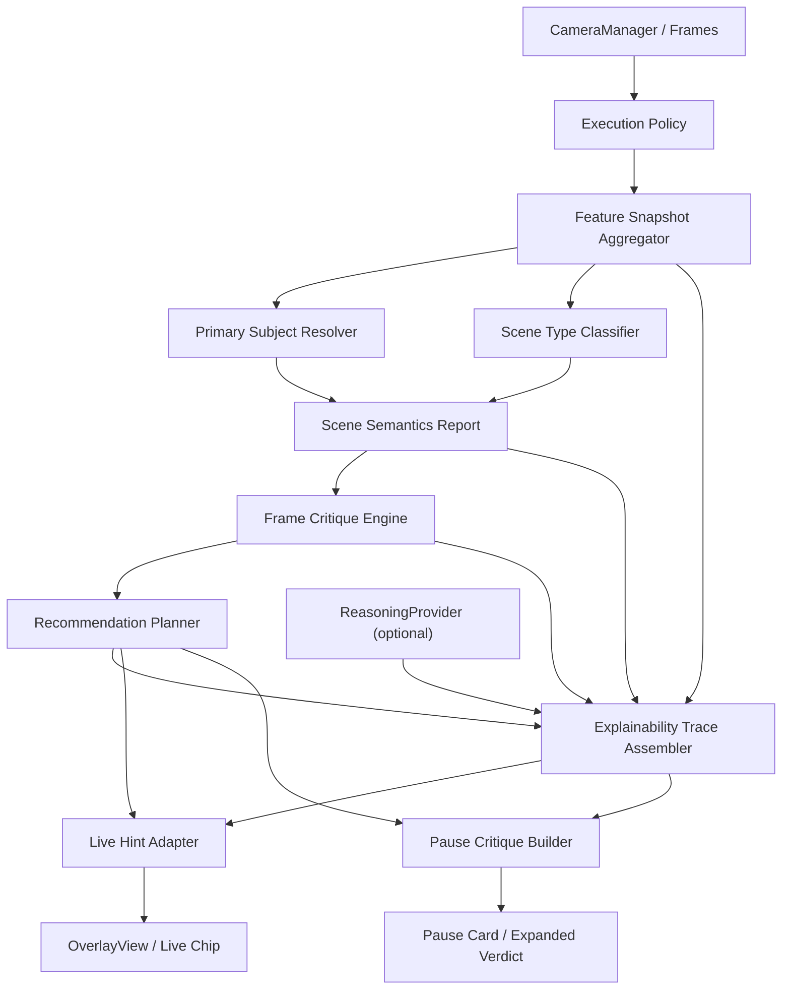

# 02. Pipeline Architecture

## Цель

Сжато зафиксировать модульную структуру `camera analysis v1` в форме, пригодной для реализации по PR.

Подробный архитектурный дизайн:
- [camera-analysis-v1-architecture.md](/Users/unterlantas/Documents/XCode/shafinMultitool/docs/cameraanalysis/camera-analysis-v1-architecture.md)

Требования и продуктовые решения:
- [camera-analysis-requirements-draft.md](/Users/unterlantas/Documents/XCode/shafinMultitool/docs/cameraanalysis/camera-analysis-requirements-draft.md)

## Общая схема

## Основные модули

### 1. Execution Policy
- решает, какие стадии можно запускать в `live`, а какие в `pause`;
- ограничивает compute budget;
- управляет fallback strategy.

### 2. Feature Snapshot Aggregator
- собирает fast signals из текущего pipeline;
- приводит их к единому структурированному виду;
- не интерпретирует сцену, только агрегирует evidence.

### 3. Primary Subject Resolver
- выбирает главный субъект;
- объединяет face/person/saliency/object evidence;
- выдает confidence и reasoning.

### 4. Scene Type Classifier
- определяет тип cinematic-сцены `v1`;
- может быть rule-based или hybrid heuristic.

### 5. Frame Critique Engine
- строит `strengths` и `issues`;
- выдает severity, confidence, affected region;
- формирует explainable basis для всех последующих слоев.

### 6. Recommendation Planner
- ранжирует действия;
- выбирает primary и secondary fixes;
- знает, что показывать в `live`, а что только в `pause`.

### 7. Explainability Trace Assembler
- собирает `observation` из snapshot/semantics сигналов;
- собирает `interpretation` из deterministic critique/rules;
- опционально добавляет `interpretation` из `ReasoningProvider` как append-only ветку `optional_reasoning` (без влияния на planner decisions);
- собирает `recommendation` из output `RecommendationPlanner`;
- валидирует ссылочную целостность (`issue/strength/action/overlay/summary`) и stage/source constraints;
- используется для debug, eval и research narrative.

### 8. Live Hint Adapter
- превращает structured critique в одну короткую подсказку;
- отвечает за anti-flicker behavior.

### 9. Pause Critique Builder
- собирает развернутый verdict;
- строит sections `why good / why bad / what to fix`;
- подготавливает overlay annotations.

### 10. ReasoningProvider
- optional слой для LLM/deep reasoning;
- не источник истины для сырых issues;
- не переопределяет deterministic actions planner-а;
- в `v1` в первую очередь pause-only.

## Recommended source-of-truth contracts

До начала широкого кодинга должны быть зафиксированы:
- `FrameFeatureSnapshot`
- `SceneSemanticsReport`
- `FrameIssue`
- `FrameStrength`
- `CritiqueReport`
- `RecommendationAction`
- `RecommendationPlan`
- `ExplainabilityTraceItem`

## Интеграционная стратегия

Рекомендуемый путь:
1. Не ломать существующий `AnalysisPipeline`.
2. Поверх текущих feature providers ввести новый aggregation слой.
3. Сначала внедрить новый pause flow.
4. Затем перевести live на `LiveHintAdapter`.
5. Старый `SuggestionEngine` держать как fallback, пока новый pipeline не стабилизирован.
