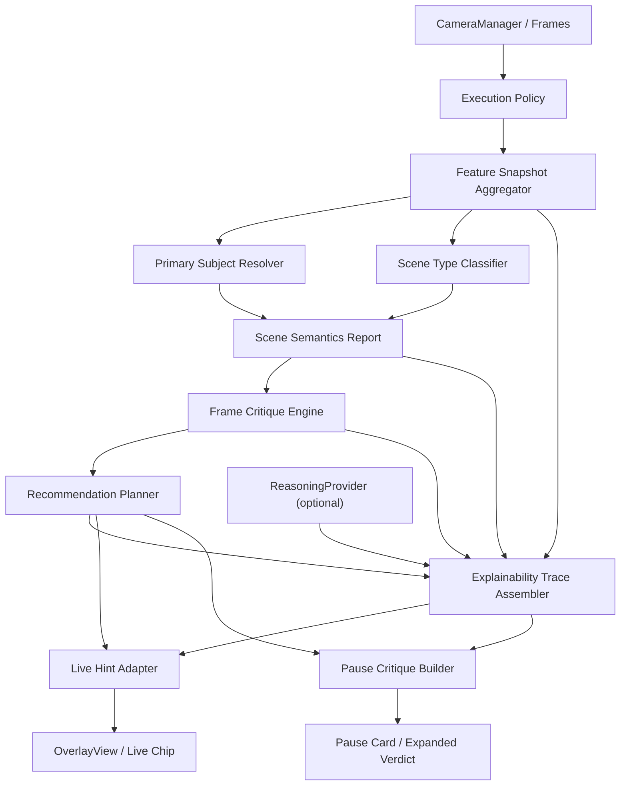
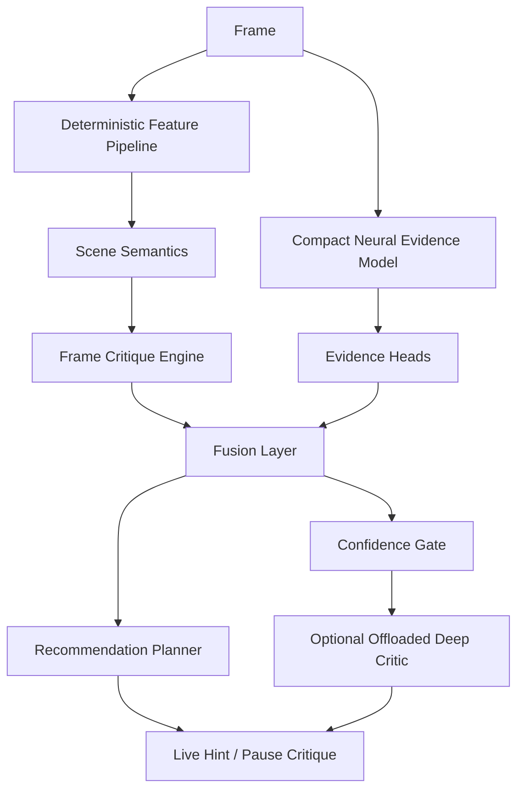

# 02. Pipeline Architecture

## Цель

Сжато зафиксировать модульную структуру `camera analysis v1` в форме, пригодной для реализации по PR.

Подробный архитектурный дизайн:
- [camera-analysis-v1-architecture.md](/Users/unterlantas/Documents/XCode/shafinMultitool/docs/cameraanalysis/camera-analysis-v1-architecture.md)

Требования и продуктовые решения:
- [camera-analysis-requirements-draft.md](/Users/unterlantas/Documents/XCode/shafinMultitool/docs/cameraanalysis/camera-analysis-requirements-draft.md)

## Общая схема

## Основные модули

### 1. Execution Policy
- решает, какие стадии можно запускать в `live`, а какие в `pause`;
- ограничивает compute budget;
- управляет fallback strategy.

### 2. Feature Snapshot Aggregator
- собирает fast signals из текущего pipeline;
- приводит их к единому структурированному виду;
- не интерпретирует сцену, только агрегирует evidence.

### 3. Primary Subject Resolver
- выбирает главный субъект;
- объединяет face/person/saliency/object evidence;
- выдает confidence и reasoning.

### 4. Scene Type Classifier
- определяет тип cinematic-сцены `v1`;
- может быть rule-based или hybrid heuristic.

### 5. Frame Critique Engine
- строит `strengths` и `issues`;
- выдает severity, confidence, affected region;
- формирует explainable basis для всех последующих слоев.

### 6. Recommendation Planner
- ранжирует действия;
- выбирает primary и secondary fixes;
- знает, что показывать в `live`, а что только в `pause`.

### 7. Explainability Trace Assembler
- собирает `observation` из snapshot/semantics сигналов;
- собирает `interpretation` из deterministic critique/rules;
- опционально добавляет `interpretation` из `ReasoningProvider` как append-only ветку `optional_reasoning` (без влияния на planner decisions);
- собирает `recommendation` из output `RecommendationPlanner`;
- валидирует ссылочную целостность (`issue/strength/action/overlay/summary`) и stage/source constraints;
- используется для debug, eval и research narrative.

### 8. Live Hint Adapter
- превращает structured critique в одну короткую подсказку;
- отвечает за anti-flicker behavior.

### 9. Pause Critique Builder
- собирает развернутый verdict;
- строит sections `why good / why bad / what to fix`;
- подготавливает overlay annotations.

### 10. ReasoningProvider
- optional слой для LLM/deep reasoning;
- не источник истины для сырых issues;
- не переопределяет deterministic actions planner-а;
- в `v1` в первую очередь pause-only.

## Recommended source-of-truth contracts

До начала широкого кодинга должны быть зафиксированы:
- `FrameFeatureSnapshot`
- `SceneSemanticsReport`
- `FrameIssue`
- `FrameStrength`
- `CritiqueReport`
- `RecommendationAction`
- `RecommendationPlan`
- `ExplainabilityTraceItem`

## Интеграционная стратегия

Рекомендуемый путь:
1. Не ломать существующий `AnalysisPipeline`.
2. Поверх текущих feature providers ввести новый aggregation слой.
3. Сначала внедрить новый pause flow.
4. Затем перевести live на `LiveHintAdapter`.
5. Старый `SuggestionEngine` держать как fallback, пока новый pipeline не стабилизирован.

## Hybrid Augmentation Track

Следующий этап должен развивать этот же pipeline, а не создавать вторую параллельную систему.

Рекомендуемый принцип:

`deterministic cinematic grammar + neural evidence heads + optional gated offloading`

Это означает:
- deterministic core остается source-of-truth для issues, actions и explainable critique;
- neural layer усиливает систему интерпретируемыми evidence factors;
- offloading остается optional deep-analysis path, а не обязательным runtime dependency.

### Что должно остаться deterministic

- horizon / headroom / lead room / edge pressure;
- subject placement and subject readability;
- gross clutter / background competition;
- motion / shake / obvious technical failure;
- scene-type-aware recommendation logic;
- final action planning and base fallback behavior.

### Что стоит отдать neural layer

- holistic aesthetic prior;
- lighting quality as soft evidence;
- depth / tonal separation cues;
- visual harmony and production-value-like residual patterns;
- reranking / confidence calibration в спорных случаях.

### Recommended neural roles

1. `Structured evidence heads`
2. `Bounded confidence calibrator`
3. `Reranker for ambiguous deterministic cases`

Главный принцип:
- neural layer должен предсказывать structured evidence, а не source-of-truth текст совета.

### Recommended evidence heads

- `subject_prominence`
- `background_clutter`
- `balance_confidence`
- `depth_separation`
- `lighting_quality`
- `face_saliency`
- `cinematic_expressiveness`
- `shot_type_confidence`

### Как использовать AVA

`AVA` уместен как `pretraining / auxiliary signal`, но не как финальный источник истины для cinematic critique, потому что:
- это mostly photo aesthetics;
- там нет полноценного shot intent;
- there is strong domain shift относительно mobile live/pause coaching;
- он слаб для actionable critique.

Практический вывод:
- `AVA` использовать для initialization;
- собственную rubric-driven cinematic разметку использовать как task-specific слой.

Подробная policy для `PR-H04` зафиксирована в [17-ava-usage-policy-and-pretraining-design.md](/Users/unterlantas/Documents/XCode/shafinMultitool/docs/cameraanalysis/17-ava-usage-policy-and-pretraining-design.md).
Подробная architecture spec для `PR-H05` зафиксирована в [18-hybrid-model-architecture-spec.md](/Users/unterlantas/Documents/XCode/shafinMultitool/docs/cameraanalysis/18-hybrid-model-architecture-spec.md).
Подробная bounded fusion policy для `PR-H09` зафиксирована в [21-hybrid-fusion-layer.md](/Users/unterlantas/Documents/XCode/shafinMultitool/docs/cameraanalysis/21-hybrid-fusion-layer.md).

### Recommended hybrid data strategy

1. `Public pretraining layer`
   - `AVA`
   - auxiliary public datasets where helpful
2. `Curated cinematic rubric layer`
   - собственные кадры с axes/issues/actions labels
3. `Runtime hard-case layer`
   - false positives / false negatives / ambiguous frames from real usage

### On-device policy

- `live`: только cheap and throttled neural path;
- `pause`: richer local neural pass is allowed;
- при деградации thermal/latency budget neural path должен деградировать мягко.

### Offloading policy

Offloading разрешен только если:
- confidence низкая;
- кадр сложный;
- пользователь запросил deeper pause analysis;
- local fusion дал ambiguous case.

Server path не должен:
- быть обязательным для baseline UX;
- заменять deterministic critique core;
- ломать offline-first mode.

### Recommended fused flow

Implementation note for `PR-H09`:
- practical sequencing is `deterministic critique -> fusion -> planner`;
- this keeps `FrameCritiqueEngine` source-of-truth and treats fusion as bounded calibration, not as a replacement critic.
