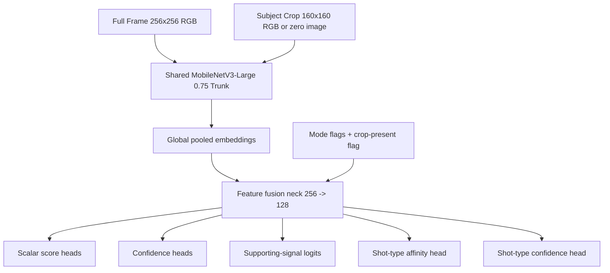

# 18. Hybrid Model Architecture Spec (PR-H05)

Статус: design spec (source-of-truth)

Дата: 2026-04-22

Связанные документы:
- [README.md](/Users/unterlantas/Documents/XCode/shafinMultitool/docs/cameraanalysis/README.md)
- [01-roadmap.md](/Users/unterlantas/Documents/XCode/shafinMultitool/docs/cameraanalysis/01-roadmap.md)
- [02-pipeline-architecture.md](/Users/unterlantas/Documents/XCode/shafinMultitool/docs/cameraanalysis/02-pipeline-architecture.md)
- [11-implementation-backlog.md](/Users/unterlantas/Documents/XCode/shafinMultitool/docs/cameraanalysis/11-implementation-backlog.md)
- [14-hybrid-research-framing.md](/Users/unterlantas/Documents/XCode/shafinMultitool/docs/cameraanalysis/14-hybrid-research-framing.md)
- [15-evidence-taxonomy-contract.md](/Users/unterlantas/Documents/XCode/shafinMultitool/docs/cameraanalysis/15-evidence-taxonomy-contract.md)
- [16-dataset-schema-and-labeling-guide.md](/Users/unterlantas/Documents/XCode/shafinMultitool/docs/cameraanalysis/16-dataset-schema-and-labeling-guide.md)
- [17-ava-usage-policy-and-pretraining-design.md](/Users/unterlantas/Documents/XCode/shafinMultitool/docs/cameraanalysis/17-ava-usage-policy-and-pretraining-design.md)

## Цель

Зафиксировать realistic compact neural evidence model для iPhone так, чтобы:
- `PR-H06` мог оформить runtime/domain contract без угадывания формы model outputs;
- `PR-H07` мог собрать inference wrapper и cadence policy без споров о tensor shapes и deployment assumptions;
- `PR-H14` мог провести честные ablations по backbone/input/objectives;
- hybrid stage остался mobile-first, explainable и совместимым с deterministic critique core.

Этот документ закрывает design-часть `PR-H05` из [11-implementation-backlog.md](/Users/unterlantas/Documents/XCode/shafinMultitool/docs/cameraanalysis/11-implementation-backlog.md).

## Scope

`PR-H05` отвечает за:
- выбор backbone family;
- canonical input strategy;
- head layout и tensor contract модели;
- training objectives и stage-wise training plan;
- latency/size/deployment targets;
- Core ML assumptions;
- ablation plan.

`PR-H05` не отвечает за:
- runtime envelope `NeuralEvidenceSnapshot`;
- exact fusion formulas;
- on-device scheduling implementation;
- offloading triggers;
- final Swift API поверх Core ML.

Граница ответственности:
- `PR-H05` определяет то, что модель предсказывает и в какой форме;
- `PR-H06` определяет, как это сериализуется в domain/runtime contract;
- `PR-H07` определяет, как это вызывается на устройстве и как деградирует по budget.

## Design Summary

Ключевое решение `PR-H05`:

`shared mobile CNN trunk + lightweight dual-view fusion + structured multitask heads`

Это означает:
- не giant multimodal model;
- не ViT-first и не text-generating judge;
- один компактный visual encoder для full-frame и optional subject crop;
- outputs ограничены evidence heads из [15-evidence-taxonomy-contract.md](/Users/unterlantas/Documents/XCode/shafinMultitool/docs/cameraanalysis/15-evidence-taxonomy-contract.md);
- все expensive interpretive decisions остаются вне модели и выполняются downstream deterministic fusion.

Канонический baseline для `PR-H05`:
- backbone family: `MobileNetV3-Large width 0.75`;
- runtime input: `full frame + optional subject crop`;
- output semantics: structured evidence only;
- deployment target: `pause-first`, `live` only under throttled guarded path.

## Why This Backbone

### Chosen backbone

Нормативный выбор для первого on-device baseline:

`MobileNetV3-Large (width multiplier 0.75)`

Причины:
- это зрелая mobile CNN family с предсказуемым поведением в Core ML;
- depthwise-separable conv stack хорошо переносится на iPhone-class hardware;
- backbone достаточно маленький для dual-view path без giant latency tax;
- он совместим с float16 export без custom ops;
- для первых hybrid PR важнее стабильность deployment-а и explainable outputs, чем chasing SOTA.

### Why not larger or fancier alternatives

`EfficientNet-Lite` допустим как secondary ablation, но не baseline, потому что:
- выигрыши не гарантированы на Core ML enough-to-risk baseline complexity;
- pipeline сейчас важнее стандартизировать вокруг stable wrapper contract.

`ViT / CLIP-like / multimodal LLM` запрещены как baseline, потому что:
- они хуже соответствуют mobile-first и no-giant-model constraints;
- обычно хуже вписываются в ANE-friendly deployment discipline;
- в `PR-H05` нет задачи делать open-ended semantics или text output.

## Model Family Overview

Модель называется условно `CompactNeuralEvidenceNet`.

Высокоуровневая схема:



Нормативная интерпретация:
- два image views проходят через один и тот же shared trunk с общими весами;
- ROI branch не имеет отдельного второго backbone;
- feature fusion происходит после global pooling;
- модель не содержит temporal state, recurrence или cross-frame memory;
- sequence smoothing, caching и throttling решаются только в `PR-H07/H09`.

## Input Strategy

### 1. Frame inputs

Канонический model input shape:

```text
ModelImageInputs
- full_frame_rgb: 256 x 256 x 3
- subject_crop_rgb: 160 x 160 x 3
- mode_flag_live: scalar Float32 in {0.0, 1.0}
- crop_present_flag: scalar Float32 in {0.0, 1.0}
```

### Full frame

- всегда обязателен;
- формируется из текущего still frame;
- aspect ratio letterbox/pad разрешен, но policy должна быть фиксирована в wrapper and identical for train/inference;
- color space: sRGB;
- normalization: fixed per-channel mean/std baked into preprocessing, а не learned inside wrapper.

### Subject crop

- optional, но input tensor всегда присутствует;
- если deterministic upstream не смог дать ROI, wrapper передает zero image и `crop_present_flag = 0`;
- crop вычисляется вне модели из versioned deterministic subject proposal;
- в `pause` crop обязателен whenever proposal exists;
- в `live` crop может выключаться cadence policy, но tensor shape не меняется.

Canonical crop policy:
- training, eval и runtime обязаны использовать один и тот же `subjectProposalVersion` и один и тот же `cropRecipeVersion`;
- source-of-truth поля для этого handoff-а фиксируются в `AssetDescriptor` inside [16-dataset-schema-and-labeling-guide.md](/Users/unterlantas/Documents/XCode/shafinMultitool/docs/cameraanalysis/16-dataset-schema-and-labeling-guide.md);
- если dataset не содержит `canonicalSubjectRoi` для конкретного record-а, training pipeline обязан materialize-ить crop через ту же deterministic proposal pipeline version, что и runtime wrapper;
- `subject_crop_rgb` всегда строится from padded square ROI around the canonical proposal box;
- canonical square expansion factor: `1.25` относительно max(width, height) proposal box;
- crop coordinates клипуются к границам исходного кадра до resize;
- resize interpolation policy должна быть одинаковой в train/eval/runtime: bilinear for resize, zero-fill only for explicit missing-crop fallback.

### Why dual-view instead of image-only

Dual-view нужен because:
- `subject_prominence` и `face_saliency` страдают, если модель видит только полный кадр;
- при этом отдельный second backbone не нужен;
- zero-crop fallback keeps runtime interface stable.

### Non-goals for input strategy

В baseline `PR-H05` запрещено:
- передавать sequence clips;
- строить inside-model ROIAlign, NMS или detector logic;
- передавать text prompt, scene description или LLM tokens;
- добавлять arbitrary deterministic scalar features прямо в модель.

Причина:
- это размыло бы границу между neural evidence model и downstream fusion/runtime layers.

### 2. Mode policy baked into inputs

`mode_flag_live` нужен не для радикально разных semantics, а для soft specialization:
- в `live` модель учится быть более conservative и ориентированной на cheap heads;
- в `pause` модель может полнее использовать global context и crop branch.

Нормативное ограничение:
- mode flag не отменяет closed head catalog;
- pause-only heads все равно сериализуются downstream по contract policy из [15-evidence-taxonomy-contract.md](/Users/unterlantas/Documents/XCode/shafinMultitool/docs/cameraanalysis/15-evidence-taxonomy-contract.md);
- wrapper не имеет права invent-ить второй другой label space для `live`.

## Output Heads

### 1. Canonical output ordering

Порядок scalar heads обязан совпадать с canonical order из [15-evidence-taxonomy-contract.md](/Users/unterlantas/Documents/XCode/shafinMultitool/docs/cameraanalysis/15-evidence-taxonomy-contract.md):

1. `subject_prominence`
2. `background_clutter`
3. `lighting_quality`
4. `face_saliency`
5. `balance_confidence`
6. `depth_separation`
7. `cinematic_expressiveness`

Порядок shot-type categories тоже фиксирован:

1. `dialogue_closeup_affinity`
2. `single_character_medium_affinity`
3. `two_character_frame_affinity`
4. `object_insert_affinity`
5. `establishing_like_frame_affinity`
6. `moody_backlit_subject_affinity`
7. `unknown_affinity`

Global supporting-signal vocabulary order также фиксирован и должен совпадать с `PR-H02`:

1. `subject_scale`
2. `subject_attention_pull`
3. `subject_readability`
4. `object_density`
5. `texture_noise`
6. `attention_competition`
7. `subject_exposure_readability`
8. `facial_light_support`
9. `tonal_structure`
10. `face_attention_pull`
11. `eye_region_visibility`
12. `facial_anchor_strength`
13. `frame_balance`
14. `subject_placement_stability`
15. `negative_space_fit`
16. `foreground_background_split`
17. `subject_background_contrast`
18. `layering_clarity`
19. `stylistic_intent`
20. `production_value_residual`
21. `visual_harmony_residual`

### 2. Canonical tensor contract

Модель должна экспортировать следующий минимальный tensor contract:

```text
CompactNeuralEvidenceOutputs
- scalar_score_logits: Float32[7]
- scalar_confidence_logits: Float32[7]
- supporting_signal_logits: Float32[7, 21]
- shot_type_affinity_logits: Float32[7]
- shot_type_confidence_logit: Float32[1]
```

Нормативные правила:
- logits являются raw model outputs; sigmoid/masking/thresholding выполняются в wrapper;
- `not_applicable` никогда не предсказывается моделью напрямую:
  - `not_applicable` возникает только из runtime policy, already frozen in `PR-H02`;
  - wrapper/runtime failure -> `unavailable`
- `supporting_signal_logits` всегда dense over full global vocabulary;
- downstream обязан mask-ить forbidden tags per head according to `PR-H02`;
- модель не экспортирует free-form text, verdict logits, issue logits, action logits или scene type logits.

### Why dense supporting-signal logits

Dense matrix `[7, 21]` chosen instead of variable per-head tensors because:
- это упрощает Core ML export и Swift wrapper;
- shape стабилен across model versions;
- `PR-H06` может применить fixed mask table without inventing new serialization shapes.

### 3. Head semantics

### Scalar score heads

Для каждого из 7 scalar heads:
- `scalar_score_logits[i]` после sigmoid интерпретируется как raw score candidate `0...1`;
- `scalar_confidence_logits[i]` после sigmoid интерпретируется как reliability estimate этого score;
- supporting tags берутся из `supporting_signal_logits[i, :]` после mask и threshold.

### Shot-type head

`shot_type_confidence` head формируется отдельно:
- `shot_type_affinity_logits[7]` -> sigmoid affinity scores по fixed catalog;
- `shot_type_confidence_logit` -> family-level confidence;

Нормативное ограничение:
- affinities не нормализуются softmax-ом и не обязаны суммироваться в `1.0`;
- `unknown_affinity` обязателен всегда.

### 4. Mode-aware head availability

`PR-H05` обязан уже на уровне architecture assumptions учитывать mode split из `PR-H02`.

Разрешенные live heads:
- `subject_prominence`
- `background_clutter`
- `lighting_quality`
- `face_saliency`

Pause-only heads:
- `balance_confidence`
- `depth_separation`
- `cinematic_expressiveness`
- `shot_type_confidence`

Нормативное последствие:
- модель может предсказывать все heads в любом режиме;
- downstream contract в `PR-H06/H09` обязан сериализовать pause-only heads как `not_applicable` в `live`, даже если модель выдала logits;
- `PR-H07` вправе short-circuit-ить вычисления или игнорировать эти outputs в live runtime path, но shape outputs менять нельзя.

## Training Objectives

### 1. Main supervised objectives

Stage-2 baseline objective is multitask and bounded to closed catalogs.

### Scalar score loss

Для scalar heads используется:
- `SmoothL1` loss against `EvidenceTargetLabel.targetScore`;
- loss считается только если `applicability == applicable`.

Причина выбора:
- labels из [16-dataset-schema-and-labeling-guide.md](/Users/unterlantas/Documents/XCode/shafinMultitool/docs/cameraanalysis/16-dataset-schema-and-labeling-guide.md) уже mapped to canonical scalar targets;
- `SmoothL1` tolerates rubric subjectivity better than plain MSE.

### Supporting-signal loss

Для scalar heads:
- masked multi-label binary cross-entropy on allowed `SupportingSignalTag` entries;
- forbidden tags do not contribute loss;
- overall weight must stay lower than scalar score loss.

Причина:
- supporting signals полезны для traceability, но не должны доминировать semantic target.

### Shot-type affinity loss

Для `shot_type_confidence`:
- `SmoothL1` or BCE-on-derived-score against each affinity target from `CategoryBandLabel`;
- only for applicable examples.

Baseline normative choice:
- use independent sigmoid + `SmoothL1` against derived target scores from `PR-H03`.

### Confidence loss

Confidence head не обучается на "правильный ответ" напрямую. Он обучается на derived reliability target:
- high agreement + low ambiguity + applicable => higher desired confidence;
- low agreement / ambiguous / noisy => lower desired confidence.

Канонический derived target:

```text
derived_reliability_target =
  0.50 * adjudication_agreement_score
  + 0.25 * labelConfidenceBand_score
  + 0.25 * (1.0 - ambiguity_penalty)
```

Где:
- `adjudication_agreement_score` maps `none=1.00`, `soft=0.65`, `hard=0.25` according to `PR-H03`;
- `labelConfidenceBand_score` maps `low=0.30`, `medium=0.60`, `high=0.90`;
- `ambiguity_penalty` maps `none=0.0`, `mild=0.15`, `moderate=0.35`, `severe=0.55`.

Нормативное ограничение:
- confidence loss cannot peek at downstream verdict correctness;
- confidence head calibrates head reliability, not final product success.

### 2. Stage-wise training plan

### Stage 0. Generic visual initialization

Разрешено:
- использовать standard generic image pretraining of chosen backbone.

Это не часть product semantics и не требует special runtime contract.

### Stage 1. Public aesthetic pretraining

Используется policy from [17-ava-usage-policy-and-pretraining-design.md](/Users/unterlantas/Documents/XCode/shafinMultitool/docs/cameraanalysis/17-ava-usage-policy-and-pretraining-design.md):
- AVA/public aesthetic supervision только как disposable warm-start stage;
- auxiliary `ava_pretrain_score_head` существует только на этой стадии;
- после завершения Stage 1 этот head удаляется и не экспортируется.

### Stage 2. Rubric-driven multitask training

Основная supervised stage:
- dataset from `PR-H03`;
- multitask losses described above;
- scheduler и weighting обязаны key-иться как минимум по `(objectiveFamily, trainingSourceKind, labelTier_or_sourceContract)` according to `PR-H04`;
- `semantic_head_supervision` uses this priority order:
  - `hybrid_dataset_curated + full_rubric`
  - `hybrid_dataset_runtime_hard_case + full_rubric`
  - `hybrid_dataset_public + full_rubric`
  - `hybrid_dataset_public + public_partial_rubric`
- `calibration_and_hard_error_suppression` uses this priority order:
  - `hybrid_dataset_runtime_hard_case + full_rubric`
  - `hybrid_dataset_curated + full_rubric`
  - `hybrid_dataset_public + full_rubric`
  - `hybrid_dataset_public + public_partial_rubric`

### Stage 3. Calibration fine-tune

Отдельная короткая fine-tuning stage:
- freeze part of trunk or use low LR;
- optimize confidence calibration;
- use holdout buckets heavy in ambiguity/borderline cases.

Нормативное ограничение:
- raw AVA objective must remain fully disabled in Stage 2 and Stage 3.

### 3. Sample weighting policy

Baseline per-objective weighting:
- for `semantic_head_supervision`:
  - `hybrid_dataset_curated + full_rubric`: `1.00`
  - `hybrid_dataset_runtime_hard_case + full_rubric`: `0.95`
  - `hybrid_dataset_public + full_rubric`: `0.80`
  - `hybrid_dataset_public + public_partial_rubric`: `0.55`
- for `calibration_and_hard_error_suppression`:
  - `hybrid_dataset_runtime_hard_case + full_rubric`: `1.00`
  - `hybrid_dataset_curated + full_rubric`: `0.85`
  - `hybrid_dataset_public + full_rubric`: `0.65`
  - `hybrid_dataset_public + public_partial_rubric`: `0.40`

Нормативные ограничения:
- raw `AVA` / `PublicAestheticPretrainingManifest` has zero weight in Stage 2 and Stage 3;
- `public + full_rubric` и `public_partial_rubric` не могут быть объединены в одну training bucket weight;
- semantic authority определяется rubric completeness и objective family, а не только source bucket origin.

Head-specific extra upweight:
- `face_saliency` and `subject_prominence` for person-centric frames;
- `depth_separation` and `cinematic_expressiveness` for pause-only hard cases;
- `shot_type_confidence` only where adjudication is not hard-disagreement.

## Architecture Details

### 1. Shared trunk and fusion neck

Каноническая block diagram:

```text
Shared trunk:
- MobileNetV3-Large 0.75 up to pooled embedding
- output embedding per image view: 960-d pooled vector

Fusion neck:
- concat(full_embedding, crop_embedding, mode_flag, crop_present_flag)
- linear 1922 -> 256
- SiLU / h-swish
- dropout 0.10
- linear 256 -> 128
```

Нормативное уточнение:
- full and crop branches must share weights;
- separate BN statistics per branch запрещены;
- dropout allowed only in training;
- no mixture-of-experts, no attention pooling, no transformers in baseline.

### 2. Head blocks

Каждая head family строится из общего 128-d fused representation:
- scalar score MLP: `128 -> 64 -> 7`
- scalar confidence MLP: `128 -> 32 -> 7`
- supporting signal MLP: `128 -> 64 -> 147`, reshaped to `[7, 21]`
- shot affinity MLP: `128 -> 64 -> 7`
- shot confidence MLP: `128 -> 32 -> 1`

Это intentionally simple:
- easy to export;
- easy to distill or quantize later;
- low risk of hidden black-box subgraph.

### 3. What the model must not learn as outputs

В baseline `PR-H05` explicitly forbidden heads:
- `FrameVerdict`
- `IssueTypeV1`
- `StrengthTypeV1`
- `ActionTypeV1`
- free-form explanation text
- `SceneTypeV1` final class

Обоснование:
- эти semantics принадлежат deterministic/fusion layers, not neural evidence model.

## Deployment Assumptions

### 1. Device class target

Primary support target for baseline:
- iPhone-class devices equivalent to `A15` or newer.

Graceful degradation target:
- older supported iPhones may run pause-only hybrid path with lower cadence or disabled crop branch;
- this does not change model contract.

### 2. Model packaging target

Normative packaging target for first release candidate:
- one `.mlpackage`;
- float16 weights;
- no external tokenizer, no text encoder, no sidecar vocabulary file besides fixed in-code catalogs;
- model revision string must be stable and surfaced as `bundleVersion` downstream.

### 3. Runtime modes

### Pause

Pause is primary useful mode for first hybrid release:
- full-frame + crop branch enabled whenever ROI exists;
- all heads may be computed;
- richer latency budget allowed.

### Live

Live is secondary guarded mode:
- same model contract, but wrapper may invoke at lower cadence;
- pause-only heads must not participate in downstream live logic;
- crop may be disabled under budget pressure.

## Latency, Size, and Memory Targets

`PR-H05` sets architecture targets, not benchmark proof, but targets must be specific enough for `PR-H07/H14`.

### 1. Export size targets

- preferred model size: `<= 15 MB` compressed `.mlpackage`
- hard ceiling for baseline acceptance: `<= 20 MB`

### 2. Latency targets

On primary target device class (`A15+`, ANE/GPU-eligible path):

- `pause` p50 end-to-end model inference: `<= 30 ms`
- `pause` p95 end-to-end model inference: `<= 45 ms`
- `live` p50 model inference when invoked: `<= 18 ms`
- `live` p95 model inference when invoked: `<= 28 ms`

Under thermal or background pressure:
- wrapper may reduce cadence before changing model contract;
- if still needed, crop branch may be zeroed out;
- if still too expensive, runtime may return `unavailable`.

### 3. Peak memory targets

- preferred peak working memory during inference: `<= 90 MB`
- hard ceiling for baseline acceptance: `<= 140 MB`

## Core ML Assumptions

`PR-H05` fixes the following Core ML assumptions as normative baseline.

### 1. Allowed operator family

Allowed:
- conv / depthwise conv
- squeeze-excitation
- elementwise activations
- global average pooling
- linear layers
- reshape / concat

Avoid in baseline:
- custom layers
- dynamic control flow
- dynamic ROI ops
- transformer attention blocks
- large layer-norm-heavy graphs

### 2. Fixed-shape export

Baseline export must use fixed input shapes:
- `256 x 256 x 3` full frame
- `160 x 160 x 3` subject crop

No dynamic spatial shapes in baseline.

### 3. Preprocessing boundary

Wrapper responsibilities:
- resize/crop/pad;
- normalization;
- zero-crop fallback;
- runtime policy-derived status assignment;
- supporting-signal mask application.

Model responsibilities:
- only forward inference over normalized tensors;
- no hidden preprocessing assumptions beyond documented normalization constants.

Canonical normalization constants:
- input pixel scaling: `UInt8 0...255 -> Float32 0.0...1.0`
- channel mean: `[0.485, 0.456, 0.406]`
- channel std: `[0.229, 0.224, 0.225]`
- channel order: `RGB`

Нормативное правило:
- train, eval, exported Core ML wrapper и any offline benchmark scripts обязаны использовать exactly these constants without silent substitution.

### 4. Numeric precision

Baseline assumption:
- train in standard float precision;
- export inference weights as float16;
- keep output tensors readable as float32-compatible values in wrapper.

INT8 quantization is allowed only as later optimization ablation, not as baseline acceptance requirement.

## Thresholding and Postprocessing Assumptions

Чтобы `PR-H06/H07` не гадали о wrapper behavior, here is the baseline policy.

### 1. Score conversion

- scalar and affinity logits -> sigmoid to `[0, 1]`
- confidence logits -> sigmoid to `[0, 1]`

### 2. Applicability and status policy

`PR-H05` does not predict applicability logits.

Baseline runtime policy:
- `face_saliency` -> `not_applicable`, если deterministic routing says `personCentric == false`;
- `balance_confidence`, `depth_separation`, `cinematic_expressiveness`, `shot_type_confidence` -> `not_applicable` in `live` by mode policy from `PR-H02`;
- all other allowed heads in their allowed mode are `available` on model success or `unavailable` on runtime/model failure.

Нормативное правило:
- wrapper не имеет права synthesise-ить extra `not_applicable` states beyond policy already frozen in `PR-H02`.

### 3. Supporting-signal emission

For scalar heads only:
- apply fixed per-head allowlist mask from `PR-H02`;
- keep only tags whose masked sigmoid score is `>= 0.50`;
- from those candidates emit at most top-2 highest-scoring tags;
- if none pass threshold, emit `[]`.

Нормативное ограничение:
- wrapper must not invent tags outside the global catalog;
- top-2 rule is mandatory to stay compatible with `PR-H02` sparse explainability contract;
- shot-type head always emits `[]` supporting signals.

### 4. Status semantics

Model success path:
- available only

Wrapper/runtime failure path:
- unavailable

Runtime policy path:
- `not_applicable`

Это сохраняет clean boundary between model semantics and runtime failure semantics.

## Ablation Plan

`PR-H05` считается incomplete without explicit ablation ladder.

### A0. Deterministic-only baseline

Purpose:
- anchor all future hybrid gains against real product baseline.

### A1. Full-frame only trunk

Change:
- disable subject crop branch.

Question:
- нужен ли ROI branch вообще для `subject_prominence` / `face_saliency`.

### A2. Dual-view vs dual-view + mode flag

Change:
- remove `mode_flag_live`.

Question:
- дает ли mode-conditioned trunk meaningful calibration gains or only complexity.

### A3. AVA warm-start vs no AVA stage

Change:
- same architecture, same training budget, with or without Stage 1 public aesthetic warm-start.

Question:
- помогает ли `AVA` initialization under honest downstream eval.

### A4. Strict policy-derived applicability vs relaxed always-available fusion policy

Change:
- keep the same model outputs;
- compare strict `PR-H02` policy-derived `not_applicable` handling against an intentionally relaxed experimental variant that treats eligible heads as always available whenever inference succeeds.

Question:
- нужен ли strict policy-derived applicability boundary для stable downstream fusion, или relaxed availability silently degrades semantics.

Expected outcome:
- strict policy should win, because `face_saliency` and live-vs-pause head boundaries carry semantic meaning outside the model itself.

### A5. Score-only vs score+confidence heads

Change:
- remove confidence heads and rely on post-hoc calibration.

Question:
- нужны ли dedicated confidence heads for fusion safety.

### A6. Without supporting-signal supervision

Change:
- keep score/confidence heads, remove supporting-signal loss and tensor branch.

Question:
- сколько explainability value gives structured tag supervision.

### A7. Width multiplier sensitivity

Change:
- compare width `0.50`, `0.75`, `1.00`.

Question:
- where is best trade-off between latency and pause utility.

Нормативный baseline:
- `0.75` is default unless ablation proves a clearly better Pareto point.

## Acceptance Criteria for This Architecture

`PR-H05` architecture spec считается достаточным, если:
- `PR-H06` может напрямую map-ить outputs into `NeuralEvidenceSnapshot` semantics without inventing new model fields;
- `PR-H07` может строить Core ML wrapper with fixed shapes, fixed output ordering and known thresholds;
- `PR-H14` может запустить planned ablations without redefining labels or head catalog;
- выбранная архитектура остается compatible with mobile-first, offline-first and structured-evidence-only thesis.

## What This Unlocks Next

После фиксации этого документа:
- `PR-H06` может формализовать `NeuralEvidenceSnapshot`, canonical ordering, status invariants и serialization rules against concrete model tensors;
- `PR-H07` может подключать `.mlpackage`, preprocessing, ROI fallback and mode-aware invocation policy;
- `PR-H09` может строить fusion knowing that neural model never emits verdict/action semantics directly.

## Definition of Done (design mode)

Этот design готов, если:
- выбран один realistic mobile backbone baseline;
- input strategy and tensor shapes fixed;
- output heads and ordering fixed;
- training objectives and stage-wise plan fixed;
- latency/size/Core ML assumptions specific enough for implementation;
- ablation ladder explicit enough to validate architecture decisions empirically.
