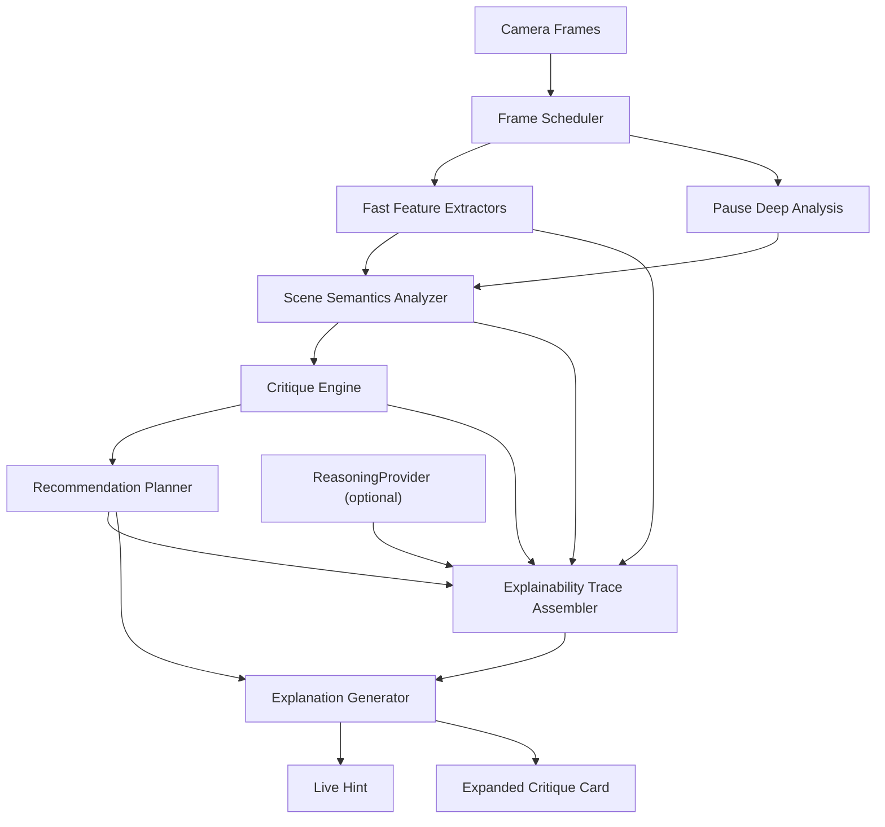

# Архитектурная концепция v1: Анализ картинки с семантическими подсказками

Статус: рабочая архитектура первой версии

Дата: 2026-04-19

Связанные документы:
- [camera-analysis-requirements-draft.md](/Users/unterlantas/Documents/XCode/shafinMultitool/docs/cameraanalysis/camera-analysis-requirements-draft.md)
- [CameraViewModel.swift](/Users/unterlantas/Documents/XCode/shafinMultitool/shafinMultitool/Multitool2Module/ViewModels/CameraViewModel.swift)
- [AnalysisPipeline.swift](/Users/unterlantas/Documents/XCode/shafinMultitool/shafinMultitool/Multitool2Module/Services/Pipeline/AnalysisPipeline.swift)
- [SuggestionEngine.swift](/Users/unterlantas/Documents/XCode/shafinMultitool/shafinMultitool/Multitool2Module/Services/Suggestion/SuggestionEngine.swift)

## 1. Цель архитектуры

Первая версия должна решать сразу две задачи:
- быть практически полезным ассистентом для улучшения cinematic-кадра;
- демонстрировать технологически сложную и объяснимую AI-архитектуру для диплома и диссертации.

Из этого следует ключевое требование:
- архитектура не может быть просто набором эвристик;
- но и не должна быть "черным ящиком", который выдает красивый текст без объяснимой логики.

Поэтому `v1` проектируется как гибридная explainable-система:
- быстрые low-level и mid-level сигналы вычисляются локально и детерминированно;
- семантический уровень добавляет интерпретацию сцены;
- LLM/AI-слой не заменяет логику, а помогает интерпретировать и формулировать объяснение;
- все рекомендации должны иметь внутренний trace: `наблюдение -> вывод -> совет`.

## 2. Исследовательский тезис

Предлагаемый тезис для диссертационной линии:

`Адаптация многоступенчатого explainable AI-пайплайна анализа художественного кадра к ограничениям мобильного устройства с каскадным распределением вычислительной нагрузки между live- и pause-режимами.`

Практический смысл тезиса:
- тяжелый анализ не крутится постоянно;
- live-режим работает на быстрых локальных признаках;
- расширенный анализ включается по паузе;
- объяснение строится не напрямую из модели, а из структурированного критического отчета;
- при необходимости архитектура допускает offloading тяжелого reasoning-этапа.

Это дает одновременно:
- инженерную сложность;
- объяснимость;
- реалистичность для iPhone;
- хороший материал для демонстрации комиссии.

## 3. Архитектурные принципы

### 3.1 Offline-first
- Базовый сценарий должен работать локально на устройстве.
- Тяжелые этапы могут быть деградированы или отключены без поломки UX.

### 3.2 Cascade by cost
- Чем дороже этап по вычислениям, тем реже он запускается.
- Самые тяжелые части должны в основном жить в `pause`.

### 3.3 Explainability by construction
- Каждая рекомендация должна иметь явные причины.
- Текст формируется из структурированного набора факторов, а не из "магического" ответа модели.

### 3.4 Scene-aware critique
- Один и тот же кадр оценивается по-разному в зависимости от типа сцены.
- Критика должна зависеть от cinematic intent, а не только от геометрии.

### 3.5 Progressive disclosure
- В live показываем только то, что помогает мгновенно.
- В pause даем развернутый разбор без перегруза live UI.

## 4. Общая схема системы



## 5. Разделение на live и pause пайплайны

## 5.1 Live pipeline

Назначение:
- быстро подсказывать главное действие;
- не тормозить интерфейс;
- не перегревать устройство;
- не дергать пользователя противоречивыми советами.

Допустимые источники сигнала:
- текущие `VisionTracking`, `HorizonEstimator`, `LightingEstimator`;
- существующий `AestheticScorer` с низкой частотой;
- существующий `DETRDetector` с низкой частотой;
- простые scene heuristics;
- агрегированное состояние за последние N кадров.

Результат live pipeline:
- `LiveHint`;
- опциональный overlay;
- компактный reasoning summary;
- confidence и stability state.

Требование:
- live не обязан уметь полноценно "понимать сцену";
- но должен уметь стабильно выбрать главную проблему или подтвердить, что кадр уже хороший.

## 5.2 Pause pipeline

Назначение:
- выполнять более глубокую семантическую интерпретацию;
- объяснять сильные и слабые стороны кадра;
- выдавать ранжированные действия по исправлению;
- быть витриной технологической глубины.

Допустимые источники сигнала:
- все fast-сигналы из live;
- дополнительный объектный/scene-level анализ;
- локальный LLM/VLM или offloaded reasoning;
- сравнительная оценка нескольких альтернативных интерпретаций сцены.

Результат pause pipeline:
- `CritiqueReport`;
- короткий вердикт;
- strengths;
- issues;
- prioritized actions;
- explainability trace;
- визуальные подсказки на кадре.

## 6. Слои новой архитектуры

## 6.1 Layer 1. Frame Acquisition and Scheduling

Базируется на текущих:
- `CameraManager`;
- `AnalysisPipeline`;
- `RealtimeScheduler`;
- механизмах стабильности и частотного разделения.

Роль слоя:
- забирать кадры;
- распределять частоту вычислений;
- решать, какой режим активен: `live` или `pause`;
- управлять бюджетом вычислений.

Что дорабатываем:
- явное разделение двух режимов пайплайна;
- отдельный orchestration state;
- policy, какие модули разрешено запускать в live, а какие только в pause.

## 6.2 Layer 2. Feature Extraction

Это слой измеряемых признаков без "высокоуровневого смысла".

Используем уже существующее:
- `VisionTracking` для лиц, людей и saliency;
- `HorizonEstimator` для горизонта;
- `LightingEstimator` для света;
- `AestheticScorer` для learned aesthetic prior;
- `DETRDetector` для объектов;
- motion/stability сигналы из текущего пайплайна.

Рекомендуемые новые признаки `v1`:
- `SubjectProminenceFeatures`
  оценка, насколько главный субъект отделен от сцены;
- `BackgroundClutterFeatures`
  оценка визуального шума вокруг главного субъекта;
- `SubjectEdgePressureFeatures`
  оценка, прижат ли объект к краю;
- `LookSpaceFeatures`
  есть ли "воздух" по направлению взгляда или движения;
- `DepthSeparationFeatures`
  насколько фон и субъект различимы;
- `SceneToneFeatures`
  грубая оценка контраста, tonal hierarchy, silhouette readability.

Выход слоя:
- `FrameFeatureSnapshot`.

## 6.3 Layer 3. Scene Semantics Analyzer

Это первый слой, который пытается понять смысл сцены.

Основные задачи:
- определить тип cinematic-сцены;
- выбрать главный субъект;
- понять, что именно мешает читаемости кадра;
- отделить реальную проблему от допустимого художественного приема.

Подзадачи:

### 6.3.1 Primary Subject Resolver
- объединяет лицо, человека, salient region и детекции объектов;
- выбирает главный объект;
- считает confidence;
- умеет обрабатывать конкуренцию нескольких кандидатов.

### 6.3.2 Scene Type Classifier
Для `v1` лучше не делать слишком широкий каталог.

Рекомендуемый стартовый набор cinematic scene types:
- `dialogue_closeup`
- `single_character_medium`
- `two_character_frame`
- `object_insert`
- `establishing_like_frame`
- `moody_backlit_subject`

Это не "фотографические жанры" в общем смысле, а именно киношные типы построения кадра.

### 6.3.3 Visual Dominance Analyzer
- определяет, есть ли ясный центр внимания;
- оценивает конкуренцию объектов;
- находит случаи, когда фон спорит с главным объектом.

### 6.3.4 Semantic Readability Analyzer
- отвечает на вопрос: "считывается ли задуманный объект/персонаж как главный";
- выявляет слияние с фоном, шум, потерю акцента, смысловую перегрузку.

Выход слоя:
- `SceneSemanticsReport`.

## 6.4 Layer 4. Critique Engine

Это главный explainable-слой.

Задача:
- из `FrameFeatureSnapshot` и `SceneSemanticsReport` собрать структурированную критику кадра.

Каждая проблема должна быть представлена как отдельный объект:

```text
FrameIssue:
- id
- type
- severity
- confidence
- evidence
- rationale
- affectedRegion
- suggestedFixTypes
```

Примеры issue types для `v1`:
- `subject_too_close_to_edge`
- `subject_not_prominent_enough`
- `background_competes_with_subject`
- `insufficient_look_space`
- `backlight_hides_subject`
- `scene_has_no_clear_focus`
- `frame_visually_overloaded`
- `horizon_distracts`

Примеры strength types для `v1`:
- `good_subject_isolation`
- `good_light_emphasis`
- `clear_focus_hierarchy`
- `stable_horizon_supports_scene`
- `balanced_composition_for_scene`

Важно:
- положительные факторы должны быть симметричны негативным;
- система должна уметь формировать и `FrameStrength`.

Выход слоя:
- `CritiqueReport`.

## 6.5 Layer 5. Recommendation Planner

Этот слой отвечает не за диагностику, а за практическое исправление.

Задачи:
- ранжировать проблемы;
- выбрать главное действие;
- построить последовательность исправлений;
- решить, что показывать в live, а что только в pause.

Пример логики:
- если главный субъект теряется, это важнее эстетического score;
- если пользователь уже начал двигать камеру, подсказка не должна тут же смениться;
- если есть один корневой дефект, его показываем раньше вторичных.

Формат:

```text
RecommendationAction:
- id
- priority
- actionType
- targetRegion
- expectedOutcome
- linkedIssueIds
- guardrail
- overlayHint
```

Примеры action types:
- `move_frame_left`
- `move_frame_right`
- `increase_subject_size`
- `reduce_background_distractions`
- `change_angle`
- `improve_front_light`
- `leave_frame_as_is`

Выход:
- `RecommendationPlan`.

## 6.6 Layer 6. Explanation Generator

Этот слой превращает структуру в текст.

Он должен поддерживать два режима:

### Live explanation mode
- короткая фраза;
- одна причина;
- одно действие;
- нейтральный тон.

### Expanded explanation mode
- короткий вердикт;
- почему кадр работает или не работает;
- 1-3 главные проблемы;
- 1-3 действия;
- опционально: "что здесь уже хорошо".

Ключевая идея:
- LLM не должен напрямую анализировать сырой кадр как единственный источник истины;
- лучше подавать ему структурированный `CritiqueReport` и позволять:
  - сглаживать формулировки;
  - выбирать лучший текст;
  - объяснять естественным языком.

Таким образом:
- диагностика остается контролируемой;
- текст получается более естественным;
- объяснимость сохраняется.

## 6.7 Layer 7. Presentation Layer

Формы отображения:
- `LiveHintChip`
- tap-to-expand sheet
- `PauseCritiqueCard`
- overlay arrows / highlight regions

В `v1` рекомендуется:
- не ломать текущий `OverlayView`;
- расширить его новыми режимами состояния;
- поверх текущего `suggestion` перейти к структуре вида:
  - `liveHint`
  - `expandedCritique`
  - `overlayAnnotations`

## 7. Предлагаемая доменная модель

```text
FrameFeatureSnapshot
- timestamp
- motionState
- subjectCandidates
- saliency
- composition
- lighting
- horizon
- aesthetic
- objectDetections

SceneSemanticsReport
- sceneType
- sceneTypeConfidence
- primarySubject
- attentionConflicts
- readabilityScore
- cinematicIntentHints

CritiqueReport
- frameId
- mode
- verdict
- verdictConfidence
- strengths[]
- issues[]
- summary
- traceRefs[]
- fallbackUsed

RecommendationPlan
- frameId
- mode
- inputVerdict
- primaryAction
- secondaryActions[]
- deferredActions[]
- noChangeRationale
- planConfidence

PresentationPayload
- liveHint
- shortVerdict
- expandedSections
- overlayAnnotations
```

## 8. Explainability contract

Это один из самых важных разделов для диссертации.

Каждый пользовательский вывод должен быть восстанавливаем до набора причин.

Предлагаемый контракт:

```text
Observation:
- "subject bbox overlaps right safe margin"
- "background saliency exceeds subject saliency"
- "subject luminance lower than background"

Interpretation:
- "subject pressed to edge"
- "background competes for attention"
- "backlight hides facial readability"

Recommendation:
- "move frame left"
- "simplify background"
- "turn subject toward front light"
```

На уровне данных это может выглядеть так (синхронизировано с `04-explainability-contract.md`):

```text
ExplainabilityTraceItem
- id
- frameId
- mode
- stage                    // observation | interpretation | recommendation
- sourceKind               // snapshot_signal | semantics_signal | deterministic_rule | planner_policy | optional_reasoning
- certainty
- confidence
- timestampMs
- statement
- evidenceKeys[]
- dependsOn[]
- links[]                  // issue | strength | action | overlay | summary
- audiences[]              // core | debug | eval | ui
- metadata                 // optional debug/model context
```

Преимущество:
- можно показывать trace в debug/demo режиме;
- можно валидировать рекомендации в тестах;
- можно красиво описать это в диссертации как formalized explainability chain.

## 9. AI-стратегия и адаптация под мобильное устройство

## 9.1 Почему не делать все одной моделью

Подход "отдать весь кадр мультимодальной модели" плох для `v1`, потому что:
- это дорого;
- трудно обеспечить live;
- сложно контролировать explainability;
- сложно гарантировать стабильность формулировок;
- хуже выглядит как инженерная система.

## 9.2 Предлагаемый hybrid AI stack

### Fast deterministic path
- Vision + CoreML + hand-crafted features;
- работает часто;
- дает стабильность;
- дает explainable evidence.

### Semantic reasoning path
- scene interpretation;
- conflict resolution;
- cinematic critique mapping.

### LLM/VLM text refinement path
- формулирует естественный текст;
- работает поверх структуры;
- включается в основном в pause;
- может быть локальным или offloaded.

## 9.3 Режимы вычислений

### Режим A. Fully local
- вся базовая логика локально;
- LLM отключен или работает на маленькой квантованной модели;
- лучший режим для автономной демонстрации.

### Режим B. Hybrid pause reasoning
- live полностью локальный;
- pause может запускать более тяжелую локальную модель или offloading;
- лучший баланс для диссертационной демонстрации архитектуры.

### Режим C. Research extension
- часть reasoning выносится на Mac/сервер;
- можно сравнивать качество локального и offloaded режимов;
- это хорошее расширение для отдельной главы или future work.

Для `v1` рекомендуется:
- реализовать архитектуру так, чтобы базовый режим был `A`;
- а структурно подготовить систему к переходу в `B`.

## 10. Маппинг на текущий код

Что уже можно переиспользовать:
- `AnalysisPipeline` как основу orchestration;
- `CameraViewModel` как координирующий VM;
- `SuggestionEngine` как временный fallback и источник части live-логики;
- `OverlayView` как presentation shell;
- `AestheticScorer`, `VisionTracking`, `LightingEstimator`, `HorizonEstimator`, `DETRDetector` как feature providers.

Что желательно добавить как новые модули:
- `FrameFeatureAggregator`
- `PrimarySubjectResolver`
- `SceneTypeClassifier`
- `VisualDominanceAnalyzer`
- `SemanticReadabilityAnalyzer`
- `FrameCritiqueEngine`
- `RecommendationPlanner`
- `ExplanationGenerator`
- `PauseAnalysisCoordinator`
- `ExplainabilityTraceBuilder`

Вероятный путь интеграции:
- не заменять сразу весь `SuggestionEngine`;
- сначала подключить новый `CritiqueEngine` для pause-режима;
- затем постепенно перевести live на новую модель подсказок;
- старые эвристики оставить как fallback.

## 11. Предлагаемый план реализации v1

## Этап 1. Structured critique foundation
- ввести новые доменные модели;
- собрать `FrameFeatureSnapshot`;
- построить `CritiqueReport` без LLM;
- подключить pause-card с сильными и слабыми сторонами.

## Этап 2. Cinematic semantics
- добавить `PrimarySubjectResolver`;
- добавить scene type heuristics/classifier;
- добавить semantic issue detection;
- улучшить ранжирование рекомендаций.

## Этап 3. Explanation layer
- добавить `ExplainabilityTrace`;
- сделать краткие и расширенные текстовые шаблоны;
- по необходимости подключить LLM для text refinement.

## Этап 4. Hybrid research mode
- подготовить абстракцию `ReasoningProvider`;
- реализовать локальный и потенциально offloaded provider;
- добавить сравнение качества и latency.

## 12. Что показывать комиссии на демо

Для сильной демонстрации лучше подготовить 3 вида кейсов:

### Кейс 1. Явно плохой кадр
- персонаж теряется на фоне;
- система объясняет причину;
- система показывает, как исправить;
- после смещения кадра вывод меняется предсказуемо.

### Кейс 2. Хороший кадр
- система подтверждает, что кадр удачен;
- объясняет, за счет чего он работает;
- не начинает выдумывать искусственные проблемы.

### Кейс 3. Глубокий pause-анализ
- live показывает короткую подсказку;
- по паузе открывается расширенный разбор;
- видны strengths, issues, priority actions и overlay;
- можно отдельно показать explainability trace/debug view.

## 13. Метрики и валидация

Для диссертации желательно заранее заложить измеримость.

Рекомендуемые метрики:
- `Primary subject accuracy`
- `Scene type agreement`
- `Issue detection precision`
- `Action usefulness`
- `Explanation faithfulness`
- `Live hint stability`
- `Pause analysis latency`

Практическая схема оценки:
- curated dataset cinematic-кадров;
- для каждого кадра есть expected verdict, issues, strengths, actions;
- отдельно измеряется соответствие разметке;
- отдельно проводится качественная экспертная оценка объяснений.

## 14. Основные риски

### Риск 1. Слишком широкий замах
Если пытаться поддержать слишком много сцен, `v1` станет размытой.

Митигируем:
- берем ограниченный набор cinematic scene types.

### Риск 2. Черный ящик вместо explainability
Если LLM станет главным источником критики, объяснимость провалится.

Митигируем:
- LLM работает только поверх структурированного critique.

### Риск 3. Слабая зрелищность live
Если live будет слишком осторожным, комиссия не увидит "умности".

Митигируем:
- делаем сильный pause-разбор и хороший tap-to-expand flow.

### Риск 4. Слишком тяжелый mobile inference
Если тяжелые модели включить в каждый кадр, устройство перегреется.

Митигируем:
- жесткий каскад live/pause;
- budget-aware scheduler;
- offline-first fallback.

## 15. Рекомендуемое решение для старта

Если брать наиболее реалистичную и сильную траекторию, то стартовать стоит так:

1. Сначала построить explainable pause-analysis поверх уже существующих признаков и новых semantic rules.
2. Затем оформить `CritiqueReport` и `RecommendationPlan` как центральный контракт системы.
3. После этого подключить `live hint` как сокращенную проекцию того же контракта.
4. И только затем добавлять LLM как улучшатель формулировок и, возможно, как reasoning-помощник в pause.

Итог:
- архитектура будет расти снизу вверх;
- `v1` останется управляемой;
- при этом уже с первой версии будет выглядеть как серьезная исследовательская система, а не просто UI-надстройка над парой эвристик.
