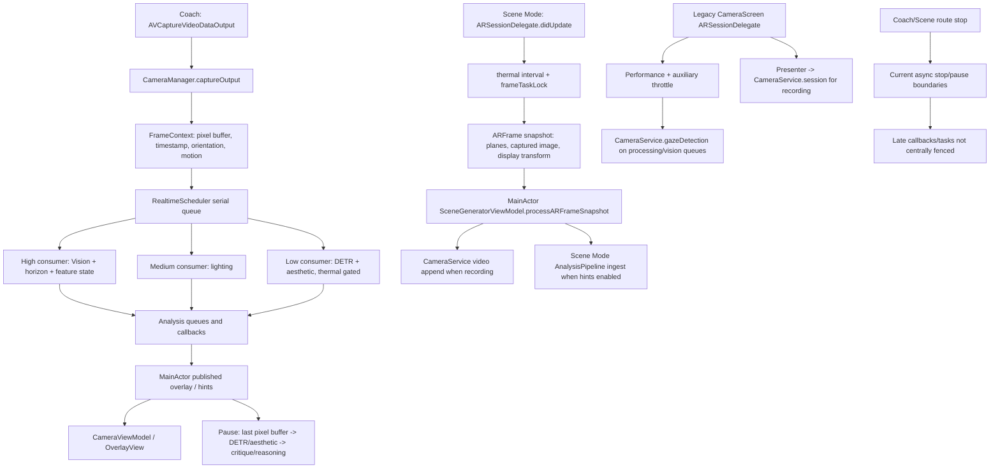
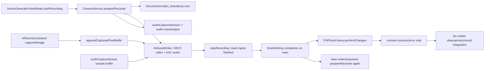

# CC-009 — Camera/session ownership and lifecycle audit

Status: audit artifact only. This task changes no source, project, test, resource, persistence, navigation, product, status, backlog, or other audit file.

Baseline: `e3b3712f6d81901ecab87c3e1e92400b9b07ec9e` (`docs: inventory privacy permissions and data paths`), detached `HEAD` worktree. The baseline was clean at the start (`git status --short --branch` printed only `## HEAD (no branch)`).

Scope: Camera Coach and Scene Mode camera/AR/frame-analysis/recording/save/lifecycle/orientation/permission/thermal/memory ownership. Repository evidence is cited as `path:line` and, where useful, the enclosing symbol. `Fact` means directly visible source behavior; `Risk` means a consequence inferred from two or more cited facts; `Unknown` means the repository cannot establish the runtime result.

## 1. Executive finding

### Finding

The repository has three media contours, but no route-level owner that arbitrates them:

1. The modern Camera Coach stack constructs a `CameraManager` with one `AVCaptureSession`, one video output, a scheduler, thermal governor, motion gate, and an `AnalysisPipeline` in `ContentView.init` (`shafinMultitool/Multitool2Module/ContentView.swift:14-29`). The current source graph reaches `ContentView` only from the benchmark guided-live branch (`shafinMultitool/Benchmark/DeviceBenchmarkCoordinator.swift:1667-1671`); `SceneDelegate` normally installs Scene Mode first (`shafinMultitool/Resources/SceneDelegate.swift:15-33`).
2. The current Scene Mode shell creates an `ARView`/`ARSession` and forwards selected `ARFrame.capturedImage` values to `SceneGeneratorViewModel` (`shafinMultitool/SceneGeneratorModule/Views/ARSceneContainer.swift:19-34,101-176,202-242`). The view model uses the process-wide `CameraService.shared` for recording (`shafinMultitool/SceneGeneratorModule/ViewModels/SceneGeneratorViewModel.swift:289-301,3403-3457`).
3. The retained legacy `CameraScreen` route creates another `ARView`/`ARSession`, uses the same `CameraService.shared`, and adds its own Vision/performance/thermal path (`shafinMultitool/SceneModules/CameraScreenModule/View/CameraScreenViewController.swift:23-35,69-145,1047-1097`; `shafinMultitool/SceneModules/CameraScreenModule/Interactor/CameraScreenInteractor.swift:46-73,289-313`). No repository call site for `CameraScreenBuilder.build` was found in the focused reachability search, but the synchronized Xcode source group means the source remains in the application target (`shafinMultitool.xcodeproj/project.pbxproj:82-109,168-206`).

The current normal route does not prove simultaneous activation of every contour. It does prove duplicated ownership and incomplete handoff boundaries: `CameraManager.stop()` is asynchronous and not awaitable (`shafinMultitool/Multitool2Module/Services/Camera/CameraManager.swift:62-81`); `CameraService.stopRecording()` does not stop its `audioCaptureSession` and immediately prepares another recorder from its completion (`shafinMultitool/Services/CameraService.swift:168-191`); Scene Mode disappearance pauses AR and clears the AR delegate but does not call `SceneGeneratorViewModel.stopRecording()` (`shafinMultitool/SceneGeneratorModule/Views/ARSceneContainer.swift:90-93`; `shafinMultitool/SceneGeneratorModule/Views/SceneGeneratorView.swift:20-31`); and application lifecycle callbacks are empty (`shafinMultitool/Resources/AppDelegate.swift:21-38`).

### Bounded recommendation

Adopt one exclusive route/session contract before changing camera internals:

- A route coordinator owns the single active media lease: `none`, `cameraCoach`, or `sceneMode`. It is the only code allowed to activate or release a route-level camera/AR resource. The coordinator must await the old route's `stop`/`pause`/recording finalization before the new route can acquire the lease.
- A canonical `CameraCoachSessionOwner` owns the Coach `AVCaptureSession`, its inputs/outputs, frame fan-out, pause/resume, orientation, permission gate, thermal/memory policy, and Coach recording/save state. `CameraViewModel` owns presentation state and user intent; `OverlayView` owns only preview/controls; `AnalysisPipeline` is a consumer and analysis worker, not a session owner.
- Scene Mode keeps `ARSceneContainer`/`ARSession`, `SceneGeneratorViewModel`, and `DBService` as its persistence boundary. Entering it requires the Coach lease to be released; leaving it pauses/tears down AR and persists through the existing unified project path (`shafinMultitool/SceneGeneratorModule/ViewModels/SceneGeneratorViewModel.swift:3656-3688`; `shafinMultitool/Services/DBService.swift:120-183`). This recommendation does not migrate or delete the legacy `Scenes` store.
- The current `CameraService` is not a safe canonical owner: it is a global recorder shared by current Scene Mode and legacy CameraScreen (`shafinMultitool/Services/CameraService.swift:16-37`; `shafinMultitool/SceneGeneratorModule/ViewModels/SceneGeneratorViewModel.swift:289-301`; `shafinMultitool/SceneModules/CameraScreenModule/Interactor/CameraScreenInteractor.swift:46-53`). It should first be placed behind a route-owned recording interface, then migrated or retired only after the route and persistence gates below pass.

This is a bounded contract recommendation, not an implementation authorization. It satisfies the product invariant of one Camera Coach screen/session/pipeline (`docs/app-store-product-plan.md:321-340`), preserves saved Scene Mode data (`docs/app-store-product-plan.md:668-676`), and makes the no-overlap invariant testable without claiming that the current app already overlaps all routes.

## 2. Owner ledger

| Resource / contour | Construction and strong owner | Reachability | Start / stop / pause / destruction | Queue, actor, delegate, consumers | Evidence and judgment |
| --- | --- | --- | --- | --- | --- |
| Runtime root and route selection | `SceneDelegate` constructs the window and either `DeviceBenchmarkRootView` or `SOModuleBuilder`/`UINavigationController` (`shafinMultitool/Resources/SceneDelegate.swift:11-34`). | Normal launch is Scene library; benchmark is selected by `DEVICE_BENCHMARK_CONFIG_BASE64` before the normal branch (`shafinMultitool/Resources/SceneDelegate.swift:20-32`; `shafinMultitool/Benchmark/DeviceBenchmarkSupport.swift:75-125`). | No route/session stop or lifecycle handoff is implemented in `SceneDelegate`; the window remains the strong root owner until scene teardown (`shafinMultitool/Resources/SceneDelegate.swift:15-34`). | UIKit main-thread scene callback; navigation controller owns pushed controllers. | **Fact:** no central media lease exists at the root. **Risk:** a future shell that keeps both children mounted can retain two media contours. Product requires a single active contour (`docs/app-store-product-plan.md:321-340,809-819`). |
| Modern Camera Coach composition | `ContentView.init` creates `RealtimeScheduler`, `ThermalGovernor`, `MotionGate`, `CameraManager`, and `AnalysisPipeline`; `@StateObject` strongly retains `CameraViewModel` (`shafinMultitool/Multitool2Module/ContentView.swift:10-29`). | `DeviceBenchmarkRootView.body` renders `ContentView` only while `activeGuidedScenario` is non-nil (`shafinMultitool/Benchmark/DeviceBenchmarkCoordinator.swift:1649-1671`). `multitool2App` is not a runtime entry because its `@main` is commented out (`shafinMultitool/Multitool2Module/multitool2App.swift:8-16`). | `OverlayView.onAppear` calls `CameraViewModel.start`; `onDisappear` calls `stop` (`shafinMultitool/Multitool2Module/UI/Overlay/OverlayView.swift:154-170`). There is no explicit `deinit` teardown in the view model or composition (`shafinMultitool/Multitool2Module/ViewModels/CameraViewModel.swift:11-144`). | SwiftUI/Combine presentation; VM forwards to manager and pipeline. | **Fact:** lifetime is view-driven, not route-coordinator-driven. **Risk:** a shell transition can race asynchronous capture stop with creation of another media owner. |
| Coach `AVCaptureSession` and video input | `CameraManager` strongly owns private `session`, `videoOutput`, `currentInput`, and `sessionQueue` (`shafinMultitool/Multitool2Module/Services/Camera/CameraManager.swift:35-51`). `configureSession` adds the back camera input and output (`:94-132`). | Coach path only; no current normal-launch caller. | `start` configures and calls `session.startRunning` on `sessionQueue`; `stop` calls `session.stopRunning` on that queue (`shafinMultitool/Multitool2Module/Services/Camera/CameraManager.swift:62-81`). No `deinit`, delegate detachment, input removal, or queue barrier is present. | Serial `CameraManager.Session`; output delegate on `CameraManager.VideoOutput` (`:38,114-115`); `AVCaptureVideoDataOutputSampleBufferDelegate` at `:189-208`. | **Fact:** one session per `CameraManager` instance. **Risk:** stop completion is not observable, so route activation cannot prove resource quiescence. Configuration failure returns silently at `:102-107`. |
| Coach video frames | `CameraManager.captureOutput` extracts the pixel buffer, timestamp, connection orientation, motion state, and thermal budget into `FrameContext` (`shafinMultitool/Multitool2Module/Services/Camera/CameraManager.swift:189-207`). | Registered by `CameraViewModel.start` once per VM (`shafinMultitool/Multitool2Module/ViewModels/CameraViewModel.swift:72-84`). | Frames stop when the capture session stops; no explicit “drop late callback after stop” epoch exists (`shafinMultitool/Multitool2Module/Services/Camera/CameraManager.swift:74-81,189-208`). | `CameraManager.VideoOutput` → `RealtimeScheduler` queue → three weak `FrameConsumer` streams. | **Fact:** `alwaysDiscardsLateVideoFrames` is enabled (`CameraManager.swift:112-115`). **Risk:** callbacks already queued can still dispatch after a stop request. |
| Coach scheduler registrations | `AnalysisPipeline.register` registers high/medium/low consumers with `CameraManager` (`shafinMultitool/Multitool2Module/Services/Pipeline/AnalysisPipeline.swift:3444-3455`). `RealtimeScheduler` stores weak consumers in `registrations` (`shafinMultitool/Multitool2Module/Services/Pipeline/RealtimeScheduler.swift:42-75`). | Coach path; registration is guarded by VM `hasRegistered` but there is no registration owner token exposed to VM (`CameraViewModel.swift:35-40,72-89`). | No call to `RealtimeScheduler.unregister` exists in the Coach stop path; dead weak consumers are removed only when a later frame is dispatched (`RealtimeScheduler.swift:71-75,91-130`). | Serial `RealtimeScheduler` queue; consumers call pipeline handlers that enqueue on `AnalysisPipeline.high/medium/low` (`RealtimeScheduler.swift:52,77-131`; `AnalysisPipeline.swift:3470-3489`). | **Fact:** VM stop stops capture but does not unregister consumers. **Risk:** a retained pipeline can receive late frames until the session fully drains; repeated composition creates separate registries. |
| Coach analysis pipeline state | `AnalysisPipeline` strongly owns Vision, lighting, DETR, aesthetic, critique, reasoning, thermal, and neural services (`shafinMultitool/Multitool2Module/Services/Pipeline/AnalysisPipeline.swift:3247-3277`). It retains the latest pixel buffer and orientation (`:3293-3314`). | Consumed by Coach VM and also instantiated inside current Scene Mode for hints (`shafinMultitool/SceneGeneratorModule/ViewModels/SceneGeneratorViewModel.swift:289-301`). | Live work is enqueued on three serial queues; pause work cancels some Tasks and uses a revision guard (`AnalysisPipeline.swift:3279-3313,5066-5119,5176-5238`). There is no production `shutdown`/queue drain. | `featureQueue` protects feature snapshots; `Task { @MainActor }` publishes UI; neural/reasoning services use `Task`/actors (`AnalysisPipeline.swift:3355-3388,3597-3605,10062-10105`). | **Fact:** queue topology and partial revision guards exist. **Risk:** `lastPixelBuffer`/`lastOrientation` are written on the high queue and read from main/pause code without the feature lock (`AnalysisPipeline.swift:3491-3498,3958-4006,5101-5118`). `SendablePixelBuffer` explicitly uses `@unchecked Sendable` (`AnalysisPipeline.swift:32-34`). |
| Coach overlay and preview | `OverlayView` passes the manager's session into `CameraPreview`; `PreviewView` owns the preview layer and weakly references the manager (`shafinMultitool/Multitool2Module/UI/Overlay/OverlayView.swift:12-23,393-419`). | Coach route only. | SwiftUI on-appear/disappear owns start/stop; `PreviewView` updates orientation in `didMoveToWindow`, layout, and representable updates (`OverlayView.swift:154-170,421-453`). A debug timer is invalidated on disappear (`:253-263`). | Main/UI; preview layer consumes session; Combine delivers pipeline state to VM/UI (`CameraViewModel.swift:47-70`). | **Fact:** preview is not a second capture owner. **Risk:** preview lifecycle is the current stop trigger, so a hidden-but-mounted route can keep capture active. |
| Coach motion resource | `MotionGate` constructs and starts one `CMMotionManager` with an `OperationQueue` (`shafinMultitool/Multitool2Module/Utilities/Filters/MotionGate.swift:12-18,45-63`). | Constructed by every `ContentView`, including each benchmark guided composition (`ContentView.swift:14-20`). | Stops motion updates only in `deinit` (`MotionGate.swift:50-54`); no route stop API. | `MotionGateQueue` callback mutates state; `CameraManager.VideoOutput` reads `isCameraStable`, `shakeLevel`, and `motionState` (`MotionGate.swift:56-83`; `CameraManager.swift:193-204`). | **Fact:** motion and frame queues are different. **Risk:** `private(set)` state has no synchronization around cross-queue reads. |
| Modern thermal budget | `ContentView` shares one `ThermalGovernor` with `CameraManager` and `AnalysisPipeline` (`shafinMultitool/Multitool2Module/ContentView.swift:15-25`). Scene Mode constructs a separate hint governor (`shafinMultitool/SceneGeneratorModule/ViewModels/SceneGeneratorViewModel.swift:291-300`). | Coach and Scene Mode each have independent budget instances; legacy CameraScreen uses another `PreProductionThermalGovernor.shared` (`shafinMultitool/SceneModules/CameraScreenModule/View/CameraScreenViewController.swift:78-139`). | No lifecycle stop; `nextBudget` is called per frame/analysis (`shafinMultitool/Multitool2Module/Services/Pipeline/ThermalGovernor.swift:48-84`). | Called concurrently from capture/output, pipeline queues, and VM providers. | **Fact:** processing throttles, but capture and recording are not stopped by this governor. **Risk:** shared `lastBudget` is mutated without a lock while the same instance is used across queues (`ThermalGovernor.swift:28-37,65-84`; `ContentView.swift:18-25`). |
| Scene Mode `ARView`/`ARSession` | `ARSceneContainer.makeUIView` constructs `ARView`, disables automatic configuration, installs its coordinator delegate, and calls `updateSessionState(... force: true)` (`shafinMultitool/SceneGeneratorModule/Views/ARSceneContainer.swift:19-34`). `configureSessionIfNeeded` calls `arView.session.run` (`:138-176`). | Normal route reaches `SceneGeneratorView` through `SOViewController` → `SORouter` → `LandscapeHostingController` (`shafinMultitool/ScenesOverviewModule/SOViewController.swift:129-159`; `shafinMultitool/ScenesOverviewModule/SORouter.swift:18-35`). | `dismantleUIView` pauses the session and clears the delegate (`ARSceneContainer.swift:90-93`). Generation pauses and resumes the same session (`:152-197`). No app lifecycle pause/resume is wired. | `ARSceneContainer.Coordinator` is an `ARSessionDelegate`; frame work is guarded by `NSLock` and forwarded to MainActor (`ARSceneContainer.swift:101-120,202-243,273-310`). | **Fact:** Scene Mode has its own AR owner, not Coach's `AVCaptureSession`. **Risk:** there is no shared lease preventing both route types from being mounted in a future shell. |
| Scene Mode frame forwarding and hints | Coordinator forwards `capturedImage` only when recording or hints are enabled, throttled by thermal state and `frameTaskInFlight` (`ARSceneContainer.swift:121-132,202-242,273-303`). | Current Scene Mode route. | `ARFrame` is not retained in the task; scalar/array/pixel-buffer snapshots are captured into a MainActor task (`ARSceneContainer.swift:231-242`). Delegate is cleared on dismantle. | Coordinator → `SceneGeneratorViewModel.processARFrameSnapshot` on MainActor → `CameraService.appendCapturedPixelBuffer` when recording and `AnalysisPipeline.ingestHigh/Medium/Low` when hints (`shafinMultitool/SceneGeneratorModule/ViewModels/SceneGeneratorViewModel.swift:577-616,3459-3517`). | **Fact:** AR frame analysis and recording share one MainActor forwarding path. **Risk:** a route disappearance can pause AR while a recording remains active because stop recording is not part of dismantle. |
| Scene Mode view model and persistence | `SceneGeneratorViewModel` is `@MainActor`; it strongly owns `CameraService.shared`, `DBService`, a hint pipeline, and project state (`shafinMultitool/SceneGeneratorModule/ViewModels/SceneGeneratorViewModel.swift:151-152,289-314,385-408`). | Existing unified project is loaded by name; `DBService` reads/writes JSON and optional world map (`shafinMultitool/Services/DBService.swift:120-183`). | `SceneGeneratorView.onAppear` prepares workspace; on back/on disappear it persists (`shafinMultitool/SceneGeneratorModule/Views/SceneGeneratorView.swift:20-31`). The view model only stops recording from explicit `stopRecording` or `resetScene` (`SceneGeneratorViewModel.swift:1044-1072,3442-3457`). | MainActor for VM; world-map callback from AR session; persistence writes are synchronous inside async task (`SceneGeneratorViewModel.swift:3656-3688`; `DBService.swift:150-165`). | **Fact:** saved Scene Mode state is an independent compatibility boundary. **Recommendation:** keep it out of Camera Coach owner migration. |
| Shared recorder capture session | `CameraService.prepareRecorder` creates `audioCaptureSession`, adds the default audio input/output, installs itself as delegate, then commits/starts on a background queue (`shafinMultitool/Services/CameraService.swift:16-37,55-104`). | Scene Mode `SceneGeneratorViewModel` and legacy `CameraScreenInteractor` both hold `CameraService.shared` (`SceneGeneratorViewModel.swift:289-301`; `CameraScreenInteractor.swift:46-53`). | `startRecording` only flips `isRecording`; `stopRecording` finishes writer and asynchronously calls save, clears writer/prepared state, then calls `prepareRecorder` (`CameraService.swift:160-191`). There is no `audioCaptureSession.stopRunning`, delegate nil, audio-session deactivation, or deinit teardown. | Audio delegate on `audioCaptureQueue`; AR delegate calls video append; main completion mutates writer state (`CameraService.swift:78-96,195-255`). | **Fact:** one global recorder is shared by two route families. **Risk:** stop/prepare, audio callbacks, and AR callbacks can observe mutable writer/session state concurrently. |
| Asset writer and pixel adaptor | `videoSettingsUpdate` constructs HEVC video input, 32BGRA pixel adaptor, and AAC audio input (`CameraService.swift:106-156`). | Prepared by `SceneGeneratorViewModel.startRecording` or legacy `CameraScreenViewController.viewDidLoad` through presenter/interactor (`SceneGeneratorViewModel.swift:3403-3419`; `CameraScreenViewController.swift:91-101`; `CameraScreenInteractor.swift:294-313`). | Writer starts at zero in `prepareRecorder`; first video buffer may call `startSession` again (`CameraService.swift:93-103,202-217`). Inputs are marked finished in stop, but completion result is not surfaced. | Writer calls occur from MainActor AR forwarding and audio delegate queues without a common serial writer queue (`CameraService.swift:195-255`). | **Fact:** recording is HEVC/AAC `.mov` assembly. **Risk:** state is not serialized and audio readiness gates video append (`:218-227`), so audio failure can suppress video without a typed result. |
| File URL / Photos write | `getVideoFileURL` returns a timestamped Documents URL (`video_yyyy-MM-dd_HH-mm-ss.mov`) (`CameraService.swift:376-397`). `saveVideoToLibrary` submits a Photos creation request (`:376-385`). | Triggered after writer completion from `CameraService.stopRecording` (`:181-190`). | Photos completion only prints success/error; no owner callback, retry, cleanup, or file removal exists (`CameraService.swift:376-385`). | Photos framework completion; no app actor/queue contract. | **Fact:** source file remains under Documents unless another path removes it; no cleanup is visible. **Unknown:** device Photos authorization/limited/restricted result and actual write behavior. |
| Legacy CameraScreen AR/session | `CameraScreenViewController` strongly owns an `ARView`; `viewDidLoad` sets the AR delegate, prepares recorder, and configures the UI (`shafinMultitool/SceneModules/CameraScreenModule/View/CameraScreenViewController.swift:23-35,91-123`). `CameraScreenInteractor.prepareARView` runs its own `ARWorldTrackingConfiguration` (`shafinMultitool/SceneModules/CameraScreenModule/Interactor/CameraScreenInteractor.swift:463-487`). | No source call to `CameraScreenBuilder.build` was found; builder remains compiled source (`CameraScreenModule/CameraScreenBuilder.swift:10-23`; focused `rg` appendix). | `goToScenesOverviewScreen` pauses AR and saves legacy world map, but does not call `cameraService.stopRecording` (`CameraScreenInteractor.swift:519-529`). `viewWillDisappear` only stops monitoring/cleans UI resources (`CameraScreenViewController.swift:142-173`). | AR delegate on framework callback; processing queue for Vision; presenter/interactor forwarding (`CameraScreenViewController.swift:1047-1097`). | **Fact:** no safe recording handoff on back/disappear is visible. **Risk:** treating “no current caller found” as permission to delete the path would violate persistence/retirement gates (`docs/app-store-product-plan.md:358,668-676`). |
| Speech recognition audio resource | `SpeechRecognitionService.shared` strongly owns `AVAudioEngine`, recognizer, task, and request; `recognise` starts the engine and installs an input tap (`shafinMultitool/Services/SpeechRecognitionService.swift:11-55`). | Legacy dialogue path calls it from `CameraScreenInteractor.startDialogueRecogniotion` (`shafinMultitool/SceneModules/CameraScreenModule/Interactor/CameraScreenInteractor.swift:693-766`). | Stop is serialized on `recognitionQueue` and removes the tap (`SpeechRecognitionService.swift:70-96`); no authorization preflight. | Serial `recognitionQueue`; Speech recognition task callback; audio engine tap. | **Fact:** this is a separate microphone owner, not the video writer. **Risk:** concurrent recording and speech can contend for the shared audio route; product behavior requires an explicit policy. |
| Diagnostics/performance resources | `Telemetry.shared` owns metrics queue/timers; legacy `PerformanceMonitor.shared` owns display link/timers/metrics queue and writes to `DiagnosticsLogger` (`shafinMultitool/Multitool2Module/Services/Telemetry/Telemetry.swift:24-67`; `shafinMultitool/Services/PerformanceMonitor.swift:25-83,145-174`; `shafinMultitool/Services/DiagnosticsLogger.swift:10-67`). | Modern debug overlay starts Telemetry monitoring; legacy CameraScreen starts PerformanceMonitor (`DebugOverlay.swift:195-217`; `CameraScreenViewController.swift:120-123,488-492`). | Modern monitoring stops when debug overlay disappears; legacy monitoring stops on `viewWillDisappear`/`deinit`. No route-wide owner for diagnostics. | Serial metrics queues plus main-thread published UI. | **Fact:** memory and thermal values are measured/logged. **Fact:** no memory-warning handler or capture stop is wired by these owners. |

## 3. Frame-flow graph



### Direct edges

- **Coach capture to frame bus — Fact:** `CameraManager.configureSession` adds the input/output, sets `alwaysDiscardsLateVideoFrames`, and delegates on `CameraManager.VideoOutput` (`shafinMultitool/Multitool2Module/Services/Camera/CameraManager.swift:94-132`). `captureOutput` creates `FrameContext` and calls `scheduler.dispatch` (`:189-208`).
- **Throttle/fan-out — Fact:** `RealtimeScheduler.dispatch` enqueues onto a serial scheduler queue; `dispatchInternal` sorts registrations, applies stability/thermal/frequency gates, and calls weak consumers (`shafinMultitool/Multitool2Module/Services/Pipeline/RealtimeScheduler.swift:42-131`).
- **Analysis/UI — Fact:** high and medium work use separate queues and post UI changes using `Task { @MainActor }`; state snapshots use `featureQueue` (`shafinMultitool/Multitool2Module/Services/Pipeline/AnalysisPipeline.swift:3279-3296,3470-3605,3649-3697`).
- **Pause — Fact:** `CameraViewModel.togglePause` stops the camera and asks the pipeline to analyze its last frame; the pipeline captures `lastPixelBuffer`/orientation and performs parallel heavy work before a revision-checked MainActor result (`shafinMultitool/Multitool2Module/ViewModels/CameraViewModel.swift:95-115`; `AnalysisPipeline.swift:5066-5119,5131-5238`).
- **Scene frame throttle — Fact:** `ARSceneContainer.Coordinator.frameProcessingInterval` changes with thermal state; `beginFrameTaskIfPossible` prevents more than one MainActor frame task at a time (`shafinMultitool/SceneGeneratorModule/Views/ARSceneContainer.swift:121-132,273-303`).
- **Scene capture split — Fact:** one captured AR image can feed both `CameraService.appendCapturedPixelBuffer` and `processHintFrameIfNeeded` (`shafinMultitool/SceneGeneratorModule/ViewModels/SceneGeneratorViewModel.swift:606-611`).
- **Legacy fan-out — Fact:** `CameraScreenViewController.session(_:didUpdate:)` records performance, gates auxiliary Vision, submits `gazeDetection`, and separately forwards the same AR frame to the presenter (`shafinMultitool/SceneModules/CameraScreenModule/View/CameraScreenViewController.swift:1047-1090`).

## 4. Recording/save graph



1. **Trigger and preparation — Fact:** current Scene Mode requires a planned scene, prepares the shared recorder if needed, enables hints, calls `CameraService.startRecording`, and then sets VM `isRecording` (`shafinMultitool/SceneGeneratorModule/ViewModels/SceneGeneratorViewModel.swift:3403-3439`). Legacy CameraScreen prepares the recorder during `viewDidLoad` (`shafinMultitool/SceneModules/CameraScreenModule/View/CameraScreenViewController.swift:91-101`).
2. **File and writer — Fact:** `CameraService.getVideoFileURL` targets Documents and `videoSettingsUpdate` creates HEVC video, a 32BGRA pixel adaptor, and AAC audio input (`shafinMultitool/Services/CameraService.swift:106-156,376-397`). No writer transform or orientation metadata assignment appears in this code.
3. **Video — Fact:** AR captured images are appended with timestamps relative to `startTime`; video append is nested under `assetWriterAudioInput.isReadyForMoreMediaData` (`shafinMultitool/Services/CameraService.swift:195-228`).
4. **Audio — Fact:** an audio-only `AVCaptureSession` adds the default audio device/input/output and sends sample buffers to `CameraService.captureOutput` on `audioCaptureQueue` (`CameraService.swift:71-96,230-255`). The source does not add a video input to this session; video comes from AR pixel buffers.
5. **Stop and save — Fact:** stop marks writer inputs finished; after `finishWriting`, the main queue calls `saveVideoToLibrary`, clears writer state, and immediately calls `prepareRecorder` (`CameraService.swift:168-191`). Photos completion prints only a message (`:376-385`).
6. **Cleanup/interruption — Fact:** `stopRecording` contains no `audioCaptureSession.stopRunning`, `audioSession.setActive(false)`, delegate removal, file deletion, or typed save result (`CameraService.swift:168-191,376-397`). **Risk:** a stop/reprepare cycle can leave the old audio capture session running or make subsequent writer state observable across callbacks. The actual framework state on a device is **Unknown**.
7. **Route transition — Fact:** Scene Mode's SwiftUI back and disappearance hooks persist workspace state, while AR dismantle pauses the AR session; neither invokes VM `stopRecording` (`shafinMultitool/SceneGeneratorModule/Views/SceneGeneratorView.swift:20-31`; `shafinMultitool/SceneGeneratorModule/Views/ARSceneContainer.swift:90-93`).
8. **Legacy transition — Fact:** `CameraScreenInteractor.goToScenesOverviewScreen` pauses AR and saves the legacy map but does not stop the shared recorder (`shafinMultitool/SceneModules/CameraScreenModule/Interactor/CameraScreenInteractor.swift:519-529`).

## 5. Lifecycle matrix

| Event/state | Observed current behavior | Ownership gap / required assertion |
| --- | --- | --- |
| Launch, normal | `SceneDelegate.scene(_:willConnectTo:)` installs `SOModuleBuilder` in a navigation controller (`shafinMultitool/Resources/SceneDelegate.swift:15-34`). The Scene library lists unified projects (`shafinMultitool/ScenesOverviewModule/SOViewController.swift:24-34,103-159`; `SOInteractor.swift:21-31`). | **Fact:** Camera Coach is not the normal entry. **Contract:** future commercial shell must acquire only one route lease and must not construct Coach plus Scene resources together. |
| Launch, benchmark | Environment config selects `DeviceBenchmarkRootView`; still replay uses `AnalysisPipeline` without live capture, while guided live sets `activeGuidedScenario` and renders `ContentView` (`shafinMultitool/Resources/SceneDelegate.swift:20-24`; `shafinMultitool/Benchmark/DeviceBenchmarkCoordinator.swift:448-521,524-546,1649-1710`). | **Fact:** benchmark is the only current source reachability for live Coach. **Contract:** preserve benchmark as a separate environment branch; do not use it as proof of commercial route behavior. |
| Camera permission unresolved | No app-owned camera authorization/status/request symbol was found; `CameraManager.start` calls session configuration/start without a preflight (`shafinMultitool/Multitool2Module/Services/Camera/CameraManager.swift:62-71`; exhaustive search appendix). | **Fact:** there is no app-owned unresolved state. **Unknown:** exact OS prompt timing. **Contract:** permission gate must resolve before resource start and return typed `notDetermined/denied/restricted/unavailable`. |
| Camera permission granted | Framework session/AR routes can attempt to run and consume frames (`CameraManager.swift:94-132,189-208`; `ARSceneContainer.swift:166-176,202-242`). | **Fact:** no explicit success state/metric is owned. **Contract:** session owner reports ready/running only after configuration succeeds. |
| Camera permission denied/restricted/unavailable | Camera Manager's input guard returns without publishing an error (`CameraManager.swift:102-107`); AR reports generic `didFailWithError` only (`ARSceneContainer.swift:245-253`). | **Fact:** no recovery/Settings path was found. **Contract:** preserve route without a silent black/failed state and add explicit recovery after CC-008 permission UX. |
| Microphone unresolved/denied/restricted | `CameraService` uses `AVAudioSession.setCategory/setActive` with `try?`, then conditionally adds audio input without permission preflight (`shafinMultitool/Services/CameraService.swift:67-91`). | **Fact:** recorder readiness does not require an explicit audio permission result (`:98-104`). **Contract:** typed audio availability must precede recorder start; product must decide video-without-audio policy. |
| Photos permission denied/restricted/limited | Save invokes `PHPhotoLibrary.performChanges` without status/request and only prints completion (`shafinMultitool/Services/CameraService.swift:376-385`). | **Fact:** no UI result/retry/Settings or cleanup. **Unknown:** actual device authorization state. **Contract:** save is an awaited result owned by the active recorder, not a detached print. |
| Route enter: Coach | `OverlayView.onAppear` → VM register/poll/start → Manager async start (`shafinMultitool/Multitool2Module/UI/Overlay/OverlayView.swift:154-159`; `CameraViewModel.swift:72-84`; `CameraManager.swift:62-71`). | **Fact:** start is not awaitable and VM has no failure state. **Contract:** acquire lease, permission, configure, and publish ready/running in one serialized transition. |
| Route exit: Coach | `OverlayView.onDisappear` stops polling and calls `CameraManager.stop` (`OverlayView.swift:167-170`). | **Fact:** stop is fire-and-forget; scheduler registrations remain. **Risk:** late callbacks and overlapping next route. **Contract:** await stop, unregister consumers, fence callbacks, and release lease. |
| Route enter: Scene Mode | `ARSceneContainer.makeUIView` creates/configures/runs AR (`shafinMultitool/SceneGeneratorModule/Views/ARSceneContainer.swift:19-34,138-176`). | **Contract:** reject/await until Coach lease is released; preserve `SceneGeneratorViewModel` project load and world-map restore (`SceneGeneratorViewModel.swift:385-408`; `DBService.swift:167-183`). |
| Route exit: Scene Mode | `SceneGeneratorView` persists on back/disappear; `dismantleUIView` pauses AR and clears delegate (`SceneGeneratorView.swift:20-31`; `ARSceneContainer.swift:90-93`). | **Fact:** recording is not part of exit. **Contract:** stop/finalize recording before AR pause/delegate clear; persist project/world map before lease release. |
| Camera ↔ Scene transition | No current commercial shell connects Coach to Scene; normal navigation is Scene library → Scene Mode (`SceneDelegate.swift:25-33`; `SORouter.swift:18-35`). | **Unknown:** future shell implementation. **Contract:** transition trace must show `coach.release` complete before `scene.acquire`, never two active media owners. |
| Inactive/background/foreground | `AppDelegate` lifecycle callbacks contain comments only (`shafinMultitool/Resources/AppDelegate.swift:21-38`); no scene lifecycle methods exist in `SceneDelegate` beyond `willConnect` (`SceneDelegate.swift:11-35`). | **Fact:** no app-owned pause/resume policy. **Unknown:** OS interruption behavior. **Contract:** active owner receives scene phase, pauses capture/analysis/recording according to policy, and resumes/reports failure explicitly. |
| AVCapture interruption/runtime error/reset | Focused production search found no `AVCaptureSessionInterruption`, `AVCaptureSessionRuntimeError`, or reset handlers. | **Fact:** no owner-level recovery path. **Contract:** add interruption/error events and a single recovery queue before claiming reliability. |
| AR interruption/failure | `ARSceneContainer` logs interrupted/ended and reports generic failure, but does not re-run configuration on interruption end (`shafinMultitool/SceneGeneratorModule/Views/ARSceneContainer.swift:245-262`). | **Fact:** interruption end has no resume action. **Contract:** route owner decides resume/reconfigure and recording behavior. |
| Rotation | Target settings allow only landscape left/right (`shafinMultitool.xcodeproj/project.pbxproj:520,554`). Coach preview maps interface orientation and forwards capture orientation (`OverlayView.swift:435-453`); AR computes display transform and VM analysis orientation (`ARSceneContainer.swift:217-229`; `SceneGeneratorViewModel.swift:3536-3551`). | **Fact:** source contains portrait mapping but target mask excludes it. **Risk:** changing target mask alone would not solve writer metadata/overlay/layout. **Contract:** orientation update must not reconstruct session or reset analysis/recording, matching product (`docs/app-store-product-plan.md:364-370`). |
| Recording during transition | Current Scene exit does not call stop recording; legacy back path also omits it (`SceneGeneratorView.swift:20-31`; `CameraScreenInteractor.swift:519-529`). | **Fact:** no safe transition behavior. **Contract:** transition must reject while recording or await a typed finalize/save policy; no detached writer. |
| Thermal serious/critical | Coach `ThermalGovernor` reduces high/medium/low processing and disables heavy models at fair/serious/critical (`shafinMultitool/Multitool2Module/Services/Pipeline/ThermalGovernor.swift:65-114`; `RealtimeScheduler.swift:107-146`). Scene AR uses a 5 Hz interval at serious/critical (`ARSceneContainer.swift:121-132`). Legacy governor throttles Vision and auxiliary frame target (`CameraScreenViewController.swift:130-139`; `PreProductionThermalGovernor.swift:50-137`). | **Fact:** controls throttle analysis, not capture/writer/lifecycle. **Unknown:** physical-device thermal response. **Contract:** define warning/degrade/stop policy and instrument it; no device claim is made here. |
| Memory warning / pressure | No app-owned `didReceiveMemoryWarning` or memory-warning notification handler matched. `PerformanceMonitor` measures `phys_footprint`; AR diagnostics logs memory samples (`shafinMultitool/Services/PerformanceMonitor.swift:230-243`; `ARSceneContainer.swift:287-310`). | **Fact:** measurement is not a response. **Contract:** add owner-level memory pressure policy and verify release of pixel buffers/model work; do not infer limits from logs. |
| Termination | `AppDelegate` has no termination cleanup (`shafinMultitool/Resources/AppDelegate.swift:16-38`). | **Fact:** writer/audio/session finalization is not app-owned at termination. **Unknown:** OS termination timing. **Contract:** persist/recover only what product approves; do not claim recording survives termination. |

## 6. Concurrency audit

### Queue/actor map

| Area | Observed synchronization | Assessment |
| --- | --- | --- |
| AVFoundation Coach session | `CameraManager.Session` serializes configuration, start, stop, lens switch, and orientation (`shafinMultitool/Multitool2Module/Services/Camera/CameraManager.swift:38,62-81,144-185`). | **Fact:** session calls are not made on the UI thread. **Gap:** no awaitable completion, shutdown, or callback epoch. |
| Coach frame dispatch | Video output callback uses its own serial queue; scheduler uses a separate serial queue (`CameraManager.swift:114-115,189-208`; `RealtimeScheduler.swift:52,77-131`). | **Fact:** queue separation exists. **Risk:** late enqueued work can outlive route state. |
| Pipeline workers | High/medium/low serial queues plus `featureQueue` protect only selected feature state (`AnalysisPipeline.swift:3279-3296,3366-3388,3470-3489,10062-10065`). | **Fact:** feature mutations wrapped by `updateFeatures` are serialized. **Risk:** `overlayState`, `lastPixelBuffer`, `lastOrientation`, and several debug/timing fields cross queues without one owner queue (`AnalysisPipeline.swift:3491-3498,3649-3697,3699-3891,3895-4006`). |
| MainActor presentation | `CameraViewModel` subscribes with `.receive(on: DispatchQueue.main)`; Scene VM is `@MainActor` (`shafinMultitool/Multitool2Module/ViewModels/CameraViewModel.swift:11-70`; `shafinMultitool/SceneGeneratorModule/ViewModels/SceneGeneratorViewModel.swift:151-152`). | **Fact:** intended UI isolation is visible. **Risk:** pipeline background code reads MainActor `overlayState` in `performMedium` (`AnalysisPipeline.swift:3649-3651`) while high/low tasks mutate it on MainActor (`:3597-3603,3804-3857`). This is a race candidate, not a runtime observation. |
| AR frame tasks | `ARSceneContainer` uses `NSLock` for `frameTaskInFlight`, then one MainActor task per accepted frame (`shafinMultitool/SceneGeneratorModule/Views/ARSceneContainer.swift:111-114,231-242,273-303`). | **Fact:** one in-flight frame task is explicitly bounded. **Risk:** tasks capture pixel buffers and can complete after route state changes unless the owner adds a generation/lease check. |
| Recorder | Audio callbacks use `audioCaptureQueue`; video append is called from AR MainActor; stop/save/preparation use caller/main/background queues (`shafinMultitool/Services/CameraService.swift:78-96,168-191,202-255`). | **Fact:** no common recorder queue/actor/lock is present. **Risk:** `isRecording`, `isRecorderPrepared`, writer inputs, `startTime`, and session references are shared mutable state. The existence of a race is not proven by static inspection alone. |
| Thermal state | One `ThermalGovernor` instance is shared by Coach manager/pipeline and can be queried by multiple queues; its `lastBudget` is mutable and unlocked (`ContentView.swift:15-25`; `ThermalGovernor.swift:28-84`). | **Risk:** concurrent `nextBudget()` writes are possible. A route owner should make budget snapshots immutable and queue-confined. |
| Motion state | `MotionGate` mutates EMAs/state on `MotionGateQueue`; Coach output reads it on `CameraManager.VideoOutput` (`MotionGate.swift:16,45-83`; `CameraManager.swift:193-204`). | **Risk:** cross-queue read without a lock or serialized accessor. |
| Pixel-buffer sendability | `SendablePixelBuffer` is `@unchecked Sendable` and passes a `CVPixelBuffer` into async pause/neural work (`AnalysisPipeline.swift:32-34,5114-5119,5215-5224`). | **Fact:** compiler checking is explicitly bypassed. **Contract:** owner must define buffer lifetime/copy policy before moving work across route boundaries. |
| Async start/stop | `CameraManager.start` and `stop` enqueue independent blocks; VM can call start/stop from appear, pause/resume, and disappear (`CameraManager.swift:62-81`; `CameraViewModel.swift:72-115`). | **Risk:** rapid appear/disappear or pause/resume can reorder intent relative to queued work. Idempotence guards only inspect state when each block executes. |
| Late analysis callbacks | Pause uses `pauseAnalysisRevision` checks; neural tasks are canceled/replaced; live model callbacks have no route generation token (`AnalysisPipeline.swift:5066-5084,5106-5238,10088-10105`). | **Fact:** pause has partial stale-result protection. **Risk:** live callbacks may publish after route stop unless the owner fences them. |
| Retain/cycle shape | Frame consumers weakly reference pipeline; scheduler weakly references consumers (`RealtimeScheduler.swift:43-49`; `AnalysisPipeline.swift:11673-11702`). Several Tasks capture `self` strongly until completion (`AnalysisPipeline.swift:3597-3603,5176-5238`). | **Fact:** no permanent consumer-to-pipeline cycle is visible. **Risk:** work can extend object lifetime during expensive analysis; a shutdown API must cancel and await owned work. |
| Legacy Vision gate | `CameraService.isVisionRequestInProgress` is checked before enqueueing but mutated inside `visionQueue`; Vision request cache is also queue-owned (`CameraService.swift:257-289`). | **Risk:** callers on different queues can race the check/set pair. The current legacy delegate normally uses one processing path, but no API contract enforces that. |

### Concurrency conclusion

The safe classification is **wide-blast-radius migration risk confirmed by source topology**, not “simultaneous capture proven.” The minimal stable boundary is an exclusive route lease plus queue-confined owner state. Mechanical fixes can harden one owner at a time only after that boundary is accepted; a parallel guard in each view would leave the global recorder and async handoff ambiguity intact.

## 7. Orientation audit

| Layer | Current behavior | Reconstruction risk |
| --- | --- | --- |
| App target | Debug and Release set `UISupportedInterfaceOrientations` to landscape left/right only (`shafinMultitool.xcodeproj/project.pbxproj:500-532,535-565`, specifically `:520,554`). `Info.plist` has only the scene manifest (`shafinMultitool/Info.plist:5-24`). | **Fact:** portrait is not currently enabled at target level. Product requires Camera Coach portrait and landscape (`docs/app-store-product-plan.md:364-370`). |
| Coach preview | `PreviewView.updateOrientation` reads `UIWindowScene.interfaceOrientation`, sets the preview connection, and calls `CameraManager.setVideoOrientation` (`shafinMultitool/Multitool2Module/UI/Overlay/OverlayView.swift:435-453`). Manager starts with `.landscapeLeft` and applies desired orientation to the data-output connection (`CameraManager.swift:44-48,123-128,178-185`). | **Risk:** a future target-mask change must verify first-frame orientation, preview crop, overlay coordinate space, and connection updates without reconstructing the session. |
| Coach analysis | `captureOutput` converts the connection orientation to `CGImagePropertyOrientation`; `FrameContext` carries it into Vision/Core ML (`CameraManager.swift:189-220`; `AnalysisPipeline.swift:3501-3514,3756-3760`). | **Fact:** analysis has an explicit orientation value. **Unknown:** physical-device orientation correctness for every camera/OS combination. |
| Scene AR display | Coordinator uses `ARFrame.displayTransform(for:interfaceOrientation:viewportSize:)` and passes the transform to the VM (`ARSceneContainer.swift:217-242`). VM maps interface orientation to analysis orientation (`SceneGeneratorViewModel.swift:3536-3551`). | **Fact:** AR display and analysis each have mapping. **Risk:** Coach and Scene mappings must not be conflated when sharing a route shell. |
| Scene layout | Current Scene shell constrains AR surface to 16:9 (`LegacySceneGeneratorCameraShell.swift:86-101`). | **Fact:** Scene Mode is intentionally landscape-only in product 1.0 (`docs/app-store-product-plan.md:364-370`). |
| Recorded media | `AVAssetWriterInput` settings include codec, dimensions, and scaling mode but no `transform` assignment (`CameraService.swift:124-139`). The recorder appends raw AR pixel buffers (`:202-228`). | **Risk:** saved media orientation/crop may not match preview after rotation. This is a reconstruction and physical-output check, not a claim that every file is currently wrong. |
| Persistence/orientation | Scene project/world-map persistence is independent of capture orientation (`SceneGeneratorViewModel.swift:3656-3688`; `DBService.swift:150-183`). | **Contract:** orientation changes must not mutate or reset saved projects. |

The orientation implementation gate is therefore larger than a target setting. It requires target mask, route UI/layout, capture connection, analysis orientation, AR display transform, writer metadata, and recordings during rotation to be verified together.

## 8. Permission assumptions and start/save paths

### Observed permission surface

Build settings generate camera, microphone, Photos-add, and Speech usage descriptions in both configurations (`shafinMultitool.xcodeproj/project.pbxproj:510-515,544-549`). The app source does not call `AVCaptureDevice.authorizationStatus/requestAccess`, `AVAudioSession.recordPermission/requestRecordPermission`, `PHPhotoLibrary.authorizationStatus/requestAuthorization`, or Speech authorization APIs; the focused negative search and prior inventory record no matches (`docs/implementation/audits/privacy-permissions-inventory.md:49-84,90-114,116-167,298-345`). No app-owned Settings route was found (`privacy-permissions-inventory.md:56-59,339-345`).

### Paths that can start capture or save without confirmed app-owned status

| Path | Resource started or write submitted | Exact call path | Confirmed status before call? |
| --- | --- | --- | --- |
| Current Scene Mode enter | AR camera/session | `ARSceneContainer.makeUIView` → `Coordinator.updateSessionState` → `configureSessionIfNeeded` → `ARSession.run` (`shafinMultitool/SceneGeneratorModule/Views/ARSceneContainer.swift:19-34,138-176`). | **No app-owned camera/AR status gate found.** |
| Coach appear | AVCapture camera/video frames | `OverlayView.onAppear` → `CameraViewModel.start` → `CameraManager.start` → `AVCaptureSession.startRunning` (`shafinMultitool/Multitool2Module/UI/Overlay/OverlayView.swift:154-159`; `CameraViewModel.swift:72-84`; `CameraManager.swift:62-71`). | **No camera status/request preflight.** |
| Scene Mode record | audio capture and writer | `SceneGeneratorViewModel.startRecording` → `CameraService.prepareRecorder` → `AVAudioSession.setActive`, `AVCaptureSession.startRunning`, writer setup (`shafinMultitool/SceneGeneratorModule/ViewModels/SceneGeneratorViewModel.swift:3403-3428`; `shafinMultitool/Services/CameraService.swift:55-104`). | **No microphone status/request preflight.** |
| Legacy CameraScreen load | recorder preparation | `CameraScreenViewController.viewDidLoad` → presenter/interactor `prepareRecorder` → `CameraService.prepareRecorder` (`shafinMultitool/SceneModules/CameraScreenModule/View/CameraScreenViewController.swift:91-101`; `CameraScreenInteractor.swift:294-298`). | **No microphone/camera status gate.** |
| Legacy dialogue | Speech audio engine | `CameraScreenInteractor.startDialogueRecogniotion` → `SpeechRecognitionService.recognise` → `AVAudioEngine.start`/input tap (`shafinMultitool/SceneModules/CameraScreenModule/Interactor/CameraScreenInteractor.swift:693-717`; `shafinMultitool/Services/SpeechRecognitionService.swift:23-55`). | **No Speech authorization gate.** |
| Save after recording | Photos write | `CameraService.stopRecording` completion → `saveVideoToLibrary` → `PHPhotoLibrary.performChanges` (`shafinMultitool/Services/CameraService.swift:181-190,376-385`). | **No Photos status/request preflight.** |

`CameraManager` itself does not write media; it dispatches frames to local analysis (`shafinMultitool/Multitool2Module/Services/Camera/CameraManager.swift:189-208`). Current Scene Mode and legacy routes are the observed video-writer paths. ARVideoKit is dependency evidence only: no app-owned import or runtime `RecordAR` call was found in the production search; the prior privacy inventory records the dependency distinction (`docs/implementation/audits/privacy-permissions-inventory.md:347-353`).

The audit does not infer OS prompt timing, legal/privacy status, processor/region, retention, or actual device behavior from the usage strings. Those remain product/privacy and physical-device decisions.

## 9. Thermal, memory, and performance controls

### Controls that exist

- **Coach processing budget — Fact:** `ThermalGovernor` maps nominal/fair/serious/critical to high/medium/low frequencies and heavy-model enablement (`shafinMultitool/Multitool2Module/Services/Pipeline/ThermalGovernor.swift:65-114`). `RealtimeScheduler` applies the budget per registration (`shafinMultitool/Multitool2Module/Services/Pipeline/RealtimeScheduler.swift:107-146`).
- **Late-frame drop — Fact:** Coach video output sets `alwaysDiscardsLateVideoFrames = true` (`shafinMultitool/Multitool2Module/Services/Camera/CameraManager.swift:112-115`).
- **Scene AR throttle — Fact:** `ARSceneContainer` changes frame-processing interval at fair/serious/critical and caps MainActor work with `frameTaskLock` (`shafinMultitool/SceneGeneratorModule/Views/ARSceneContainer.swift:121-132,273-303`).
- **Scene hints throttle — Fact:** `SceneGeneratorViewModel.processHintFrameIfNeeded` applies the hint governor's high/medium/low intervals before enqueuing analysis (`shafinMultitool/SceneGeneratorModule/ViewModels/SceneGeneratorViewModel.swift:3459-3517`).
- **Legacy throttle — Fact:** `PreProductionThermalGovernor` observes thermal notifications and changes Vision/auxiliary budgets; `CameraScreenViewController` updates `CameraService`'s `FrameSkipController` target (`shafinMultitool/Services/PreProductionThermalGovernor.swift:23-137`; `CameraScreenViewController.swift:130-139`; `CameraService.swift:361-366`).
- **Measurement — Fact:** `Telemetry` records FPS/latency/thermal/battery on a queue and main-publishes metrics (`shafinMultitool/Multitool2Module/Services/Telemetry/Telemetry.swift:24-163`). Legacy `PerformanceMonitor` measures CPU, physical footprint memory, thermal state, dropped frames, and latencies and logs summaries to Documents (`shafinMultitool/Services/PerformanceMonitor.swift:145-243`; `shafinMultitool/Services/DiagnosticsLogger.swift:20-67`).

### Missing controls

- **Fact:** serious/critical thermal states reduce analysis but do not stop or reconfigure `AVCaptureSession`, `ARSession`, `audioCaptureSession`, or `AVAssetWriter` (`ThermalGovernor.swift:86-114`; `ARSceneContainer.swift:121-132`; `CameraService.swift:55-104`).
- **Fact:** `PreProductionThermalGovernor` is a separate singleton from the modern `ThermalGovernor`, so the app has multiple policy owners (`PreProductionThermalGovernor.swift:12-45`; `ThermalGovernor.swift:17-45`).
- **Fact:** memory is sampled/logged but no `didReceiveMemoryWarning`/memory-pressure response matched in production source (search appendix; `PerformanceMonitor.swift:230-243`; `ARSceneContainer.swift:305-310`).
- **Fact:** no storage-capacity check is visible before creating the Documents video URL or starting the writer (`CameraService.swift:55-104,389-397`).
- **Unknown:** actual thermal throttling, jetsam thresholds, storage exhaustion, dropped frames, and writer failure behavior on physical devices. No unobserved device result is claimed here.

## 10. Canonical-owner API/lifecycle contract

This is the smallest contract that can make the product and compatibility requirements testable. Names are recommendations, not existing symbols.

```swift
protocol CameraRouteOwner: AnyObject {
    var route: CameraRoute { get }
    var state: CameraRouteState { get }

    func acquire() async throws              // permission + configuration, no duplicate owner
    func start() async throws                // idempotent, serialized
    func pause(reason: PauseReason) async     // no new frame/record append after completion
    func resume() async throws
    func updateOrientation(_ orientation: InterfaceOrientation) async
    func startRecording() async throws -> RecordingID
    func stopRecording(reason: StopReason) async -> RecordingResult
    func release() async                      // await all callbacks/queues/actors and detach delegates
}
```

Required invariants:

1. **Exclusive lease:** the route coordinator owns one `CameraRouteOwner` lease at a time. `cameraCoach` and `sceneMode` cannot both be active. `acquire` fails or awaits if another lease exists; no tab/container may silently keep a second session mounted.
2. **Coach owner boundary:** the canonical Coach owner contains `CameraManager`'s AVCapture session, the frame bus/scheduler, analysis lifecycle, optional recorder, Photos result, permission state, thermal/memory policy, and orientation. View models and overlays cannot call `startRunning`, `stopRunning`, `prepareRecorder`, or Photos directly.
3. **Scene compatibility boundary:** Scene Mode's `ARSession`, `SceneGeneratorViewModel`, and `DBService` remain the owner of AR world-map/project persistence. The exclusive lease only arbitrates active media resources; it does not rewrite `UnifiedSceneProject` or the legacy `Scenes` store.
4. **Serialized state machine:** `idle → requestingPermission → configured → running ↔ paused → stopping → idle/error`. `start`, `stop`, `pause`, `resume`, `release`, recording finalization, and orientation updates are idempotent and serialized by the owner. A caller can await completion.
5. **Permission-before-resource:** no session, audio input, speech engine, writer, or Photos mutation begins before a typed status decision. Denied/restricted/unavailable are user-visible state outcomes; not a silent return.
6. **Frame identity/fencing:** every frame and async analysis result carries a route generation/lease token. After `pause`, `stop`, or `release` completes, late callbacks are dropped and cannot publish UI or append media.
7. **Recording ownership:** the active route owns one recorder state and one serial writer queue/actor. `stopRecording` returns a typed result including writer failure, Photos failure, retained file URL, and cleanup disposition. No automatic re-prepare occurs until the prior resource is fully stopped.
8. **Orientation continuity:** orientation changes update preview/connection/analysis/display transform/writer metadata in place; they do not recreate the session or clear analysis/recording state. The implementation must pass the target-level portrait/landscape gate.
9. **Resource release:** `release` stops capture/AR, stops audio, detaches delegates, unregisters consumers, cancels/awaits analysis work, releases retained pixel buffers, and reports any unfinished recording. Termination/background policy is explicit rather than delegated to framework luck.

Acceptance evidence for the contract is the negative test/instrumentation packet in section 13 plus the physical-device checks in section 14. The contract intentionally does not authorize a UI redesign, StoreKit/backend work, deletion of legacy code, or persistence migration.

## 11. Mechanical Luna-sized follow-ups

These are bounded only after Sol accepts the owner contract and CC-008 supplies permission/recording UI states. Each item names the exact future files, prerequisite, verification, and rollback. No item was implemented in this audit.

| ID | Exact files | Prerequisite | Mechanical change | Verification | Rollback |
| --- | --- | --- | --- | --- | --- |
| L-01 | `shafinMultitool/Multitool2Module/Services/Camera/CameraManager.swift`; `shafinMultitool/Multitool2Module/ViewModels/CameraViewModel.swift`; focused `shafinMultitoolTests/*Camera*` or a new owner unit test selected by Sol | Accepted `CameraRouteOwner` state machine; no permission UX decision required for the queue mechanics | Make start/stop idempotent and awaitable on one session queue; add explicit teardown/delegate detachment and a generation token; expose a stop result without moving Scene Mode | Unit test repeated start/stop, stop-before-start, start-after-stop, and late callback fencing; compile/test target | Revert only the owner-queue slice; no persistence or route changes are touched |
| L-02 | `shafinMultitool/Multitool2Module/Services/Pipeline/RealtimeScheduler.swift`; `shafinMultitool/Multitool2Module/Services/Pipeline/AnalysisPipeline.swift`; `shafinMultitool/Multitool2Module/ViewModels/CameraViewModel.swift` | L-01 owner lifecycle and accepted registration ownership | Return/store registration tokens and unregister them during owner release; cancel/await pipeline tasks; move last-frame snapshot behind a queue-confined accessor | Unit test register/release/re-register and stale result suppression; `git diff --check`; targeted build | Revert registration API and keep existing weak cleanup; no route deletion |
| L-03 | `shafinMultitool/Services/CameraService.swift`; `shafinMultitool/SceneGeneratorModule/ViewModels/SceneGeneratorViewModel.swift`; `shafinMultitoolTests/` recorder tests selected by Sol | Accepted recording result/cleanup policy and Photos UX from CC-008; one active route lease | Isolate mutable writer/session state on one serial recorder queue/actor; make stop awaitable; stop audio capture before reprepare; return file/save result instead of detached prints | Mock writer/audio/Photos boundaries; test repeated start/stop, audio unavailable, writer failure, save failure, and no second active audio session | Revert recorder queue adapter while preserving Documents fixtures; do not delete files or migrate projects |
| L-04 | `shafinMultitool/SceneGeneratorModule/Views/ARSceneContainer.swift`; `shafinMultitool/SceneGeneratorModule/Views/SceneGeneratorView.swift`; `shafinMultitool/SceneGeneratorModule/ViewModels/SceneGeneratorViewModel.swift` | Accepted transition policy and L-03 recording result | Route disappearance/back calls the owner’s awaited stop/finalize policy before AR pause/delegate clear, then persists the existing unified project snapshot | Integration test Scene enter/exit while idle, hints on, recording on, generation active, and save failure; inspect world-map/project fixtures | Revert only the exit-hook calls; retain persistence behavior |
| L-05 | `shafinMultitool/Resources/SceneDelegate.swift`; approved commercial shell file(s) from CC-007; focused route tests | CC-007 shell packet and L-01/L-04 lifecycle APIs | Put route lease acquisition/release at the single composition seam; do not construct a second camera owner in the shell | Positive/negative route transition tests and trace assertion from section 13; generic build-for-testing | Revert shell composition while keeping existing Scene library route; no data migration |
| L-06 | `shafinMultitool/Multitool2Module/Services/Camera/CameraManager.swift`; `shafinMultitool/Multitool2Module/UI/Overlay/OverlayView.swift`; `shafinMultitool/SceneGeneratorModule/Views/ARSceneContainer.swift`; project settings only after product approval | CC-008 orientation acceptance and physical-device matrix; not a shell-only change | Implement in-place orientation contract and record writer metadata; update target mask only with UI/layout evidence | Portrait/landscape preview, analysis boxes, AR display transform, rotation during recording, and saved-media metadata checks | Revert target mask/transform slice while preserving current landscape Scene Mode; do not claim portrait support without the gate |

L-01/L-02 are the narrowest first mechanical slices. L-03/L-04 touch the shared recorder and Scene lifecycle but remain bounded if the contract and result policy are already accepted. L-05/L-06 must not be started as “small cleanup” without the stated prerequisites.

## 12. Terra/High list — only confirmed wide-blast-radius work

| ID | Why the evidence exceeds a Luna-only mechanical slice | Boundary |
| --- | --- | --- |
| T/H-01 — exclusive route/session migration | It crosses `SceneDelegate` route composition, Coach `CameraManager`, Scene `ARSceneContainer`, the shared global `CameraService`, three queue families, and legacy route ownership (`SceneDelegate.swift:15-34`; `CameraManager.swift:35-208`; `ARSceneContainer.swift:19-310`; `CameraService.swift:16-255`). | Do not change product UI, persistence schema, StoreKit, or backend. |
| T/H-02 — recorder ownership migration | Current video is AR pixel-buffer input while audio uses a separate AVCapture session; the same singleton is used by current Scene Mode and legacy CameraScreen, and stop/reprepare is asynchronous (`CameraService.swift:55-104,168-255`; `SceneGeneratorViewModel.swift:289-301`; `CameraScreenInteractor.swift:46-53`). | Preserve saved Scene Mode projects/world maps; define file retention/Photos policy first. |
| T/H-03 — lifecycle/permission/orientation foundation | No app-owned background/interruption/memory handlers, no permission preflight, landscape-only target, and no writer transform are visible (`AppDelegate.swift:21-38`; `ARSceneContainer.swift:245-262`; `project.pbxproj:520,554`; `CameraService.swift:124-139`). | Requires physical-device matrix and CC-008 permission/orientation states. |
| T/H-04 — legacy retirement | The old `CameraScreen` has no current source builder caller, but it owns an AR session, shared recorder, speech, legacy persistence, and compiled source. Product explicitly requires reference/persistence/fixture evidence before retirement (`CameraScreenBuilder.swift:10-23`; `CameraScreenViewController.swift:91-173,1047-1097`; `CameraScreenInteractor.swift:463-529`; `docs/app-store-product-plan.md:358,668-676`). | No deletion/rename/migration in CC-009. Retire only after route, deep-link/fixture, and legacy `Scenes` compatibility evidence. |

No other proposed source change is classified Terra/High from this audit alone. In particular, thermal budget constants, scheduler token cleanup, and recorder result plumbing are mechanical once the owner contract and route boundary are accepted.

## 13. Exact negative tests and instrumentation

The invariant to prove is: **at every completed transition, and at every sampled instant during a transition, there is never more than one route-level media owner active.** “Media owner” includes Coach `AVCaptureSession`/writer, Scene `ARSession`/writer, and any retained legacy owner; an analysis pipeline without a live session is not itself a media owner.

### Instrumentation contract

Add to the future route coordinator/owners, not to this audit:

- `owner_acquire(route, leaseID, generation)`, `owner_ready`, `owner_pause_begin/end`, `owner_stop_begin/end`, `owner_release`, `record_begin/end`, `save_begin/end`, and `owner_reject_overlap` events.
- A single serialized `activeOwnerSet` containing route, owner instance ID, session state, writer state, and generation. Assert `activeOwnerSet.count <= 1` for route media owners; include the event sequence in test failure output.
- Per-owner callback counters and `droppedLateCallback(generation)` counts. After `release` completes, assert no callback increments the active route's output or writer counters.
- Resource probes: Coach `AVCaptureSession.isRunning`; Scene owner’s explicit AR state (not just `currentFrame`); recorder audio-session state; writer state; and lease state. Framework observations are diagnostics, not permission to infer from `currentFrame` alone.

### Required negative scenarios

1. **Double Coach enter:** call `acquire/start` twice and trigger two appear events. Assert one Coach lease, one `AVCaptureSession`, one scheduler registration set, and one active frame stream.
2. **Coach stop/start race:** enqueue `start`, `stop`, `start`, `stop` without sleeps. Await each result and assert final state is idle with no running session and no live callback counter.
3. **Coach → Scene handoff:** start Coach, request Scene acquisition, and assert Scene acquisition waits/rejects until Coach release event. The trace must never show both owners active.
4. **Scene → Coach handoff:** enter Scene with hints and AR running, request Coach, and assert AR pause/delegate release and project persistence complete before Coach ready.
5. **Recording transition:** start Scene recording, request back/background/Coach transition, and assert the transition either rejects or awaits writer finalization and audio-session stop; no writer remains active under an idle/other-route lease.
6. **Legacy conflict:** attempt to acquire the canonical lease while a legacy CameraScreen fixture owns AR/recorder resources. Assert overlap rejection or explicit legacy-owner shutdown; do not rely on the absence of a current builder caller.
7. **Late frame after release:** inject a frame callback and analysis completion after `release`; assert the generation token drops it and it cannot mutate UI or append media.
8. **Interruption/reset:** inject AVCapture runtime/interruption and AR interruption/failure events during live and recording states; assert one owner handles recovery and no second session is constructed.
9. **Rotation during recording:** rotate through portrait/landscape at frame and writer boundaries; assert same session/writer identity, stable analysis state, correct overlay mapping, and inspect the saved file’s transform/metadata.
10. **Thermal/memory pressure:** inject serious/critical thermal and memory-warning events in each route; assert the declared degrade/stop policy, no duplicate owner, and bounded cancellation/release. This is not a claim that simulator injections equal physical thermal behavior.

## 14. Unknowns and physical-device checks

Repository-only unknowns:

- Exact OS permission prompt behavior when `ARSession.run`, `AVCaptureSession.startRunning`, `AVAudioSession.setActive`, or Photos mutation is first called; no app-owned request/status path is present (`shafinMultitool/Services/CameraService.swift:67-91,376-385`; `CameraManager.swift:62-71`; `ARSceneContainer.swift:166-176`).
- Whether any external integration, automation, archived deep link, or user-held entry point can instantiate `CameraScreenBuilder`; source search found no repository caller, but source absence is not proof that no external caller exists (`CameraScreenModule/CameraScreenBuilder.swift:10-23`).
- Actual `CameraService` writer/audio state after repeated stop/reprepare, audio denial, interruption, backgrounding, termination, or save failure (`CameraService.swift:168-255`).
- Saved `.mov` orientation and crop for every target/device/rotation path because writer transform is not set (`CameraService.swift:124-139`).
- Physical thermal throttling, memory pressure/jetsam, storage exhaustion, camera disconnection, microphone route conflicts, and Photos limited/restricted behavior. Static source and generic build cannot establish these.
- Whether linked ARVideoKit code contributes a shipped privacy/API obligation; app-owned source has no runtime ARVideoKit call, while dependency source has its own permission code (`docs/implementation/audits/privacy-permissions-inventory.md:347-353`).

Physical-device matrix required before CC-010 acceptance:

- clean install: camera/microphone/Photos/Speech not determined, allow, deny, restricted/unavailable, re-enable from Settings;
- Coach enter/exit/re-enter, pause/resume, Scene enter/exit, and Coach↔Scene handoff with a route trace;
- background/foreground, inactive interruption, phone/Call/other audio interruption, camera disconnect/runtime error, AR interruption/relocalization;
- portrait/landscape launch and rotation while live, paused, preparing, recording, writer finishing, and Photos saving;
- serious/critical thermal pressure and memory warning while live, AR, analysis, and recording;
- low storage, audio unavailable, writer failure, Photos save failure, retry/cleanup, and application termination;
- saved unified Scene project/world-map open before/after every ownership change, plus legacy `Scenes` fixture if the old route remains supported.

No physical-device result is asserted by this artifact.

## 15. Reproducible commands and evidence appendix

### Baseline

```text
git status --short --branch
# ## HEAD (no branch)

git rev-parse HEAD
# e3b3712f6d81901ecab87c3e1e92400b9b07ec9e

git log -1 --oneline
# e3b3712 docs: inventory privacy permissions and data paths
```

### Required authority read set

- Product authority: `docs/app-store-product-plan.md:39-47,286-340,344-370,668-676,743-756,809-819`.
- Task/acceptance: `docs/implementation/BACKLOG.md:98-115`.
- Execution/status boundary: `docs/implementation/STATUS.md:15-28,41-58`.
- Prior route evidence: `docs/implementation/audits/runtime-entry-routing.md:14-22,43-142,168-229,231-300,298-337`.
- Prior permission evidence: `docs/implementation/audits/privacy-permissions-inventory.md:40-167,298-357`.

### Focused exhaustive searches

All production searches below were run from the baseline worktree. `rg -n -l` exit `0` means at least one matching file; the listed file sets are the observed owners/support paths. Searches intentionally include callers and callees before any reachability judgment.

```text
rg -n -l 'AVCaptureSession|AVCaptureDevice|AVCaptureVideoDataOutput|AVCaptureMovieFileOutput|AVAssetWriter|ARVideoKit|ARSession|CameraService|startRunning|stopRunning|startRecording|finishWriting' shafinMultitool --glob '*.swift' | sort
# exit 0
# CameraManager.swift, OverlayView.swift, SceneGeneratorViewModel.swift,
# ARSceneContainer.swift, LegacySceneGeneratorCameraShell.swift,
# CameraScreenInteractor.swift, CameraScreenPresenter.swift,
# CameraScreenViewController.swift, CameraService.swift, PerformanceMonitor.swift
```

```text
rg -n -l 'sceneDidBecomeActive|sceneWillResignActive|sceneDidEnterBackground|sceneWillEnterForeground|applicationDidEnterBackground|applicationWillResignActive|applicationDidBecomeActive|applicationWillEnterForeground|applicationWillTerminate|didReceiveMemoryWarning|memoryWarningNotification|sessionWasInterrupted|sessionInterruptionEnded|AVCaptureSessionInterruption|AVCaptureSessionRuntimeError' shafinMultitool --glob '*.swift' | sort
# exit 0
# Resources/AppDelegate.swift, SceneGeneratorModule/Views/ARSceneContainer.swift
```

```text
rg -n -l 'UISupportedInterfaceOrientations|supportedInterfaceOrientations|preferredInterfaceOrientation|shouldAutorotate|videoOrientation|displayTransform|interfaceOrientation' shafinMultitool shafinMultitool.xcodeproj --glob '*.swift' --glob '*.plist' --glob 'project.pbxproj' | sort
# exit 0
# project.pbxproj, CameraManager.swift, OverlayView.swift,
# SceneGeneratorViewModel.swift, ARSceneContainer.swift,
# LegacySceneGeneratorCameraShell.swift
```

```text
rg -n -l 'authorizationStatus|requestAccess|requestAuthorization|recordPermission|openSettingsURLString|UIApplication\.shared\.open|PHPhotoLibrary\.authorizationStatus|SFSpeechRecognizer\.authorizationStatus|PHPhotoLibrary|creationRequestForAsset' shafinMultitool --glob '*.swift' | sort
# exit 0
# Services/CameraService.swift
```

```text
rg -n -l 'thermalState|ThermalGovernor|PreProductionThermalGovernor|ProcessInfo\.thermalState|phys_footprint|task_info|memoryUsageMB|memory warning|memoryWarning' shafinMultitool --glob '*.swift' | sort
# exit 0; thermal/performance owners include ThermalGovernor.swift,
# PreProductionThermalGovernor.swift, CameraManager.swift,
# AnalysisPipeline.swift, RealtimeScheduler.swift, ARSceneContainer.swift,
# SceneGeneratorViewModel.swift, PerformanceMonitor.swift, Telemetry.swift
```

```text
rg -n -l 'DispatchQueue|OperationQueue|NSLock|Task\s*\{|@MainActor|setSampleBufferDelegate|ARSessionDelegate|AVCapture.*Delegate|AnyCancellable|NotificationCenter' shafinMultitool --glob '*.swift' | sort
# exit 0; queue/actor/delegate owners include CameraManager.swift,
# AnalysisPipeline.swift, RealtimeScheduler.swift, ARSceneContainer.swift,
# SceneGeneratorViewModel.swift, CameraService.swift, SpeechRecognitionService.swift,
# MotionGate.swift, PerformanceMonitor.swift, and AppDelegate.swift
```

```text
rg -n -l 'CameraScreenBuilder\.build|CameraScreenBuilder|StageSelectionViewController|LegacySceneGeneratorCameraShell|ARSceneContainer|ContentView\(|CameraManager\(' shafinMultitool shafinMultitool.xcodeproj --glob '!**/*.xcbkptlist' --glob '!**/xcuserdata/**' | sort
# exit 0; CameraScreenBuilder and StageSelection appear only as definitions;
# current live ContentView reachability is Benchmark/DeviceBenchmarkCoordinator.swift;
# current Scene reachability is SceneGeneratorView/LegacySceneGeneratorCameraShell/ARSceneContainer
```

Negative permission/manifest checks were also run:

```text
rg -n 'authorizationStatus|requestAccess|requestAuthorization|recordPermission|openSettingsURLString|UIApplication\.shared\.open|PHPhotoLibrary\.authorizationStatus|SFSpeechRecognizer\.authorizationStatus' shafinMultitool --glob '*.swift' || true
rg -n 'identifierForVendor|advertisingIdentifier|ASIdentifierManager|DeviceCheck|Keychain|SecItem|kSec' shafinMultitool --glob '*.swift' || true
find . -type f \( -name 'PrivacyInfo.xcprivacy' -o -name '*.xcprivacy' \) -print
```

These negative checks produced no matching production Swift lines and no privacy-manifest files. The configured usage strings are project settings, not a manifest (`shafinMultitool.xcodeproj/project.pbxproj:510-515,544-549`).

### Build and diff verification

The required verification command is:

```text
xcodebuild -workspace shafinMultitool.xcworkspace -scheme shafinMultitool -destination 'generic/platform=iOS' -derivedDataPath /private/tmp/shafin-cc009-worker-derived CODE_SIGNING_ALLOWED=NO build-for-testing
```

Fresh run result: exit `0`; key terminal line was `** TEST BUILD SUCCEEDED **`. The build also emitted existing warnings about deprecated `AVCaptureVideoOrientation`, an unused `outputURL` binding, deprecated UIKit inset APIs, a retroactive `UITextFieldDelegate` conformance, skipped AppIntents metadata, and an unprocessed `Circle.rcproject` resource. This generic build is compile/build evidence only; it is not a physical-device lifecycle result.

```text
git diff --check
```

Fresh run result: exit `0`. After the single commit, the worker also runs:

```text
git diff --name-only e3b3712f6d81901ecab87c3e1e92400b9b07ec9e HEAD
git status --short --branch
```

Expected post-commit proof: only `docs/implementation/audits/camera-session-ownership.md` differs from the starting commit, and the worktree is clean. No push, PR, merge, rebase, tracker edit, source change, or external service action is part of CC-009.
