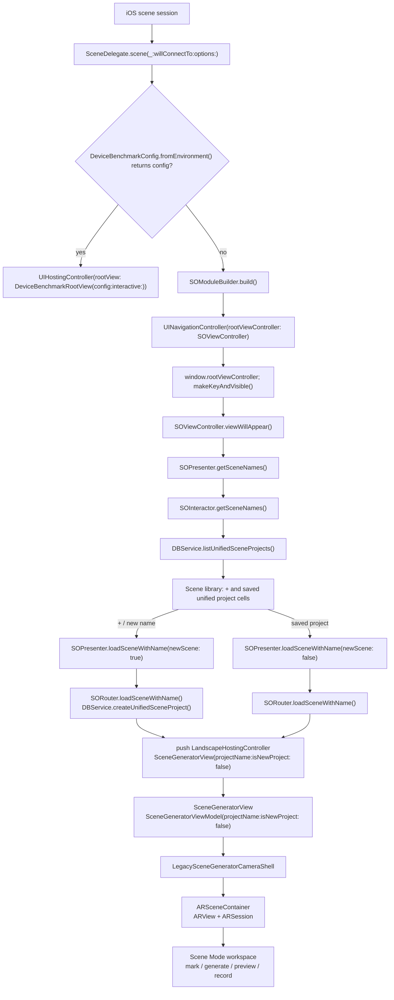
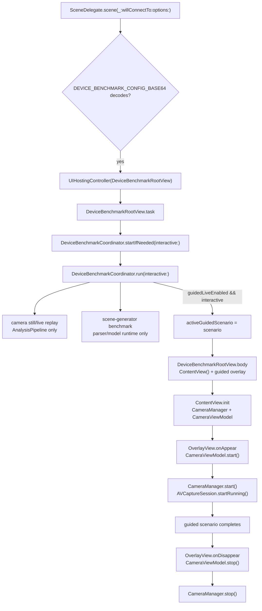

# CC-006 — Runtime entry and legacy route audit

Status: audit artifact only. No navigation, source, project, resource, test, product-plan, status, backlog, or other audit file was changed.

Baseline: `faf3e12abd6443877c7e5072fd67c878cce68553` (`docs: bootstrap camera coach delivery pipeline`), detached `HEAD` worktree.

Authorities used:

- Product: `docs/app-store-product-plan.md`.
- Execution state: `docs/implementation/STATUS.md`.
- Task definition: `docs/implementation/BACKLOG.md`, CC-006.
- Existing implementation documents and source below are evidence of the current runtime, not commercial product authority.

## Executive finding

The current normal launch is Scene Mode-first. `SceneDelegate.scene(_:willConnectTo:options:)` creates `SOModuleBuilder.build()`, wraps it in a hidden-navigation-bar `UINavigationController`, and installs that navigation controller as the window root (`shafinMultitool/Resources/SceneDelegate.swift:15-33`). `SOViewController` immediately presents the unified Scene Mode library and reads saved project names (`shafinMultitool/ScenesOverviewModule/SOViewController.swift:24-34`, `103-159`; `shafinMultitool/ScenesOverviewModule/SOInteractor.swift:21-31`).

The current Camera Coach implementation is not the normal entry. `ContentView` constructs a `CameraManager` and `CameraViewModel` (`shafinMultitool/Multitool2Module/ContentView.swift:10-35`), but the current source graph reaches `ContentView()` from `DeviceBenchmarkRootView` only when a benchmark guided-live scenario is active (`shafinMultitool/Benchmark/DeviceBenchmarkCoordinator.swift:1667-1671`). `multitool2App` has no `@main` and is therefore not the launch owner (`shafinMultitool/Multitool2Module/multitool2App.swift:8-15`).

The lowest-risk future seam is the normal, non-benchmark root composition branch in `SceneDelegate` (`shafinMultitool/Resources/SceneDelegate.swift:20-32`): make a single commercial shell the normal root, put Camera Coach in its default live route, and keep Scene Mode as a secondary route that reuses `SOModuleBuilder.build()`. The benchmark branch must remain a separate early branch. The shell owns route selection/containment only; it must not create a second `CameraManager`, `ARSession`, or recorder. Saved Scene Mode persistence remains owned by `DBService` and `SceneGeneratorViewModel`.

This is a recommendation for CC-007, not a navigation change in CC-006.

## Product and compatibility boundary

The product authority requires:

- Camera Coach opens by default; Scene Mode remains a secondary independent contour (`docs/app-store-product-plan.md:39-47`).
- The intended sections are Camera, Scenes, and History; Scenes contains existing projects and Scene Mode (`docs/app-store-product-plan.md:293-296`).
- Camera Coach 1.0 supports portrait and landscape, while the current Scene Mode is temporarily landscape (`docs/app-store-product-plan.md:364-369`, `981-982`).
- Existing saved scenes are persistent state. Deletion, incompatible migration, or mass conversion requires a separate backup/rollback plan and exact owner confirmation; removing legacy code must not remove projects or the ability to open an existing scene (`docs/app-store-product-plan.md:673-676`).
- Scene Mode must not create a second camera owner and must not return to the product's first screen (`docs/app-store-product-plan.md:809-819`).

The audit therefore preserves these boundaries:

1. No launch or navigation behavior changes are applied here.
2. The benchmark environment remains selected by `DEVICE_BENCHMARK_CONFIG_BASE64` before the normal commercial branch.
3. Unified Scene Mode project JSON and world-map files remain readable and writable through their existing owners.
4. The legacy `Scenes` store is not deleted, renamed, or migrated by this task.
5. Camera Coach and Scene Mode are separate runtime routes. A future shell may switch between them, but it may not mount two active camera/session owners for one user flow.
6. Orientation support is an explicit implementation gate. The current app target does not yet satisfy the product's portrait requirement.

## Launch graph

### Normal launch (current implementation)



Exact edge evidence:

| Edge | Current owner and evidence | Runtime consequence |
| --- | --- | --- |
| Scene session → normal root | `SceneDelegate.scene(_:willConnectTo:options:)`, `shafinMultitool/Resources/SceneDelegate.swift:15-33` | The normal root is chosen here; `AppDelegate` only logs launch at `shafinMultitool/Resources/AppDelegate.swift:10-19`. |
| Normal branch → Scene Mode assembly | `SOModuleBuilder.build()`, `SceneDelegate.swift:25-31`; builder wires `SOInteractor`, `SORouter`, `SOPresenter`, and `SOViewController` at `shafinMultitool/ScenesOverviewModule/SOModuleBuilder.swift:10-20` | The user sees the Scene library before Camera Coach. |
| Scene library → project list | `SOViewController.viewWillAppear()`, `SOViewController.swift:24-28`; `SOInteractor.getSceneNames()`, `SOInteractor.swift:29-31`; `DBService.listUnifiedSceneProjects()`, `shafinMultitool/Services/DBService.swift:120-134` | Existing unified project names are loaded from persistent storage every time the library appears. |
| New cell → project creation | `SOViewController.collectionView(_:didSelectItemAt:)`, `SOViewController.swift:129-154`; `SORouter.loadSceneWithName`, `SORouter.swift:18-29`; `DBService.createUnifiedSceneProject`, `DBService.swift:136-147` | A new project is created before the workspace is pushed. |
| Existing cell → workspace | `SOViewController.collectionView(_:didSelectItemAt:)`, `SOViewController.swift:156-159`; `SORouter.swift:31-35` | The existing name is passed into the same Scene Generator route with `isNewProject: false`. |
| Workspace → saved project load | `SceneGeneratorView.init`, `shafinMultitool/SceneGeneratorModule/Views/SceneGeneratorView.swift:10-18`; `SceneGeneratorViewModel.init`, `shafinMultitool/SceneGeneratorModule/ViewModels/SceneGeneratorViewModel.swift:385-408` | `isNewProject: false` calls `DBService.loadUnifiedSceneProject(named:)` and restores project/world-map state when present. |
| Workspace → AR session | `LegacySceneGeneratorCameraViewController.embedARView`, `shafinMultitool/SceneGeneratorModule/Views/LegacySceneGeneratorCameraShell.swift:111-121`; `ARSceneContainer.makeUIView`, `shafinMultitool/SceneGeneratorModule/Views/ARSceneContainer.swift:19-34`; `ARSceneContainer.Coordinator.configureSessionIfNeeded`, `ARSceneContainer.swift:166-176` | Scene Mode owns an `ARView`/`ARSession`; it is not the Camera Coach `AVCaptureSession`. |

### Benchmark launch (current implementation)



Exact benchmark edge evidence:

| Edge | Current owner and evidence | Camera/session implication |
| --- | --- | --- |
| Environment → benchmark root | `DeviceBenchmarkConfig.fromEnvironment`, `shafinMultitool/Benchmark/DeviceBenchmarkSupport.swift:75-125`; branch in `SceneDelegate.swift:20-24` | A valid base64 config bypasses the normal navigation controller entirely. |
| Root task → benchmark run | `DeviceBenchmarkRootView.task`, `shafinMultitool/Benchmark/DeviceBenchmarkCoordinator.swift:1708-1710`; `startIfNeeded`, `Coordinator.swift:304-308`; `start`, `Coordinator.swift:310-314` | Auto-start is controlled by `config.autoStart`. |
| Replay → pipeline only | `runCameraBenchmarks`, `Coordinator.swift:448-455`; `runSceneGeneratorBenchmarks`, `Coordinator.swift:583-625` | Still replay and parser/model benchmark work do not create `CameraManager` or an `ARView`. |
| Guided scenario → Camera Coach | `runCameraBenchmarks`, `Coordinator.swift:524-546` sets `activeGuidedScenario`; `DeviceBenchmarkRootView.body`, `Coordinator.swift:1667-1671` renders `ContentView()` | Only the guided-live UI branch creates the live Camera Coach owner. |
| Camera Coach view → capture session | `ContentView.init`, `shafinMultitool/Multitool2Module/ContentView.swift:14-30`; `CameraManager`, `shafinMultitool/Multitool2Module/Services/Camera/CameraManager.swift:35-60` | `CameraManager` owns one `AVCaptureSession`, configured/started by `CameraViewModel.start()` and `CameraManager.start()`. |
| Capture view lifecycle → stop | `OverlayView.onAppear/onDisappear`, `shafinMultitool/Multitool2Module/UI/Overlay/OverlayView.swift:154-170`; `CameraViewModel.start/stop`, `shafinMultitool/Multitool2Module/ViewModels/CameraViewModel.swift:72-89` | The current lifecycle stop is view-driven; a future shell must preserve the stop boundary when switching to Scene Mode. |

If the environment key is absent, malformed, not base64, or fails JSON decoding, `fromEnvironment` returns `nil` (`DeviceBenchmarkSupport.swift:117-124`) and the current implementation takes the normal Scene Mode branch. This is a current behavior fact; CC-007 will change only the non-benchmark commercial destination.

## Route and owner ledger

“Camera owner” means an object that creates or runs a live camera/session resource. A route can have more than one media resource when the current legacy recording design requires it; that is recorded explicitly rather than treated as one canonical owner.

| Route / entry | Reachability in current source graph | Navigation owner | Camera/session owner created | Persistent-state dependency | Orientation implication |
| --- | --- | --- | --- | --- | --- |
| Normal launch / Scene library | Reachable and current default | `SceneDelegate` creates `UINavigationController`; `SOModuleBuilder` assembles `SOViewController` | None on initial library screen | Reads `UnifiedSceneProjects` through `DBService.listUnifiedSceneProjects()` | App target is landscape-only; library has no per-controller orientation override. |
| Scene library “+” | Reachable | `SOViewController` presents `UIAlertController`; `SOPresenter` → `SORouter` | None until the pushed workspace mounts | Creates unified JSON before push via `DBService.createUnifiedSceneProject()` | Inherits app target mask. |
| Saved unified Scene Mode project | Reachable and protected | `SOViewController` → `SOPresenter` → `SORouter` pushes `LandscapeHostingController` | `ARSceneContainer` creates an `ARView`; its `ARSession` runs a world-tracking configuration. On recording, `SceneGeneratorViewModel` uses `CameraService.shared`, whose `prepareRecorder()` creates/starts a separate `audioCaptureSession` (`shafinMultitool/Services/CameraService.swift:16-18`, `55-104`). | `DBService.loadUnifiedSceneProject(named:)` loads project JSON and optional world map; the view model passes `initialWorldMap` into `ARWorldTrackingConfiguration` (`DBService.swift:167-188`; `SceneGeneratorViewModel.swift:385-408`, `650-657`). | `LegacySceneGeneratorCameraShell` lays out a 16:9 AR surface (`LegacySceneGeneratorCameraShell.swift:86-101`); product currently treats Scene Mode as landscape. |
| New unified Scene Mode project | Reachable | Same `SORouter` push as saved project | Same AR owner; no `initialWorldMap` when newly created | `createUnifiedSceneProject` writes the empty project; later `persistWorkspaceState` saves metadata and current world map (`SceneGeneratorView.swift:20-30`; `SceneGeneratorViewModel.swift:632-644`, `3656-3687`). | Same landscape assumption. |
| Scene Mode back/disappear | Reachable after entering Scene Mode | `LegacySceneGeneratorCameraShell` calls the `SceneGeneratorView` `onBack` closure; `SceneGeneratorView` persists and calls `dismiss()` (`SceneGeneratorView.swift:20-30`; `LegacySceneGeneratorCameraShell.swift:513-515`) | `ARSceneContainer.dismantleUIView` pauses the AR session and clears its delegate (`ARSceneContainer.swift:90-93`). Recording persistence is handled by the view model/`CameraService` path. | Project JSON and world map are saved before/while leaving; no route may bypass this persistence boundary. | No app-level portrait path exists today. |
| Stage Selection | Compiled, but no current source caller found by `rg` | `StageSelectionViewController.openSceneLibrary()` pushes `SOModuleBuilder.build()` (`shafinMultitool/SceneModules/StageSelectionViewController.swift:176-207`) | None in the stage screen; child Scene Mode creates the AR owner | Child uses the same unified Scene Mode store | `LandscapeHostingController` is only a marker for interactive-pop policy (`StageSelectionViewController.swift:209-215`); it does not override orientation. |
| Legacy `CameraScreenBuilder` / `CameraScreenViewController` | Compiled, but no current `CameraScreenBuilder.build` caller found by `rg` | `CameraScreenBuilder` wires the old VIPER route; `CameraScreenRouter.openScenesOverviewScreen()` pops to root (`shafinMultitool/SceneModules/CameraScreenModule/CameraScreenBuilder.swift:10-23`; `CameraScreenRouter.swift:15-25`) | `CameraScreenViewController` owns an `ARView`/`ARSession` (`CameraScreenViewController.swift:23-35`, `92-101`); `CameraScreenInteractor.prepareARView()` runs it; recording uses the shared legacy `CameraService` (`CameraScreenInteractor.swift:463-487`, `519-529`). | Uses legacy `Scenes/<name>_map` and `Scenes/<name>_data` through `DBService.loadARWorldMap/saveARWorldMap` (`DBService.swift:33-79`; `CameraScreenInteractor.swift:463-487`, `519-529`). | Inherits the landscape-only target; no controller override was found. |
| Camera Coach `ContentView` | Reachable in benchmark guided-live path; not normal launch | `DeviceBenchmarkRootView` conditionally composes it; there is no normal commercial shell yet | `ContentView.init` creates `CameraManager`, which owns an `AVCaptureSession`; `CameraViewModel.start/stop` controls it (`ContentView.swift:14-35`; `CameraManager.swift:35-80`; `CameraViewModel.swift:72-89`). | No Scene Mode persistence dependency; Coach state is currently in-memory. | `PreviewView.updateOrientation()` maps the active window orientation to `AVCaptureVideoOrientation` (`shafinMultitool/Multitool2Module/UI/Overlay/OverlayView.swift:393-453`), but the target mask still excludes portrait. |
| `multitool2App` SwiftUI app | Not a launch route | No runtime owner because `@main` is explicitly removed (`shafinMultitool/Multitool2Module/multitool2App.swift:8-15`) | Its `ContentView()` is a declaration/preview path, not an active app entry | None | Must not be selected as a second app entry. |

### Camera/session ownership conclusion

The current graph has three materially different media owners:

1. Camera Coach: `ContentView` → `CameraManager` → `AVCaptureSession`.
2. Current Scene Mode: `LegacySceneGeneratorCameraShell` → `ARSceneContainer` → `ARView.session` (`ARSession`), plus the shared `CameraService` recorder session only when recording is prepared.
3. Retained old CameraScreen: `CameraScreenViewController.arView.session` (`ARSession`), plus the shared legacy `CameraService` recording session.

The audit does not claim these are already simultaneously active in the current normal route. It does establish that a future shell must not construct a second Camera Coach `CameraManager`, and must stop/deactivate the live Coach route before activating an AR Scene Mode route. CC-009 owns the deeper lifecycle/concurrency audit; CC-006 only fixes the routing boundary in the evidence packet.

## Persistent-state map

### Unified Scene Mode projects (protected current path)

`DBService` stores unified projects under the app Documents directory in `UnifiedSceneProjects` (`shafinMultitool/Services/DBService.swift:11-18`, `222-247`). Each project has a JSON file named by UUID and an optional separate world-map file. `UnifiedSceneProject` carries the project identity, name, timestamps, description, marked objects, parsed script, planned scene, chunk state, and visual overlays (`shafinMultitool/Entity/SceneData.swift:43-87`).

The read/open/save chain is:

1. `SOInteractor.getSceneNames()` lists project summaries.
2. `SORouter.loadSceneWithName(title:newScene:)` creates a project only for the new-cell path, then pushes the same `SceneGeneratorView` for both new and existing names.
3. `SceneGeneratorViewModel.init(..., isNewProject: false)` loads the project and optional world map.
4. `SceneGeneratorViewModel.makeSessionConfiguration(depthEnabled:)` uses `initialWorldMap` when present.
5. `SceneGeneratorView.onDisappear` and its back closure call `persistWorkspaceState`; the view model captures the current world map when possible and calls `saveUnifiedSceneProject`.

The commercial shell must preserve this chain. It must not create a new “recent scenes” store, translate names into a different identifier, auto-delete old projects, or treat the Scene library as disposable onboarding.

### Legacy Scene Mode store (retained compatibility boundary)

`DBService` also retains a separate `Scenes` directory for legacy `<scene>_map` and `<scene>_data` files (`DBService.swift:14-16`, `33-79`, `214-220`). The old `CameraScreenInteractor` reads/writes that store. No current source caller reaches `CameraScreenBuilder`, but absence of a caller is not proof that user files are absent. The store stays read-compatible until a separate inventory/migration task proves otherwise and supplies backup/rollback evidence.

### Camera Coach state

The current `ContentView`/`CameraViewModel` route has no dependency on unified Scene Mode project files. That separation is useful: the default Coach route can be made commercial without making a new empty Scene Mode project or mutating a saved scene. Any future Coach history is outside CC-006 and must not be introduced as a side effect of route selection.

## Recommended commercial shell seam

### Canonical recommendation

Use the non-benchmark `else` branch of `SceneDelegate.scene(_:willConnectTo:options:)` as the single composition seam (`shafinMultitool/Resources/SceneDelegate.swift:20-32`). In CC-007, the branch should construct one commercial shell as the normal root. The shell's default child/route is Camera Coach; its secondary Scene Mode action enters the existing Scene library by reusing `SOModuleBuilder.build()` and the existing `SORouter`/`DBService` persistence chain.

The ownership split should be:

| Concern | Canonical owner after CC-007 | Boundary |
| --- | --- | --- |
| Normal-vs-benchmark root selection | `SceneDelegate.scene(_:willConnectTo:options:)` | Keep the environment check first; do not route benchmark launches through the commercial shell. |
| Commercial route selection and containment | One new shell owner selected by CC-007, composed only from the normal `SceneDelegate` branch | The shell owns navigation state and route transitions, not camera/session construction. |
| Live Camera Coach | Existing `ContentView` → `CameraViewModel` → `CameraManager` | Construct exactly one live Coach stack per active Coach route; preserve `OverlayView` start/stop semantics until CC-009 changes them. |
| Scene Mode library | Existing `SOModuleBuilder` → `SOViewController`/VIPER route | Keep list, new-project, existing-project, delete, and back behavior in the current owner for this slice. |
| Scene Mode persistence | Existing `DBService` + `SceneGeneratorViewModel` | Keep both unified project JSON and optional world-map file semantics. |
| Scene Mode AR session | Existing `ARSceneContainer`/`ARSession` owner | It must not be instantiated while an active Coach capture session remains live. |
| Orientation policy | Target-level settings plus route-specific camera/AR mapping; future implementation owner must be explicit | The current target mask is landscape-only; portrait support cannot be obtained by a shell-only claim. |
| Benchmark harness | Existing `SceneDelegate` benchmark branch + `DeviceBenchmarkRootView`/`DeviceBenchmarkCoordinator` | No commercial navigation changes in the benchmark branch. |

The shell should be a push/single-active-route boundary rather than an unexamined second tab tree. A tab or container that keeps both Camera Coach and Scene Mode mounted would risk retaining `ContentView.onAppear` state and an AR view at the same time. The exact visual control and labels remain CC-008 scope; the runtime requirement is only that route activation/deactivation is deterministic.

### Why this is the lowest-risk seam

- It changes one root composition decision while preserving the existing Scene Mode module assembly and persistence owners.
- It leaves the benchmark branch mechanically identical.
- It does not require a Scene Mode data migration.
- It does not make Scene Mode’s AR `ARSession` the commercial Camera Coach owner.
- It gives CC-009 a clear future lifecycle seam: one shell can assert that the Coach `CameraManager` stops before Scene Mode activates.
- It keeps the current `ContentView` camera pipeline intact while CC-008 defines product states and CC-009 audits lifecycle/concurrency.

### Rejected alternatives

| Alternative | Rejection reason |
| --- | --- |
| Put `ContentView()` directly at `window.rootViewController` with no shell | It makes Coach visually first but provides no explicit secondary Scene Mode route, leaves `@Environment(\.dismiss)` with root-level semantics, and does not establish a deterministic owner handoff. |
| Change `AppDelegate` or `Info.plist` to choose the product route | `AppDelegate` does not choose the scene root; `Info.plist` selects `SceneDelegate` configuration but does not own navigation. This would widen lifecycle/configuration scope without solving route ownership. |
| Make `StageSelectionViewController` the new root | It is a retained scene-first screen with no current source caller (`StageSelectionViewController.swift:176-207`), so it preserves the wrong first promise and adds another legacy entry. |
| Embed Coach inside `SOViewController` or the Scene library | Scene Mode remains the first explanation and the library stays a mandatory pre-camera step, contrary to the product baseline. It also mixes two route owners in the existing Scene Overview owner. |
| Reuse `CameraScreenBuilder`/old `CameraScreenViewController` for Coach | The route is unreferenced in the current graph, owns an AR session and legacy recorder path, and uses the old `Scenes` persistence format. It would add a parallel camera path instead of reusing the current Coach pipeline. |
| Reuse `SceneGeneratorView` as the commercial shell | It is an AR Scene Mode workspace with saved-project semantics and a landscape 16:9 layout, not the Camera Coach live pipeline. It would couple the commercial default to Scene Mode persistence and AR ownership. |
| Alter the benchmark branch to prove the Coach route | Benchmark is an environment-selected harness path and must remain unchanged. Its guided-live `ContentView` use is evidence of the Coach stack, not permission to make benchmark UI the commercial shell. |
| Activate `multitool2App` as a second `@main` | The source explicitly removed `@main`; reactivating it would create a competing app entry and bypass the existing scene delegate. |

## Orientation and camera implications

### Observed current state

The app target's Debug and Release build settings both set `INFOPLIST_KEY_UISupportedInterfaceOrientations` to landscape left/right (`shafinMultitool.xcodeproj/project.pbxproj:500-532`, especially `520`; `535-565`, especially `554`). `Info.plist` declares the scene manifest and `SceneDelegate`, but no orientation mask (`shafinMultitool/Info.plist:5-21`). No `supportedInterfaceOrientations`, `preferredInterfaceOrientationForPresentation`, or `shouldAutorotate` implementation was found in the app source during the focused search.

The camera pipelines do have route-local mapping:

- Camera Coach `PreviewView.updateOrientation()` reads the active `UIWindowScene.interfaceOrientation`, maps it to `AVCaptureVideoOrientation`, and forwards it to `CameraManager.setVideoOrientation` (`shafinMultitool/Multitool2Module/UI/Overlay/OverlayView.swift:421-453`, `477-484`; `CameraManager.swift:178-185`). `CameraManager` nevertheless starts with `.landscapeLeft` (`CameraManager.swift:44-48`).
- Scene Mode `ARSceneContainer.Coordinator` tracks the active interface orientation and uses it in `ARFrame.displayTransform` (`shafinMultitool/SceneGeneratorModule/Views/ARSceneContainer.swift:117-120`, `138-164`, `217-229`). `SceneGeneratorViewModel` maps portrait and landscape interface orientations to analysis orientations (`shafinMultitool/SceneGeneratorModule/ViewModels/SceneGeneratorViewModel.swift:3536-3547`).

These mappings do not override the target-level mask. The future Coach default therefore needs an explicit orientation implementation gate before it can claim the product contract:

1. Portrait launch reaches the Coach shell and does not bounce into landscape.
2. Rotating while live keeps the same `CameraManager`/capture session and selected settings; it does not reconstruct the view model or reset analysis.
3. Scene Mode remains a secondary landscape route until its own orientation decision is made.
4. The shell does not use orientation changes as a reason to create a second camera/session owner.

CC-006 records this as a compatibility risk. It does not edit the Xcode project, orientation mask, or controller overrides.

## Compatibility boundary and phased retirement

### Phase 0 — this audit (complete when accepted)

- Keep `SceneDelegate` normal and benchmark branches unchanged.
- Keep `SOModuleBuilder`, `SORouter`, `SOViewController`, `DBService`, Scene Generator, Stage Selection, and old CameraScreen source unchanged.
- Record exact current owners, persistent stores, and orientation mismatch.
- No deletion or migration.

### Phase 1 — CC-007 commercial shell

Allowed scope after CC-006 and CC-008 acceptance:

- Change only the normal root composition seam in `SceneDelegate` and the selected new shell/route files.
- Make Camera Coach the first commercial route.
- Expose Scene Mode as a secondary route into the existing `SOModuleBuilder` path.
- Add explicit route transition/lifecycle assertions so Coach stops before Scene Mode AR activation.
- Preserve benchmark root behavior and both persistence stores.

Not allowed in this phase:

- Deleting or renaming `StageSelectionViewController`, `CameraScreenBuilder`, `CameraScreenViewController`, `CameraService`, or `Scenes` files.
- Replacing `DBService` with a new project store.
- Moving camera/session creation into the shell.
- Treating the current landscape build setting as proof of Camera Coach portrait support.

### Phase 2 — ownership/lifecycle hardening (CC-009/CC-010 boundary)

Proceed only after the camera/session audit identifies the required change. Verify the active-route handoff, background/foreground behavior, permission handling, recording cleanup, orientation persistence, thermal behavior, and memory limits. A new owner or migration must be separately authorized; it is not implied by this launch audit.

### Phase 3 — retirement of duplicate user-visible routes

The following are candidates for later retirement, not deletions authorized here:

- `StageSelectionViewController` and its scene-first copy of library entry.
- `CameraScreenBuilder`, `CameraScreenRouter`, and the old `CameraScreenViewController` path, once no route, storyboard, test, deep link, or project reference reaches them.
- Any standalone/old Multitool entry once the target-wide source/project search confirms the only active entry is `SceneDelegate`.

Retirement triggers must all be true:

1. The commercial shell and secondary Scene Mode route pass the positive and negative tests below.
2. A target-wide search finds no runtime, storyboard, Xcode project, test, or deep-link reference to the candidate old route.
3. A fixture containing at least one unified project and, if still supported, one legacy `Scenes` project opens successfully before and after the candidate removal.
4. The route transition trace proves only one live camera/session owner is active at each point.
5. The product owner has an explicit backup/rollback decision for any legacy persistence migration.

The lingering-reference check is a gate, not a justification to delete files merely because they have no current Swift caller. Removing old code without the persistence and open-project evidence would violate the product boundary.

## Exact verification packet for CC-007 acceptance

These are test cases for the future navigation change. They are not claimed as executed by this audit.

### Positive cases

| ID | Preconditions and action | Exact acceptance evidence |
| --- | --- | --- |
| P-01 Coach-first clean launch | Remove/disable `DEVICE_BENCHMARK_CONFIG_BASE64`; launch a clean app; wait for the first route. | Initial route is the commercial shell's Camera Coach route; Scene library is not the first screen; exactly one `CameraManager`/`AVCaptureSession` is created; no Scene Mode `ARSession` is created. |
| P-02 Secondary Scene Mode entry | From P-01, use the shell's Scene Mode action. | Existing `SOModuleBuilder.build()`/`SOViewController` route appears; the Coach view stops its capture session before `ARSceneContainer` creates/runs an AR session; the shell does not create another camera owner. |
| P-03 New saved Scene Mode project | In P-02, select `+`, enter a unique name, save, mark or generate a small scene, then leave. | `DBService.createUnifiedSceneProject` creates one unified JSON; `persistWorkspaceState` writes updated project data and world map when available; leaving does not delete or overwrite another project. |
| P-04 Open an existing unified project | Preseed `UnifiedSceneProjects/<id>_project.json` and its optional `<id>_worldmap`; launch Coach; enter Scenes; select the preseeded name. | `SceneGeneratorViewModel.init(isNewProject: false)` loads the exact project; the AR configuration receives its saved world map; existing description/marked objects/planned state remain present. |
| P-05 Close and reopen persistence | From P-04, change a persisted field, leave with the Scene Mode back action, re-enter the same project after the library refreshes. | The updated JSON/world-map state is available on reopen; the Coach default route did not create a new Scene Mode project or change the project identity. |
| P-06 Benchmark entry unchanged | Provide a valid `DEVICE_BENCHMARK_CONFIG_BASE64`; launch with `autoStart` as currently configured. | `DeviceBenchmarkRootView` remains the root, the commercial shell is not inserted, benchmark status/auto-start behavior remains intact, and guided live creates `ContentView` only when `activeGuidedScenario` is set. |
| P-07 Benchmark replay without live owner | Use a valid config with guided live disabled or non-interactive replay. | Camera replay uses `AnalysisPipeline`; no `ContentView`, `CameraManager`, or live capture session is created solely by replay. |
| P-08 Coach orientation continuity | On a device/simulator configuration that supports the accepted orientation mask, launch Coach in portrait, rotate to landscape, and rotate back during live analysis. | Coach is available in both orientations; the same camera/session and selected lens/settings survive rotation; the analysis/recording pipeline does not restart or reset. |
| P-09 Legacy persistence compatibility | Preseed a legacy `Scenes/<name>_map` + `<name>_data` fixture if that store remains in supported scope; use the approved compatibility route/migration fixture. | The fixture is preserved or migrated only under an explicit migration plan; the user can open an equivalent scene; no mass deletion occurs. |

### Negative cases

| ID | Action | Exact failure that must not occur |
| --- | --- | --- |
| N-01 No scene-first regression | Launch with no benchmark environment. | `SOViewController`/Scene library must not be the first commercial screen. It may appear only after an explicit Scene Mode action. |
| N-02 Benchmark isolation | Launch with a valid benchmark environment, including guided-live and replay variants. | The commercial shell must not replace `DeviceBenchmarkRootView`; benchmark mode must not silently open the user-facing Scene library. |
| N-03 No duplicate live owner | Trace Coach → Scene Mode → saved project → back to Coach, including recording/paused states. | No overlap of a live Coach `AVCaptureSession` with a Scene Mode `ARSession`; no second `CameraManager`; no stale `CameraService` recorder left running after route exit. |
| N-04 Saved-project non-destruction | Launch Coach with existing unified projects on disk and enter Scenes. | Default routing must not call `createUnifiedSceneProject` for an existing name, delete a project, rename it, or replace the unified store. |
| N-05 Existing-project route remains distinct | Open an existing scene from Scenes after Coach-first launch. | The project must not be routed through `ContentView` or reconstructed as a new Coach session; it must use `SceneGeneratorView(projectName:isNewProject: false)` and restore its state. |
| N-06 No old route leakage | Traverse every visible Coach/Shell/Scenes control and inspect navigation trace. | No control reaches `StageSelectionViewController` or `CameraScreenBuilder`/`CameraScreenViewController` unless an explicitly retained compatibility entry is specified. |
| N-07 No old source caller before retirement | Run the bounded source/project/test/deep-link reference search before deleting an old route. | A retirement attempt fails the gate if any runtime, storyboard, Xcode project, test, or persistence adapter still references the route. |
| N-08 Orientation does not fake compliance | Launch the current baseline in portrait before the orientation change is implemented. | The release gate must not be marked passed: the current target mask is landscape-only. A shell-only route change cannot claim portrait support. |
| N-09 No persistence side effect from Coach entry | Launch Coach, exit without opening Scenes, and inspect Documents. | No empty unified Scene Mode project, world map, legacy scene file, or migration record is created solely by entering Camera Coach. |
| N-10 No invalid benchmark hijack | Set `DEVICE_BENCHMARK_CONFIG_BASE64` to invalid base64/invalid JSON. | `fromEnvironment` returns `nil`; the app takes the normal commercial branch after CC-007, without a crash or a partially initialized benchmark root. |

## Focused evidence/search record

The following searches are the minimum repeatable evidence for this audit and must remain the first check when the route changes:

```bash
rg -n --glob '*.swift' 'rootViewController|SOModuleBuilder|SceneGeneratorView|ContentView|UIHostingController|pushViewController|present\(' shafinMultitool
rg -n --glob '*.swift' 'supportedInterfaceOrientations|preferredInterfaceOrientationForPresentation|shouldAutorotate|UIInterfaceOrientationMask' shafinMultitool
rg -n --glob '*.swift' 'CameraManager|AVCaptureSession|ARSession|CameraService|CameraScreenBuilder|StageSelectionViewController' shafinMultitool
rg -n --glob '*.swift' 'DBService|UnifiedSceneProjects|Scenes|loadUnifiedSceneProject|saveUnifiedSceneProject|loadARWorldMap|saveARWorldMap' shafinMultitool
```

The current results are represented by the exact source citations in this document. The current orientation search finds no controller-level orientation override; the project setting is the effective landscape-only boundary.

## Decision and open ownership

### Decision recommended to Sol

Accept the `SceneDelegate` non-benchmark root composition branch as the single lowest-risk CC-007 seam. Make the future commercial shell own route selection, keep Camera Coach as its default route, reuse `SOModuleBuilder` for secondary Scene Mode, preserve `DBService`/`SceneGeneratorViewModel` persistence, and keep benchmark selection as the first branch.

### Decisions intentionally left open

- The concrete shell type/file and visual navigation control; CC-008 owns UX state specification and CC-007 owns the approved implementation packet.
- Whether the final shell uses a navigation push, a route container, or another single-active-route mechanism, provided the no-duplicate-owner negative test passes.
- The exact orientation implementation and target-setting migration; this requires an explicit implementation task because the current target mask conflicts with Camera Coach's product contract.
- The retirement date and migration policy for `StageSelectionViewController`, the old CameraScreen VIPER route, and the legacy `Scenes` store.
- The canonical recording/session owner after CC-009; this audit identifies current owners but does not perform the camera foundation migration.

## Audit stop state

The current launch/navigation graph is verified from source inspection at the cited symbols. The recommendation is bounded to routing composition and does not alter navigation. Acceptance still depends on CC-007 implementation, CC-008 UX specification, CC-009 camera/session ownership evidence, orientation implementation, and the positive/negative tests above.
