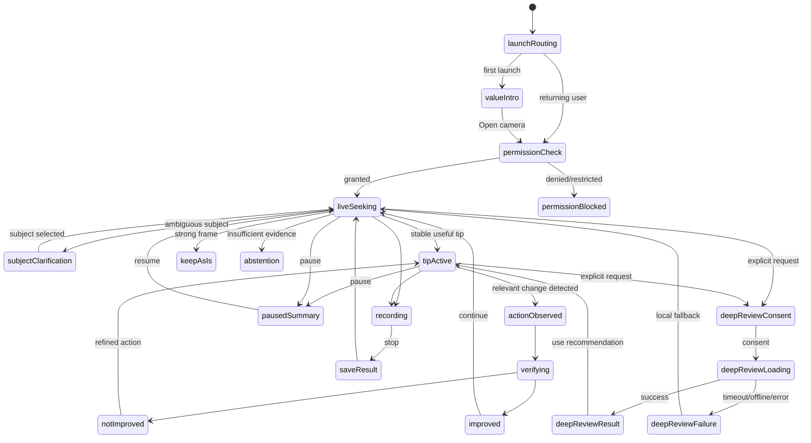

# CC-008 — Camera Coach UX state specification

Статус: `proposed_for_owner_acceptance`  
Дата: 15 августа 2026 года  
Product authority: `docs/app-store-product-plan.md`  
Runtime boundary: `docs/implementation/audits/runtime-entry-routing.md`

## 1. Назначение и боль

Этот документ определяет поведение коммерческого Camera Coach до реализации UI. Он не является коллекцией экранов или пожеланий к стилю: это исполнимый контракт состояний, переходов, восстановления, accessibility, аналитики и визуальной приёмки.

Центральная боль пользователя:

> «Я вижу кадр, но не понимаю, что именно в нём плохо, какое одно действие поможет и действительно ли после этого стало лучше».

Каждое состояние обязано помогать хотя бы одному этапу:

1. понять одну наблюдаемую проблему;
2. выполнить одно физическое действие;
3. проверить, стало ли лучше;
4. честно сохранить сильный кадр или воздержаться от ненадёжного совета.

Интерфейс не должен заставлять пользователя управлять продуктом вместо кадра. Первая ценность — не открытие камеры и не показ текста, а завершённый цикл `совет → действие → проверка`, либо обоснованный вердикт «оставить как есть».

## 2. Зафиксированные продуктовые решения

- Первый маршрут после допуска к камере — Camera Coach.
- Регистрация, тариф и обязательный выбор жанра отсутствуют.
- Локальный coaching loop, запись, Coach UI и Pro Controls бесплатны.
- Одновременно существует один активный route-level media owner.
- На экране одновременно одна главная рекомендация.
- Camera Coach сам ищет главный субъект; при реальной неоднозначности просит один тап по субъекту.
- Совет стабилен: новый совет не вытесняет активный, пока пользователь не успел понять или выполнить действие.
- Проверка «после» является частью бесплатного ядра и не скрывается за Deep Review.
- Camera Coach работает в portrait и landscape без пересоздания camera session или сброса выбранных настроек.
- Scene Mode остаётся вторичным landscape-only маршрутом и открывает существующую библиотеку проектов.
- Deep Review запускается только явным действием, не блокирует local Coach и до первой отправки объясняет передачу данных.
- Публичный paywall и формат оплаты не входят в этот UX baseline до beta evidence. Состояние исчерпанного beta allowance не обещает конкретный товар.

## 3. Информационная архитектура

### 3.1. Commercial shell

Базовая оболочка — нативная трёхсекционная навигация:

1. `Камера` — default selection и единственный владелец Camera Coach session.
2. `Сцены` — существующая Scene Mode library.
3. `История` — результаты текущей сессии; постоянная история появляется только если отдельно входит в реализованный scope.

Предпочтительный визуальный паттерн — системный tab bar без плавающей капсулы, glow или кастомного glass-контейнера. Реализация обязана лениво создавать media route и явно деактивировать текущий route до активации другого. Сохранённый view controller не означает сохранённую работающую camera/AR session.

Во время активной записи переключение разделов недоступно. Пользователь сначала завершает или отменяет запись. Во время незавершённой проверки советы не теряются: при уходе из `Камеры` сохраняется компактный session summary, а live camera останавливается.

### 3.2. Camera screen anatomy

Порядок слоёв от заднего к переднему:

1. Live preview на максимально доступной площади.
2. Функциональные guides: tap target субъекта, горизонт или зона рекомендации — только когда они помогают текущему действию.
3. Верхний status bar: состояние анализа, flash/lens при фактической поддержке, вход в Pro Controls. Внутренняя телеметрия отсутствует.
4. Один coaching surface в нижней трети, не закрывающий главный субъект. Это не dashboard и не stack карточек.
5. Нижние camera actions: pause/resume, record, Deep Review. Zoom использует системно узнаваемый control рядом с preview или record controls.
6. System tab bar в safe area, кроме полноэкранного recording focus state, если прототип докажет необходимость скрытия.

Coaching surface содержит не более четырёх смысловых элементов:

- короткий verdict или проблема;
- одно действие глаголом;
- необязательное `Почему?`;
- состояние проверки.

### 3.3. Визуальная система

- Основа: чёрный и семантические system background/material только там, где нужна читаемость поверх изображения.
- Акцент: `systemYellow` для выбранного субъекта, активной рекомендации и camera focus semantics.
- `systemRed` зарезервирован для записи и критической ошибки.
- `systemGreen` используется кратко только для проверенного улучшения или успешного сохранения.
- Типографика: Dynamic Type, системные text styles; действие крупнее объяснения, но без marketing hero.
- Радиусы следуют системным контролам. Произвольные «сверхкруглые» cards/pills запрещены.
- Blur используется локально для контраста текста над preview, а не как декоративная стеклянная архитектура.
- Haptic: light для выбора субъекта/переключения точного control; success только для подтверждённого улучшения или сохранения; warning для interruption/нехватки места; запись использует один чёткий impact на start/stop.
- Motion: 180–260 ms, системные easing; transition объясняет изменение состояния, не украшает его. Reduce Motion заменяет spatial animation на crossfade.

## 4. Глобальные правила поведения

### 4.1. Один главный action

В любом состоянии один action визуально главный. Остальные — secondary или text actions. Record остаётся узнаваемым camera control, но не конкурирует с обязательным recovery action в permission/error state.

### 4.2. Стабильность совета

- Candidate не показывается, пока не прошёл временной stability gate.
- После показа совет фиксируется минимум на время, достаточное для чтения и действия; точный interval выбирается benchmark, а не вкусовым hardcode.
- Новый совет не заменяет старый во время `tip_active`, `action_observed` или `verifying`.
- Пользователь может явно отклонить совет или возобновить live поиск.
- Изменение формулировки без изменения semantic action ID не анимируется как новый совет.
- При потере субъекта активный совет приостанавливается, а не превращается в другой категоричный совет.

### 4.3. Формула текста

Live copy строится так:

- проблема: наблюдаемое, без оценки автора — «Лицо темнее фона»;
- действие: один физический глагол — «Повернитесь к окну»;
- объяснение по тапу — «Так лицо станет читаемее без пересвета фона»;
- неуверенность — «Похоже…» или честное «Не могу надёжно оценить»;
- результат — «Стало лучше», «Изменение не помогло» или «Кадр уже сбалансирован».

Запрещены «AI думает», «магия», «идеальный кадр», fake score, сырые confidence percentages, trace IDs и профессиональный термин без перевода в действие.

### 4.4. Общий accessibility contract

- Minimum touch target 44×44 pt.
- Все icon-only controls имеют короткие accessibility labels и state/value.
- Live preview не перехватывает VoiceOver; распознанные субъекты представлены как доступные selectable elements, когда требуется выбор.
- Совет объявляется один раз после стабилизации, но промежуточный анализ не спамит announcements.
- Запись, пауза, проверка и ошибки доступны не только цветом, а формой, текстом и accessibility value.
- Dynamic Type до accessibility sizes не обрезает главный action; coaching surface может расширяться вверх, сохраняя видимой область действия.
- Voice Control получает уникальные названия действий.
- Reduce Transparency использует непрозрачную нейтральную подложку достаточного контраста.
- Landscape сохраняет логический reading order, а не просто поворачивает portrait stack.

## 5. State machine

## 6. Состояния запуска и разрешений

### S00 — Launch routing

- Вход: cold/warm launch после benchmark environment check.
- UI: нейтральный launch surface без AI-слогана и искусственной progress-анимации.
- Главный action: отсутствует; переход автоматический.
- Выход: first launch → S01; returning/granted → S04; unresolved → S02; denied/restricted → S03.
- Recovery: если camera composition не создаётся, показать S19, не Scene Mode и не пустой экран.
- Accessibility: launch не получает фокус дольше системного launch screen.
- Analytics: `app_route_resolved` с route и permission class, без hardware identifiers.
- Screenshot acceptance: отсутствие flashes старого Scene-first UI; portrait и landscape не показывают растянутый layout.

### S01 — First-value intro

- Вход: первый коммерческий запуск, onboarding не завершён.
- UI: один экран. Заголовок: польза «Одно действие, затем проверка результата». Коротко: локальный Coach работает на устройстве; Deep Review отправляет данные только после отдельного согласия. Никакой карусели функций.
- Главный action: `Открыть камеру`.
- Secondary: `Как обрабатываются данные` открывает короткое inline disclosure, не обязательную legal wall.
- Выход: tap primary → S02; onboarding считается пройденным только после намеренного действия.
- Recovery: закрытие disclosure возвращает в тот же экран и сохраняет primary visible.
- Accessibility: заголовок, описание, primary; illustration, если будет, decorative.
- Analytics: `onboarding_value_viewed`, `camera_open_intent`.
- Screenshot acceptance: один hierarchy focal point; нет hero-gradient, sparkle, feature cards, тарифа или регистрации.

### S02 — Camera permission request context

- Вход: пользователь нажал открыть камеру, status `.notDetermined`.
- UI: краткая context screen/inline transition: «Камера нужна, чтобы показать кадр и проверить изменение. Анализ по умолчанию выполняется локально».
- Главный action: `Продолжить`, после него ровно один системный request.
- Выход: granted → S04; denied/restricted → S03.
- Recovery: app inactive из-за system alert сохраняет состояние; повторный request не дублируется.
- Accessibility: системный alert остаётся системным; приложение не имитирует его.
- Analytics: `camera_permission_context_viewed`, `camera_permission_result` со значением, не с fingerprint.
- Screenshot acceptance: permission copy конкретно объясняет текущую пользу; нет запроса microphone/Photos/Speech «оптом».

### S03 — Camera unavailable / denied / restricted

- Вход: camera denied, restricted, hardware unavailable или runtime permission failure.
- UI: камера не маскируется fake preview. Заголовок различает: доступ выключен / ограничен системой / камера недоступна. Объясняется, что локальный Coach без камеры не работает.
- Главный action: denied → `Открыть Настройки`; restricted/hardware → `Повторить проверку` только если это может помочь.
- Secondary: `Открыть Сцены`, если Scene Mode доступен без немедленного camera access; действие не выдаётся как Camera Coach fallback.
- Выход: foreground recheck granted → S04; secondary → Scene route после camera route teardown.
- Recovery: если `openSettingsURLString` недоступен, показать точную инструкцию без dead end.
- Accessibility: причина и action объявляются; icon не является единственным носителем смысла.
- Analytics: `camera_unavailable_viewed`, `settings_open_requested`, `permission_recovered`.
- Screenshot acceptance: denied/restricted variants визуально различимы текстом; record и Deep Review отсутствуют.

## 7. Live Coach и coaching loop

### S04 — Live seeking / acquiring evidence

- Вход: camera granted, session running, route active, analysis enabled.
- UI: preview; спокойный status `Ищу главное в кадре…` только пока это полезно; controls доступны. Нет пустой большой карточки.
- Главный action: фактически `Поставить анализ на паузу`; record остаётся camera control.
- Выход: stable candidate → S06; ambiguity → S05; strong frame → S10; insufficient evidence → S11; pause → S12; record → S14; Deep Review → S17.
- Recovery: краткая потеря frame/subject сохраняет нейтральный seeking state; длительная pipeline failure → S19.
- Accessibility: промежуточные frame updates не объявляются; status имеет обновляемое value без repeated focus steal.
- Analytics: `coach_live_started`, `analysis_seeking_started`; duration агрегируется локально.
- Screenshot acceptance: preview доминирует; controls читаются на светлом, тёмном и шумном кадре; нет debug score.

### S05 — Subject clarification

- Вход: несколько равноправных субъектов или low subject confidence, где один тап реально снимает неоднозначность.
- UI: tappable outlines/markers вокруг кандидатов и короткое `Что здесь главное?`. Background не превращается в полный modal.
- Главный action: tap по субъекту.
- Secondary: `Ничего из этого` → S11 или свободный tap по preview, если pipeline поддерживает.
- Выход: selection locked → S04 с кратким light haptic; потеря выбранного субъекта → S05/S11 без угадывания другого.
- Recovery: если outlines недоступны, пользователь делает tap по preview; если кандидатов нет, состояние снимается.
- Accessibility: каждый кандидат — `Субъект 1, человек слева`/наблюдаемое описание без биометрической идентификации; есть rotor/order.
- Analytics: `subject_clarification_shown`, `subject_selected`, `subject_clarification_dismissed`; не сохранять лицо/координаты в telemetry.
- Screenshot acceptance: markers не перекрывают лица/предметы; выбран только один; отсутствуют genre chips.

### S06 — Stable tip active

- Вход: один tip прошёл relevance, safety и stability gates.
- UI: одна coaching surface. Первая строка — наблюдаемая проблема; вторая — одно действие. `Почему?` раскрывает S07 inline. Progress spinner отсутствует.
- Главный action: выполнить действие в реальном мире; UI не требует нажать `Готово`, если изменение можно наблюдать.
- Secondary: `Пауза`, `Не подходит`, Deep Review.
- Выход: relevant change → S08; reject → S04 с reason sheet максимум из 3 конкретных причин + `Другое` без обязательного текста; pause → S12; record → S14.
- Recovery: субъект потерян → tip visually pauses and S05/S11; pipeline late callback не заменяет active semantic action.
- Accessibility: совет объявляется один раз; `Почему?` и `Не подходит` имеют самостоятельные labels.
- Analytics: `tip_stabilized`, `tip_explanation_opened`, `tip_rejected`; semantic action ID и broad category допустимы, raw frame — нет.
- Screenshot acceptance: помещается одна рекомендация, длинная localized copy не обрезана; нет carousel и competing cards.

### S07 — Tip explanation expanded

- Вход: tap `Почему?` из S06.
- UI: coaching surface увеличивается в том же месте; максимум 2–3 предложения: наблюдение → причина → ожидаемый эффект. Не bottom sheet и не отдельный урок.
- Главный action: `Понятно`/collapse.
- Secondary: `Не подходит`.
- Выход: collapse → S06; observed action может перевести в S08 даже при раскрытом explanation.
- Recovery: поворот сохраняет раскрытие и активный tip.
- Accessibility: expanded state и heading объявлены; focus переходит на explanation, collapse возвращает на trigger.
- Analytics: тот же `tip_explanation_opened`, `tip_explanation_closed`.
- Screenshot acceptance: explanation не закрывает ожидаемую область действия; нет терминологического essay.

### S08 — Relevant action observed

- Вход: pipeline обнаружил изменение, релевантное текущему semantic action.
- UI: короткая non-blocking confirmation `Изменение вижу — проверяю`; активный совет остаётся контекстом.
- Главный action: отсутствует; автоматический переход.
- Выход: достаточно after evidence → S09; изменение откатилось/нестабильно → S06.
- Recovery: timeout возвращает S06 с `Не удалось стабильно проверить`, а не false success.
- Accessibility: одна announcement; continuous progress не озвучивается.
- Analytics: `tip_action_observed` с action ID и elapsed bucket.
- Screenshot acceptance: transition не выглядит как награда до проверки; зелёный success не используется.

### S09 — Before/after verification

- Вход: сохранены сопоставимые before и after evidence для текущего tip.
- UI: compact verification state без fake percent. Формулировка `Сравниваю с предыдущим кадром…`; при pause result может показать две controlled thumbnails только если privacy/storage contract это разрешает.
- Главный action: отсутствует во время bounded evaluation; `Отменить проверку` появляется при превышении normal latency.
- Выход: improvement → S10a; neutral/worse → S10b; insufficient comparable evidence → S11.
- Recovery: новый субъект/резкий camera move invalidates comparison и возвращает S06/S04 с объяснением.
- Accessibility: progress имеет label и не использует бесконечный неопределённый status без timeout.
- Analytics: `tip_verification_started`, затем result event с ordinal result, не выдуманной causal certainty.
- Screenshot acceptance: previous/current явно подписаны, если показываются; нет pseudo-scientific score ring.

### S10a — Improvement confirmed

- Вход: accepted verification показывает улучшение по наблюдаемой метрике без запрещённого побочного ухудшения.
- UI: краткий success haptic и `Стало лучше` + конкретное наблюдение. Green используется только на result accent, не заливает экран.
- Главный action: `Продолжить съёмку`.
- Secondary: `Почему лучше?`, record.
- Выход: primary → S04; record → S14; result остаётся в current session history.
- Recovery: если пользователь сразу меняет кадр, success не закрепляется как вечный verdict; новый цикл starts only after explicit/short settle.
- Accessibility: result announced once; haptic не единственное подтверждение.
- Analytics: `tip_verification_completed(result: improved)`, `first_helpful_loop_completed` только один раз по правилам активации.
- Screenshot acceptance: спокойный инструментальный success, без confetti, streak, praise или «идеально!».

### S10b — Not improved / advice correction

- Вход: изменение не улучшило целевую метрику, ухудшило другую safety metric или comparison inconclusive после наблюдаемого действия.
- UI: `Это изменение не помогло` без обвинения пользователя. Если есть надёжная refinement — одно новое действие; иначе возврат к поиску.
- Главный action: refinement → `Попробовать иначе`; без refinement → `Вернуться к live`.
- Secondary: `Оставить исходный вариант`, если before state доступен только как reference, не как возможность физически восстановить сцену.
- Выход: refinement → S06 с новым semantic action; live → S04.
- Recovery: никогда не показывать false failure, если before/after несопоставимы — использовать S11.
- Accessibility: neutral tone; результат и следующий action разделены headings.
- Analytics: `tip_verification_completed(result: not_improved|worse)`, `tip_refined`.
- Screenshot acceptance: red error styling не используется для нормального результата эксперимента.

### S10c — Keep as is

- Вход: strong-frame policy не находит полезного безопасного исправления.
- UI: `Кадр уже сбалансирован` + одно наблюдаемое основание. Не выдаётся 100% или aesthetic score.
- Главный action: `Снимать`.
- Secondary: Deep Review, если пользователь хочет второе мнение.
- Выход: record → S14; meaningful scene change → S04.
- Recovery: verdict снимается при смене субъекта/света/composition.
- Accessibility: объявляется как полноценный результат, а не отсутствие данных.
- Analytics: `keep_as_is_shown`; первый показ может завершить activation event с отдельным result class.
- Screenshot acceptance: состояние визуально положительное, но не геймифицированное; нет выдуманной проблемы.

### S11 — Honest abstention / insufficient evidence

- Вход: low confidence, unsupported scene, потеря субъекта, запрещённый совет или несопоставимые evidence.
- UI: точная причина из безопасного каталога: `Не вижу главное`, `Слишком мало света для надёжной оценки`, `Кадр меняется слишком быстро`. Если есть исправимое условие — одно действие.
- Главный action: исправимое → конкретное recovery; иначе `Продолжить без совета`.
- Secondary: выбор субъекта или Deep Review только если он действительно поддерживает случай.
- Выход: evidence recovered → S04; continue → live preview без навязчивого повторения.
- Recovery: rate-limit повторного abstention; не мигать между tip и abstention.
- Accessibility: причина не зависит от overlay marker; recovery читается отдельно.
- Analytics: `coach_abstained` с reason enum и duration; raw content не логируется.
- Screenshot acceptance: выглядит намеренным безопасным состоянием, не поломкой и не пустой карточкой.

## 8. Pause, recording и сохранение

### S12 — Paused session summary

- Вход: пользователь нажал pause из live/tip state.
- UI: preview может freeze или продолжать без анализа — выбор реализации обязан быть однозначно обозначен. Baseline decision: preview продолжает показываться, analysis и tip switching остановлены. Показаны current tip/result и до трёх фактов текущей сессии как редакторский список, не cards grid.
- Главный action: `Продолжить анализ`.
- Secondary: Deep Review текущего evidence, History, завершить сессию.
- Выход: resume → прежний live context без session recreation; route exit → summary retained if supported.
- Recovery: camera interruption while paused uses S19 and не маскируется pause.
- Accessibility: pause toggle имеет selected state; moving preview не создаёт accessibility noise.
- Analytics: `analysis_paused`, `analysis_resumed`, `session_summary_viewed`.
- Screenshot acceptance: один report hierarchy; не dashboard; current tip сохраняет связь с live.

### S13 — Pro Controls expanded

- Вход: explicit tap `Pro` из active Camera route.
- UI: один точный control group за раз (например, exposure); system-like sliders/dials, current value и `Auto`. Не отдельный режим и не paywall.
- Главный action: изменение выбранного control; `Готово` закрывает слой.
- Выход: close → предыдущее Coach state; rotation сохраняет values; route exit persists accepted settings by camera contract.
- Recovery: unsupported control disabled with reason; failed device lock reverts visible value.
- Accessibility: adjustable actions, units и current value; precision не зависит от drag only.
- Analytics: `pro_controls_opened`, `camera_control_changed` с control/value bucket, не continuous raw stream.
- Screenshot acceptance: Coach остаётся видимым/понятным; control не выглядит как набор случайных pills; слово Pro не сопровождается crown/lock.

### S14 — Recording active

- Вход: record tap после необходимого microphone context/permission; camera available, storage preflight accepted.
- UI: системно узнаваемый red recording state, elapsed time, stop. Analysis может продолжаться только если performance contract это допускает; совет не перекрывает critical record controls.
- Главный action: `Остановить запись`.
- Secondary: pause recording только если реально поддерживается; tabs, lens/session-destructive controls и Scene route disabled.
- Выход: stop → S15; interruption/storage/thermal critical → S16 с recoverable artifact status.
- Recovery: background/interruption invokes explicit stop/finalize contract; никакого silent lost recording.
- Accessibility: elapsed time доступен по запросу, не объявляется каждую секунду; start/stop имеют разные labels/states.
- Analytics: `record_started`, `record_stopped`, `record_interrupted` с duration bucket/error class.
- Screenshot acceptance: recording unmistakable without color; no modal over stop control; landscape reachable one-handed where possible.

### S15 — Save result

- Вход: recorder finalized a valid file.
- UI: bounded saving state, затем `Видео сохранено` или action required for Photos permission. Local file ownership remains explicit until copy succeeds.
- Главный action: success → `Продолжить`; Photos notDetermined → contextual `Сохранить в Фото`; failure → `Повторить`.
- Secondary: `Поделиться` only after valid artifact; `Удалить` требует destructive confirmation.
- Выход: success/continue → previous Coach state; retry → saving; delete → S04.
- Recovery: denied Photos предлагает Settings и сохраняет recoverable local artifact according to storage policy; no duplicate saves on retry.
- Accessibility: success/error and destination announced; thumbnail has useful label, not raw filename.
- Analytics: `record_save_result` with destination/result/error class; filename/path not logged.
- Screenshot acceptance: clear destination; no fake cloud state; share absent until file ready.

### S16 — Recording/save failure

- Вход: recorder failure, insufficient storage, interruption, save failure or thermal forced stop.
- UI: конкретно сообщает, существует ли recoverable video. Failure hierarchy precedes coaching UI.
- Главный action: recoverable → `Сохранить повторно`; no artifact → `Вернуться к камере`.
- Secondary: Settings/storage guidance when actionable; delete partial artifact only explicitly.
- Выход: retry success → S15; dismiss → S04 after owner cleanup.
- Recovery: app relaunch can surface pending recoverable artifact if storage policy supports it; otherwise document limitation.
- Accessibility: warning haptic + text; destructive action named fully.
- Analytics: `record_failure_viewed`, `record_recovery_attempted`.
- Screenshot acceptance: does not claim saved when only temporary; no blame, no generic `Что-то пошло не так` if error class is known.

## 9. Deep Review

### S17 — Deep Review disclosure and consent

- Вход: explicit Deep Review tap; local Coach remains available underneath but request not started.
- UI: what will be sent, purpose, whether before/after/current evidence, temporary handling as actually implemented, remaining beta allowance, and cancel. Unknown retention/region must not be invented in copy.
- Главный action: `Отправить на разбор` only when disclosure fields are backed by actual backend contract.
- Secondary: `Остаться в локальном Coach`.
- Выход: consent → S18; cancel → exact prior Coach state.
- Recovery: missing privacy configuration disables send and explains local fallback.
- Accessibility: disclosure read order before consent; remaining allowance is text, not badge only.
- Analytics: `deep_review_disclosure_viewed`, `deep_review_consented|cancelled`; no media in analytics.
- Screenshot acceptance: looks like a clear service action, not fear wall or marketing paywall; local alternative visible.

### S18 — Deep Review request in progress

- Вход: validated payload and explicit consent; allowance reservation semantics known.
- UI: bounded progress with cancel and `Можно продолжить локально`, if background request contract supports it. Preview is not blocked by full-screen spinner.
- Главный action: `Продолжить локально` or `Отменить`, depending on request state.
- Выход: success → S18a; offline/timeout/server/schema error → S18b; cancelled → prior Coach state.
- Recovery: idempotency prevents double charge/allowance consumption; late response cannot overwrite newer case.
- Accessibility: progress/status announced on meaningful phase changes only.
- Analytics: `deep_review_requested`, `deep_review_completed|failed|cancelled`, latency bucket, cost/server model only in server ops telemetry.
- Screenshot acceptance: no fake percentage unless backend supplies real progress; camera remains useful.

### S18a — Deep Review result

- Вход: client-validated structured server result for same case.
- UI: editorial report: verdict, `Что уже хорошо`, one priority `Что изменить`, explanation, reliability in plain language, and comparison when available. Sections separated typographically, not as card soup.
- Главный action: `Применить совет` returns to Camera with one semantic action.
- Secondary: `Сохранить в текущей сессии`, close.
- Выход: apply → S06 using validated action; close → prior Coach state.
- Recovery: unsupported action/schema falls back to safe textual report or S18b; it never injects arbitrary generated UI/camera command.
- Accessibility: headings and reading order; before/after images have labels; result is selectable text where useful.
- Analytics: `deep_review_result_viewed`, `deep_review_action_applied`, server-over-local comparison identifiers without raw content.
- Screenshot acceptance: report, not dashboard; no AI glow/sparkles; long text readable in Dynamic Type.

### S18b — Deep Review unavailable

- Вход: offline, timeout, quota/allowance exhausted, rate limit, server error or invalid response.
- UI: exact category and whether allowance was consumed. Local Coach availability is the dominant recovery.
- Главный action: transient → `Повторить`; offline → `Продолжить локально`; exhausted beta allowance → `Продолжить локально`.
- Secondary: cancel. Public purchase action does not exist until a separately approved monetization contract.
- Выход: retry → S18; local → prior/S04.
- Recovery: automatic retry only if idempotent and bounded; no repeated consent if payload/privacy contract unchanged within session.
- Accessibility: error and allowance status announced; network state not represented by icon only.
- Analytics: `deep_review_failed` with enumerated reason, retry count, allowance outcome.
- Screenshot acceptance: no dead end, bait-and-switch paywall or blocked camera.

## 10. System pressure, lifecycle и route transitions

### S19 — Camera interruption / lifecycle recovery

- Вход: session interruption, runtime error, app background/foreground mismatch, media services reset or owner invariant failure.
- UI: preview frozen/hidden honestly; message distinguishes temporary interruption from permission loss. Recording artifact status takes precedence.
- Главный action: recoverable → `Возобновить камеру`; owner invariant violation in debug fails loudly, release shows safe restart.
- Secondary: open Settings where relevant; leave to Scenes only after teardown.
- Выход: verified single owner + running session → previous stable state/S04; denied → S03; unrecoverable → non-camera shell state.
- Recovery: bounded restart, no recursive startRunning calls, no duplicate owner.
- Accessibility: interruption announced once; resume receives focus.
- Analytics: `camera_interrupted`, `camera_recovery_result`, invariant counter without personal data.
- Screenshot acceptance: no stale live indicators over frozen preview; record state never falsely remains active.

### S20 — Thermal or memory pressure

- Вход: supported thermal/memory signal crosses implemented threshold.
- UI: staged degradation. Serious: `Снижаю частоту анализа, запись доступна` if true. Critical: pause analysis or safely stop record according to camera contract. No dramatic full-screen warning unless action required.
- Главный action: serious none/acknowledge; critical `Продолжить без анализа` or recording recovery.
- Secondary: `Почему?` explains device protection briefly.
- Выход: recovered after hysteresis → prior state; app does not oscillate modes.
- Recovery: selected camera settings and current tip retained where safe; pipeline work cancelled deterministically.
- Accessibility: warning text + haptic; temperature is not guessed or displayed as fabricated degrees.
- Analytics: `performance_degraded` with thermal enum/feature changes; no continuous device fingerprint.
- Screenshot acceptance: clear capability impact; no fake optimizer animation.

### S21 — Offline

- Вход: network unavailable while local Coach is otherwise healthy.
- UI: local live interface remains normal. Small status appears only when user opens Deep Review or when a pending request needs attention.
- Главный action: in camera none; in Deep Review `Продолжить локально`.
- Выход: network returns silently; explicit request may retry.
- Recovery: no global offline modal and no disabling local coaching/recording.
- Accessibility: status announced only in relevant server context.
- Analytics: avoid continuous reachability telemetry; server request outcome is sufficient.
- Screenshot acceptance: Camera screen does not look broken merely because network is absent.

### S22 — Rotation

- Вход: interface orientation changes while Camera route active in non-forbidden transition.
- UI: portrait anatomy reflows vertically; landscape moves coaching surface/control group beside or along lower safe edge so subject remains visible. Content does not merely scale/rotate.
- Главный action: unchanged from underlying state.
- Выход: same semantic state, same owner/session, same active tip, recording and settings.
- Recovery: unsupported device orientation keeps last valid layout; Scene Mode requests landscape through explicit route transition only.
- Accessibility: focus and reading order preserved; control labels unchanged.
- Analytics: no event needed for every rotation; test diagnostics may record transition counts locally.
- Screenshot acceptance: all key states captured in both orientations; no clipped controls, camera restart flash or misplaced preview transform.

### S23 — Enter Scene Mode

- Вход: user selects `Сцены`; recording inactive; Camera shell requests route transition.
- UI: if active unsaved recording exists, resolve S15/S16 first. Otherwise transition through a short neutral state only if teardown takes perceptible time.
- Главный action: section selection.
- Выход: Camera analysis stops, capture session deactivates, then existing Scene library opens. Existing projects remain unchanged.
- Recovery: if Camera owner cannot teardown, Scene AR owner does not start; show S19 and allow retry.
- Accessibility: selected section changes only after route becomes active.
- Analytics: `section_selected(scenes)`, `media_owner_transition_result`.
- Screenshot acceptance: Scene library is secondary, landscape-only and contains saved projects; no Camera Coach overlay remains.

### S24 — Return to Camera

- Вход: user selects `Камера` from History/Scenes; Scene Mode has persisted/paused AR owner.
- UI: Camera route restores last safe UI mode, but starts a fresh evidence window; stale before/after comparison is not silently reused after AR route.
- Главный action: section selection.
- Выход: exactly one CameraManager/session active → S04 or paused state if explicitly preserved.
- Recovery: permission rechecked; start failure → S03/S19.
- Accessibility: Camera tab selection and readiness announced without speaking every analysis update.
- Analytics: `section_selected(camera)`, owner transition result.
- Screenshot acceptance: no duplicate preview, black orphan view, old Scene overlay or reset onboarding.

## 11. History

### S25 — Current session history

- Вход: user selects History or opens from pause/result.
- UI: chronological editorial list of coaching cases: observed issue, action, result, optional user-owned thumbnail if storage/privacy scope permits. Не analytics dashboard и не grid cards.
- Главный action: select a case to inspect.
- Secondary: clear current session with confirmation; export only if implemented.
- Выход: case → S25a; Camera tab → S24.
- Recovery: empty state explains that completed advice/results appear here; primary `Открыть камеру`.
- Accessibility: sections use headings/time labels; before/after images have meaningful alt labels.
- Analytics: `history_viewed`, `history_case_opened`; contents not duplicated into telemetry.
- Screenshot acceptance: empty/populated/long-copy states; no subscription lock on user-owned results.

### S25a — Coaching case detail

- Вход: select current-session case.
- UI: problem → action → verification result; optional before/after. Same editorial language as Deep Review but clearly marked `Локальный разбор` or `Deep Review`.
- Главный action: `Вернуться к камере` or `Повторить совет` only if scene relevance can be revalidated.
- Secondary: delete/export according to scope.
- Выход: return → S24/S25.
- Recovery: missing media still shows textual result; never broken thumbnail as main content.
- Accessibility: linear reading order, selectable text, explicit result.
- Analytics: `history_case_opened`, `history_action_reused`.
- Screenshot acceptance: source distinction visible without premium badge; no false persistent-history promise.

## 12. Analytics semantics for CC-012

CC-008 defines semantic moments, not the final transport schema. CC-012 must version and privacy-map these families:

- activation: `first_helpful_loop_completed`, including `improved` or `keep_as_is`;
- live: start, seeking duration, stable tip, abstention;
- intent: subject clarification, explanation, reject;
- action: observed, verification started/completed, refinement;
- capture: permission context/result, recording/save/recovery;
- Deep Review: disclosure, consent, request, result, failure, allowance outcome, action applied;
- lifecycle: interruption/recovery, owner transition invariant, thermal degradation;
- navigation: section selection and current-session history use.

Запрещено по умолчанию отправлять raw frame/video/audio, face embeddings, exact subject coordinates, free-form scene descriptions, local paths, project names, raw diagnostic trace или stable hardware fingerprint. Событие не утверждает причинность, если клиент наблюдает только корреляцию до/после.

## 13. Screenshot и scenario acceptance matrix

Каждая implementation slice поставляет screenshots или snapshot evidence минимум для:

| Сценарий | Portrait | Landscape | Светлый кадр | Тёмный кадр | Шумный кадр | AX/Dynamic Type |
| --- | --- | --- | --- | --- | --- | --- |
| First value + permission context | да | да | не применимо | не применимо | не применимо | да |
| Live seeking | да | да | да | да | да | да |
| Subject clarification | да | да | да | да | да | да |
| Stable tip + explanation | да | да | да | да | да | да |
| Improved / not improved / keep / abstain | да | да | да | да | да | да |
| Pause + Pro Controls | да | да | да | да | да | да |
| Recording + save failure | да | да | да | да | да | да |
| Deep Review disclosure/loading/result/failure | да | да | да | да | да | да |
| Interruption/thermal/offline | да | да | да | да | да | да |
| History empty/populated/detail | да | да | не применимо | не применимо | не применимо | да |
| Scene transition | Camera: да | Scene: landscape | да | да | да | да |

Визуальная приёмка отклоняет экран, если:

- preview перестаёт быть главным содержимым Camera route;
- одновременно конкурируют две рекомендации или два primary action;
- иерархия построена из одинаковых floating cards;
- декоративный blur/glow/gradient не кодирует состояние;
- advice state мерцает или меняет layout при каждом frame update;
- confidence изображён точным процентом без валидированного смысла;
- success использует confetti, streak, praise или anthropomorphic coach;
- denied/offline/timeout/quota/thermal state ведёт в dead end;
- Dynamic Type обрезает действие или закрывает subject;
- цвет является единственным признаком записи, успеха или ошибки;
- переход между Camera и Scene оставляет два media owner активными.

## 14. Implementation slicing

Luna не принимает визуальные или продуктовые решения. После owner acceptance Sol преобразует этот документ в независимые packets:

1. Shell skeleton и single-active-route lifecycle без полировки.
2. Design tokens и reusable camera controls по существующим проектным patterns.
3. First-value onboarding и camera permission state machine.
4. Live seeking, subject clarification и stable-tip surface на mock state source.
5. Verification result states и pause summary.
6. Recording/save states поверх принятого camera ownership contract.
7. Deep Review disclosure/result/failure на protocol mock без paid backend action.
8. Current-session History.
9. Portrait/landscape adaptive layouts.
10. Accessibility identifiers, VoiceOver/Dynamic Type tests и screenshot matrix.
11. Analytics adapter после CC-003 и CC-012.

Каждый packet обязан иметь точные owned files, starting commit, non-edits, mock contracts, focused tests, build command, screenshot states и rollback. Реальный camera lifecycle code не меняется до принятия CC-009 и выбранной классификации CC-010.

## 15. Owner acceptance checklist

Перед переводом CC-008 в `accepted` владелец продукта подтверждает единым решением:

- Camera-first shell с нативными разделами `Камера / Сцены / История`;
- одна подсказка и бесплатная проверка результата;
- системный тёмный camera-tool стиль с `systemYellow` как функциональным акцентом;
- спокойный, неантропоморфный coaching language;
- отсутствие paywall до отдельного beta evidence decision;
- Scene Mode как вторичный landscape-only route;
- перечисленные banned vibe-code patterns и screenshot gates.

После подтверждения открытых визуальных решений для Luna нет. Фактическая usability и качество советов всё равно проверяются внешней beta; этот документ не объявляет их доказанными заранее.
