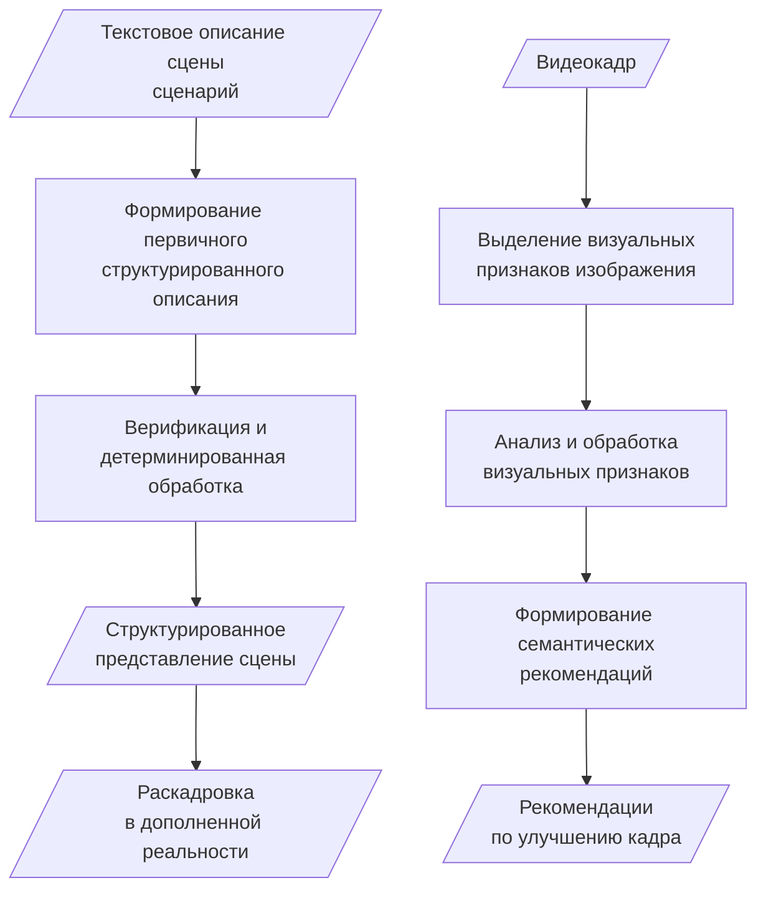

# Chapter 2. Architecture

## Purpose

Describe the high-level architecture of the mobile iOS product before the implementation chapter: two functional modules, their inputs/outputs, shared local processing principles, and the MVVM/Swift/SwiftUI technology context.

## Proposed sections

Chapter 2 is kept as a single compact architecture chapter without numbered subsections:
- product scope as a mobile iOS application for preproduction and shooting assistance;
- module list and high-level responsibilities;
- MVVM, Swift and SwiftUI technology choice;
- Figure 2.1 with two processing contours;
- short explanation of the two contours and their shared local processing logic;
- transition to Chapter 3 as implementation of the described modules.

## Claims and evidence

| Use | IDs |
|---|---|
| Bridge from litreview | CL-BR-001, CL-BR-002, CL-BR-003 |
| Architecture | CL-ARCH-001 |
| Evidence | EV-ARCH-001, EV-BUNDLE-001, EV-CA-001, EV-CA-002 |

## Litreview links

| Litreview fragment | Architecture continuation |
|---|---|
| AR/previsualization and mobile constraints | Scene Generator with structured contracts and deterministic compile. |
| Explainable recommendations gap | Camera Analysis evidence-linked critique. |
| Integrated mobile solution gap | Prototype covers preproduction + shooting, montage remains limitation. |

## Tables/figures placeholders

| Placeholder | Content |
|---|---|
| Figure 2.1 | Simplified high-level architecture: scenario text -> storyboard contour, video frame -> camera analysis contour. |

## Draft text

Программное решение представляет собой мобильное iOS-приложение, оптимизирующее часть процессов видеопроизводства на этапе предварительного производства, а также на этапе съёмки, и включает несколько основных функциональных модулей:

- модуль генерации раскадровки сцены в среде дополненной реальности;
- модуль анализа кадра и формирования рекомендаций по его улучшению.

Модуль генерации раскадровки сцены предназначен для обработки текстового описания сцены или сценарного фрагмента. В рамках данного модуля выполняется формирование первичного структурированного описания сцены при помощи языковой модели, после чего результат проходит верификацию и детерминированную обработку. Данный этап необходим для исправления ошибок генерации языковой модели и формирования итогового структурированного представления сцены. Полученное представление далее используется для построения раскадровки в среде дополненной реальности с использованием компонентов захвата видеопотока и компонентов AR-визуализации.

Модуль анализа кадра и формирования рекомендаций предназначен для обработки видеокадра и выделения его визуальных признаков. К таким признакам относятся технические характеристики изображения, композиционные характеристики кадра и визуально-эстетические качества. На основе выделенных признаков выполняется их дальнейший анализ и формируются семантические рекомендации по улучшению кадра.

В качестве архитектурного подхода при разработке программного решения был использован паттерн MVVM. Выбор данного подхода обусловлен тем, что он обеспечивает разделение пользовательского интерфейса, состояния приложения и бизнес-логики, повышая модульность, тестируемость и сопровождаемость программного продукта []. В качестве основного языка программирования использован Swift. Пользовательский интерфейс приложения реализуется с применением SwiftUI, что согласуется с выбранным подходом за счёт декларативного описания экранов и обновления интерфейса на основе состояния приложения.

Схематичное представление архитектуры разрабатываемого продукта представлено на рисунке 2.1.

Как показано на рисунке 2.1, архитектура продукта представлена двумя функциональными контурами обработки данных. Первый контур начинается с текстового описания сцены и завершается построением раскадровки в среде дополненной реальности. Второй контур начинается с видеокадра и завершается формированием рекомендаций по улучшению кадра. Такое разделение позволяет отделить задачи предварительной подготовки сцены от задач анализа кадра на этапе съёмки, сохраняя их в рамках единого мобильного приложения.

## TODO

| TODO | Status |
|---|---|
| Fill concrete recommendation examples or remove the unfinished placeholder list from the final text. | todo |
| Add source for MVVM/SwiftUI justification. | todo |
| Add exact citation numbers after bibliography is frozen. | todo |
| Ensure the final figure number matches the thesis template numbering style. | todo |
