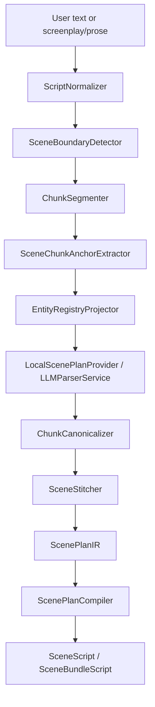
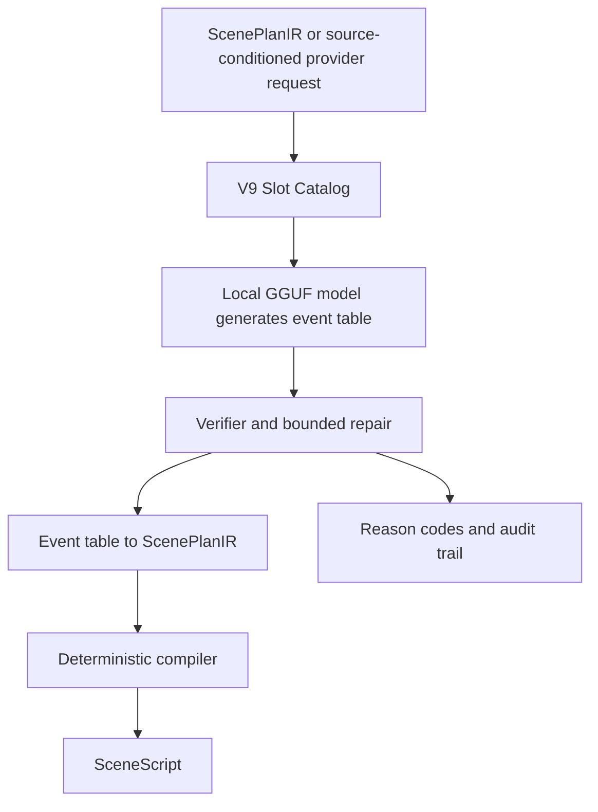
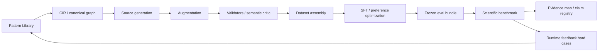
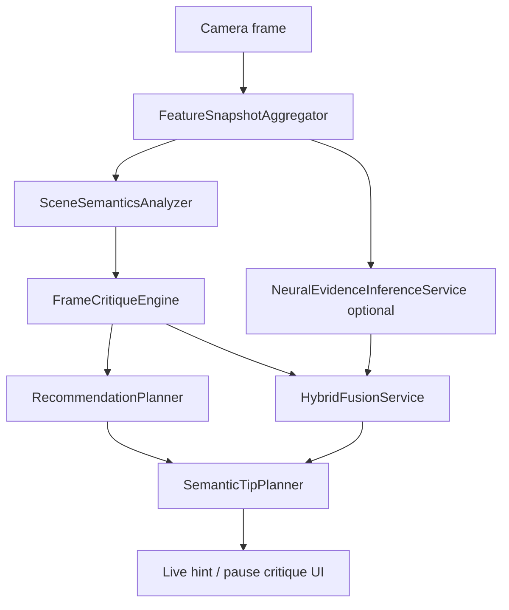

# Architecture Snapshot

Last verified commit: `02bdf3ae0b711ed5e0b7a640cbf808196d304b62`

## Крупные модули

| Модуль | Назначение | Deterministic / ML-based | Source-of-truth |
|---|---|---|---|
| Scene Generator runtime | Преобразование описания/сценарного текста в `SceneScript` and AR/previz-ready scene. | hybrid | `shafinMultitool/SceneGeneratorModule/**` |
| SceneBundlePipeline | Bundle-first parsing: normalize, split, chunk, canonicalize, stitch, compile. | mostly deterministic + local planner provider | `SceneBundlePipeline.swift`, `SceneBundleContracts.swift` |
| Local LLM provider | Локальное generation of `ScenePlanIR`, V9 event table or patch ops. | ML/LLM-based | `LLMParserService.swift`, `LlamaContext.swift` |
| ScenePlanCompiler | Deterministic `ScenePlanIR -> SceneScript`. | deterministic | `ScenePlanCompiler.swift` |
| SceneEventTableV9Service | Slot catalog, event table verification/repair, V9 compile to plan. | deterministic repair/compile around ML event draft | `SceneEventTableV9Service.swift` |
| SG data/training/eval | Offline generation/eval/training artifacts for v7/v8/v9. | deterministic pipeline + external/local models | `docs/SGv7pipeline/**`, `docs/SGv8pipeline/**`, `docs/SGv9pipeline/**`, `experiments/sc_benchmark/**` |
| Camera Analysis runtime | Live/pause frame feature aggregation, semantic analysis, critique and tips. | deterministic + CoreML/neural evidence optional | `shafinMultitool/Multitool2Module/**` |
| Camera Analysis eval | Deterministic compare and hybrid smoke eval. | deterministic replay/eval | `docs/cameraanalysis/eval/**` |

## Runtime flow: Scene Generator

## Runtime flow: V9 slot/event path

## Data/training/eval flow

## Camera Analysis flow

## Responsibility boundaries

| Boundary | Rule |
|---|---|
| Litreview vs project | Litreview claims are not verified by code. Use bridge claims for practical continuation. |
| Model output vs final scene | Model may produce plan/event draft; final product output should pass deterministic compile/verification. |
| Offline eval vs live runtime | Offline benchmark metrics and live smoke results must be reported separately. |
| Deterministic critique vs neural evidence | Camera deterministic v1 is verified; hybrid neural uplift remains limited until mobile gates pass. |
| Public contract vs internal contracts | `SceneScript` is public product contract; `CIR`, `ScenePlanIR`, V9 event table are internal/research contracts. |

## Основные контракты

| Contract | Scope | Files |
|---|---|---|
| `SceneScript` | Public scene structure. | `SceneScript.swift` |
| `ScenePlanIR` | Internal scene plan. | `ScenePlanning.swift` |
| `sg_v9_event_table_v1` | V9 compact event output. | `ScenePlanning.swift`, `SceneEventTableV9Service.swift`, `docs/SGv9pipeline/v9/contracts.py` |
| Scene bundle contracts | Document/chunk/stitch/bundle result. | `SceneBundleContracts.swift` |
| Camera Analysis contracts | Snapshot, semantics, critique, recommendation evidence. | `CameraAnalysisDomainContracts.swift` |
| Runtime/train contract | Prompt, grammar, serialization, decoding constraints. | `docs/SGv7pipeline/18-runtime-train-contract.md` |

## Как архитектура продолжает идеи litreview

Litreview identifies mobile constraints, AR/previsualization needs, and lack of explainable camera recommendations. The project responds with a mobile-first architecture where heavy generation is bounded by structured contracts, deterministic compilation and fallback, while camera advice is represented as evidence-linked critique instead of opaque aesthetic scores. Editing remains context rather than an implemented contribution.
