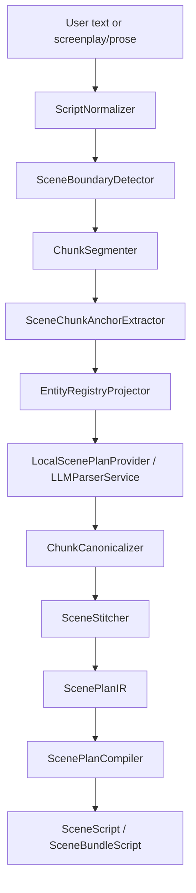
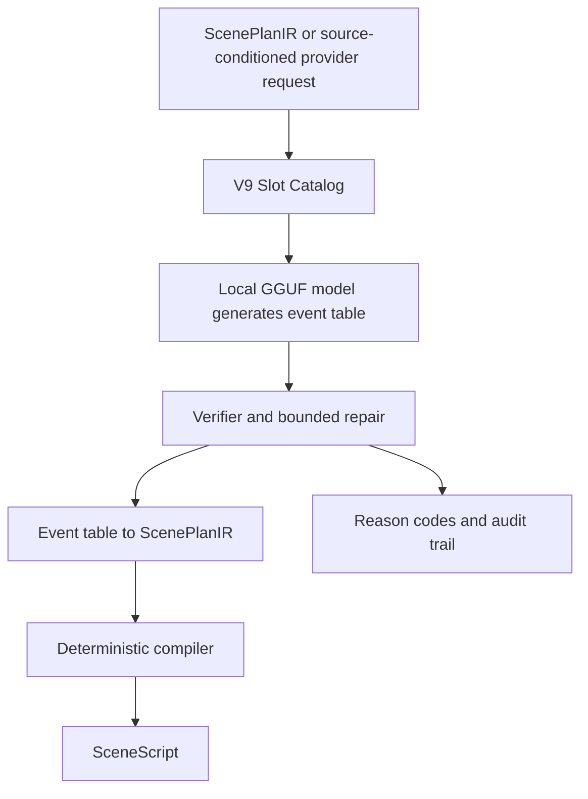
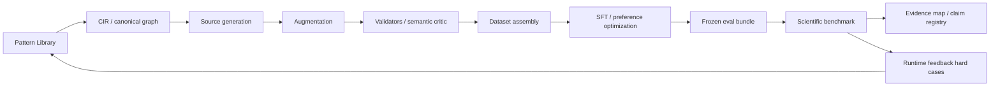
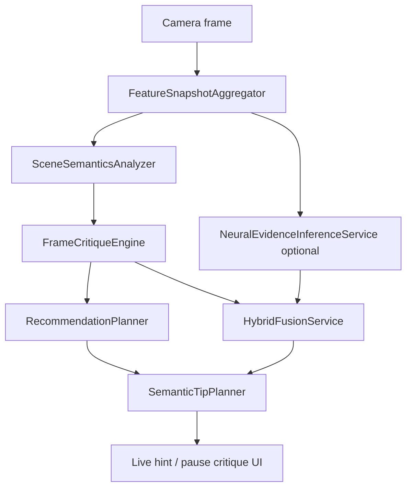

# Architecture Snapshot

2026-09-13 Q05 round-4 sync (`EV-REL-POLICY-001`, `EV-REL-DEFGAP-001`, `EV-REL-GUARDS-001`, `EV-REL-RIGHTS-CHAIN-001`; claims `CL-REL-POLICY-001`, `CL-REL-DEFGAP-001`, `CL-REL-GUARDS-001`, `CL-REL-RIGHTS-CHAIN-001`): the release acceptance layer is a versioned executable policy bound to the gate instrument in both directions (a value exactly on a frozen threshold passes, a one-value nudge fails exactly that gate, coverage checked both ways; `trained_head_mask` required; `false_improved` has no evaluator implementation), with the freeze mechanism re-proven on the real policy (silent drift exit 1 / version change exit 2, restore PASS). The §5.1 table is **not** fully defined: ten of 26 rows have a threshold and no operational definition in the repository, and a prepared 10-row/23-option packet is awaiting the owner. Several instrument defects are closed fail-closed (trained-head mask, linked weight-clearance basis, calibration-split-only threshold planning with policy coverage floors, zero-scan refusal in the release-log guard and freeze receipt, per-run release-gate output directory) and the rights chain now carries per-film decisions into notices and splits. All of this is tooling/contract evidence; no new pipeline/planner/tracker owner was introduced. Chapters 3/4/5/6 remain `needs_update`; `last_verified_commit` unchanged (dirty tree).

2026-09-13 Q05 round-3 sync (`EV-REL-NEURAL-001`, `EV-CA-SETCONTRACT-001`, `EV-CA-ML-005`, `EV-REL-RIGHTS-001`, `EV-REL-FREEZE-001`, `EV-REL-CITE-001`; claims `CL-REL-NEURAL-001`, `CL-CA-051`, `CL-CA-052`, `CL-REL-RIGHTS-001`, `CL-REL-FREEZE-001`, `CL-REL-CITE-001`): checked on the built product, the production neural evidence model is **absent** — `compact_neural_evidence_net` exists nowhere in the repository and the built Release `.app` ships exactly `aesthetic_nima_mobilenet_fp16.mlmodelc` and `DETRResnet50SemanticSegmentationF16P8.mlmodelc`, so `isModelAvailable == false` and the app runs the deterministic path plus two auxiliary models (`CL-REL-NEURAL-001`). The frozen `SETCompositionNet` contract has no production call site or consumer: `AnalysisPipeline.swift` has 0 matches, and the runtime provider builds 256/160 tensors while the contract (and the v2 export) declare 320/192 — recorded as C02 slice C `blocked_contract` (`CL-CA-051`). `tools/release/freeze_receipt.py` + `freeze_set.json` + the 10-artifact baseline receipt now make post-freeze edits non-silent (silent drift exit 1, versioned change exit 2; `--check` PASS, 7 tests) (`CL-REL-FREEZE-001`). The M05 v2 export path is tooling-validated only (7 inputs incl. separate `intent_features [1,9]`, 9 outputs in `head_order`, parity `2.518e-4`, `release_admissible=false`; tree hash not reproducible, `weights_sha256` stable) (`CL-CA-052`), and Packet A1 records first-source CC BY 3.0 facts with a fail-closed activation toolkit and 0 admitted corpora (`CL-REL-RIGHTS-001`). No new pipeline/planner/tracker owner was introduced. Chapter 3 remains `needs_update`; `last_verified_commit` unchanged (dirty tree).

2026-09-13 Q05 round-2 sync (`EV-CA-INGRESS-001`, `EV-CA-REVIEW-001`, `EV-CA-TENSOR-001`, `EV-HUMAN-PREP-001`, `EV-REL-TOOLS-001`; claims `CL-CA-045`, `CL-CA-046`, `CL-CA-047`, `CL-CA-050`, `CL-REL-TOOLS-001`): the C09 v3 proposal boundary now has a fail-closed ingress (single anchor frame, mandatory complete limits, typed refusal instead of truncation, rejected provider-owned fields, dependent-proposal removal) and a closed Release egress (default provider `nil`; `mock` offline with `supportsRemote == false`; `remote` only under `#if DEBUG`), with a read-only review projection that cannot turn a user's `human_input` into objective verification or a live episode. C02 slice B records the transform actually applied per tensor (fail-closed at `1e-9`) but exposes a ≤1-pixel two-seam crop-geometry divergence between the raster and logical-RGB paths, which is a later-package boundary, not a new owner. `tools/device/import_device_report.py` is a fail-closed evidence-intake boundary (pinned build/device/OS tuple; screenshot is not thermal proof) and the Apple 28 April 2026 Xcode 26+/iOS 26 SDK requirement was read at source (host: Xcode 26.6). No new pipeline/planner/tracker owner was introduced. Chapter 3 remains `needs_update`; `last_verified_commit` unchanged (dirty tree).

2026-09-13 Q05 sync: the external `setos-backend` now reads the clarification body as the bare `ClarificationAnswer` component that Swift already sends and OpenAPI already declares, with a durable cross-artifact guard, and the server enforces the documented validator plus a clarification round cap (`EV-SG-CLARIFY-001` / `CL-SG-CLARIFY-001`; `local_verify.sh` exit 0, 57/115 service tests, live HTTP roundtrip). This remains one local service boundary: staging/production were not raised and there is no real App Attest device roundtrip. In the Scene Generator path a production-reachable duplicate-phone defect was fixed by binding two provider slots of one real object into one identity and registering the new note-code, without adding a new pipeline owner (`EV-SG-SCENE-001`); the remote `SceneGenerationClient` is still not connected to the active bundle path (S03b). The Camera Analysis v3/N11 contract layer is a design boundary that is **not yet wired** into the production preprocessing or `AnalysisPipeline` (`EV-CA-COORD-001`), and the v3 registry is explicitly `not_a_stable_contract` (`EV-CA-REGISTRY-001`). Chapter 3 remains `needs_update`.

2026-09-12 attest-state update (`EV-SG-ATTEST-STATE-001`): one external SQLite state owner (own `attest_*` schema, fail-closed versioning, job-store connection hygiene) holds challenges, installation counters and hashed tokens as state plumbing only; the service admission path is unchanged and still denies 401. No second Scene-storage owner is introduced. Review-confirmed atomicity with bounded enrollment (installations are never auto-purged: counters are replay state, revoked rows are tombstones). Profile validation, service wiring, token transport and device qualification remain open; chapter3 remains `needs_update`.

2026-09-12 receipt update (`EV-SG-ATTEST-RECEIPT-001`): one external receipt validator completes the bounded App Attest primitive chain (certificate → assertion → receipt) without creating a second service-admission path; protected requests still deny 401 and the module returns no installation identity or token. Native OpenSSL is an explicitly qualified external process dependency (LibreSSL/PATH binaries rejected; Linux packaging open). Challenge/counter/token composition and device qualification remain open; chapter3 remains `needs_update`.

2026-09-11 assertion update (`EV-SG-ATTEST-ASSERTION-001`): one external signature primitive follows the certificate verifier, using cbor2 and cryptography without a new service-admission path. It authenticates bytes, not the whole App Attest profile or installation. Challenge/counter transactions, receipt validation and token composition remain necessary; chapter3 remains `needs_update`.

2026-09-11 certificate update (`EV-SG-ATTEST-CERT-001`): one external internal-use certificate verifier delegates path validation to cryptography with a pinned Apple trust root. It does not introduce an alternative service-admission path; protected requests still deny401. Full challenge/assertion/installation/token composition and device qualification remain open; chapter3 remains `needs_update`.

2026-09-11 retention update (`EV-SG-RETENTION-001`): local schema v2 retains a minimal response envelope separately from raw Scene input; the existing SQLite transaction owns timeout, deletion, replay and quota. One lifespan task performs independent maintenance and cooperatively awaits an active worker on shutdown; final26/26 service checks and spec/quality rechecks passed. There is no second storage/scheduler owner. Local storage evidence does not qualify production privacy, provider copies or deployment; chapter3 remains `needs_update`.

2026-09-11 quota update (`EV-SG-QUOTA-001`): accepted-job admission shares the existing SQLite jobs transaction and ownership, without a second mutable quota counter. OpenAPI adds create429; the single client preserves410 kill-switch meaning and surfaces a typed quota hint. Service17/17, request validation20/20, selected Swift5/5 plus synthetic clock probe passed. App Attest, retention, costs and deployment remain separate open gates; chapter3 remains `needs_update`.

Final episode update: existing metric owner now measures live command content for one shared band/occlusion reservation. `EV-CA-EPISODE-UI-001` final selected source checks27/27, spec/quality rechecks PASS; pending status below superseded. No new lifecycle/rendering owner; physical visual acceptance and release gates remain open.

2026-09-11 episode follow-up (`EV-CA-EPISODE-UI-001`): existing coordinator/verifier remain authoritative; UX consumes active baseline and matching result before frame-local planner output. Continue uses the existing synchronously fenced terminal-reset owner, without restarting capture or adding a lifecycle state machine. DEBUG publication now admits evidence through the same store as capture, not a second ordering policy. Selected integration evidence is partial; rail sizing quality finding/final-source checks remain pending. No external schema or model-admission change.

Final review update for `EV-CA-PREVIEW-001`: independent quality review PASS after source freeze, superseding the pending quality status below. Source-space/owner alignment accepted within this slice only; physical-preview and replanning limitations remain.

2026-09-11 preview follow-up (`EV-CA-PREVIEW-001`): existing coordinate owner now provides validated explicit Vision/coaching rectangle conversion and target helpers. Coordinator owns the shared frozen/idle/terminal preview projection; ViewModel, actual live surface and UX consume it. Duplicate binding flip and UI area/distance selection are removed. No new tracker, renderer or external schema. Selected current-source checks passed12/12, then1/1 on the final typed-provenance repair; spec review PASS, quality review pending. This supersedes the earlier unresolved source-projection note below, not physical-preview/replanning qualification. Chapters remain `needs_update`.

2026-09-11 follow-up: bounded demo admission now uses the same typed action and immutable subject binding as ordinary advice; demo annotations are retained only for the actually displayed accepted candidate. `EV-CA-VISIBLE-001` records final 20/20 selected tests plus independent spec/quality PASS, superseding the earlier pending review for this repair. Two earlier broader-run failures and actual preview/replanning qualification remain open; the next source slice addresses preview geometry, not model quality. No additional tracker or renderer was introduced.

2026-09-11: `EV-CA-VISIBLE-001` / `CL-CA-VISIBLE-001` record a shared immutable live-frame publication path in `AnalysisPipeline` and baseline-frame/capture-generation terminal reset fencing in `CameraViewModel`. Selected simulator checks passed 10/10; independent review remains pending because its agent could not launch. Selection continuity and episode transaction reset have separate responsibilities, without another tracker. This is not complete preview integration: the actual view still needs active-versus-terminal baseline selection and explicit coordinate-space repair. Structured replanning throughout movement is not established by the retained-hint continuation fixture. Camera/experimental chapters remain `needs_update`; model admission and release gates are unchanged.

2026-09-11: `EV-SG-WIRE-001` / `CL-SG-WIRE-001` record bounded Scene wire/hash repair: nested request Codable and actual-encoding canonicalization match Python for two directly exercised requests; Swift 10/10 and Python 11/11 passed, spec/quality reviews passed. This is not full server-schema admission or response ownership validation, and no deployed service or Generator integration is implied. Architecture/Scene chapters remain `needs_update`.

Last verified commit: `02bdf3ae0b711ed5e0b7a640cbf808196d304b62`

## Крупные модули

Implementation note, 2026-09-11: the existing Scene client now shares pre-network HTTPS/endpoint and bearer-token syntax admission across create/poll/answer/cancel. Its focused suite passed 10/10 on permitted iPhone 17e; `EV-SG-AUTH-001` / `CL-SG-AUTH-001` distinguish this from server-side App Attest/authorization and the still-unconnected Generator path. No new service/transport owner or deployment was introduced. Architecture/Scene chapter prose is unchanged and marked `needs_update`.

Planning note, 2026-09-11: [master plan §24](../../aegis/work/2026-09-03-gpt-5-6-pro-guidance/SET_OS_APP_STORE_1_0_CODEX_MASTER_PLAN_v2.md#24-план-доведения-до-app-store--2026-09-11) proposes delivery through one external backend and the existing local client owners, with a separate offline data/training workflow. The backend reference modules and implemented but unconnected Scene client are not a deployed service. New cloud Camera release scope remains approval-gated. Evidence: `EV-REL-PLAN-001`, claim `CL-REL-PLAN-001`; this is not an accepted production-architecture migration or runtime readiness claim.

| Модуль | Назначение | Deterministic / ML-based | Source-of-truth |
|---|---|---|---|
| Scene Generator runtime | Преобразование описания/сценарного текста в `SceneScript` and AR/previz-ready scene. | hybrid | `shafinMultitool/SceneGeneratorModule/**` |
| SceneBundlePipeline | Bundle-first parsing: normalize, split, chunk, canonicalize, stitch, compile. | mostly deterministic + local planner provider | `SceneBundlePipeline.swift`, `SceneBundleContracts.swift` |
| Local LLM provider | Локальное generation of `ScenePlanIR`, V9 event table or patch ops. | ML/LLM-based | `LLMParserService.swift`, `LlamaContext.swift` |
| ScenePlanCompiler | Deterministic `ScenePlanIR -> SceneScript`. | deterministic | `ScenePlanCompiler.swift` |
| SceneEventTableV9Service | Slot catalog, event table verification/repair, V9 compile to plan. | deterministic repair/compile around ML event draft | `SceneEventTableV9Service.swift` |
| SG data/training/eval | Offline generation/eval/training artifacts for v7/v8/v9. | deterministic pipeline + external/local models | `docs/SGv7pipeline/**`, `docs/SGv8pipeline/**`, `docs/SGv9pipeline/**`, `experiments/sc_benchmark/**` |
| Camera Analysis runtime | Live/pause frame feature aggregation, semantic analysis, critique and tips. | deterministic + CoreML/neural evidence optional | `shafinMultitool/Multitool2Module/**` |
| Camera Analysis eval | Deterministic compare and hybrid smoke eval. | deterministic replay/eval | `docs/cameraanalysis/eval/**` |

## Runtime flow: Scene Generator

```mermaid
flowchart TD
  A["User text or screenplay/prose"] --> B["ScriptNormalizer"]
  B --> C["SceneBoundaryDetector"]
  C --> D["ChunkSegmenter"]
  D --> E["SceneChunkAnchorExtractor"]
  E --> F["EntityRegistryProjector"]
  F --> G["LocalScenePlanProvider / LLMParserService"]
  G --> H["ChunkCanonicalizer"]
  H --> I["SceneStitcher"]
  I --> J["ScenePlanIR"]
  J --> K["ScenePlanCompiler"]
  K --> L["SceneScript / SceneBundleScript"]
```

## Runtime flow: V9 slot/event path

```mermaid
flowchart TD
  A["ScenePlanIR or source-conditioned provider request"] --> B["V9 Slot Catalog"]
  B --> C["Local GGUF model generates event table"]
  C --> D["Verifier and bounded repair"]
  D --> E["Event table to ScenePlanIR"]
  E --> F["Deterministic compiler"]
  F --> G["SceneScript"]
  D --> H["Reason codes and audit trail"]
```

## Data/training/eval flow

```mermaid
flowchart LR
  A["Pattern Library"] --> B["CIR / canonical graph"]
  B --> C["Source generation"]
  C --> D["Augmentation"]
  D --> E["Validators / semantic critic"]
  E --> F["Dataset assembly"]
  F --> G["SFT / preference optimization"]
  G --> H["Frozen eval bundle"]
  H --> I["Scientific benchmark"]
  I --> J["Evidence map / claim registry"]
  I --> K["Runtime feedback hard cases"]
  K --> A
```

## Camera Analysis flow

```mermaid
flowchart TD
  A["Camera frame"] --> B["FeatureSnapshotAggregator"]
  B --> C["SceneSemanticsAnalyzer"]
  C --> D["FrameCritiqueEngine"]
  D --> E["RecommendationPlanner"]
  E --> F["SemanticTipPlanner"]
  B --> G["NeuralEvidenceInferenceService optional"]
  G --> H["HybridFusionService"]
  D --> H
  H --> F
  F --> I["Live hint / pause critique UI"]
```

## Responsibility boundaries

Local preparation update, 2026-09-11: a separate `/Users/unterlantas/Documents/XCode/setos-backend` workspace now owns the local HTTP adapter and durable SQLite implementation; app-repository schemas/reference admission remain its explicit development dependency. This follows the existing single-service boundary, not a second app-bundled backend. Ten service tests and separate-process persistence checks passed (`EV-SG-SERVICE-001`); actual auth/provider/deployment/production retention remain unavailable. Historical statements about the absence of any service source must be read with this bounded update, not replaced by a production-readiness claim.

Working-tree update, 2026-09-11: the existing Scene client now owns shared typed-status admission and exact submitted request/job correlation; polling receives the original request/key explicitly, without a second context store. Its injected-transport suite passed 16/16 (`EV-SG-BINDING-001`). Production composition, stable user-level retry and clarification UI remain separate work; no real service endpoint was enabled by this repair.

Working-tree update, 2026-09-11: the existing Python Scene request gate consumes the frozen OpenAPI request component rather than maintaining a second manual field allowlist. It checks JSON representability, UUID format, complete previous-job ID syntax and canonical SHA-256 before acceptance. Evidence `EV-SG-ADMISSION-001`: 20 existing Python checks plus two actual Swift requests/two tampered variants. This remains a local admission boundary, not a deployed service or authorization system.

| Boundary | Rule |
|---|---|
| Litreview vs project | Litreview claims are not verified by code. Use bridge claims for practical continuation. |
| Model output vs final scene | Model may produce plan/event draft; final product output should pass deterministic compile/verification. |
| Offline eval vs live runtime | Offline benchmark metrics and live smoke results must be reported separately. |
| Deterministic critique vs neural evidence | Camera deterministic v1 is verified; hybrid neural uplift remains limited until mobile gates pass. |
| Public contract vs internal contracts | `SceneScript` is public product contract; `CIR`, `ScenePlanIR`, V9 event table are internal/research contracts. |

## Основные контракты

| Contract | Scope | Files |
|---|---|---|
| `SceneScript` | Public scene structure. | `SceneScript.swift` |
| `ScenePlanIR` | Internal scene plan. | `ScenePlanning.swift` |
| `sg_v9_event_table_v1` | V9 compact event output. | `ScenePlanning.swift`, `SceneEventTableV9Service.swift`, `docs/SGv9pipeline/v9/contracts.py` |
| Scene bundle contracts | Document/chunk/stitch/bundle result. | `SceneBundleContracts.swift` |
| Camera Analysis contracts | Snapshot, semantics, critique, recommendation evidence. | `CameraAnalysisDomainContracts.swift` |
| Runtime/train contract | Prompt, grammar, serialization, decoding constraints. | `docs/SGv7pipeline/18-runtime-train-contract.md` |

## Как архитектура продолжает идеи litreview

Litreview identifies mobile constraints, AR/previsualization needs, and lack of explainable camera recommendations. The project responds with a mobile-first architecture where heavy generation is bounded by structured contracts, deterministic compilation and fallback, while camera advice is represented as evidence-linked critique instead of opaque aesthetic scores. Editing remains context rather than an implemented contribution.
